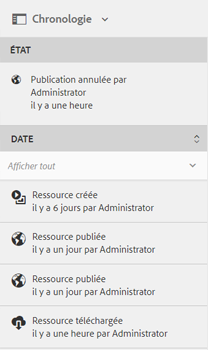

# Flux d’activité dans la chronologie {#activity-stream-in-timeline}

Cette fonctionnalité affiche les journaux d’activités correspondant aux ressources de la chronologie. Si vous effectuez les opérations liées aux ressources suivantes dans [!DNL Adobe Experience Manager Assets], la fonction de flux d’activités met à jour la chronologie afin de refléter l’activité.

Les opérations suivantes sont consignées dans le flux d’activités :

* Créer
* Supprimer
* Téléchargement (rendus compris)
* Publication
* Annuler la publication
* Approuver
* Refuser
* Déplacer

Les journaux d’activité à afficher dans la chronologie sont récupérés à partir de l’emplacement `/var/audit/com.day.cq.dam/content/dam` dans CRX, où les fichiers journaux sont stockés.

En outre, l’activité de la chronologie est consignée lorsque de nouvelles ressources sont chargées ou que des ressources existantes sont modifiées et archivées dans Experience Manager via [Adobe Asset Link](https://helpx.adobe.com/fr/enterprise/admin-guide.html/enterprise/using/manage-assets-using-adobe-asset-link.ug.html) ou [[!DNL Experience Manager] l’appli de bureau](https://experienceleague.adobe.com/docs/experience-manager-desktop-app/using/introduction.html?lang=fr).

>[!NOTE]
>
>Les workflows transitoires ne sont pas affichés dans la chronologie, car aucune information d’historique n’est enregistrée pour ces derniers.

Pour afficher le flux d’activités, effectuez une ou plusieurs des opérations sur la ressource, sélectionnez la ressource, puis sélectionnez **[!UICONTROL Chronologie]** dans la liste de navigation globale.

La chronologie affiche le flux d’activités des opérations que vous effectuez sur les ressources.

>[!NOTE]
>
>L’emplacement de stockage par défaut pour les tâches **Publier** et **Annuler la publication** est `/var/audit/com.day.cq.replication/content`. Pour les tâches **Déplacer**, l’emplacement par défaut est `/var/audit/com.day.cq.wcm.core.page`.
