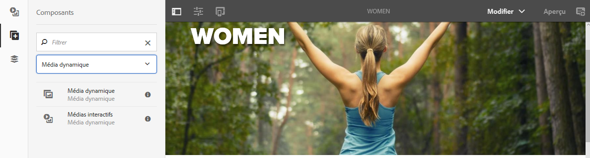
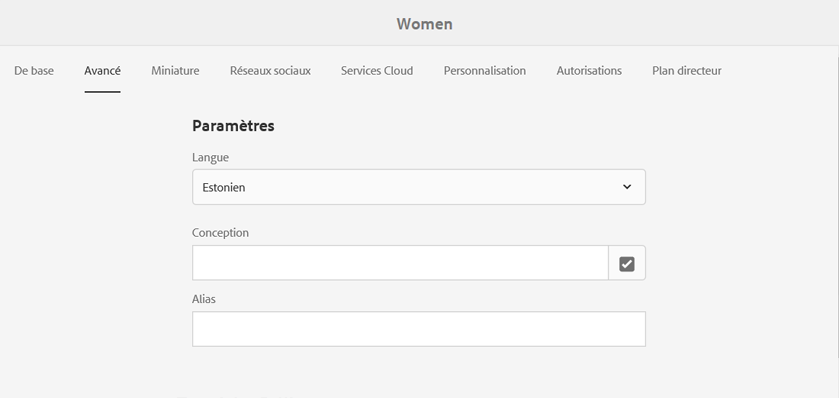
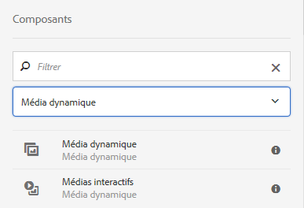
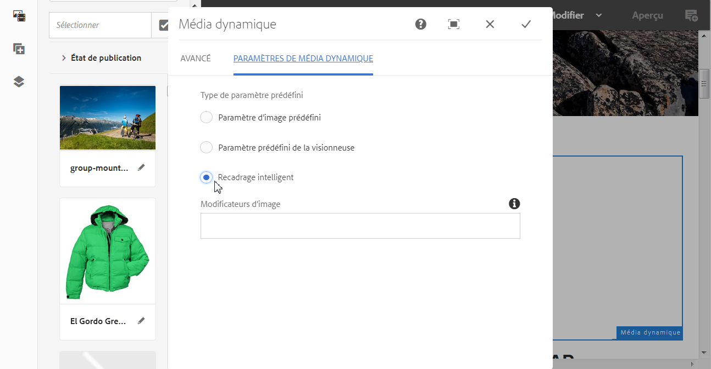
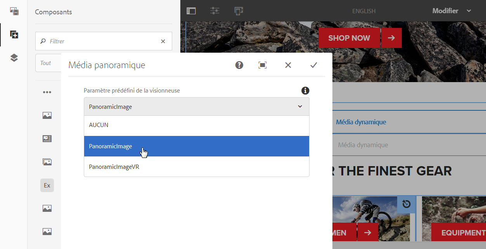

# Ajout de ressources Dynamic Media aux pages {#adding-dynamic-media-assets-to-pages}

Pour ajouter la fonctionnalité de média dynamique aux fichiers que vous utilisez sur vos sites Web, vous pouvez ajouter directement sur la page le composant **Dynamic Media** ou **Interactive Media**. Pour ce faire, vous devez activer le mode Mise en page et activer les composants Dynamic Media. Vous pouvez ensuite ajouter ces composants à la page et ajouter des ressources au composant. Les composants Dynamic Media et Interactive Media sont dynamiques : ils détectent si vous ajoutez une image ou une vidéo et les options disponibles changent en conséquence.

Vous pouvez ajouter directement des fichiers multimédias dynamiques à la page si vous utilisez AEM comme gestion de contenu Web. Si vous faites appel à un tiers pour votre gestion de contenu web, [liez](linking-urls-to-yourwebapplication.md) ou [incorporez](embed-code.md) vos ressources. Pour un site web tiers réactif, reportez-vous à la section [Diffusion d’images optimisées sur un site réactif](responsive-site.md).

>[!NOTE]
>
>Vous devez publier les ressources avant de les ajouter aux pages d’AEM. Voir [Publication de ressources Dynamic Media](publishing-dynamicmedia-assets.md).

## Ajout d’un composant Dynamic Media à une page  {#adding-a-dynamic-media-component-to-a-page}

Ajouter un composant Dynamic Media à une page revient à ajouter un composant à une page. Les composants Dynamic Media sont décrits en détail dans les sections suivantes.

>[!NOTE]
>
>S’il existe un composant Dynamic Media sur une page Web accessible par un utilisateur disposant d’autorisations en lecture seule, les sauts de page et les composants ne sont pas rendus correctement. La raison en est que la page est reconstruite pour s’assurer que les propriétés des composants sont correctes et que les ressources et configurations référencées sont accessibles. La page est alors rendue à nouveau, ce qui entraîne la coupure des composants ; le code de composant correspondant sur la page ne peut pas être rendu à nouveau en raison de l’accès en lecture seule de l’utilisateur.
>  
>Pour éviter ce problème, assurez-vous que les utilisateurs AEM Sites disposent des autorisations nécessaires pour accéder aux ressources.

1. Dans AEM, ouvrez la page où vous souhaitez ajouter le composant Dynamic Media.
1. Dans le panneau situé à gauche de la page (vous devrez peut-être activer/désactiver l’affichage du panneau latéral), cliquez sur l’icône **[!UICONTROL Composants]**.
1. Sous l’en-tête **[!UICONTROL Composants]**, dans la liste déroulante, sélectionnez **[!UICONTROL Dynamic Media]**. Si aucune liste de composants Dynamic Media n’est disponible, vous devrez probablement activer ceux que vous souhaitez utiliser. Voir [Activation des composants Dynamic Media](#enabling-dynamic-media-components).

   

1. Faites glisser un composant Dynamic Media que vous souhaitez utiliser sur la page à l’emplacement de votre choix.
1. Placez le pointeur de la souris directement sur le composant. Lorsque le composant est entouré d’une zone bleue, appuyez une fois pour afficher la barre d’outils du composant. Appuyez sur l’icône **** Configuration (clé à molette).
1. [Modifiez les ](#dynamic-media-components) composants si nécessaire et cochez la case pour enregistrer les modifications.

### Activation des composants Dynamic Media {#enabling-dynamic-media-components}

Si aucun composant Dynamic Media n’est disponible pour ajouter une page, cela signifie probablement que vous devez d’abord activer les composants que vous souhaitez utiliser.

1. Dans AEM, ouvrez la page où vous souhaitez ajouter le composant Dynamic Media.
1. Dans la partie gauche de la barre d’outils située en haut de la page, appuyez sur l’icône Informations de la page, puis sur **[!UICONTROL Modifier le modèle]** dans la liste déroulante.

   

1. Dans la liste déroulante située sur le côté droit de la barre d’outils, à proximité du haut de la page, appuyez sur **[!UICONTROL Structure]**.

   

1. À proximité du bas de la page, appuyez sur **[!UICONTROL Conteneur de mises en page]** pour ouvrir sa barre d’outils, puis appuyez sur l’icône Stratégie.
1. Sur la page **[!UICONTROL Conteneur de mises en page]**, sous l’en-tête **[!UICONTROL Propriétés]**, assurez-vous que l’onglet **[!UICONTROL Composants autorisés]** est sélectionné.

   

1. Faites défiler l’écran jusqu’à ce que vous voyiez **[!UICONTROL Dynamic Media]**.
1. Appuyez sur l’icône > située à gauche de **[!UICONTROL Dynamic Media]** pour développer la liste, puis sélectionnez les composants Dynamic Media à activer.

   

1. À proximité de l’angle supérieur droit de la page **[!UICONTROL Conteneur de mises en page]**, appuyez sur l’icône Terminé (coche).

1. Dans la liste déroulante située sur le côté droit de la barre d’outils, en haut de la page, appuyez sur **[!UICONTROL Contenu initial]**, puis [ajoutez un composant Dynamic Media à une page](#adding-a-dynamic-media-component-to-a-page) comme vous le faites habituellement.

## Localisation des composants Dynamic Media {#localizing-dynamic-media-components}

Vous pouvez rechercher les composants Dynamic Media de deux façons :

* Dans une page web de Sites, ouvrez **[!UICONTROL Propriétés]** et sélectionnez l’onglet **[!UICONTROL Avancé]**. Choisissez la langue souhaitée pour la localisation.

   

* Depuis le sélecteur de site, sélectionnez la page ou le groupe de pages souhaité. Appuyez sur **[!UICONTROL Propriétés]** et sélectionnez l’onglet **[!UICONTROL Avancé]**. Choisissez la langue souhaitée pour la localisation.

   >[!NOTE]
   >
   >Notez que toutes les langues disponibles dans le menu **[!UICONTROL Langue]** ne sont pas actuellement associées à des jetons.

## Composants Dynamic Media {#dynamic-media-components}

Dynamic Media et Interactive Media sont disponibles sous l&#39;onglet [!UICONTROL Dynamic Media] dans [!UICONTROL Composants]. Vous utilisez le composant [!UICONTROL Interactive Media] pour toutes les ressources interactives telles que du contenu vidéo interactif, des images interactives ou des ensembles de carrousels. Pour tous les autres composants Dynamic Media, utilisez le composant Dynamic Media.

>[!NOTE]
>
>Ces composants ne sont pas disponibles par défaut et doivent être rendus disponibles via l’éditeur de modèles avant utilisation. [Une fois les composants disponibles dans l’éditeur de modèles, vous pouvez les ajouter à votre page comme vous le feriez avec tout autre composant AEM.](/help/sites-authoring/templates.md#editing-templates-template-authors)

### Composant Dynamic Media {#dynamic-media-component}

Le composant Dynamic Media est intelligent ; selon que vous ajoutez une image ou une vidéo, vous disposez de différentes options. Le composant prend en charge les paramètres d’image prédéfinis, ainsi que les visionneuses d’images telles que les visionneuses d’images, les visionneuses à 360°, les visionneuses de médias mixtes et le contenu vidéo. En outre, le lecteur est réactif. Autrement dit, la taille de l’écran change automatiquement en fonction de la taille de l’écran. Toutes les visionneuses sont des visionneuses HTML5.

>[!NOTE]
>
>S’il existe un composant Dynamic Media, un composant Interactive Media ou les deux sur une page Web accessible par un utilisateur disposant d’autorisations en lecture seule, les sauts de page et les composants ne sont pas rendus correctement. La raison en est que la page est reconstruite pour s’assurer que les propriétés des composants sont correctes et que les ressources et configurations référencées sont accessibles. La page est alors rendue à nouveau, ce qui entraîne la coupure des composants ; le code de composant correspondant sur la page ne peut pas être rendu à nouveau en raison de l’accès en lecture seule de l’utilisateur.
>  
>Pour éviter ce problème, assurez-vous que les utilisateurs AEM Sites disposent des autorisations nécessaires pour accéder aux ressources.

>[!NOTE]
>
>Si vous ajoutez le composant Dynamic Media et si l’option **[!UICONTROL Paramètres de média dynamique]** est vide ou s’il est impossible d’ajouter correctement une ressource, vérifiez les points suivants :
>
>* Vous avez [activé Dynamic Media](config-dynamic.md). Par défaut, ce module complémentaire est désactivé.
>* L’image possède un fichier pyramid tiff. Les images importées avant l’activation de Dynamic Media ne possèdent pas de fichier pyramid tiff.

>

#### En cas d’utilisation d’images  {#when-working-with-images}

Le composant Dynamic Media permet d’ajouter des images dynamiques, notamment des visionneuses d’images, à 360 ° et de supports variés. Vous pouvez effectuer un zoom avant et arrière, faire pivoter une image dans une visionneuse à 360° ou sélectionner une image dans un autre type de visionneuse.

Vous pouvez également configurer directement dans le composant les paramètres prédéfinis de la visionneuse ou de l’image ou le format de l’image. Pour rendre une image réactive, vous pouvez définir les points d’arrêt ou appliquer un paramètre prédéfini d’image réactive.

Vous devez modifier les paramètres Dynamic Media suivants en cliquant sur l&#39;icône **[!UICONTROL Modifier]** dans le composant, puis sur **[!UICONTROL Paramètres Dynamic Media]**.

>[!NOTE]
>
>Par défaut, le composant d’image Dynamic Media est adaptatif. Si vous souhaitez en faire une taille fixe, définissez-la dans le composant de l&#39;onglet **[!UICONTROL Avancé]** avec les paramètres **[!UICONTROL Largeur]** et **[!UICONTROL Hauteur]**.

* **[!UICONTROL Paramètre]**
prédéfini de visionneuseSélectionnez un paramètre prédéfini existant dans le menu déroulant. Si le paramètre prédéfini de visionneuse que vous recherchez n’est pas visible, vous devrez le rendre visible. Voir Gestion des paramètres prédéfinis de visionneuse. Si vous utilisez un paramètre prédéfini d’image, vous ne pouvez pas sélectionner de paramètre prédéfini de visionneuse, et inversement.
Il s’agit de la seule option disponible si vous affichez des visionneuses d’images, à 360° ou de supports variés. Les paramètres prédéfinis de visionneuse sont également dynamiques : seuls les paramètres pertinents s’affichent.

* ****
modificateurs de visionneuseLes modificateurs de visionneuse prennent la forme d’une paire nom=valeur avec un délimiteur &amp; et vous permettent de modifier les visionneuses comme l’indique le Guide de référence des visionneuses. Un exemple de modificateur de visionneuse est posterimage=img.jpg&amp;caption=text.vtt,1 qui définit une image différente pour la miniature vidéo et associe un fichier de sous-titre/sous-titre fermé à la vidéo.

* **[!UICONTROL Paramètre]**
d’image prédéfiniSélectionnez un paramètre d’image prédéfini existant dans le menu déroulant. Si le paramètre d’image prédéfini que vous recherchez n’est pas visible, vous devrez le rendre visible. Voir Gestion des paramètres d’image prédéfinis. Si vous utilisez un paramètre prédéfini d’image, vous ne pouvez pas sélectionner de paramètre prédéfini de visionneuse, et inversement.
Cette option n’est pas disponible si vous affichez des visionneuses d’images, à 360° ou de supports variés.

* **[!UICONTROL Modificateurs d&#39;imageVous pouvez appliquer des effets d&#39;image en fournissant des commandes d&#39;image supplémentaires.]**
Ces commandes sont décrites dans la section Paramètres prédéfinis d’image et dans le guide de référence des commandes relatives aux images.
Cette option n’est pas disponible si vous affichez des visionneuses d’images, à 360° ou de supports variés.

* ****
Points d’arrêtSi vous utilisez ce fichier sur un site réactif, vous devez ajouter les points d’arrêt d’image. Les points d’arrêt d’image doivent être séparés par des virgules (,). Cette option fonctionne lorsqu’il n’existe aucune valeur de hauteur ou largeur définie dans un paramètre d’image prédéfini.
Cette option n’est pas disponible si vous affichez des visionneuses d’images, à 360° ou de supports variés.
Vous pouvez modifier les paramètres avancés ci-après en cliquant sur **[!UICONTROL Modifier]** dans le composant.

* ****
TitreModifiez le titre de l&#39;image.

* **[!UICONTROL Alt]**
TextAjoutez un titre à l&#39;image pour les utilisateurs dont les graphiques sont désactivés.
Cette option n’est pas disponible si vous affichez des visionneuses d’images, à 360° ou de supports variés.

* **[!UICONTROL URL, Ouvrir]**
dans Vous pouvez définir un fichier pour ouvrir un lien. Définissez l’URL, puis dans le champ Ouvrir dans, indiquez si vous souhaitez l’ouvrir dans la même fenêtre ou une nouvelle fenêtre.
Cette option n’est pas disponible si vous affichez des visionneuses d’images, à 360° ou de supports variés.

* **** Largeur et  ****
HauteurSaisissez la valeur en pixels si vous souhaitez que l’image soit d’une taille fixe. Si vous ne fournissez pas de valeurs, la ressource devient adaptative.

#### En cas d’utilisation de vidéos {#when-working-with-video}

Le composant Dynamic Media permet d’ajouter une vidéo dynamique à vos pages web. Lorsque vous modifiez le composant, vous pouvez choisir d’utiliser un paramètre prédéfini de la visionneuse de vidéos pour lire la vidéo sur la page.

Vous devez modifier les paramètres Dynamic Media suivants en cliquant sur **[!UICONTROL Modifier]** dans le composant.

>[!NOTE]
>
>Par défaut le composant vidéo Dynamic Media est adaptatif. Si vous souhaitez lui donner une taille fixe, définissez-la sous l’onglet **[!UICONTROL Avancé]** du composant, grâce aux options **[!UICONTROL Largeur]** et [!UICONTROL Hauteur].

* **[!UICONTROL Paramètre]**
prédéfini de visionneuseSélectionnez un paramètre prédéfini existant dans le menu déroulant. Si le paramètre prédéfini de visionneuse que vous recherchez n’est pas visible, vous devrez le rendre visible. Voir Gestion des paramètres prédéfinis de visionneuse.

* ****
modificateurs de visionneuseLes modificateurs de visionneuse prennent la forme d’une paire nom=valeur avec un délimiteur &amp; et vous permettent de modifier les visionneuses comme l’indique le Guide de référence des visionneuses d’Adobes. Un exemple de modificateur de visionneuse est posterimage=img.jpg&amp;caption=text.vtt,1

   Avec les modificateurs de visionneuse, par exemple, vous pouvez effectuer les opérations suivantes :

   * Associez un fichier de sous-titrage à une vidéo [caption.](https://docs.adobe.com/content/help/fr-FR/dynamic-media-developer-resources/library/viewers-aem-assets-dmc/video/command-reference-url-video/r-html5-video-viewer-url-caption.html)
   * Associez un fichier de navigation à une vidéo [navigation.](https://docs.adobe.com/content/help/fr-FR/dynamic-media-developer-resources/library/viewers-aem-assets-dmc/video/command-reference-url-video/r-html5-video-viewer-url-navigation.html)

Vous pouvez modifier les [!UICONTROL Paramètres avancés] suivants en cliquant sur **[!UICONTROL Modifier]** dans le composant.

* ****
TitreModifiez le titre de la vidéo.

* **** Largeur et  ****
HauteurSaisissez une valeur en pixels si vous souhaitez que la vidéo soit d’une taille fixe. Si vous ne fournissez pas de valeurs, la vidéo devient adaptative.

#### Lorsque vous utilisez le recadrage intelligent {#when-working-with-smart-crop}

Utilisez le composant Dynamic Media pour ajouter des ressources d’images avec recadrage intelligent à vos pages web. Lorsque vous modifiez le composant, vous pouvez choisir d’utiliser un paramètre prédéfini de la visionneuse de vidéos pour lire la vidéo sur la page.

Voir aussi [Profils d’image](image-profiles.md).

Vous pouvez modifier les [!UICONTROL Paramètres de Dynamic Media] suivants en cliquant sur **[!UICONTROL Modifier]** dans le composant.

>[!NOTE]
>
>Par défaut, le composant d’image Dynamic Media est adaptatif. Si vous souhaitez faire en sorte qu’il ait une taille fixe, définissez-la dans le composant de l’onglet [!UICONTROL Avancé] à l’aide des options **[!UICONTROL Largeur]** et **[!UICONTROL Hauteur]**.

* **[!UICONTROL Modificateurs d&#39;imageVous pouvez appliquer des effets d&#39;image en fournissant des commandes d&#39;image supplémentaires.]**
Ces commandes sont décrites dans la section Paramètres prédéfinis d’image et dans le guide de référence des commandes relatives aux images.
Cette option n’est pas disponible si vous affichez des visionneuses d’images, à 360° ou de supports variés.

Vous pouvez modifier les paramètres **[!UICONTROL Avancés]** suivants en cliquant sur **[!UICONTROL Modifier]** dans le composant.

* ****
TitreModifiez le titre de l’image de recadrage dynamique.

* **[!UICONTROL Alt]**
TextAjoutez un titre à l’image de recadrage dynamique pour les utilisateurs dont les graphiques sont désactivés.
Cette option n’est pas disponible si vous affichez des visionneuses d’images, à 360° ou de supports variés.

* **[!UICONTROL URL, Ouvrir]**
dans Vous pouvez définir un fichier pour ouvrir un lien. Définissez l’URL, puis dans le champ Ouvrir dans, indiquez si vous souhaitez l’ouvrir dans la même fenêtre ou une nouvelle fenêtre.
Cette option n’est pas disponible si vous affichez des visionneuses d’images, à 360° ou de supports variés.

* **** Hauteur et  ****
LargeurSaisissez une valeur en pixels si vous souhaitez que la taille de l’image de recadrage dynamique soit fixe. Si vous ne fournissez pas de valeurs, la vidéo devient adaptative.

### Composant multimédia interactif {#interactive-media-component}

Le composant Interactive Media est destiné aux ressources présentant des éléments interactifs tels que des zones réactives ou des zones cliquables. Si vous disposez d’une image interactive, d’une vidéo interactive ou d’une bannière de carrousel, utilisez le composant Interactive Media.

Le composant Interactive Media est intelligent. Selon que vous ajoutez une image ou une vidéo, vous disposez de différentes options. En outre, la visionneuse est réactive : la taille de l’écran change automatiquement en fonction de la taille d’écran. Toutes les visionneuses sont des visionneuses HTML5.

>[!NOTE]
>
>S’il existe un composant Dynamic Media, un composant Interactive Media ou les deux sur une page Web accessible par un utilisateur disposant d’autorisations en lecture seule, les sauts de page et les composants ne sont pas rendus correctement. La raison en est que la page est reconstruite pour s’assurer que les propriétés des composants sont correctes et que les ressources et configurations référencées sont accessibles. La page est alors rendue à nouveau, ce qui entraîne la coupure des composants ; le code de composant correspondant sur la page ne peut pas être rendu à nouveau en raison de l’accès en lecture seule de l’utilisateur.
> 
>Pour éviter ce problème, assurez-vous que les utilisateurs AEM Sites disposent des autorisations nécessaires pour accéder aux ressources.

Vous pouvez modifier les paramètres **[!UICONTROL Général]** ci-après en cliquant sur **[!UICONTROL Modifier]** dans le composant.

* **[!UICONTROL Paramètre]**
prédéfini de visionneuseSélectionnez un paramètre prédéfini existant dans le menu déroulant. Si le paramètre prédéfini de visionneuse que vous recherchez n’est pas visible, vous devrez le rendre visible. Les paramètres de visionneuse prédéfinis doivent être publiés avant de pouvoir être utilisés. Voir Gestion des paramètres prédéfinis de visionneuse.

* ****
TitreModifiez le titre de la vidéo.

* **** Largeur et  ****
HauteurSaisissez une valeur en pixels si vous souhaitez que la vidéo soit d’une taille fixe. Si vous ne fournissez pas de valeurs, la vidéo devient adaptative.

Vous pouvez modifier les paramètres **[!UICONTROL Ajouter au panier]** ci-après en cliquant sur **[!UICONTROL Modifier]** dans le composant.

* **[!UICONTROL Afficher le]**
fichier de produit Par défaut, cette valeur est sélectionnée. La ressource de produit affiche une image du produit telle que définie dans le module Commerce. Désactivez la case pour ne pas afficher la ressource de produit.

* **[!UICONTROL Afficher le]**
prix du produitPar défaut, cette valeur est sélectionnée. Le prix du produit affiche le prix de l’élément tel qu’il est défini dans le module Commerce. Désactivez la case pour ne pas afficher le prix du produit.

* **[!UICONTROL Afficher le]**
formulaire de produit Par défaut, cette valeur n’est pas sélectionnée. Le formulaire de produit contient toutes les variantes de produit, telles que la taille et la couleur. Désactivez la case pour ne pas afficher les variantes de produit.

### Composant Media panoramique {#panoramic-media-component}

Le composant de média panoramique est destiné aux ressources qui sont des images panoramiques sphériques. Ces images fournissent une expérience d’affichage à 360° d’une pièce, d’une propriété, d’un lieu ou d’un paysage. Pour qu’une image soit un panorama sphérique, elle doit posséder l’une ou l’autre des propriétés suivantes, ou les deux :

* Un rapport d’aspect de 2:1.
* Balisée avec les mots-clés « équirectangulaire » ou (« sphérique » + « panorama ») ou (« sphérique » + « panoramique »). Voir [Utilisation des balises](/help/sites-authoring/tags.md).

Les critères de rapport d’aspect et de mots-clés s’appliquent tous deux aux ressources panoramiques pour la page des détails des ressources et le composant WCM « médias panoramiques ».

Vous pouvez modifier le paramètre suivant en appuyant sur **[!UICONTROL Modifier]** dans le composant.

* **[!UICONTROL Paramètre]**
prédéfini de visionneuseSélectionnez une visionneuse existante dans le menu déroulant Paramètre prédéfini de visionneuse.

Si le paramètre prédéfini de la visionneuse que vous recherchez n’est pas visible, vérifiez qu’il est publié. Vous devez publier les paramètres prédéfinis de la visionneuse avant que vous puissiez les utiliser. Voir [Gestion des paramètres prédéfinis de visionneuse](managing-viewer-presets.md).

### Utilisation de HTTP/2 pour la diffusion de ressources Dynamic Media {#using-http-to-delivery-dynamic-media-assets}

HTTP/2 est le nouveau protocole web qui améliore la manière dont les serveurs et les navigateurs communiquent. Il permet un transfert rapide d’informations et réduit la puissance de traitement nécessaire. Les ressources Dynamic Media peuvent désormais être diffusées sur HTTP/2, un protocole qui garantit de meilleurs temps de réponse et de chargement.

Voir [Diffusion du contenu sur HTTP2](http2.md) pour tout savoir sur l’utilisation du protocole HTTP/2 avec votre compte Dynamic Media.

>[!MORELIKETHIS]
>
>* [Explication de la gestion des couleurs avec AEM Dynamic Media](https://helpx.adobe.com/experience-manager/kt/assets/using/dynamic-media-color-management-technical-video-setup.html)
>* [Utilisation de miniatures vidéo personnalisées avec AEM Dynamic Media](https://helpx.adobe.com/experience-manager/kt/assets/using/dynamic-media-video-thumbnails-feature-video-use.html)
>* [Présentation de la visionneuse d’éléments avec AEM Dynamic Media](https://helpx.adobe.com/experience-manager/kt/assets/using/dynamic-media-viewer-feature-video-understand.html)
>* [Utilisation de la vidéo interactive avec AEM Dynamic Media](https://helpx.adobe.com/experience-manager/kt/assets/using/dynamic-media-interactive-video-feature-video-use.html)
>* [Utilisation du lecteur vidéo dans AEM Dynamic Media](https://helpx.adobe.com/experience-manager/kt/assets/using/dynamic-media-video-player-feature-video-use.html)
>* [Utilisation de l’accentuation d’image avec AEM Dynamic Media](https://helpx.adobe.com/experience-manager/6-4/assets/using/best-practices-for-optimizing-the-quality-of-your-images.html)

