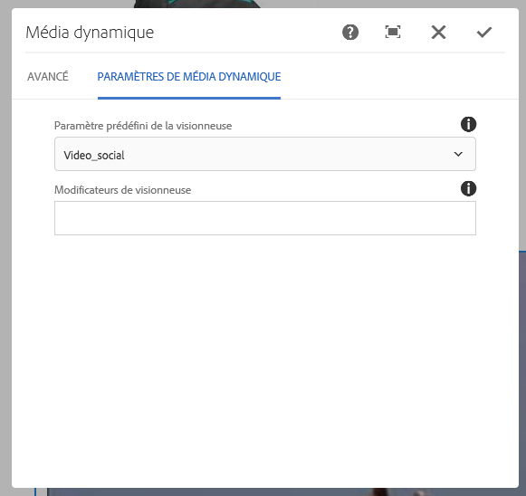

# Ajout de ressources Dynamic Media aux pages {#adding-dynamic-media-assets-to-pages}

To add the dynamic media functionality to assets you use on your websites, you can add the **Dynamic Media** or **Interactive Media** component directly on the page. Pour ce faire, vous devez activer le mode Mise en page et activer les composants Dynamic Media. Vous pouvez ensuite ajouter ces composants à la page et ajouter des ressources au composant. Les composants Dynamic Media et Interactive Media sont dynamiques : ils détectent si vous ajoutez une image ou une vidéo et les options disponibles changent en conséquence.

Vous ajoutez directement des fichiers de médias dynamiques à la page si vous utilisez AEM comme gestion de contenu Web. Si vous faites appel à un tiers pour votre gestion de contenu web, [liez](linking-urls-to-yourwebapplication.md) ou [incorporez](embed-code.md) vos ressources. Pour un site web tiers réactif, reportez-vous à la section [Diffusion d’images optimisées sur un site réactif](responsive-site.md).

>[!NOTE]
>
>Vous devez publier les ressources avant de les ajouter aux pages d’AEM. Voir [Publication de ressources Dynamic Media](publishing-dynamicmedia-assets.md).

## Ajout d’un composant Dynamic Media à une page {#adding-a-dynamic-media-component-to-a-page}

L’ajout d’un composant Dynamic Media ou Interactive Media à une page est identique à l’ajout d’un composant sur n’importe quelle page. Les composants Dynamic Media et Interactive Media sont décrits en détail dans les sections suivantes.

>[!NOTE]
>
>S’il existe un composant Contenu multimédia dynamique, un composant Contenu multimédia interactif ou les deux sur une page Web accessible par un utilisateur disposant d’autorisations en lecture seule, les sauts de page et les composants ne sont pas rendus correctement. La raison en est que la page est reconstruite pour s’assurer que les propriétés des composants sont correctes et que les ressources et configurations référencées sont accessibles. La page est alors rendue à nouveau, ce qui provoque le saut des composants ; le code de composant correspondant sur la page ne peut pas être rendu à nouveau en raison de l’accès en lecture seule de l’utilisateur.
>  
>Pour éviter ce problème, assurez-vous que les utilisateurs des sites AEM disposent des autorisations nécessaires pour accéder aux ressources.

1. Dans AEM, ouvrez la page où vous souhaitez ajouter le composant Dynamic Media ou Interactive Media.
1. In the left pane, click the **[!UICONTROL Components]** icon and filter for **[!UICONTROL Dynamic Media]**. Si aucun composant Dynamic Media n’est disponible, vous devez activer les composants Dynamic Media. See [Editing Page Templates](/help/sites-authoring/templates.md#editing-templates-template-authors) for more information.

   

1. Drag the **[!UICONTROL Dynamic Media]** or **[!UICONTROL Interactive Media]** component onto the page in the desired location.
1. Click the blue box around the component, then tap the **[!UICONTROL Configuration]** (wrench) icon.
1. [Modifiez les composants](#dynamic-media-components) selon vos besoins et cliquez sur la coche pour enregistrer les modifications.

## Localizing Dynamic Media components {#localizing-dynamic-media-components}

Vous pouvez rechercher les composants Dynamic Media de deux façons :

* Dans une page web de Sites, ouvrez **[!UICONTROL Propriétés]** et sélectionnez l’onglet **[!UICONTROL Avancé]**. Sélectionnez la langue souhaitée.

   

* Depuis le sélecteur de site, sélectionnez la page ou le groupe de pages souhaité. Tap **[!UICONTROL Properties]** and select the **[!UICONTROL Advanced]** tab. Sélectionnez la langue souhaitée.

   >[!NOTE]
   >
   >Please note that not all languages available in the **[!UICONTROL Language]** menu currently have tokens assigned.

## Dynamic Media components {#dynamic-media-components}

Dynamic Media and Interactive Media are available under the [!UICONTROL Dynamic Media] tab in [!UICONTROL Components]. Vous utilisez le composant Interactive Media] pour tout fichier interactif, tel que la vidéo interactive, les images interactives ou les visionneuses de carrousel. Pour tous les autres composants Dynamic Media, utilisez le composant Dynamic Media.

>[!NOTE]
>
>Ces composants ne sont pas disponibles par défaut et doivent être rendus disponibles via l’éditeur de modèles avant utilisation. [Une fois les composants disponibles dans l’éditeur de modèles](/help/sites-authoring/templates.md#editing-templates-template-authors), vous pouvez les ajouter à votre page comme vous le feriez avec tout autre composant AEM.

### Composant Dynamic Media {#dynamic-media-component}

Le composant Contenu multimédia dynamique est intelligent ; selon que vous ajoutez une image ou une vidéo, vous disposez de différentes options. Le composant prend en charge les paramètres d’image prédéfinis, ainsi que les visionneuses d’images telles que les visionneuses d’images, les visionneuses à 360°, les visionneuses de médias mixtes et le contenu vidéo. En outre, le lecteur est réactif. Autrement dit, la taille de l’écran change automatiquement en fonction de la taille de l’écran. Toutes les visionneuses sont des visionneuses HTML5.

>[!NOTE]
>
>S’il existe un composant Contenu multimédia dynamique, un composant Contenu multimédia interactif ou les deux sur une page Web accessible par un utilisateur disposant d’autorisations en lecture seule, les sauts de page et les composants ne sont pas rendus correctement. La raison en est que la page est reconstruite pour s’assurer que les propriétés des composants sont correctes et que les ressources et configurations référencées sont accessibles. La page est alors rendue à nouveau, ce qui provoque le saut des composants ; le code de composant correspondant sur la page ne peut pas être rendu à nouveau en raison de l’accès en lecture seule de l’utilisateur.
>  
>Pour éviter ce problème, assurez-vous que les utilisateurs des sites AEM disposent des autorisations nécessaires pour accéder aux ressources.

>[!NOTE]
>
>Si vous ajoutez le composant Dynamic Media et si l’option **[!UICONTROL Paramètres de média dynamique]** est vide ou s’il est impossible d’ajouter correctement une ressource, vérifiez les points suivants :
>
>* Vous avez [activé Dynamic Media](config-dynamic.md). Par défaut, ce module complémentaire est désactivé.
>* L’image possède un fichier pyramid tiff. Les images importées avant l’activation de Dynamic Media ne possèdent pas de fichier pyramid tiff.
>

#### En cas d’utilisation d’images {#when-working-with-images}

Le composant Dynamic Media permet d’ajouter des images dynamiques, notamment des visionneuses d’images, à 360 ° et de supports variés. Vous pouvez effectuer un zoom avant et arrière, faire pivoter une image dans une visionneuse à 360 °ou sélectionner une image dans un autre type de visionneuse.

Vous pouvez également configurer directement dans le composant les paramètres prédéfinis de la visionneuse ou de l’image ou le format de l’image. Pour rendre une image réactive, vous pouvez définir les points d’arrêt ou appliquer un paramètre prédéfini d’image réactive.

You can edit the following Dynamic Media Settings by clicking the **[!UICONTROL Edit]** icon in the component and then **[!UICONTROL Dynamic Media Settings]**.

>[!NOTE]
>
>Par défaut, le composant d’image Dynamic Media est adaptatif. If you want to make it a fixed size, set it in the component in the **[!UICONTROL Advanced]** tab with the **[!UICONTROL Width]** and **[!UICONTROL Height]** settings.

* **[!UICONTROL Paramètre prédéfini]**de la visionneuse Sélectionnez un paramètre prédéfini existant dans le menu déroulant. Si le paramètre prédéfini de visionneuse que vous recherchez n’est pas visible, vous devrez le rendre visible. Voir Gestion des paramètres prédéfinis de visionneuse. Si vous utilisez un paramètre prédéfini d’image, vous ne pouvez pas sélectionner de paramètre prédéfini de visionneuse, et inversement.
Il s’agit de la seule option disponible si vous affichez des visionneuses d’images, à 360° ou de supports variés. Les paramètres prédéfinis de visionneuse sont également dynamiques : seuls les paramètres pertinents s’affichent.

* **[!UICONTROL Modificateurs]** de visionneuse Les modificateurs de visionneuse prennent la forme d’une paire nom=valeur avec un délimiteur &amp; et vous permettent de modifier les visionneuses comme indiqué dans le Guide de référence des visionneuses. Un exemple de modificateur de visionneuse est posterimage=img.jpg&amp;caption=text.vtt,1 qui définit une image différente pour la miniature vidéo et associe un fichier de sous-titre/sous-titre fermé à la vidéo.

* **[!UICONTROL Paramètre d’image prédéfini]**Sélectionnez un paramètre d’image prédéfini existant dans le menu déroulant. Si le paramètre prédéfini d’image que vous recherchez n’est pas visible, vous devrez le rendre visible. Voir Gestion des paramètres d’image prédéfinis. Si vous utilisez un paramètre prédéfini d’image, vous ne pouvez pas sélectionner de paramètre prédéfini de visionneuse, et inversement.
Cette option n’est pas disponible si vous affichez des visionneuses d’images, à 360 ° ou de supports variés.

* **[!UICONTROL Modificateurs]**d’image Vous pouvez appliquer des effets d’image en fournissant des commandes d’image supplémentaires. Ces commandes sont décrites dans les sections Paramètres prédéfinis d’image et Command reference (Référence de commande).
Cette option n’est pas disponible si vous affichez des visionneuses d’images, à 360 ° ou de supports variés.

* **[!UICONTROL Points d’arrêt]**Si vous utilisez ce fichier sur un site réactif, vous devez ajouter les points d’arrêt d’image. Les points d’arrêt d’image doivent être séparés par des virgules (,). Cette option fonctionne lorsqu’il n’existe aucune valeur de hauteur ou largeur définie dans un paramètre d’image prédéfini.
Cette option n’est pas disponible si vous affichez des visionneuses d’images, à 360 ° ou de supports variés.
You can edit the following Advanced Settings by clicking **[!UICONTROL Edit]** in the component.

* **[!UICONTROL Titre]** Modifiez le titre de l’image.

* **[!UICONTROL Texte]**de remplacement Ajoutez un titre à l’image pour les utilisateurs dont les graphiques sont désactivés.
Cette option n’est pas disponible si vous affichez des visionneuses d’images, à 360 ° ou de supports variés.

* **[!UICONTROL URL, Ouvrir dans]**Vous pouvez définir un fichier pour ouvrir un lien. Définissez l’URL, puis dans le champ Ouvrir dans, indiquez si vous souhaitez l’ouvrir dans la même fenêtre ou une nouvelle fenêtre.
Cette option n’est pas disponible si vous affichez des visionneuses d’images, à 360 ° ou de supports variés.

* **[!UICONTROL Largeur]** et **[!UICONTROL Hauteur]** Entrez une valeur en pixels si vous souhaitez que l’image soit de taille fixe. Si vous ne fournissez pas de valeurs, la ressource devient adaptative.

#### En cas d’utilisation de vidéos {#when-working-with-video}

Utilisez le composant Contenu multimédia dynamique pour ajouter de la vidéo dynamique à vos pages Web. Lorsque vous modifiez le composant, vous pouvez choisir d’utiliser un paramètre prédéfini de la visionneuse de vidéos pour lire la vidéo sur la page.

You can edit the following Dynamic Media Settings by clicking **[!UICONTROL Edit]** in the component.

>[!NOTE]
>
>Par défaut le composant vidéo Dynamic Media est adaptatif. If you want to make it a fixed size, set it in the component with the **[!UICONTROL Width]** and **[!UICONTROL Height]** in the [!UICONTROL Advanced] tab.

* **[!UICONTROL Paramètre prédéfini]** de la visionneuse Sélectionnez un paramètre prédéfini existant dans le menu déroulant. Si le paramètre prédéfini de visionneuse que vous recherchez n’est pas visible, vous devrez le rendre visible. Voir Gestion des paramètres prédéfinis de visionneuse.

* **[!UICONTROL Modificateurs]** de visionneuse Les modificateurs de visionneuse prennent la forme d’une paire nom=valeur avec un délimiteur &amp; et vous permettent de modifier les visionneuses comme indiqué dans le Guide de référence des visionneuses Adobe. Un exemple de modificateur de visionneuse est posterimage=img.jpg&amp;caption=text.vtt,1

   Avec les modificateurs de la visionneuse, par exemple, vous pouvez effectuer les opérations suivantes :

   * Associate a caption file with a video [https://marketing.adobe.com/resources/help/en_US/s7/viewers_ref/r_html5_video_viewer_url_caption.html](https://marketing.adobe.com/resources/help/en_US/s7/viewers_ref/r_html5_video_viewer_url_caption.html)
   * Associate a navigation file with a video [https://marketing.adobe.com/resources/help/en_US/s7/viewers_ref/r_html5_video_viewer_url_navigation.html](https://marketing.adobe.com/resources/help/en_US/s7/viewers_ref/r_html5_video_viewer_url_navigation.html)

You can edit the following [!UICONTROL Advanced Settings] by clicking **[!UICONTROL Edit]** in the component.

* **[!UICONTROL Titre]** Modifiez le titre de la vidéo.

* **[!UICONTROL Largeur]** et **[!UICONTROL Hauteur]** Entrez une valeur en pixels si vous souhaitez que la vidéo soit d’une taille fixe. Si vous ne fournissez pas de valeurs, la vidéo devient adaptative.

#### Lorsque vous utilisez le recadrage intelligent {#when-working-with-smart-crop}

Utilisez le composant Contenu multimédia dynamique pour ajouter des fichiers d’image de recadrage dynamique à vos pages Web. Lorsque vous modifiez le composant, vous pouvez choisir d’utiliser un paramètre prédéfini de la visionneuse de vidéos pour lire la vidéo sur la page.

Voir aussi [Profils d’image](image-profiles.md).

You can edit the following [!UICONTROL Dynamic Media Settings] by clicking **[!UICONTROL Edit]** in the component.

>[!NOTE]
>
>Par défaut, le composant d’image Dynamic Media est adaptatif. Si vous souhaitez faire en sorte qu’il ait une taille fixe, définissez-la dans le composant de l’onglet [!UICONTROL Avancé] à l’aide des options **[!UICONTROL Largeur]** et **[!UICONTROL Hauteur]**.

* **[!UICONTROL Modificateurs]**d’image Vous pouvez appliquer des effets d’image en fournissant des commandes d’image supplémentaires. Ces commandes sont décrites dans les sections Paramètres prédéfinis d’image et Command reference (Référence de commande).
Cette option n’est pas disponible si vous affichez des visionneuses d’images, à 360 ° ou de supports variés.

You can edit the following **[!UICONTROL Advanced]** settings by clicking **[!UICONTROL Edit]** in the component.

* **[!UICONTROL Titre]** Modifiez le titre de l’image de recadrage dynamique.

* **[!UICONTROL Texte]**de remplacement Ajoutez un titre à l’image de recadrage dynamique pour les utilisateurs dont les graphiques sont désactivés.
Cette option n’est pas disponible si vous affichez des visionneuses d’images, à 360 ° ou de supports variés.

* **[!UICONTROL URL, Ouvrir dans]**Vous pouvez définir un fichier pour ouvrir un lien. Définissez l’URL, puis dans le champ Ouvrir dans, indiquez si vous souhaitez l’ouvrir dans la même fenêtre ou une nouvelle fenêtre.
Cette option n’est pas disponible si vous affichez des visionneuses d’images, à 360 ° ou de supports variés.

* **[!UICONTROL Hauteur** et **[!UICONTROL Largeur]** Saisissez une valeur en pixels si vous souhaitez que l’image de recadrage dynamique ait une taille fixe. Si vous ne fournissez pas de valeurs, la vidéo devient adaptative.

### Interactive Media component {#interactive-media-component}

Le composant Interactive Media est destiné aux ressources présentant des éléments interactifs tels que des zones réactives ou des zones cliquables. Si vous disposez d’une image interactive, d’une vidéo interactive ou d’une bannière de carrousel, utilisez le composant Interactive Media.

Le composant Interactive Media est intelligent ; selon que vous ajoutez une image ou une vidéo, vous disposez de différentes options. En outre, la visionneuse est réactive : la taille de l’écran change automatiquement en fonction de la taille d’écran. Toutes les visionneuses sont des visionneuses HTML5.

>[!NOTE]
>
>S’il existe un composant Contenu multimédia dynamique, un composant Contenu multimédia interactif ou les deux sur une page Web accessible par un utilisateur disposant d’autorisations en lecture seule, les sauts de page et les composants ne sont pas rendus correctement. La raison en est que la page est reconstruite pour s’assurer que les propriétés des composants sont correctes et que les ressources et configurations référencées sont accessibles. La page est alors rendue à nouveau, ce qui provoque le saut des composants ; le code de composant correspondant sur la page ne peut pas être rendu à nouveau en raison de l’accès en lecture seule de l’utilisateur.
> 
>Pour éviter ce problème, assurez-vous que les utilisateurs des sites AEM disposent des autorisations nécessaires pour accéder aux ressources.

Vous pouvez modifier les paramètres **[!UICONTROL Général]** ci-après en cliquant sur **[!UICONTROL Modifier]** dans le composant.

* **[!UICONTROL Paramètre prédéfini]** de la visionneuse Sélectionnez un paramètre prédéfini existant dans le menu déroulant. Si le paramètre prédéfini de visionneuse que vous recherchez n’est pas visible, vous devrez le rendre visible. Les paramètres de visionneuse prédéfinis doivent être publiés avant de pouvoir être utilisés. Voir Gestion des paramètres prédéfinis de visionneuse.

* **[!UICONTROL Titre]** Modifiez le titre de la vidéo.

* **[!UICONTROL Largeur]** et **[!UICONTROL Hauteur]** Entrez une valeur en pixels si vous souhaitez que la vidéo soit d’une taille fixe. Si vous ne fournissez pas de valeurs, la vidéo devient adaptative.

Vous pouvez modifier les paramètres **[!UICONTROL Ajouter au panier]** ci-après en cliquant sur **[!UICONTROL Modifier]** dans le composant.

* **[!UICONTROL Afficher le fichier]** du produit Par défaut, cette valeur est sélectionnée. La ressource de produit affiche une image du produit telle que définie dans le module Commerce. Désactivez la case pour ne pas afficher la ressource de produit.

* **[!UICONTROL Afficher le prix]** du produit Par défaut, cette valeur est sélectionnée. Le prix du produit affiche le prix de l’élément tel qu’il est défini dans le module Commerce. Désactivez la case pour ne pas afficher le prix du produit.

* **[!UICONTROL Afficher le formulaire]** Produit Par défaut, cette valeur n’est pas sélectionnée. Le formulaire de produit contient toutes les variantes de produit, telles que la taille et la couleur. Désactivez la case pour ne pas afficher les variantes de produit.

### Panoramic Media component {#panoramic-media-component}

Le composant de média panoramique est destiné aux ressources qui sont des images panoramiques sphériques. Ces images fournissent une expérience d’affichage à 360° d’une pièce, d’une propriété, d’un lieu ou d’un paysage. Pour qu’une image soit un panorama sphérique, elle doit posséder l’une ou l’autre des propriétés suivantes, ou les deux :

* Un rapport d’aspect de 2:1.
* Balisée avec les mots-clés « équirectangulaire » ou (« sphérique » + « panorama ») ou (« sphérique » + « panoramique »). Voir [Utilisation des balises](/help/sites-authoring/tags.md).

Les critères de rapport d’aspect et de mots-clés s’appliquent tous deux aux ressources panoramiques pour la page des détails des ressources et le composant WCM « médias panoramiques ».

You can edit the following setting by tapping **[!UICONTROL Configure]** in the component.

* **[!UICONTROL Paramètre prédéfini de la visionneuse]** Sélectionnez une visionneuse existante dans le menu déroulant Paramètre prédéfini de la visionneuse.

Si le paramètre prédéfini de la visionneuse que vous recherchez n’est pas visible, vérifiez qu’il est publié. Vous devez publier les paramètres prédéfinis de la visionneuse avant que vous puissiez les utiliser. Voir [Gestion des paramètres prédéfinis de visionneuse](managing-viewer-presets.md).

### Utilisation de HTTP/2 pour la diffusion de ressources Dynamic Media {#using-http-to-delivery-dynamic-media-assets}

HTTP/2 est le nouveau protocole web qui améliore la manière dont les serveurs et les navigateurs communiquent. Il permet un transfert rapide d’informations et réduit la puissance de traitement nécessaire. Les ressources Dynamic Media peuvent désormais être diffusées sur HTTP/2, un protocole qui garantit de meilleurs temps de réponse et de chargement.

Voir [Diffusion du contenu sur HTTP/2](http2.md) pour tout savoir sur l’utilisation du protocole HTTP/2 avec votre compte Dynamic Media.

>[!MORELIKETHIS]
>
>* [Explication de la gestion des couleurs avec AEM Dynamic Media](https://helpx.adobe.com/experience-manager/kt/assets/using/dynamic-media-color-management-technical-video-setup.html)
>* [Utilisation de miniatures vidéo personnalisées avec AEM Dynamic Media](https://helpx.adobe.com/experience-manager/kt/assets/using/dynamic-media-video-thumbnails-feature-video-use.html)
>* [Présentation de Asset Viewer avec AEM Dynamic Media](https://helpx.adobe.com/experience-manager/kt/assets/using/dynamic-media-viewer-feature-video-understand.html)
>* [Utilisation de la vidéo interactive avec AEM Dynamic Media](https://helpx.adobe.com/experience-manager/kt/assets/using/dynamic-media-interactive-video-feature-video-use.html)
>* [Utilisation du lecteur vidéo dans AEM Dynamic Media](https://helpx.adobe.com/experience-manager/kt/assets/using/dynamic-media-video-player-feature-video-use.html)
>* [Utilisation de l’accentuation des images avec AEM Dynamic Media](https://helpx.adobe.com/experience-manager/6-4/assets/using/best-practices-for-optimizing-the-quality-of-your-images.html)

