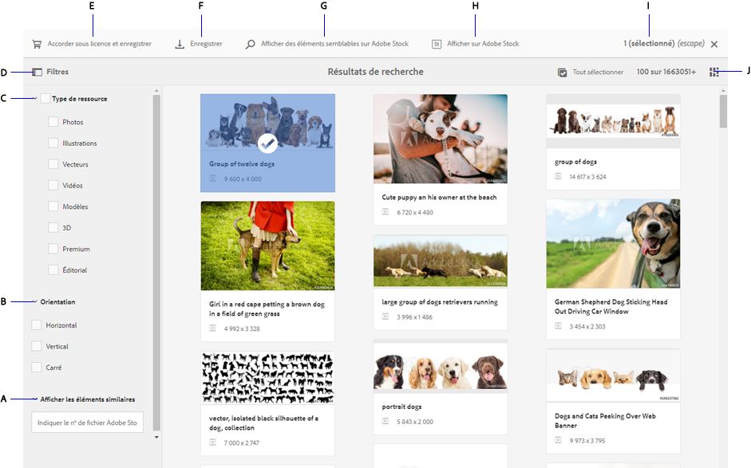
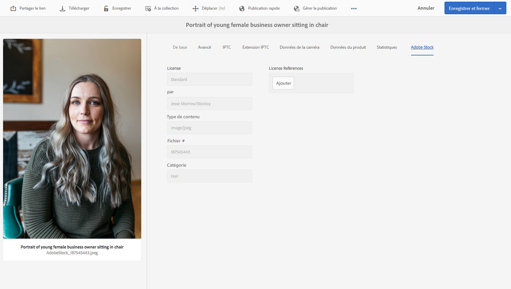

# Utilisation des ressources [!DNL Adobe Stock] dans [!DNL Adobe Experience Manager Assets] {#use-adobe-stock-assets-in-aem-assets}

Les entreprises peuvent intégrer leur formule d’abonnement pour entreprise [!DNL Adobe Stock] dans [!DNL Experience Manager Assets] pour s’assurer que les ressources sous licence sont mises à la disposition de leurs projets de création et marketing, tout en bénéficiant des puissantes fonctionnalités de gestion de ressources d’[!DNL Experience Manager].

Le service [!DNL Adobe Stock] permet aux créateurs et aux entreprises d’accéder à des millions de photos, de vecteurs, d’illustrations, de vidéos, de modèles et de ressources 3D organisés, de haute qualité et libres de droits pour tous leurs projets de création. Les utilisateurs d’[!DNL Experience Manager] peuvent en un éclair, rechercher, prévisualiser et acquérir sous licence des ressources [!DNL Adobe Stock] qui sont enregistrées dans [!DNL Experience Manager], sans quitter l’interface d’[!DNL Experience Manager].

## Prérequis {#prerequisites}

Pour que l’intégration soit possible, l’[abonnement Adobe Stock entreprise](https://stockenterprise.adobe.com/) est requis et  6.4 (Service Pack 2 minimum) doit être déployé. [!DNL Experience Manager] Pour obtenir des [!DNL Experience Manager] détails sur le Service Pack 6.4, consultez ces [notes de mise à jour](/help/release-notes/sp-release-notes.md).

## Intégration d’[!DNL Experience Manager] et [!DNL Adobe Stock] {#integrate-aem-and-adobe-stock}

Pour permettre à [!DNL Experience Manager] et [!DNL Adobe Stock] de communiquer, créez une configuration IMS et une configuration [!DNL Adobe Stock] dans [!DNL Experience Manager].

>[!NOTE]
>
>Seuls les administrateurs d’[!DNL Experience Manager] et d’[!DNL Admin Console] d’une entreprise peuvent procéder à l’intégration, dans la mesure où elle requiert des privilèges d’administrateur.

### Création d’une configuration IMS {#create-an-ims-configuration}

1. Dans l’interface utilisateur [!DNL Experience Manager], naviguez jusqu’à **[!UICONTROL Outils]** > **[!UICONTROL Sécurité]** > **[!UICONTROL Configurations d’Adobe IMS]**. Cliquez sur **[!UICONTROL Créer]**, puis sélectionnez **[!UICONTROL Solution cloud]** > **[!UICONTROL Adobe Stock]**.
1. Réutilisez un certificat existant ou sélectionnez **[!UICONTROL Créer un certificat]**.
1. Cliquez sur **[!UICONTROL Créer un certificat]**. Une fois le certificat créé, téléchargez la clé publique. Cliquez sur **[!UICONTROL Suivant]**. Laissez l’écran [!UICONTROL Configuration du compte technique IMS d’Adobe] ouvert pour fournir rapidement les valeurs requises.
1. Accédez à [Adobe Developer Console](https://console.adobe.io). Assurez-vous que votre compte dispose des autorisations d’administrateur pour l’entreprise pour laquelle l’intégration est requise.
1. Cliquez sur **[!UICONTROL Créer un projet]**, puis sur **[!UICONTROL Ajouter l’API]**. Sélectionnez **[!UICONTROL Adobe Stock]** dans la liste des API disponibles. Sélectionnez [!UICONTROL OAUTH 2.0 Web].
1. Indiquez les valeurs **[!UICONTROL URI de redirection par défaut]** et **[!UICONTROL Modèle d’URI de redirection]**. Cliquez sur **[!UICONTROL Save configured API]** (Enregistrer l’API configurée). Copiez l’identifiant et le secret générés.
1. Dans l’écran [!UICONTROL Adobe de la configuration du compte technique IMS], indiquez les valeurs dans les zones intitulées **[!UICONTROL Titre]**, **[!UICONTROL Serveur d’autorisation]**, **[!UICONTROL Clé API]**, **[!UICONTROL Secret client]** et **[!UICONTROL Charge utile]**. Pour plus d’informations sur ces valeurs, voir [Démarrage rapide de l’authentification JWT](https://www.adobe.io/authentication/auth-methods.html#!AdobeDocs/adobeio-auth/master/JWT/JWT.md).

<!-- TBD: Update the URL when the new URL is available. Logged issue github.com/AdobeDocs/adobeio-auth/issues/63.
-->

### Création d’une configuration [!DNL Adobe Stock] dans [!DNL Experience Manager] {#create-adobe-stock-configuration-in-aem}

1. Dans l’interface utilisateur [!DNL Experience Manager], accédez à **[!UICONTROL Outils]** > **[!UICONTROL Cloud Services]** > **[!UICONTROL Adobe Stock]**.
1. Cliquez sur **[!UICONTROL Créer]** pour créer une configuration et l’associer à votre configuration IMS existante. Sélectionnez `PROD` comme paramètre d’environnement.
1. Ne modifiez pas l’emplacement défini dans le champ **[!UICONTROL Chemin d’accès aux ressources sous licence]**. Ne modifiez pas l’emplacement où vous souhaitez stocker les ressources [!DNL Adobe Stock].
1. Pour terminer la procédure de création, ajoutez toutes les propriétés requises. Cliquez sur **[!UICONTROL Enregistrer et fermer]**.
1. Ajoutez les utilisateurs ou groupes [!DNL Experience Manager] qui peuvent acquérir les ressources sous licence.

>[!NOTE]
>
>S’il existe plusieurs [!DNL Adobe Stock] configurations, sélectionnez la configuration souhaitée dans le panneau Préférences utilisateur (**[!UICONTROL AEM]** > **[!UICONTROL Icône utilisateur]** > **[!UICONTROL Préférences utilisateur]** > **[!UICONTROL Configuration de stock]**).

## Utilisation et gestion de ressources [!DNL Adobe Stock] dans [!DNL Experience Manager] {#usemanage}

Grâce à cette fonctionnalité, les entreprises peuvent permettre à leurs utilisateurs de travailler avec des ressources [!DNL Adobe Stock] dans [!DNL Experience Manager Assets]. Dans l’interface utilisateur [!DNL Experience Manager], les utilisateurs peuvent rechercher des ressources [!DNL Adobe Stock] et obtenir des licences pour les ressources requises.

Une fois qu’une ressource [!DNL Adobe Stock] est sous licence dans [!DNL Experience Manager], elle peut être utilisée et gérée comme une ressource standard. Dans [!DNL Experience Manager], les utilisateurs peuvent rechercher des ressources, les prévisualiser, les copier, les publier, les partager sur [!DNL Brand Portal] et les utiliser via l’application de bureau [!DNL Experience Manager], etc.

*Figure : Recherchez  [!DNL Adobe Stock] des ressources et filtrez les résultats à partir de votre  [!DNL Experience Manager] interface.*

**A.**[!DNL Adobe Stock] Rechercher les ressources semblables à celles dont l’ID est fourni. **B.** Rechercher les ressources correspondant à la forme ou à l’orientation que vous avez sélectionnée. **C.** Recherchez l’un des types de ressources les plus pris en charge  **D.** Ouvrez ou réduisez le volet des filtres  **E.**  Donnez la licence et enregistrez la ressource sélectionnée dans  [!DNL Experience Manager] **F.** Enregistrez la ressource dans  [!DNL Experience Manager] avec le filigrane  **G.** Explorez les ressources du site web  [!DNL Adobe Stock] semblables à la ressource sélectionnée  **H.** Afficher les ressources sélectionnées sur le site web  [!DNL Adobe Stock]  **.**   **J.** Basculement entre le mode Carte et le mode Liste

### Recherche de ressources {#find-assets}

Vos utilisateurs [!DNL Experience Manager] peuvent rechercher des ressources dans [!DNL Experience Manager] et dans [!DNL Adobe Stock]. Lorsque l’emplacement de recherche n’est pas limité à [!DNL Adobe Stock], les résultats de recherche en provenance d’[!DNL Experience Manager] et d’[!DNL Adobe Stock] sont affichés.

* Pour rechercher des ressources [!DNL Adobe Stock], cliquez sur **[!UICONTROL Navigation]** > **[!UICONTROL Ressources]** > **[!UICONTROL Rechercher sur Adobe Stock]**.

* Pour rechercher des ressources dans [!DNL Adobe Stock] et [!DNL Experience Manager Assets], cliquez sur Rechercher .

Vous pouvez également commencer à saisir `Location: Adobe Stock` dans la barre de recherche pour sélectionner des ressources [!DNL Adobe Stock] [!DNL Experience Manager] propose des fonctionnalités de filtrage avancé sur les ressources recherchées, ce qui permet aux utilisateurs de cibler rapidement les ressources requises à l’aide de filtres tels que les types de ressources pris en charge, l’orientation d’image et l’état de licence.

>[!NOTE]
>
>Les ressources recherchées dans [!DNL Adobe Stock] sont simplement affichées dans [!DNL Experience Manager]. Les ressources [!DNL Adobe Stock] ne sont pas récupérées ni stockées dans le référentiel [!DNL Experience Manager] tant qu’un utilisateur n’a pas [enregistré une ressource](/help/assets/aem-assets-adobe-stock.md#saveassets) ou [acquis sous licence et enregistré une ressource ](/help/assets/aem-assets-adobe-stock.md#licenseassets). Les ressources déjà stockées dans [!DNL Experience Manager] sont affichées et mises en surbrillance pour simplifier leur référencement et leur accès. En outre, les ressources [!DNL Stock] sont enregistrées avec quelques métadonnées supplémentaires pour indiquer la source comme étant [!DNL Stock].

*Figure : Filtres de recherche dans [!DNL Experience Manager] et ressources [!DNL Adobe Stock] mises en évidence dans les résultats de recherche.*

### Enregistrement et affichage des ressources requises {#saveassets}

Sélectionnez une ressource que vous souhaitez enregistrer dans [!DNL Experience Manager]. Cliquez sur [!UICONTROL Enregistrer] dans la barre d’outils supérieure, et indiquez le nom et l’emplacement de la ressource. Les ressources sans licence sont enregistrées en local avec un filigrane.

La prochaine fois que vous rechercherez des ressources, les ressources enregistrées seront mises en évidence avec un badge pour indiquer qu’elles sont disponibles dans [!DNL Experience Manager Assets].

>[!NOTE]
>
>Les ressources ajoutées récemment sont assorties d’un badge Nouvelle au lieu du badge Sous licence.

### Acquisition de ressources sous licence {#licenseassets}

Les utilisateurs peuvent acquérir des ressources [!DNL Adobe Stock] sous licence en utilisant le quota de leur abonnement pour entreprise [!DNL Adobe Stock]. Lorsque vous acquérez une ressource sous licence, elle est enregistrée sans filigrane, et elle peut être recherchée et utilisée dans [!DNL Experience Manager Assets].

*Figure : Boîte de dialogue permettant d’acquérir sous licence et d’enregistrer des ressources [!DNL Adobe Stock] dans [!DNL Experience Manager Assets].*

### Accès aux propriétés de ressources et de métadonnées {#access-metadata-and-asset-properties}

Les utilisateurs peuvent accéder aux métadonnées et les prévisualiser, ce qui inclut les propriétés de métadonnées [!DNL Adobe Stock] des ressources enregistrées dans [!DNL Experience Manager], et ajouter des **[!UICONTROL Références de licence]** pour une ressource. Cependant, les mises à jour apportées à une référence de licence ne sont pas synchronisées entre [!DNL Experience Manager] et le site web d’[!DNL Adobe Stock].

Les utilisateurs peuvent afficher les propriétés de toutes les ressources, avec et sans licence.

*Figure : Affichage des métadonnées et des références de licence des ressources enregistrées, et accès à ces éléments.*

## Limitations connues {#known-limitations}

* **L’avertissement d’image éditoriale n’est pas affiché** : lors de l’octroi d’une licence pour une image, les utilisateurs ne peuvent pas vérifier si une image est destinée à une utilisation éditoriale uniquement. Pour lutter contre une éventuelle utilisation abusive, les administrateurs peuvent désactiver l’accès aux ressources éditoriales à partir d’Admin Console.

* **Type de licence affiché incorrect** : il est possible qu’un type de licence incorrect apparaisse dans [!DNL Experience Manager] pour une ressource. Les utilisateurs peuvent se connecter au site web d’[!DNL Adobe Stock] pour afficher le type de licence.

* **Les champs de référence et les métadonnées ne sont pas synchronisés** : lorsqu’un utilisateur met à jour un champ de référence de licence, les informations de référence de licence sont mises à jour dans [!DNL Experience Manager], mais pas sur le site web d’[!DNL Adobe Stock]. De même, si l’utilisateur met à jour les champs de référence sur le site web d’[!DNL Adobe Stock], les mises à jour ne sont pas synchronisées dans [!DNL Experience Manager].

>[!MORELIKETHIS]
>
>* [Tutoriel visuel sur l’utilisation de ressources Adobe Stock avec Experience Manager Assets](https://experienceleague.adobe.com/docs/experience-manager-learn/assets/creative-workflows/adobe-stock.html?lang=fr)
>* [Aide d’Adobe Stock pour entreprise](https://helpx.adobe.com/enterprise/admin-guide.html/enterprise/using/adobe-stock-enterprise.ug.html)
>* [FAQ d’Adobe Stock](https://helpx.adobe.com/fr/stock/faq.html)

