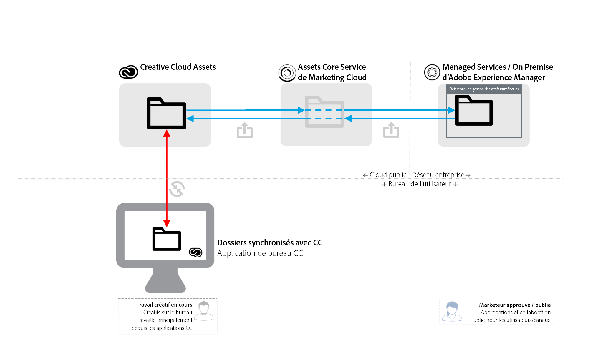
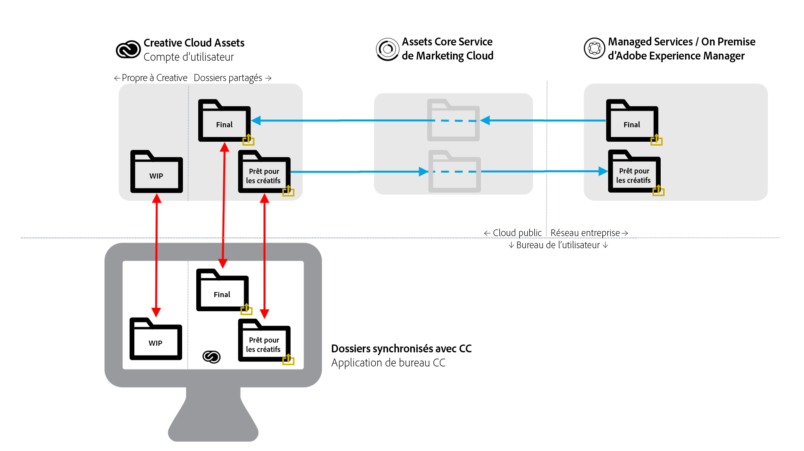

# Meilleures pratiques de partage de dossiers entre AEM et Creative Cloud {#aem-to-creative-cloud-folder-sharing-best-practices}

>[!CAUTION]
>
>La fonction de partage de dossiers entre AEM et Creative Cloud est obsolète. L’Adobe recommande vivement d’utiliser des fonctionnalités plus récentes, telles que [Adobe Asset Link](https://helpx.adobe.com/fr/enterprise/using/adobe-asset-link.html) ou une application [de bureau](https://helpx.adobe.com/fr/experience-manager/desktop-app/aem-desktop-app.html)AEM. Learn more in [AEM and Creative Cloud integration best practices](/help/assets/aem-cc-integration-best-practices.md).

Adobe Experience Manager (AEM) peut être configuré pour permettre aux utilisateurs de AEM Assets de partager des dossiers avec des utilisateurs Creative Cloud, de sorte qu’ils soient disponibles sous forme de dossiers partagés dans le service Creative Cloud Assets. La fonction peut être utilisée pour échanger des fichiers entre les équipes créatives et les utilisateurs AEM Assets, surtout si les créatifs n’ont pas accès à l’instance AEM Assets (ils ne se trouvent pas sur le réseau de l’entreprise).

Ce type d’intégration peut être utilisé dans les deux cas d’utilisation, en particulier lorsque vous travaillez avec des utilisateurs qui n’ont pas d’accès direct à AEM Assets :

* Partage d’un ensemble de ressources spécifiques d’AEM Assets avec les utilisateurs de fichiers Creative Cloud (par exemple, des consignes de création et un ensemble de ressources approuvées pour le travail de conception d’une nouvelle activité marketing)
* Réception de nouveaux fichiers d’utilisateurs Creative Cloud.

>[!NOTE]
>
>Avant de lire ce document, vous pouvez consulter les [meilleures pratiques générales d’intégration d’AEM et de Creative Cloud](aem-cc-integration-best-practices.md) pour un aperçu général du sujet.

## Présentation {#overview}

AEM au partage de dossiers Creative Cloud repose sur le partage côté serveur de dossiers et de fichiers entre les comptes AEM Assets et les comptes Creative Cloud. Les professionnels de la création, qui utilisent l’application de bureau Creative Cloud sur leurs ordinateurs de bureau, peuvent en outre rendre les dossiers partagés disponibles directement sur leurs disques à l’aide de la technologie Adobe CreativeSync.

Le diagramme suivant offre une vue d’ensemble du processus d’intégration.

L’intégration comprend les éléments suivants :

* **Serveur** AEM Assets déployé dans le réseau d’entreprise (services gérés ou sur site) : Le partage de dossiers est initié ici.
* Le **service de base Adobe Marketing Cloud Assets** : sert d’intermédiaire entre AEM et les services de stockage Creative Cloud. L’administrateur de l’entreprise qui utilise l’intégration se doit d’établir des relations de confiance entre l’organisation Marketing Cloud et l’instance AEM Assets. Il définit également [une liste des collaborateurs Creative Cloud approuvés](https://docs.adobe.com/content/help/en/core-services/interface/assets/t-admin-add-cc-user.html), avec qui les utilisateurs d’AEM Assets peuvent partager des dossiers pour plus de sécurité.
* **Services** Web Creative Cloud Assets (interface utilisateur Web enregistrement et Fichiers Creative Cloud) : C’est là que des utilisateurs Creative Cloud spécifiques, avec lesquels un dossier AEM Assets a été partagé, peuvent accepter l’invitation et voir le dossier dans leur enregistrement de compte Creative Cloud.
* **Application** de bureau Creative Cloud : (Facultatif) Permet un accès direct aux dossiers/fichiers partagés depuis le bureau de l’utilisateur créatif via la synchronisation avec l’enregistrement Ressources Creative Cloud.

## Caractéristiques et limites {#characteristics-and-limitations}

* **Propagation unidirectionnelle des modifications :** Les modifications apportées aux fichiers sont propagées dans une seule direction - à partir du système (AEM ou Creative Cloud Assets), où l’actif a été créé à l’origine (téléchargé). L’intégration ne fournit pas de synchronisation entièrement automatisée et bidirectionnelle entre les deux systèmes.

* **Contrôle de version:**

   * AEM crée uniquement les versions d’une ressource lors des mises à jour si le fichier provient d’AEM et y est mis à jour.
   * Creative Cloud Assets fournit sa propre [fonctionnalité de création de versions](https://helpx.adobe.com/fr/creative-cloud/help/versioning-faq.html), qui vise les mises à jour de travail en cours (en général, les mises à jour sont conservées 10 jours).

* **Limites d&#39;espace :** Les tailles et les volumes des fichiers échangés sont limités par le quota [d’actifs](https://helpx.adobe.com/creative-cloud/kb/file-storage-quota.html) Creative Cloud spécifique pour les utilisateurs créatifs (dépend du niveau d’abonnement) et une taille de fichier maximale de 5 Go. L’espace est en outre limité par le quota de ressources que l’organisation possède dans le service principal d’Adobe Marketing Cloud Assets.

* **Espace requis :** Les fichiers des dossiers partagés doivent également être physiquement stockés dans AEM, puis dans un compte Creative Cloud, avec une copie mise en cache dans le service principal Ressources du Marketing Cloud.
* **Réseau et bande passante :** Les fichiers des dossiers partagés et toutes les mises à jour doivent être transportés sur le réseau entre les systèmes. Vous devez vous assurer que seuls les fichiers et les mises à niveau appropriées sont partagés.
* **Type de dossier** : le partage d’un dossier de ressources de type `sling:OrderedFolder` n’est pas pris en charge. Si vous souhaitez partager un dossier, lors de sa création dans AEM Assets, ne sélectionnez pas l’option Ordre.

## Bonnes pratiques {#best-practices}

Les meilleures pratiques d’utilisation du partage de dossier entre AEM et Creative Cloud comprennent :

* **Considérations relatives au volume :** Le partage de dossiers AEM/Creative Cloud doit être utilisé pour partager un plus petit nombre de fichiers, par exemple, pertinents pour une campagne ou une activité spécifique. Pour partager de plus grands ensembles de ressources, comme toutes les ressources approuvées dans l’organisation, utilisez d’autres méthodes de distribution (par exemple, AEM Assets Brand Portal) ou l’application de bureau AEM.
* **Evitez de partager des hiérarchies profondes :** Le partage fonctionne de manière récursive et ne permet pas un déséchange sélectif. En règle générale, seuls les dossiers sans sous-dossiers, ou ayant une hiérarchie très simple, comme 1 niveau de sous-dossiers, doivent être considérés pour le partage.
* **Dossiers distincts pour le partage à sens unique :** Des dossiers distincts doivent être utilisés pour partager des fichiers finaux d’AEM Assets vers des fichiers Creative Cloud et pour partager des fichiers créatifs prêts à l’emploi à partir de fichiers Creative Cloud vers AEM Assets. Associé à une convention d’affectation de nom efficace pour ces dossiers, il crée un environnement de travail plus facile à comprendre pour les utilisateurs AEM Assets et les utilisateurs Creative Cloud.
* **Evitez les travaux en cours dans le dossier partagé :** Le dossier partagé ne doit pas être utilisé pour le travail en cours : utilisez un dossier distinct dans les fichiers Creative Cloud pour effectuer le travail qui nécessite des modifications fréquentes du fichier.
* **Début d’une nouvelle tâche en dehors du dossier partagé :** Les nouvelles conceptions (fichiers créatifs) doivent être démarrées dans le dossier WIP distinct des fichiers Creative Cloud et, lorsqu’elles sont prêtes à être partagées avec les utilisateurs AEM Assets, elles doivent être déplacées ou enregistrées dans le dossier partagé.
* **Simplifier la structure de partage :** Pour une configuration d&#39;exploitation plus gérable, pensez à simplifier la structure de partage. Au lieu de le partager avec tous les utilisateurs créatifs, les dossiers AEM Assets doivent être partagés avec les représentants de l’équipe uniquement, comme un directeur créatif ou un responsable d’équipe. Le responsable artistique doit recevoir les ressources finales, déterminer l’attribution des tâches, puis permettre aux concepteurs de travailler sur les ressources de travail en cours sur leurs comptes Creative Cloud respectifs. Ils peuvent utiliser les fonctions de collaboration des Creative Cloud pour coordonner le travail, et enfin sélectionner et placer les ressources prêtes à être partagées à nouveau dans AEM Assets dans leur dossier partagé prêt pour la création.

Le schéma suivant illustre un exemple de configuration permettant de créer des conceptions basées sur les ressources finales existantes d’AEM Assets.

