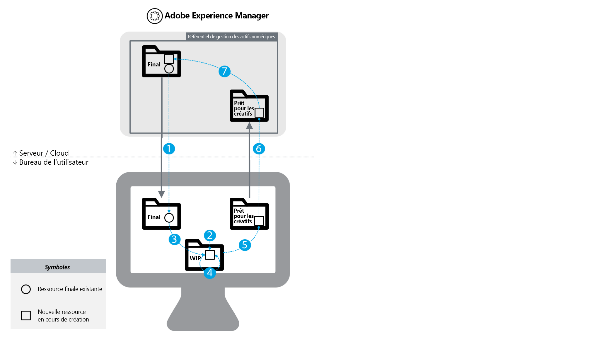

# [!DNL Experience Manager] et bonnes pratiques  [!DNL Creative Cloud] d’intégration {#aem-and-creative-cloud-integration-best-practices}

<!-- TBD: Reconcile with 6.5 article that's ahead of this article now in terms of content streamlining and structuring.
-->

Adobe Experience Manager Assets est une solution de gestion des ressources numériques (DAM) qui peut s’intégrer à Adobe Creative Cloud pour aider les utilisateurs de DAM à travailler avec des équipes créatives, en rationalisant la collaboration dans le processus de création de contenu.

Adobe Creative Cloud offre aux équipes créatives un écosystème de solutions et de services pour leur permettre de créer des ressources numériques. Il comprend des applications de bureau et mobiles, des services de cloud tels que le stockage avec une synchronisation sur poste de travail ou une expérience web, ainsi que des places de marché telles qu’Adobe Stock.

Lisez ce qui suit pour savoir quelles intégrations choisir entre poste de travail et DAM d’entreprise selon votre cas d’utilisation et découvrir quelles sont les bonnes pratiques associées aux workflows de connexion.

>[!NOTE]
>
>Le partage de dossiers de [!DNL Experience Manager] vers Creative Cloud est obsolète et n’est plus traité dans ce guide. Adobe recommande d’utiliser des fonctionnalités plus récentes, telles que [Adobe Asset Link](https://helpx.adobe.com/fr/enterprise/using/adobe-asset-link.html) ou [[!DNL Experience Manager] l’appli de bureau](https://experienceleague.adobe.com/docs/experience-manager-desktop-app/using/introduction.html?lang=fr) pour permettre à l’utilisateur créatif d’accéder aux ressources gérées dans [!DNL Experience Manager].

## Besoins en matière de collaboration des créatifs, des marketeurs et des utilisateurs de la gestion des ressources numériques {#collaboration-needs-of-creatives-marketers-and-dam-users}

| Conditions requises | Cas d’utilisation | Surfaces impliquées |
|---|---|---|
| Simplifier l’expérience pour les créatifs utilisant un poste de travail | Simplifiez l’accès aux ressources à partir d’une gestion des ressources numériques ([!DNL Assets]) pour les professionnels de la création ou, plus largement, pour les utilisateurs de bureau travaillant dans des applications de création de ressources natives. Ils ont besoin d’une méthode simple et simple pour découvrir, utiliser (ouvrir), modifier et enregistrer les modifications apportées à [!DNL Experience Manager], ainsi que charger de nouveaux fichiers. | Poste de travail Windows ou Mac ; applications Creative Cloud |
| Fournir des ressources de grande qualité, prêtes à l’emploi depuis Adobe Stock | Les spécialistes marketing accélèrent le processus de création de contenu en contribuant à la recherche et à la découverte de ressources. Les créatifs utilisent les ressources approuvées directement dans leurs outils de création. | [!DNL Assets]; Marketplace d’Adobe Stock ; Champs de métadonnées |
| Distribution et partage de ressources par sociétés | Les services internes/succursales locales et les partenaires externes, les distributeurs et les agences utilisent les ressources approuvées, partagées par la société mère. La société souhaite partager de manière sécurisée et transparente les ressources créées pour une réutilisation plus large. | Brand Portal, Asset Share Commons |

## Offres d’Adobe pour répondre aux besoins en matière de collaboration {#adobe-offerings-to-support-the-collaboration-need}

| Proposition de valeur pour les personnes impliquées | Offre d’Adobe | Surfaces impliquées |
|---|---|---|
| Les utilisateurs créatifs découvrent des ressources à partir de [!DNL Experience Manager], les ouvrent et les utilisent, modifient et chargent les modifications dans [!DNL Experience Manager], ainsi que chargent de nouveaux fichiers dans [!DNL Experience Manager], sans quitter les applications de Creative Cloud. | [Adobe Asset Link](https://helpx.adobe.com/enterprise/using/adobe-asset-link.html) | Photoshop, Illustrator et InDesign |
| Les utilisateurs professionnels simplifient l’ouverture et l’utilisation des ressources, la modification et le chargement des modifications dans [!DNL Experience Manager] et le chargement de nouveaux fichiers dans [!DNL Experience Manager] à partir de l’environnement de bureau. Ils utilisent une intégration générique pour ouvrir n’importe quel type de ressource dans l’application de bureau native, y compris les applications autres qu’Adobe. | Application de bureau [[!DNL Experience Manager] ](https://experienceleague.adobe.com/docs/experience-manager-desktop-app/using/using.html?lang=fr) | [!DNL Experience Manager]Application de bureau sous Windows et Mac |
| Les spécialistes marketing et les utilisateurs professionnels découvrent, prévisualisent, attribuent une licence et enregistrent les ressources Adobe Stock dans [!DNL Experience Manager]. Les ressources sous licence et enregistrées fournissent des métadonnées Adobe Stock pour une meilleure gouvernance. | [Intégration d’Experience Manager et d’Adobe Stock](aem-assets-adobe-stock.md) | [!DNL Experience Manager] interface web |

Cet article se concentre principalement sur les deux premiers aspects des besoins de collaboration. La distribution et la source des ressources à grande échelle sont brièvement mentionnées comme cas d’utilisation. Pour répondre à ces besoins, pensez à Adobe Brand Portal ou à Asset Share Commons. D’autres solutions telles que [Brand Portal](https://helpx.adobe.com/fr/experience-manager/brand-portal/user-guide.html), des solutions qui peuvent être créées en fonction des [composants Asset Share Commons](https://adobe-marketing-cloud.github.io/asset-share-commons/), [Partage de lien](/help/assets/link-sharing.md), à l’aide de [Ressources Experience Manager](/help/assets/managing-assets-touch-ui.md) doivent être examinées en fonction de besoins spécifiques.

![Connexions de Creative Cloud pour  [!DNL Experience Manager]: Choix de la fonctionnalité à utiliser](assets/creative-connections-aem.png)

<!-- 
## Terms and definitions {#terms-and-definitions}

The terms used in this document may have a different meaning in other contexts. In particular, the following terms pertaining to the digital asset lifecycle are used when referring to workflows between a creative professional's desktop and DAM:

* **Work-in-progress or creative work-in-progress (WIP):** A phase in asset lifecycle where an asset undergoes multiple changes and is typically not yet ready to be shared with broader teams.
* **Creative-ready assets:** Assets that are ready to be shared with a broader team, or have been  selected / approved  by the creative team for sharing with marketing or LOB teams.
* **Asset approvals:** The approval process that runs for assets already uploaded to DAM, which typically includes brand approvals, legal approvals, and so on.
* **Final asset:** An asset that has gone through all  approvals/metadata  tagging and is ready to be used by the broader team. Such an asset is stored in DAM and made available to all (or all interested) users. It can be used in marketing channels or by creative teams to create designs.
* **Minor asset  update/change:** A quick and small change to a digital asset. It is often made in response to a retouching or minor editing request, asset review, or approval (for example, reposition, change text size, adjust saturation/brightness, color, and so on).
* **Major asset  update/change:** A change to a digital asset that requires considerable work, and sometimes must be done over a longer period of time. It typically includes multiple changes. The asset must be saved multiple times while being updated. Major asset updates typically cause the asset to enter a WIP stage.
* **DAM:** Digital asset management. In this document, it is synonymous with Experience Manager Assets, unless specifically mentioned otherwise.
* **Creative user:** A creative professional, who creates digital assets using Creative Cloud apps and services. In some cases, a creative user may be a member of a creative team who may use Creative Cloud, but does not create digital assets (like a creative director or creative team manager).
* **DAM user:** A typical user of a DAM system. Depending on the organization, a DAM user can be a marketing or a non-marketing user, for example a Line-of-Business (LOB) user, librarian, sales person, and so on.
-->

### Mappage des cas d’utilisation

| Cas d’utilisation | Appli de bureau [!DNL Experience Manager] | Partage de dossiers | Autres solutions |
|---|---|---|---|
| Partager un plus petit nombre (1) de ressources de gestion des actifs numériques avec l’utilisateur créatif | ✔✔ | ✔ |  |
| Partager un plus grand nombre (2) de ressources de gestion des actifs numériques avec l’utilisateur créatif | ✔✔ | ✘ | [Brand Portal](https://experienceleague.adobe.com/docs/experience-manager-brand-portal/using/home.html)   [Partage de ressources](assets-finder-editor.md) |
| Partager des ressources de gestion des actifs numériques avec les utilisateurs ayant accès à la gestion des actifs numériques | ✔✔ | ✔ | [Partage de liens](link-sharing.md) |
| Partager des ressources de gestion des actifs numériques avec les utilisateurs n’ayant pas accès à la gestion des actifs numériques | ✘ | ✔✔ | [Brand Portal](https://experienceleague.adobe.com/docs/experience-manager-brand-portal/using/home.html)   [Partage de ressources](assets-finder-editor.md) |
| Enregistrer un plus petit nombre/volume de ressources dans la gestion des actifs numériques | ✔✔ | ✔ | [Transfert sur l’interface utilisateur web](managing-assets-touch-ui.md) |
| Enregistrer un plus grand nombre de ressources dans la gestion des ressources numériques (3) | ✔✔ | ✘ | [Transfert sur l’interface utilisateur web](managing-assets-touch-ui.md)   Script personnalisé/outil |
| Migrer un nombre conséquent de ressources vers DAM | ✘ | ✘ | [Guide de migration](assets-migration-guide.md) |
| Ouvrir rapidement une ressource sur l’ordinateur de bureau | ✔✔ | ✘ |  |
| Ouvrir et modifier rapidement une ressource sur l’ordinateur de bureau | ✔✔ | ✘ |  |

Légende des symboles :

* ✔✔ : solution préférée
* ✔ : solution acceptable
* ✘ : ne doit pas être utilisé dans ce cas d’utilisation

Remarques supplémentaires :

* (1) Nombre inférieur de ressources : par exemple, un petit ensemble de ressources liées à un projet ou à une campagne
* (2) Nombre de ressources supérieur : par exemple, toutes les ressources approuvées de l’organisation
* (3) Utiliser la fonction de chargement de dossier de l’appli de bureau [!DNL Experience Manager]

Pour prendre en charge les cas d’utilisation de la distribution des ressources, d’autres solutions doivent être envisagées :

* [Brand ](https://helpx.adobe.com/experience-manager/brand-portal/user-guide.html) Portal pour un module complémentaire SaaS configurable pour  [!DNL Experience Manager] Assets afin de publier des ressources.
* Les solutions personnalisées sont créées à partir de la base de code [Asset Share Commons](https://adobe-marketing-cloud.github.io/asset-share-commons/).
* [!DNL Experience Manager][Partage de liens](/help/assets/link-sharing.md) pour partager des ressources ad hoc à l’aide de liens.
* [[!DNL Experience Manager] L’](/help/assets/managing-assets-touch-ui.md) interface web d’Assets avec les zones pour les parties externes sécurisées par la configuration du contrôle d’ [!DNL Experience Manager] accès et avec les réglages nécessaires de configuration informatique/réseau, ce qui donne à ces utilisateurs externes l’accès à  [!DNL Experience Manager].

## Concepts clés et cas d’utilisation {#key-concepts-and-use-cases}

### Glossaire des termes courants {#glossary-of-common-terms}

* **Travail en cours ou travail créatif en cours (WIP) :** phase dans le cycle de vie des ressources où une ressource est soumise à de multiples modifications et n’est généralement pas encore prête à être partagée avec les équipes élargies.
* **Ressources prêtes après création :** ressources prêtes à être partagées avec l’équipe élargie ou sélectionnées/approuvées par l’équipe créative pour le partage avec les équipes marketing ou métier.
* **Approbation des ressources :** processus d’approbation traitant des ressources déjà transférées dans la gestion des ressources numériques (DAM), qui inclut généralement les approbations de marque, les validations juridiques, etc.
* **Ressource finale :** ressource qui a passé l’ensemble des approbations/balisages de métadonnées et qui est prête à être utilisée par l’équipe élargie. Une telle ressource est stockée dans la gestion des ressources numériques (DAM) et est accessible à tous les utilisateurs (ou à tous les utilisateurs intéressés). Il peut être utilisé dans les canaux marketing ou par des équipes créatives pour créer des conceptions.
* **Mise à jour/modification mineure des ressources :** modification rapide et petite d’une ressource numérique. Cette opération est souvent effectuée en réponse à une demande de retouche ou de modification mineure, de révision ou d’approbation de fichier (par exemple, repositionnement, modification de la taille du texte, ajustement de la saturation/luminosité, couleur, etc.).
* **Mise à jour/modification majeure des ressources :** modification d’une ressource numérique qui nécessite un travail considérable et qui doit parfois être effectuée sur une plus longue période de temps. Celle-ci implique généralement plusieurs modifications. La ressource doit être enregistrée plusieurs fois lors de la mise à jour. En règle générale, les mises à jour majeures de la ressource entraînent le passage à une étape en cours.
* **DAM :** gestion des ressources numériques (en anglais, Digital Asset Management). Dans ce document, il est synonyme de [!DNL Experience Manager Assets], sauf mention contraire spécifique.
* **Utilisateur créatif :** professionnel de la création, qui crée des ressources numériques à l’aide des applications et services Creative Cloud. Dans certains cas, un utilisateur créatif peut faire partie d’une équipe créative qui peut utiliser Creative Cloud, mais ne crée pas de ressources numériques (comme un directeur créatif ou un chef d’équipe créative).
* **Utilisateur de la gestion des ressources numériques :** utilisateur ordinaire d’un système de gestion des ressources numériques (DAM, Digital Asset Management). Selon l’organisation, l’utilisateur de gestion des ressources numériques (DAM) peut être un utilisateur marketing ou non, par exemple, un utilisateur métier, un bibliothécaire, un commercial, etc.

### Remarques concernant l’utilisation de [!DNL Experience Manager] et l’intégration de Creative Cloud {#considerations-when-using-aem-and-creative-cloud-integration}

* Voir [Bonnes pratiques relatives à l’appli de bureau](https://experienceleague.adobe.com/docs/experience-manager-desktop-app/using/troubleshoot.html#best-practices-to-prevent-troubles)
* Voir [Intégration Adobe Stock](aem-assets-adobe-stock.md)
* Voir la section [Adobe Asset Link](https://helpx.adobe.com/enterprise/using/adobe-asset-link.html)

Il s’agit d’un bref résumé des bonnes pratiques pour l’intégration de Experience Manager et de Creative Cloud. Lisez la suite de ce document pour obtenir une description détaillée des points suivants.

* **Pour les utilisateurs créatifs, travaillant dans Photoshop, InDesign ou Illustrator :** Adobe Asset Link offre la meilleure expérience utilisateur, y compris une gestion propre du travail en cours sur les ressources extraites à partir de  [!DNL Experience Manager]
* **Pour simplifier l’accès aux ressources depuis un poste de travail pour une application ou un format de fichier générique :**[!DNL Experience Manager] utilisez l’application de bureau 
* **Déterminer pourquoi et quand stocker des ressources dans la gestion des ressources numériques (DAM) :** identifiez quelles mises à jour doivent être mises à la disposition de l’équipe élargie au sein de votre organisation.
* **Tenez compte du volume des ressources partagées :** si votre cas d’utilisation est la distribution des ressources, la gouvernance et la sécurité peuvent être les aspects les plus importants. Envisagez d’utiliser des outils conçus pour effectuer les tâches à grande échelle, comme Brand Portal.
* **Comprendre le cycle de vie des ressources :** comprenez la façon dont les ressources sont traitées par les différentes équipes au sein de votre organisation.
* **Gérer avec soin les enregistrements fréquents des ressources :** Adobe Asset Link s’en charge à votre place avec PS, IA, ID. Pour d’autres applications, ne conservez pas de tâches en cours dans le dossier mappé/partagé, sauf si vous avez besoin de toutes les modifications dans DAM.

### Accès aux ressources Adobe Stock à partir de [!DNL Assets] {#access-to-adobe-stock-assets-from-aem-assets}

[[!DNL Experience Manager] et l’](/help/assets/aem-assets-adobe-stock.md) intégration d’Adobe Stock permet aux  [!DNL Experience Manager] utilisateurs de rechercher, prévisualiser, acquérir sous licence et enregistrer des ressources d’Adobe Stock dans  [!DNL Experience Manager]. Les ressources sous licence et enregistrées d’Adobe Stock possèdent des métadonnées Stock qui peuvent être utilisées pour les rechercher avec des filtres supplémentaires.

Quelques points importants à savoir concernant cette intégration :

* Lorsque des ressources du stock d’Adobe sont enregistrées dans [!DNL Experience Manager], elles deviennent des ressources [!DNL Experience Manager] ordinaires, avec un fichier binaire enregistré dans le référentiel [!DNL Experience Manager]. Certaines métadonnées liées à Adobe Stock sont enregistrées pour la ressource dans [!DNL Experience Manager], sinon le processus d’ingestion ressemble à celui de tout autre fichier. Par exemple, si les balises dynamiques sont actives, les balises sont ajoutées à ces fichiers lors de l’enregistrement.
* La ressource enregistrée dans [!DNL Experience Manager] est une copie et non un lien vers Adobe Stock.

**[!DNL Experience Manager]Utilisation des ressources enregistrées depuis Adobe Stock dans dans Creative Cloud**. Cette intégration est indépendante d’Adobe Asset Link, mais cette fonction reconnaît ces ressources enregistrées depuis Stock de cette manière et affiche d’autres métadonnées et une icône Stock sur ces ressources dans l’interface utilisateur de l’extension Adobe Asset Link dans Photoshop, Illustrator et InDesign. Les fichiers sont disponibles pour la navigation, l’ouverture, etc., car il s’agit de ressources [!DNL Experience Manager] ordinaires lorsqu’elles sont enregistrées dans [!DNL Experience Manager].
Les utilisateurs créatifs qui travaillent dans des applications de Creative Cloud avec l’extension Adobe Asset Link sont présents, en plus d’avoir accès à des ressources déjà sous licence d’Adobe Stock dans [!DNL Experience Manager], peuvent également utiliser le panneau Bibliothèques Creative Cloud pour rechercher, prévisualiser et acquérir sous licence des ressources Adobe Stock.
Les ressources d’Adobe Stock sous licence et enregistrées dans [!DNL Experience Manager] deviennent disponibles pour les équipes élargies accédant au déploiement de [!DNL Experience Manager] ressources, tandis que les créatifs concédant des licences pour les ressources d’Adobe Stock via le panneau Bibliothèques Creative Cloud les rendent disponibles uniquement par défaut dans leur compte de Creative Cloud.

<!-- 
TBD: A condensed version of the below content is better placed in the Adobe DAM article.
-->

## À propos du stockage de ressources dans un système de gestion des ressources numériques (DAM)  {#about-storing-assets-in-a-dam}

Pour établir un workflow efficace entre les équipes créatives et marketing/métier, et sélectionner les meilleures fonctionnalités de prise en charge, il est important de comprendre quand et pourquoi les ressources sont stockées dans la gestion des ressources numériques (DAM).

### Pourquoi les ressources sont-elles stockées dans la gestion des ressources numériques (DAM) ? {#why-assets-are-stored-in-dam}

Le stockage des ressources dans la gestion des ressources numériques (DAM) permet d’en faciliter l’accès et de les retrouver plus aisément. Cela garantit que les ressources peuvent être exploitées par de nombreux utilisateurs au sein de votre organisation ou écosystème, qui comprend les partenaires, les clients, etc.

La plupart des organisations choisissent de stocker uniquement les ressources pertinentes pour les processus marketing/métier en aval (publication sur des canaux tels que le canal web via [!DNL Experience Manager] Sites ou d’autres canaux traités par Adobe Experience Cloud, Advertising Cloud et mesurés par Analytics Cloud, à l’intention des utilisateurs/partenaires, etc.). En outre, les entreprises stockent les ressources qui peuvent être soumises à un processus de révision/approbation dans la gestion des ressources numériques (DAM). De cette manière, la gestion des ressources numériques (DAM) stocke principalement les ressources ayant de grandes chances d’être exploitées, en évitant de stocker les ressources inactives.

Le stockage des ressources est soumis à des considérations techniques et d’utilisation des ressources. La gestion des ressources numériques (DAM) fournit des services supplémentaires pour les ressources stockées, notamment l’extraction de métadonnées, le contrôle de version, la génération d’aperçus/de transcodage, la gestion des références et l’ajout d’informations de contrôle d’accès. Ces services utilisent davantage de temps et de ressources de votre infrastructure.

Souvent, le stockage de toutes les ressources et mises à jour n’est pas souhaitable. Par exemple, si les mises à jour de ressources spécifiques sont de mauvaise qualité et utilisent les ressources en excès, les ressources peuvent être stockées dans la gestion des ressources numériques (DAM).

### Quand les ressources sont-elles stockées dans la gestion des ressources numériques (DAM) ? {#when-assets-are-stored-in-dam}

Les équipes créatives (et les organisations) ne sont généralement pas intéressées par le stockage des ressources à chaque étape de leur cycle de vie. Par exemple, elles évitent de stocker des ressources dans les cas suivants :

* Si les ressources doivent être finalisées ou sont soumises à expérimentation
* Si les ressources ne passent pas le cycle de révision de l’équipe interne/créative
* L’équipe dispose de ressources plus pertinentes que celle en question pour présenter son travail à des équipes externes

En règle générale, les classes de ressources suivantes sont stockées dans la gestion des ressources numériques (DAM) :

* Les ressources ayant atteint une certaine maturité et que l’on estime prêtes à être partagées
* Les ressources qui ont été présélectionnées par l’équipe créative
* Les formats de ressources spécifiques qui sont utilisables ou demandés par le marketing, selon un contrat ou un accord spécifique (par exemple, des fichiers JPG convertis à partir de fichiers RAW, des TIFF/images à partir d’originaux PSD)

### Quand les mises à jour de ressources sont-elles stockées dans la gestion des ressources numériques (DAM) ? {#when-updates-to-assets-are-stored-in-dam}

En règle générale, seules les mises à jour des ressources pertinentes pour un large ensemble d’utilisateurs de la gestion des ressources numériques doivent être stockées dans la gestion des ressources numériques (DAM). Cela garantit que les utilisateurs (marketing et fonctions similaires) voient uniquement les versions appropriées dans la chronologie des ressources de la gestion des ressources numériques (DAM).

Généralement, il s’agit des modifications en rapport avec les principaux jalons dans le cycle de vie des ressources. Par exemple, la ressource initiale prête pour les créatifs ou une mise à jour officielle basée sur une demande/révision fournie par l’équipe créative doit être enregistrée et versionnée dans la gestion des actifs numériques.

Il peut s’agir, par exemple, d’une mise à jour de l’équipe créative pour révision par l’équipe marketing après une demande de modification de la ressource existante dans la gestion des ressources numériques (DAM). Elle doit être stockée et versionnée dans la gestion des ressources numériques (DAM) à des fins de référence ou pour revenir à la version précédente.

Voici quelques exemples de mises à jour qui ne sont généralement pas pertinentes :

* Les premières versions des ressources transférées avant qu’elles ne soient prêtes pour révision par le marketing
* Les modifications fréquentes de la ressource par l’équipe créative pendant la phase de travail en cours et avant que l’équipe créative ne décide que la ressource est prête

### Accès des utilisateurs à la gestion des ressources numériques (DAM)  {#user-access-to-dam}

[!DNL Experience Manager] Assets prend en charge deux types d’utilisateurs en fonction de leur accès au déploiement  [!DNL Experience Manager] Assets. En règle générale, les utilisateurs à l’intérieur du réseau d’entreprise (pare-feu) ont un accès direct à la gestion des actifs numériques. D’autres utilisateurs à l’extérieur du réseau d’entreprise n’auront pas un accès direct. Le type d’utilisateur détermine les intégrations qui peuvent être utilisées du point de vue technique.

#### Utilisateurs créatifs avec un accès direct à la gestion des actifs numériques {#creative-users-with-direct-access-to-dam}

En règle générale, les équipes créatives internes ou les agences/créatifs professionnels   intégrés au réseau interne ont accès à l’instance DAM, y compris à la connexion [!DNL Experience Manager].

Dans ce cas, l’appli de bureau [!DNL Experience Manager] permet d’accéder facilement aux ressources finales/approuvées et d’enregistrer les ressources prêtes pour les créatifs dans la gestion des ressources numériques.

#### Utilisateurs créatifs sans accès à la gestion des ressources numériques (DAM)  {#creative-users-without-access-to-dam}

Les agences externes et les indépendants sans accès direct à l’instance de la gestion des ressources numériques peuvent avoir besoin de l’accès aux ressources approuvées ou souhaiter ajouter leurs nouvelles créations dans la gestion des ressources numériques (DAM).

Dans ce cas, vous pouvez tirer parti de l’intégration [!DNL Experience Manager]/Creative Cloud pour améliorer le processus. La condition préalable en est que les utilisateurs créatifs disposent d’un Adobe ID et d’un compte Creative Cloud avec service de stockage.

Utilisez les stratégies suivantes pour fournir un accès aux ressources finales/approuvées :

* Pour donner accès à un grand nombre de ressources : Utilisez [[!DNL Experience Manager] Assets Brand Portal](https://experienceleague.adobe.com/docs/experience-manager-brand-portal/using/home.html) ou l’implémentation par le client de [Partage de ressources](assets-finder-editor.md) sur l’ [!DNL Experience Manager] infrastructure de publication

* Pour donner accès à quelques ressources : [!DNL Experience Manager] le partage de dossiers avec Adobe Creative Cloud peut être utilisé en plus de [!DNL Experience Manager] Assets Brand Portal ou du partage de ressources. Veuillez noter qu’il existe certaines limitations liées à cette intégration, décrites plus en détail dans cet article.

### Cas d’utilisation {#use-cases}

Les cas d’utilisation suivants décrivent les différents types de workflow entre la gestion des actifs numériques et l’ordinateur de bureau du concepteur.

#### Création de conceptions à l’aide de ressources de DAM {#creating-new-designs-using-assets-from-dam}

Le schéma suivant illustre le cycle de vie des ressources numériques. Il montre comment les utilisateurs créatifs et les utilisateurs de la gestion des actifs numériques (marketeurs et utilisateurs métier) mettent à profit les ressources existantes et les utilisent pour créer d’autres ressources, puis les envoient pour approbation.

Le cycle de vie des ressources comprend les étapes suivantes :

1. Partage des ressources approuvées sur l’ordinateur de bureau du créatif : les ressources finales de la gestion des actifs numériques sont mises à la disposition de l’utilisateur créatif (sur ordinateur de bureau).
1. Création d’une conception (ressource numérique créative) : un nouveau fichier est stocké dans la zone de travail en cours (WIP).
1. Utilisez (placez) des ressources approuvées dans une nouvelle conception : L’utilisateur créatif produit une nouvelle ressource à l’aide des ressources approuvées existantes dans les applications Creative Cloud.
1. Enregistrement régulier des mises à jour des travaux en cours : l’utilisateur créatif produit des itérations rapidement et enregistre fréquemment le fichier. À ce stade, l’utilisateur créatif peut collaborer avec d’autres utilisateurs, mais les mises à jour fréquemment enregistrées sont   généralement sans intérêt pour les utilisateurs de la gestion des ressources numériques.
1. La ressource est prête pour les créatifs et elle est enregistrée dans le dossier à destination des créatifs.
1. Mise à jour   update : Une mise à jour de ressource ou un nouveau fichier est disponible pour les utilisateurs dans la gestion des ressources numériques.
1. La ressource est mise en production : Il s’agit d’un processus de gestion des ressources numériques, qui, selon l’organisation, peut comprendre le balisage, les approbations et la modification du contrôle d’accès. À ce stade, la ressource est considérée finale, et elle peut être utilisée par les équipes élargies utilisant la gestion des actifs numériques. Elle peut également être utilisée par les utilisateurs créatifs pour créer d’autres ressources.

Voici quelques recommandations générales concernant la façon de gérer les ressources à travers ce processus :

* Utilisez une zone/un système de stockage dédié, tel que le dossier synchronisé Ressources Adobe Creative Cloud, pour les fichiers de travail en cours : Les mises à jour fréquentes qui ne sont pas pertinentes pour les utilisateurs de la gestion des actifs numériques sont mieux gérées par un système dédié, et non par [!DNL Experience Manager] Assets. Les ressources de travail en cours peuvent être synchronisées sur le disque local à l’aide de l’application de bureau Adobe Creative Cloud, enregistrées sur le stockage local, etc.
* Utilisez des dossiers/partages distincts pour les ressources finales et les ressources qui sont transférées dans la gestion des actifs numériques : par souci de clarté, les ressources finales doivent avoir leur propre dossier mappé/partagé (ex. « Final » ci-dessus) et les ressources à retransférer vers la gestion des actifs numériques devraient avoir leur propre dossier (« Pour les créatifs »).

#### Modification des ressources existantes gérées dans la gestion des ressources numériques {#changing-existing-assets-managed-in-dam}

Dans certains cas, les ressources de la gestion des actifs numériques peuvent nécessiter des modifications. Voici quelques exemples :

* Demande de modifications des ressources suite à la révision et à l’approbation effectuées dans [!DNL Experience Manager] Assets
* Mises à jour majeures de ressources finales existantes
* Modifications rapides d’un fichier existant (particulièrement avant son approbation finale)

Dans ce cas, l’appli de bureau [!DNL Experience Manager] fournit le moyen le plus simple d’effectuer ces opérations.

Le flux d’événements est représenté dans ce schéma :

<!-- TBD for formatting. 
This article will get fixed automatically when 6.5 content is ported to it.
And 6.5 content will be ported after updating it for [!DNL Experience Manager] desktop app 2.0 best practices.
And it will be updated for DA2.0 best practices after 6.5 repo is available for writers to edit content in.
-->

* **1 :**  partagez la ressource de la gestion des ressources numériques vers l’ordinateur de bureau ou ouvrez-la directement sur l’ordinateur de bureau dans l’application de votre choix (par exemple, Adobe Photoshop, etc.). L’extraction est recommandée pour verrouiller le fichier.
* **2 :** Mise à jour mineure : modifiez le fichier et enregistrez les modifications.
* Autre flux pour l’étape 2

   * **A :** Mise à jour majeure : si le fichier requiert un grand nombre de modifications, il doit être enregistré par intermittence et copié dans un dossier/une zone de travail en cours.
   * **B :** Le travail se poursuit sur le fichier dans les dossiers de travaux en cours. Les modifications enregistrées ne sont pas synchronisées avec la version dans la gestion des actifs numériques.
   * **C :** Une fois les mises à jour effectuées, le fichier est enregistré ou copié à nouveau dans le dossier mappé.

* **3 :** Les mises à jour de la ressource sont répercutées dans la gestion des actifs numériques. Archivez la ressource pour la déverrouiller.
* **4 :** La ressource est mise en production.

Voici quelques recommandations générales concernant la façon de gérer des ressources dans ce processus :

* Évitez d’enregistrer directement un fichier que vous avez ouvert à partir d’un partage réseau mappé par l’appli de bureau [!DNL Experience Manager], sauf si les modifications que vous avez apportées au fichier sont mineures.
* Copiez le fichier dans un dossier de travail en cours distinct si vous souhaitez apporter des modifications supplémentaires, enregistrez régulièrement ou collaborez avec l’équipe créative.

#### Chargement en masse dans DAM {#bulk-upload-to-dam}

Dans certains cas, il est possible que vous deviez charger simultanément un plus grand nombre de fichiers dans la gestion des ressources numériques (DAM), par exemple :

* Chargement des résultats de séances photo ou projets de plus grande envergure
* Chargement de ressources fournies par les agences de création
* Transfert de ressources sélectionnées à partir d’un plus grand ensemble si la sélection est effectuée en dehors de la gestion des actifs numériques

Notez que cette description fait référence aux transferts de fichiers du point de vue des opérations (par exemple, chaque semaine ou à chaque   séance photo , etc), comme partie normale du workflow de l’utilisateur de bureau. Les migrations de ressources de grande taille ne sont pas abordées ici.

Vous pouvez exploiter les fonctionnalités suivantes si vous voulez télécharger des ressources en masse :

* Pour charger des dossiers hiérarchiques/volumineux, utilisez l’appli de bureau [!DNL Experience Manager], qui offre une fonction [Chargement de dossiers](https://helpx.adobe.com/fr/experience-manager/desktop-app/aem-desktop-app.html#bulkupload). Vous pouvez également transférer des structures de dossiers hiérarchiques. Les ressources sont transférées en arrière-plan et, par conséquent, le transfert n’est pas associé à une session du navigateur web.
* Si vous souhaitez charger quelques fichiers à partir d’un seul dossier, faites-les glisser directement du bureau vers l’interface utilisateur web ou utilisez l’option Créer de l’interface utilisateur web d’Assets [!DNL Experience Manager].

>[!NOTE]
>
>En fonction des besoins de votre entreprise, vous pouvez également utiliser un outil de chargement personnalisé.

#### Gestion directe des ressources numériques depuis l’ordinateur de bureau {#managing-digital-assets-directly-from-desktop}

Si vous utilisez des partages de fichiers réseau pour gérer des ressources numériques, le simple fait d’utiliser le partage réseau mappé par l’appli de bureau [!DNL Experience Manager] peut être considéré comme un substitut pratique. Lors de la transition à partir des partages de fichiers réseau, n’oubliez pas que l’[!DNL Experience Manager] interface utilisateur web offre un vaste ensemble de fonctionnalités de gestion des ressources numériques qui vont bien au-delà de ce qui est possible sur un partage réseau (recherche, collections, métadonnées, collaboration, aperçus, etc.) et que l’ [!DNL Experience Manager] application de bureau fournit un lien pratique pour connecter le référentiel DAM côté serveur au travail sur le bureau.

Évitez d’utiliser l’appli de bureau [!DNL Experience Manager] pour gérer les ressources directement dans le partage réseau de [!DNL Experience Manager] Assets. Par exemple, évitez d’utiliser l’appli de bureau [!DNL Experience Manager] pour déplacer/copier plusieurs fichiers. Utilisez plutôt l’interface utilisateur web [!DNL Experience Manager] Ressources pour faire glisser des dossiers du Finder/de l’Explorateur vers le partage réseau ou utilisez la fonction [!DNL Experience Manager] Chargement de dossiers de ressources .

#### Migration de ressources {#asset-migration}

Pour planifier et exécuter des migrations de ressources depuis le système existant vers un nouveau système ou effectuer une migration d’un gros volumes de ressources stockées sur les serveurs, consultez le [Guide de migration](/help/assets/assets-migration-guide.md). [!DNL Experience Manager] L’appli de bureau et les intégrations  [!DNL Experience Manager] à Creative Cloud ne prennent pas en charge ces migrations. En raison des grands volumes de ressources à assimiler et des exigences supplémentaires en termes de mappage, de transformation et d’intégration des métadonnées, les migrations doivent être gérées à l’aide d’outils et d’approches différents.

>[!MORELIKETHIS]
>
>* [Adobe d’un lien de ressource](https://helpx.adobe.com/in/enterprise/admin-guide.html/in/enterprise/using/adobe-asset-link.ug.html)
>* [[!DNL Experience Manager] Bonnes pratiques relatives aux applications de bureau](https://experienceleague.adobe.com/docs/experience-manager-desktop-app/using/archive/best-practices-for-v1.html)
>* [[!DNL Experience Manager] Brand Portal](https://experienceleague.adobe.com/docs/experience-manager-brand-portal/using/introduction/brand-portal.html?lang=fr)
>* [[!DNL Experience Manager] et intégration Adobe Stock](aem-assets-adobe-stock.md)

