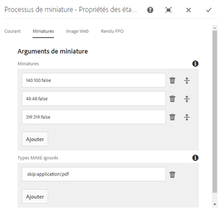
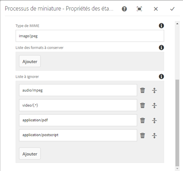
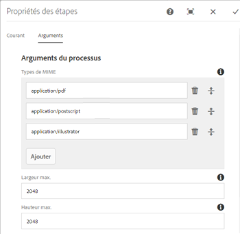
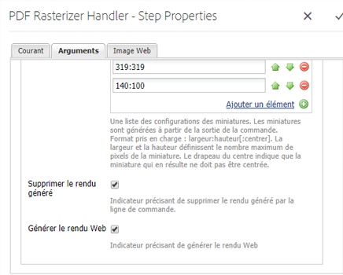
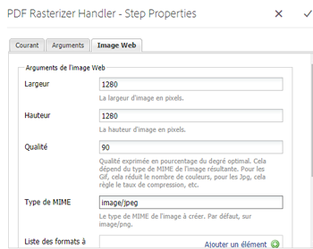
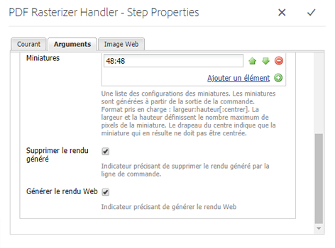
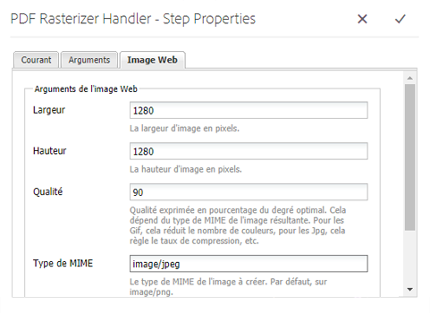

# Utilisation de PDF Rasterizer {#using-pdf-rasterizer}

Parfois, lorsque vous téléchargez des fichiers PDF ou AI de grande taille et riches en contenu vers Adobe Experience Manager (AEM) Assets, la bibliothèque par défaut risque de ne pas générer une sortie exacte. Dans de tels cas, la bibliothèque Adobe PDF Rasterizer peut générer une sortie plus fiable et plus précise par rapport à la sortie d’une bibliothèque par défaut.

Adobe recommande d’utiliser la bibliothèque PDF Rasterizer pour ce qui suit :

* Fichiers AI ou PDF lourds et encombrants.
* Fichiers AI ou PDF avec des miniatures non générés en standard.
* Fichiers AI contenant des couleurs PMS (Pantone Matching System).

Les miniatures et les aperçus générés à l’aide de PDF Rasterizer sont d’une plus grande qualité par rapport à la sortie native et fournissent donc une expérience d’affichage homogène sur tous les périphériques. La bibliothèque PDF Rasterizer d’Adobe ne prend en charge aucune conversion d’espace colorimétrique. Elle génère toujours une sortie RVB indépendamment de l’espace colorimétrique du fichier source.

1. Install the PDF Rasterizer package on your AEM instance from [Software Distribution](https://experience.adobe.com/#/downloads/content/software-distribution/en/aem.html?package=/content/software-distribution/en/details.html/content/dam/aem/public/adobe/packages/cq640/product/assets/aem-assets-pdf-rasterizer-pkg).

   >[!NOTE]
   >
   >La bibliothèque PDF Rasterizer est disponible sous Windows et Linux uniquement.

1. Accédez à la console de processus AEM Assets à partir de `https://[AEM_server]:[port]/workflow`.
1. Open the **[!UICONTROL DAM Update Asset]** workflow page.
1. Configurez les éléments suivants pour ignorer la génération de miniatures et de rendus Web par défaut pour les fichiers PDF et AI :

   * Ouvrez l’étape Processus **** des miniatures, puis ajoutez `application/pdf` ou `application/postscript` dans le champ **[!UICONTROL Ignorer les types]** MIME.

   

   * In the **[!UICONTROL Web Enabled Image]** tab, add `application/pdf` or `application/postscript` under **[!UICONTROL Skip List]** depending upon your requirements.

   

1. Open the **[!UICONTROL Rasterize PDF/AI Image Preview Rendition]** step, and remove the MIME type for which you want to skip the default generation of preview image renditions. For example, remove the MIME type *application/pdf*, *application/postscript,* or *application/illustrator* from the **[!UICONTROL MIME Types]** list.

   

1. Faites glisser l’étape **[!UICONTROL Gestionnaire PDF Rasterizer]** à partir du panneau latéral et déposez-le en dessous de l’étape **[!UICONTROL Miniatures des processus]**.
1. Configure the following arguments for the **[!UICONTROL PDF Rasterizer Handler]** step:

   * Mime Types: *application/pdf* or *application/postscript*
   * Commandes: `PDFRasterizer -d -p 1 -s 1280 -t PNG -i ${file}`
   * Ajoutez les tailles des miniatures : 319:319, 140:100, 48:48. Ajoutez une configuration de miniature personnalisée, si nécessaire.

   Voici des arguments de ligne de commande de la commande `PDFRasterizer` :

   **-d** : indicateur pour activer le rendu lissé du texte, des illustrations vectorielles et des images. Crée des images de meilleure qualité. Toutefois, l’ajout de ce paramètre ralentit l’exécution de la commande et augmente la taille des images.

   `-p`: Numéro de page. La valeur par défaut est toutes les pages. Le signe * indique toutes les pages.

   **-s** : dimension maximale de l’image (hauteur ou largeur). Elle est convertie en ppp pour chaque page. Si les pages sont de tailles différentes, chacune peut être redimensionnée selon une échelle différente. La valeur par défaut est la taille réelle de la page.

   **-t** : type d’image en sortie. Les types valides sont JPEG, PNG, GIF et BMP. La valeur par défaut est JPEG.

   **-i** : chemin du PDF en entrée. Ce paramètre est obligatoire.

   `-h`: Aide

1. Pour supprimer des rendus intermédiaires, sélectionnez **[!UICONTROL Supprimer le rendu généré]**.
1. Pour laisser PDF Rasterizer générer des rendus web, sélectionnez **[!UICONTROL Générer le rendu web]**.

   

1. Specify the settings in the **[!UICONTROL Web Enabled Image]** tab.

   

1. Enregistrez le workflow.
1. To enable PDF Rasterizer to process PDF pages with PDF libraries, open the **[!UICONTROL DAM Process Subasset]** model from the Workflow console.
1. From the side panel, drag the PDF Rasterizer Handler step under the **[!UICONTROL Create Web-Enabled Image Rendition]** step.
1. Configure the following arguments for the **[!UICONTROL PDF Rasterizer Handler]** step:

   * Types Mime : `application/pdf` ou `application/postscript`
   * Commandes: `PDFRasterizer -d -p 1 -s 1280 -t PNG -i ${file}`
   * Ajoutez les tailles des miniatures : 319:319, 140:100, 48:48. Ajoutez une configuration de miniature personnalisée, si nécessaire.

   Voici des arguments de ligne de commande de la commande PDFRasterizer :

   **-d** : indicateur pour activer le rendu lissé du texte, des illustrations vectorielles et des images. Crée des images de meilleure qualité. Toutefois, l’ajout de ce paramètre ralentit l’exécution de la commande et augmente la taille des images.

   **-p** : numéro de page. La valeur par défaut est toutes les pages. Un astérisque `*` indique toutes les pages.

   **-s** : dimension maximale de l’image (hauteur ou largeur). Elle est convertie en ppp pour chaque page. Si les pages sont de tailles différentes, chacune peut être redimensionnée selon une échelle différente. La valeur par défaut est la taille réelle de la page.

   **-t** : type d’image en sortie. Les types valides sont JPEG, PNG, GIF et BMP. La valeur par défaut est JPEG.

   **-i** : chemin du PDF en entrée. Ce paramètre est obligatoire.

   **-h** : aide.

1. Pour supprimer des rendus intermédiaires, sélectionnez **[!UICONTROL Supprimer le rendu généré]**.
1. Pour laisser PDF Rasterizer générer des rendus web, sélectionnez **[!UICONTROL Générer le rendu web]**.

   

1. Specify the settings in the **[!UICONTROL Web Enabled Image tab]**.

   

1. Enregistrez le workflow.
1. Téléchargez un fichier PDF ou un fichier AI vers AEM Assets. PDF Rasterizer génère les miniatures et les rendus web pour le fichier.
