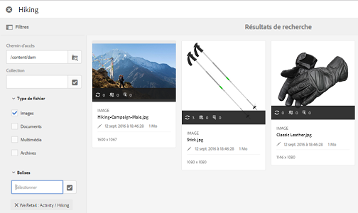

# Sélecteur de ressources {#asset-selector}

>[!NOTE]
>
>Le sélecteur de ressources s’appelait [Asset Picker](https://helpx.adobe.com/experience-manager/6-2/assets/using/asset-picker.html) dans les versions antérieures d’AEM.

Le sélecteur de ressources vous permet de rechercher, filtrer et parcourir les ressources au sein d’Adobe Experience Manager (AEM) Assets. Il vous permet également de récupérer les métadonnées des ressources sélectionnées à l’aide du sélecteur de ressources. Pour personnaliser l’interface du sélecteur de ressources, vous pouvez le démarrer avec les paramètres de requête pris en charge. Ces paramètres configurent le sélecteur de ressources pour un scénario particulier.

Currently, you can pass the request parameters `Asset Type` (*Image/Video/Text*) and `Selection mode` (*Single/Multiple*) as contextual information for the asset selector, which remains intact throughout the selection.

The asset selector uses the HTML5 **Window.postMessage** message to send data for the selected asset to the recipient.

Le sélecteur de ressources utilise le vocabulaire d’interface foundation picker de Granite. Par défaut, le sélecteur de ressources fonctionne en mode Navigation. Cependant, vous pouvez appliquer des filtres à l&#39;aide de l&#39;expérience Omnisearch pour affiner votre recherche de ressources particulières.

You can integrate any web page (irrespective of whether it is part of the CQ container) with the asset selector (`https://[AEM_server]:[port]/aem/assetpicker.html`).

## Paramètres contextuels {#contextual-parameters}

Vous pouvez transmettre les paramètres de requête suivants dans une URL pour démarrer le sélecteur de ressources dans un contexte spécifique :

| Nom | Valeurs | Exemple | Objectif |
|---|---|---|---|
| suffixe de la ressource (B) | Chemin d’accès au dossier indiqué comme suffixe de la ressource dans l’URL :`http://localhost:4502/aem/` `assetpicker.html/<folder_path>` | To launch the asset selector with a particular folder selected, for example with the folder `/content/dam/we-retail/en/activities` selected, the URL should be of the form: `http://localhost:4502/aem/assetpicker.html` `/content/dam/we-retail/en/activities?assettype=images` | Si vous avez besoin de sélectionner un dossier en particulier au démarrage du sélecteur de ressources, vous pouvez l’indiquer comme suffixe de ressource. |
| mode | single, multiple | `http://localhost:4502/aem/assetpicker.html` `?mode=multiple`   `http://localhost:4502/aem/assetpicker.html` `?mode=single` | En mode multiple, vous pouvez sélectionner plusieurs ressources simultanément à l’aide du sélecteur de ressources. |
| mimetype | Type(s) MIME (`/jcr:content/metadata/dc:format`) d’une ressource (le caractère générique est également pris en charge) | <ul><li>`http://localhost:4502/aem/assetpicker.html` `?mimetype=image/png`</li>  <li>`http://localhost:4502/aem/assetpicker.html` `?mimetype=*png`</li>  <li>`http://localhost:4502/aem/assetpicker.html` `?mimetype=*presentation`</li>  <li>`http://localhost:4502/aem/assetpicker.html` `?mimetype=*presentation&mimetype=*png`</li></ul> | Utilisez-le pour filtrer les ressources basées sur le(s) type(s) de MIME |
| dialog | true, false | `http://localhost:4502/aem/assetpicker.html` `?dialog=true` | Utilisez ces paramètres pour ouvrir le sélecteur de ressources en tant que boîte de dialogue Granite. Cette option ne peut être appliquée qu’au démarrage du sélecteur de ressources via le champ Chemin de Granite, en la configurant comme URL pickerSrc. |
| assettype (S) | images, documents, multimedia, archives | <ul><li>`http://localhost:4502/aem/assetpicker.html` `?assettype=images`</li> <li>`http://localhost:4502/aem/assetpicker.html?assettype=documents`</li> <li>`http://localhost:4502/aem/assetpicker.html?assettype=multimedia`</li> <li>`http://localhost:4502/aem/assetpicker.html?assettype=archives`</li> | Utilisez cette option pour filtrer les types de ressources en fonction de la valeur indiquée. |
| root | `<folder_path>` | `http://localhost:4502/aem/` `assetpicker.html?assettype=images` `&root=/content/dam/we-retail/en/activities` | Utilisez cette option pour spécifier le dossier racine du sélecteur de ressources. Ici, le sélecteur de ressources ne vous permet de sélectionner qu’une seule ressource enfant (directe/indirecte) sous le dossier racine. |

## Utilisation du sélecteur de ressources {#using-the-asset-selector}

1. Pour accéder à l’interface du sélecteur de ressources, accédez à `https://[AEM_server]:[port]/aem/assetpicker`.
1. Recherchez le dossier souhaité, puis sélectionnez une ou plusieurs ressources.

   

   Vous pouvez également rechercher la ressource souhaitée avec Omni Search et la sélectionner.

   

   Si vous recherchez des ressources avec Omni Search, vous pouvez sélectionner plusieurs filtres dans le volet **[!UICONTROL Filtres]** pour affiner votre recherche.

   

1. Tap/click **[!UICONTROL Select]** from the toolbar.
