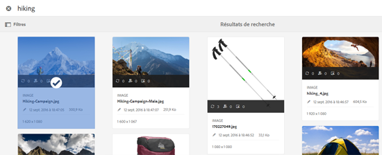

# Sélecteur de ressources {#asset-selector}

>[!NOTE]
>
>Le sélecteur de ressources a été appelé [Sélecteur de ressources](https://helpx.adobe.com/experience-manager/6-2/assets/using/asset-picker.html) dans les versions précédentes d’AEM.

Le sélecteur de ressources vous permet de parcourir, de rechercher et de filtrer des ressources dans [!DNL Adobe Experience Manager] Ressources. Il vous permet également de récupérer les métadonnées des ressources sélectionnées à l’aide du sélecteur de ressources. Pour personnaliser l’interface du sélecteur de ressources, vous pouvez le démarrer avec les paramètres de requête pris en charge. Ces paramètres configurent le sélecteur de ressources pour un scénario particulier.

Actuellement, vous pouvez transmettre les paramètres de requête `assettype` (*Image/Video/Text*) et la sélection `mode` (*Single/Multiple*) comme informations contextuelles pour le sélecteur de ressources, qui reste intact tout au long de la sélection.

Le sélecteur de ressources utilise le message HTML5 **Window.postMessage** pour envoyer des données pour la ressource sélectionnée au destinataire.

Le sélecteur de ressources utilise le vocabulaire d’interface foundation picker de Granite. Par défaut, le sélecteur de ressources fonctionne en mode de navigation. Cependant, vous pouvez appliquer des filtres à l&#39;aide de l&#39;expérience Omnisearch pour affiner votre recherche de ressources particulières.

Vous pouvez intégrer n’importe quelle page Web (qu’elle fasse partie du conteneur CQ) au sélecteur de ressources (`https://[AEM_server]:[port]/aem/assetpicker.html`).

## Paramètres contextuels {#contextual-parameters}

Vous pouvez transmettre les paramètres de requête suivants dans une URL pour démarrer le sélecteur de ressources dans un contexte spécifique :

| Nom | Valeurs | Exemple | Objectif |
|---|---|---|---|
| suffixe de la ressource (B) | Chemin d’accès au dossier indiqué comme suffixe de la ressource dans l’URL :`http://localhost:4502/aem/` `assetpicker.html/<folder_path>` | Pour lancer le sélecteur de ressources avec un dossier particulier sélectionné, par exemple avec le dossier `/content/dam/we-retail/en/activities` sélectionné, l’URL doit se présenter comme suit : `http://localhost:4502/aem/assetpicker.html` `/content/dam/we-retail/en/activities?assettype=images` | Si vous avez besoin de sélectionner un dossier en particulier au démarrage du sélecteur de ressources, vous pouvez l’indiquer comme suffixe de ressource. |
| mode | single, multiple | `http://localhost:4502/aem/assetpicker.html` `?mode=multiple`   `http://localhost:4502/aem/assetpicker.html` `?mode=single` | En mode multiple, vous pouvez sélectionner plusieurs ressources simultanément à l’aide du sélecteur de ressources. |
| dialog | true, false | `http://localhost:4502/aem/assetpicker.html` `?dialog=true` | Utilisez ces paramètres pour ouvrir le sélecteur de ressources en tant que boîte de dialogue Granite. Cette option ne peut être appliquée qu’au démarrage du sélecteur de ressources via le champ Chemin de Granite, en la configurant comme URL pickerSrc. |
| root | `<folder_path>` | `http://localhost:4502/aem/` `assetpicker.html?assettype=images` `&root=/content/dam/we-retail/en/activities` | Utilisez cette option pour spécifier le dossier racine du sélecteur de ressources. Ici, le sélecteur de ressources ne vous permet de sélectionner qu’une seule ressource enfant (directe/indirecte) sous le dossier racine. |
| viewmode | de recherches |  | Pour lancer le sélecteur de ressources en mode de recherche, avec les paramètres de type et de type de ressource. |
| assettype (S) | images, documents, multimedia, archives | <ul><li>`http://localhost:4502/aem/assetpicker.html?viewmode=search&assettype=images`</li> <li>`http://localhost:4502/aem/assetpicker.html?viewmode=search&assettype=documents`</li> <li>`http://localhost:4502/aem/assetpicker.html?viewmode=search&assettype=multimedia`</li> <li>`http://localhost:4502/aem/assetpicker.html?viewmode=search&assettype=archives`</li> | Utilisez cette option pour filtrer les types de ressources en fonction de la valeur indiquée. |
| mimetype | Type(s) MIME (`/jcr:content/metadata/dc:format`) d’une ressource (le caractère générique est également pris en charge) | <ul><li>`http://localhost:4502/aem/assetpicker.html?viewmode=search&mimetype=image/png`</li>  <li>`http://localhost:4502/aem/assetpicker.html?viewmode=search&?mimetype=*png`</li>  <li>`http://localhost:4502/aem/assetpicker.html?viewmode=search&mimetype=*presentation`</li>  <li>`http://localhost:4502/aem/assetpicker?viewmode=search&mimetype=*presentation&mimetype=*png`</li></ul> | Utilisez-le pour filtrer les ressources basées sur le(s) type(s) de MIME |

## Utiliser le sélecteur de ressources {#using-the-asset-selector}

1. Pour accéder à l’interface du sélecteur de ressources, accédez à `https://[AEM_server]:[port]/aem/assetpicker`.
1. Recherchez le dossier souhaité, puis sélectionnez une ou plusieurs ressources.

   

   Vous pouvez également rechercher la ressource souhaitée avec Omni Search et la sélectionner.

   

   Si vous recherchez des ressources avec Omni Search, vous pouvez sélectionner plusieurs filtres dans le volet **[!UICONTROL Filtres]** pour affiner votre recherche.

   

1. Appuyez/cliquez sur **[!UICONTROL Sélectionner]** dans la barre d’outils.
