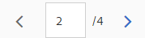
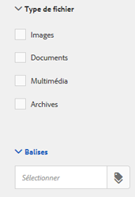

# Modèles de ressources {#asset-templates}

Les modèles de ressources sont une catégorie spéciale de ressources qui facilite la réaffectation rapide de contenu visuellement riche pour les supports numériques et imprimés. Un modèle de ressource comprend deux parties : une section de message fixe et une section modifiable.

La section fixe peut comprendre du contenu propriétaire, comme le logo d’une marque ou des informations sur les droits d’auteur, pour lequel la modification n’est pas activée. La section modifiable peut contenir du contenu visuel et textuel dans des champs qui peuvent être modifiés pour personnaliser la messagerie.

Parce qu’ils permettent de réaliser des modifications limitées tout en garantissant une harmonie d’ensemble, les modèles de ressources sont des blocs de création parfaits pour adapter et diffuser rapidement votre contenu. La réutilisation de contenu permet de réduire les coûts de gestion des canaux papier et numériques. Cela garantit en outre une expérience globale cohérente, quel que soit le canal de diffusion.

En tant que spécialiste du marketing, vous pouvez stocker et gérer des modèles dans AEM Assets et utiliser un seul modèle de base pour créer facilement plusieurs expériences d’impression personnalisées. Vous pouvez créer différents types de documents marketing, par exemple, des brochures, des prospectus, des cartes postales, des cartes de visite, etc. pour transmettre de façon claire votre message marketing à vos clients. Vous pouvez également assembler des documents papier comportant plusieurs pages à partir de documents papier nouveaux ou existants. Vous pouvez surtout diffuser des expériences à la fois numériques et papier simultanément en toute simplicité et offrir ainsi aux utilisateurs une expérience intégrée cohérente.

Si les modèles de ressources sont pour la plupart des fichiers InDesign, il n’est pas nécessaire de maîtriser InDesign pour réaliser des documents de qualité. Vous n’avez pas besoin de mapper les champs de votre modèle InDesign avec vos champs produit comme cela est nécessaire lors de la création de catalogues. Vous pouvez modifier les modèles en mode WYSIWYG directement sur l’interface Web. Toutefois, pour qu’InDesign puisse traiter vos modifications, vous devez au préalable configurer AEM Assets pour l’intégrer avec le serveur InDesign.

La possibilité de modifier les modèles InDesign depuis l’interface web contribue à une meilleure collaboration entre les équipes marketing et créatives tout en réduisant le délai de diffusion des actions de promotion locales.

Avec les modèles de ressources, vous pouvez :

* Modifier des champs de modèle modifiables depuis l’interface web
* Contrôler les paramètres de base de style du texte, par exemple, la taille, le style et le type de police au niveau des balises
* Modifier les images du modèle à l’aide du sélecteur de contenu
* Prévisualiser les modifications du modèle
* Fusionner plusieurs fichiers de modèle pour créer un document multipage

Lorsque vous choisissez un modèle pour vos documents marketing, AEM Assets crée une copie du modèle qui peut être modifiée. Le modèle original est préservé, ce qui garantit que votre signalétique reste intacte et peut être réutilisée pour renforcer la cohérence de la marque.

Vous pouvez exporter le fichier mis à jour dans le dossier parent aux formats suivants :

* INDD
* PDF
* JPG

Vous pouvez également télécharger ces différents formats sur votre système local.

## Créer une garantie {#creating-a-collateral}

Imaginons que vous voulez créer des contenus numériques papier, comme des brochures, des prospectus ou des publicités pour une future campagne, et les envoyer à des magasins dans le monde entier. Créer de tels documents à l’aide d’un modèle vous permet de proposer la même expérience client sur tous les canaux de diffusion. Les graphistes peuvent créer des modèles pour la campagne (document d’une seule page ou de plusieurs pages) à l’aide d’une solution de création, comme InDesign et vous les envoyer sur AEM Assets. Avant de créer une garantie, demandez qu’un ou plusieurs modèles INDD soient chargés et disponibles en Experience Manager à l’avance.

1. Cliquez ou appuyez sur le logo AEM, puis cliquez/appuyez sur **[!UICONTROL Ressources]** sur la page Navigation.
1. Dans les options, choisissez **[!UICONTROL Modèles]**.

   

1. Cliquez/appuyez sur **[!UICONTROL Créer]**, puis choisissez dans le menu le type de document que vous souhaitez créer. Par exemple, choisissez **[!UICONTROL Brochure]**.

   

1. Demandez qu’un ou plusieurs modèles INDD soient chargés et disponibles en Experience Manager à l’avance. Choisissez un modèle pour votre brochure, puis cliquez/appuyez sur **[!UICONTROL Suivant]**.

   

1. Entrez un nom et éventuellement une description pour la brochure.

   

1. (En option) Cliquez/appuyez sur l’icône **[!UICONTROL Balises]** sous le champ **[!UICONTROL Balises]**, puis sélectionnez une ou plusieurs balises pour la brochure. Cliquez/appuyez sur **[!UICONTROL Confirmer]** pour confirmer votre sélection.

   

1. Cliquez sur **[!UICONTROL Créer]**. Une boîte de dialogue s’ouvre pour confirmer que la nouvelle brochure a été créée. Cliquez/appuyez sur **[!UICONTROL Ouvrir]** pour ouvrir la brochure en mode Édition.

   

   Vous pouvez aussi fermer la boîte de dialogue et accéder au dossier dans la page Modèles de départ pour afficher la brochure créée. Le type de document apparaît sur sa miniature en mode Carte. Par exemple, Brochure est ici affiché sur la miniature.

   

## Modifier une garantie {#editing-a-collateral}

Vous pouvez modifier un document immédiatement après sa création. Vous pouvez aussi choisir de l’ouvrir depuis la page Modèles ou la page des détails du fichier.

1. Pour ouvrir un document pour le modifier, procédez de l’une des façons suivantes :

   * Ouvrez le document marketing (une brochure ici) créé à l’étape 7 de la section [Création d’un document](asset-templates.md#creating-a-collateral).
   * Depuis la page Modèles, accédez au dossier où vous avez placé le document créé, puis cliquez/appuyez sur l’option d’édition rapide depuis la miniature d’un document.
   * Dans la page des détails du document, cliquez/appuyez sur l’icône Modifier dans la barre d’outils.
   * Sélectionnez la garantie, puis cliquez/appuyez sur l’icône Modifier de la barre d’outils.

   

   L’outil de recherche de ressources et l’éditeur de texte sont affichés à gauche de la page. L’éditeur de texte s’ouvre par défaut.

   Vous pouvez utiliser l’éditeur de texte pour modifier le texte à afficher dans le champ de texte. Vous pouvez modifier la taille, le style, la couleur et le type de police au niveau de la balise.

   À l’aide de l’outil de recherche de ressources, vous pouvez rechercher des images dans AEM Assets et remplacer les images modifiables du modèle par d’autres que vous aurez choisies.

   

   Les champs modifiables sont affichés à droite. Pour qu’un champ soit modifiable dans AEM Assets, le champ correspondant dans le modèle doit être « marqué » dans InDesign. Plus exactement, il doit être indiqué comme étant modifiable dans InDesign.

   

   >[!NOTE]
   >
   >Vérifiez que votre instance AEM est intégrée avec un serveur InDesign pour qu’AEM Assets puisse extraire les données du modèle InDesign et les rendre modifiables. Pour plus d&#39;informations, voir [Intégration d&#39;AEM Assets à l&#39;InDesign Server](indesign.md).

1. Pour modifier le texte d’un champ modifiable, cliquez/appuyez sur le champ de texte dans la liste des champs modifiables, puis modifiez le texte dans le champ.

   

   Vous pouvez modifier les propriétés de texte, par exemple la taille, la couleur ou le style de police à l’aide des options fournies.

1. Cliquez/appuyez sur l’icône **[!UICONTROL Aperçu]** pour prévisualiser les modifications.

   

1. Pour permuter une image, cliquez/appuyez sur l’icône **[!UICONTROL Asset Finder]**.

   

1. Sélectionnez le champ d’image dans la liste des champs modifiables, puis faites glisser l’image souhaitée du sélecteur de ressource vers le champ modifiable.

   

   Vous pouvez également rechercher des images à l’aide de mots-clés, de balises ou selon leur état de publication. Vous pouvez parcourir le référentiel d’AEM Assets et accéder à l’emplacement de l’image souhaitée.

   

1. Cliquez/appuyez sur l&#39;icône **[!UICONTROL Prévisualisation]** pour prévisualisation de l&#39;image.

   

1. Pour modifier une page en particulier dans un document contenant plusieurs pages, utilisez l’outil de navigation au bas de la page.

   

1. Cliquez/appuyez sur l’icône **[!UICONTROL Aperçu]** dans la barre d’outils pour prévisualiser toutes les modifications. Cliquez/appuyez sur **[!UICONTROL Terminé]** pour enregistrer les modifications apportées à la documentation.

   >[!NOTE]
   >
   >Les icônes Aperçu et Terminé sont activées uniquement lorsqu’il ne manque aucune icône aux champs d’image modifiables dans le document. Si des icônes sont manquantes dans votre document, c’est qu’AEM est incapable de résoudre les images du modèle InDesign. AEM ne peut pas résoudre les images dans les cas suivants :
   >
   >* Les images ne sont pas incorporées au modèle InDesign sous-jacent.
   >* Les images ne sont pas liées depuis le système de fichiers local.

   >
   >Pour permettre à AEM de résoudre les images, procédez de la façon suivante :
   >
   >* Incorporez les images lorsque vous créez les modèles InDesign (reportez-vous à la section [À propos des liens et des objets graphiques incorporés](https://helpx.adobe.com/fr/indesign/using/graphics-links.html)).
   >* Montez AEM sur votre système de fichiers local, puis mappez les icônes manquantes avec les ressources AEM existantes.

   >
   >Pour plus d’informations sur l’utilisation des documents d’InDesign, voir [Bonnes pratiques relatives à l’utilisation des Documents d’InDesign dans AEM](https://helpx.adobe.com/experience-manager/kb/best-practices-idd-docs-aem.html).

1. Pour générer un rendu PDF pour la brochure, sélectionnez l’option Acrobat dans la boîte de dialogue, puis cliquez sur **[!UICONTROL Continuer]**.
1. Le document est créé dans le dossier où vous avez commencé. Pour afficher les rendus, ouvrez le document et choisissez **[!UICONTROL Rendus]** dans la liste de navigation globale.

   

1. Cliquez/appuyez sur le rendu PDF depuis la liste des rendus pour télécharger le fichier PDF. Ouvrez le fichier PDF pour réviser le document.

   

## Création d’un document fusionné {#merge-collateral}

1. Cliquez ou appuyez sur **[!UICONTROL Outils > Ressources]**.
1. Dans les options, choisissez **[!UICONTROL Modèles]**.
1. Cliquez/appuyez sur **[!UICONTROL Créer]** et choisissez **[!UICONTROL Fusionner]** dans le menu.

   

1. Dans la page Fusion de modèle, cliquez/appuyez sur l’icône Fusionner.

   

1. Accédez aux documents que vous souhaitez fusionner, cliquez/appuyez sur les miniatures des documents que vous souhaitez fusionner pour les sélectionner.

   

   Vous pouvez également rechercher des modèles avec OmniSearch.

   

   Vous pouvez parcourir le référentiel ou les collections d’AEM Assets, puis accéder à l’emplacement des modèles souhaités et les sélectionner pour la fusion.

   

   Vous pouvez appliquer différents filtres pour rechercher les modèles souhaités. Par exemple, vous pouvez rechercher des modèles en fonction de leur type ou de leurs balises.

   

1. Cliquez ou appuyez sur **[!UICONTROL Suivant]** dans la barre d’outils.
1. Dans l’écran **[!UICONTROL Prévisualisation et réorganisation]**, réorganisez les modèles si nécessaire et prévisualisation la sélection des modèles à fusionner. Cliquez/appuyez ensuite sur **[!UICONTROL Suivant]** dans la barre d’outils.

   

1. Dans l’écran Configurer un modèle, spécifiez un nom pour la garantie. Vous pouvez également spécifier les balises que vous considérez appropriées. Pour exporter le résultat au format PDF, sélectionnez l’option **[!UICONTROL Acrobat (.PDF)]**. Par défaut, le document est exporté aux formats JPG et InDesign. Pour modifier la miniature du document multipage, cliquez/appuyez sur **[!UICONTROL Modifier la miniature]**.

   

1. Cliquez/appuyez sur **[!UICONTROL Enregistrer]**, puis cliquez/appuyez sur **[!UICONTROL OK]** dans la boîte de dialogue pour fermer la boîte de dialogue. Le document multipage est créé dans le dossier de départ.

   >[!NOTE]
   >
   >Vous ne pouvez pas modifier ultérieurement un document fusionné ni l’utiliser pour créer d’autres documents.

