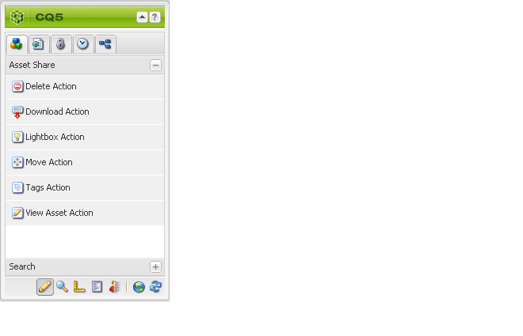
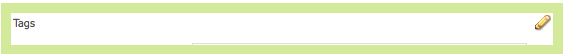
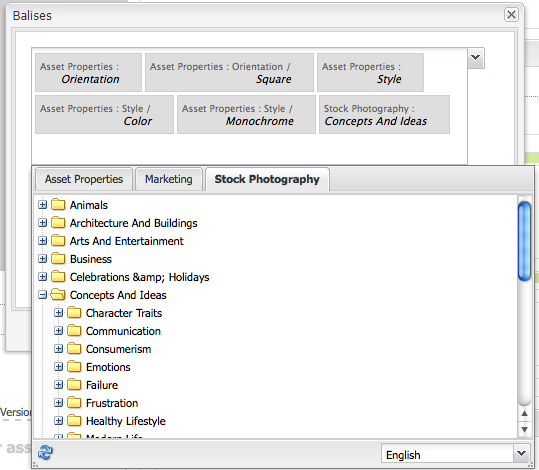

# Créer et configurer des pages Éditeur de ressources {#creating-and-configuring-asset-editor-pages}

>[!CAUTION]
>
>AEM 6.4 a atteint la fin de la prise en charge étendue et cette documentation n’est plus mise à jour. Pour plus d’informations, voir notre [période de support technique](https://helpx.adobe.com/fr/support/programs/eol-matrix.html). Rechercher les versions prises en charge [here](https://experienceleague.adobe.com/docs/?lang=fr).

Ce document répond aux questions suivantes :

* Pourquoi créer des pages Éditeur de ressources personnalisées ?
* Comment créer et personnaliser des pages Éditeur de ressources, qui sont des pages de gestion de contenu web qui vous permettent d’afficher et de modifier des métadonnées, et d’effectuer des actions sur la ressource.
* Comment modifier plusieurs ressources simultanément.

>[!NOTE]
>
>Le partage de ressources est disponible en tant qu’implémentation de référence open source. Voir [Asset Share Commons](https://adobe-marketing-cloud.github.io/asset-share-commons/) . Il n’est pas officiellement pris en charge.

## Pourquoi créer et configurer des pages Éditeur de ressources ? {#why-create-and-configure-asset-editor-pages}

La gestion des ressources numériques est utilisée dans un nombre toujours plus grand de scénarios. Lorsque vous passez d’une solution à petite échelle pour un petit groupe d’utilisateurs formés (par exemple des photographes ou des taxonomistes) à des groupes d’utilisateurs plus vastes et plus diversifiés (par exemple, des utilisateurs professionnels, des auteurs de gestion de contenu Web, des journalistes, etc.), l’interface utilisateur puissante d’[!DNL Adobe Experience Manager Assets] destinée aux utilisateurs professionnels peut fournir trop d’informations et les parties prenantes commencent à demander des interfaces utilisateur ou des applications spécifiques pour accéder aux ressources numériques qui les concernent.

Ces applications axées sur les ressources peuvent être de simples galeries de photos dans un intranet où les employés peuvent télécharger des photos à partir de visites de salons commerciaux ou d’un centre de presse dans un site Web public, comme l’exemple fourni avec Geometrixx. Les applications axées sur les ressources peuvent également s’étendre à des solutions complètes, telles que les paniers d’achat, le passage en caisse et les processus de vérification.

La création d’une application axée sur les ressources devient dans une large mesure un processus de configuration qui ne nécessite pas de codage, qui ne nécessite que la connaissance des groupes d’utilisateurs et de leurs besoins, ainsi que la connaissance des métadonnées utilisées. Les applications axées sur les ressources créées avec [!DNL Assets] sont extensibles : avec un effort de codage minimal, il est possible de créer des composants réutilisables pour la recherche, l’affichage et la modification des ressources.

Dans [!DNL Experience Manager], une application axée sur les ressources consiste en une page Éditeur de ressources pouvant être utilisée pour obtenir une vue détaillée d’une ressource spécifique. Une page Éditeur de ressources permet également de modifier les métadonnées, à condition que l’utilisateur accédant à la ressource dispose des autorisations nécessaires.

## Création et configuration d’une page Partage de ressources {#creating-and-configuring-an-asset-share-page}

Vous personnalisez la fonctionnalité de l’outil de recherche de gestion des actifs numériques et créez des pages qui contiennent toutes les fonctionnalités dont vous avez besoin, appelées pages de partage de ressources. Pour créer une page Partage de ressources, vous ajoutez la page à l’aide du modèle Partage de ressources de Geometrixx , puis vous personnalisez les actions que les utilisateurs peuvent effectuer sur cette page, déterminez la manière dont les visiteurs voient les ressources et décidez comment les utilisateurs peuvent créer leurs requêtes.

Voici quelques cas d’utilisation pour créer une page Partage de ressources personnalisée :

* Centre de presse pour les journalistes
* Moteur de recherche d’images pour les utilisateurs métier internes
* Base de données des images pour les utilisateurs du site web
* Interface de balisage multimédia pour les éditeurs de métadonnées

### Création d’une page Partage de ressources {#creating-an-asset-share-page}

Pour créer une page Partage de ressources, vous pouvez la créer lorsque vous travaillez sur des sites web ou à partir du gestionnaire des ressources numériques.

>[!NOTE]
>
>Par défaut, lorsque vous créez une page Partage de ressources à partir de **Nouveau** dans le gestionnaire des ressources numériques, une visionneuse de ressources et un éditeur de ressources sont automatiquement créés pour vous.

Pour créer une page Partage de ressources dans le **Sites web** console :

1. Dans le **[!UICONTROL Sites web]** , accédez à l’emplacement où vous souhaitez créer une page de partage de ressources, puis cliquez sur **[!UICONTROL Nouveau]**.

1. Sélectionnez la **[!UICONTROL Partage de ressources]** page et clic **[!UICONTROL Créer]**. La nouvelle page est créée et la page de partage de ressources est répertoriée dans le **[!UICONTROL Sites web]** .

La page de base créée à l’aide du modèle de partage de ressources de gestion des actifs numériques Geometrixx se présente comme suit :

Pour personnaliser votre page Partage de ressources, vous utilisez des éléments du sidekick et vous modifiez également les propriétés du créateur de requêtes. La page **[!UICONTROL Centre de presse Geometrixx]** est une version personnalisée d’une page basée sur ce modèle :

Pour créer une page de partage de ressources via le gestionnaire des ressources numériques :

1. Dans le gestionnaire de ressources numériques, dans **[!UICONTROL Nouveau]**, sélectionnez **[!UICONTROL Nouveau partage de ressources]**.
1. Dans le **[!UICONTROL Titre]**, saisissez le nom de la page de partage de ressources. Si vous le souhaitez, saisissez un nom pour l’URL.

   

1. Double-cliquez sur la page Partage de ressources pour l’ouvrir et configurer la page.

   

   Par défaut, lorsque vous créez une page Partage de ressources à partir de **[!UICONTROL Nouveau]**, une visionneuse de ressources et un éditeur de ressources sont automatiquement créés pour vous.

#### Personnalisation des actions {#customizing-actions}

Vous pouvez déterminer les actions que les utilisateurs peuvent effectuer sur des ressources numériques sélectionnées à partir d’une sélection d’actions prédéfinies.

Pour ajouter des actions à la page Partage de ressources :

1. Dans la page Partage de ressources que vous souhaitez personnaliser, cliquez sur **[!UICONTROL Actions]** dans le sidekick.

   Les actions disponibles sont les suivantes :
   

| Action | Description |
|---|---|
| [!UICONTROL Supprimer l’action] | Les utilisateurs peuvent supprimer les ressources sélectionnées. |
| [!UICONTROL Télécharger l’action] | Permet aux utilisateurs de télécharger les ressources sélectionnées sur leurs ordinateurs. |
| [!UICONTROL Action Lightbox] | Enregistre les ressources dans une « Lightbox » où vous pouvez effectuer d’autres actions. La lightbox est pratique lorsque vous travaillez avec des ressources sur plusieurs pages. Le Lightbox peut également être utilisé comme panier pour les ressources. |
| [!UICONTROL Déplacer l’action] | Les utilisateurs peuvent déplacer la ressource vers un autre emplacement. |
| [!UICONTROL Action sur les balises] | Permet aux utilisateurs d’ajouter des balises aux ressources sélectionnées |
| [!UICONTROL Action Afficher un élément] | Ouvre la ressource dans l’éditeur de ressources à des fins de manipulation par l’utilisateur. |

1. Faites glisser l’action appropriée vers la zone **Actions** de la page. Cela crée un bouton utilisé pour exécuter cette action.

   

#### Déterminer la présentation des résultats de recherche {#determining-how-search-results-are-presented}

Vous déterminez le mode d’affichage des résultats à partir d’une liste prédéfinie de loupes.

Pour modifier la manière dont les résultats de recherche sont affichés :

1. Dans la page Partage de ressources que vous souhaitez personnaliser, cliquez sur **[!UICONTROL Rechercher]**.

   

1. Faites glisser la loupe appropriée vers le centre supérieur de la page. Dans le Centre de presse, les lentilles sont déjà disponibles. Les utilisateurs appuient sur l’icône de loupe appropriée pour afficher les résultats de la recherche selon leurs besoins.

Les loupes suivantes sont disponibles :

| Objectif | Description |
|---|---|
| **[!UICONTROL Liste des loupes]** | Présente les ressources sous la forme d’une liste avec des détails. |
| **[!UICONTROL Loupe mosaïque]** | Présente les ressources de manière mosaïque. |

#### Loupe mosaïque {#mosaic-lens}

#### Liste des loupes {#list-lens}

#### Personnalisation de Query Builder {#customizing-the-query-builder}

Le Query Builder vous permet de saisir des termes de recherche et de créer du contenu pour la page Partage de ressources. Lorsque vous modifiez Query Builder, vous pouvez également déterminer le nombre de résultats de recherche affichés par page, l’éditeur de ressources qui s’ouvre lorsque vous double-cliquez sur une ressource, le chemin d’accès dans lequel la requête effectue des recherches et la personnalisation des types de noeuds.

Pour personnaliser Query Builder :

1. Dans la page Partage de ressources que vous souhaitez personnaliser, cliquez sur **[!UICONTROL Modifier]** dans Query Builder. Par défaut, la variable **[!UICONTROL Général]** s’ouvre.

1. Sélectionnez le nombre de résultats par page, le chemin d’accès à l’éditeur de ressources (si vous disposez d’un éditeur de ressources personnalisé) et le titre Actions.

   

1. Cliquez sur le bouton **[!UICONTROL Chemins]** . Entrez un ou plusieurs chemins d’accès que la recherche exécutera. Ces chemins sont remplacés si l’utilisateur utilise le prédicat Chemins .

   

1. Entrez un autre type de noeud, le cas échéant.

1. Dans le **[!UICONTROL URL de Query Builder]** , vous pouvez remplacer ou renvoyer à la ligne le Query Builder et saisir les nouvelles URL de servlet avec le composant Query Builder existant. Dans le **[!UICONTROL URL du flux]** , vous pouvez également remplacer l’URL du flux.

   

1. Dans le **[!UICONTROL Texte]** , saisissez le texte à afficher pour les résultats et les numéros de page des résultats. Cliquez sur **[!UICONTROL OK]** lorsque vous avez terminé d’apporter des modifications.

   

#### Ajout de prédicats {#adding-predicates}

[!DNL Experience Manager Assets] comprend un certain nombre de prédicats que vous pouvez ajouter à la page Partage de ressources. Elles permettent à vos utilisateurs d’affiner davantage les recherches. Dans certains cas, ils peuvent remplacer un paramètre de créateur de requêtes (par exemple, le paramètre Chemin ).

Pour ajouter des prédicats :

1. Dans la page Partage de ressources que vous souhaitez personnaliser, cliquez sur **[!UICONTROL Rechercher]**.

   

1. Faites glisser les prédicats appropriés vers la page Partage de ressources sous le créateur de requêtes. Cela permet de créer les champs appropriés.

   

   Les prédicats suivants sont disponibles :

| Prédicat | Description |
|---|---|
| **[!UICONTROL Prédicat de la date]** | Permet aux utilisateurs de rechercher des ressources qui ont été modifiées avant et après certaines dates. |
| **[!UICONTROL Options du prédicat]** | Le propriétaire du site peut spécifier une propriété à rechercher (comme dans le prédicat de propriété, par exemple cq:tags) et une arborescence de contenu à partir de laquelle renseigner les options (par exemple, l’arborescence de balises). Cela génère une liste d’options dans laquelle les utilisateurs peuvent sélectionner les valeurs (balises) que la propriété sélectionnée (propriété de balise) doit comporter. Ce prédicat vous permet de créer des contrôles de liste tels que la liste des balises, les types de fichiers, les orientations d’image, etc. Il est idéal pour un ensemble fixe d’options. |
| **[!UICONTROL Prédicat du chemin d’accès]** | Permet aux utilisateurs de définir le chemin d’accès et les sous-dossiers, le cas échéant. |
| **[!UICONTROL Prédicat de la propriété]** | Le propriétaire du site spécifie une propriété à rechercher, par exemple tiff:ImageLength . L’utilisateur peut alors saisir une valeur, par exemple 800. Cette propriété renvoie toutes les images de 800 pixels de haut. Prédicat utile si votre propriété peut avoir des valeurs arbitraires. |

Pour plus d’informations, voir [prédicat javadocs](https://helpx.adobe.com/experience-manager/6-4/sites/developing/using/reference-materials/javadoc/com/day/cq/search/eval/package-summary.html).

1. Pour configurer davantage le prédicat, double-cliquez dessus. Par exemple, lorsque vous ouvrez le prédicat de chemin, vous devez attribuer le chemin racine.

   

## Création et configuration d’une page Éditeur de ressources {#creating-and-configuring-an-asset-editor-page}

Vous personnalisez l’éditeur de ressources pour déterminer comment les utilisateurs peuvent afficher et modifier les ressources numériques. Pour ce faire, créez une page Éditeur de ressources, puis personnalisez les vues et les actions que les utilisateurs peuvent effectuer sur cette page.

>[!NOTE]
>
>Si vous souhaitez ajouter des champs personnalisés à l’éditeur de ressources de gestion des actifs numériques, ajoutez de nouveaux noeuds cq:Widget à `/apps/dam/content/asseteditors.`

### Création de la page Éditeur de ressources {#creating-the-asset-editor-page}

Lors de la création de la page Éditeur de ressources, il est recommandé de créer la page directement sous la page Partage de ressources.

Pour créer une page Éditeur de ressources :

1. Dans le **[!UICONTROL Sites web]** , accédez à l’emplacement où vous souhaitez créer une page de l’éditeur de ressources, puis cliquez sur **[!UICONTROL Nouveau]**.

1. Sélectionnez **[!UICONTROL Éditeur de ressources Geometrixx]**, puis cliquez sur **[!UICONTROL Créer]**. La nouvelle page est créée et elle est répertoriée dans l’onglet **[!UICONTROL Sites web]**.

La page de base créée à l’aide du modèle Éditeur de ressources de Geometrixx se présente comme suit :

Pour personnaliser votre page Éditeur de ressources, utilisez les éléments du sidekick. La page Éditeur de ressources accessible à partir du **[!UICONTROL Centre de presse Geometrixx]** est une version personnalisée d’une page basée sur le modèle suivant :

#### Définition de l’Éditeur de ressources qui s’ouvre à partir d’une page Partage de ressources {#setting-which-asset-editor-opens-from-an-asset-share-page}

Après avoir créé la page Éditeur de ressources personnalisée, vous devez vous assurer que lorsque vous double-cliquez sur des ressources, le partage de ressources personnalisé que vous avez créé ouvre les ressources dans la page Éditeur personnalisé.

Pour définir la page Éditeur de ressources :

1. Dans la page Partage de ressources, cliquez sur **[!UICONTROL Modifier]** en regard de Query Builder.

   

1. Cliquez sur l’onglet **[!UICONTROL Général]** s’il n’est pas déjà sélectionné.

1. Dans le champ **[!UICONTROL Chemin d’accès à l’Éditeur de ressources]**, saisissez le chemin d’accès à l’Éditeur de ressources dans lequel vous souhaitez que la page Partage de ressources ouvre les ressources, puis cliquez sur **[!UICONTROL OK]**.

   

#### Ajouter des composants de l’Éditeur de ressources {#adding-asset-editor-components}

Vous déterminez les fonctionnalités d’un éditeur de ressources en ajoutant des composants à la page.

Pour ajouter des composants de l’éditeur de ressources :

1. Dans la page Éditeur de ressources que vous souhaitez personnaliser, cliquez sur **[!UICONTROL Éditeur de ressources]** dans le sidekick. Tous les composants d’éditeur de ressources disponibles s’affichent.

   >[!NOTE]
   >
   >Ce que vous pouvez personnaliser dépend des composants disponibles. Pour activer les composants, accédez au mode Conception et sélectionnez les composants qui doivent être activés.

1. Faites glisser les composants depuis le sidekick vers l’Éditeur de ressources et apportez les modifications nécessaires dans les boîtes de dialogue des composants. Les composants sont décrits dans le tableau suivant et décrits dans les instructions détaillées qui suivent.

   >[!NOTE]
   >
   >Lors de la conception de la page de l’éditeur de ressources, vous créez des composants en lecture seule ou modifiables. Les utilisateurs savent qu’un champ peut être modifié si une image de crayon apparaît dans ce composant. Par défaut, la plupart des composants sont configurés en lecture seule.

   | Composant | Description |
   |---|---|
   | **[!UICONTROL Formulaire de métadonnées] et [!UICONTROL Champ de texte de métadonnées]** | Permet d’ajouter des métadonnées supplémentaires à une ressource et d’effectuer une action sur cette ressource, telle que l’envoi. |
   | **[!UICONTROL Sous-ressources]** | Permet de personnaliser les sous-ressources. |
   | **Balises** | Permet aux utilisateurs de sélectionner et d’ajouter des balises à une ressource. |
   | **[!UICONTROL Miniature]** | Affiche une miniature de la ressource, son nom de fichier et vous permet d’ajouter un texte de remplacement. Vous pouvez également ajouter des actions de l’Éditeur de ressources dans ce composant. |
   | **[!UICONTROL Titre]** | Affiche le titre de la ressource, qui peut être personnalisé. |

   

#### Formulaire de métadonnées et champ de texte - Configuration du composant Afficher les métadonnées {#metadata-form-and-text-field-configuring-the-view-metadata-component}

Le Formulaire de métadonnées est un formulaire incluant une action de début et de fin. Entre les deux, vous saisissez **[!UICONTROL Texte]** champs. Voir [Forms](../sites-authoring/default-components.md) pour plus d’informations sur l’utilisation des formulaires.

1. Créez une action de début en cliquant sur **[!UICONTROL Modifier]** dans la zone de Début du formulaire. Si vous le souhaitez, vous pouvez saisir un titre de boîte. Par défaut, le titre de la boîte est **[!UICONTROL Métadonnées]**. Cochez la case Validation du client si vous souhaitez que le code client JavaScript pour la validation soit généré.

   

1. Créez une action de fin en cliquant sur **[!UICONTROL Modifier]** dans la zone de Fin du formulaire. Par exemple, vous pouvez créer une **[!UICONTROL Envoyer]** pour permettre aux utilisateurs d’envoyer leurs modifications de métadonnées. Vous pouvez éventuellement ajouter une **[!UICONTROL Réinitialiser]** qui réinitialise les métadonnées à leur état d’origine.

   

1. Entre le **[!UICONTROL Début du formulaire]** et la **Fin de formulaire**, faites glisser les champs de texte des métadonnées vers le formulaire. Les utilisateurs renseignent les métadonnées dans ces champs de texte, qu’ils peuvent envoyer, ou bien ils peuvent effectuer une autre action.

1. Double-cliquez sur le nom du champ, par exemple **Titre**, pour ouvrir le champ de métadonnées et apporter des modifications. Dans l’onglet **[!UICONTROL Général]** de la fenêtre [!UICONTROL Modifier le composant], vous définissez l’espace de noms et le libellé du champ, ainsi que le type, par exemple `dc:title`.

   

   Voir [Personnalisation et extension [!DNL Assets]](extending-assets.md) pour plus d’informations sur la modification des espaces de noms disponibles dans le formulaire de métadonnées.

1. Cliquez sur l’onglet **[!UICONTROL Contraintes]**. Dans cet onglet, vous pouvez choisir si un champ est requis et, si nécessaire, ajouter des contraintes.

   

1. Cliquez sur l’onglet **[!UICONTROL Affichage]**. Vous pouvez saisir ici une nouvelle largeur et un nouveau nombre de lignes pour le champ de métadonnées. Sélectionnez la **Le champ est en lecture seule** pour permettre aux utilisateurs de modifier les métadonnées.

   

   Voici un exemple de formulaire de métadonnées comportant différents champs :

   

Sur la page Éditeur de ressources, les utilisateurs peuvent ensuite saisir des valeurs dans les champs de métadonnées (s’ils sont modifiables) et effectuer l’action de fin (par exemple, envoyer les modifications).

#### Sous-ressources {#sub-assets}

Le composant Sous-ressources vous permet d’afficher et de sélectionner des sous-ressources. Vous pouvez déterminer les noms qui apparaissent sous la variable [ressource principale](assets.md#what-are-digital-assets) et les sous-ressources.

Double-cliquez sur le composant Sous-ressources pour ouvrir la boîte de dialogue Sous-ressources dans laquelle vous pouvez modifier les titres de la ressource principale et de toutes les sous-ressources. Les valeurs par défaut apparaissent sous le champ correspondant.

Voici un exemple de composant Sous-ressources renseigné :

Par exemple, si vous sélectionnez une sous-ressource, remarquez comment le composant affiche la page appropriée et le Titre de la boîte passe de Sous-ressources à Frères.

#### Balises {#tags}

Le composant Balises est un composant dans lequel les utilisateurs peuvent affecter des balises existantes à une ressource, ce qui les aidera ultérieurement dans l’organisation et la récupération. Vous pouvez rendre ce composant en lecture seule, de sorte que les utilisateurs ne puissent pas ajouter de balises, mais seulement les afficher.

Double-cliquez sur le composant Balises pour ouvrir la boîte de dialogue des balises dans laquelle vous pouvez modifier le titre des balises, si vous le souhaitez, et sélectionner les espaces de noms alloués. Pour rendre ce champ modifiable, effacez la variable **Masquer Modifier** bouton . Par défaut, les balises sont modifiables.

Si les utilisateurs peuvent modifier les balises, ils peuvent cliquer sur le crayon pour ajouter des balises en les sélectionnant dans le menu déroulant Balises.

Voici un composant Balises renseigné :

#### Miniature {#thumbnail}

Le composant Miniature est l’emplacement où la ressource affiche la miniature sélectionnée (pour la plupart des formats, la miniature est automatiquement extraite). En outre, le composant affiche le nom de fichier et les [actions que vous pouvez modifier](assets-finder-editor.md#adding-asset-editor-actions).

Double-cliquez sur le composant Miniature pour ouvrir la boîte de dialogue des miniatures dans laquelle vous pouvez modifier le texte de remplacement. Par défaut, le texte de remplacement de la miniature est la ressource **[!UICONTROL Cliquer pour télécharger.]**

Voici un exemple de composant Miniature renseigné :

#### Titre {#title}

Le composant Titre affiche le titre de la ressource et une description.

Par défaut, il est en mode lecture seule. Les utilisateurs ne peuvent donc pas le modifier. Pour le rendre modifiable, double-cliquez sur le composant et décochez la case **Masquer le bouton d’édition**. En outre, saisissez un titre pour plusieurs ressources.

Si vous pouvez modifier le titre, vous pouvez ajouter un titre et une description en cliquant sur le crayon pour ouvrir le champ **Propriétés de la ressource** fenêtre. En outre, vous pouvez activer et désactiver la ressource en sélectionnant la date et l’heure.

Lorsque les utilisateurs modifient le titre en cliquant sur l’icône en forme de crayon, ils peuvent modifier la variable **Titre**, **Description**, puis saisissez **Activé** et **Heures de désactivation** pour activer et désactiver la ressource.

Voici un exemple de composant Titre renseigné :

#### Ajout d’actions à l’Éditeur de ressources {#adding-asset-editor-actions}

Vous pouvez déterminer les actions que les utilisateurs peuvent effectuer sur des ressources numériques sélectionnées à partir d’une sélection d’actions prédéfinies.

Pour ajouter des actions à la page Éditeur de ressources :

1. Dans la page Éditeur de ressources que vous souhaitez personnaliser, cliquez sur **[!UICONTROL Éditeur de ressources]** dans le sidekick. 

   

   Les actions disponibles sont les suivantes :

   | Action | Description |
   |---|---|
   | [!UICONTROL Télécharger] | Permet aux utilisateurs de télécharger les ressources sélectionnées sur leurs ordinateurs. |
   | [!UICONTROL Editeurs] | Permet aux utilisateurs de modifier une image (édition interactive) |
   | [!UICONTROL Lightbox] | Enregistre les ressources dans une « Lightbox » où vous pouvez effectuer d’autres actions. La lightbox est pratique lorsque vous travaillez avec des ressources sur plusieurs pages. |
   | [!UICONTROL Verrouillage] | Permet aux utilisateurs de verrouiller une ressource. Cette fonctionnalité n’est pas activée par défaut et doit être activée dans la liste des composants. |
   | [!UICONTROL Références] | Cliquez sur cette option pour afficher les pages sur lesquelles la ressource est utilisée. |
   | [!UICONTROL Contrôle de version] | Permet de créer et de restaurer des versions d’une ressource. |

1. Faites glisser l’action appropriée vers la zone **Actions** de la page. Cela crée un bouton utilisé pour exécuter cette action.

## Modification de plusieurs ressources à l’aide de la page Éditeur de ressources {#multi-editing-assets-with-the-asset-editor-page}

Avec [!DNL Assets], vous pouvez apporter des modifications à plusieurs ressources à la fois. Après avoir sélectionné des ressources, vous pouvez simultanément modifier les éléments suivants :

* Balises
* Métadonnées

Pour modifier simultanément plusieurs ressources à l’aide de la page Éditeur de ressources, suivez les étapes suivantes :

1. Ouvrir le Geometrixx **[!UICONTROL Centre de presse]** page à `http://localhost:4502/content/geometrixx/en/company/press.html`.
1. Sélectionnez les ressources :

   * sous Windows : `Ctrl + click` sur chaque ressource.
   * sous Mac : `Cmd + click` sur chaque ressource.

   Pour sélectionner une plage de ressources : cliquez sur la première ressource, puis utilisez `Shift + click` sur la dernière ressource.

1. Cliquez sur **[!UICONTROL Éditer les métadonnées]** dans le champ **Actions** (partie gauche de la page).

1. La page **[!UICONTROL Éditeur de ressources du centre de presse]** de Geometrixx s’ouvre dans un nouvel onglet. Les métadonnées des ressources s’affichent de la façon suivante :

   * Les balises qui ne s’appliquent pas à toutes les ressources, mais seulement à quelques-unes, s’affichent en italique.
   * Les balises qui s’appliquent à toutes les ressources s’affichent avec une police normale.
   * Métadonnées autres que les balises : la valeur du champ ne s’affiche que si elle est identique pour toutes les ressources sélectionnées.

1. Cliquez sur **[!UICONTROL Télécharger]** pour télécharger un fichier .zip contenant les rendus d’origine des ressources.
1. Cliquez sur l’icône en forme de crayon en regard de la propriété **[!UICONTROL Balises]** pour modifier les balises :

   * Les balises qui ne s’appliquent pas à toutes les ressources, mais seulement à quelques-unes, s’affichent avec un arrière-plan grisé.
   * Les balises qui s’appliquent à toutes les ressources s’affichent avec un arrière-plan blanc.

   Vous pouvez :

   * Cliquez sur le bouton `x` pour supprimer la balise de toutes les ressources.
   * Cliquez sur le bouton `+` pour ajouter la balise à toutes les ressources.
   * Cliquez sur le bouton `arrow` et sélectionnez une balise pour ajouter une nouvelle balise à toutes les ressources.

   Cliquez sur **[!UICONTROL OK]** pour écrire les modifications dans le formulaire. La case en regard du champ **Balises** est automatiquement activée.

1. Modifiez le champ Description. Saisissez par exemple : `This is a common description`. Lorsqu’un champ est modifié, sa valeur remplace les valeurs existantes des ressources sélectionnées lors de l’envoi du formulaire. La case en regard du champ est automatiquement cochée lorsque le champ est modifié.

   `This is a common description`

   Lorsqu’un champ est modifié, sa valeur remplace les valeurs existantes des ressources sélectionnées lors de l’envoi du formulaire.

   Remarque : la case en regard du champ est automatiquement activée lorsque le champ est modifié.

1. Cliquez sur **[!UICONTROL Mettre à jour les métadonnées]** pour envoyer le formulaire et enregistrer les modifications pour toutes les ressources. Seules les métadonnées cochées sont modifiées.
