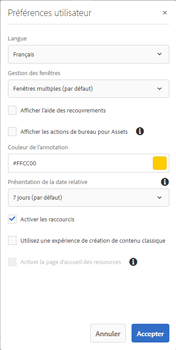

# Expérience de la page d’accueil d’AEM Assets {#aem-assets-home-page-experience}

Personnalisez la page d’accueil d’AEM Assets afin d’enrichir l’expérience de l’écran de bienvenue, avec notamment un instantané des activités récentes concernant les ressources.

La page d’accueil d’Adobe Experience Manager (AEM) Assets offre une expérience d’écran de bienvenue riche et personnalisée, qui inclut un instantané des activités récentes, comme les ressources récemment consultées ou téléchargées.

La page d’accueil d’Assets est désactivée par défaut. Pour l’activer, procédez comme suit :

1. Pour accéder à AEM Configuration Manager, cliquez sur **[!UICONTROL Outils > Opération > Console]** Web.
1. Open the **Day CQ DAM Event Recorder** service.
1. Select the **[!UICONTROL Enable this service]** to enable activity recording.

   

1. From the **Event Types** list, select the events to be recorded and save the changes.

   >[!CAUTION]
   >
   >Activer les options Ressource affichée, Projets affichés et Collections affichées augmente significativement le nombre d’événements enregistrés.

1. Ouvrez le service **[!UICONTROL DAM Asset Page d&#39;accueil Feature Flag]** à partir de Configuration Manager `https://[AEM_server]:[port]/system/console/configMgr`.
1. Select the **[!UICONTROL isEnabled.name]** option to enable the Assets Home page feature. Enregistrez les modifications.

   

1. Open the **[!UICONTROL User Preferences]** dialog, and select **[!UICONTROL Enable Assets Home Page]**. Enregistrez les modifications.

   

Après avoir activé la Page d&#39;accueil Ressources, accédez à l’interface utilisateur Ressources à partir de la page Navigation.

Tap/click the **[!UICONTROL Click here to configure your experience link]** to add your username, background image, and profile image.

La page d’accueil des ressources inclut les sections suivantes :

* Section Bienvenue
* Section Widget

**Section Bienvenue**

Si votre profil existe, la section Bienvenue affiche pour vous un message de bienvenue. En outre, il affiche votre image de profil et une image de bienvenue (si elle est déjà configurée).

Si votre profil est incomplet, la section Bienvenue affiche un message de bienvenue générique et un espace réservé pour votre image de profil.

**Section Widget**

Cette section s’affiche sous la section Bienvenue et contient des widgets prêts à l’emploi dans les sections suivantes :

* Activité
* Récent
* Découvrez

**Activité**: Sous cette section, le widget **Mon Activité** affiche les activités récentes effectuées par l’utilisateur connecté avec des ressources (y compris des ressources sans rendus), par exemple les téléchargements, les téléchargements, la création de ressources, les modifications, les commentaires, les annotations et les partages.

**Récent**: Le widget **Récemment affiché** sous cette section affiche les entités récemment consultées par l’utilisateur connecté, y compris les dossiers, les collections et les projets.

**Discover**: Le **nouveau** widget sous cette section affiche les ressources et les rendus récemment transférés vers l’instance AEM Assets.

To enable purging of user activity data, enable the **DAM Event Purge Service** from Configuration Manager. Une fois que vous avez activé ce service, les activités de l’utilisateur connecté dépassant le nombre spécifié sont supprimées par le système.

L’écran de bienvenue fournit des outils d’aide à la navigation, comme des icônes sur la barre d’outils afin d’accéder aux dossiers, aux collections et aux catalogues.

>[!NOTE]
>
>L’activation de l’enregistreur de Événement DAM Day CQ et des services de purge de Événement DAM augmente les opérations d’écriture sur le JCR et l’indexation de la recherche, ce qui augmente considérablement la charge sur le serveur AEM. La charge supplémentaire sur le serveur AEM peut affecter les performances.

>[!CAUTION]
>
>Les activités de collecte, de filtrage et de purge effectuées par l’utilisateur, requises pour la page d’accueil des ressources, génèrent une charge qui peut affecter les performances. Par conséquent, les administrateurs doivent configurer la page d’accueil de manière efficace pour les utilisateurs cibles.
>
>Adobe recommande que les administrateurs et les utilisateurs qui effectuent des opérations en masse évitent d’utiliser la fonction de la page d’accueil des ressources pour empêcher l’augmentation des activités de l’utilisateur.  De plus, les administrateurs peuvent exclure les activités d’enregistrement de certains utilisateurs en configurant **l’enregistreur d’événement Day CQ DAM** à partir du gestionnaire de configuration.
>
>Si vous utilisez la fonction, Adobe recommande que vous planifiez la fréquence de purge par rapport à la charge du serveur.
