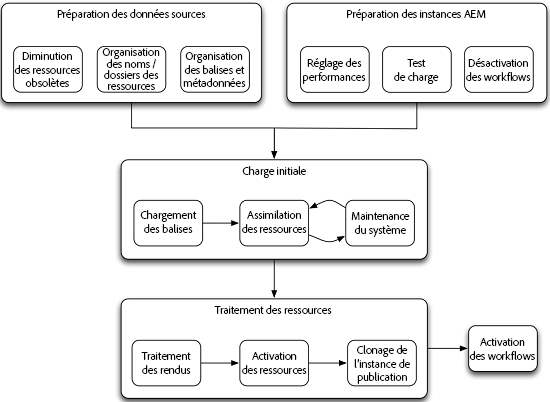

# Assets migration guide {#assets-migration-guide}

Lors de la migration des ressources dans AEM, il existe plusieurs étapes à prendre en compte. L’extraction de fichiers et de métadonnées hors de leur domicile actuel n’entre pas dans le cadre de ce document, car il varie considérablement d’une mise en oeuvre à l’autre. Ce document décrit plutôt comment importer ces ressources dans AEM, appliquer leurs métadonnées, générer des rendus et activer ou publier les ressources.

## Conditions préalables {#prerequisites}

Before performing any of the steps described below, review and implement the guidance in [Assets performance tuning tips](performance-tuning-guidelines.md). De nombreuses étapes, telles que la configuration du nombre maximal de tâches simultanées, améliorent la stabilité et les performances du serveur sous charge. D’autres étapes, telles que la configuration du stockage de données de fichiers, sont difficiles à exécuter une fois que le système a été chargé avec des ressources.

>[!NOTE]
>
>Les outils de migration d’actifs suivants ne font pas partie de Adobe Experience Manager. Le service à la clientèle Adobe ne prend pas en charge ces outils.
>
>* Tools Tag Maker d’ACS AEM
>* Tools CSV Asset Importer d’ACS AEM
>* Bulk Workflow Manager d’ACS Commons
>* Fast Action Manager d’ACS Commons
>* Synthetic Workflow

>
>
Ces logiciels sont Open Source et couverts par la [Licence Apache v2](https://adobe-consulting-services.github.io/pages/license.html). Pour poser une question ou signaler un problème, consultez les sections respectives [Problèmes GitHub pour les outils ACS AEM](https://github.com/Adobe-Consulting-Services/acs-aem-commons/issues) et [ACS AEM Commons](https://github.com/Adobe-Consulting-Services/acs-aem-tools/issues).

## Migration vers AEM {#migrate-to-aem}

La migration des ressources vers AEM se déroule en plusieurs étapes et doit être considérée comme un processus échelonné. Les phases de la migration sont les suivantes :

1. Désactivation des workflows.
1. Chargement des balises.
1. Assimilation des ressources.
1. Traitement des rendus.
1. Activation des ressources.
1. Activation des workflows.

### Désactivez les workflows {#disable-workflows}

Avant de début d’une migration, désactivez les lanceurs pour le `DAM Update Asset` processus. Il est préférable d’assimiler tous les actifs dans le système, puis d’exécuter les workflows par lots. Si vous êtes déjà en direct pendant la migration, vous pouvez planifier l’exécution de ces activités pendant les heures creuses.

### Chargement des balises {#load-tags}

Vous avez peut-être déjà mis en place une taxonomie de balises que vous appliquez à vos images. Des outils tels que l’importateur de ressources CSV et la fonctionnalité de profils de métadonnées peuvent aider à automatiser l’application de balises aux ressources. Auparavant, ajoutez les balises en Experience Manager. La fonctionnalité [Tools Tag Maker d’ACS AEM](https://adobe-consulting-services.github.io/acs-aem-tools/features/tag-maker/index.html) permet de renseigner les balises à l’aide d’une feuille de calcul Microsoft Excel chargée dans le système.

### Ingestion des ressources {#ingest-assets}

Les performances et la stabilité sont des préoccupations importantes lors de l’intégration des ressources dans le système. Lorsque vous chargez un grand nombre de données dans le Experience Manager, assurez-vous que le système fonctionne correctement. Cela a réduit le temps nécessaire à l’ajout des données et permet d’éviter la surcharge du système. Cela permet d&#39;éviter les blocages du système, en particulier dans les systèmes déjà en production.

Il existe deux approches pour charger les ressources dans le système : une approche basée sur le push utilisant le protocole HTTP ou une approche basée sur l’extraction utilisant les API JCR.

#### Pousser via HTTP {#push-through-http}

L’équipe Managed Services d’Adobe utilise un outil appelé Glutton pour charger les données dans les environnements clients. Glutton est une petite application Java qui charge toutes les ressources d’un répertoire dans un autre répertoire d’une instance AEM. À la place de Glutton, vous pouvez également utiliser des outils tels que les scripts Perl pour publier les ressources dans le référentiel.

L’utilisation de l’approche Push à l’aide du protocole HTTPS présente deux inconvénients :

1. Transmettez les ressources via HTTP au serveur. Cette transmission nécessite beaucoup de temps et crée une surcharge, ce qui rallonge le temps nécessaire pour effectuer la migration.
1. Si vous disposez de balises et de métadonnées personnalisées devant être appliquées aux ressources, cette approche nécessite un deuxième processus personnalisé que vous devez exécuter pour appliquer ces métadonnées aux ressources une fois qu’elles ont été importées.

L’autre approche de l’intégration des ressources consiste à extraire les ressources du système de fichiers local. Toutefois, si vous ne parvenez pas à obtenir un lecteur externe ou un partage réseau monté sur le serveur pour effectuer une approche par extraction, la publication des ressources en utilisant HTTP est la meilleure option.

#### Extraire du système de fichiers local {#pull-from-the-local-file-system}

The [ACS AEM Tools CSV Asset Importer](https://adobe-consulting-services.github.io/acs-aem-tools/features/csv-asset-importer/index.html) pulls assets from the file system and asset metadata from a CSV file for the asset import. L’API AEM Asset Manager est utilisée pour importer les ressources dans le système et appliquer les propriétés des métadonnées configurées. Idéalement, les ressources sont montées sur le serveur via un montage de fichiers réseau ou via un lecteur externe.

Lorsque les ressources ne sont pas transmises sur un réseau, les performances globales s’améliorent considérablement. Cette méthode est généralement la méthode la plus efficace pour charger des actifs dans le référentiel. En outre, vous pouvez importer tous les fichiers et métadonnées en une seule étape, car l’outil prend en charge l’assimilation des métadonnées. Aucune autre étape n’est nécessaire pour appliquer les métadonnées, par exemple à l’aide d’un outil distinct.

### Traitement des rendus {#process-renditions}

Après avoir chargé les ressources dans le système, vous devez les traiter via le workflow Ressources de mise à jour de gestion des actifs numériques, afin d’extraire les métadonnées et de générer les rendus. Avant d’effectuer cette étape, vous devez dupliquer et modifier le workflow Ressources de mise à jour de gestion des actifs numériques pour l’adapter à vos besoins. Certaines étapes du processus par défaut peuvent ne pas être nécessaires pour vous, telles que la génération Scene7 PTIFF ou l’intégration du serveur d’InDesigns.

Une fois que vous avez configuré le processus en fonction de vos besoins, vous disposez de deux options pour l’exécuter :

1. L’approche la plus simple consiste à utiliser l’outil [Bulk Workflow Manager d’ACS Commons](https://adobe-consulting-services.github.io/acs-aem-commons/features/bulk-workflow-manager.html). Cet outil permet d’exécuter une requête et de traiter les résultats de la requête via un workflow. Il existe également des options permettant de définir la taille des lots.
1. Vous pouvez utiliser l’outil [Fast Action Manager d’ACS Commons](https://adobe-consulting-services.github.io/acs-aem-commons/features/fast-action-manager.html) en association avec [Synthetic Workflows](https://adobe-consulting-services.github.io/acs-aem-commons/features/synthetic-workflow.html). Bien que cette approche soit beaucoup plus impliquée, elle vous permet de supprimer la surcharge du moteur de processus AEM, tout en optimisant l’utilisation des ressources du serveur. De plus, Fast Action Manager améliore les performances en surveillant de manière dynamique les ressources du serveur et en réduisant la charge placée sur le système. Des exemples de scripts ont été fournis sur la page de fonctionnalités d’ACS Commons.

### Activation des ressources {#activate-assets}

Pour les déploiements disposant d’un niveau de publication, vous devez activer les ressources dans la ferme de serveurs de publication. Bien qu’Adobe recommande d’exécuter plusieurs instances de publication, il est plus efficace de répliquer toutes les ressources sur une seule instance de publication, puis de cloner cette instance. Lorsque vous activez un grand nombre de ressources, après le déclenchement d’une activation d’arborescence, vous devrez peut-être intervenir. Voici pourquoi : Lors du déclenchement d’activations, des éléments sont ajoutés aux tâches/files d&#39;événements Sling. Une fois que la taille de cette file d’attente commence à dépasser environ 40 000 éléments, le traitement ralentit considérablement. Lorsque la taille de cette file d’attente dépasse 100 000 éléments, la stabilité du système commence à souffrir.

Pour contourner ce problème, vous pouvez utiliser l’outil [Fast Action Manager](https://adobe-consulting-services.github.io/acs-aem-commons/features/fast-action-manager.html) pour gérer la réplication des ressources. Il fonctionne sans utiliser les files d’attente Sling, réduisant les surcharges, tout en régulant la charge de travail pour éviter que le serveur ne soit surchargé. Un exemple d’utilisation de cet outil pour gérer la réplication est présenté sur la page de documentation de FAM.

D’autres options permettant de transférer des ressources vers la batterie de serveurs de publication incluent l’utilisation de [vlt-rcp](https://jackrabbit.apache.org/filevault/rcp.html) ou [oak-run](https://github.com/apache/jackrabbit-oak/tree/trunk/oak-run), qui sont fournis en tant qu’outils dans le cadre de Jackrabbit. Une autre option consiste à utiliser un outil Open Source pour votre infrastructure AEM, nommé [Grabbit](https://github.com/TWCable/grabbit), qui se targue d’être plus rapide que vlt.

Pour toutes ces approches, notez que les ressources de l’instance de création ne s’affichent pas comme ayant été activées. Pour marquer ces ressources avec l’état d’activation correct, vous devez également exécuter un script les marquant comme activées.

>[!NOTE]
>
>Adobe ne prend pas en charge Grabbit.

### Clone Publish {#clone-publish}

Une fois les ressources activées, vous pouvez cloner votre instance de publication afin de créer autant de copies que nécessaire pour le déploiement. Le clonage d’un serveur est relativement simple, mais il existe quelques étapes importantes à retenir. Pour cloner la publication :

1. Sauvegardez l’instance source et la banque de données.
1. Restaurez la sauvegarde de l’instance et de la banque de données à l’emplacement cible. Les étapes suivantes se rapportent toutes à cette nouvelle instance.
1. Effectuez une recherche de système de fichiers sous `crx-quickstart/launchpad/felix` for `sling.id`. Supprimez ce fichier.
1. Sous le chemin d’accès racine du magasin de données, recherchez et supprimez les fichiers `repository-XXX`.
1. Modifiez `crx-quickstart/install/org.apache.jackrabbit.oak.plugins.blob.datastore.FileDataStore.config` et `crx-quickstart/launchpad/config/org/apache/jackrabbit/oak/plugins/blob/datastore/FileDataStore.config` pour qu’ils pointent sur l’emplacement du magasin de données sur le nouvel environnement.
1. Démarrez l’environnement.
1. Mettez à jour la configuration de tous les agents de réplication sur le ou les auteurs afin de pointer vers les instances de publication ou les agents de vidage du Dispatcher corrects sur la nouvelle instance. Cela permet de pointer vers les Dispatchers appropriés du nouvel environnement.

### Activation des workflows {#enable-workflows}

Une fois la migration terminée, les lanceurs des workflows Ressources de mise à jour de gestion des actifs numériques doivent être réactivés pour prendre en charge la génération des rendus et l’extraction des métadonnées pour une utilisation quotidienne continue du système.

## Migration des ressources entre AEM déploiements {#migrate-between-aem-instances}

Bien que ce ne soit pas aussi courant, vous devez parfois migrer de grandes quantités de données d’une instance AEM à une autre, par exemple, lorsque vous effectuez une mise à niveau d’AEM, que vous mettez à niveau votre matériel ou que vous migrez vers un nouveau centre de données, comme avec une migration AMS.

Dans ce cas, les ressources sont déjà renseignées avec les métadonnées et les rendus déjà générés. Il ne vous reste plus qu’à vous concentrer sur le déplacement des ressources d’une instance à une autre. Lors de la migration entre instances AEM, procédez comme suit :

1. Désactiver les workflows : Puisque vous migrez des rendus avec nos ressources, vous souhaitez désactiver les lanceurs de processus pour DAM Update Asset.

1. Migrer les balises : Les balises étant déjà chargées dans l’instance d’AEM source, vous pouvez les créer dans un package de contenu et installer le package sur l’instance d’cible.

1. Migration des ressources : Il existe deux outils recommandés pour déplacer des ressources d’une instance AEM à une autre :

   * **Vault Remote Copy**, ou `vlt rcp`, vous permet d&#39;utiliser vlt sur un réseau. Vous pouvez indiquer des répertoires source et de destination pour que vlt télécharge toutes les données du référentiel d’une instance et les charge dans l’autre. Vlt rcp est documenté à l’adresse [https://jackrabbit.apache.org/filevault/rcp.html](https://jackrabbit.apache.org/filevault/rcp.html)
   * **Grabbit** est un outil de synchronisation de contenu Open Source développé par Time Warner Cable dans le cadre de la mise en œuvre d’AEM. Comme il utilise des flux de données continus, en comparaison avec vlt rcp, sa latence est inférieure et il annonce une vitesse de deux à dix fois plus rapide que vlt rcp. Grabbit prend également en charge la synchronisation du contenu delta uniquement, ce qui lui permet de synchroniser les modifications après l’achèvement d’une passe de migration initiale.

1. Activate assets: Follow the instructions for [activating assets](#activate-assets) documented for the initial migration to AEM.

1. Cloner la publication : Comme pour une nouvelle migration, le chargement d’une instance de publication unique et le clonage sont plus efficaces que l’activation du contenu sur les deux noeuds. Voir [Clonage de la publication](#clone-publish).

1. Activation des workflows : Une fois la migration terminée, réactivez les lanceurs pour les workflows de mise à jour des actifs DAM afin de prendre en charge la génération de rendus et l’extraction des métadonnées pour une utilisation courante du système.
