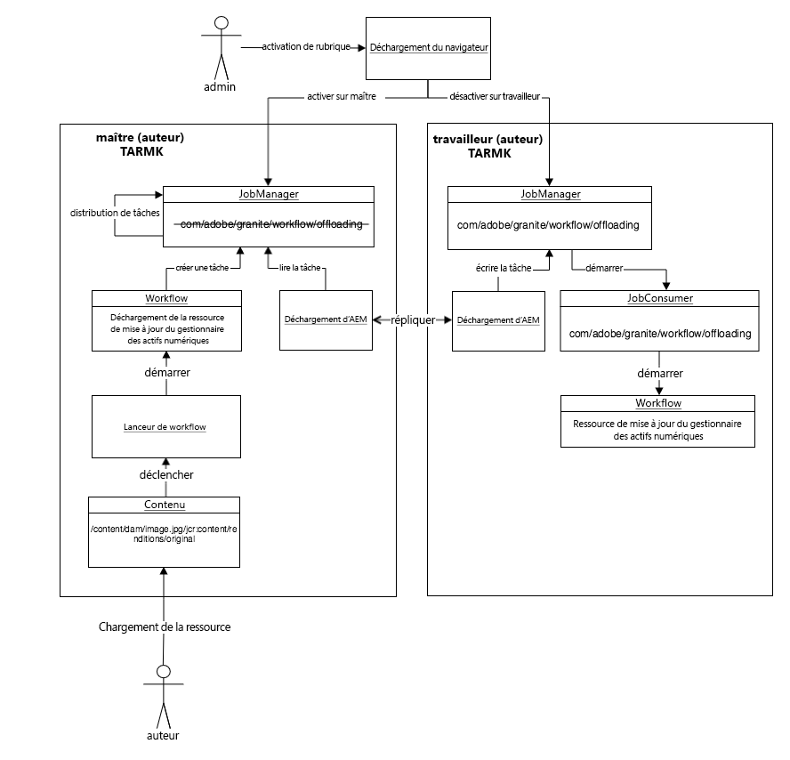
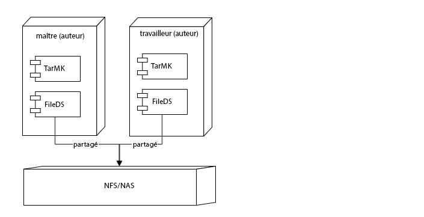

# Meilleures pratiques de déchargement dans Assets {#assets-offloading-best-practices}

>[!WARNING]
>
>Cette fonction est obsolète AEM 6.4 et est supprimée dans AEM 6.5. Planifiez en conséquence.

La gestion de fichiers volumineux et l’exécution des workflows dans Adobe Experience Manager (AEM) Assets peuvent utiliser des ressources de processeur, de mémoire et d’E/S considérables. En particulier, la taille des ressources, les workflows, le nombre d’utilisateurs et la fréquence d’assimilation des ressources peuvent affecter les performances globales du système. Les opérations les plus gourmandes en ressources incluent les workflows d’assimilation et de réplication des ressources d’AEM. L’utilisation intensive de ces workflows sur une seule instance de création AEM peut avoir un impact négatif sur l’efficacité de la création.

Le déchargement de ces tâches vers des instances de programme de travail dédiées peut réduire les surcharges du processeur, de la mémoire et de l’E/S. En général, l’idée qui sous-tend le déchargement consiste à distribuer les tâches qui utilisent des ressources intensives de processeur, mémoire ou E/S vers des instances de programme de travail dédiées. Les sections suivantes incluent les cas d’utilisation recommandés pour le déchargement des ressources.

## Déchargement AEM Assets {#aem-assets-offloading}

AEM Assets met en œuvre une extension de workflow spécifique aux ressources natives pour le déchargement. AEM Assets s’appuie sur l’extension de workflow générique fournie par la structure de déchargement, mais inclut, dans la mise en œuvre, des fonctionnalités supplémentaires spécifiques aux ressources. L’objectif du déchargement des ressources consiste à exécuter efficacement le workflow Ressources de mise à jour de gestion des actifs numériques sur une ressource chargée. Le déchargement des ressources permet de mieux contrôler les workflows d’assimilation.

## Composants du déchargement AEM Assets {#aem-assets-offloading-components}

Le diagramme suivant illustre les principaux composants du processus de déchargement des ressources :

### Workflow Déchargement des ressources de mise à jour de gestion des actifs numériques {#dam-update-asset-offloading-workflow}

Le processus de déchargement des ressources de mise à jour DAM s’exécute sur le Principal serveur (auteur) sur lequel l’utilisateur télécharge les ressources. Ce workflow est déclenché par un lanceur de workflow standard. Au lieu de traiter la ressource chargée, ce processus de déchargement crée une nouvelle tâche, en utilisant la rubrique *com/adobe/granite/workflow/offloading*. Le workflow de déchargement ajoute le nom du workflow cible, le workflow Ressources de mise à jour de gestion des actifs numériques dans ce cas, ainsi que le chemin de la ressource permettant d’accéder à la charge utile de la tâche. Après la création de la tâche de déchargement, le workflow de déchargement sur l’instance principale ne démarre qu’une fois que la tâche de déchargement a été exécutée.

### Gestionnaire des tâches {#job-manager}

Le gestionnaire des tâches distribue les nouvelles tâches aux instances de programme de travail. Lors de la conception du mécanisme de distribution, il est important de prendre en compte l’activation de rubrique. Les tâches ne peuvent être affectées qu’à des instances dont la rubrique de la tâche est activée. Désactivez la rubrique `com/adobe/granite/workflow/offloading` sur l’instance principale et activez-la sur le programme de travail afin de garantir que la tâche est affectée à ce dernier.

### Déchargement AEM {#aem-offloading}

Le structure de déchargement identifie les tâches de déchargement des workflows affectées aux instances de programme de travail et utilise la réplication pour les transporter physiquement, y compris leur charge utile (par exemple, les images à intégrer), vers les programmes de travail.

### Consommateur de tâche du déchargement des workflows {#workflow-offloading-job-consumer}

Once a job is written on the worker, the job manager calls the job consumer responsible for the *com/adobe/granite/workflow/offloading* topic. Le consommateur de tâche exécute alors le workflow Ressources de mise à jour de gestion des actifs numériques sur la ressource.

## Topologie Sling {#sling-topology}

La topologie Sling regroupe les instances AEM et leur permet de se connaître mutuellement, indépendamment de la persistance sous-jacente. Cette caractéristique de la topologie Sling permet de créer des topologies pour des scénarios sans cluster, en cluster et mixtes. Une instance peut présenter des propriétés à l’ensemble de la topologie. La structure fournit des rappels permettant d’écouter les modifications de la topologie (instances et propriétés). La topologie Sling fournit la base des tâches distribuées Sling.

### Tâches distribuées Sling {#sling-distributed-jobs}

Les tâches distribuées Sling facilitent la distribution des tâches parmi un ensemble d’instances membres de la topologie. Les tâches Sling reposent sur le concept de fonctionnalités. Une tâche est définie par sa rubrique de tâche. Pour exécuter une tâche, une instance doit fournir un consommateur de tâche pour une rubrique de tâche spécifique. La rubrique de tâche est le pilote principal correspondant au mécanisme de distribution.

Les tâches sont uniquement distribuées aux instances qui fournissent un consommateur de tâche pour la rubrique. En activant ou désactivant les consommateurs de tâche sur une instance, vous pouvez définir ses fonctionnalités et influencer le mécanisme de distribution. Les consommateurs de tâche disponibles d’une instance sont diffusés à l’ensemble de la topologie.

Dans ce contexte, le terme « distribution » signifie l’affectation d’une tâche à une instance spécifique qui fournit un consommateur de tâche. L’affectation à une instance est enregistrée dans le référentiel. En d’autres termes, les tâches distribuées Sling peuvent être affectées à n’importe quelle instance de la topologie par défaut. Cependant, les autres tâches ne peuvent être exécutées que par des instances partageant le même référentiel. Cela signifie que ces tâches peuvent uniquement être exécutées par les instances faisant partie du même cluster. Les tâches affectées à des instances d’un autre cluster ne sont pas exécutées.

### Structure de déchargement Granite {#granite-offloading-framework}

La structure de déchargement Granite complète la distribution des tâches Sling afin d’exécuter les tâches affectées aux instances qui ne sont pas en cluster. Elle n’effectue aucune distribution (affectation d’instances). Toutefois, elle identifie les tâches Sling qui ont été distribuées à des instances sans cluster et les transporte vers l’instance cible pour exécution. Actuellement, le déchargement utilise la réplication pour effectuer ce transport de tâches. Pour exécuter une tâche, le déchargement définit l’entrée et la sortie, qui sont ensuite combinées avec la tâche pour créer la charge utile de cette dernière.

Les tâches Sling distribuées fournissent la structure des tâches et des distributions. Le déchargement Granit prend uniquement en charge le transport dans le cas particulier où les tâches sont distribuées à des instances sans cluster.

En plus du transport, la structure de déchargement fournit une extension du moteur de workflow. Cette extension permet à la structure de créer des tâches distribuées dans le cadre d’un workflow et d’attendre leur achèvement pour que le workflow progresse. L’extension est mise en œuvre à l’aide de l’API d’étape externe des workflows à partir du moteur de workflow. L’une des extensions facilite la distribution générique des workflows. La distribution des étapes d’un workflow unique n’est pas prise en charge.

La structure de déchargement fournit également une interface utilisateur (IU) permettant de visualiser et de contrôler l’activation des rubriques de tâche sur l’ensemble de la topologie. L’interface utilisateur permet de configurer facilement l’activation des rubriques des tâches Sling distribuées. Vous pouvez également configurer le déchargement sans l’interface utilisateur.

## Conseils généraux et meilleures pratiques pour le déchargement des ressources {#general-guidance-and-best-practices-for-asset-offloading}

Chaque mise en œuvre est unique et, en tant que telle, il n’y a pas de configuration de déchargement unique. Les sections suivantes présentent des conseils et les meilleures pratiques concernant le déchargement de l’assimilation des ressources.

Le déchargement des ressources entraîne également des surcharges du système, notamment des surcharges opérationnelles. Si vous rencontrez des problèmes relatifs à la charge d’assimilation des ressources, Adobe recommande d’améliorer d’abord la configuration sans le déchargement. Pensez aux options suivantes avant de passer au déchargement des ressources :

* Mettez à niveau le matériel
* Optimisez les workflows
* Utilisez des workflows transitoires
* Limitez le nombre de cœurs utilisés pour les workflows

Si vous estimez que le déchargement des ressources est une approche adaptée à vos besoins, Adobe fournit les conseils suivants :

* Une mise en œuvre basée sur TarMK est recommandée
* Le déchargement des ressources basé sur TarMK n’est pas conçu pour la mise à l’échelle horizontale étendue
* Assurez-vous que les performances du réseau entre l’auteur et les programmes de travail sont satisfaisantes

### Déploiement recommandé du déchargement des ressources {#recommended-assets-offloading-deployment}

Avec AEM et Oak, il existe plusieurs scénarios de déploiement possibles. Pour le déchargement des ressources, un déploiement basé sur TarMK avec une banque de données partagée est recommandé. Le diagramme ci-dessous décrit le déploiement recommandé :

Pour plus d’informations sur la configuration d’une banque de données, voir [Configuration des magasins de nœuds et des banques de données dans AEM](../sites-deploying/data-store-config.md).

### Désactivation de la gestion automatique des agents {#turning-off-automatic-agent-management}

Adobe recommande de désactiver la gestion automatique des agents car elle ne prend pas en charge la réplication sans fichier binaire et peut entraîner une confusion lors de la configuration d’une nouvelle topologie de déchargement. En outre, il ne prend pas automatiquement en charge le flux de réplication avancé requis par la réplication sans binaire.

1. Open Configuration Manager from the URL `http://localhost:4502/system/console/configMgr`.
1. Ouvrez la configuration pour `OffloadingAgentManager` (`http://localhost:4502/system/console/configMgr/com.adobe.granite.offloading.impl.transporter.OffloadingAgentManager`).
1. Désactivez la gestion automatique des agents.

### Utilisation de la réplication vers l’avant {#using-forward-replication}

Par défaut, le transport du déchargement utilise la réplication inverse pour transférer les ressources déchargées du programme de travail vers l’instance principale. Les agents de réplication inverse ne prennent pas en charge la réplication sans fichier binaire. Vous devez configurer le déchargement afin d’utiliser la réplication de transfert pour transférer les ressources déchargées du programme de travail vers l’instance principale.

1. If you are migrating from the default configuration using reverse replication, disable or delete all agents named &quot; `offloading_outbox`&quot; and &quot; `offloading_reverse_*`&quot; on primary and worker, where &amp;ast; represents the Sling id of the target instance.
1. Sur chaque programme de travail, créez un agent de réplication de transfert pointant vers l’instance principale. La procédure est la même que la création d&#39;agents de transfert de Principal à ouvrier. See [Creating Replication Agents For Offloading](../sites-deploying/offloading.md#creating-replication-agents-for-offloading) for instructions around setting up offloading replication agents.
1. Ouvrez la configuration pour `OffloadingDefaultTransporter` (`http://localhost:4502/system/console/configMgr/com.adobe.granite.offloading.impl.transporter.OffloadingDefaultTransporter`).
1. Change value of the property `default.transport.agent-to-master.prefix` from `offloading_reverse` to `offloading`.

<!-- TBD: Make updates to the configuration for allow and block list after product updates are done.
TBD: Update the property in the last step when GRANITE-30586 is fixed.
-->

### Utilisation d’une banque de données partagée et d’une réplication sans fichier binaire entre l’auteur et les programmes de travail  {#using-shared-datastore-and-binary-less-replication-between-author-and-workers}

Il est recommandé d’utiliser la réplication binaire pour réduire les frais de transport liés au déchargement des ressources. Pour savoir comment configurer la réplication sans fichier binaire pour une banque de données partagée, voir [Configuration des magasins de nœuds et des banques de données dans AEM](/help/sites-deploying/data-store-config.md). La procédure n’est pas différente pour le déchargement des ressources, mais elle implique d’autres agents de réplication. Dans la mesure où la réplication sans binaire fonctionne uniquement avec les agents de réplication avancés, vous devez également utiliser la réplication avancée pour tous les agents de déchargement.

### Désactivation des modules de transport {#turning-off-transport-packages}

Par défaut, le déchargement crée un module de contenu comportant la tâche de déchargement et la charge utile de la tâche (la ressource d’origine) et transporte ce module de déchargement unique à l’aide d’une seule demande de réplication. La création de ces modules de déchargement est contre-productive lors de l’utilisation de la réplication sans fichier binaire, car les fichiers binaires sont à nouveau sérialisés dans le module lors de la création de ce dernier. L’utilisation de ces modules de transport peut être désactivée, ce qui entraîne le transport de la tâche de déchargement et de la charge utile dans plusieurs demandes de réplication, une pour chaque entrée de charge utile. De cette façon, vous pouvez bénéficier de la réplication sans fichier binaire.

1. Open the component configuration of *OffloadingDefaultTransporter* component at [http://localhost:4502/system/console/configMgr/com.adobe.granite.offloading.impl.transporter.OffloadingDefaultTransporter](http://localhost:4502/system/console/configMgr/com.adobe.granite.offloading.impl.transporter.OffloadingDefaultTransporter)
1. Disable the property *Replication Package (default.transport.contentpackage)*.

### Désactivation du transport du modèle de workflow {#disabling-the-transport-of-workflow-model}

By default, the *DAM Update Asset Offloading* offloading workflow adds the workflow model to call on the worker to the job payload. Because this workflow follows the out-of-the-box *DAM Update Asset* model by default, this additional payload can be removed.

Si le modèle de workflow est désactivé à partir de la charge utile de la tâche, assurez-vous de distribuer les modifications au modèle de workflow référencé à l’aide d’autres outils, tels que le gestionnaire de modules.

Pour désactiver le transport du modèle de workflow, modifiez le workflow Déchargement des ressources de mise à jour de gestion des actifs numériques.

1. Open the workflow console from [http://localhost:4502/libs/cq/workflow/content/console.html](http://localhost:4502/libs/cq/workflow/content/console.html).
1. Ouvrez l’onglet Modèles.
1. Ouvrez le modèle de flux de travail DAM Update Asset Offloading.
1. Ouvrez les propriétés d’étape pour l’étape de déchargement du flux de travail DAM.
1. Ouvrez l’onglet Arguments, puis désélectionnez les options Ajouter le modèle à l’entrée et Ajouter le modèle à la sortie.
1. Enregistrez les modifications apportées au modèle.

### Optimisation de la fréquence d’interrogation {#optimizing-the-polling-interval}

Le déchargement du flux de travail est implémenté à l’aide d’un flux de travail externe sur la Principale, qui interroge la fin du flux de travail déchargé sur le travailleur. La fréquence d’interrogation par défaut pour les workflows externes est de cinq secondes. Adobe recommande d’augmenter la fréquence d’interrogation de l’étape de déchargement des ressources à au moins 15 secondes afin de réduire la surcharge de déchargement sur l’instance principale.

1. Open the workflow console from [http://localhost:4502/libs/cq/workflow/content/console.html](http://localhost:4502/libs/cq/workflow/content/console.html).

1. Ouvrez l’onglet Modèles.
1. Ouvrez le modèle de flux de travail DAM Update Asset Offloading.
1. Ouvrez les propriétés de l’étape pour l’étape de déchargement du flux de travail DAM.
1. Ouvrez l’onglet Commons et ajustez la valeur de la propriété Period.
1. Enregistrez les modifications apportées au modèle.

## Autres ressources {#more-resources}

Ce document aborde le déchargement des ressources. Documentation supplémentaire sur le déchargement :

* [Tâches de déchargement](/help/sites-deploying/offloading.md)
* [Déchargeur des workflows de ressources](/help/sites-administering/workflow-offloader.md)

