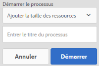
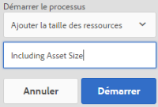
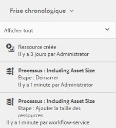
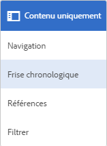

# Traiter les ressources numériques {#process-assets}

[!DNL Adobe Experience Manager Assets] vous permet de travailler sur vos ressources numériques de plusieurs manières pour permettre un traitement robuste des ressources. Vous pouvez utiliser les méthodes de traitement disponibles ou étendre les méthodes pour assurer la finalisation des processus d’entreprise de bout en bout à l’aide de l’utilisation, des audits et de la conformité, de la découverte et de la distribution de vos ressources numériques, ainsi que de leur intégrité de base. Vous pouvez faire tout cela tout en atteignant l’échelle et la personnalisation requises.

## Comprendre les workflows {#understand-workflows}

Pour le traitement des ressources, [!DNL Experience Manager] utilise des workflows. Les workflows permettent d’automatiser la logique ou les activités métier. Les étapes granulaires permettant d’accomplir des tâches spécifiques sont fournies par défaut et les développeurs peuvent créer leurs propres étapes personnalisées. Ces étapes peuvent être combinées dans un ordre logique pour créer des workflows. Par exemple, un processus peut automatiquement appliquer un filigrane sur les images téléchargées en fonction de critères spécifiques tels que les métadonnées intégrées à l’image, le dossier dans lequel il est téléchargé, la résolution de l’image, etc. Un autre exemple est un processus configuré pour créer des filigranes d’une telle manière et répondre simultanément à plusieurs besoins de gestion de ressources, tels que l’ajout de métadonnées, la création de rendus, l’ajout de balises intelligentes pour la découverte de ressources, la publication dans une banque de données, la définition d’autorisations d’accès utilisateur, etc.

## Workflows par défaut disponibles dans le Experience Manager {#default-workflows}

Par défaut, toutes les ressources téléchargées sont traitées à l’aide du workflow [!UICONTROL DAM Update Asset]. Le processus s’exécute pour chaque ressource téléchargée et exécute les tâches de gestion des ressources de base telles que la génération de rendu, l’écriture différée des métadonnées, l’extraction de page, l’extraction du média et le transcodage.

Pour consulter les différents modèles de processus disponibles par défaut, voir [!UICONTROL Outils > Processus > Modèles] dans [!DNL Experience Manager].

*Figure : Certains des processus par défaut disponibles dans  [!DNL Experience Manager].*

## Application de workflows à des ressources {#applying-workflows-to-assets}

L’application de workflow aux ressources numériques est identique à l’application de workflow aux pages d’un site web. Pour un guide complet sur la création et l&#39;utilisation des workflows, voir [workflows de début](/help/sites-authoring/workflows-participating.md).

Utilisez les workflows dans les ressources numériques pour activer les ressources ou créer des filigranes. La plupart des workflow destinés aux ressources sont automatiquement activés, comme le workflow permettant de créer automatiquement un rendu après la modification d’une image.

>[!NOTE]
>
>Si un processus disponible dans l’interface utilisateur classique n’est pas disponible dans l’interface utilisateur tactile, par exemple [!UICONTROL Demande d’activation] et [!UICONTROL Demande de désactivation], voir [créer des modèles de processus](/help/sites-developing/workflows-models.md#make-workflow-models-available-in-touchui).

## Application d’un workflow à une ressource AEM {#apply-a-workflow-to-an-aem-asset}

<!-- 
TBD: Add animated GIF for these steps instead of all these screenshots.
-->

Pour appliquer un processus à une ressource, procédez comme suit :

1. Accédez à l’emplacement de la ressource pour laquelle vous souhaitez début un processus, puis cliquez sur la ressource pour ouvrir la page de la ressource.

1. Accédez à l’emplacement de la ressource pour laquelle vous souhaitez début un processus, puis cliquez sur la ressource pour ouvrir la page de la ressource. Sélectionnez **[!UICONTROL Chronologie]** dans le menu pour afficher la chronologie.

   

1. Cliquez sur **[!UICONTROL Actions]** en bas pour ouvrir la liste des actions disponibles pour la ressource.

1. Cliquez sur **[!UICONTROL Processus du Début]** dans la liste.

1. Dans la boîte de dialogue **[!UICONTROL Processus du Début]**, sélectionnez un modèle de processus dans la liste.

   

1. (Facultatif) Spécifiez le titre du workflow, qui peut permettre de référencer l’instance du workflow.

   

1. Cliquez sur **[!UICONTROL Début]**, puis sur **[!UICONTROL Continuer]** dans la boîte de dialogue pour confirmer. Chaque étape du workflow s’affiche en tant qu’événement dans la chronologie.

   

## Application d’un workflow à plusieurs ressources {#applying-a-workflow-to-multiple-assets}

1. Dans la console Ressources, accédez à l’emplacement des ressources pour lesquelles vous souhaitez démarrer un workflow, puis sélectionnez les ressources. Sélectionnez **[!UICONTROL Chronologie]** dans le menu pour afficher la chronologie.

   

1. Cliquez sur **[!UICONTROL Actions]** dans la partie inférieure.

1. Cliquez sur **[!UICONTROL Démarrer le processus]**. Dans la section **[!UICONTROL Démarrer le processus]**, sélectionnez un modèle de workflow dans la liste.

   

1. (Facultatif) Spécifiez le titre du workflow, qui peut permettre de référencer l’instance du workflow.

1. Cliquez sur **[!UICONTROL Démarrer]**, puis sur **[!UICONTROL Confirmer]** dans la boîte de dialogue. Le workflow s’exécute sur toutes les ressources sélectionnées.

## Application d’un workflow à plusieurs dossiers {#applying-a-workflow-to-multiple-folders}

La procédure à suivre pour appliquer un workflow à plusieurs dossiers est similaire à celle observée permettant d’appliquer un workflow à plusieurs ressources. Sélectionnez les dossiers dans la console Ressources, puis effectuez les étapes 2 à 7 de la procédure [appliquer un processus à plusieurs ressources](assets-workflow.md#applying-a-workflow-to-multiple-assets).

## Application d’un workflow à une collection {#applying-a-workflow-to-a-collection}

Pour plus d&#39;informations sur l&#39;application d&#39;un processus à une collection, consultez [appliquer un processus à une collection](managing-collections-touch-ui.md#running-a-workflow-on-a-collection).

## Début automatique d’un processus pour traiter les ressources de manière conditionnelle {#auto-execute-workflow-on-some-assets}

Les administrateurs peuvent configurer le processus pour exécuter et traiter automatiquement les ressources en fonction de conditions prédéfinies. Cette fonctionnalité s’avère utile pour les utilisateurs et les marketeurs de la gamme d’activités, par exemple pour créer un processus personnalisé sur des dossiers spécifiques. Disons que tous les fichiers provenant de la prise de vue d&#39;une agence peuvent être marqués d&#39;un filigrane ou que tous les fichiers téléchargés par un indépendant peuvent être traités pour créer des rendus spécifiques.

Pour un modèle de processus, les utilisateurs peuvent créer un lanceur de processus qui l’exécute. Un lanceur de processus surveille les modifications dans le référentiel de contenu et exécute le processus lorsque les conditions prédéfinies sont remplies. Les administrateurs peuvent donner accès aux marketeurs pour créer les workflows et configurer le lanceur. Les utilisateurs peuvent modifier le workflow par défaut [!UICONTROL DAM Update Asset] pour ajouter les étapes supplémentaires requises pour traiter des ressources spécifiques. Le processus s’exécute sur tous les fichiers nouvellement transférés. Utilisez l’une des méthodes suivantes pour limiter l’exécution des étapes supplémentaires sur des ressources spécifiques :

* Effectuez une copie du flux de travail [!UICONTROL DAM Update Asset] et modifiez-le pour l’exécuter sur une hiérarchie de dossiers spécifique. Cette approche est utile pour quelques dossiers.
* Les étapes de traitement supplémentaires peuvent être ajoutées à l’aide d’un fractionnement [OU](/help/sites-developing/workflows-step-ref.md#or-split) applicable de manière conditionnelle au plus grand nombre de dossiers requis.

## Bonnes pratiques et restrictions {#best-practices-limitations-tips}

* Pour la conception des workflows, prenez en compte vos besoins pour tous les types de rendus. Si vous ne prévoyez pas la nécessité d’un rendu futur, supprimez son étape de création dans le workflow. Il est impossible par la suite de supprimer les rendus en masse. Les rendus superflus peuvent occuper beaucoup d’espace de stockage suite à une utilisation prolongée d’[!DNL Experience Manager]. Pour les ressources individuelles, vous pouvez supprimer manuellement les rendus à l’aide de l’interface utilisateur. Si plusieurs ressources sont concernées, vous pouvez, au choix, personnaliser [!DNL Experience Manager] pour supprimer des rendus spécifiques, ou supprimer les ressources et les charger à nouveau.
* Par défaut, le flux de travail [!UICONTROL DAM Update Asset] comprend quelques étapes pour créer des miniatures et des rendus Web. Si des rendus par défaut sont supprimés du flux de travail, l’interface utilisateur de [!DNL Assets] ne s’affiche pas correctement.

>[!MORELIKETHIS]
>
>* [Demander et participer aux workflows](/help/sites-authoring/workflows.md)
>* [Créer des modèles de processus et étendre les fonctionnalités de processus](/help/sites-developing/workflows.md)
>* [Méthodes d’exécution des workflows](/help/sites-administering/workflows-starting.md)
>* [Meilleures pratiques de flux de travaux](/help/sites-developing/workflows-best-practices.md)
>* [Article de la communauté sur la modification d’une ressource à l’aide du processus](https://helpx.adobe.com/fr/experience-manager/using/modify_asset_workflow.html)

