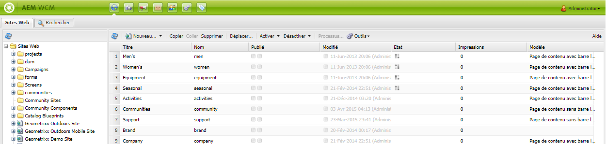
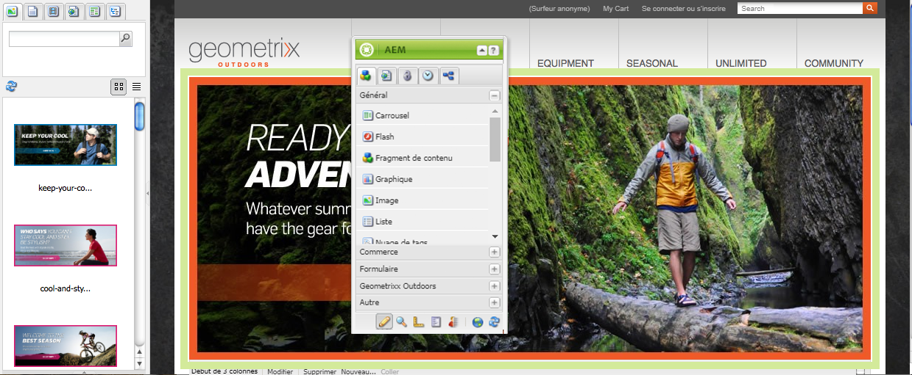

# A propos de AEM Assets {#about-assets}

Assets est un outil de gestion des actifs numériques (DAM) entièrement intégré à la plateforme AEM et qui permet à votre entreprise de partager et de distribuer des actifs numériques. Les utilisateurs au sein d’une organisation peuvent gérer, stocker et accéder à des images, des vidéos, des documents, des clips audio et des fichiers multimédias enrichis, tels que des fichiers Flash, en vue de les utiliser sur le web, les imprimer et effectuer une distribution numérique.

## What is Digital Asset Management (DAM)? {#what-is-digital-asset-management}

Les ressources permettent le partage et la distribution des ressources numériques principales d’une organisation dans toute l’entreprise. Les utilisateurs d’une organisation peuvent stocker, gérer et accéder à des ressources numériques telles que des images, des graphiques, de l’audio, de la vidéo et des documents via une interface Web (ou un dossier CIFS ou WebDAV).

AME Assets, entièrement intégré dans AEM, vous permet d’effectuer les opérations suivantes :

* Ajouter et partager des images, des documents, ainsi que des fichiers audio et vidéo dans divers formats.
* Gérer les ressources en les regroupant par balises, mosaïques ou étoiles (vos favoris). Annoter les ressources.
* Rechercher des ressources en recherchant des noms de fichier, le texte intégral des documents et en recherchant les dates, le type de document et les balises.
* Ajouter ou modifier des informations sur les métadonnées pour les ressources. Les métadonnées sont automatiquement versionnées avec la ressource correspondante. Vous pouvez importer ou exporter des métadonnées de ressources.
* Exercer des fonctions de retouche d’images, telles que la mise à l’échelle et l’ajout de filtres d’image. Importer et exporter simultanément des ressources numériques multiples à l’aide d’un dossier WebDAV ou CIFS.
* Utiliser les workflows et les notifications pour permettre le traitement et le téléchargement communs de n’importe quel groupe de ressources et gérer les droits d’accès aux ressources.

### AEM Assets est entièrement intégré aux fonctionnalités de gestion de contenu Web AEM {#aem-assets-fully-integrated-in-cq-wcm}

AEM Assets est entièrement intégré à la gestion du contenu web CQ, et la fonctionnalité est disponible via l’icône DAM :

<!-- TBD: Update image for branding -->

 

Les ressources gérées dans la gestion des actifs numériques CQ sont ensuite accessibles via l’outil de recherche de contenu de la gestion du contenu web :

<!-- TBD: Update image for branding -->

>[!NOTE]
>
>The basic navigation of user interface is the same as the rest of AEM - see [Overview of the GUI Console](/help/sites-authoring/qg-page-authoring.md) for full details.

### Digital Asset Management versus the Image component {#digital-asset-management-versus-image-component}

Lorsque vous décidez de placer une image en AEM Assets ou d’utiliser le composant Image, tenez compte du cycle de vie de l’image :

* Si l’image a le même cycle de vie que la page, utilisez le composant Image.
* Si l’image a un cycle de vie distinct, par exemple, si vous utilisez l’image deux fois ou en dehors de la gestion de contenu web, utilisez AEM Assets.

## What are digital assets? {#what-are-digital-assets}

Un fichier est un document numérique, une image, une vidéo ou de l’audio (ou une partie de celui-ci) qui peut comporter plusieurs rendus et des sous-ressources (par exemple, des calques dans un fichier Photoshop, des diapositives dans un fichier PowerPoint, des pages dans un PDF, des fichiers dans un ZIP).

Une ressource se compose principalement de données binaires + métadonnées + rendus + sous-ressources. Consultez le [Guide de performance DAM](/help/sites-deploying/assets-performance-sizing.md) pour plus d’informations.

>[!CAUTION]
>
>Le transfert et/ou la modification d’une grande quantité de ressources (en particulier des images) peuvent avoir une incidence sur les performances de votre instance CQ.

### AEM Assets terminology {#aem-assets-terminology}

Lorsque vous travaillez avec des ressources numériques dans AEM, vous devez connaître la terminologie suivante :

* **Collection :** Collection de ressources, basée sur l’emplacement physique (dossier), les propriétés courantes (dossier de recherche enregistré) ou la sélection d’utilisateurs (dossiers de cadre lumineux).

* **Métadonnées :** Les ressources comportent des métadonnées ; par exemple, auteur, date d’expiration, informations DRM (Digital Rights Management), etc. Les métadonnées sont sous contrôle d’accès. AEM Assets prend en charge les schémas de métadonnées communs suivants :

   * **Dublin Core**: y compris l’auteur, la description, la date, l’objet, etc.
   * **IPTC**: y compris le événement, le modèle, l’emplacement, etc.
   * **WCM**: notamment les propriétés de page, les heures d’ouverture et de fermeture, etc.

* **Balisage :** Les ressources peuvent être balisées et classifiées. Voir Utilisation des balises et Administration des balises.

* **Rendus :** Un rendu est la représentation binaire d’une ressource. Une ressource possède toujours une représentation principale, à savoir celle du fichier téléchargé. Elle peut en avoir d’autres qui sont créées par des étapes de workflow personnalisées ou lors du téléchargement de la ressource, par exemple. Les rendus peuvent avoir différentes tailles, différentes résolutions et un filigrane ou d’autres caractéristiques modifiées.

* **Versions :** Le contrôle de version crée un instantané des ressources numériques à un moment donné. Vous pouvez restaurer la version précédente des ressources. See [versioning in AEM Assets](managing-assets-touch-ui.md#asset-versioning).

* **Sous-ressources :** Les sous-ressources sont des ressources qui constituent un actif, par exemple, des calques d’un fichier Adobe Photoshop ou des pages d’un fichier PDF. Dans AEM Assets, vous pouvez gérer les sous-ressources comme les ressources.

### Utilisation des ressources {#how-to-work-with-assets}

Vous effectuez une action sur une ressource ou une collection. Les actions peuvent créer ou modifier des ressources, des collections et des rendus. La plupart des actions de base que vous effectuez sur les ressources - transfert, suppression, mise à jour, enregistrement des sous-actifs - déclenchent des workflows préconfigurés. Ils sont automatiquement activés dans AEM Assets et sont décrits en détail dans les gestionnaires de médias AEM Assets.

Les tâches que vous pouvez exécuter avec ces workflows préconfigurés :

* Enregistrez la ressource dans le référentiel ou supprimez-la.
* Extraire et enregistrer les métadonnées de la ressource ; les éléments de métadonnées individuels sont enregistrés en tant que XMP.
* Générer des rendus et des miniatures pour la ressource ; y compris le redimensionnement et le recadrage automatiques si nécessaire.
* Transcodez le fichier si nécessaire. Par exemple, la vidéo destinée aux utilisateurs mobiles et Web est transcodée avec 24 images par seconde, la vidéo téléchargée avec 30 images par seconde. Un fichier audio pour utilisation sur appareils mobiles et sur le web est transcodé avec 128 Kbits/s et téléchargé avec 192 Kbits/s.

Vous pouvez bien sûr aussi appliquer des workflows manuellement. Voir [Gestionnaires de médias AEM Assets](media-handlers.md) pour obtenir une liste des workflows par défaut.

## AEM DAM et AEM MediaLibrary {#cq-dam-vs-cq-medialibrary}

See [AEM DAM and AEM MediaLibrary](medialibrary.md) for information on the differences.
