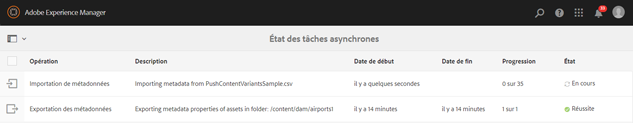
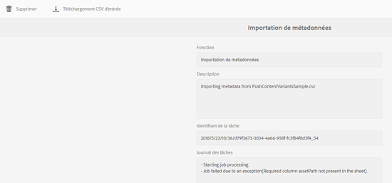

# Opérations asynchrones {#asynchronous-operations}

Afin de réduire les effets négatifs sur les performances, [!DNL Adobe Experience Manger Assets] traite de manière asynchrone certaines opérations d’actifs à long terme et gourmandes en ressources. Le traitement asynchrone implique la mise en file d&#39;attente de plusieurs tâches et leur exécution en série, sous réserve de la disponibilité des ressources système. Ces opérations incluent :

* Suppression de nombreuses ressources.
* Déplacement de nombreuses ressources ou de ressources avec de nombreuses références.
* Exportation et importation de métadonnées de fichier en bloc.

Vous pouvez vue l’état des tâches asynchrones à partir de la page **[!UICONTROL État de la tâche asynchrone]**.

>[!NOTE]
>
>Par défaut, les tâches [!DNL Assets] s’exécutent en parallèle. Si `N` correspond au nombre de coeurs de processeur, `N/2` les tâches peuvent s&#39;exécuter en parallèle, par défaut. Pour utiliser des paramètres personnalisés pour la file d&#39;attente des tâches, modifiez la configuration **[!UICONTROL File d&#39;attente par défaut de l&#39;opération asynchrone]** à partir de la [!UICONTROL console Web]. Pour plus d’informations, voir [Configurations de files d’attente](https://sling.apache.org/documentation/bundles/apache-sling-eventing-and-job-handling.html#queue-configurations).

## Contrôler l&#39;état des opérations asynchrones {#monitoring-the-status-of-asynchronous-operations}

Chaque fois que [!DNL Assets] traite une opération de manière asynchrone, vous recevez une notification dans votre [!DNL Experience Manager] [boîte de réception](/help/sites-authoring/inbox.md) et par courriel. Pour afficher l’état des opérations asynchrones en détail, accédez à la page **[!UICONTROL État des tâches asynchrones]**.

1. Dans l&#39;interface [!DNL Experience Manager], cliquez sur **[!UICONTROL Opérations]** > **[!UICONTROL Tâches]**.

1. Sur la page **[!UICONTROL État des tâches asynchrones]**, passez en revue les détails des opérations.

   

   Pour connaître la progression d&#39;une opération, consultez la colonne **[!UICONTROL État]**. Selon la progression, l’un des états suivants s’affiche :

   * **[!UICONTROL Actif]** : l’opération est en cours de traitement..
   * **[!UICONTROL Succès]** : L&#39;opération est terminée.
   * **** Erreur  **[!UICONTROL d&#39;échec]** : Impossible de traiter l&#39;opération.
   * **[!UICONTROL Programmé]** : Le traitement de l’opération est prévu ultérieurement.

1. Pour arrêter une principale opération, sélectionnez-la dans la liste et cliquez sur **[!UICONTROL Arrêter]**  dans la barre d&#39;outils.

1. Pour vue des détails supplémentaires, par exemple la description et les journaux, sélectionnez l’opération et cliquez sur **[!UICONTROL Ouvrir]**  dans la barre d’outils. La page Détails de la tâche s’affiche.

   

1. Pour supprimer l’opération de la liste, sélectionnez **[!UICONTROL Supprimer]** dans la barre d’outils. Pour télécharger les détails dans un fichier CSV, cliquez sur **[!UICONTROL Télécharger]**.

   >[!NOTE]
   >
   >Vous ne pouvez pas supprimer une tâche si son état est principal ou en file d’attente.

## Purger les tâches terminées {#purge-completed-tasks}

[!DNL Experience Manager Assets] exécute une tâche de purge tous les jours à 10 h pour supprimer les tâches asynchrones terminées qui ont plus d&#39;un jour.

<!-- TBD: Find out from the engineering team and mention the time zone of this 1:00 am task.
-->

Vous pouvez modifier la planification de la tâche de purge et la durée pendant laquelle les détails des tâches terminées sont conservés avant d&#39;être supprimés. Vous pouvez également configurer le nombre maximal de tâches terminées pour lesquelles les détails sont conservés à tout moment.

1. Dans l&#39;interface [!DNL Experience Manager], cliquez sur **[!UICONTROL Outils]** > **[!UICONTROL Opérations]** > **[!UICONTROL Console Web]**.
1. Ouvrez la tâche **[!UICONTROL Purger les tâches asynchrones de DAM Adobe CQ planifiées]**.
1. Indiquez le nombre limite de jours après lequel les tâches terminées sont supprimées et le nombre maximal de tâches pour lesquelles les détails sont conservés dans l’historique. Enregistrez les modifications.

   

## Configurer le seuil pour les opérations de suppression asynchrones {#configure-thresholds-for-asynchronous-delete-operations}

Si le nombre de fichiers ou de dossiers à supprimer dépasse le seuil défini, l’opération de suppression est exécutée de manière asynchrone.

1. Dans l&#39;interface [!DNL Experience Manager], cliquez sur **[!UICONTROL Outils]** > **[!UICONTROL Opérations]** > **[!UICONTROL Console Web]**.
1. Dans la [!UICONTROL console Web], ouvrez la configuration **[!UICONTROL Async Delete Operation Job Processing]**.
1. Dans la zone **[!UICONTROL Nombre seuil de ressources]**, indiquez les numéros de seuil pour supprimer de manière asynchrone des ressources, des dossiers ou des références. Enregistrez les modifications.

   

## Configurer le seuil pour les opérations de déplacement asynchrones {#configure-thresholds-for-asynchronous-move-operations}

Si le nombre de fichiers, de dossiers ou de références à déplacer dépasse le seuil défini, l’opération de déplacement est exécutée de manière asynchrone.

1. Dans l&#39;interface [!DNL Experience Manager], cliquez sur **[!UICONTROL Outils]** > **[!UICONTROL Opérations]** > **[!UICONTROL Console Web]**.
1. Dans la [!UICONTROL console Web], ouvrez la configuration **[!UICONTROL Traitement de la tâche d&#39;opération de déplacement asynchrone]**.
1. Dans la zone **[!UICONTROL Nombre seuil de ressources/références]**, indiquez les numéros de seuil pour déplacer de manière asynchrone des ressources, des dossiers ou des références. Enregistrez les modifications.

   

>[!MORELIKETHIS]
>
>* [Configurez le courrier électronique dans le Experience Manager](/help/sites-administering/notification.md).
>* [Importation et exportation des métadonnées de ressources par lot](/help/assets/metadata-import-export.md).

