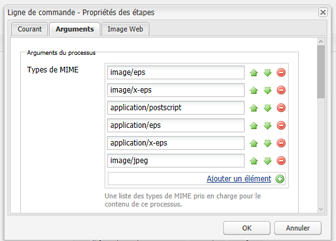
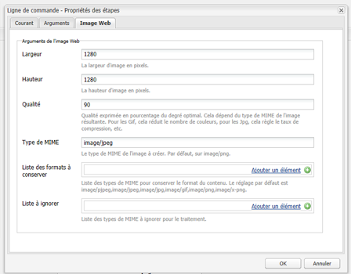
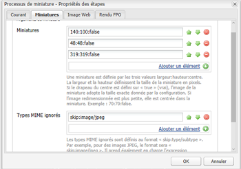
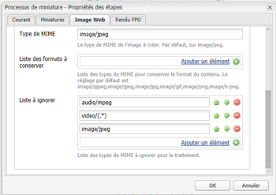

# Installation et configuration d’ImageMagick pour une utilisation avec [!DNL Experience Manager Assets] {#install-and-configure-imagemagick-to-work-with-aem-assets}

>[!CAUTION]
>
>AEM 6.4 a atteint la fin de la prise en charge étendue et cette documentation n’est plus mise à jour. Pour plus d’informations, voir notre [période de support technique](https://helpx.adobe.com/fr/support/programs/eol-matrix.html). Rechercher les versions prises en charge [here](https://experienceleague.adobe.com/docs/?lang=fr).

ImageMagick est un module externe logiciel servant à créer, modifier, composer ou convertir des images bitmap. Il peut lire et écrire des images dans plusieurs formats (plus de 200), dont PNG, JPEG, JPEG-2000, GIF, TIFF, DPX, EXR, WebP, Postscript, PDF et SVG. Utilisez ImageMagick pour redimensionner, retourner, mettre en miroir, faire pivoter, déformer, cisailler et transformer des images. Vous pouvez également ajuster les couleurs d’une image, appliquer divers effets spéciaux ou dessiner du texte, des lignes, des polygones, des ellipses et des courbes à l’aide d’ImageMagick.

Utilisez le gestionnaire de médias Adobe Experience Manager à partir de la ligne de commande pour traiter les images via ImageMagick. Pour utiliser divers formats de fichier à l’aide d’ImageMagick, voir [Bonnes pratiques relatives aux formats de fichier de ressources](assets-file-format-best-practices.md). Pour en savoir plus sur tous les formats de fichiers pris en charge, voir [Formats pris en charge par Assets](assets-formats.md).

Pour traiter des fichiers volumineux à l’aide d’ImageMagick, pensez à des exigences de mémoire plus élevées que d’habitude, aux modifications potentielles requises par les stratégies de messagerie instantanée et à l’impact global sur les performances. Les exigences en matière de mémoire dépendent de divers facteurs tels que la résolution, la profondeur de bit, le profil colorimétrique et le format de fichier. Si vous envisagez de traiter des fichiers très volumineux à l’aide d’ImageMagick, effectuez correctement le test des performances du serveur [!DNL Experience Manager]. Certaines ressources utiles sont fournies à la fin.

>[!NOTE]
>
>Si vous utilisez [!DNL Experience Manager] dans Adobe Managed Services (AMS), contactez l’assistance clientèle d’Adobe si vous envisagez de traiter un grand nombre de fichiers PSD ou PSB volumineux. Experience Manager ne peut pas traiter de fichiers PSB à très haute résolution, de plus de 30 000 x 23 000 pixels.

## Installation d’ImageMagick {#installing-imagemagick}

Plusieurs versions des fichiers d’installation ImageMagic sont disponibles pour différents systèmes d’exploitation. Utilisez la version appropriée de votre système d’exploitation.

1. Téléchargez les [fichiers d’installation d’ImageMagick](https://www.imagemagick.org/script/download.php) adaptés à votre système d’exploitation.
1. Pour installer ImageMagick sur le disque hébergeant le serveur [!DNL Experience Manager], lancez le fichier d’installation.

1. Définissez la variable de chemin d’environnement sur le répertoire d’installation d’ImageMagick.
1. Pour vérifier si l’installation est réussie, exécutez la commande `identify -version`.

## Configuration de l’étape de processus de ligne de commande {#set-up-the-command-line-process-step}

Vous pouvez configurer l’étape de processus de ligne de commande en fonction de votre cas d’utilisation. Effectuez les étapes suivantes pour générer une image inversée et des miniatures (140 x 100, 48 x 48, 319 x 319 et 1 280 x 1 280) chaque fois que vous ajoutez un fichier image JPEG dans `/content/dam` sur le serveur [!DNL Experience Manager] :

1. Sur le serveur [!DNL Experience Manager], accédez à la console Workflow (`https://[aem_server]:[Port]/workflow`) et ouvrez le modèle de workflow **[!UICONTROL Ressource de mise à jour de la gestion des ressources numériques]**.
1. À partir du modèle de workflow **[!UICONTROL Ressource de mise à jour de la gestion des ressources numériques]**, ouvrez l’étape **[!UICONTROL Miniatures EPS (avec la technologie ImageMagick)]**.
1. Sous l’**[!UICONTROL onglet Arguments]**, ajoutez `image/jpeg` à la liste **[!UICONTROL Types MIME]**.

   

1. Dans le champ **[!UICONTROL Commandes]**, saisissez la commande suivante :

   `convert ./${filename} -flip ./${basename}.flipped.jpg`

1. Sélectionnez les indicateurs **[!UICONTROL Supprimer le rendu généré]** et **[!UICONTROL Générer le rendu Web]**.

   

1. Sous l’onglet **[!UICONTROL Image activée pour le Web]**, spécifiez les détails du rendu avec des dimensions de 1 280 x 1 280 pixels. En outre, spécifiez i *mage/jpeg* dans le **[!UICONTROL Mimetype]** de la boîte.

   

1. Appuyez/cliquez sur **[!UICONTROL OK]** pour enregistrer les modifications.

   >[!NOTE]
   >
   >La commande `convert` peut ne pas s’exécuter avec certaines versions de Windows (par exemple, Windows SE), car elle entre en conflit avec l’utilitaire `convert` natif qui fait partie de l’installation de Windows. Dans ce cas, précisez le chemin complet de l’utilitaire ImageMagick. Par exemple, spécifiez :
   >
   >`"C:\Program Files\ImageMagick-6.8.9-Q16\convert.exe" -define jpeg:size=319x319 ./${filename} -thumbnail 319x319 cq5dam.thumbnail.319.319.png`

1. Ouvrez l’étape **[!UICONTROL Miniatures des processus]** et ajoutez le type MIME `image/jpeg` sous **[!UICONTROL Types MIME ignorés]**.

   

1. Sous l’onglet **[!UICONTROL Image activée pour le Web]**, ajoutez le type MIME `image/jpeg` sous **[!UICONTROL Liste à ignorer]**. Appuyez/cliquez sur **[!UICONTROL OK]** pour enregistrer les modifications.

   

1. Enregistrez le workflow.
1. Pour vérifier si ImageMagic est en mesure de traiter correctement les images, téléchargez une image de JPG vers [!DNL Assets]. Vérifiez si une image inversée et les rendus sont générés pour celle-ci.

## Réduction des vulnérabilités en matière de sécurité {#mitigating-security-vulnerabilities}

Il existe plusieurs vulnérabilités de sécurité associées à l’utilisation d’ImageMagick pour traiter les images. Par exemple, le traitement des images envoyées par l’utilisateur implique le risque d’exécution de code à distance (RCE).

En outre, divers modules externes de traitement d’images dépendent de la bibliothèque ImageMagick, notamment, mais sans s’y limiter, imagick de PHP, rmagick et paperclip de Ruby et imagemagick de Node.js.

Si vous utilisez ImageMagick ou une bibliothèque affectée, Adobe vous recommande d’atténuer les vulnérabilités connues en effectuant au moins l’une des tâches suivantes (de préférence les deux) :

1. Vérifiez que tous les fichiers image commencent par les [« octets magiques »](https://en.wikipedia.org/wiki/List_of_file_signatures) attendus, correspondant aux types de fichier image que vous prenez en charge avant de les envoyer à ImageMagick pour le traitement.
1. Utilisez un fichier de régulation pour désactiver les codes vulnérables d’ImageMagick. La stratégie globale pour ImageMagick se trouve dans `/etc/ImageMagick`.

>[!MORELIKETHIS]
>
>* [Bonnes pratiques relatives au traitement de divers formats de fichier à l’aide de [!DNL Assets]](assets-file-format-best-practices.md)
>* [Options de ligne de commande pour ImageMagick](https://www.imagemagick.org/script/command-line-options.php)
>* [Exemples de base et avancés d’utilisation d’ImageMagick](https://www.imagemagick.org/Usage/)
>* [Réglage des performances des ressources pour ImageMagick](performance-tuning-guidelines.md)
>* [Liste complète des formats de fichiers pris en charge par [!DNL Assets]](assets-formats.md)
>* [Comprendre les formats de fichiers et le coût de mémoire des images](https://www.scantips.com/basics1d.html)

