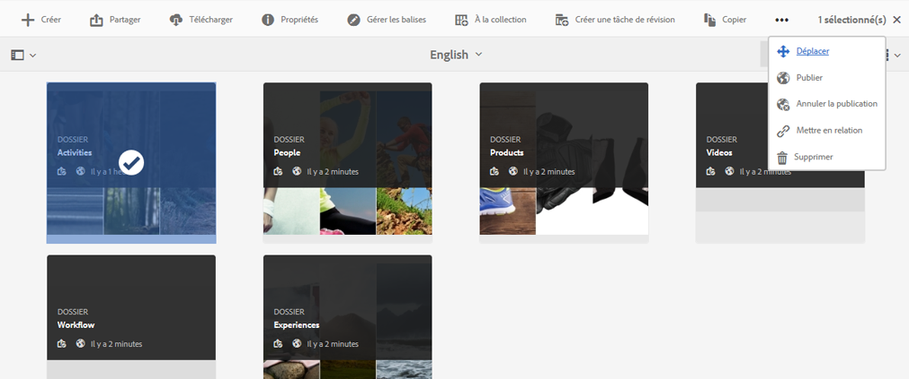
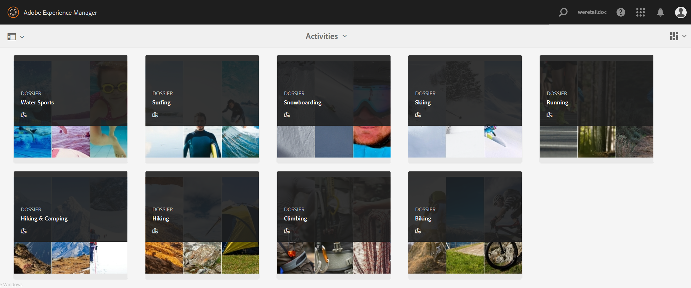

# Publication de ressources sur Brand Portal {#publish-assets-to-brand-portal}

En tant qu’administrateur Adobe Experience Manager (AEM) Assets, vous pouvez publier des fichiers sur l’instance AEM Assets Brand Portal (ou programmer le processus de publication à une date/heure ultérieure) pour votre entreprise. Toutefois, vous devez d’abord configurer AEM Assets avec Brand Portal. Pour plus de détails, voir [Configuration d’AEM Assets avec Brand Portal](configure-aem-assets-with-brand-portal.md).

Une fois que vous avez publié un fichier, il est accessible aux utilisateurs du portail de marque.

Si vous apportez des modifications ultérieures à l’actif d’origine dans AEM Assets, les modifications ne sont pas répercutées dans le portail des marques tant que vous n’avez pas republié l’actif. Cette fonction assure que les modifications en cours ne sont pas disponibles dans Brand Portal. Seules les modifications approuvées publiées par un administrateur sont disponibles dans Brand Portal.

Une fois la réplication réussie, vous pouvez publier des ressources, des dossiers et des collections sur Brand Portal. Pour publier des ressources sur Brand Portal, procédez comme suit :

>[!NOTE]
>
>Adobe recommande la publication décalée, de préférence en dehors des heures de pointe, de sorte que l’auteur AEM n’utilise pas une quantité excessive de ressources.

1. Dans la console Assets, placez le curseur au-dessus des ressources souhaitées et sélectionnez l’option **[!UICONTROL Publier]** parmi les actions rapides.

   Vous pouvez également sélectionner les ressources que vous voulez publier sur Brand Portal.

   

2. Pour publier les fichiers sur le portail des marques, deux options sont disponibles :
   * [Publication immédiate des fichiers](#publish-now)
   * [Publication ultérieure des ressources](#publish-later)

## Publication immédiate des ressources {#publish-now}

Pour publier les ressources sélectionnées sur Brand Portal, effectuez l’une des opérations suivantes :

* Dans la barre d’outils, sélectionnez **[!UICONTROL Publication rapide]**. Then from the menu, select **[!UICONTROL Publish to Brand Portal]**.

* Dans la barre d’outils, sélectionnez **[!UICONTROL Gérer la publication]**.

   1. Then from the **[!UICONTROL Action]** select **[!UICONTROL Publish to Brand Portal]**, and from **[!UICONTROL Scheduling]** select **[!UICONTROL Now]**. Appuyez/cliquez sur **[!UICONTROL Suivant].**

   2. Within **[!UICONTROL Scope]**, confirm your selection and tap/ click **[!UICONTROL Publish to Brand Portal]**.

Un message indique que les ressources ont été placées en file d’attente pour publication sur Brand Portal. Connectez-vous à l’interface Brand Portal pour voir les ressources publiées.

## Publication ultérieure des ressources {#publish-later}

Pour planifier la publication des ressources sur Brand Portal à une date ou une heure ultérieure :

1. Once you have selected assets/ folders to publish, select **[!UICONTROL Manage Publication]** from the tool bar at the top.
2. On **[!UICONTROL Manage Publication]** page, select **[!UICONTROL Publish to Brand Portal]** from **[!UICONTROL Action]** and select **[!UICONTROL Later]** from **[!UICONTROL Scheduling]**.

   

3. Sélectionnez une **[!UICONTROL Date d’activation]** et spécifiez l’heure. Appuyez/cliquez sur **[!UICONTROL Suivant]**.
4. Sélectionnez une **[!UICONTROL Date d’activation]** et spécifiez l’heure. Appuyez/cliquez sur **[!UICONTROL Suivant]**.
5. Spécifiez un titre de workflow sous **[!UICONTROL Processus]**. Tap/ click **[!UICONTROL Publish Later]**.

   

Désormais, connectez-vous à Brand Portal pour savoir si les fichiers publiés sont disponibles sur l’interface du portail Marque.

