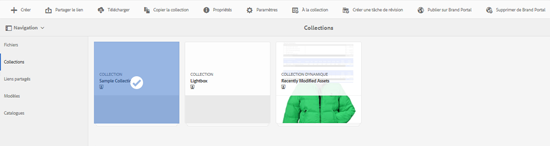
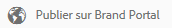
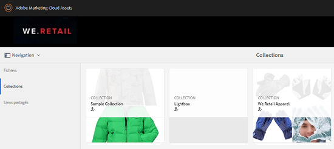
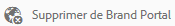

# Publication de collections sur Brand Portal {#publish-collections-to-brand-portal}

En tant qu’administrateur Adobe Experience Manager (AEM) Assets, vous pouvez publier des collections dans l’instance AEM Assets Brand Portal de votre organisation. Cependant, vous devez d’abord intégrer AEM Assets à Brand Portal. Pour plus de détails, voir [Configuration d’AEM Assets avec Brand Portal](configure-aem-assets-with-brand-portal.md).

Si vous apportez des modifications ultérieures à la collection d’origine dans AEM Assets, les modifications ne sont pas répercutées dans le portail des marques tant que vous n’avez pas publié à nouveau la collection. Cette caractéristique garantit que les modifications en cours ne sont pas disponibles dans le portail de marque. Seules les modifications approuvées publiées par un administrateur sont disponibles dans Brand Portal.

>[!NOTE]
>
>Les fragments de contenu ne peuvent pas être publiés sur Brand Portal. Therefore, if you select content fragment(s) on AEM Author, then **[Publish to Brand Portal]** action is not available.
>
>Si des collections contenant des fragments de contenu sont publiées sur Brand Portal à partir de l’auteur AEM, alors tout le contenu du dossier, excepté les fragments de contenu, est répliqué sur l’interface Brand Portal.

## Publication d’une collection dans Brand Portal {#publish-a-collection-to-brand-portal}

1. Dans l’interface utilisateur d’AEM Assets, appuyez/cliquez sur le logo AEM. Ensuite, accédez à **[!UICONTROL Assets > Collections]** depuis la page **[!UICONTROL Navigation]**.
2. Dans la console Collections, sélectionnez la collection que vous souhaitez publier sur le portail des marques.

   

3. Dans la barre d’outils, appuyez/cliquez sur **[!UICONTROL Publier sur Brand Portal]**.

   

4. Dans la boîte de dialogue de confirmation, appuyez/cliquez sur **[!UICONTROL Publier]**.
5. Fermez le message de confirmation.
6. Connectez-vous à Brand Portal en tant qu’administrateur. La collection publiée est disponible dans la console Collections.

   

## Annulation de la publication de collections {#unpublish-collections}

Vous pouvez annuler la publication des collections que vous publiez depuis AEM Assets vers le portail des marques. Une fois la collection d’origine dépubliée, sa copie n’est plus disponible pour les utilisateurs du portail de marques.

1. Dans la console Collections de votre instance AEM Assets, sélectionnez la collection dont vous souhaitez annuler la publication.

   

2. From the toolbar, tap/click the **[!UICONTROL Remove from Brand Portal]** icon.

   

3. Dans la boîte de dialogue, appuyez/cliquez sur **[!UICONTROL Annuler la publication]**.
4. Fermez le message de confirmation. La collection est supprimée de l’interface de Brand Portal.
