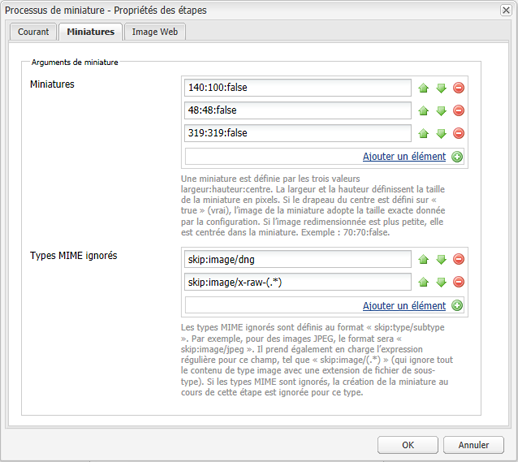
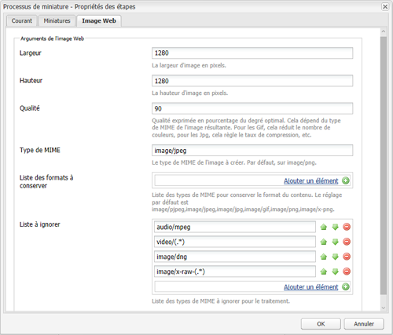
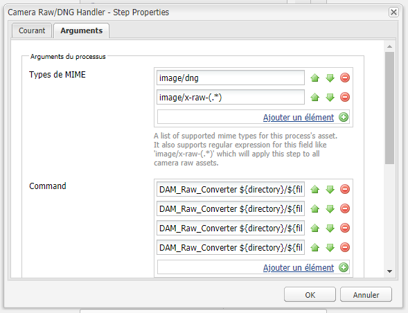
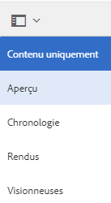
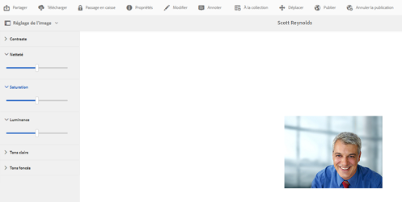

# Utilisation de Camera Raw pour traiter les images {#camera-raw-support}

>[!CAUTION]
>
>AEM 6.4 a atteint la fin de la prise en charge étendue et cette documentation n’est plus mise à jour. Pour plus d’informations, voir notre [période de support technique](https://helpx.adobe.com/fr/support/programs/eol-matrix.html). Rechercher les versions prises en charge [here](https://experienceleague.adobe.com/docs/?lang=fr).

Vous pouvez activer la prise en charge Camera Raw pour traiter les formats de fichiers bruts, tels que CR2, NEF et RAF, et effectuer le rendu des images au format JPEG. Cette fonctionnalité est prise en charge dans Adobe Experience Manager Assets à l’aide de la fonction [Package Camera Raw](https://experience.adobe.com/#/downloads/content/software-distribution/en/aem.html?package=/content/software-distribution/en/details.html/content/dam/aem/public/adobe/packages/aem630/product/assets/aem-assets-cameraraw-pkg) disponible à partir de Distribution logicielle.

>[!NOTE]
>
>La fonctionnalité ne prend en charge que les rendus JPEG. Elle est prise en charge sous Windows 64 bits, Mac OS et RHEL 7.x.

Pour activer la prise en charge Camera Raw dans Adobe Experience Manager Assets, procédez comme suit :

1. Téléchargez la [Package Camera Raw](https://experience.adobe.com/#/downloads/content/software-distribution/en/aem.html?package=/content/software-distribution/en/details.html/content/dam/aem/public/adobe/packages/aem630/product/assets/aem-assets-cameraraw-pkg) à partir de Distribution logicielle.

1. Accédez à l’adresse `https://[aem_server]:[port]/workflow`. Ouvrez le workflow **[!UICONTROL Ressource de mise à jour de la gestion des ressources numériques]**.

1. Ouvrez le **[!UICONTROL Miniatures des processus]** étape .

1. Indiquez la configuration suivante dans l’onglet **[!UICONTROL Miniatures]** :

   * **[!UICONTROL Miniatures]** : `140:100:false, 48:48:false, 319:319:false`
   * **[!UICONTROL Types MIME ignorés]** : `skip:image/dng, skip:image/x-raw-(.*)`

   

1. Dans l’onglet **[!UICONTROL Image activée pour le web]**, dans le champ **[!UICONTROL Liste à ignorer]**, spécifiez `audio/mpeg, video/(.*), image/dng, image/x-raw-(.*)`.

   

1. Dans le panneau latéral, ajoutez le **[!UICONTROL Gestionnaire Camera Raw/DNG]** étape sous **[!UICONTROL Création de miniatures]** étape .

1. Dans l’étape **[!UICONTROL Camera Raw / DNG Handler]**, ajoutez la configuration suivante dans l’onglet **[!UICONTROL Arguments]** :

   * **[!UICONTROL Types MIME]** : `image/dng` et `image/x-raw-(.*)`
   * **[!UICONTROL Commande]** :

      * `DAM_Raw_Converter ${directory}/${filename} ${directory} cq5dam.web.1280.1280.jpeg 1280 1280`
      * `DAM_Raw_Converter ${directory}/${filename} ${directory} cq5dam.thumbnail.319.319.jpeg 319 319`
      * `DAM_Raw_Converter ${directory}/${filename} ${directory} cq5dam.thumbnail.140.100.jpeg 140 100`
      * `DAM_Raw_Converter ${directory}/${filename} ${directory} cq5dam.thumbnail.48.48.jpeg 48 48`

   

1. Cliquez sur **[!UICONTROL Enregistrer]**.

>[!NOTE]
>
>Vérifiez que la configuration ci-dessus est identique à la configuration de l’**[!UICONTROL exemple de ressource de mise à jour de la gestion des ressources numériques avec l’étape de Camera RAW et DNG Handler]**.

Vous pouvez désormais importer des fichiers Camera Raw dans [!DNL Experience Manager] Ressources. Une fois que vous avez installé le package Camera Raw et configuré le workflow requis, l’option **[!UICONTROL Réglage de l’image]** apparaît dans la liste des volets latéraux.

*Image : options dans le volet latéral*

*Image : utilisez cette option pour apporter des modifications légères à vos images*

Après avoir enregistré les modifications sur une image Camera Raw, un nouveau rendu `AdjustedPreview.jpg` est généré pour l’image. Pour les autres types d’image, à l’exception de Camera Raw, les modifications sont répercutées dans tous les rendus.

## Bonnes pratiques, problèmes connus et limites {#best-practices}

La fonctionnalité présente les limites suivantes :

* La fonctionnalité ne prend en charge que les rendus JPEG. Il est pris en charge sur Windows 64 bits, Mac OS et RHEL 7.x.
* L’écriture différée des métadonnées n’est pas prise en charge pour les formats RAW et DNG.
* La bibliothèque Camera Raw présente des limites relatives au nombre total de pixels qu’elle peut traiter à la fois. Actuellement, il peut traiter un fichier de maximum 65 000 pixels de long, ou de maximum 512 MP, quel que soit la limite rencontrée en premier.
