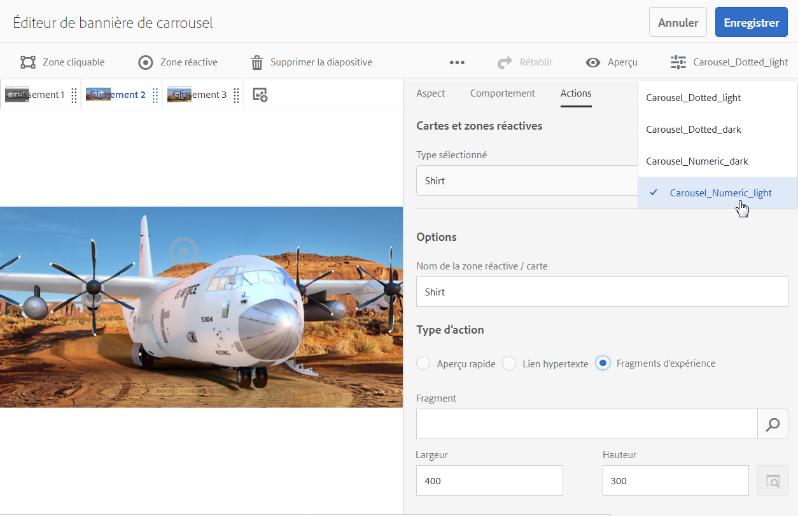

# Bannières de carrousel {#carousel-banners}

>[!CAUTION]
>
>AEM 6.4 a atteint la fin de la prise en charge étendue et cette documentation n’est plus mise à jour. Pour plus d’informations, voir notre [période de support technique](https://helpx.adobe.com/fr/support/programs/eol-matrix.html). Rechercher les versions prises en charge [here](https://experienceleague.adobe.com/docs/?lang=fr).

Les bannières de carrousel permettent aux marketeurs de générer des conversions en créant facilement du contenu promotionnel interactif et tournant et en le diffusant sur n’importe quel écran.

La création et la modification de contenu figurant dans les bannières promotionnelles peuvent prendre du temps, ce qui limite votre capacité à publier rapidement un nouveau contenu ou à le cibler davantage. Les bannières de carrousel vous permettent de créer ou de modifier rapidement des bannières rotatives, d’ajouter de l’interactivité, comme des zones réactives, liées aux détails du produit ou aux ressources associées, et de les diffuser sur n’importe quel écran, ce qui vous permet d’apporter plus rapidement du nouveau contenu promotionnel au marché.

Les bannières de carrousel sont signalées par une bannière contenant le mot **CAROUSELSET** :

Sur votre site web, la bannière de carrousel peut se présenter comme suit :

Ici, vous pouvez parcourir les images (en cliquant sur les nombres). De plus, les diapositives alternent automatiquement selon un intervalle personnalisable. Les images que vous ajoutez dans la bannière de carrousel prennent en charge les zones réactives et les zones cliquables, où les utilisateurs peuvent appuyer ou accéder à un lien hypertexte ou accéder à une fenêtre d’aperçu rapide.

Dans cet exemple, un utilisateur a tapé ou cliqué sur une zone cliquable et a accédé à la fenêtre d’aperçu rapide pour des gants :

## Vidéo sur la création de bannières de carrousel {#watch-how-carousel-banners-are-created}

Regardez une présentation guidée de 10 min et 33 s sur la [création de bannières de carrousel](https://s7d5.scene7.com/s7viewers/html5/VideoViewer.html?videoserverurl=https://s7d5.scene7.com/is/content/&amp;emailurl=https://s7d5.scene7.com/s7/emailFriend&amp;serverUrl=https://s7d5.scene7.com/is/image/&amp;config=Scene7SharedAssets/Universal_HTML5_Video_social&amp;contenturl=https://s7d5.scene7.com/skins/&amp;asset=S7tutorials/InteractiveCarouselBanner). Vous apprendrez également à prévisualiser, modifier et diffuser des bannières de carrousel.

>[!NOTE]
>
>Les utilisateurs non administrateurs doivent être ajoutés au groupe **dam-users** de façon à pouvoir créer ou modifier des bannières de carrousel. Si vous rencontrez des problèmes lors de la création ou de la modification, contactez votre administrateur système pour qu’il vous ajoute au **dam-users** groupe.

## Démarrage rapide : bannières de carrousel {#quick-start-carousel-banners}

Pour démarrer rapidement :

1. [Identifiez les variables de zone réactive et de zone cliquable](#identifying-hotspot-and-image-map-variables) (seulement pour les clients qui utilisent AEM Assets et Dynamic Media).

   Commencez par identifier les variables dynamiques utilisées par l’implémentation de l’aperçu rapide existant afin que vous puissiez entrer correctement les données des zones réactives et des zones cliquables lors de la création de bannières de carrousel dans AEM Assets.

   >[!NOTE]
   >
   >Si vous êtes un client AEM Sites ou eCommerce, vous pouvez utiliser la fonction intégrée pour accéder aux pages de produits et rechercher les SKU existantes dans le catalogue de produits. Vous n’avez pas besoin d’entrer manuellement les variables de zone réactive ou de zone cliquable. Reportez-vous aux informations sur la [configuration d’eCommerce](/help/sites-administering/generic.md).
   >
   >Si vous êtes client AEM Assets et Dynamic Media, vous devez saisir manuellement les données des zones réactives et des zones cliquables, puis intégrer l’URL ou le code intégré publié à votre système de gestion de contenu tiers.

1. Facultatif : [créez un paramètre prédéfini d’ensemble de carrousel](managing-viewer-presets.md), au besoin.

   Si vous êtes administrateur, vous pouvez personnaliser le comportement et l’apparence du carrousel en créant votre propre paramètre prédéfini de visionneuse de carrousel. L’avantage principal est que vous pouvez réutiliser ce paramètre prédéfini de visionneuse personnalisé pour plusieurs carrousels. Cependant, les utilisateurs ont également la possibilité de personnaliser le comportement et l’apparence du carrousel directement lors de sa création. Il s’agit de l’approche recommandée lorsque vous souhaitez une conception très spécifique d’un carrousel donné.

1. [Chargez une bannière d’image](#uploading-image-banners).

   Chargez les bannières d’images que vous souhaitez rendre interactives.

1. [Créez un ensemble de carrousels](#creating-carousel-sets).

   Dans les ensembles de carrousels, les utilisateurs parcourent les images de bannière et appuient sur les zones réactives ou les zones cliquables pour accéder au contenu approprié.

   Pour créer un ensemble de carrousel dans Assets, appuyez sur **[!UICONTROL Créer]**, puis sélectionnez **[!UICONTROL Ensembles de carrousels]**. Ajoutez des ressources aux diapositives et appuyez sur **[!UICONTROL Enregistrer]**. Vous pouvez également modifier l’apparence et le comportement du carrousel directement dans l’éditeur.

1. [Ajoutez des zones réactives ou cliquables dans une bannière d’image.](#adding-hotspots-or-image-maps-to-an-image-banner)

   Ajoutez une ou plusieurs zones réactives ou cliquables à une bannière d’image et associez chacune d’elles à une action, comme un lien, un aperçu rapide ou un fragment d’expérience. Une fois que vous avez ajouté des zones réactives ou des zones cliquables, vous terminez cette tâche en publiant l’ensemble de carrousel. La publication crée le code incorporé que vous pouvez utiliser pour copier et appliquer à la page d’entrée de votre site web.

   Voir [(Facultatif) Aperçu des bannières de carrousel](#optional-previewing-carousel-banners) - Facultatif. Si vous le souhaitez, vous pouvez afficher une représentation de l’ensemble de carrousel et tester son interactivité.

1. [Publiez les bannières de carrousel.](#publishing-carousel-banners)

   Vous publiez un ensemble de carrousel comme vous le feriez pour d’autres ressources. Dans Ressources, accédez à l’ensemble de carrousel, sélectionnez-le, puis appuyez ou appuyez sur **[!UICONTROL Publier]**. La publication d’un ensemble de carrousel active la chaîne URL et d’incorporation.

1. Utilisez l’une des méthodes suivantes :

   * [Ajoutez une bannière de carrousel à votre page web.](#adding-a-carousel-banner-to-your-website-page) Vous pouvez ajouter le code intégré ou l’URL de la bannière de carrousel que vous avez copié sur la page web.

      * [Intégrez la bannière de carrousel à un aperçu rapide existant](#integrating-the-carousel-banner-with-an-existing-quickview). Si vous utilisez un système de gestion de contenu web tiers, vous devrez intégrer la nouvelle bannière de carrousel à l’aperçu rapide existant sur votre site web.
   * [Ajout d’une bannière de carrousel à votre site web dans AEM](adding-dynamic-media-assets-to-pages.md) Si vous êtes un client AEM Sites, vous pouvez ajouter l’ensemble de carrousel directement à la page dans AEM, à l’aide du composant Interactive Media.

Si vous devez modifier des ensembles de carrousels, voir [Modification d’ensembles de carrousels](#editing-carousel-sets). De plus, vous pouvez afficher et modifier les [propriétés d’un ensemble de carrousel](/help/assets/managing-assets-touch-ui.md#editing-properties).

## Identification des variables de zone réactive et de zone cliquable {#identifying-hotspot-and-image-map-variables}

Commencez par identifier les variables dynamiques utilisées par l’implémentation de l’aperçu rapide existant afin que vous puissiez entrer correctement les données des zones réactives ou des zones cliquables lors du processus de création d’ensembles de carrousels dans AEM Assets.

Lorsque vous ajoutez des zones réactives ou des zones cliquables à une image de bannière dans AEM Assets, vous devez affecter un SKU et des variables supplémentaires facultatives à chaque zone réactive ou zone cliquable. Ces variables sont utilisées, par la suite, pour faire correspondre les zones réactives ou cliquables au contenu de l’aperçu rapide.

>[!NOTE]
>
>Si vous êtes un client AEM Sites et/ou AEM eCommerce, ignorez cette étape. Vous n’avez pas besoin d’identifier manuellement les variables de zone réactive ou cliquable. Vous pouvez utiliser l’intégration à eCommerce pour l’intégration des produits. Reportez-vous aux informations sur la [configuration d’eCommerce](/help/sites-administering/generic.md). En outre, vous pouvez utiliser le composant interactif et l’ajouter à votre page web.
>
>Si vous êtes client AEM Assets ou Media, vous publiez l’URL ou le code intégré, puis vous intégrez votre système de gestion de contenu tiers et identifiez manuellement les zones réactives et les zones cliquables.

Il est important d’identifier correctement le nombre et le type des variables à associer aux données des zones réactives ou cliquables. Chaque zone réactive ou zone cliquable ajoutée à une image de bannière doit comporter suffisamment d’informations pour identifier sans ambiguïté le produit dans le système principal existant. En même temps, chaque zone réactive ou zone cliquable ne doit pas inclure plus de données que nécessaire. La raison en est que cela rendrait le processus de saisie des données trop complexe et la gestion continue des zones réactives ou des zones cliquables plus sujette aux erreurs.

Il existe différentes manières d’identifier un ensemble de variables à utiliser pour les données de zone réactive ou de zone cliquable.

Il peut parfois être nécessaire de consulter les spécialistes informatiques responsables de l’implémentation d’aperçu rapide existante, car ils connaissent probablement le jeu minimum de données nécessaires pour identifier l’aperçu rapide dans le système. Cependant, dans la plupart des cas, il est également possible d’analyser simplement le comportement existant du code frontal.

La plupart des implémentations d’aperçu rapide utilisent le paradigme suivant :

* L’utilisateur active un élément d’interface utilisateur sur le site web. Par exemple, en cliquant sur un **[!UICONTROL Aperçu rapide]** bouton .
* Le site Web envoie une requête Ajax au serveur principal afin de charger les données ou le contenu de l’aperçu rapide, le cas échéant.
* Les données de l’aperçu rapide sont traduites en contenu en préparation du rendu sur la page Web.
* Enfin, le code en front-end effectue le rendu visuel de ce contenu à l’écran.

L’approche consiste ensuite à visiter différentes zones du site web existant où la fonction d’aperçu rapide est mise en oeuvre, à déclencher l’aperçu rapide et à capturer l’URL Ajax envoyée par la page web pour le chargement des données ou du contenu de l’aperçu rapide.

Normalement, il n’est pas nécessaire d’utiliser des outils de débogage spécialisés. Les navigateurs web modernes incluent des inspecteurs web qui font un travail correct. Vous trouverez ci-dessous quelques exemples de navigateurs web qui incluent des inspecteurs web :

* Pour afficher toutes les requêtes HTTP sortantes dans Google Chrome, appuyez sur F12 (Windows) ou Command-Option-I (Mac) pour ouvrir le panneau Outils de développement, puis appuyez sur la **[!UICONTROL Réseau]** .
* Dans Firefox, vous pouvez activer le plug-in Firebug en appuyant sur F12 (Windows) ou Contrôle-Option-I (Mac) et utiliser l’onglet Réseau, ou vous pouvez utiliser l’outil Inspecteur intégré et son onglet Réseau.

Lorsque la surveillance de réseau est activée dans le navigateur, déclenchez l’aperçu rapide sur la page.

Vous trouvez maintenant l’URL Ajax d’aperçu rapide dans le journal réseau. Copiez l’URL enregistrée pour l’analyse ultérieure. Dans la plupart des cas, lorsque vous déclenchez l’aperçu rapide, plusieurs requêtes sont envoyées au serveur. En règle générale, l’URL Ajax d’aperçu rapide est l’une des premières dans la liste. Elle possède une partie de chaîne de requête complexe ou un chemin d’accès, et son type de réponse MIME est `text/html`, `text/xml` ou `text/javascript`.

Au cours de ce processus, il est important de parcourir différentes zones de votre site web, avec différentes catégories et types de produits. C’est pourquoi les URL d’aperçu rapide peuvent avoir des parties communes pour une catégorie de site web donnée, mais ne changent que si vous visitez une autre zone du site web.

Dans le cas le plus simple, la seule partie variable dans l’URL de l’aperçu rapide est le SKU du produit. Dans ce cas, la valeur de la SKU est la seule donnée dont vous avez besoin pour ajouter des zones réactives ou des zones cliquables à l’image de bannière.

Cependant, dans les cas complexes, l’URL d’aperçu rapide comporte différents éléments variables en complément du SKU, comme l’identifiant de la catégorie, le code couleur, le code taille, etc. Dans ce cas, chaque élément est une variable distincte dans la définition des données de zone réactive ou cliquable dans la fonction de bannière de carrousel.

Consultez les exemples d’URL d’aperçu rapide ci-dessous et les variables de zone réactive et de zone cliquable obtenues :

<table> 
 <tbody> 
  <tr> 
   <td>SKU unique, trouvé dans la chaîne de requête.</td> 
   <td>
Les URL d’aperçu rapide enregistrées incluent ce qui suit :
 
    <ul> 
     <li>
<code>https://server/json?productId=866558&amp;source=100</code>
 </li> 
     <li>
<code>https://server/json?productId=1196184&amp;source=100</code>
 </li> 
     <li>
<code>https://server/json?productId=1081492&amp;source=100</code>
 </li> 
     <li>
<code>https://server/json?productId=1898294&amp;source=100</code>
 </li> 
    </ul> 
La seule partie variable de l’URL est la valeur du paramètre de chaîne de requête <code>productId=</code>, et il s’agit clairement d’une valeur de SKU. Par conséquent, il suffit d’indiquer, dans les champs de SKU des zones réactives ou cliquables, des valeurs comme <code>866558,</code> <code>1196184,</code> <code>1081492,</code> <code>1898294.</code>
 </td> 
  </tr> 
  <tr> 
   <td>SKU unique, trouvé dans le chemin d’accès à l’URL.</td> 
   <td>
Les URL d’aperçu rapide enregistrées incluent ce qui suit :
 
    <ul> 
     <li>
<code>https://server/product/6422350843</code>
 </li> 
     <li>
<code>https://server/product/1607745002</code>
 </li> 
     <li>
<code>https://server/product/0086724882</code>
 </li> 
    </ul> 
La partie variable se trouve dans la dernière partie du chemin et elle devient la valeur de SKU des zones réactives/cliquables : <strong><code>6422350843</code>, <code>1607745002,</code> </strong><code>0086724882.</code>.
 </td> 
  </tr> 
  <tr> 
   <td>SKU et ID de catégorie dans la chaîne de requête.</td> 
   <td>
Les URL d’aperçu rapide enregistrées incluent ce qui suit :
 
    <ul> 
     <li>
<code>https://server/quickView/product/?category=1100004&amp;prodId=305466</code>
 </li> 
     <li>
<code>https://server/quickView/product/?category=1100004&amp;prodId=310181</code>
 </li> 
     <li>
<code>https://server/quickView/product/?category=1740148&amp;prodId=308706</code>
 </li> 
    </ul> 
Dans ce cas, l’URL comporte deux parties différentes. Le SKU est stocké dans le paramètre <code>prodId</code> et l’ID de catégorie est stocké dans le paramètre <code>category=</code>.
 
En tant que telles, les définitions zone réactive/zone cliquable sont des paires. Autrement dit, une valeur de SKU et une variable supplémentaire appelée « <code>categoryId</code> ». Les paires obtenues sont les suivantes :
 
    <ul> 
     <li>
Le SKU est <strong><code>305466</code></strong> et <code>categoryId</code> est <code>1100004</code>.
 </li> 
     <li>
Le SKU est <strong><code>310181</code></strong> et <code>categoryId</code> est <strong><code>1100004</code></strong>.
 </li> 
     <li>
Le SKU est <strong><code>308706</code></strong> et <code>categoryId</code> est <strong><code>1740148</code></strong>.
 </li> 
    </ul> </td> 
  </tr> 
 </tbody> 
</table>

## Chargement des bannières d’image {#uploading-image-banners}

Si vous avez déjà chargé les images à utiliser, passez à l’étape suivante, [Création d’ensembles de carrousels](#creating-carousel-sets). Notez que les images utilisées dans le carrousel doivent être chargées une fois que Dynamic Media a été activé.

Pour charger des bannières d’image, voir [Chargement de ressources](managing-assets-touch-ui.md).

## Création d’ensembles de carrousels {#creating-carousel-sets}

>[!NOTE]
>
>Les utilisateurs non administrateurs doivent être ajoutés au groupe **[!UICONTROL dam-users]** de façon à pouvoir créer ou modifier des bannières de carrousel. Si vous rencontrez des problèmes lors de la création ou de la modification, contactez votre administrateur système pour qu’il vous ajoute au **dam-users** groupe.

**Pour créer un ensemble de carrousel** :

1. Dans Ressources, cherchez le dossier dans lequel vous souhaitez créer l’ensemble de carrousel, puis appuyez sur **[!UICONTROL Créer > Ensemble de carrousel]**.
1. Sur le **[!UICONTROL Éditeur de bannière de carrousel]** page, appuyez sur **[!UICONTROL Appuyez sur pour ouvrir le sélecteur de ressources.]** pour sélectionner l’image de votre première diapositive.

   Sur le **[!UICONTROL Éditeur de bannière de carrousel]** effectuez l’une des opérations suivantes :

   * Dans le coin supérieur gauche de la page, appuyez sur l’icône **[!UICONTROL Ajouter une diapositive]**.
   * Au milieu de la page, appuyez sur **[!UICONTROL Appuyez sur pour ouvrir le sélecteur de ressources.]**.

   Appuyez pour sélectionner les ressources à inclure dans votre ensemble de carrousel. Les ressources sélectionnées sont cochées. Lorsque vous avez terminé, près du coin supérieur droit de la page, appuyez sur **[!UICONTROL Sélectionner]**.

   Le sélecteur de ressources vous permet de rechercher des ressources en saisissant un mot-clé, puis en appuyant sur **[!UICONTROL Retour]**. Vous pouvez également appliquer des filtres pour affiner vos résultats de recherche. Vous pouvez filtrer par chemin, collection, type de fichier et balise. Sélectionnez le filtre, puis appuyez sur l’icône **[!UICONTROL Filtre]** de la barre d’outils. Modifiez l’affichage en appuyant sur la **[!UICONTROL Affichage]** icône et sélection **[!UICONTROL Mode Colonnes]**, **[!UICONTROL Mode Carte]** ou **[!UICONTROL Mode Liste]**.

   Pour plus d’informations, voir [Utilisation de sélecteurs](working-with-selectors.md).

1. Continuez à ajouter des diapositives jusqu’à ce que vous ayez ajouté toutes les images à faire pivoter dans l’ensemble de carrousel.
1. (En option) Effectuez l’une des actions suivantes :

   * Si nécessaire, faites glisser les diapositives pour réorganiser les images dans la liste définie.
   * Pour supprimer une image, sélectionnez-la, puis appuyez sur **[!UICONTROL Supprimer la diapositive]** dans la barre d’outils.
   * Pour appliquer un paramètre prédéfini, en haut à droite de la page, appuyez sur la liste déroulante Paramètre prédéfini, puis sélectionnez un paramètre prédéfini à appliquer simultanément à la visionneuse.

   Pour supprimer une diapositive, appuyez sur la diapositive, puis appuyez sur **[!UICONTROL Supprimer la diapositive]** dans la barre d’outils. Pour déplacer une diapositive, appuyez sur l’icône de réorganisation, puis maintenez-la enfoncée et accédez à l’emplacement souhaité.

1. Une fois que vous avez ajouté les images aux diapositives, vous pouvez ajouter à votre image une zone réactive, une zone cliquable, ou les deux. Voir [Ajout de zones réactives ou cliquables](#adding-hotspots-or-image-maps-to-an-image-banner).
1. Vous pouvez modifier la conception visuelle et le comportement des ensembles de carrousels en appuyant ou en cliquant sur les onglets Comportement et Apparence et en ajustant l’aspect de votre bannière de carrousel ou le comportement de certains composants. Pour plus d’informations sur l’utilisation de l’éditeur de visionneuses, reportez-vous à la section [Gestion des paramètres prédéfinis de visionneuse](viewer-presets.md).

   >[!NOTE]
   >
   >Pour les bannières de carrousel, vous pouvez modifier les éléments suivants :
   >* Durée d’affichage d’une image. Par défaut, chaque image s’affiche pendant 9 secondes.
   >* Animation. Par défaut, chaque transition de diapositive est un fondu. Vous pouvez changer cela en transition de diapositive.
   >* Style des boutons. Les utilisateurs peuvent faire pivoter les bannières en appuyant sur chaque point ou nombre. Vous pouvez modifier l’emplacement d’affichage des boutons d’indicateur définis (et, s’ils sont de type numérique ou en pointillé) et leur taille.
   >* Modifiez le style de mise en surbrillance d’une zone cliquable ou de l’icône utilisée pour les zones réactives.
   >* Avant de modifier un paramètre prédéfini de visionneuse, choisissez le style de votre choix. Si vous ne le faites pas, lorsque vous commencez à modifier le paramètre prédéfini de visionneuse, vous perdrez toutes vos modifications si vous décidez de changer de paramètre prédéfini.

   Vous pouvez également prévisualiser la bannière de carrousel. Voir [(Facultatif) Aperçu des bannières de carrousel](#optional-previewing-carousel-banners).

1. Lorsque vous avez terminé, appuyez sur **[!UICONTROL Enregistrer]**.

## Ajout de zones réactives ou cliquables à une bannière d’image {#adding-hotspots-or-image-maps-to-an-image-banner}

Vous pouvez ajouter des zones réactives ou des zones cliquables à une bannière à l’aide de l’éditeur d’ensemble de carrousel.

Lorsque vous ajoutez des zones réactives ou des zones cliquables, vous pouvez les définir comme un affichage contextuel d’aperçu rapide, comme lien hypertexte ou comme fragment d’expérience.

Voir [Fragments d’expérience](/help/sites-authoring/experience-fragments.md).

>[!NOTE]
>
>N’oubliez pas que les outils de partage sur les médias sociaux ne sont pas pris en charge dans la bannière de carrousel lorsque vous incorporez la visionneuse dans un fragment d’expérience. Pour contourner ce problème, vous pouvez utiliser ou créer des paramètres prédéfinis de visionneuse qui ne disposent pas d’outils de partage sur les médias sociaux. Ces paramètres prédéfinis de visionneuse vous permettent de l’incorporer dans des fragments d’expérience.

À mesure que vous ajoutez des zones réactives ou des zones cliquables à une image, pensez à enregistrer votre travail. **[!UICONTROL Les options Annuler et Rétablir, proches du coin supérieur droit de la page, sont prises en charge au cours de la session de création/modification actuelle.]******

Lorsque vous avez terminé de créer votre bannière de carrousel, vous pouvez éventuellement utiliser **[!UICONTROL Aperçu]** pour afficher une représentation de la manière dont votre bannière de carrousel s’affiche pour les clients.

Voir [(Facultatif) Aperçu des bannières de carrousel](#optional-previewing-carousel-banners).

>[!NOTE]
>
>Lorsque vous ajoutez des zones réactives à une image dans une [Image interactive](interactive-images.md) Pour une bannière de carrousel, les informations de zone réactive sont stockées au même emplacement de métadonnées (par rapport à l’emplacement de l’image), qu’il s’agisse d’une image interactive ou d’une bannière de carrousel. Cette fonctionnalité signifie que vous pouvez facilement réutiliser la même image (ainsi que ses données de zone réactive définies) dans l’une ou l’autre des visionneuses.
>
>Notez cependant que les bannières de carrousel prennent en charge les images à zones cliquables, qui peuvent également contenir des zones réactives. Les images interactives n’en comportent pas. Gardez cela à l’esprit si vous envisagez de créer une image interactive ou une bannière de carrousel qui utilise la même image. Vous pouvez créer des images interactives et des bannières de carrousel à l’aide de copies distinctes de la même image.

>[!NOTE]
>
>Si vous modifiez des images interactives avec des zones réactives et que vous recadrez l’image, les zones réactives sont supprimées.

**Pour ajouter des zones réactives à une bannière d’image** :

1. À partir de Ressources, accédez à l’ensemble de carrousel auquel vous souhaitez ajouter de l’interactivité.
1. Sélectionnez l’ensemble de carrousel et appuyez sur **[!UICONTROL Modifier]**.
1. Dans l’éditeur de visionneuse de carrousel, sélectionnez la diapositive que vous souhaitez rendre interactive.
1. Dans le coin supérieur gauche de la page, appuyez sur **[!UICONTROL Zone réactive]** ou **[!UICONTROL Zone cliquable]**.
1. Effectuez l’une des opérations suivantes :

   * Pour les zones réactives : Sur l’image, appuyez sur l’emplacement où vous souhaitez que la zone réactive s’affiche.
   * Pour les zones cliquables : Sur l’image, appuyez, puis faites glisser du haut à gauche vers le bas à droite pour créer la zone cliquable. Vous pouvez ajuster la taille de la zone cliquable en faisant glisser les coins.

   Si nécessaire, faites glisser la zone réactive ou la zone cliquable vers un nouvel emplacement. Ajoutez d’autres zones réactives ou cliquables, au besoin.

   Pour supprimer une zone réactive ou une zone cliquable, appuyez sur l’onglet **[!UICONTROL Actions]**. Sous l’en-tête **[!UICONTROL Cartes et zone réactives]**, dans le menu déroulant **[!UICONTROL Type sélectionné]**, sélectionnez le nom de la zone réactive ou de l’image cliquable à supprimer. Appuyez sur l’icône **[!UICONTROL Corbeille]** en regard du menu, puis sur **[!UICONTROL Supprimer]**.

1. Dans le champ de texte Nom , saisissez le nom de la zone réactive ou de la zone cliquable. Ce nom apparaît également dans la variable **[!UICONTROL Cartes et zones réactives]** liste déroulante. Le fait de fournir un nom facilite l’identification de la zone réactive ou de la zone cliquable si vous décidez d’y apporter des modifications ultérieurement.
1. Effectuez l’une des actions disponibles sur l’onglet **[!UICONTROL Actions]** :

   * Appuyez sur **[!UICONTROL Aperçu rapide]**.

      * Si vous êtes client AEM Sites et eCommerce, appuyez sur la variable **[!UICONTROL Sélecteur de produits]** (loupe) pour ouvrir la **[!UICONTROL Sélectionner un produit]** page. Appuyez sur le produit à utiliser, puis sur la coche dans le coin supérieur droit de la page pour revenir à la **[!UICONTROL Éditeur de bannière de carrousel]**.
      * Si vous n’êtes pas client AEM Sites ou eCommerce

         * Voir [Identification des variables de zone réactive](#identifying-hotspot-and-image-map-variables), car vous souhaitez peut-être définir ces variables.
         * Ensuite, entrez manuellement la valeur de SKU. Dans le **[!UICONTROL Valeur SKU]** Champ de texte, saisissez la SKU (unité de gestion des stocks) du produit, qui est un identifiant unique pour chaque produit ou service distinct que vous proposez. La valeur de la SKU entrée est renseignée automatiquement dans la partie variable du modèle d’aperçu rapide afin que le système sache associer la zone réactive sur laquelle l’utilisateur appuie et l’aperçu rapide d’une SKU spécifique.
         * (Facultatif) S’il existe d’autres variables dans l’aperçu rapide dont vous avez besoin pour identifier un produit, appuyez sur **[!UICONTROL Ajouter la variable générique]**. Dans le champ de texte, spécifiez une variable supplémentaire. Par exemple, `category=Mens` est une variable ajoutée.
         * Pour plus d’informations, voir [Utilisation de sélecteurs](working-with-selectors.md).
   * Appuyez sur **[!UICONTROL Lien hypertexte]**.

      * Si vous êtes un client AEM Sites, appuyez sur **[!UICONTROL Sélecteur de site]** pour accéder à une URL.

         >[!NOTE]
         >La méthode de liaison basée sur une URL n’est pas possible si votre contenu interactif contient des liens avec des URL relatives, en particulier des liens vers des pages AEM Sites.

      * Si vous êtes un client autonome, dans la variable **[!UICONTROL HREF]** Champ de texte, indiquez le chemin URL complet vers une page web liée.

         Veillez à spécifier si vous souhaitez ouvrir le lien dans un nouvel onglet du navigateur (paramètre par défaut recommandé) ou dans le même onglet.

         Pour plus d’informations, voir [Utilisation de sélecteurs](working-with-selectors.md).
   * Appuyez sur **[!UICONTROL Fragment d’expérience]**.

      * Si vous êtes un client AEM Sites, appuyez sur **[!UICONTROL Rechercher]** (loupe) pour ouvrir la page Fragment d’expérience. Appuyez sur le fragment d’expérience que vous souhaitez utiliser, puis appuyez sur **[!UICONTROL Sélectionner]** dans le coin supérieur droit de la page pour revenir à la page de gestion des zones réactives.

         Voir [Fragments d’expérience](/help/sites-authoring/experience-fragments.md).

         **Remarque**: N’oubliez pas que les outils de partage sur les médias sociaux dans la bannière de carrousel ne sont pas pris en charge lorsque vous incorporez la visionneuse dans un fragment d’expérience. Pour contourner ce problème, vous pouvez utiliser ou créer des paramètres prédéfinis de visionneuse qui ne disposent pas d’outils de partage sur les médias sociaux. Ces paramètres prédéfinis de visionneuse vous permettent de l’incorporer dans des fragments d’expérience.

      * Indiquez la largeur et la hauteur du fragment d’expérience tel qu’il apparaît dans la bannière.

   

   Vous pouvez également prévisualiser la bannière de carrousel. Voir [(Facultatif) Aperçu des bannières de carrousel](#optional-previewing-carousel-banners).

1. Appuyez sur **[!UICONTROL Enregistrer]**.
1. Publiez l’ensemble de carrousel. La publication crée le code incorporé ou l’URL que vous pouvez utiliser sur la page de votre site web. Si vous êtes un client AEM Sites, vous pouvez ajouter l’ensemble de carrousel directement à votre page web.

   Voir [Publication de ressources](publishing-dynamicmedia-assets.md).

   Reportez-vous à la section [Ajout d’un ensemble de carrousel à la page d’entrée de votre site web](#adding-a-carousel-banner-to-your-website-page).

## Modification d’ensembles de carrousels {#editing-carousel-sets}

>[!NOTE]
>
>Les utilisateurs non administrateurs doivent être ajoutés au groupe **[!UICONTROL dam-users]** de façon à pouvoir créer ou modifier des bannières de carrousel. Si vous rencontrez des problèmes lors de la création ou de la modification, contactez votre administrateur système pour qu’il vous ajoute au **[!UICONTROL dam-users]** groupe.

Vous pouvez effectuer diverses tâches de modification sur les ensembles de carrousels, telles que :

* Ajouter des diapositives à l’ensemble de carrousel. Voir également [Utilisation de sélecteurs](working-with-selectors.md).
* Réorganiser les diapositives de l’ensemble de carrousel.
* Supprimer des ressources de l’ensemble de carrousel.
* Appliquer des paramètres prédéfinis de visionneuse.
* Supprimer l’ensemble de carrousel.
* Ajouter ou modifier des zones réactives et des zones cliquables. Voir également [Utilisation de sélecteurs](working-with-selectors.md).

Si vous modifiez des images interactives avec des zones réactives et que vous recadrez l’image, les zones réactives sont supprimées.

**Pour modifier un ensemble de carrousel**:

1. Effectuez l’une des opérations suivantes :

   * Pointez sur une ressource d’ensemble de carrousel, puis appuyez sur **[!UICONTROL Modifier]** (icône en forme de crayon).
   * Pointez sur une ressource d’ensemble de carrousel, puis appuyez sur **[!UICONTROL Sélectionner]** (icône de coche), puis appuyez sur **[!UICONTROL Modifier]** dans la barre d’outils.
   * Appuyez sur une ressource d’ensemble de carrousel, puis, dans le coin supérieur gauche de la page, appuyez sur . **[!UICONTROL Modifier]** (icône en forme de crayon).

1. Pour modifier l’ensemble de carrousel, effectuez l’une des opérations suivantes :

   * Pour ajouter une diapositive, appuyez sur la **[!UICONTROL Ajouter une diapositive]** puis accédez à la ressource à ajouter à cette diapositive et appuyez sur la coche.
   * Pour réorganiser les diapositives, faites glisser une diapositive vers un nouvel emplacement (sélectionnez l’icône Réorganiser pour déplacer les éléments).
   * Pour ajouter une zone réactive ou une zone cliquable, appuyez sur les icônes de zone réactive ou de zone cliquable et reportez-vous à la section [ajout de zones réactives et de zones cliquables](#adding-hotspots-or-image-maps-to-an-image-banner).
   * Pour modifier l’aspect ou le comportement de l’ensemble de carrousel, appuyez sur l’onglet **[!UICONTROL Apparences]** ou l’onglet **[!UICONTROL Comportement]**, puis définissez les options de votre choix.
   * Pour modifier les zones réactives ou cliquables, sélectionnez une zone réactive ou une zone cliquable dans la diapositive appropriée, puis apportez les modifications nécessaires sous le **[!UICONTROL Actions]** .
   * Pour supprimer une diapositive, sélectionnez-la, puis appuyez sur **[!UICONTROL Supprimer la diapositive]** dans la barre d’outils.
   * Pour appliquer un paramètre prédéfini, en haut à droite de la page, appuyez sur la liste déroulante Paramètre prédéfini, puis sélectionnez un paramètre prédéfini de visionneuse.
   * Pour supprimer un ensemble de carrousel entier, accédez à l’ensemble de carrousel, sélectionnez-le, puis appuyez sur **[!UICONTROL Supprimer]**.

## (Facultatif) Aperçu des bannières de carrousel {#optional-previewing-carousel-banners}

Vous pouvez utiliser **[!UICONTROL Aperçu]** pour voir à quoi ressemblera votre bannière de carrousel pour les clients et pour tester les zones réactives et cliquables des bannières de carrousel afin de vous assurer qu’elles se comportent comme prévu.

Lorsque vous êtes satisfait de la bannière de carrousel, vous pouvez la publier.

* Voir [Incorporation de la visionneuse de vidéos ou d’images dans une page web](embed-code.md).
* Voir [Liaison d’URL à une application web](linking-urls-to-yourwebapplication.md). Notez que la méthode de liaison basée sur une URL n’est pas possible si votre contenu interactif contient des liens avec des URL relatives, en particulier des liens vers des pages AEM Sites.
* Reportez-vous à la section [Ajout de ressources Dynamic Media aux pages.](adding-dynamic-media-assets-to-pages.md)

Vous pouvez afficher un aperçu des bannières de carrousel dans l’éditeur de carrousel (méthode recommandée) ou dans la liste **[!UICONTROL Visionneuses]**.

**Pour obtenir un aperçu des bannières de carrousel** :

1. Dans **[!UICONTROL Ressources]**, accédez à une bannière de carrousel existante que vous avez créée et appuyez pour l’ouvrir.
1. Appuyez sur **[!UICONTROL Modifier]**.
1. Dans la liste des paramètres prédéfinis de la visionneuse située dans le coin droit de la barre d’outils, sélectionnez une visionneuse pour prévisualiser la bannière de carrousel.

   

1. Appuyez sur **[!UICONTROL Aperçu]**.
1. Appuyez sur les zones réactives ou cliquables de l’image pour tester les actions associées.

**Pour afficher un aperçu des bannières de carrousel à partir de la liste Visionneuses** :

1. Dans **[!UICONTROL Ressources]**, accédez à une bannière de carrousel existante que vous avez créée et appuyez pour l’ouvrir.
1. Près du coin supérieur gauche de la **[!UICONTROL Aperçu]** , appuyez sur **[!UICONTROL Contenu]** icône .
1. Dans la liste **[!UICONTROL Visionneuses]** du panneau situé du côté gauche de la page, appuyez sur le nom du paramètre prédéfini de visionneuse de bannière de carrousel que vous souhaitez utiliser.
1. Appuyez sur les zones réactives ou cliquables de l’image pour tester les actions associées.

## Publication des bannières de carrousel {#publishing-carousel-banners}

Pour utiliser le carrousel, vous devez le publier. La publication d’un ensemble de carrousel active l’URL et le code intégré. Elle publie également le carrousel sur le cloud Dynamic Media intégré au CDN pour un débit évolutif et performant.

Si vous utilisez une image interactive existante avec des zones réactives pour la bannière de carrousel, vous devez publier l’image interactive séparément après avoir publié la bannière de carrousel.

De plus, si vous modifiez une image interactive publiée existante que vous utilisez dans une bannière de carrousel, vous devez publier l’image interactive avant que ces modifications se répercutent sur la bannière de carrousel.

Voir [Publication de ressources Dynamic Media](publishing-dynamicmedia-assets.md) pour savoir comment publier des bannières de carrousel.

## Ajout d’une bannière de carrousel à votre page web {#adding-a-carousel-banner-to-your-website-page}

Une fois que vous avez chargé les images de la bannière pour créer un carrousel, ajouté des zones réactives et/ou cliquables à la bannière et publié l’ensemble de carrousel, vous êtes prêt à l’ajouter à votre page web existante.

Si vous êtes client AEM Sites, vous pouvez ajouter la bannière de carrousel directement dans votre page en faisant glisser le composant Interactive Media dans votre page. Reportez-vous à la section [Ajout de ressources Dynamic Media aux pages.](adding-dynamic-media-assets-to-pages.md)

Cependant, si vous êtes un client AEM Assets autonome, vous pouvez ajouter manuellement la bannière de carrousel à la page d’entrée de votre site web, comme indiqué dans cette section.

1. Copiez le code intégré de l’ensemble de carrousel.

   Voir [Incorporation de la visionneuse de vidéos ou d’images dans une page web](embed-code.md).

1. Ajoutez le code intégré que vous avez copié dans AEM Assets à votre page web.

   Le code intégré copié est réactif, donc il doit s’adapter automatiquement à la zone d’incorporation de la page.

## Intégration de la bannière de carrousel à un aperçu rapide existant {#integrating-the-carousel-banner-with-an-existing-quickview}

Cette tâche ne s’applique que si vous êtes un client AEM Assets autonome.

La dernière étape de cette procédure consiste à intégrer la bannière de carrousel à la mise en œuvre d’un aperçu rapide existant à votre site web. Chaque mise en oeuvre d’aperçu rapide est unique et une approche spécifique est nécessaire, qui implique probablement l’assistance d’un informaticien compétent.

L’implémentation d’aperçus rapides existante représente normalement une chaîne d’actions interdépendantes qui se produisent sur la page web dans l’ordre suivant :

1. Un utilisateur déclenche un élément dans l’interface utilisateur de votre site web.
1. Le code en front-end obtient une URL d’aperçu rapide basée sur l’élément d’interface utilisateur qui a été déclenché à l’étape 1.
1. Le code en front-end envoie une demande Ajax en utilisant l’URL obtenue à l’étape 2.
1. La logique du serveur principal renvoie les données ou le contenu de l’aperçu rapide correspondant au code en front-end.
1. Le code en front-end charge les données ou le contenu de l’aperçu rapide.
1. Facultativement, le code en front-end convertit les données chargées de l’aperçu rapide en une représentation HTML.
1. Le code en front-end affiche une boîte de dialogue ou un panneau modal et effectue le rendu du contenu HTML à l’écran pour l’utilisateur final.

Ces appels peuvent ne pas représenter des appels d’API publiques indépendants qui peuvent être appelés par la logique de la page web depuis une étape arbitraire. À la place, il s’agit d’un appel chaîné où chaque étape suivante est masquée dans la dernière phase (rappel) de l’étape précédente.

Au même moment que la bannière de carrousel remplace l’étape 1 et partiellement l’étape 2, lorsqu’un utilisateur clique sur une zone réactive ou une zone cliquable dans la bannière de carrousel, cette interaction utilisateur est gérée par la visionneuse. La visionneuse renvoie un événement à la page web qui contient toutes les données de zone réactive ou de zone cliquable ajoutées précédemment.

Dans ce type de gestionnaire d’événements, le code en front-end effectue les opérations suivantes :

* Écoute un événement émis par la bannière de carrousel.
* Crée une URL d’aperçu rapide d’après les données des zones réactives ou cliquables.
* Il déclenche le processus de chargement de l’aperçu rapide depuis le serveur principal et en effectue le rendu à l’écran.

Le code incorporé renvoyé par AEM Assets dispose déjà d’un gestionnaire d’événements prêt à l’emploi qui est commenté.

Il suffit donc de supprimer les commentaires du code et de remplacer le corps factice du gestionnaire par le code spécifique à la page web.

Le processus de création de l’URL d’aperçu rapide est essentiellement l’opposé du processus utilisé pour identifier les variables de zone réactive et de zone cliquable décrites précédemment.

Reportez-vous à la section [Identification des variables de zone réactive et de zone cliquable](#identifying-hotspot-and-image-map-variables).

La dernière étape pour déclencher l’URL d’aperçu rapide et activer le panneau d’aperçu rapide nécessite probablement l’assistance d’un informaticien compétent de votre service informatique. Celui-ci sait comment déclencher précisément l’implémentation de l’aperçu rapide à l’aide de l’étape appropriée, avec une URL d’aperçu rapide prête à l’emploi.

## Utilisation d’aperçus rapides pour créer des fenêtres contextuelles personnalisées {#using-quickviews-to-create-custom-pop-ups}

Voir [Utilisation d’aperçus rapides pour créer des fenêtres contextuelles personnalisées](custom-pop-ups.md).
