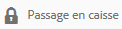

# Archivage et extraction de fichiers dans AEM Assets {#check-in-and-check-out-files-in-assets}

Adobe Experience Manager (AEM) Assets vous permet d’extraire des fichiers en vue de les modifier et de les réarchiver une fois les modifications effectuées. Après avoir extrait un fichier, vous seul pouvez le modifier, l’annoter, le publier, le déplacer ou le supprimer. Le fait d’extraire une ressource entraîne son verrouillage. D’autres utilisateurs ne peuvent pas effectuer l’une de ces opérations sur la ressource tant que vous ne la réarchivez pas dans AEM Assets. Toutefois, ils peuvent modifier les métadonnées de la ressource verrouillée.

Pour pouvoir extraire ou archiver des ressources, vous devez disposer d&#39;un accès en écriture sur celles-ci.

Cette caractéristique permet d’empêcher les autres utilisateurs d’écraser les modifications apportées par un auteur lorsque plusieurs utilisateurs issus de plusieurs équipes collaborent à la modification des workflows.

## Fichiers d&#39;extraction {#checking-out-assets}

1. Dans l’interface utilisateur Ressources, sélectionnez la ressource que vous souhaitez extraire. Vous pouvez également sélectionner plusieurs fichiers à extraire.

   

1. Dans la barre d’outils, cliquez/appuyez sur l’icône **[!UICONTROL Extraction]**.

   

   Notez que l’icône **[!UICONTROL Extraction]** se transforme en icône **[!UICONTROL Archivage]** avec le verrou ouvert.

   

   Pour vérifier si d’autres utilisateurs peuvent modifier la ressource que vous avez extraite, connectez-vous comme un utilisateur différent. Une icône de verrouillage s’affiche sur la miniature de la ressource que vous avez extraite.

   

   Sélectionnez la ressource. Notez que la barre d’outils n’affiche aucune option permettant de modifier, d’annoter, de publier ou de supprimer la ressource.

   

   Vous pouvez, toutefois, cliquer/appuyer sur l’icône **[!UICONTROL Afficher les propriétés]** pour modifier les métadonnées de la ressource verrouillée.

1. Cliquez/appuyez sur l’icône Modifier pour ouvrir la ressource en mode d’édition.

   

1. Modifiez la ressource et enregistrez les modifications. Par exemple, recadrez l’image et enregistrez-la.

   

   Vous pouvez également choisir d’annoter ou de publier la ressource.

1. Sélectionnez la ressource modifiée dans l’interface utilisateur d’Assets, puis cliquez/appuyez sur l’icône **[!UICONTROL Archiver]** dans la barre d’outils.

   

   La ressource modifiée est archivée dans AEM Assets et peut être modifiée par les autres utilisateurs.

## Enregistrement forcé {#forced-check-in}

Les administrateurs peuvent archiver des fichiers extraits par d’autres utilisateurs.

1. Connectez-vous à AEM Assets en tant qu’administrateur.
1. Dans l’interface utilisateur d’Assets, sélectionnez une ou plusieurs ressources extraites par d’autres utilisateurs.

   

1. Dans la barre d’outils, cliquez/appuyez sur l’icône **[!UICONTROL Libérer le verrou]**. La ressource est à nouveau archivée et disponible pour modification pour d’autres utilisateurs.

   