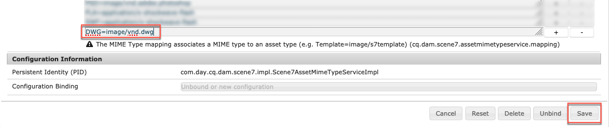
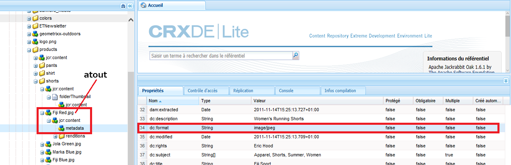

# Configuration de Dynamic Media – mode Scene7 {#configuring-dynamic-media-scene-mode}

Si vous utilisez Adobe Experience Manager configuré pour différents environnements, tels que le développement, l’évaluation et la production en direct, vous devez configurer des Cloud Services Dynamic Media pour chaque environnement.

## Schéma d’architecture de Dynamic Media – mode Scene7 {#architecture-diagram-of-dynamic-media-scene-mode}

Le schéma d’architecture suivant décrit le fonctionnement de Dynamic Media – mode Scene7.

Avec la nouvelle architecture, Experience Manager est responsable des ressources Principales et des synchronisations avec Dynamic Media pour le traitement et la publication des ressources :

1. Lorsque la ressource Principale est téléchargée vers Experience Manager, elle est répliquée vers Dynamic Media. À ce stade, Dynamic Media gère l’intégralité du traitement des ressources et de la génération du rendu, comme le codage vidéo et les variantes dynamiques d’une image.
1. Une fois les rendus générés, Experience Manager peut accéder en toute sécurité aux rendus Dynamic Media distants et les prévisualiser (aucune donnée binaire n’est renvoyée à l’instance de Experience Manager).
1. Une fois que le contenu est prêt à être publié et approuvé, il déclenche l’envoi du contenu par le service Dynamic Media vers les serveurs de diffusion et la mise en cache du contenu sur le réseau de diffusion de contenu.


## Activation de Dynamic Media en mode Scene7 {#enabling-dynamic-media-in-scene-mode}

[Par défaut, ce module complémentaire est désactivé. ](https://www.adobe.com/marketing-cloud/enterprise-content-management/dynamic-media.html) Pour tirer parti des fonctionnalités de Dynamic Media, vous devez l’activer.

>[!WARNING]
>
>Dynamic Media : le mode Scene7 est pour la variable *Instance de création de Experience Manager uniquement*. Par conséquent, configurez `runmode=dynamicmedia_scene7`sur l’instance d’auteur du Experience Manager, *not* l’instance de publication du Experience Manager.

Pour activer Dynamic Media, vous devez démarrer Experience Manager à l’aide du `dynamicmedia_scene7` le mode d’exécution à partir de la ligne de commande en saisissant ce qui suit dans une fenêtre de terminal (l’exemple de port utilisé est 4502) :

```shell
java -Xms4096m -Xmx4096m -Doak.queryLimitInMemory=500000 -Doak.queryLimitReads=500000 -jar cq-quickstart-6.4.0.jar -gui -r author,dynamicmedia_scene7 -p 4502
```

## (Facultatif) Migration des paramètres prédéfinis et des configurations Dynamic Media de 6.3 à 6.4 sans interruption {#optional-migrating-dynamic-media-presets-and-configurations-from-to-zero-downtime}

Si vous effectuez une mise à niveau de Experience Manager Dynamic Media de la version 6.3 vers la version 6.4 (qui inclut la possibilité de réaliser des déploiements sans interruption), exécutez la commande curl suivante pour migrer tous vos paramètres prédéfinis et configurations à partir de `/etc` to `/conf` en CRXDE Lite.

>[!NOTE]
>
>Si vous exécutez votre instance de Experience Manager en mode de compatibilité (c’est-à-dire si le package de compatibilité est installé), vous n’avez pas besoin d’exécuter ces commandes.

Pour migrer vos paramètres prédéfinis et configurations personnalisés depuis `/etc` to `/conf`, exécutez la commande curl Linux® suivante :

`curl -u admin:admin http://localhost:4502/libs/settings/dam/dm/presets.migratedmcontent.json`

Pour toutes les mises à niveau, avec ou sans le module de compatibilité, vous pouvez copier les paramètres prédéfinis de la visionneuse prête à l’emploi en exécutant la commande suivante :

`curl -u admin:admin http://localhost:4502/libs/settings/dam/dm/presets/viewer.pushviewerpresets`

## (Facultatif) Installation du Feature Pack 18912 pour la migration de ressources en masse {#installing-feature-pack}

Le Feature Pack 18912 vous permet soit d’ingérer des ressources par FTP en masse, soit de migrer des ressources du mode Dynamic Media - Hybride ou de Dynamic Media Classic vers le mode Dynamic Media - Scene7 sur Experience Manager. Il est disponible à partir de Adobe Professional Services.

Voir [Installation du Feature Pack 18912 pour la migration de ressources en masse](bulk-ingest-migrate.md) pour plus d’informations.

## Configuration de Dynamic Media Cloud Services {#configuring-dynamic-media-cloud-services}

Modifiez le mot de passe avant de configurer les Cloud Services Dynamic Media. Une fois que vous avez reçu l’e-mail de mise en service avec les informations d’identification Dynamic Media, vous devez [connexion](https://experienceleague.adobe.com/docs/dynamic-media-classic/using/intro/dynamic-media-classic-desktop-app.html#system-requirements-dmc-app) à l’application de bureau Dynamic Media Classic pour modifier votre mot de passe. Le mot de passe fourni dans l’e-mail de mise en service est généré par le système et il est attribué uniquement de manière temporaire. Il est important que vous mettiez à jour le mot de passe afin que Dynamic Media Cloud Service soit configuré avec les informations d’identification correctes.

>[!NOTE]
>
>Par défaut, le chemin de configuration pour les Cloud Services est : `/content/dam`. Tout autre chemin de configuration n’est pas pris en charge par le mode Dynamic Media - Scene7.

**Pour configurer les Cloud Services Dynamic Media :**

1. Dans votre instance d’auteur de Experience Manager, appuyez sur le logo du Experience Manager pour accéder à la console de navigation globale, puis appuyez sur l’icône Outils, puis sur **[!UICONTROL Cloud Services]** > **[!UICONTROL Configuration Dynamic Media]**.
1. Sur la page du navigateur de configuration Dynamic Media, dans le volet de gauche, appuyez sur **[!UICONTROL global]** et appuyez sur **[!UICONTROL Créer]**. N’appuyez ou ne sélectionnez pas l’icône de dossier située à gauche de [!UICONTROL global].
1. Sur le [!UICONTROL Création d’une configuration Dynamic Media] , saisissez un titre, l’adresse électronique du compte Dynamic Media et un mot de passe. Sélectionnez votre région. Ces informations vous sont fournies par Adobe dans votre e-mail de mise en service. Si vous n’avez pas reçu le courrier électronique, contactez le service clientèle d’Adobe.

   Appuyer **[!UICONTROL Connexion à Dynamic Media]**.

   >[!NOTE]
   >
   >Une fois que vous avez reçu l’e-mail de mise en service avec les informations d’identification Dynamic Media, ouvrez le [application de bureau Dynamic Media Classic](https://experienceleague.adobe.com/docs/dynamic-media-classic/using/getting-started/signing-out.html?lang=fr#getting-started), puis connectez-vous à votre compte d’entreprise pour modifier votre mot de passe. Le mot de passe fourni dans l’e-mail de mise en service est généré par le système et il est attribué uniquement de manière temporaire. Il est important que vous mettiez à jour le mot de passe afin que le Cloud Service Dynamic Media soit configuré avec les informations d’identification correctes.

1. Si la connexion est établie, vous pouvez également définir les éléments suivants :

   * **[!UICONTROL Société]** : nom du compte Dynamic Media.

      >[!IMPORTANT]
      >
      >Une seule configuration Dynamic Media en Cloud Services est prise en charge sur une instance de Experience Manager ; n’ajoutez pas plusieurs configurations. Plusieurs configurations Dynamic Media sur une instance de Experience Manager sont *not* pris en charge ou recommandé par Adobe.<!-- CQDOC-19579 and CQDOC-19612 -->
   * **[!UICONTROL Chemin du dossier racine de l’entreprise]** : chemin d’accès au dossier racine de votre entreprise.
   * **[!UICONTROL Publication des ressources]** : l’option **[!UICONTROL Immédiatement]** signifie que lorsque les ressources sont téléchargées, le système les assimile et fournit instantanément l’URL/le code intégré. Aucune intervention n’est nécessaire de la part de l’utilisateur pour publier des ressources. L’option **[!UICONTROL Lors de l’activation]** signifie que vous devez publier explicitement la ressource avant qu’un lien URL/code intégré ne soit fourni.
   * **[!UICONTROL Serveur d’aperçu sécurisé]** : permet de définir le chemin URL de votre serveur d’aperçu des rendus sécurisé. En d’autres termes, une fois les rendus générés, Experience Manager peut accéder en toute sécurité aux rendus Dynamic Media distants et les prévisualiser (aucune donnée binaire n’est renvoyée à l’instance de Experience Manager).

      À moins que vous ayez pris des dispositions spéciales pour utiliser le serveur de votre propre entreprise ou un serveur spécial, Adobe vous recommande d’utiliser le paramètre par défaut.
   >[!NOTE]
   >
   >Le contrôle de version n’est pas pris en charge dans DMS7. En outre, l’activation différée ne s’applique que si l’option **[!UICONTROL Publier des ressources]** dans la page de configuration de Dynamic Media est définie sur **[!UICONTROL Dès l’activation]**, puis uniquement jusqu’à la première activation de la ressource.
   >
   >Une fois qu’une ressource est activée, toutes les mises à jour sont immédiatement publiées en direct sur la livraison S7.

   

1. Appuyez sur **[!UICONTROL Enregistrer]**.
1. Pour prévisualiser en toute sécurité le contenu Dynamic Media avant qu’il ne soit publié, vous devez &quot;placer sur la liste autorisée&quot; l’instance d’auteur du Experience Manager pour vous connecter à Dynamic Media :

   * Ouvrez [l’application de bureau Dynamic Media Classic](https://experienceleague.adobe.com/docs/dynamic-media-classic/using/getting-started/signing-out.html#getting-started) puis connectez-vous à votre compte. Vos informations d’identification et de connexion vous ont été communiquées par Adobe au moment de la configuration. Si vous ne disposez pas de ces informations, contactez l’assistance technique.
   * Dans la barre de navigation située en haut à droite de la page, appuyez sur **[!UICONTROL Configuration]** > **[!UICONTROL Configuration de l’application]** > **[!UICONTROL Configuration de la publication]** > **[!UICONTROL Serveur d’images]**.
   * Sur la page Publication sur hébergeur d’images, dans la liste déroulante Contexte de publication, sélectionnez **[!UICONTROL Test de l’hébergeur d’images]**.
   * Pour l’option Filtre d’adresse client, appuyez sur **[!UICONTROL Ajouter]**.
   * Pour activer l’adresse, cochez la case. Saisissez l’adresse IP de l’instance d’auteur du Experience Manager (et non l’adresse IP du Dispatcher).
   * Appuyez sur **[!UICONTROL Enregistrer]**.

Vous avez à présent terminé la configuration de base ; vous êtes prêt à utiliser le mode Scene7 de Dynamic Media.

Si vous souhaitez personnaliser davantage votre configuration, vous pouvez éventuellement effectuer l’une des tâches de la rubrique [(Facultatif) Configuration de paramètres avancés dans le mode Scene7 de Dynamic Media](#optional-configuring-advanced-settings-in-dynamic-media-scene-mode).

## (Facultatif) Configuration de paramètres avancés dans le mode Scene7 de Dynamic Media {#optional-configuring-advanced-settings-in-dynamic-media-scene-mode}

Si vous souhaitez personnaliser davantage l’installation et la configuration du mode Scene7 de Dynamic Media, ou en optimiser les performances, vous pouvez effectuer une ou plusieurs des tâches facultatives suivantes :

* [(Facultatif) Installation et configuration des paramètres du mode Scene7 de Dynamic Media](#optional-setup-and-configuration-of-dynamic-media-scene-mode-settings-p)

* [(Facultatif) Optimisation des performances du mode Scene7 de Dynamic Media](#optional-tuning-the-performance-of-dynamic-media-scene-mode)
* [(Facultatif) Filtrage des ressources en vue de la réplication](#optional-filtering-assets-for-replication)

### (Facultatif) Installation et configuration des paramètres du mode Scene7 de Dynamic Media</p> {#optional-setup-and-configuration-of-dynamic-media-scene-mode-settings-p}

Lorsque vous êtes dans **dynamicmedia_scene7** en mode d’exécution, vous utilisez l’interface utilisateur de Dynamic Media Classic pour modifier vos paramètres Dynamic Media.

Certaines des tâches ci-dessus exigent que vous ouvriez l’[application de bureau Dynamic Media Classic](https://experienceleague.adobe.com/docs/dynamic-media-classic/using/getting-started/signing-out.html#getting-started) puis que vous vous connectiez à votre compte.

Les tâches de configuration et de configuration sont les suivantes :

* [Configuration de la publication pour Image Server](#publishing-setup-for-image-server)
* [Configuration des paramètres généraux de l’application](#configuring-application-general-settings)
* [Configuration de la gestion des couleurs](#configuring-color-management)
* [Modification des types MIME pour les formats pris en charge](#editing-mime-types-for-supported-formats)
* [Ajout de types MIME pour les formats non pris en charge](#adding-mime-types-for-unsupported-formats)
* [Création de paramètres prédéfinis d’ensemble par lot pour générer automatiquement des visionneuses d’images et des visionneuses à 360°](#creating-batch-set-presets-to-auto-generate-image-sets-and-spin-sets)

#### Configuration de la publication pour Image Server {#publishing-setup-for-image-server}

Les paramètres de configuration de la publication déterminent comment les ressources sont diffusées par défaut à partir de Dynamic Media. Si aucun paramètre n’est spécifié, Dynamic Media diffuse une ressource selon les paramètres par défaut définis dans Configuration de la publication. Par exemple, une requête de diffusion d’image qui ne comporte pas d’attribut de résolution produit une image avec le paramètre de résolution d’objet par défaut.

Pour configurer la configuration de la publication : dans Dynamic Media Classic, appuyez sur **[!UICONTROL Configuration]** > **[!UICONTROL Configuration de l’application]** > **[!UICONTROL Configuration de la publication]** > **[!UICONTROL Serveur d’images]**.

L’écran Image Server permet de définir les paramètres par défaut pour la diffusion des images. Consultez l’interface utilisateur pour une description de chaque paramètre.

* **[!UICONTROL Attributs de requête]** : ces paramètres imposent des limites aux images qui peuvent être diffusées à partir du serveur.
* **[!UICONTROL Attributs de requête par défaut]** : ces paramètres concernent l’aspect par défaut des images.
* **[!UICONTROL Attributs de miniature courants]** : ces paramètres concernent l’aspect par défaut des images miniatures.
* **[!UICONTROL Valeurs par défaut des champs de catalogue]** : ces paramètres concernent la résolution et le type de miniature par défaut des images.
* **[!UICONTROL Attributs de gestion des couleurs]** : ces paramètres déterminent les profils de couleurs ICC utilisés.
* **[!UICONTROL Attributs de compatibilité]** : ce paramètre permet aux paragraphes de début et de fin des calques de texte d’être traités tels qu’ils l’étaient dans la version 3.6, ce qui les rend rétrocompatibles.
* **[!UICONTROL Aide à la localisation]** : ces paramètres vous permettent de gérer divers attributs de paramètres régionaux. Ils vous permettent également de définir une chaîne de mappage de paramètres régionaux afin de définir les langues à prendre en charge pour les différentes info-bulles dans les visionneuses. Pour plus d’informations sur la configuration de l’assistance à la localisation, voir [Remarques importantes concernant la mise en oeuvre de la prise en charge de la localisation](https://experienceleague.adobe.com/docs/dynamic-media-classic/using/setup/publish-setup.html#image-server).

#### Configuration des paramètres généraux de l’application {#configuring-application-general-settings}

Pour ouvrir la [!UICONTROL Paramètres généraux de l’application] page, dans la barre de navigation globale de Dynamic Media Classic, appuyez sur **[!UICONTROL Configuration]** > **[!UICONTROL Configuration de l’application]** > **[!UICONTROL Paramètres généraux]**.

**[!UICONTROL Serveurs]** : au moment de la mise en service du compte, Dynamic Media fournit automatiquement les serveurs attribués à votre entreprise. Ces serveurs sont utilisés pour construire des chaînes d’URL pour votre site Web et vos applications. Ces appels d’URL sont spécifiques à votre compte. Ne modifiez aucun nom de serveur, sauf si le support Experience Manager vous a demandé de le faire.

**[!UICONTROL Écraser les images]** : Dynamic Media ne permet pas que deux fichiers portent le même nom. L’identifiant de l’URL de chaque élément (le nom de fichier sans l’extension) doit être unique. Ces options spécifient la manière dont les ressources de remplacement sont chargées : elles peuvent remplacer l’original ou devenir un doublon. Les ressources en double sont renommées en ajoutant « -1 » (par exemple, chaise.tif devient chaise-1.tif). Ces options affectent les ressources chargées dans un dossier autre que celui d’origine ou les ressources dont l’extension est différente de celle du fichier d’origine (telle que JPG, TIF ou PNG).

* **[!UICONTROL Écraser dans dossier actuel, même nom/même extension de fichier de base]** : cette option est la règle la plus stricte pour le remplacement. Elle implique que vous chargiez l’image de remplacement dans le même dossier que l’original, et qu’elle ait la même extension que le fichier d’origine. Si ces conditions ne sont pas remplies, un doublon est créé.

>[!NOTE]
>
>Pour maintenir la cohérence avec Experience Manager, sélectionnez **[!UICONTROL Remplacer dans le dossier actuel, même nom/même extension de fichier de base]**.

* **[!UICONTROL Remplacer dans un dossier, même nom/même extension de fichier de base]** - Nécessite que l’image de remplacement ait la même extension que l’image d’origine (par exemple, `chair.jpg` remplace `chair.jpg` et non `chair.tif`). Vous pouvez néanmoins télécharger l’image de remplacement dans un dossier différent de celui de l’image d’origine. L’image mise à jour se trouve dans le nouveau dossier ; le fichier d’origine n’est plus disponible à l’emplacement d’origine..
* **[!UICONTROL Écraser dans un dossier, même nom de fichier, extension indépendante]** : cette option est la règle de remplacement la plus inclusive. Elle vous permet de charger une image de remplacement dans un dossier autre que celui de l’image d’origine, de charger un fichier avec une extension de nom de fichier différente et de remplacer le fichier original. Si le fichier d’origine se trouve dans un dossier différent, l’image de remplacement est enregistrée dans le nouveau dossier où elle a été chargée.

**[!UICONTROL Profils de couleurs par défaut]** : voir [Configuration de la gestion des couleurs](#configuring-color-management) pour plus d’informations.

>[!NOTE]
>
>Par défaut, le système affiche 15 rendus lorsque vous sélectionnez **[!UICONTROL Rendus]** et 15 paramètres prédéfinis de la visionneuse lorsque vous sélectionnez **[!UICONTROL Visionneuses]** dans la vue détaillée de la ressource. Vous pouvez augmenter cette limite. Voir [Augmentation du nombre de paramètres d’image prédéfinis affichés](managing-image-presets.md#increasing-or-decreasing-the-number-of-image-presets-that-display) ou [Augmentation du nombre de paramètres prédéfinis de visionneuse qui s’affichent](managing-viewer-presets.md#increasing-the-number-of-viewer-presets-that-display).

#### Configuration de la gestion des couleurs {#configuring-color-management}

La gestion des couleurs de Dynamic Media vous permet de corriger les couleurs des ressources. Avec la correction des couleurs, les ressources intégrées conservent leur espace colorimétrique (RVB, CMJN, gris) et leur profil de couleur intégré. Lorsque vous demandez un rendu dynamique, la couleur de l’image est corrigée dans l’espace colorimétrique cible en utilisant une sortie CMJN, RVB ou grise. Reportez-vous à la section [Configuration des paramètres d’image prédéfinis](managing-image-presets.md).

**Pour configurer les propriétés de couleur par défaut afin d’activer la correction des couleurs lorsque vous demandez des images :**

1. Ouvrez l’[application de bureau Dynamic Media Classic](https://experienceleague.adobe.com/docs/dynamic-media-classic/using/getting-started/signing-out.html#getting-started) puis connectez-vous à votre compte à l’aide des informations d’identification fournies lors de la mise en service. Accédez à **[!UICONTROL Configuration]** > **[!UICONTROL Configuration de l’application]**.
1. Développez la zone **[!UICONTROL Configuration de la publication]** et sélectionnez **[!UICONTROL Image Server]**. Définissez **[!UICONTROL Contexte de publication]** sur **[!UICONTROL Imager Server]** lors de la définition des paramètres par défaut des instances de publication.
1. Faites défiler l’écran jusqu’à la propriété que vous devez modifier. Par exemple, une propriété de la propriété **[!UICONTROL Attributs de gestion des couleurs]** zone.

   Vous pouvez définir les propriétés de correction des couleurs suivantes :

   * [!UICONTROL Espace colorimétrique CMJN par défaut] : nom du profil de couleurs CMJN par défaut.
   * [!UICONTROL Espace colorimétrique de niveaux de gris par défaut] : nom du profil de niveaux de gris par défaut.
   * [!UICONTROL Espace colorimétrique RVB par défaut] : nom du profil de couleurs RVB par défaut.
   * [!UICONTROL Intention de rendu de conversion de couleurs] : indique l’intention de rendu. Les valeurs acceptables sont les suivantes : `perceptual`, `relative` `colometric`, `saturation`, et `absolute colometric`. Adobe recommande d’utiliser `relative`colorimétrie   comme valeur par défaut.

1. Appuyez sur **[!UICONTROL Enregistrer]**.

Par exemple, vous pouvez définir la variable **[!UICONTROL Espace colorimétrique par défaut du RGB]** to `sRGB`, et **[!UICONTROL Espace colorimétrique CMJN par défaut]** to `WebCoated`.

Cela aura les effets suivants :

* Active la correction des couleurs pour les images RVB et CMJN.
* Les images de RGB qui n’ont pas de profil colorimétrique sont censées se trouver dans la variable `sRGB` espace colorimétrique.
* Les images CMJN qui n’ont pas de profil colorimétrique sont considérées comme se trouvant dans l’espace colorimétrique `WebCoated`.
* Les rendus dynamiques qui renvoient une sortie de RGB la renvoie dans la variable `sRGB` espace colorimétrique.
* Rendus dynamiques qui renvoient une sortie CMJN, la renvoie dans la variable `WebCoated` espace colorimétrique.

#### Modification des types MIME pour les formats pris en charge {#editing-mime-types-for-supported-formats}

Vous pouvez définir les types de ressources traités par Dynamic Media et personnaliser les paramètres de traitement des ressources avancé. Vous pouvez, par exemple, spécifier les paramètres de traitement des ressources de façon à ce qu’ils effectuent les opérations suivantes :

* Conversion d’un PDF Adobe en ressource de catalogue électronique.
* Conversion d’un document Adobe Photoshop (.psd) en ressource de modèle de bannière afin de permettre la personnalisation.
* Pixellisation d’un fichier Adobe Illustrator (.ai) ou d’un fichier PostScript® encapsulé Adobe Photoshop (.eps).
* Des [profils vidéo](/help/assets/video-profiles.md) et des [profils d’images](/help/assets/image-profiles.md) peuvent être utilisés pour définir le traitement des vidéos et des images.

Voir la section [Chargement des ressources](managing-assets-touch-ui.md#uploading-assets).

**Pour modifier les types MIME pour les formats pris en charge :**

1. Dans Experience Manager, appuyez sur le logo du Experience Manager pour accéder à la console de navigation globale, puis appuyez sur la **[!UICONTROL Outils]** (marteau) et accédez à **[!UICONTROL Général]** > **[!UICONTROL CRXDE Lite]**.
1. Dans le rail de gauche, accédez à ce qui suit :

   `/conf/global/settings/cloudconfigs/dmscene7/jcr:content/mimeTypes`

   

1. Sous , `mimeTypes` , sélectionnez un type MIME.
1. Sur le côté droit de la page CRXDE Lite, dans la partie inférieure :

   * Cliquez deux fois sur le champ **[!UICONTROL enabled]**. Par défaut, tous les types MIME des ressources sont activés (définis sur **[!UICONTROL true]**), ce qui signifie que les ressources sont synchronisées avec Dynamic Media pour traitement. Si vous voulez exclure ce type MIME de ressource du traitement, définissez ce paramètre sur **[!UICONTROL false]**.
   * Cliquez deux fois sur **[!UICONTROL jobParam]** pour ouvrir le champ de texte associé. Voir [Types Mime pris en charge](assets-formats.md#supported-mime-types) pour une liste de valeurs de paramètre de traitement autorisées que vous pouvez utiliser pour un type MIME donné.

1. Utilisez l’une des méthodes suivantes :

   * Répétez les étapes 3 à 4 pour modifier d’autres types MIME.
   * Dans la barre de menus de la page du CRXDE Lite, appuyez sur **[!UICONTROL Enregistrer tout]**.

1. Dans le coin supérieur gauche de la page, appuyez sur **[!UICONTROL CRXDE Lite]** pour revenir à Experience Manager.

#### Ajout de types MIME personnalisés pour les formats non pris en charge {#adding-custom-mime-types-for-unsupported-formats}

Vous pouvez ajouter des types de MIME personnalisés pour les formats non pris en charge dans Experience Manager Assets. Pour vous assurer que tout nouveau noeud ajouté dans CRXDE Lite n’est pas supprimé par Experience Manager, déplacez le type MIME avant **[!UICONTROL image_]** et sa valeur activée est définie sur **[!UICONTROL false]**.

**Pour ajouter des types MIME personnalisés pour des formats non pris en charge:**

1. Dans Experience Manager, cliquez sur **[!UICONTROL Outils]** > **[!UICONTROL Opérations]** > **[!UICONTROL Console web]**.

   

1. Un nouvel onglet du navigateur s’ouvre sur la page **[!UICONTROL Adobe Experience Manager Web Console Configuration]** (Configuration de la console web Adobe Experience Manager).

   

1. Sur la page, faites défiler l’écran jusqu’au nom **[!UICONTROL Service de type MIME de ressource Scene7 Adobe CQ]**. À droite du nom, appuyez sur **[!UICONTROL Modifier les valeurs de configuration]** (icône en forme de crayon).

   

1. Sur le **[!UICONTROL Service de type MIME de ressource Scene7 Adobe CQ]** page, cliquez sur l’icône représentant un signe plus `+`. Dans le tableau, l’emplacement du signe + sur lequel vous cliquez pour ajouter le nouveau type MIME n’est pas important.

   

1. Entrez `DWG=image/vnd.dwg` dans le champ de texte vide que vous venez d’ajouter.

   L&#39;exemple `DWG=image/vnd.dwg` est destiné à des fins de démonstration uniquement. Le type MIME que vous ajoutez ici peut être tout autre format non pris en charge.

   

1. Dans le coin inférieur droit de la page, cliquez sur **[!UICONTROL Enregistrer]**.

   À ce stade, vous pouvez fermer l’onglet du navigateur dans lequel la page de configuration de la console web d’Adobe Experience Manager est ouverte.

1. Revenez à l’onglet du navigateur qui contient votre console de Experience Manager ouverte.

1. Dans Experience Manager, cliquez sur **[!UICONTROL Outils]** > **[!UICONTROL Général]** > **[!UICONTROL CRXDE Lite]**.

   

1. Dans le rail de gauche, accédez à ce qui suit :

   `conf/global/settings/cloudconfigs/dmscene7/jcr:content/mimeTypes`

1. Faites glisser le type MIME `image_vnd.dwg` et déposez-le directement au-dessus `image_` dans l&#39;arbre.

   

1. Avec le type MIME `image_vnd.dwg` sélectionné toujours dans l’arborescence, dans la variable **[!UICONTROL Propriétés]** , dans le **[!UICONTROL enabled]** , sous **[!UICONTROL Valeur]** en-tête de colonne, double-cliquez sur la valeur pour ouvrir la variable **[!UICONTROL Valeur]** liste déroulante.

1. Tapez `false` dans le champ (ou sélectionnez `false` dans la liste déroulante).

   

1. Dans le coin supérieur gauche de la page CRXDE Lite, cliquez sur **[!UICONTROL Enregistrer tout]**.

#### Création de paramètres prédéfinis d’ensemble par lot pour générer automatiquement des visionneuses d’images et des visionneuses à 360° {#creating-batch-set-presets-to-auto-generate-image-sets-and-spin-sets}

Utilisez les paramètres prédéfinis d’ensemble par lot pour automatiser la création de visionneuses d’images ou de jeux de rotation lorsque des ressources sont téléchargées sur Dynamic Media.

Tout d’abord, définissez la convention d’affectation des noms pour la manière dont les ressources sont regroupées dans un ensemble. Vous pouvez ensuite créer un paramètre prédéfini d’ensemble par lot, qui est un ensemble d’instructions indépendant à nom unique, déterminant la création de la visionneuse à l’aide des images correspondant aux conventions de nommage définies dans la recette de paramètre prédéfini.

Lorsque vous téléchargez des fichiers, Dynamic Media crée automatiquement une visionneuse avec tous les fichiers qui correspondent à la convention de nommage définie dans les paramètres prédéfinis actifs.

**Configuration du nommage par défaut**

Créez une convention de nommage par défaut qui est utilisée dans n’importe quelle recette de paramètre prédéfini d’ensemble par lot. La convention d’affectation de nom par défaut sélectionnée dans la définition de paramètre prédéfini d’ensemble par lot est probablement tout ce dont votre entreprise a besoin pour générer des ensembles par lot. Un paramètre prédéfini d’ensemble par lot est créé pour utiliser la convention de nommage par défaut que vous définissez. Vous pouvez créer autant de paramètres prédéfinis d’ensemble par lot que nécessaire avec des conventions de nommage différentes et personnalisées pour une visionneuse de contenu spécifique au cas où il existe une exception dans le nommage par défaut défini par l’entreprise.

Bien que la configuration d’une convention d’affectation de nom par défaut ne soit pas nécessaire pour utiliser la fonctionnalité de paramètres prédéfinis d’ensemble par lot, vous pouvez l’utiliser pour définir autant d’éléments de votre convention d’affectation de nom que vous souhaitez regrouper dans une visionneuse. Cela permet de rationaliser la création d’un ensemble de lots.

Vous pouvez également utiliser **[!UICONTROL Afficher le code]** sans champ de formulaire disponible. Dans cet affichage, vous créez vos définitions de convention d’affectation de nom entièrement à l’aide d’expressions régulières.

Deux éléments sont disponibles pour la définition, **[!UICONTROL Correspondance]** et **[!UICONTROL Nom de base]**. Ces champs vous permettent de définir tous les éléments de la convention de nommage et d’identifier la partie de la convention utilisée pour nommer la visionneuse dans laquelle ils se trouvent. La convention de dénomination individuelle d’une entreprise peut utiliser une ou plusieurs lignes de définition pour chacun de ces éléments. Utilisez autant de lignes que vous le souhaitez pour votre définition unique et regroupez-les en éléments distincts. Par exemple, image principale, élément de couleur, élément d’affichage secondaire et élément d’échantillon.

**Pour configurer l’affectation de nom par défaut:**

1. Ouvrez [l’application de bureau Dynamic Media Classic](https://experienceleague.adobe.com/docs/dynamic-media-classic/using/getting-started/signing-out.html#getting-started) puis connectez-vous à votre compte.

   Vos informations d’identification et de connexion vous ont été communiquées par Adobe au moment de la configuration. Si vous ne disposez pas de ces informations, contactez l’assistance technique.

1. Dans la barre de navigation située en haut de la page, appuyez sur **[!UICONTROL Configuration]** > **[!UICONTROL Configuration de l’application]** > **[!UICONTROL Paramètres prédéfinis d’ensemble par lot]** > **[!UICONTROL Dénomination par défaut]**.
1. Sélectionnez **[!UICONTROL Afficher le formulaire]** ou **[!UICONTROL Afficher le code]** pour indiquer le mode de visualisation et de saisie des informations sur chaque élément.

   Vous pouvez cocher la case **[!UICONTROL Afficher le code]** pour afficher la valeur d’expression régulière qui se crée à côté de vos sélections dans le formulaire. Vous pouvez saisir ou modifier ces valeurs pour définir les éléments de la convention de nommage si l’affichage sous forme de formulaire vous limite pour quelque raison que ce soit. Si vos valeurs ne peuvent pas être analysées dans l’affichage de formulaire, les champs de formulaire seront inactifs.

   >[!NOTE]
   >
   >Les champs de formulaire désactivés ne permettent pas de confirmer que vos expressions régulières sont correctes. Vous voyez les résultats de l’expression régulière que vous créez pour chaque élément après la ligne Résultat. L’expression régulière est visible en entier en bas de la page.

1. Développez chaque élément selon vos besoins et indiquez les conventions de nommage que vous souhaitez utiliser.
1. Si nécessaire, effectuez l’une des opérations suivantes :

   * Appuyez sur **[!UICONTROL Ajouter]** afin d’ajouter une autre convention d’affectation de nom pour un élément.
   * Appuyez sur **[!UICONTROL Supprimer]** afin de supprimer une convention d’affectation de nom pour un élément.

1. Utilisez l’une des méthodes suivantes :

   * Appuyez sur **[!UICONTROL Enregistrer sous]** et saisissez un nom pour le paramètre prédéfini.
   * Appuyez sur **[!UICONTROL Enregistrer]** si vous modifiez un paramètre prédéfini existant.

**Création d’un paramètre prédéfini d’ensemble par lot**

Dynamic Media utilise les paramètres prédéfinis d’ensemble par lot pour organiser les ressources en visionneuses d’images (images de remplacement, options de couleur, rotation à 360°) pour l’affichage dans des visionneuses. Les paramètres prédéfinis d’ensemble par lot s’exécutent automatiquement avec les processus de transfert des ressources dans Dynamic Media.

Vous pouvez créer, modifier et gérer vos paramètres prédéfinis d’ensemble par lot. Il existe deux formes de définitions de paramètres prédéfinis d’ensemble par lot : l’une pour une convention d’affectation de nom par défaut que vous configurez, l’autre pour les conventions d’affectation de nom personnalisées que vous créez à la volée.

Vous pouvez utiliser la méthode de champ de formulaire pour définir un paramètre prédéfini d’ensemble par lot ou la méthode de code, qui vous permet d’utiliser des expressions régulières. Comme dans l’attribution d’un nom par défaut, vous pouvez choisir [!UICONTROL Afficher le code] en même temps que vous définissez dans la variable [!UICONTROL Mode Formulaire] et utilisez des expressions régulières pour créer vos définitions. Vous pouvez également désélectionner l’une des deux vues pour utiliser uniquement l’une ou l’autre.

**Pour créer un paramètre prédéfini d’ensemble par lot:**

1. Ouvrez [l’application de bureau Dynamic Media Classic](https://experienceleague.adobe.com/docs/dynamic-media-classic/using/getting-started/signing-out.html#getting-started) puis connectez-vous à votre compte.

   Vos informations d’identification et de connexion vous ont été communiquées par Adobe au moment de la configuration. Si vous ne disposez pas de ces informations, contactez l’assistance technique.

1. Dans la barre de navigation située en haut de la page, appuyez sur **[!UICONTROL Configuration]** > **[!UICONTROL Configuration de l’application]** > **[!UICONTROL Paramètres prédéfinis d’ensemble par lot]** > **[!UICONTROL Paramètre prédéfini d’ensemble par lot]**.

   [!UICONTROL Afficher le formulaire], comme défini dans le coin supérieur droit du [!UICONTROL Détails] est la vue par défaut.

1. Dans le panneau Liste des paramètres prédéfinis, appuyez sur **[!UICONTROL Ajouter]** pour activer les champs de définition dans le **[!UICONTROL Détails]** du panneau de droite de l’écran.
1. Dans le **[!UICONTROL Détails]** dans le panneau **[!UICONTROL Nom du paramètre prédéfini]** , saisissez le nom du paramètre prédéfini.
1. Dans le **[!UICONTROL Type d’ensemble par lot]** , sélectionnez un type de paramètre prédéfini.
1. Utilisez l’une des méthodes suivantes :

   * Si vous utilisez une convention d’affectation de nom par défaut que vous avez précédemment configurée sous **[!UICONTROL Configuration de l’application]** > **[!UICONTROL Paramètres prédéfinis d’ensemble par lot]** > **[!UICONTROL Dénomination par défaut]**, développer **[!UICONTROL Conventions de dénomination des ressources]**, puis dans le **[!UICONTROL Nommage de fichier]** liste déroulante, appuyez sur **[!UICONTROL Par défaut]**.
   * Pour définir une nouvelle convention d’affectation de nom lors de la configuration du paramètre prédéfini, **[!UICONTROL Conventions de dénomination des ressources]**, puis dans le **[!UICONTROL Nommage de fichier]** liste déroulante, appuyez sur **[!UICONTROL Personnalisé]**.

1. Pour [!UICONTROL Ordre de séquence], définissez l’ordre d’affichage des images une fois la visionneuse regroupée dans Dynamic Media.

   Par défaut, les ressources sont classées par ordre alphanumérique. Cependant, vous pouvez utiliser une liste d’expressions régulières séparées par des virgules pour définir l’ordre.

1. Pour **[!UICONTROL Définition de noms]** et **[!UICONTROL Convention de création]**, indiquez le suffixe ou le préfixe du nom de base que vous avez défini dans la variable **[!UICONTROL Convention de dénomination des ressources]**. Définissez également l’emplacement de création de la visionneuse dans la structure de dossiers de Dynamic Media.

   Si vous définissez un grand nombre d’ensembles, séparez-les des dossiers contenant les ressources elles-mêmes. Par exemple, créez un dossier Visionneuses d’images et insérez-y les visionneuses générées.

1. Dans le **[!UICONTROL Détails]** panneau, appuyez sur **[!UICONTROL Enregistrer]**.
1. Appuyez sur **[!UICONTROL Actif]** en regard du nom du nouveau paramètre prédéfini.

   L’activation du paramètre prédéfini garantit que, lorsque vous chargez des ressources vers Dynamic Media, le paramètre prédéfini d’ensemble par lot est appliqué pour générer la visionneuse.

**Création d’un paramètre prédéfini d’ensemble par lot pour la génération automatique d’une visionneuse à 360° en 2D**

Vous pouvez utiliser le type d’ensemble par lot **[!UICONTROL Visionneuse à 360° multi-axe]** pour créer une recette qui automatise la génération des visionneuses à 360° en 2D. Le regroupement des images utilise des expressions régulières de ligne et de colonne afin que les ressources d’image soient correctement alignées à l’emplacement correspondant dans le tableau multidimensionnel. Il n’existe aucune limite minimale ou maximale quant au nombre de lignes ou de colonnes nécessaires dans la visionneuse à 360° multi-axe.

Par exemple, supposons que vous souhaitiez créer une visionneuse à 360° multi-axe nommée `spin-2dspin`. Vous disposez d’un ensemble d’images de visionneuse à 360° qui contient trois lignes, avec 12 images par ligne. Les images sont nommées comme suit :

```
spin-01-01 
 spin-01-02 
 … 
 spin-01-12 
 spin-02-01 
 … 
 spin-03-12
```

Grâce à ces informations, votre [!UICONTROL Type d’ensemble par lot] la recette peut être créée comme suit :


Le regroupement de la partie du nom de ressource partagée de la visionneuse à 360° est ajouté à la variable **[!UICONTROL Correspondance]** (en surbrillance). La partie variable du nom de ressource contenant la ligne et la colonne est ajoutée respectivement aux champs **[!UICONTROL Ligne]** et **[!UICONTROL Colonne]**.

Lorsque la visionneuse à 360° est téléchargée et publiée, vous activez le nom de la recette de la visionneuse à 360° en 2D répertoriée sous . **[!UICONTROL Paramètres prédéfinis d’ensemble par lot]** dans le **[!UICONTROL Télécharger les options de la tâche]** de la boîte de dialogue

**Pour créer un paramètre prédéfini d’ensemble par lot pour la génération automatique d’une visionneuse à 360° en 2D:**

1. Ouvrez [l’application de bureau Dynamic Media Classic](https://experienceleague.adobe.com/docs/dynamic-media-classic/using/getting-started/signing-out.html#getting-started) puis connectez-vous à votre compte.

   Vos informations d’identification et de connexion vous ont été communiquées par Adobe au moment de la configuration. Si vous ne disposez pas de ces informations, contactez l’assistance technique.

1. Dans la barre de navigation située en haut de la page, appuyez sur **[!UICONTROL Configuration]** > **[!UICONTROL Configuration de l’application]** > **[!UICONTROL Paramètres prédéfinis d’ensemble par lot]** > **[!UICONTROL Paramètre prédéfini d’ensemble par lot]**.

   [!UICONTROL Afficher le formulaire], comme défini dans le coin supérieur droit du [!UICONTROL Détails] est la vue par défaut.

1. Dans le **[!UICONTROL Liste des paramètres prédéfinis]** panneau, appuyez sur **[!UICONTROL Ajouter]** pour activer les champs de définition dans le **[!UICONTROL Détails]** du panneau de droite de l’écran.
1. Dans le **[!UICONTROL Détails]** dans le panneau [!UICONTROL Nom du paramètre prédéfini] , saisissez le nom du paramètre prédéfini.
1. Dans le **[!UICONTROL Type d’ensemble par lot]** menu déroulant, sélectionnez **[!UICONTROL Visionneuse de ressources]**.
1. Dans le **[!UICONTROL Sous-type]** liste déroulante, sélectionnez **[!UICONTROL Visionneuse à 360° multi-axe]**.
1. Développer **[!UICONTROL Conventions de dénomination des ressources]**, puis dans le **[!UICONTROL Nommage de fichier]** liste déroulante, appuyez sur **[!UICONTROL Personnalisé]**.
1. Utilisez les attributs **[!UICONTROL Correspondance]** et, éventuellement, **[!UICONTROL Nom de base]** pour définir une expression régulière pour nommer les fichiers d’image qui constituent le regroupement.

   Par exemple, votre expression régulière Correspondance littérale peut se présenter comme suit :

   `(w+)-w+-w+`

1. Développez **[!UICONTROL Position des colonnes/lignes]**, puis définissez le format de nom de la position de la ressource image dans le tableau de la visionneuse à 360° en 2D.

   Placez la position de ligne ou de colonne entre parenthèses dans le nom de fichier.

   Par exemple, pour votre expression régulière de ligne, elle peut se présenter comme suit :

   `\w+-R([0-9]+)-\w+`

   ou

   `\w+-(\d+)-\w+`

   Pour l’expression régulière de colonne, elle peut se présenter comme suit :

   `\w+-\w+-C([0-9]+)`

   ou

   `\w+-\w+-C(\d+)`

   N’oubliez pas que ces expressions sont des exemples à des fins de démonstration uniquement. Vous pouvez créer votre expression régulière comme bon vous semble, en fonction de vos besoins.

   >[!NOTE]
   >
   >Si la combinaison d’expressions régulières de ligne et de colonne ne peut pas déterminer la position de la ressource dans le tableau de la visionneuse à 360° multidimensionnelle, cette ressource n’est pas ajoutée à l’ensemble et une erreur est consignée.

1. Pour **[!UICONTROL Définition de noms]** et **[!UICONTROL Convention de création]**, indiquez le suffixe ou le préfixe du nom de base que vous avez défini dans la variable **[!UICONTROL Convention de dénomination des ressources]**.

   Définissez également l’emplacement de création de la visionneuse à 360° dans la structure de dossiers de Dynamic Media Classic.

   Si vous définissez un grand nombre d’ensembles, séparez-les des dossiers contenant les ressources elles-mêmes. Par exemple, créez un dossier Visionneuses à 360° pour y placer les visionneuses générées.

1. Dans le **[!UICONTROL Détails]** panneau, appuyez sur **[!UICONTROL Enregistrer]**.
1. Appuyez sur **[!UICONTROL Actif]** en regard du nom du nouveau paramètre prédéfini.

   L’activation du paramètre prédéfini garantit que, lorsque vous chargez des ressources vers Dynamic Media, le paramètre prédéfini d’ensemble par lot est appliqué pour générer la visionneuse.

### (Facultatif) Optimisation des performances du mode Scene7 de Dynamic Media {#optional-tuning-the-performance-of-dynamic-media-scene-mode}

Pour que le mode Dynamic Media - Scene7 fonctionne correctement, Adobe recommande les conseils d’optimisation des performances/évolutivité de la synchronisation suivants :

* Mise à jour des paramètres de tâche prédéfinis pour le traitement de différents formats de fichier.
* Mise à jour des threads de traitement de file d’attente de workflows Granite prédéfinis (ressources vidéo).
* Mise à jour des threads de traitement de file d’attente de workflows Granite prédéfinis (images et ressources non vidéo).
* Mise à jour du nombre maximal de connexions de chargement au serveur Dynamic Media Classic.

#### Mise à jour des paramètres de tâche prédéfinis pour le traitement de différents formats de fichier

Vous pouvez régler les paramètres de tâche pour accélérer le traitement des fichiers lors du chargement. Par exemple, si vous téléchargez des fichiers PSD, mais que vous ne souhaitez pas les traiter en tant que modèles, vous pouvez définir l’extraction du calque sur false (désactivé). Dans ce cas, le paramètre de tâche affiné se présente comme suit : `process=None&createTemplate=false`.

Si vous souhaitez activer la création de modèles, utilisez les paramètres suivants : `process=MaintainLayers&layerNaming=AppendName&createTemplate=true`.

<!-- REMOVED BASED ON CQDOC-17657 You can tune job parameters for faster processing when you upload files. For example, if you are uploading PSD files, but do not want to process them as templates, you can set layer extraction to false (off). In such case, the tuned job parameter would appear as `process=None&createTemplate=false`. -->

Adobe recommande d’utiliser les paramètres de tâche « affiné » suivants pour les fichiers PDF, PostScript® et PSD :

<!-- OLD PDF JOB PARAMETERS `pdfprocess=Rasterize&resolution=150&colorspace=Auto&pdfbrochure=false&keywords=false&links=false` -->

<!-- OLD POSTSCRIPT JOB PARAMETERS `psprocess=Rasterize&psresolution=150&pscolorspace=Auto&psalpha=false&psextractsearchwords=false&aiprocess=Rasterize&airesolution=150&aicolorspace=Auto&aialpha=false` -->

| Type de fichier | Paramètres de tâche recommandés |
| ---| ---|
| PDF | `pdfprocess=Thumbnail&resolution=150&colorspace=Auto&pdfbrochure=false&keywords=false&links=false` |
| PostScript® | `psprocess=Rasterize&psresolution=150&pscolorspace=Auto&psalpha=false&psextractsearchwords=false&aiprocess=Thumbnail&airesolution=150&aicolorspace=Auto&aialpha=false` |
| PSD | `process=None&layerNaming=AppendName&anchor=Center&createTemplate=false&extractText=false&extendLayers=false` |

<!-- CQDOC-17657 for PSD entry in table above -->

Pour mettre à jour l’un de ces paramètres, procédez comme indiqué dans la [Activation de la prise en charge du paramètre de tâche de chargement Assets/Dynamic Media Classic basé sur le type MIME](/help/sites-administering/scene7.md#enabling-mime-type-based-assets-scene-upload-job-parameter-support).

#### Mise à jour de la file d’attente de workflows transitoires Granite {#updating-the-granite-transient-workflow-queue}

La file d’attente de workflows Granite est utilisée pour le workflow **[!UICONTROL Ressources de mise à jour de gestion des actifs numériques (DAM)]**. Dans Dynamic Media, elle est utilisée pour l’intégration et le traitement des images.

**Pour mettre à jour la file d’attente de workflows transitoires Granite :**

1. Accédez à [https://&lt;serveur>/system/console/configMgr](http://localhost:4502/system/console/configMgr) et recherchez **[!UICONTROL Queue: Granite Transient Workflow Queue]** (File d’attente : file d’attente de workflows transitoires Granite).

   >[!NOTE]
   >
   >Il est nécessaire d’effectuer une recherche par texte au lieu d’utiliser une URL directe, car le PID OSGi est généré dynamiquement.

1. Dans le champ **[!UICONTROL Maximum Parallel Jobs]** (Nombre maximal de tâches en parallèle), modifiez le nombre en fonction de la valeur souhaitée.

   Vous pouvez augmenter le **[!UICONTROL nombre maximal de tâches en parallèle]** afin de prendre en charge le chargement intensif de fichiers vers Dynamic Media. La valeur exacte dépend de la capacité matérielle. Dans certains cas, tels qu’une migration initiale ou un téléchargement massif ponctuel, vous pouvez utiliser une valeur importante. Sachez toutefois que l’utilisation d’une valeur élevée (par exemple deux fois le nombre de cœurs) peut avoir des effets négatifs sur les activités simultanées. Testez et ajustez la valeur en fonction de votre cas d’utilisation particulier.

<!--    By default, the maximum number of parallel jobs depends on the number of available CPU cores. For example, on a 4-core server, it assigns 2 worker threads. (A value between 0.0 and 1.0 is ratio based, or any numbers greater than 1 will assign the number of worker threads.)

   Adobe recommends that 32 **[!UICONTROL Maximum Parallel Jobs]** be configured to adequately support heavy upload of files to Dynamic Media Classic. -->


1. Appuyez sur **[!UICONTROL Enregistrer]**.

#### Mise à jour de la file d’attente de workflows Granite {#updating-the-granite-workflow-queue}

La file d’attente de workflows Granite est utilisée pour les workflows non transitoires. Dans Dynamic Media, elle est utilisée pour le traitement de la vidéo avec le workflow **[!UICONTROL Vidéo de codage Dynamic Media]**.

**Pour mettre à jour la file d’attente de workflows Granite:**

1. Accédez à `https://<server>/system/console/configMgr` et recherchez **[!UICONTROL Queue: Granite Workflow Queue]** (File d’attente : file d’attente de workflows Granite).

   >[!NOTE]
   >
   >Il est nécessaire d’effectuer une recherche par texte au lieu d’utiliser une URL directe, car le PID OSGi est généré dynamiquement.

1. Dans le champ **[!UICONTROL Maximum Parallel Jobs]** (Nombre maximal de tâches en parallèle), modifiez le nombre en fonction de la valeur souhaitée.

   Par défaut, le nombre maximal de tâches en parallèle dépend du nombre de cœurs de processeur disponibles. Par exemple, sur un serveur à 4 cœurs, 2 threads de traitement sont attribués. (Une valeur comprise entre 0,0 et 1,0 est basée sur un ratio ou tout nombre supérieur à attribuera le nombre de threads de traitement.)

   Dans la plupart des cas d’utilisation, le paramètre par défaut de 0,5 est suffisant.

   

1. Appuyez sur **[!UICONTROL Save]** (Enregistrer).

#### Mise à jour de la connexion de chargement vers Scene7 {#updating-the-scene-upload-connection}

Le paramètre de connexion de chargement de Scene7 synchronise Experience Manager Assets sur les serveurs Dynamic Media Classic.

**Pour mettre à jour la connexion de chargement vers Scene7:**

1. Accédez à `https://<server>/system/console/configMgr/com.day.cq.dam.scene7.impl.Scene7UploadServiceImpl`.
1. Dans le champ [!UICONTROL Number of connections] (Nombre de connexions) et/ou [!UICONTROL Active job timeout] (Délai d’expiration des tâches actives), modifiez le nombre en fonction de vos besoins.

   Le **[!UICONTROL Nombre de connexions]** La définition de contrôle le nombre maximal de connexions HTTP autorisées pour le téléchargement de Experience Manager vers Dynamic Media ; généralement, la valeur prédéfinie de dix connexions est suffisante.

   Le paramètre **[!UICONTROL Active job timeout]** détermine le temps d’attente avant que les ressources Dynamic Media chargées ne soient publiées sur le serveur de diffusion. Cette valeur est de 2 100 secondes ou 35 minutes, par défaut.

   Dans la plupart des cas d’utilisation, le paramètre de 2 100 est suffisant.

   

1. Appuyez sur **[!UICONTROL Enregistrer]**.

### (Facultatif) Filtrage des ressources en vue de la réplication {#optional-filtering-assets-for-replication}

Dans les déploiements autres que Dynamic Media, vous effectuez une réplication. *all* ressources (images et vidéo) de votre environnement de création de Experience Manager au noeud de publication de Experience Manager. Ce workflow est nécessaire, car les serveurs de publication du Experience Manager diffusent également les ressources.

Toutefois, dans les déploiements Dynamic Media, dans la mesure où les ressources sont diffusées par le biais du Cloud Service, il n’est pas nécessaire de répliquer ces mêmes ressources sur les noeuds de publication du Experience Manager. Un tel workflow de &quot;publication hybride&quot; évite des coûts de stockage supplémentaires et des temps de traitement plus longs pour répliquer les ressources. D’autres contenus, tels que les pages du site, continuent à être diffusés à partir des noeuds de publication du Experience Manager.

Les filtres vous permettent de *exclude* ressources de la réplication vers le noeud Publication de Experience Manager.

#### Utilisation des filtres de ressources par défaut pour la réplication {#using-default-asset-filters-for-replication}

Si vous utilisez Dynamic Media pour l’imagerie, la vidéo ou les deux, vous pouvez utiliser les filtres par défaut fournis en l’état par Adobe. Les filtres suivants sont activés par défaut :

<table> 
 <tbody> 
  <tr> 
   <td> </td> 
   <td><strong>Filtrer</strong></td> 
   <td><strong>Type de MIME</strong></td> 
   <td><strong>Rendus</strong></td> 
  </tr> 
  <tr> 
   <td>Diffusion d’images Dynamic Media</td> 
   <td><p>filter-images</p> <p>filter-sets</p> <p> </p> </td> 
   <td><p>Commence par <strong>image/</strong></p> <p>Contient <strong>application/</strong> et se termine par <strong>set</strong>.</p> </td> 
   <td>Les "filter-images" d’usine (s’applique aux ressources d’images uniques, y compris aux images interactives) et les "filter-sets" (s’applique aux visionneuses à 360°, aux visionneuses de supports variés et aux visionneuses de carrousel) : 
    <ul> 
     <li>Suppriment de la réplication l’image d’origine et les rendus d’image statiques.</li> 
    </ul> </td> 
  </tr> 
  <tr> 
   <td>Diffusion vidéo Dynamic Media</td> 
   <td>filter-video</td> 
   <td>Commence par <strong>video/</strong></td> 
   <td>La "filter-video" d’usine : 
    <ul> 
     <li>Excluez de la réplication la vidéo d’origine et les rendus de miniatures statiques.<br /> <br /> </li> 
    </ul> </td> 
  </tr> 
 </tbody> 
</table>

>[!NOTE]
>
>Les filtres s’appliquent aux types MIME et ne peuvent pas être spécifiques au chemin d’accès.

#### Personnalisation des filtres de ressources en vue de la réplication {#customizing-asset-filters-for-replication}

1. Dans Experience Manager, appuyez sur le logo du Experience Manager pour accéder à la console de navigation globale, puis appuyez sur la **[!UICONTROL Outils]** et accédez à **[!UICONTROL Général]** > **[!UICONTROL CRXDE Lite]**.
1. Dans l’arborescence de gauche, accédez à `/etc/replication/agents.author/publish/jcr:content/damRenditionFilters` pour consulter les filtres.

   

1. Pour définir le type MIME du filtre, vous pouvez localiser le type MIME comme suit : 

   Dans le rail de gauche, développez **[!UICONTROL content]** > **[!UICONTROL dam]** > **[!UICONTROL &lt;`locate_your_asset`>]** > **[!UICONTROL jcr:content]** > **[!UICONTROL metadata]**, puis dans le tableau de droite, localisez **[!UICONTROL dc:format]**.

   L’illustration ci-dessous est un exemple de chemin d’une ressource vers dc:format.

   

   Notez que la variable `dc:format` pour la ressource `Fiji Red.jpg` is `image/jpeg`.

   Pour que ce filtre s’applique à toutes les images, quel que soit leur format, définissez la valeur sur `image/*` where `*` est une expression régulière appliquée à toutes les images de n’importe quel format.

   Pour que le filtre s’applique uniquement aux images de type JPEG, saisissez la valeur `image/jpeg`.

1. Définissez les rendus que vous souhaitez inclure ou exclure de la réplication.

   Voici des exemples de caractères que vous pouvez utiliser afin de filtrer la réplication :

   <table> 
    <tbody> 
    <tr> 
    <td><strong>Caractère à utiliser</strong></td> 
    <td><strong>Filtrage des ressources pour la réplication</strong></td> 
    </tr> 
    <tr> 
    <td>*</td> 
    <td>Caractère générique<br /> </td> 
    </tr> 
    <tr> 
    <td>+</td> 
    <td>Inclut des ressources pour la réplication.</td> 
    </tr> 
    <tr> 
    <td>-</td> 
    <td>Exclut les ressources de la réplication.</td> 
    </tr> 
    </tbody> 
   </table>

   Accédez à **content/dam/&lt;`locate your asset`>/jcr:content/renditions**.

   L’illustration ci-dessous est un exemple de rendu d’une ressource.

   

   Si vous ne souhaitez répliquer que l’original, vous devez saisir `+original`.
