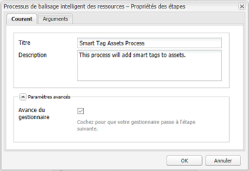

# Configuration du balisage des ressources à l’aide du service de contenu dynamique {#configure-asset-tagging-using-the-smart-content-service}

Vous pouvez intégrer des [!DNL Adobe Experience Manager] avec le service de contenu dynamique utilisant [!DNL Adobe Developer Console]. Utilisez cette configuration pour accéder au service de contenu dynamique à partir de [!DNL Experience Manager].

>[!NOTE]
>
>* Les services de contenu dynamique ne sont plus disponibles pour les nouvelles [!DNL Experience Manager Assets] Clients On-Premise. Les clients On-Premise existants, pour lesquels cette fonctionnalité est déjà activée, peuvent continuer à utiliser les services de contenu dynamique.
>* Smart Content Services est disponible pour les [!DNL Experience Manager Assets] Clients Managed Services, pour lesquels cette fonctionnalité est déjà activée.
>* Nouveau [!DNL Experience Manager Assets] Les clients Managed Services peuvent suivre les instructions mentionnées dans cet article pour configurer les services de contenu dynamique.

L’article détaille les tâches essentielles suivantes qui sont requises pour configurer le service de contenu dynamique. À l’arrière-plan, la variable [!DNL Experience Manager] le serveur authentifie vos informations d’identification de service auprès de la fonction [!DNL Adobe Developer Console] passerelle avant de transférer votre demande vers le service de contenu dynamique.

1. [Création d’une configuration de service de contenu dynamique dans pour générer une clé publique. ](#obtain-public-certificate)[!DNL Experience Manager] [Obtenez un certificat public](#obtain-public-certificate) pour l’intégration d’OAuth.

1. [Créez une intégration dans Adobe Developer Console](#create-adobe-i-o-integration) et chargez la clé publique générée.

1. [Configuration de votre déploiement](#configure-smart-content-service) à l’aide de la clé API et d’autres informations d’identification provenant de [!DNL Adobe Developer Console].

1. [Testez la configuration](#validate-the-configuration).

1. Facultativement, [activez le balisage automatique lors du chargement des ressources](#enable-smart-tagging-in-the-update-asset-workflow-optional).

## Prérequis {#prerequisites}

Avant d’utiliser le service de contenu dynamique, assurez-vous des points suivants pour créer une intégration sur [!DNL Adobe Developer Console]:

* L’organisation doit disposer d’un compte Adobe ID pourvu de droits d’administrateur.

* Le de contenu dynamique est activé pour votre organisation.

Pour activer les balises intelligentes améliorées, en plus de ce qui précède, installez également la dernière version [Service Pack Experience Manager](https://helpx.adobe.com/fr/experience-manager/aem-releases-updates.html).

## Création d’une configuration de service de contenu dynamique pour obtenir un certificat public {#obtain-public-certificate}

Un certificat public vous permet d’authentifier votre profil sur [!DNL Adobe Developer Console].

1. Dans l’interface utilisateur [!DNL Experience Manager], accédez à **[!UICONTROL Outils]** > **[!UICONTROL Services cloud]** > **[!UICONTROL Services cloud hérités]**.

1. Dans la page Services cloud, cliquez sur **[!UICONTROL Configurer maintenant]** sous **[!UICONTROL Ressources – Balises intelligentes]**.

1. Dans la boîte de dialogue **[!UICONTROL Créer une configuration]**, spécifiez un titre et un nom pour la configuration de balises intelligentes. Cliquez sur **[!UICONTROL Créer]**.

1. Dans la boîte de dialogue **[!UICONTROL Service de contenu dynamique AEM]**, utilisez les valeurs suivantes :

   **[!UICONTROL URL du service]** : `https://smartcontent.adobe.io/<region where your Experience Manager author instance is hosted>`

   Par exemple, `https://smartcontent.adobe.io/apac`. Vous pouvez indiquer `na`, `emea`, ou `apac` comme les régions où votre instance de création de Experience Manager est hébergée.

   >[!NOTE]
   >
   >Si le service géré Experience Manager est mis en service avant le 1er septembre 2022, utilisez l’URL de service suivante :
   >`https://mc.adobe.io/marketingcloud/smartcontent`

   **[!UICONTROL Serveur d’autorisation]** : `https://ims-na1.adobelogin.com`

   Laissez les autres champs vides pour l’instant (pour les remplir ultérieurement). Cliquez sur **[!UICONTROL OK]**.

   

   *Image : boîte de dialogue Service de contenu dynamique pour fournir une URL de service de contenu*

   >[!NOTE]
   >
   >L’URL fournie en tant qu’[!UICONTROL URL de service] n’est pas accessible via le navigateur et génère un message d’erreur 404. La configuration fonctionne correctement avec la même valeur que le paramètre [!UICONTROL URL de service]. Pour connaître le statut général du service et le planning de maintenance, consultez [https://status.adobe.com](https://status.adobe.com).

1. Cliquez sur **[!UICONTROL Télécharger le certificat public pour l’intégration OAuth]** et téléchargez le fichier de certificat public `AEM-SmartTags.crt`.

   

   *Image : paramètres du service de balisage intelligent*

### Reconfiguration quand un certificat atteint sa date d’expiration {#certrenew}

Lorsque le certificat expire, il n’est plus approuvé. Vous ne pouvez pas renouveler un certificat ayant expiré. Pour ajouter un nouveau certificat, procédez comme suit.

1. Connectez-vous en tant qu’administrateur à votre déploiement [!DNL Experience Manager]. Cliquez sur **[!UICONTROL Outils]** > **[!UICONTROL Sécurité]** > **[!UICONTROL Utilisateurs]**.

1. Recherchez et cliquez sur l’utilisateur **[!UICONTROL dam-update-service]**. Cliquez sur l’onglet **[!UICONTROL KeyStore]**.

1. Supprimez le fichier de stockage de clés **[!UICONTROL similaritysearch]** existant avec le certificat arrivé à expiration. Cliquez sur **[!UICONTROL Enregistrer et fermer]**.

   

   *Figure : Suppression d’une entrée existante`similaritysearch` dans le Keystore pour ajouter un nouveau certificat de sécurité.*

1. Accédez à **[!UICONTROL Outils]** > **[!UICONTROL Cloud Services]** > **[!UICONTROL Ancienne version de Cloud Services]**. Cliquez sur **[!UICONTROL Balises dynamiques de ressources]** > **[!UICONTROL Afficher la configuration]** > **[!UICONTROL Configurations disponibles]**. Cliquez sur la configuration requise.

1. Pour télécharger un certificat public, cliquez sur **[!UICONTROL Télécharger le certificat public pour l’intégration OAuth]**.

1. Accédez à [https://console.adobe.io](https://console.adobe.io) et accédez aux services de contenu intelligent existants sur la page **[!UICONTROL Intégrations]**. Téléchargez le nouveau certificat. Pour plus d’informations, consultez les instructions contenues dans [Création d’une intégration dans Adobe Developer Console](#create-adobe-i-o-integration).

## Création de l’intégration de la console Adobe Developer {#create-adobe-i-o-integration}

Pour utiliser les API de service de contenu dynamique, créez une intégration dans la console Adobe Developer afin d’obtenir la [!UICONTROL Clé API] (générée dans le champ [!UICONTROL ID CLIENT] de l’intégration de la console Adobe Developer), [!UICONTROL ID DE COMPTE TECHNIQUE], [!UICONTROL ID D’ORGANISATION] et [!UICONTROL SECRET CLIENT] pour les [!UICONTROL Paramètres du service de balisage intelligent des ressources] de la configuration cloud dans [!DNL Experience Manager].

1. Accédez à l’URL [https://console.adobe.io](https://console.adobe.io/) dans un navigateur. Sélectionnez le compte approprié et vérifiez que le rôle d’organisation associé est administrateur système.

1. Créez un projet portant le nom de votre choix. Cliquez sur **[!UICONTROL Add API]** (Ajouter une API).

1. Sur la page **[!UICONTROL Add an API]** (Ajouter une API), sélectionnez **[!UICONTROL Experience Cloud]** puis **[!UICONTROL Smart Content]** (Contenu dynamique). Cliquez sur **[!UICONTROL Next]** (Suivant).

1. Sélectionnez **[!UICONTROL Upload your public key]** (Charger votre clé publique). Fournissez le fichier de certificat téléchargé depuis [!DNL Experience Manager]. Le message [!UICONTROL Public key(s) uploaded successfully] (La ou les clés publiques ont été chargées) s’affiche. Cliquez sur **[!UICONTROL Next]** (Suivant).

   La page [!UICONTROL Create a new Service Account (JWT) credential] (Créer des informations d’identification de compte de service (JWT)) affiche la clé publique du compte de service qui vient d’être configuré.

1. Cliquez sur **[!UICONTROL Next]** (Suivant).

1. Dans la page **[!UICONTROL Select product profiles]** (Sélectionner les profils de produits), sélectionnez **[!UICONTROL Smart Content Services]** (Services de contenu dynamique). Cliquez sur **[!UICONTROL Enregistrer l’API configurée]**. 

   Une page affiche davantage d’informations sur la configuration. Laissez cette page ouverte pour copier et ajouter ces valeurs dans les [!UICONTROL Paramètres du service de balisage intelligent des ressources] de la configuration cloud dans [!DNL Experience Manager] pour configurer des balises intelligentes.

   

   *Image : détails de l’intégration dans la console Adobe Developer*

## Configuration du service de contenu dynamique {#configure-smart-content-service}

Pour configurer l’intégration, utilisez les valeurs d’[!UICONTROL ID DE COMPTE TECHNIQUE], d’[!UICONTROL ID D’ORGANISATION], de [!UICONTROL SECRET CLIENT] et d’[!UICONTROL ID CLIENT] à partir de l’intégration de la console Adobe Developer. La création d’une configuration cloud de balises intelligentes permet d’authentifier les demandes d’API provenant du déploiement [!DNL Experience Manager].

1. [!DNL Experience Manager]Accédez à **[!UICONTROL Outils > Services cloud > Services cloud hérités]** pour ouvrir la console [!UICONTROL Services cloud].

1. Sous **[!UICONTROL Ressources – Balises intelligentes]**, ouvrez la configuration créée ci-dessus. Sur la page de paramètres du service, cliquez sur **[!UICONTROL Modifier]**.

1. Dans la boîte de dialogue **[!UICONTROL Service de contenu dynamique AEM]**, utilisez les valeurs préremplies pour les champs **[!UICONTROL URL de service]** et **[!UICONTROL Serveur d’autorisation]**.

1. Pour les champs [!UICONTROL Clé Api], [!UICONTROL Identifiant du compte technique], [!UICONTROL ID d’organisation] et [!UICONTROL Secret du client], copiez et utilisez les valeurs suivantes générées dans [Intégration de la console Adobe Developer](#create-adobe-i-o-integration).

   | [!UICONTROL Paramètres du service de balisage intelligent des ressources] | Champs d’intégration d’[!DNL Adobe Developer Console] |
   |--- |--- |
   | [!UICONTROL Clé API] | [!UICONTROL ID CLIENT] |
   | [!UICONTROL Identifiant de compte technique] | [!UICONTROL ID DE COMPTE TECHNIQUE] |
   | [!UICONTROL Identifiant d’organisation] | [!UICONTROL ID D’ORGANISATION] |
   | [!UICONTROL Secret client] | [!UICONTROL SECRET CLIENT] |

## Validation de la configuration {#validate-the-configuration}

Une fois la configuration terminée, utilisez un MBean JMX pour la valider. Pour procéder à la validation, suivez ces étapes.

1. Accédez à votre serveur [!DNL Experience Manager] sur `https://[aem_server]:[port]`.

1. Accédez à **[!UICONTROL Outils > Opérations > Console Web]** pour ouvrir la console OSGi. Cliquez sur **[!UICONTROL Principal > JMX]**.

1. Cliquez sur **[!UICONTROL com.day.cq.dam.similaritysearch.internal.impl]**. Les **[!UICONTROL tâches relatives à SimilaritySearch]** s’ouvrent alors.

1. Cliquez sur **[!UICONTROL validateConfigs()]**. Dans la boîte de dialogue **[!UICONTROL Valider les configurations]**, cliquez sur **[!UICONTROL Invoquer]**.

   Le résultat de la validation s’affiche dans la même boîte de dialogue.

## Activation du balisage intelligent dans le workflow Ressource de mise à jour de la gestion des ressources numériques (Facultatif) {#enable-smart-tagging-in-the-update-asset-workflow-optional}

1. Dans [!DNL Experience Manager], accédez à **[!UICONTROL Outils]** > **[!UICONTROL Workflow]** > **[!UICONTROL Modèles]**.

1. Sur la page **[!UICONTROL Modèles de processus]**, sélectionnez le modèle de processus **[!UICONTROL Ressources de mise à jour de gestion des actifs numériques (DAM)]**.

1. Cliquez sur **[!UICONTROL Modifier]** dans la barre d’outils.

1. Développez le panneau latéral pour afficher les étapes. Faites glisser l’étape **[!UICONTROL Balisage intelligent de la ressource]** disponible dans la section Processus de DAM (gestion des actifs numériques) et placez-la après l’étape **[!UICONTROL Miniatures des processus]**.

   

   *Image : ajout de l’étape de balisage intelligent de la ressource après l’étape Miniatures des processus dans le workflow [!UICONTROL Ressources de mise à jour de la gestion des ressources numériques]*.

1. Ouvrez l’étape en mode édition. Dans **[!UICONTROL Paramètres avancés]**, vérifiez que l’option **[!UICONTROL Avance du gestionnaire]** est sélectionnée.

   

   *Image : configuration du workflow de Ressource de mise à jour de la gestion des ressources numériques et ajout de l’étape de balisage intelligent*

1. Dans l’onglet **[!UICONTROL Arguments]**, sélectionnez **[!UICONTROL Ignorer les erreurs]** si vous souhaitez que le workflow se termine même si l’étape de balisage automatique échoue.

   

   *Image : configuration du workflow de Ressource de mise à jour de la gestion des ressources numériques pour ajouter l’étape de balisage intelligent et sélectionner l’avance du gestionnaire*

   Pour baliser les ressources lors de leur chargement, et ce, que le balisage intelligent soit activé ou non dans les dossiers, cochez la case **[!UICONTROL Ignorer l’indicateur de balise intelligente]**.

   

   *Figure : Configurez le workflow Ressources de mise à jour de gestion des actifs numériques pour ajouter une étape de balise intelligente et sélectionnez Ignorer l’indicateur de balise intelligente .*

1. Cliquez sur **[!UICONTROL OK]** pour fermer l’étape du workflow, puis enregistrez ce dernier.

>[!MORELIKETHIS]
>
>* [Gestion des balises intelligentes](managing-smart-tags.md)
>* [Présentation et entraînement des balises intelligentes](enhanced-smart-tags.md)
>* [Instructions et règles pour entraîner le service de contenu dynamique](smart-tags-training-guidelines.md)

