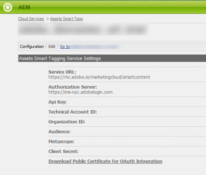

# Configuration du balisage des ressources à l’aide de Smart Content Service {#configure-asset-tagging-using-the-smart-content-service}

Vous pouvez intégrer [!DNL Adobe Experience Manager] à Smart Content Service en utilisant [!DNL Adobe Developer Console]. Utilisez cette configuration pour accéder à Smart Content Service depuis [!DNL Experience Manager].

L’article détaille les tâches essentielles suivantes qui sont requises pour configurer le service de contenu dynamique. À l&#39;arrière-plan, le serveur [!DNL Experience Manager] authentifie vos informations d&#39;identification de service avec la passerelle [!DNL Adobe Developer Console] avant de transmettre votre demande à Smart Content Service.

1. [Création d’une configuration de service de contenu dynamique dans pour générer une clé publique. ](#obtain-public-certificate)[!DNL Experience Manager] [Obtenez un certificat public](#obtain-public-certificate) pour l’intégration d’OAuth.

1. [Créez une intégration dans Adobe Developer Console](#create-adobe-i-o-integration) et chargez la clé publique générée.

1. [Configurez vos ](#configure-smart-content-service) déploiements à l’aide de la clé d’API et d’autres informations d’identification de  [!DNL Adobe Developer Console].

1. [Testez la configuration](#validate-the-configuration).

1. [Vous pouvez éventuellement activer le balisage automatique lors du transfert des ressources](#enable-smart-tagging-in-the-update-asset-workflow-optional).

## Conditions préalables {#prerequisites}

Avant d’utiliser Smart Content Service, vérifiez les éléments suivants pour créer une intégration sur [!DNL Adobe Developer Console] :

* L’organisation doit disposer d’un compte Adobe ID pourvu de droits d’administrateur.

* Le de contenu dynamique est activé pour votre organisation.

Pour activer les balises actives améliorées, en plus de ce qui précède, installez également le dernier [Service Pack du Experience Manager](https://helpx.adobe.com/fr/experience-manager/aem-releases-updates.html).

## Créer une configuration de Smart Content Service pour obtenir un certificat public {#obtain-public-certificate}

Un certificat public vous permet d&#39;authentifier votre profil sur [!DNL Adobe Developer Console].

1. Dans l&#39;interface utilisateur [!DNL Experience Manager], accédez à **[!UICONTROL Outils]** > **[!UICONTROL Cloud Services]** > **[!UICONTROL Cloud Services hérités]**.

1. Dans la page Cloud Services, cliquez sur **[!UICONTROL Configurer maintenant]** sous **[!UICONTROL Actifs Balises dynamiques]**.

1. Dans la boîte de dialogue **[!UICONTROL Créer une configuration]**, spécifiez un titre et un nom pour la configuration de balises intelligentes. Cliquez sur **[!UICONTROL Créer]**.

1. Dans la boîte de dialogue **[!UICONTROL Service de contenu dynamique AEM]**, utilisez les valeurs suivantes :

   **[!UICONTROL URL du service]**: `https://mc.adobe.io/marketingcloud/smartcontent`

   **[!UICONTROL Serveur d’autorisation]**: `https://ims-na1.adobelogin.com`

   Laissez les autres champs vides pour l’instant (pour les remplir ultérieurement). Cliquez sur **[!UICONTROL OK]**.

   

   *Figure : Boîte de dialogue de Smart Content Service permettant de fournir l’URL du service de contenu*

   >[!NOTE]
   >
   >L’URL fournie sous la forme [!UICONTROL URL du service] n’est pas accessible par le biais du navigateur et génère une erreur 404. La configuration fonctionne correctement avec la même valeur que le paramètre [!UICONTROL URL du service]. Pour connaître le statut général du service et le calendrier de maintenance, voir [https://status.adobe.com](https://status.adobe.com).

1. Cliquez sur **[!UICONTROL Télécharger le certificat public pour l’intégration OAuth]** et téléchargez le fichier de certificat public `AEM-SmartTags.crt`.

   

   *Figure : Paramètres du service de balisage intelligent*

### Reconfigurer à l’expiration d’un certificat {#certrenew}

Une fois qu’un certificat expire, il n’est plus approuvé. Vous ne pouvez pas renouveler un certificat ayant expiré. Pour ajouter un nouveau certificat, procédez comme suit.

1. Connectez-vous en tant qu’administrateur à votre déploiement [!DNL Experience Manager]. Cliquez sur **[!UICONTROL Outils]** > **[!UICONTROL Sécurité]** > **[!UICONTROL Utilisateurs]**.

1. Recherchez et cliquez sur l’utilisateur **[!UICONTROL dam-update-service]**. Cliquez sur l’onglet **[!UICONTROL KeyStore]**.

1. Supprimez le fichier de stockage de clés **[!UICONTROL similaritysearch]** existant avec le certificat arrivé à expiration. Cliquez sur **[!UICONTROL Enregistrer et fermer]**.

   

   *Figure : Suppression d’une entrée existante`similaritysearch` dans le Keystore pour ajouter un nouveau certificat de sécurité.*

1. Accédez à **[!UICONTROL Outils]** > **[!UICONTROL Cloud Services]** > **[!UICONTROL Ancienne version de Cloud Services]**. Cliquez sur **[!UICONTROL Balises dynamiques de ressources]** > **[!UICONTROL Afficher la configuration]** > **[!UICONTROL Configurations disponibles]**. Cliquez sur la configuration requise.

1. Pour télécharger un certificat public, cliquez sur **[!UICONTROL Télécharger le certificat public pour l’intégration Oauth]**.

1. Accédez à [https://console.adobe.io](https://console.adobe.io) et accédez aux services de contenu intelligent existants sur la page **[!UICONTROL Intégrations]**. Téléchargez le nouveau certificat. Pour plus d&#39;informations, consultez les instructions de [Création de l&#39;intégration de la Console développeur d&#39;Adobes](#create-adobe-i-o-integration).

## Créer l&#39;intégration de la Console développeur d&#39;Adobes {#create-adobe-i-o-integration}

Pour utiliser les API de Smart Content Service, créez une intégration dans la Console développeur d&#39;Adobes afin d&#39;obtenir la [!UICONTROL clé d&#39;API] (générée dans le champ [!UICONTROL ID CLIENT] de l&#39;intégration de la Console développeur d&#39;Adobes), [!UICONTROL ID de COMPTE TECHNIQUE], [!UICONTROL ID ORGANISATION] et [!UICONTROL  CLIENT SECRET] pour [!UICONTROL Assets Smart Tagging Service Settings] de la configuration du cloud dans [!DNL Experience Manager].

1. Accédez à l’URL [https://console.adobe.io](https://console.adobe.io/) dans un navigateur. Sélectionnez le compte approprié et vérifiez que le rôle d’organisation associé est administrateur système.

1. Créez un projet portant le nom de votre choix. Cliquez sur **[!UICONTROL Add API]** (Ajouter une API).

1. Sur la page **[!UICONTROL Ajouter une API]**, sélectionnez **[!UICONTROL Experience Cloud]**, puis **[!UICONTROL Contenu intelligent]**. Cliquez sur **[!UICONTROL Next]** (Suivant).

1. Sélectionnez **[!UICONTROL Upload your public key]** (Charger votre clé publique). Fournissez le fichier de certificat téléchargé depuis [!DNL Experience Manager]. Le message [!UICONTROL Public key(s) uploaded successfully] (La ou les clés publiques ont été chargées) s’affiche. Cliquez sur **[!UICONTROL Next]** (Suivant).

   La page [!UICONTROL Create a new Service Account (JWT) credential] (Créer des informations d’identification de compte de service (JWT)) affiche la clé publique du compte de service qui vient d’être configuré.

1. Cliquez sur **[!UICONTROL Next]** (Suivant).

1. Dans la page **[!UICONTROL Select product profiles]** (Sélectionner les profils de produits), sélectionnez **[!UICONTROL Smart Content Services]** (Services de contenu dynamique). Cliquez sur **[!UICONTROL Save configured API]** (Enregistrer l’API configurée). 

   Une page affiche davantage d’informations sur la configuration. Conservez cette page ouverte pour copier et ajouter ces valeurs dans [!UICONTROL Paramètres du service de balisage intelligent ] des ressources de la configuration du cloud dans [!DNL Experience Manager] afin de configurer les balises actives.

   

   *Figure : Détails de l&#39;intégration dans la Console développeur d&#39;Adobes*

## Configuration du service de contenu dynamique {#configure-smart-content-service}

Pour configurer l’intégration, utilisez les valeurs des champs [!UICONTROL ID DE COMPTE TECHNIQUE], [!UICONTROL ID D’ORGANISATION], [!UICONTROL SECRET CLIENT] et [!UICONTROL ID CLIENT] de l’intégration Adobe Developer Console. La création d’une configuration cloud Smart Tags permet l’authentification des demandes d’API à partir du déploiement [!DNL Experience Manager].

1. Dans [!DNL Experience Manager], accédez à **[!UICONTROL Outils > Cloud Service > Cloud Services hérités]** pour ouvrir la console [!UICONTROL Cloud Services].

1. Sous **[!UICONTROL Ressources – Balises intelligentes]**, ouvrez la configuration créée ci-dessus. Sur la page de paramètres du service, cliquez sur **[!UICONTROL Modifier]**.

1. Dans la boîte de dialogue **[!UICONTROL Service de contenu dynamique AEM]**, utilisez les valeurs préremplies pour les champs **[!UICONTROL URL de service]** et **[!UICONTROL Serveur d’autorisation]**.

1. Pour les champs [!UICONTROL Clé d’API], [!UICONTROL ID de compte technique], [!UICONTROL ID d’organisation] et [!UICONTROL Secret client], copiez et utilisez les valeurs suivantes générées dans [l’intégration de la Console développeur d’Adobes](#create-adobe-i-o-integration).

   | [!UICONTROL Paramètres du service de balisage intelligent des ressources] | [!DNL Adobe Developer Console] Champs d’intégration |
   |--- |--- |
   | [!UICONTROL Clé API] | [!UICONTROL ID CLIENT] |
   | [!UICONTROL Identifiant de compte technique] | [!UICONTROL ID DE COMPTE TECHNIQUE] |
   | [!UICONTROL Identifiant d&#39;organisation] | [!UICONTROL ID D’ORGANISATION] |
   | [!UICONTROL Secret client] | [!UICONTROL SECRET CLIENT] |

## Validation de la configuration {#validate-the-configuration}

Une fois la configuration terminée, utilisez un MBean JMX pour valider la configuration. Pour procéder à la validation, suivez ces étapes.

1. Accédez à votre serveur [!DNL Experience Manager] à `https://[aem_server]:[port]`.

1. Accédez à **[!UICONTROL Outils > Opérations > Console Web]** pour ouvrir la console OSGi. Cliquez sur **[!UICONTROL Principal > JMX]**.

1. Cliquez sur **[!UICONTROL com.day.cq.dam.similaritysearch.internal.impl]**. Il ouvre **[!UICONTROL SimilaritySearch Tâches diverses]**.

1. Cliquez sur **[!UICONTROL validateConfigs()]**. Dans la boîte de dialogue **[!UICONTROL Valider les configurations]**, cliquez sur **[!UICONTROL Appeler]**.

   Les résultats de la validation s’affichent dans la même boîte de dialogue.

## Activez le balisage intelligent dans le flux de travaux de mise à jour de la ressource DAM (facultatif) {#enable-smart-tagging-in-the-update-asset-workflow-optional}

1. Dans [!DNL Experience Manager], accédez à **[!UICONTROL Outils]** > **[!UICONTROL Workflow]** > **[!UICONTROL Modèles]**.

1. Sur la page **[!UICONTROL Modèles de processus]**, sélectionnez le modèle de processus **[!UICONTROL Ressources de mise à jour de gestion des actifs numériques]**.

1. Cliquez sur **[!UICONTROL Modifier]** dans la barre d’outils.

1. Développez le panneau latéral pour afficher les étapes. Faites glisser l’étape **[!UICONTROL Balisage intelligent de la ressource]** disponible dans la section Processus de DAM (gestion des actifs numériques) et placez-la après l’étape **[!UICONTROL Miniatures des processus]**.

   

   *Figure : Ajout de l’étape Balisage intelligent de la ressource après l’étape Miniatures des processus dans le processus Ressources de mise à jour de gestion des actifs numériques.*

1. Ouvrez l’étape en mode édition. Dans **[!UICONTROL Paramètres avancés]**, vérifiez que l’option **[!UICONTROL Avance du gestionnaire]** est sélectionnée.

   

   *Figure : Configurer le processus de mise à jour des actifs DAM et ajouter une étape de balise active*

1. Dans l’onglet **[!UICONTROL Arguments]**, sélectionnez **[!UICONTROL Ignorer les erreurs]** si vous souhaitez que le processus se termine même si l’étape de balisage automatique échoue.

   

   *Figure : Configurez le processus de mise à jour des actifs de gestion des actifs numériques pour ajouter l’étape de balise active et sélectionner l’avance du gestionnaire.*

   Pour baliser les ressources lors de leur chargement, et ce, que le balisage intelligent soit activé ou non dans les dossiers, cochez la case **[!UICONTROL Ignorer l’indicateur de balise intelligente]**.

   

   *Figure : Configurez le processus de mise à jour de la gestion des actifs numériques pour ajouter une étape de balise active et sélectionnez ignorer l’indicateur de balise active.*

1. Cliquez sur **[!UICONTROL OK]** pour fermer l’étape du processus, puis enregistrez ce dernier.

>[!MORELIKETHIS]
>
>* [Gérer les balises actives](managing-smart-tags.md)
>* [Présentation et formation des balises actives](enhanced-smart-tags.md)
>* [Instructions et règles de formation de Smart Content Service](smart-tags-training-guidelines.md)

