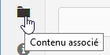

# Contenu associé {#associated-content}

>[!CAUTION]
>
>Certaines fonctionnalités de fragment de contenu nécessitent l’application de [AEM 6.4 Service Pack 2 (6.4.2.0) ou version ultérieure](/help/release-notes/sp-release-notes.md).

Le contenu associé fournit la connexion afin que les ressources puissent (éventuellement) être utilisées avec le fragment lorsqu’il est ajouté à une page de contenu. Vous bénéficiez ainsi d’une certaine souplesse,[ car vous disposez d’une gamme de ressources auxquelles accéder lors de l’utilisation du fragment de contenu sur une page.](/help/sites-authoring/content-fragments.md#using-associated-content) Cela permet aussi de réduire le temps nécessaire pour rechercher la ressource appropriée.

## Ajout de contenu associé {#adding-associated-content}

>[!NOTE]
>
>Différentes méthodes permettent d’ajouter des [ressources visuelles (des images, par exemple)](content-fragments.md#fragments-with-visual-assets) au fragment et/ou à la page.

Pour effectuer l’association, vous devez d’abord [ajouter les ressources multimédias à une collection](managing-collections-touch-ui.md#adding-assets-to-a-collection). Une fois l’ajout effectué, vous pouvez réaliser les étapes suivantes :

1. Ouvrez votre fragment et sélectionnez ensuite **[!UICONTROL Contenu associé]** dans le panneau latéral.

   

1. Sélectionnez **[!UICONTROL Associer le contenu]** ou **[!UICONTROL Associer la collection]** (selon le cas, si des collections ont déjà été associées ou non).
1. Sélectionnez la collection requise.

   Si vous le souhaitez, vous pouvez ajouter le fragment à la collection sélectionnée, car cela facilite le suivi.

   

1. Confirmez (en cochant). La collection sera répertoriée comme associée.

   

## Modification du contenu associé {#editing-associated-content}

Une fois que vous avez associé une collection, vous pouvez effectuer les opérations suivantes :

* **Supprimer** l’association.
* **Ajouter des ressources** à la collection.
* Sélectionner une ressource en vue d’effectuer d’autres opérations.
* Modifier la ressource.

