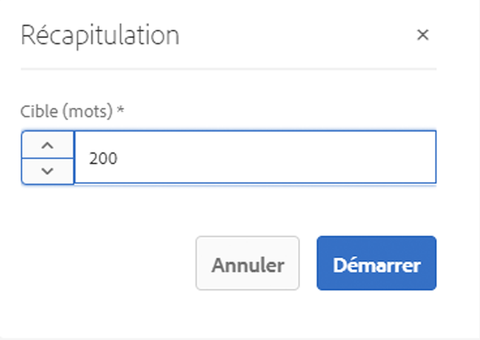
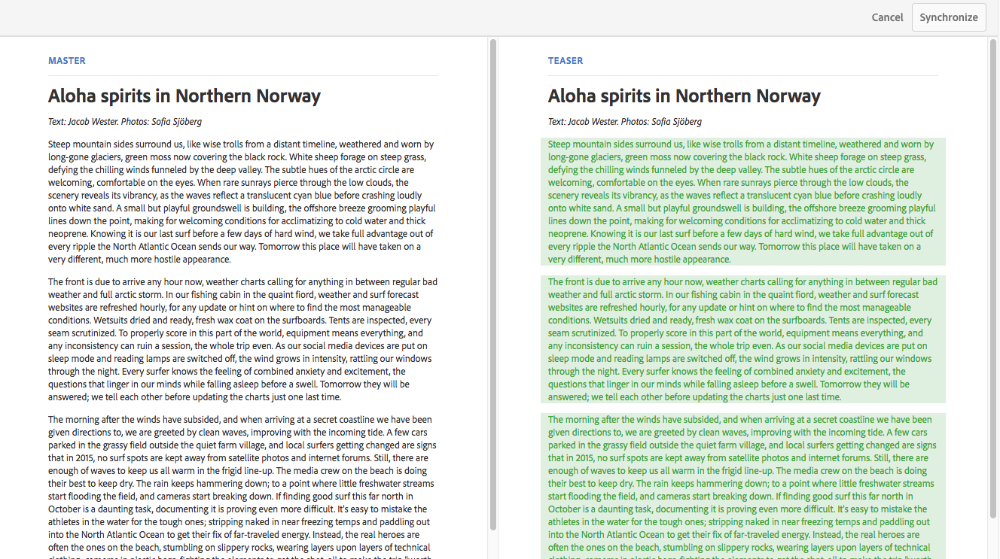

# Variations – créer du contenu de fragment {#variations-authoring-fragment-content}

>[!CAUTION]
>
>AEM 6.4 a atteint la fin de la prise en charge étendue et cette documentation n’est plus mise à jour. Pour plus d’informations, voir notre [période de support technique](https://helpx.adobe.com/fr/support/programs/eol-matrix.html). Rechercher les versions prises en charge [here](https://experienceleague.adobe.com/docs/?lang=fr).

>[!CAUTION]
>
>Certaines fonctionnalités de fragment de contenu nécessitent l’application de la fonction [AEM 6.4 Service Pack 2 (6.4.2.0) ou version ultérieure](../release-notes/sp-release-notes.md).

[Variations](content-fragments.md#constituent-parts-of-a-content-fragment) sont une fonctionnalité importante des fragments de contenu, car ils vous permettent de créer et de modifier des copies du contenu maître pour les utiliser sur des canaux spécifiques et/ou des scénarios.

À partir de l’onglet **Variations**, vous pouvez :

* [saisir le contenu](#authoring-your-content) de votre fragment
* [Créez et gérez les variations](#managing-variations) du contenu **principal**

effectuer diverses autres actions selon le type de données que vous modifiez, par exemple :

* [Insertion de ressources visuelles dans votre fragment](#inserting-assets-into-your-fragment) (images)
* Sélectionner entre [Texte enrichi](#rich-text), [Texte brut](#plain-text) et [Markdown](#markdown) pour modification

* [Chargement du contenu](#uploading-content)

* [Affichage des statistiques clés](#viewing-key-statistics) (à propos du texte sur plusieurs lignes)
* [Création d’un résumé de texte](#summarizing-text)

* [Synchronisation des variations avec le contenu maître](#synchronizing-with-master)

>[!CAUTION]
>
>Une fois qu’un fragment a été publié et/ou référencé, AEM affiche un avertissement lorsqu’un auteur ouvre à nouveau ce fragment en mode d’édition. Il s’agit de signaler que les modifications apportées au fragment seront également répercutées sur les pages référencées.

## Création de contenu {#authoring-your-content}

Lorsque vous ouvrez votre fragment de contenu pour le modifier, la variable **Variations** s’ouvre par défaut. Ici, vous pouvez créer le contenu, par Principal ou toute variante que vous avez. Vous pouvez :

* effectuer des modifications directement dans l’onglet **Variations**.
* ouvrez le [éditeur plein écran](#full-screen-editor) à :

   * sélectionner le [format](#formats) ;
   * voir davantage d’options de modification (pour le format [Texte enrichi](#rich-text)) ;
   * accéder à un éventail d’[actions](#actions).

Par exemple :

* Modification d’un fragment simple

   Un fragment simple se compose d’un champ de texte multiligne (les ressources visuelles peuvent être ajoutées à partir de l’éditeur plein écran).

   

* Modification d’un fragment avec du contenu structuré

   Un fragment structuré contient divers champs, de différents types de données, qui ont été définis dans le modèle de contenu. Pour tous les champs à plusieurs lignes, la variable [éditeur plein écran](#full-screen-editor) est disponible.

   

### Éditeur plein écran {#full-screen-editor}

Lorsque vous modifiez un champ de texte multiligne, vous pouvez ouvrir l’éditeur plein écran :

L’éditeur plein écran fournit les éléments suivants :

* Accès à divers [actions](#actions)
* Selon le [format](#formats), options de mise en forme supplémentaires ([Texte enrichi](#rich-text))

### Actions {#actions}

Les actions suivantes sont également disponibles (pour tous les [formats](#formats)) lorsque l’éditeur plein écran (c’est-à-dire pour le texte sur plusieurs lignes) est ouvert :

* Sélectionnez la [format](#formats) ([Texte enrichi](#rich-text), [Texte brut](#plain-text), [Markdown](#markdown))
* [Affichage des statistiques de texte](#viewing-key-statistics)
* [Chargement du contenu](#uploading-content)
* [Synchronisation avec le gabarit](#synchronizing-with-master) (lors de la modification d’une variation)
* [Création d’un résumé de texte](#summarizing-text)
* [Annotation de](content-fragments-variations.md#annotating-a-content-fragment) votre texte

* [Insertion de ressources visuelles dans votre fragment](#inserting-assets-into-your-fragment) (images)

### Formats {#formats}

Les options de modification du texte sur plusieurs lignes dépendent du format sélectionné :

* [Texte enrichi](#rich-text)
* [Texte brut](#plain-text)
* [Texte (Markdown)](#markdown)

Le format peut être sélectionné dans l’éditeur plein écran.

### Texte enrichi {#rich-text}

La modification de texte enrichi permet de mettre en forme :

* Gras
* Italique
* Souligné
* Alignement : gauche, centre et droite
* Liste à puces
* Liste numérotée
* Retrait : augmenter, diminuer
* Création/suppression d’hyperliens
* Ouvrez l’éditeur plein écran où les options de mise en forme suivantes sont disponibles :

   * Coller le texte/à partir de Word
   * Insérer un tableau
   * Style de paragraphe : paragraphe et en-tête 1/2/3
   * [Insertion de ressources visuelles](#inserting-assets-into-your-fragment)
   * Rechercher
   * Rechercher/remplacer
   * Vérificateur orthographique
   * [Annotations](content-fragments-variations.md#annotating-a-content-fragment)

Les [actions](#actions) sont également accessibles à partir de l’éditeur plein écran.

### Texte brut {#plain-text}

Le texte brut permet de saisir du contenu de manière rapide, sans formatage ni Markdown. Vous pouvez également ouvrir l’éditeur plein écran pour accomplir d’autres [actions](#actions).

>[!CAUTION]
>
>Si vous sélectionnez **Texte brut**, vous risquez de perdre le formatage, les annotations et/ou les fichiers que vous avez insérés dans du **texte enrichi** ou dans **Markdown**.

### Texte (Markdown) {#markdown}

>[!NOTE]
>
>Pour plus d’informations, voir [Markdown](content-fragments-markdown.md) documentation.

Vous pouvez ainsi mettre en forme votre texte à l’aide de Markdown. Vous pouvez définir :

* Titres
* Paragraphes et sauts de ligne
* Liens
* Images
* Blocs de citations
* Listes
* Accent
* Blocs de code
* Échappements par barre oblique inverse

Vous pouvez également ouvrir l’éditeur plein écran pour accomplir d’autres [actions](#actions).

>[!CAUTION]
>
>Si vous basculez entre **Texte enrichi** et **Texte (Markdown)**, des effets inattendus peuvent apparaître avec les Blocs de citations et Blocs de code, dans la mesure où le traitement de ces deux formats peut être différent.

### Affichage des statistiques clés {#viewing-key-statistics}

Lorsque l’éditeur plein écran est ouvert, l’action **Statistiques de texte** affiche différentes informations au sujet du texte. Par exemple :

### Chargement de contenu {#uploading-content}

Pour simplifier le processus de création de fragments de contenu, vous pouvez transférer du texte préparé dans un éditeur externe et l’ajouter directement au fragment.

### Résumé de texte {#summarizing-text}

Le résumé de texte est conçu pour aider les utilisateurs à réduire la longueur de leur texte à un nombre prédéfini de mots tout en conservant les éléments clés et la signification globale.

>[!NOTE]
>
>À un niveau plus technique, le système conserve les phrases qu’il évalue comme ayant le *meilleur rapport de densité et d’unicité des informations* selon des algorithmes spécifiques.

>[!CAUTION]
>
>le fragment de contenu doit avoir un dossier de langue valide en tant qu’ancêtre ; il est utilisé pour déterminer le modèle de langue à utiliser.
>
>Par exemple, `en/` comme dans le chemin d’accès suivant :
>
>`/content/dam/my-brand/en/path-down/my-content-fragment`

>[!CAUTION]
>
>L’anglais est disponible par défaut.
>
>D’autres langues sont disponibles en tant que modules de modèle de langue à partir de Distribution logicielle :
>
>* [Français (fr) de Distribution logicielle](https://experience.adobe.com/#/downloads/content/software-distribution/en/aem.html?lang=fr?package=/content/software-distribution/en/details.html?lang=fr/content/dam/aem/public/adobe/packages/cq630/product/smartcontent-model-fr)
>* [Allemand (de) de Distribution logicielle](https://experience.adobe.com/#/downloads/content/software-distribution/en/aem.html?lang=fr?package=/content/software-distribution/en/details.html?lang=fr/content/dam/aem/public/adobe/packages/cq630/product/smartcontent-model-de)
>* [Italien (it) de Distribution logicielle](https://experience.adobe.com/#/downloads/content/software-distribution/en/aem.html?package=/content/software-distribution/en/details.html/content/dam/aem/public/adobe/packages/cq630/product/smartcontent-model-it)
>* [Espagnol (es) de distribution logicielle](https://experience.adobe.com/#/downloads/content/software-distribution/en/aem.html?lang=fr?package=/content/software-distribution/en/details.html?lang=fr/content/dam/aem/public/adobe/packages/cq630/product/smartcontent-model-es)
>

1. Sélectionner **[!UICONTROL Principal]** ou la variation requise.
1. Ouvrez l’éditeur plein écran.

1. Sélectionnez **[!UICONTROL Résumer le texte]** dans la barre d’outils.

   

1. Indiquez le nombre cible de mots et sélectionnez **[!UICONTROL Début]**:
1. Le texte original s’affiche côte à côte avec la synthèse proposée :

   * Toutes les phrases à éliminer sont surlignées en rouge, avec un coup publicitaire.
   * Cliquez sur une phrase en surbrillance pour la conserver dans le contenu résumé.
   * Cliquez sur une phrase non mise en surbrillance pour l’éliminer.

   

1. Sélectionnez **[!UICONTROL Résumer]** pour confirmer les modifications.

### Annotation d’un fragment de contenu {#annotating-a-content-fragment}

Pour annoter un fragment :

1. Sélectionner **[!UICONTROL Principal]** ou la variation requise.
1. Ouvrez l’éditeur plein écran.
1. Sélectionnez du texte. L’icône **[!UICONTROL Annoter]** devient disponible.

   

1. Une boîte de dialogue s’ouvre. Vous pouvez y saisir votre annotation.

1. Fermez l’éditeur plein écran et enregistrez le fragment à l’aide de l’option **[!UICONTROL Enregistrer]**.

### Affichage, modification et suppression d’annotations {#viewing-editing-deleting-annotations}

Les annotations :

* Sont mise en surbrillance sur le texte, en mode plein écran et en mode normal de l’éditeur. Les détails complets d’une annotation peuvent ensuite être affichés, modifiés et/ou supprimés, en cliquant sur le texte mis en surbrillance, ce qui rouvrira la boîte de dialogue.

   >[!NOTE]
   >
   >Un sélecteur en liste déroulante est fourni si plusieurs annotations ont été appliquées à une partie du texte.

* Lorsque vous supprimez tout le texte auquel l’annotation a été appliquée, cette dernière est également supprimée.

* Peuvent être répertoriées et supprimées en sélectionnant l’onglet **[!UICONTROL Annotations]** dans l’éditeur de fragments.

   

* Peuvent être affichées et supprimées dans la [chronologie](https://helpx.adobe.com/experience-manager/6-3/assets/using/content-fragments-managing.html#timeline-for-content-fragments) pour le fragment sélectionné.

### Insertion de ressources dans votre fragment {#inserting-assets-into-your-fragment}

Pour simplifier le processus de création de fragments de contenu, vous pouvez ajouter directement des [Ressources](managing-assets-touch-ui.md) (images) au fragment.

Elles seront ajoutées à la séquence de paragraphes du fragment sans mise en forme ; le formatage peut être effectué lorsque la variable [fragment utilisé/référencé sur une page](/help/sites-authoring/content-fragments.md).

>[!CAUTION]
>
>Ces ressources ne peuvent pas être déplacées ni supprimées sur une page de référence ; ce type d’opération doit être effectué dans l’éditeur de fragment.
>
>Toutefois, le formatage de la ressource (par exemple, sa taille) doit être effectué dans la variable [éditeur de page](/help/sites-authoring/content-fragments.md). La représentation de la ressource dans l’éditeur de fragment est uniquement destinée à la création du flux de contenu.

>[!NOTE]
>
>Il existe différentes méthodes pour ajouter des [images](content-fragments.md#fragments-with-visual-assets) au fragment et/ou à la page.

1. Placez le curseur à l’endroit où vous souhaitez ajouter l’image.
1. Utilisez l’icône **[!UICONTROL Insérer une ressource]** pour ouvrir la boîte de dialogue de recherche.

   

1. Dans la boîte de dialogue, vous pouvez effectuer l’une des opérations suivantes :

   * Accéder à la ressource souhaitée dans la gestion des actifs numériques (DAM)
   * Rechercher la ressource dans la gestion des actifs numériques (DAM)

   Une fois la ressource localisée, sélectionnez-la en cliquant sur la miniature.

1. Utilisez **[!UICONTROL Sélectionner]** pour ajouter le fichier au système de paragraphes de votre fragment de contenu à l’emplacement actuel.

   >[!CAUTION]
   >
   >Si, après l’ajout d’un fichier, vous modifiez le format en :
   >
   >* **Texte brut** : le fichier sera complètement perdu du fragment.
   >* **Markdown** : le fichier ne sera pas visible, mais il sera toujours présent lorsque vous reviendrez au **texte enrichi**.

## Gestion des variations {#managing-variations}

### Création d’une variation {#creating-a-variation}

Les variations vous permettent de prendre la variable **Principal** le contenu et le varier en fonction de l’objectif (si nécessaire).

Pour créer une variation :

1. Ouvrez votre fragment et assurez-vous que le panneau latéral est visible.
1. Sélectionnez **[!UICONTROL Variations]** dans la barre d’icônes du panneau latéral.
1. Sélectionner **[!UICONTROL Créer une variation]**.
1. Une boîte de dialogue s’ouvre. Spécifiez le **[!UICONTROL titre]** et la **[!UICONTROL description]** correspondant à la nouvelle variante.
1. Sélectionnez **[!UICONTROL Ajouter]** et le **[!UICONTROL Gabarit]** du fragment sera copié dans la nouvelle variation, qui est maintenant ouverte pour [modification](#editing-a-variation).

   >[!NOTE]
   >
   >Lors de la création d’une variation, c’est toujours le **Maître** qui est copié et non pas la variation ouverte.

### Modifier une variation {#editing-a-variation}

Vous pouvez apporter des modifications au contenu de la variation après l’une des opérations suivantes :

* [Création de la variation](#creating-a-variation).
* Ouvrez un fragment existant, puis sélectionnez la variation requise dans le panneau latéral.

### Modification du nom d’une variation {#renaming-a-variation}

Pour renommer une variation existante :

1. Ouvrez votre fragment et sélectionnez **[!UICONTROL Variations]** dans le panneau latéral.
1. Sélectionnez la variation requise.
1. Sélectionnez **[!UICONTROL Renommer]** dans le menu déroulant **[!UICONTROL Actions]**.

1. Saisissez le nouveau **[!UICONTROL Titre]** et/ou la nouvelle **[!UICONTROL Description]** dans la boîte de dialogue qui s’affiche.

1. Confirmez le **[!UICONTROL Renommer]** action.

>[!NOTE]
>
>Cela affecte uniquement la variation **Titre**.

### Suppression d’une variation {#deleting-a-variation}

Pour supprimer une variation existante :

1. Ouvrez votre fragment et sélectionnez **[!UICONTROL Variations]** dans le panneau latéral.
1. Sélectionnez la variation requise.
1. Sélectionnez **[!UICONTROL Supprimer]** dans le menu déroulant **[!UICONTROL Actions]**.

1. Confirmez l’action **[!UICONTROL Supprimer]** dans la boîte de dialogue.

>[!NOTE]
>
>Vous ne pouvez pas supprimer le **Maître**.

### Synchronisation avec le maître {#synchronizing-with-master}

Le **Maître** fait partie intégrante d’un fragment de contenu et, par définition, il contient la copie maître du contenu, tandis que les variations contiennent les versions individuelles et personnalisées de ce contenu. Lorsque le Principal est mis à jour, il est possible que ces modifications soient également pertinentes pour les variations et, par conséquent, doivent être propagées à celles-ci.

Lors de la modification d’une variation, vous avez accès à l’action de synchronisation de l’élément actif de la variation avec le Principal. Vous pouvez ainsi copier automatiquement les modifications apportées au Principal dans la variation requise.

>[!CAUTION]
>
>La synchronisation n’est disponible que pour copier les modifications *du **Maître**dans la variation*.
>
>Seul l’élément actif de la variation est synchronisé.
>
>La synchronisation fonctionne uniquement sur le type de données **Plusieurs lignes de texte**.
>
>Le transfert des modifications n’est pas proposé *entre une variation et le **Maître***.

1. Ouvrez votre fragment de contenu dans l’éditeur de fragments. Assurez-vous que la variable **Principal** a été modifié.
2. Sélectionnez une variation spécifique, puis l’action de synchronisation appropriée à partir de :

   * du menu déroulant du sélecteur **Actions** – **Synchroniser l’élément actif avec le gabarit** ;
   * de la barre d’outils de l’éditeur plein écran – **Synchroniser avec le gabarit**.

3. Le maître et la variation seront affichés côte à côte :

   * le contenu ajouté figure en vert (ajouté à la variation) ;
   * le contenu supprimé (de la variation) figure en rouge.

   

4. Sélectionnez **[!UICONTROL Synchroniser]**. La variation est alors mise à jour et affichée.
