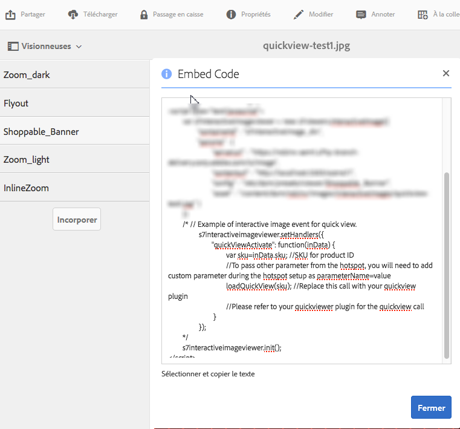

# Création de fenêtres contextuelles personnalisées à l’aide d’aperçus rapides {#using-quickviews-to-create-custom-pop-ups}

>[!CAUTION]
>
>AEM 6.4 a atteint la fin de la prise en charge étendue et cette documentation n’est plus mise à jour. Pour plus d’informations, voir notre [période de support technique](https://helpx.adobe.com/fr/support/programs/eol-matrix.html). Rechercher les versions prises en charge [here](https://experienceleague.adobe.com/docs/?lang=fr).

L’aperçu rapide par défaut est utilisé dans les expériences de commerce électronique où une fenêtre contextuelle s’affiche avec les informations sur les produits pour générer un achat. Cependant, vous pouvez déclencher le contenu personnalisé à afficher dans les fenêtres contextuelles. Selon la visionneuse que vous utilisez, cette fonctionnalité permet aux utilisateurs de cliquer sur une zone réactive, une miniature ou une zone cliquable pour afficher des informations ou du contenu connexe.

Les aperçus rapides sont pris en charge par les visionneuses suivantes dans Dynamic Media :

* Images interactives (zones réactives cliquables)
* Vidéo interactive (miniatures cliquables pendant la lecture vidéo)
* Bannières carrousel (zones réactives cliquables ou zones cliquables)

Bien que chaque visionneuse ait un mode de fonctionnement distinct, le processus de création d’un aperçu rapide est identique pour les trois visionneuses prises en charge.

**Pour créer des fenêtres contextuelles personnalisées à l’aide d’aperçus rapides :**

1. Créez un aperçu rapide pour une ressource téléchargée.

   En règle générale, vous créez un aperçu rapide au moment où vous modifiez une ressource pour l’utiliser avec la visionneuse que vous utilisez.

   <table> 
    <tbody> 
    <tr> 
    <td><strong>Visionneuse utilisée</strong></td> 
    <td><strong>Procédez comme suit pour créer l’aperçu rapide</strong></td> 
    </tr> 
    <tr> 
    <td>Images interactives</td> 
    <td><a href="/help/assets/interactive-images.md#adding-hotspots-to-an-image-banner" target="_blank">Ajout de zones réactives à une bannière d’image</a>.</td> 
    </tr> 
    <tr> 
    <td>Vidéos interactives</td> 
    <td><a href="/help/assets/interactive-videos.md#adding-interactivity-to-your-video" target="_blank">Ajout d’interactivité à votre vidéo</a>.</td> 
    </tr> 
    <tr> 
    <td>Bannières de carrousel</td> 
    <td><a href="/help/assets/carousel-banners.md#adding-hotspots-or-image-maps-to-an-image-banner" target="_blank">Ajout de zones réactives ou cliquables à une bannière</a>.<br /> </td> 
    </tr> 
    </tbody> 
   </table>

1. Procurez-vous le code intégré de la visionneuse pour intégrer la visionneuse à votre site web.

   <table> 
    <tbody> 
    <tr> 
    <td><strong>Visionneuse utilisée</strong><br /> </td> 
    <td><strong>Procédure à suivre pour intégrer la visionneuse à votre site web</strong></td> 
    </tr> 
    <tr> 
    <td>Image interactive</td> 
    <td><a href="/help/assets/interactive-images.md#integrating-an-interactive-image-with-your-website" target="_blank">Intégration d’une image interactive à votre site web</a>.<br /> </td> 
    </tr> 
    <tr> 
    <td>Vidéo interactive<br /> </td> 
    <td><a href="/help/assets/interactive-videos.md#integrating-an-interactive-video-with-your-website" target="_blank">Intégration d’une vidéo interactive à votre site web</a>.<br /> </td> 
    </tr> 
    <tr> 
    <td>Bannière de carrousel</td> 
    <td><a href="/help/assets/carousel-banners.md#adding-a-carousel-banner-to-your-website-page" target="_blank">Ajout d’une bannière de carrousel à votre page web</a>.<br /> </td> 
    </tr> 
    </tbody> 
   </table>

1. La visionneuse que vous utilisez actuellement doit savoir comment prendre en charge l’aperçu rapide.

   Pour ce faire, la visionneuse utilise un gestionnaire appelé `QuickViewActive`.

   **Exemple** Supposons que vous utilisiez le code d’intégration suivant dans votre page web pour une image interactive :

   

   Le gestionnaire est chargé dans la visionneuse à l’aide de `setHandlers` :

   `*viewerInstance*.setHandlers({ *handler 1*, *handler 2*}, ...`

   **En utilisant l’exemple de code d’intégration ci-dessus, nous obtenons le code suivant :**

   ```xml
   s7interactiveimageviewer.setHandlers({
       quickViewActivate": function(inData) {
           var sku=inData.sku;
           var genericVariable1=inData.genericVariable1;
           var genericVariable2=inData.genericVariable2;
          loadQuickView(sku,genericVariable1,genericVariable2);
       }
   })
   ```

   Pour en savoir plus sur la méthode `setHandlers()`, rendez-vous sur la page suivante :

   * Visionneuse d’images interactive : [setHandlers](https://experienceleague.adobe.com/docs/dynamic-media-developer-resources/library/viewers-for-aem-assets-only/interactive-images/jsapi-interactive-image/r-html5-aem-int-image-viewer-javascriptapiref-sethandlers.html?lang=fr)
   * Visionneuse vidéo interactive : [setHandlers](https://experienceleague.adobe.com/docs/dynamic-media-developer-resources/library/viewers-for-aem-assets-only/interactive-video/jsapi-interactive-video/r-html5-aem-int-video-javascriptapiref-sethandlers.html?lang=fr)

1. Vous devez maintenant configurer le gestionnaire `quickViewActivate`.

   Le gestionnaire quickViewActivate contrôle les aperçus rapides dans la visionneuse. Le gestionnaire contient les appels de la liste de variables et de fonctions utilisables avec l’aperçu rapide. Le code incorporé fournit un mappage pour la variable SKU définie dans l’aperçu rapide, ainsi qu’un exemple d’appel de fonction loadQuickView .

   **Correspondance de variables** Mappez les variables utilisables dans votre page web avec la valeur de SKU et les variables génériques dans l’aperçu rapide :

   `var *variable1*= inData.*quickviewVariable*`

   Le code d’intégration fourni comporte un exemple de mise en correspondance pour la variable SKU :

   `var sku=inData.sku`

   Mappez des variables à partir de l’aperçu rapide également, comme dans ce qui suit :

   ```
   var <i>variable2</i>= inData.<i>quickviewVariable2</i> 
    var <i>variable3</i>= inData.<i>quickviewVariable3</i>
   ```

   **Appel de fonction** Le gestionnaire nécessite également un appel de fonction pour que l’aperçu rapide fonctionne. La fonction est supposée être accessible par la page hôte. Le code incorporé fournit un exemple d’appel de fonction :

   `loadQuickView(sku)`

   L’exemple d’appel de fonction suppose que la fonction `loadQuickView()` existe et qu’elle est accessible.

   Pour en savoir plus sur la méthode quickViewActivate, voir :

   * Visionneuse d’images interactive – [Rappels d’événement](https://experienceleague.adobe.com/docs/dynamic-media-developer-resources/library/viewers-for-aem-assets-only/interactive-images/c-html5-aem-interactive-image-event-callbacks.html?lang=fr)
   * Visionneuse de vidéos interactive – [Rappels d’événement](https://experienceleague.adobe.com/docs/dynamic-media-developer-resources/library/viewers-for-aem-assets-only/interactive-video/c-html5-aem-int-video-event-callbacks.html?lang=fr)
   * Prise en charge de données interactives dans la visionneuse de vidéos interactive – [Prise en charge de données interactives](https://experienceleague.adobe.com/docs/dynamic-media-developer-resources/library/viewers-for-aem-assets-only/interactive-video/c-html5-aem-int-video-int-data-support.html?lang=fr)

1. Procédez comme suit :

   * Supprimez les commentaires de la section setHandlers du code incorporé.
   * Mappez toutes les variables supplémentaires contenues dans l’aperçu rapide.

      * Mettez à jour l’appel `loadQuickView(sku,*var1*,*var2*)` si vous ajoutez des variables supplémentaires.
   * Créez une fonction loadQuickView () simple sur la page, en dehors de la visionneuse.

      Par exemple, le code suivant écrit la valeur de SKU dans la console du navigateur :

   ```xml
   function loadQuickView(sku){
       console.log ("quickview sku value is " + sku);
   }
   ```

   * Chargez une page HTML de test sur un serveur web et ouvrez-la.

      Avec les variables mappées à partir de l’aperçu rapide et l’appel de fonction défini, la console du navigateur affiche la valeur de la variable à l’aide de l’exemple de fonction fourni.


1. Vous pouvez désormais utiliser la fonction pour appeler une fenêtre contextuelle simple dans l’aperçu rapide. L’exemple suivant utilise une balise `DIV` pour une fenêtre contextuelle.
1. Mettez en forme la balise `DIV` de la fenêtre contextuelle comme suit. Ajoutez votre propre style supplémentaire comme vous le souhaitez.

   ```xml
   <style type="text/css">
       #quickview_div{
           position: absolute;
           z-index: 99999999;
           display: none;
       }
   </style>
   ```

1. Placez la balise `DIV` de la fenêtre contextuelle dans le corps de la page HTML.

   L’un des éléments est défini avec un ID qui est mis à jour avec la valeur sku lorsque l’utilisateur appelle un aperçu rapide. L’exemple comprend également un bouton unique pour masquer à nouveau la fenêtre contextuelle une fois qu’elle devient visible.

   ```xml
   <div id="quickview_div" >
       <table>
           <tr><td><input id="btnClosePopup" type="button" value="Close"        onclick='document.getElementById("quickview_div").style.display="none"' /><br /></td></tr>
           <tr><td>SKU</td><td><input type="text" id="txtSku" name="txtSku"></td></tr>
       </table>
   </div>
   ```

1. Ajoutez une fonction pour mettre à jour la valeur de SKU dans la fenêtre contextuelle ; rendez la fenêtre contextuelle visible en remplaçant la fonction simple créée à l’étape 5. avec ce qui suit :

   ```xml
   <script type="text/javascript">
       function loadQuickView(sku){
           document.getElementById("txtSku").setAttribute("value",sku); // write sku value
           document.getElementById("quickview_div").style.display="block"; // show popup
       }
   </script>
   ```

1. Téléchargez une page HTML de test sur votre serveur Web et ouvrez-la. La visionneuse affiche le séparateur `DIV` de la fenêtre contextuelle lorsqu’un utilisateur appelle un aperçu rapide.
1. **Affichage de la fenêtre contextuelle personnalisée en mode plein écran**

   Certaines visionneuses, comme la visionneuse de vidéos interactives, prennent en charge l’affichage en mode plein écran. Toutefois, l’utilisation de la fenêtre contextuelle comme décrit dans les étapes précédentes provoque l’affichage de celle-ci derrière la visionneuse en mode plein écran.

   Pour afficher la fenêtre contextuelle en mode standard et plein écran, vous joignez la fenêtre contextuelle au conteneur de la visionneuse. Pour ce faire, vous pouvez utiliser une deuxième méthode de gestionnaire, `initComplete`.

   Le gestionnaire `initComplete` est appelé après l’initialisation de la visionneuse.

   ```xml
   "initComplete":function() { code block }
   ```

   Pour en savoir plus sur la méthode `init()`, rendez-vous sur la page suivante :

   * Visionneuse d’image interactive – [init](https://experienceleague.adobe.com/docs/dynamic-media-developer-resources/library/viewers-for-aem-assets-only/interactive-images/jsapi-interactive-image/r-html5-aem-int-image-viewer-javascriptapiref-init.html?lang=fr)
   * Visionneuse de vidéo interactive – [init](https://experienceleague.adobe.com/docs/dynamic-media-developer-resources/library/viewers-for-aem-assets-only/interactive-video/jsapi-interactive-video/r-html5-aem-int-video-javascriptapiref-init.html?lang=fr)

1. Pour associer la fenêtre contextuelle (décrite dans les étapes précédentes) à la visionneuse, utilisez le code suivant :

   ```xml
   "initComplete":function() {
       var popup = document.getElementById('quickview_div');
       popup.parentNode.removeChild(popup);
       var sdkContainerId = s7interactivevideoviewer.getComponent("container").getInnerContainerId();
       var inner_container = document.getElementById(sdkContainerId);
       inner_container.appendChild(popup);
   }
   ```

   Dans le code ci-dessus, nous avons effectué les opérations suivantes :

   * Identification de notre fenêtre contextuelle personnalisée.
   * Suppression de la bibliothèque du modèle DOM.
   * Identification du conteneur de la visionneuse.
   * Ajout de la fenêtre contextuelle au conteneur de la visionneuse.

1. L’intégralité du code setHandlers doit maintenant ressembler à ce qui suit (la visionneuse de vidéo interactive a été utilisée) :

   ```xml
   s7interactivevideoviewer.setHandlers({
       "quickViewActivate": function(inData) {
           var sku=inData.sku;
           loadQuickView(sku);
   
       },
       "initComplete":function() {
           var popup = document.getElementById('quickview_div'); // get custom quick view container
           popup.parentNode.removeChild(popup); // remove it from current DOM
           var sdkContainerId = s7interactivevideoviewer.getComponent("container").getInnerContainerId();
           var inner_container = document.getElementById(sdkContainerId);
           inner_container.appendChild(popup);
       }
   });
   ```

1. Une fois les gestionnaires chargés, vous initialisez la visionneuse :

   `*viewerInstance.*init()`

   **Exemple** Cet exemple utilise la visionneuse d’images interactives.

   `s7interactiveimageviewer.init()`

   Après avoir intégré la visionneuse dans votre page hôte, assurez-vous que l’instance de la visionneuse est créée et que les gestionnaires sont chargés avant l’appel de celle-ci à l’aide de `init()`.
