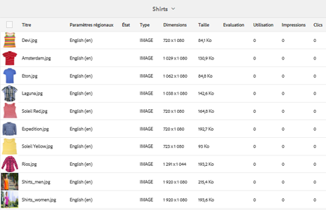
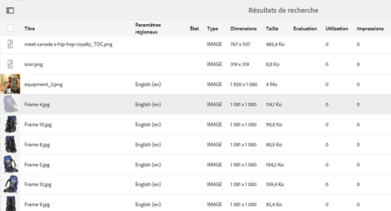
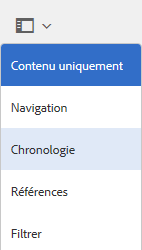
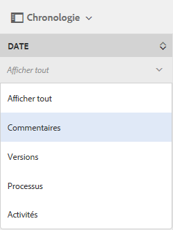

# Amélioration du tri des ressources dans [!DNL Experience Manager] {#enhanced-sorting-of-assets-in-aem}

>[!CAUTION]
>
>AEM 6.4 a atteint la fin de la prise en charge étendue et cette documentation n’est plus mise à jour. Pour plus d’informations, voir notre [période de support technique](https://helpx.adobe.com/fr/support/programs/eol-matrix.html). Rechercher les versions prises en charge [here](https://experienceleague.adobe.com/docs/?lang=fr).

Découvrez comment [!DNL Experience Manager] Assets déploie le tri côté serveur pour trier simultanément les ressources de dossier ou une requête de recherche au lieu de les trier par lots côté client.

La fonctionnalité de recherche d’Adobe Experience Manager Assets est améliorée afin de trier efficacement un grand nombre de ressources dans la vue Liste de dossiers et les pages de résultats de recherche. Vous pouvez également trier les entrées de la chronologie.

[!DNL Experience Manager] Assets déploie le tri côté serveur pour trier l’ensemble des ressources (quelle que soit leur taille) dans un dossier ou une requête de recherche à la fois au lieu de les trier par lots côté client. Ainsi, les résultats prérécupérés peuvent être rapidement affichés dans l’interface utilisateur, ce qui rend l’opération de tri plus réactive et plus rapide.

## Tri des ressources en mode Liste {#sorting-assets-in-list-view}

[!DNL Experience Manager] Assets vous permet de trier des ressources de dossier en fonction des champs suivants :

* Paramètres régionaux
* Statut
* Type
* Taille
* Évaluation
* Date de modification
* Date de publication
* Utilisation
* Clics
* Impressions
* Extraits

1. Accédez à un dossier contenant un grand nombre de ressources.
1. Cliquez/appuyez sur l’icône Mise en page et basculez vers le mode Liste.

   

1. Cliquez/appuyez sur l’icône Trier en regard de l’en-tête d’une colonne dans la liste des ressources.

   

   La liste des ressources est triée en fonction des valeurs des champs.

   

>[!NOTE]
>
>Pour trier les valeurs de la variable `Name` ou le `Title`colonnes, superposition `/libs/dam/gui/content/commons/availablecolumns` et modifiez la valeur de `sortable` to `True`.

## Tri des ressources dans les résultats de recherche {#sorting-assets-in-search-results}

Vous pouvez trier les résultats de la recherche en fonction des champs suivants :

* Titre
* Statut
* Type
* Taille
* Date de modification
* Date de publication

1. Dans la zone Omni-recherche, recherchez des ressources en fonction des critères souhaités.

   

1. Cliquez/appuyez sur l’icône Mise en page et basculez vers le mode Liste. Si les résultats de la recherche sont déjà affichés en mode Liste, ignorez cette étape.
1. Cliquez/appuyez sur l’icône Trier en regard de l’en-tête d’une colonne dans la liste des ressources. La liste des ressources est triée en fonction des valeurs des champs.

   

## Tri des ressources dans la chronologie {#sorting-assets-in-timeline}

[!DNL Assets] permet de trier de manière chronologique les entrées de la chronologie, telles que les annotations, les versions, les workflows et les activités.

1. Dans l’interface utilisateur d’Assets, sélectionnez une ressource pour laquelle afficher la chronologie.
1. Cliquez/appuyez sur l’icône de navigation globale et sélectionnez **[!UICONTROL Chronologie]**.

   

1. Dans la chronologie, sélectionnez une entrée dans la liste. Par exemple, sélectionnez **[!UICONTROL Commentaires]** pour afficher la liste des annotations associées à la ressource.

   

1. Cliquez/appuyez sur **[!UICONTROL Tri]** en regard de l’icône **[!UICONTROL Date]** libellé. Selon votre sélection, les annotations sont répertoriées dans l’ordre chronologique chronologique (chronologique/inverse) dans lequel elles ont été ajoutées à la ressource.

   
