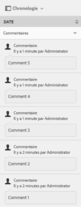

# Tri optimisé des ressources dans AEM {#enhanced-sorting-of-assets-in-aem}

Découvrez comment AEM Assets déploie le tri côté serveur de façon à trier les ressources d’un dossier ou une requête de recherche en une seule fois au lieu de les trier par lots du côté client.

La fonctionnalité de recherche d’Adobe Experience Manager (AEM) a été améliorée afin de permettre un tri efficace d’un grand nombre de ressources en mode Liste de dossiers et dans les pages des résultats de recherche. Vous pouvez également trier les entrées de la chronologie.

AEM Assets déploie une fonction de tri côté serveur pour trier tout le jeu de ressources (quelle que soit sa taille) au sein d’un dossier ou d’une requête de recherche en une seule fois plutôt que par lots du côté client. Cela permet d’afficher rapidement les résultats pré-extraits sur l’interface utilisateur, ce qui se traduit par une opération de tri plus vive et réactive.

## Tri des ressources en mode Liste  {#sorting-assets-in-list-view}

AEM Assets vous permet de trier les ressources de dossier sur la base des champs suivants :

* Paramètres régionaux
* État
* Type
* Taille
* Évaluation
* Date de modification
* Date de publication
* Utilisation
* Clics
* Impressions
* Extraits

1. Accédez à un dossier contenant un grand nombre de ressources.
1. Cliquez/appuyez sur l’icône Mise en page et basculez vers le mode Liste.

   

1. Cliquez/appuyez sur l’icône Trier en regard de l’en-tête d’une colonne dans la liste des ressources.

   

   La liste des ressources est triée en fonction des valeurs de champ.

   

>[!NOTE]
>
>Pour trier les valeurs des colonnes `Name` ou `Title`, superposez `/libs/dam/gui/content/commons/availablecolumns` et remplacez la valeur `sortable` par `True`.

## Tri des ressources dans les résultats de la recherche {#sorting-assets-in-search-results}

Vous pouvez trier les résultats de la recherche en fonction des champs suivants :

* Title (Titre)
* État
* Type
* Taille
* Date de modification
* Date de publication

1. Dans le champ Omni-recherche, recherchez des ressources sur la base des critères de votre choix.

   

1. Cliquez/appuyez sur l’icône Mise en page et basculez vers le mode Liste. Si les résultats de la recherche sont déjà affichés en mode Liste, ignorez cette étape.
1. Cliquez/appuyez sur l’icône Trier en regard de l’en-tête d’une colonne dans la liste des ressources. La liste des ressources est triée en fonction des valeurs de champ.

   

## Tri des ressources dans la chronologie {#sorting-assets-in-timeline}

AEM Assets vous permet de trier les entrées de la frise (annotations, versions, processus, activités, etc.) par ordre chronologique.

1. Dans l’interface utilisateur d’Assets, sélectionnez une ressource dont vous souhaitez afficher la chronologie.
1. Cliquez/appuyez sur l’icône de navigation globale, puis sélectionnez **[!UICONTROL Chronologie]**.

   

1. Sélectionnez une entrée dans la liste de la chronologie. Sélectionnez, par exemple, **[!UICONTROL Commentaires]** pour afficher la liste des annotations associées à la ressource.

   

1. Cliquez/appuyez sur l’icône **[!UICONTROL Trier]** en regard du libellé **[!UICONTROL Date]**. En fonction de votre sélection, les annotations sont répertoriées dans l’ordre dans lequel elles ont été ajoutées à la ressource ou dans l’ordre chronologique inverse.

   

