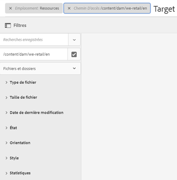

# Recherche de texte intégral GQL {#gql-full-text-search}

Explorez la fonction de recherche de texte intégral GQL dans AEM Assets. Utilisez-la afin de rechercher des ressources selon des métadonnées spécifiques telles que le titre, la description et le nom de l’auteur.

La fonctionnalité de recherche en texte intégral GQL permet de rechercher des ressources selon des métadonnées spécifiques telles que le titre, la description, l’auteur, etc.

Pour rechercher un fichier en fonction de ses métadonnées, par exemple le titre, spécifiez le mot-clé de métadonnées suivi de sa valeur dans le panneau de recherche. La fonction de recherche de texte intégral de GQL récupère uniquement les fichiers dont les métadonnées correspondent exactement à la valeur correspondante saisie.

Pour rechercher, par exemple, les ressources dont le titre est « Cible », suivez ces étapes :

## Recherche de ressources  {#searching-assets}

1. Dans la barre d&#39;outils de l&#39;interface utilisateur Ressources, cliquez ou appuyez sur l&#39;icône **[!UICONTROL Rechercher]** pour afficher la zone Omnisearch.

   

1. Le curseur étant situé dans la zone de recherche, appuyez sur la touche Entrée.
1. Cliquez ou appuyez sur l’icône GlobalNav pour afficher le panneau **[!UICONTROL Filtres]**.
1. Indiquez la valeur « Cible » dans le champ de recherche. Pour limiter la recherche à un dossier spécifique, cliquez ou appuyez sur l’icône Parcourir dans le panneau Filtres et sélectionnez le dossier. Dans ce cas, la correspondance est recherchée uniquement dans le dossier et les sous-dossiers.

   >[!NOTE]
   >
   >Vous pouvez également effectuer une recherche de texte intégral dans un dossier. Dans ce cas, vous devez spécifier un terme de recherche de texte intégral non vide.

   

1. Appuyez sur **[!UICONTROL Entrée]**. L’interface utilisateur AEM Assets affiche uniquement les ressources dont le titre correspond exactement à &quot;Cible&quot;.

La fonction de recherche en texte intégral de GQL vous permet de rechercher des fichiers en fonction des éléments suivants :

* Requête complexe créée en combinant les valeurs spécifiées pour plusieurs champs de métadonnées (propriétés) par une opération ET
* Plusieurs valeurs pour un seul champ de métadonnées
* Correspondances avec des sous-chaînes

La fonction de recherche en texte intégral de GQL vous permet de rechercher des fichiers en fonction des propriétés de métadonnées suivantes. Les noms des propriétés (par exemple auteur, titre, etc.) ainsi que les valeurs sont sensibles à la casse.

>[!NOTE]
>
>La recherche de texte intégral GQL fonctionne uniquement pour les prédicats de texte intégral.

| Propriété | Format de recherche (valeur de facette) |
|---|---|
| [!UICONTROL Titre] | title:John |
| [!UICONTROL Créateur] | creator:John |
| [!UICONTROL Contributeur] | contributor:John |
| [!UICONTROL Emplacement] | location:India |
| [!UICONTROL Description] | description:&quot;Sample Image&quot; |
| [!UICONTROL Outil créateur] | creatortool:&quot;Adobe Photoshop 7.0&quot; |
| [!UICONTROL Détenteur de copyright] | copyrightowner:&quot;Adobe Systems&quot; |
| [!UICONTROL Contributeur] | contributeur:John |
| [!UICONTROL Conditions d’utilisation] | usageterms:&quot;CopyRights Reserved&quot; |
| [!UICONTROL Créé] | créé:AAAA-MM-DTHH:MM:SS.000+05:30..AAAA-MM-DTHH:MM:SS.000+05:30 |
| [!UICONTROL Date d’expiration] | expire : AAAA-MM-DTHH:MM:SS.000+05:30..AAAA-MM-DTHH:MM:SS.000+05:30 |
| [!UICONTROL Heure d’activation] | ontime:YYYY-MM-DTHH:MM:SS.000+05:30..AAAA-MM-DTHH:MM:SS.000+05:30 |
| [!UICONTROL Heure de désactivation] | off-time:AAAA-MM-DTHH:MM:SS.000+05:30..AAAA-MM-DTHH:MM:SS.000+05:30 |
| [!UICONTROL Plage de temps]  (expire la date, l’heure, l’heure d’arrêt) | facet field : lowerboundupperbound |
| [!UICONTROL Chemin] | /content/dam/&lt;nom_dossier> |
| [!UICONTROL Titre du PDF] | pdftitle:&quot;Adobe Document&quot; |
| [!UICONTROL Objet] | subject:&quot;Training&quot; |
| [!UICONTROL Balises] | tags:&quot;Location And Travel&quot; |
| [!UICONTROL Type] | type:&quot;image\png&quot; |
| [!UICONTROL Largeur de l’image] | width:lowerboundsupérieur |
| [!UICONTROL Hauteur de l’image] | height:lowerboundsupérieur |
| [!UICONTROL Personne] | person:John |

Voici quelques exemples de formats de recherche pour des requêtes complexes :

* Pour afficher toutes les ressources avec plusieurs champs de facettes (par exemple : title=John Doe et creator tool=Adobe Photoshop) :

tiltle : &quot;John Doe&quot;, outil de création : Adobe&amp;amp ; ast;

* Pour afficher toutes les ressources lorsque la valeur de la facette est une expression et non un seul mot (par exemple : title=Scott Reynolds) :

title:&quot;Scott Reynolds&quot;

* Pour afficher les ressources avec plusieurs valeurs d’une seule propriété (title=Scott Reynolds ou John Doe, par exemple) :

title:&quot;Scott Reynolds&quot; OR &quot;John Doe&quot;

* Pour afficher les ressources avec des valeurs de propriété commençant par une chaîne spécifique (par exemple : title is Scott Reynolds) :

titre : &quot;Scott&quot;

* Pour afficher les ressources avec des valeurs de propriété se terminant par une chaîne spécifique (par exemple : title is Scott Reynolds) :

titre : &quot;Reynolds&quot;

* Pour afficher les ressources avec une valeur de propriété contenant une chaîne spécifique (par exemple : title = Basel Meeting Room) :

titre : &quot;Réunion&quot;;

* Pour afficher les ressources qui contiennent une chaîne spécifique et qui possèdent une valeur de propriété en particulier (par exemple : search for string Adobe in assets having title=John Doe) :

&amp;ast;Adobe&amp;ast; titre : &quot;John Doe &quot;OR title:&quot;John Doe&quot; &amp;ast;Adobe&amp;ast;

>[!NOTE]
>
>Les propriétés path, limit, size et orderby ne peuvent pas être combinées à une autre propriété avec un opérateur OU.
>
>Le mot-clé d’une propriété générée par un utilisateur correspond au libellé de son champ dans l’éditeur de propriétés en minuscules et sans espace.

>[!NOTE]
>
>Si vous écrivez une requête JCR pour rechercher des sous-ressources uniquement, les ressources référencées correspondantes sont également affichées avec les sous-ressources correspondantes.

La recherche de texte intégral prend également en charge des opérateurs tels que -, ^, etc. Pour rechercher des informations sous forme de chaînes littérales, indiquez la phrase de recherche entre guillemets. Par exemple, entrez « Notebook - Beauté » au lieu de Notebook - Beauté.

## Amélioration de la recherche {#boosting-search}

Vous pouvez améliorer la pertinence des mots-clés pour des ressources données afin d’améliorer les résultats de recherches basées sur ces mots-clés. En d’autres termes, les images pour lesquelles vous faites la promotion de mots-clés spécifiques apparaissent en haut des résultats lorsque vous lancez une recherche basée sur ces mots-clés.

1. Depuis l’interface utilisateur Ressources, ouvrez la page des propriétés de la ressource pour lequelle vous souhaitez promouvoir un mot-clé.
1. Basculez sur l’onglet **[!UICONTROL Avancé]**, puis cliquez/appuyez sur **[!UICONTROL Ajouter]** sous **[!UICONTROL Élever pour les mots-clés de recherche]**.

   

1. Dans la boîte de dialogue **[!UICONTROL Rechercher une promotion]**, indiquez un mot-clé pour lequel vous souhaitez améliorer la recherche d’image, puis cliquez/appuyez sur **[!UICONTROL Ajouter]**. Si nécessaire, indiquez plusieurs mots-clés de la même manière.

   

1. Cliquez/appuyez sur **[!UICONTROL Enregistrer et fermer]**.
1. Recherche de mots-clés à l’aide de la boîte de dialogue Omni-recherche. La ressource pour laquelle vous avez fait la promotion de ce mot-clé apparaît en haut des résultats de recherche.