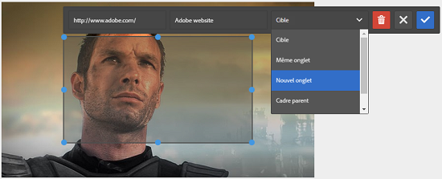

# Ajouter des zones cliquables {#adding-image-maps}

Découvrez comment ajouter des zones cliquables avec liens hypertexte aux ressources d’images.

Les zones cliquables permettent d’ajouter des zones de lien hypertexte qui fonctionnent comme des liens hypertexte.

1. Utilisez l’une des méthodes suivantes pour ouvrir **[!UICONTROL l’éditeur d’images statique]** :

   * A l’aide des actions rapides, appuyez sur l’icône **[!UICONTROL Modifier]** qui apparaît sur une ressource dans la vue **[!UICONTROL Carte]**. Dans la vue de Liste, sélectionnez la ressource et appuyez sur l’icône **Modifier** de la barre d’outils.

      >[!NOTE]
      >
      >Les actions rapides ne sont pas disponibles dans la vue **[!UICONTROL Liste]**.

   * Dans la vue **[!UICONTROL Carte]** ou **[!UICONTROL Liste]**, sélectionnez la ressource et appuyez sur l&#39;icône **[!UICONTROL Modifier]** de la barre d&#39;outils.
   * Appuyez sur l&#39;icône **[!UICONTROL Modifier]** de la page de ressources.

      

1. Pour insérer une zone cliquable, appuyez sur l’icône **[!UICONTROL Lancer la zone cliquable]** de la barre d’outils.

   

1. Sélectionnez la forme de la zone cliquable. La zone réactive de la forme sélectionnée est placée sur la zone.

   

1. Appuyez sur la zone réactive, puis saisissez l’URL et le texte Alt. Dans la liste **[!UICONTROL Cible]**, spécifiez l’emplacement d’affichage de la zone cliquable, par exemple le même onglet, un nouvel onglet ou un iFrame. Par exemple, saisissez `https://www.adobe.com` comme URL, `Adobe website` comme texte Alt et indiquez **[!UICONTROL Nouvel onglet]** dans la liste **[!UICONTROL Cible]** pour que la zone cliquable s’ouvre dans un nouvel onglet.

   

1. Appuyez sur l&#39;icône **[!UICONTROL Confirmer]**, puis sur l&#39;icône **[!UICONTROL Terminer]** de la barre d&#39;outils pour enregistrer les modifications.

   

   Pour supprimer la zone cliquable, appuyez sur la zone chaude et appuyez sur l’icône **[!UICONTROL Supprimer]**.

   

1. Pour vue de la zone cliquable, accédez à la page des détails du fichier, puis placez le curseur sur l’image.

   

   Si l’option Dynamic Media est activée, accédez à l’éditeur de ressources et appuyez sur l’icône **[!UICONTROL Mapper]** pour vue toutes les zones cliquables appliquées.
