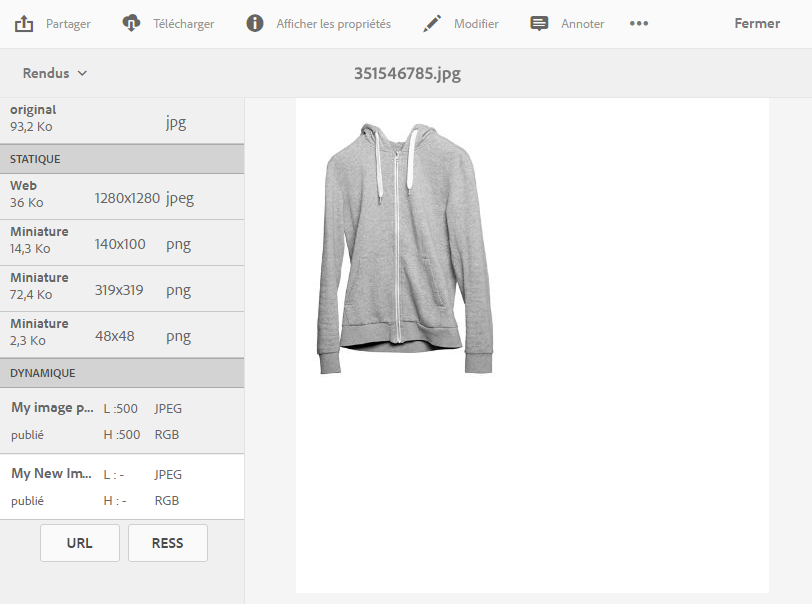

# Application de paramètres d’image prédéfinis Dynamic Media {#applying-image-presets}

Les préréglages d’image permettent aux ressources de fournir dynamiquement des images de différentes tailles, dans différents formats ou avec d’autres propriétés d’image qui sont générées dynamiquement. Vous pouvez choisir un paramètre prédéfini lorsque vous exportez des images, ce qui modifie également le format des images selon les spécifications définies par l&#39;administrateur.

Vous pouvez en outre sélectionner un paramètre prédéfini d’image réactif (signalé par le bouton **[!UICONTROL RESS]** une fois que vous l’avez sélectionné).

Cette section décrit comment utiliser les paramètres d’image prédéfinis. [L’administration peut créer et configurer des paramètres prédéfinis d’image](managing-image-presets.md).

>[!NOTE]
>
>L’imagerie dynamique fonctionne avec vos paramètres d’image prédéfinis et utilise des informations à la dernière milliseconde de la diffusion pour réduire davantage encore la taille du fichier d’image en fonction de la vitesse de connexion du réseau et du navigateur. Voir [Imagerie numérique](imaging-faq.md) pour plus d’informations.

Vous pouvez appliquer un paramètre d’image prédéfini à une image lorsque vous la prévisualisez.

**Pour appliquer des paramètres d’image prédéfinis Dynamic Media**:

1. Ouvrez la ressource et, dans le rail de gauche, sélectionnez dans le menu déroulant l’option **[!UICONTROL Rendus]**.

   >[!NOTE]
   >
   >* Les rendus statiques apparaissent dans la moitié supérieure du volet. Les rendus dynamiques apparaissent dans la moitié inférieure. Avec des rendus dynamiques uniquement, vous pouvez utiliser l’URL pour afficher l’image. Le bouton **[!UICONTROL URL]** apparaît uniquement lorsque vous sélectionnez un rendu dynamique. Le bouton **[!UICONTROL RESS]** ne s’affiche que lorsque vous sélectionnez un paramètre d’image prédéfini réactif.
   >
   >* Le système affiche plusieurs rendus lorsque vous sélectionnez **[!UICONTROL Rendus]** dans l’affichage des détails d’une ressource. Vous pouvez augmenter le nombre de paramètres prédéfinis visibles. Voir [Augmentation du nombre de paramètres d’image prédéfinis affichés](managing-image-presets.md#increasing-or-decreasing-the-number-of-image-presets-that-display).

   

1. Procédez de l’une des manières suivantes :

   * Sélectionnez un rendu dynamique pour afficher un aperçu du paramètre d’image prédéfini.
   * Appuyez sur **[!UICONTROL URL]**, **[!UICONTROL Incorporer]** ou **[!UICONTROL RESS]** pour afficher la fenêtre contextuelle.

   >[!NOTE]
   >
   >Si la ressource *et* le paramètre d’image prédéfini ne sont pas encore publiés, le bouton **[!UICONTROL URL]** (ou les boutons **[!UICONTROL URL]** et **[!UICONTROL RESS]**, le cas échéant) n’est pas disponible.
   >
   >Notez également que les paramètres prédéfinis de l’image sont automatiquement publiés sur un serveur Dynamic Media 
