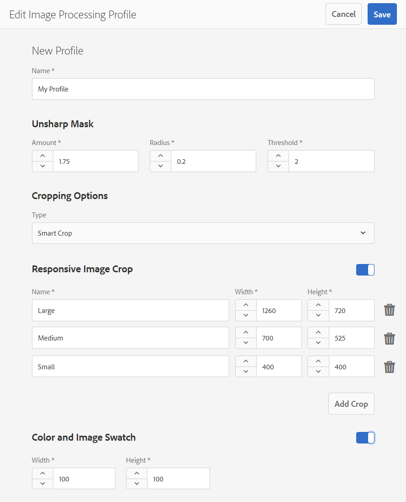
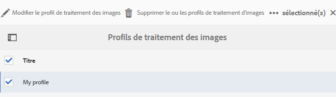
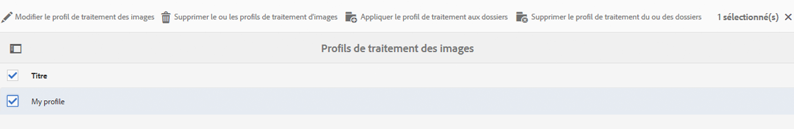
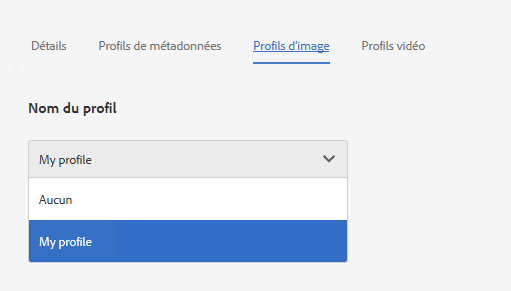
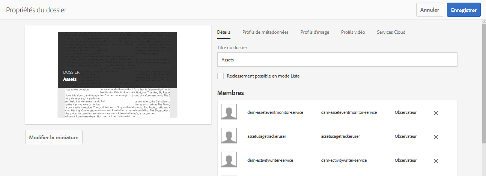
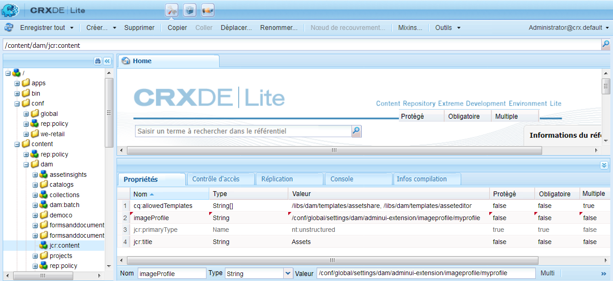

# Profils d’image Dynamic Media {#image-profiles}

>[!CAUTION]
>
>AEM 6.4 a atteint la fin de la prise en charge étendue et cette documentation n’est plus mise à jour. Pour plus d’informations, voir notre [période de support technique](https://helpx.adobe.com/fr/support/programs/eol-matrix.html). Rechercher les versions prises en charge [here](https://experienceleague.adobe.com/docs/?lang=fr).

Lorsque vous chargez des images, vous pouvez les recadrer automatiquement en appliquant un profil d’image au dossier.

>[!NOTE]
>
>Le recadrage intelligent est disponible uniquement dans Dynamic Media en mode Scene7.

>[!IMPORTANT]
>
>Les profils d’image ne s’appliquent pas aux fichiers PDF, GIF animé ou INDD (Adobe InDesign).

## Options de recadrage {#crop-options}

Lorsque vous implémentez le recadrage intelligent sur les images, Adobe recommande les bonnes pratiques suivantes et applique la limite suivante :

| Type de limite | Bonne pratique | Limite imposée |
| --- | --- | --- |
| Nombre de recadrages intelligents par image | 5 | 100 |

Consultez également la section [limites de Dynamic Media](/help/assets/limitations.md).

<!-- CQDOC-16069 for paragraph directly below -->

Les coordonnées de recadrage intelligent dépendent des proportions de l’image (L/H). En d’autres termes, pour chaque paramètre de recadrage intelligent d’un profil d’image, si le rapport d’aspect est le même pour les dimensions ajoutées dans le profil d’image, le même rapport d’aspect est envoyé à Dynamic Media. Par conséquent, Adobe vous recommande d’utiliser la même zone de recadrage. Vous avez ainsi la garantie qu’il n’y a aucune incidence sur les différentes dimensions utilisées dans le profil d’image.

Chaque génération de recadrage intelligent créée nécessite un traitement supplémentaire. Par exemple, l’ajout de plus de cinq proportions de recadrage intelligent peut ralentir le taux d’ingestion des ressources. Cet ajout peut également augmenter la charge des systèmes. Étant donné que le recadrage intelligent s’applique aux dossiers, Adobe vous recommande de l’utiliser *uniquement* pour les dossiers où cela est nécessaire.

**Recommandations relatives au recadrage intelligent dans un profil d’image**
Pour garder l’utilisation du recadrage intelligent sous contrôle et optimiser le temps de traitement et le stockage des recadrages, Adobe fournit les pratiques et conseils suivants :

* Évitez de créer des profils de recadrage intelligent en double ayant les mêmes valeurs de largeur et de hauteur.
* Nommez les recadrages intelligents en fonction des dimensions de recadrage et non de leur utilisation finale. Cela permet d’optimiser les doublons lorsqu’une seule dimension est utilisée sur plusieurs pages.
* Créez des profils d’image au niveau de la page ou du type de ressource pour des dossiers et sous-dossiers spécifiques, au lieu d’un profil de recadrage intelligent commun appliqué à tous les dossiers ou ressources.
* Le profil d’image appliqué aux sous-dossiers remplace le profil d’image appliqué au dossier.
* Créez des profils d’image au niveau de la page ou du type de ressource pour des dossiers et sous-dossiers spécifiques, au lieu d’un profil de recadrage intelligent commun appliqué à tous les dossiers ou ressources.
* Le profil d’image appliqué aux sous-dossiers remplace le profil d’image appliqué au dossier.
* Idéalement, effectuez 10 à 15 recadrages intelligents par image afin d’optimiser les proportions et le temps de traitement.

<!--
* Image assets that are going to have a smart crop applied to them must be a minimum of 50 x 50 pixels or larger. CQDOC-20087
* An Image Profile that contains duplicate smart crop dimensions is not permitted. CQDOC-20087
* Duplicate named Image Profiles that have smart crop options set are not permitted. CQDOC-20087
* Create page-wise/asset type-wise Image Profiles for specific folders and subfolders instead of a common smart crop profile that is applied to all folders or all assets.
* An Image Profile that you apply to subfolders overrides an Image Profile that is applied to the folder.
* Ideally, have 10-15 smart crops per image to optimize for screen ratios and processing time. -->
<!-- * Avoid creating duplicate smart crop profiles that have the same width and height values. 
* Name smart crops based on crop dimensions, not on end usage. Doing so helps to optimize for duplicates where a single dimension is used on multiple pages. -->

Vous avez le choix entre deux options de recadrage d’image. Vous pouvez également choisir d’automatiser la création de nuanciers de couleurs et d’images ou de conserver le contenu de recadrage dans toutes les résolutions cibles.

>[!IMPORTANT]
>
>• Adobe vous recommande d’examiner tous les recadrages et tous les échantillons générés afin de vous assurer qu’ils sont appropriés et pertinents pour votre marque et vos valeurs.
• Le format d’image CMJN n’est pas pris en charge avec le recadrage intelligent.

<table> 
 <tbody> 
  <tr> 
   <td><strong>Option</strong></td> 
   <td><strong>Quand l’utiliser</strong></td> 
   <td><strong>Description</strong></td> 
  </tr> 
  <tr> 
   <td>Recadrage des pixels</td> 
   <td>Recadrage en bloc des images en fonction des dimensions uniquement.</td> 
   <td>
Pour utiliser cette option, sélectionnez <strong>Recadrage des pixels</strong> dans la liste déroulante Options de recadrage.
 
Pour recadrer les bords d’une image, entrez le nombre de pixels à recadrer de n’importe quel côté ou de chaque côté de l’image. La proportion du recadrage de l’image dépend du paramètre ppi (pixels par pouce) du fichier d’image.
 
Un recadrage de pixels de profil d’image s’affiche de la manière suivante :  
 
    <ul> 
     <li>Les valeurs sont Haut, Bas, Gauche et Droite.</li> 
     <li>Le coin supérieur gauche est considéré comme 0,0 et le recadrage de pixels est calculé à partir de là.</li> 
     <li>Point de départ du recadrage : la gauche est X et le haut est Y</li> 
     <li>Calcul horizontal : dimension horizontale en pixels de l’image d’origine moins Gauche, puis moins Droite.</li> 
     <li>Calcul vertical : hauteur verticale en pixels moins le Haut puis moins le Bas.</li> 
    </ul> 
Prenons l’exemple d’une image de 4 000 x 3 000 pixels. Les valeurs utilisées sont les suivantes : haut=250, bas=500, gauche=300, droite=700.
 
À partir du coin supérieur gauche (300,250), recadrez l’image en utilisant l’espace de remplissage de (4000-300-700, 3000-250-500 ou 3000,2250).
 </td> 
  </tr> 
  <tr> 
   <td>Recadrage intelligent</td> 
   <td>Recadrer en masse des images en fonction de leur point focal visuel.</td> 
   <td>
Le recadrage intelligent utilise la puissance de l’intelligence artificielle dans Adobe Sensei pour automatiser rapidement le recadrage des images en masse. Il détecte automatiquement le point focal de n’importe quelle image et recadre de façon à capturer le point d’intérêt prévu, quelle que soit la taille de l’écran.
 
Pour utiliser le recadrage intelligent, sélectionnez <strong>Recadrage intelligent</strong> dans la liste déroulante des Options de recadrage, puis à droite de Recadrage d’image réactive, activez la fonction.
 
Les tailles par défaut des points de rupture (Grand, Moyen et Petit) couvrent généralement toute la gamme de tailles utilisées par la plupart des images sur les appareils mobiles, les tablettes, les ordinateurs de bureau et les bannières. Si vous le souhaitez, vous pouvez modifier les noms par défaut des points Grand, Moyen et Petit.
 
Pour ajouter d’autres points d’arrêt, cliquez sur <strong>Ajouter un recadrage</strong>; pour supprimer un recadrage, cliquez sur l’icône poubelle .
 </td> 
  </tr> 
  <tr> 
   <td>Échantillon de couleurs et d’images</td> 
   <td>Générez en bloc un échantillon d’image pour chaque image.</td> 
   <td>
<strong>Remarque</strong> : L’échantillon intelligent n’est pas pris en charge par Dynamic Media Classic.
 
Localisez et générez automatiquement des échantillons de haute qualité à partir d’images de produits qui affichent la couleur ou la texture.
 
Pour utiliser l’échantillon de couleurs et d’images, sélectionnez <strong>Recadrage intelligent</strong> dans la liste déroulante des Options de recadrage, puis à droite d’Échantillon de couleurs et d’images, activez la fonction. Saisissez une valeur en pixels dans les zones de texte Largeur et Hauteur.
 
Alors que tous les recadrages d’images sont disponibles à partir du rail de rendu, les échantillons ne sont utilisés que par le biais de la fonction Copier l’URL. Vous devez utiliser votre propre composant d’affichage pour effectuer le rendu de l’échantillon sur votre site. (Les bannières de carrousel constituent une exception à cette règle. Dynamic Media fournit le composant d’affichage pour l’échantillon utilisé dans les bannières de carrousel.)
 
<strong>Utilisation d’échantillons d’images</strong>
 
L’URL des échantillons d’images est simple :
 
<code>/is/image/company/&lt;asset_name&gt;:Swatch</code>
 
Où <code>:Swatch</code> est ajouté à la demande de ressource.
 
<strong>Utilisation des échantillons de couleurs</strong>
 
Pour utiliser les échantillons de couleurs, vous effectuez une demande <code>req=userdata</code> de la façon suivante :
 
<code>/is/image/&lt;company_name&gt;/&lt;swatch_asset_name&gt;:Swatch?req=userdata</code>
 
Par exemple, voici une ressource d’échantillon dans Dynamic Media Classic :
 
<code>https://my.company.com:8080/is/image/DemoCo/Sleek:Swatch</code>
 
et voici l’URL <code>req=userdata</code> correspondant à la ressource d’échantillon :
 
<code>https://my.company.com:8080/is/image/DemoCo/Sleek:Swatch?req=userdata</code>
 
La réponse <code>req=userdata</code> se présente comme suit :
 
<code class="code">SmartCropDef=Swatch
       SmartCropHeight=200.0
       SmartCropRect=0.421671,0.389815,0.0848564,0.0592593,200,200
       SmartCropType=Swatch
       SmartCropWidth=200.0
       SmartSwatchColor=0xA56DB2</code>
 
Vous pouvez également demander une réponse <code>req=userdata</code> au format XML ou JSON, comme dans les exemples d’URL respectifs suivants :
 
<code>https://my.company.com:8080/is/image/DemoCo/Sleek:Swatch?req=userdata,xml</code>

<code>SmartSwatchColor</code>

</td></tr></tbody></table>

## Accentuation {#unsharp-mask}

Vous utilisez **Accentuation** pour affiner l’effet d’un filtre d’accentuation sur l’image finale à résolution réduite. Vous pouvez contrôler l’intensité de l’effet, le rayon de l’effet (mesuré en pixels) et un seuil de contraste qui est ignoré. Cet effet utilise les mêmes options que le filtre « Accentuation » d’Adobe Photoshop.

>[!NOTE]
L’accentuation n’est appliquée qu’aux rendus réduits au sein du PTIFF (pyramid tiff), dont la résolution est réduite de plus de 50 %. En d’autres termes, les rendus de plus grande taille dans le fichier PTIFF ne sont pas affectés par le masquage flou, tandis que les rendus de plus petite taille, tels que les miniatures, sont modifiés (et affichent le masque flou).

L’option **Accentuation** propose les options de filtre suivantes :

<table> 
 <tbody> 
  <tr> 
   <td><strong>Option</strong></td> 
   <td><strong>Description</strong></td> 
  </tr> 
  <tr> 
   <td>Quantité</td> 
   <td>Contrôle le degré de contraste appliqué aux pixels de contour. La valeur par défaut est 1.75. Pour les images à haute résolution, vous pouvez l’augmenter jusqu’à 5. Considérez la quantité comme une mesure de l’intensité du filtre. La plage est 0 à 5.</td> 
  </tr> 
  <tr> 
   <td>Rayon</td> 
   <td>Détermine le nombre de pixels entourant les pixels de contour qui affectent l’accentuation. Pour les images à haute résolution, entrez une valeur comprise entre 1 et 2. Une valeur faible accentue uniquement les pixels de contour ; une valeur élevée accentue une bande plus large de pixels. La valeur appropriée dépend de la taille de l’image. La valeur par défaut est 0,2. La plage est comprise entre 0 et 250.</td> 
  </tr> 
  <tr> 
   <td>Seuil</td> 
   <td>
Détermine la plage de contraste à ignorer lorsque le filtre d’accentuation est appliqué. En d’autres termes, cette option définit l’écart recherché entre les pixels accentués et la zone environnante avant qu’ils ne soient considérés comme des pixels de contour et ne soient accentués. Pour éviter d’introduire du bruit, essayez des valeurs comprises entre 0 et 255.
 </td> 
  </tr> 
 </tbody> 
</table>

L’accentuation est décrite dans [Accentuation des images](/help/assets/assets/sharpening_images.pdf).

## Création de profils d’image Dynamic Media {#creating-image-profiles}

Pour définir des paramètres de traitement avancés pour d’autres types de ressources, voir [Configuration du traitement des ressources](config-dms7.md#configuring-asset-processing).

**Pour créer des profils d’image Dynamic Media**:

1. Appuyez sur le logo AEM et accédez à **[!UICONTROL Outils > Ressources > Profils d’image]**.
1. Appuyer **[!UICONTROL Créer]** pour ajouter un profil d’image.
1. Saisissez un nom de profil et les valeurs pour une accentuation, un recadrage et un échantillon.

   Il peut s’avérer utile d’utiliser un nom de profil spécifique à son objectif prévu. Par exemple, si vous souhaitez créer un profil qui génère des échantillons uniquement (où le recadrage intelligent est désactivé et l’option Nuance et nuance d’image est activée), vous pouvez utiliser le nom de profil &quot;Nuances d’échantillons intelligentes&quot;.

   Voir aussi [Options de recadrage intelligent et d’échantillonnage intelligent](#crop-options) et [Accentuation](#unsharp-mask).

   

1. Appuyez sur **[!UICONTROL Enregistrer]**. Le profil nouvellement créé apparaît dans la liste des profils disponibles.

## Modification ou suppression de profils d’image Dynamic Media {#editing-or-deleting-image-profiles}

1. Appuyez sur le logo AEM et accédez à **[!UICONTROL Outils > Ressources > Profils d’image]**.
1. Sélectionnez le profil d’image à modifier ou à supprimer. Pour le modifier, sélectionnez **[!UICONTROL Modifier le profil de traitement d’image]**. Pour le supprimer, sélectionnez **[!UICONTROL Supprimer le ou les profils de traitement des images]**.

   

1. En cas de modification, enregistrez les modifications ; en cas de suppression, confirmez la suppression du profil.

## Application d’un profil d’image Dynamic Media aux dossiers {#applying-an-image-profile-to-folders}

Lorsque vous affectez un profil d’image à un dossier, tous les sous-dossiers héritent automatiquement du profil de son dossier parent. Ce processus signifie que vous ne pouvez attribuer qu’un seul profil d’image à un dossier. Ainsi, réfléchissez soigneusement à la structure de dossiers de l’emplacement où vous téléchargez, stockez, utilisez et archivez les ressources.

Si vous avez affecté un profil d’image différent à un dossier, le nouveau profil remplace le précédent. Les ressources du dossier précédent restent inchangées. Le nouveau profil sera appliqué aux ressources ajoutées ultérieurement au dossier.

Les dossiers auxquels un profil est affecté sont indiqués dans l’interface utilisateur par le nom du profil qui apparaît dans la carte.

Lorsque vous ajoutez un recadrage intelligent à un profil d’image existant, vous devez redéclencher la variable [Workflow Ressources de mise à jour de gestion des actifs numériques](assets-workflow.md) si vous souhaitez générer des recadrages pour les ressources existantes dans votre référentiel de ressources.

Vous pouvez appliquer des profils d’image à des dossiers spécifiques, ou de façon globale à toutes les ressources.

### Application de profils d’image Dynamic Media à des dossiers spécifiques {#applying-image-profiles-to-specific-folders}

Vous pouvez appliquer un profil d’image à un dossier à partir du menu **[!UICONTROL Outils]**, ou si vous êtes dans le dossier, via **[!UICONTROL Propriétés]**. Cette section décrit comment appliquer des profils d’image aux dossiers de deux manières.

Dans le cas des dossiers auxquels un profil est déjà affecté, le nom du profil est affiché directement sous celui du dossier.

#### Application de profils d’image Dynamic Media à des dossiers à partir de l’interface utilisateur Profils {#applying-image-profiles-to-folders-from-profiles-user-interface}

1. Appuyez sur le logo AEM et accédez à **[!UICONTROL Outils > Ressources > Profils d’image]**.
1. Sélectionnez le profil d’image à appliquer à un ou plusieurs dossiers.

   

1. Appuyez/cliquez sur **[!UICONTROL Appliquer le profil de traitement au(x) dossier(s)]** et sélectionnez le ou les dossiers que vous souhaitez utiliser pour recevoir les nouvelles ressources chargées, puis appuyez/cliquez sur **[!UICONTROL Appliquer]**. Dans le cas des dossiers auxquels un profil est déjà affecté, le nom du profil est affiché directement sous celui du dossier.

#### Application de profils d’image Dynamic Media aux dossiers à partir des propriétés {#applying-image-profiles-to-folders-from-properties}

1. Appuyez sur le logo AEM et accédez à **[!UICONTROL Ressources]**. Accédez ensuite au dossier parent du dossier auquel vous souhaitez appliquer un profil d’image.
1. Dans le dossier, appuyez sur la coche pour la sélectionner, puis sur **[!UICONTROL Propriétés]**.
1. Appuyez sur l’onglet **[!UICONTROL Profils d’image]**. Dans la liste déroulante **[!UICONTROL Nom du profil]**, sélectionnez le profil, puis appuyez sur **[!UICONTROL Enregistrer et fermer]**. Dans le cas des dossiers auxquels un profil est déjà affecté, le nom du profil est affiché directement sous celui du dossier.

   

### Application globale d’un profil d’image Dynamic Media {#applying-an-image-profile-globally}

Outre l’application d’un profil à un dossier, vous pouvez en appliquer un de manière globale afin que le profil sélectionné soit appliqué à tout contenu chargé dans AEM Assets dans un dossier.

**Pour appliquer globalement un profil d’image Dynamic Media** :

1. Utilisez l’une des méthodes suivantes :

   * Accédez à **https://&lt;aem server=&quot;&quot;>/mnt/overlay/dam/gui/content/assets/foldersharewizard.html/content/dam** et appliquez le profil approprié, puis appuyez sur **Enregistrer**.

      

   * Accédez au nœud suivant de CRXDE Lite : `/content/dam/jcr:content`.

      Ajoutez la propriété `imageProfile:/conf/global/settings/dam/adminui-extension/imageprofile/<name of image profile>` et appuyez sur **[!UICONTROL Enregistrer tout]**.

      

## Modification du recadrage intelligent ou de l’échantillon intelligent d’une seule image {#editing-the-smart-crop-or-smart-swatch-of-a-single-image}

>[!NOTE]
Le recadrage intelligent est disponible uniquement dans Dynamic Media en mode Scene7.

Vous pouvez réaligner ou redimensionner manuellement la fenêtre de recadrage intelligent d’une image afin d’affiner davantage son point focal.

Une fois que vous avez modifié et enregistré un recadrage intelligent, la modification se propage partout où vous utilisez le recadrage pour ces images spécifiques.

Vous pouvez exécuter à nouveau le recadrage intelligent pour générer des recadrages supplémentaires, si nécessaire.

Voir aussi [Modification du recadrage intelligent ou de l’échantillon intelligent de plusieurs images](#editing-the-smart-crop-or-smart-swatch-of-multiple-images).

**Pour modifier le recadrage intelligent ou l’échantillon intelligent d’une seule image** :

1. Appuyez sur le logo AEM et accédez à **[!UICONTROL Ressources]**, puis au dossier auquel est appliqué un profil d’image de recadrage intelligent ou d’échantillon intelligent.
1. Ouvrez son contenu en appuyant sur le dossier .
1. Appuyez sur l’image avec le recadrage intelligent ou l’échantillon intelligent à ajuster.
1. Dans la barre d’outils, appuyez sur **[!UICONTROL Recadrage intelligent]**.

1. Procédez de l’une des manières suivantes :

   * Près du coin supérieur droit de la page, faites glisser le curseur vers la gauche ou la droite pour augmenter ou diminuer l’affichage de l’image.
   * Sur l’image, faites glisser une poignée d’angle pour ajuster la taille de la zone visible du recadrage ou de l’échantillon.
   * Sur l’image, faites glisser la zone/l’échantillon vers un nouvel emplacement. Vous ne pouvez modifier que les échantillons d’images. Les échantillons de couleurs sont statiques.
   * Au-dessus de l’image, appuyez sur **[!UICONTROL Rétablir]** pour annuler toutes les modifications effectuées et restaurer le recadrage ou l’échantillon d’origine.

1. Près du coin supérieur droit de la page, appuyez sur **[!UICONTROL Enregistrer]**, puis appuyez sur **[!UICONTROL Fermer]** pour revenir au dossier des ressources.

## Modification du recadrage intelligent ou de l’échantillon intelligent de plusieurs images {#editing-the-smart-crop-or-smart-swatch-of-multiple-images}

Après l’application d’un profil d’image (contenant un recadrage intelligent) sur un dossier, un recadrage est appliqué à toutes les images de ce dossier. Si vous le souhaitez, vous pouvez réaligner ou redimensionner *manuellement* la fenêtre de recadrage intelligent dans plusieurs images pour affiner davantage leur point focal.

Une fois que vous avez modifié et enregistré un recadrage intelligent, le changement est propagé partout où vous utilisez le recadrage des images spécifiques.

Vous pouvez exécuter à nouveau le recadrage intelligent pour générer des recadrages supplémentaires, si nécessaire.

**Pour modifier le recadrage intelligent ou l’échantillon intelligent de plusieurs images** :

1. Appuyez sur le logo AEM et accédez à **[!UICONTROL Ressources]**, puis à un dossier auquel est appliqué un profil d’image de recadrage intelligent ou d’échantillon intelligent.
1. Sur le dossier, appuyez sur l’icône **[!UICONTROL Autres actions]** (...), puis sur **[!UICONTROL Recadrage intelligent]**.

1. Sur la page **[!UICONTROL Modifier les recadrages intelligents]**, utilisez l’une des méthodes suivantes :

   * Ajustez la taille d’affichage des images sur la page.

      À droite de la liste déroulante de noms de points d’arrêt, faites glisser le curseur vers la gauche ou la droite pour modifier la taille de l’affichage d’image visible.

      

   * Filtrez la liste des images visibles en fonction des noms de point d’arrêt. Dans l’exemple ci-dessous, les images sont filtrées en fonction du nom de point d’arrêt « Moyenne ».

      Près du coin supérieur droit de la page, dans la liste déroulante, sélectionnez un nom de point d’arrêt pour filtrer les images que vous souhaitez voir (voir l’image ci-dessus).

      

   * Redimensionnez la zone de recadrage intelligent. Effectuez l’une des opérations suivantes :

      * Si l’image comporte un recadrage intelligent ou un échantillon intelligent uniquement, faites glisser sur celle-ci la poignée d’angle de la zone de recadrage pour ajuster la taille de la zone visible du recadrage.
      * Si l’image comporte à la fois un recadrage intelligent et un échantillon intelligent, faites glisser sur celle-ci la poignée d’angle de la zone de recadrage pour ajuster la taille de la zone visible du recadrage. Ou appuyez ou cliquez sur l’échantillon intelligent sous l’image (les échantillons de couleurs sont statiques), puis faites glisser la poignée de l’angle de la zone de recadrage pour ajuster la taille de la zone visible de l’échantillon.

      

   * Déplacez la zone de recadrage intelligent. Effectuez l’une des opérations suivantes :

      * Si l’image comporte uniquement un recadrage intelligent ou un échantillon intelligent, faites glisser sur celle-ci la zone de recadrage vers un nouvel emplacement.
      * Si l’image comporte à la fois un recadrage intelligent et un échantillon intelligent, faites glisser sur celle-ci la zone de recadrage intelligent vers un nouvel emplacement. Ou appuyez sur l’échantillon intelligent sous l’image (les échantillons de couleurs sont statiques), puis faites glisser la zone de recadrage d’échantillon intelligent vers un nouvel emplacement.

      

   * Annulez toutes vos modifications et rétablissez le recadrage intelligent ou l’échantillon intelligent d’origine (s’applique à la session de modification active uniquement).

      Appuyez sur **[!UICONTROL Rétablir]** au-dessus de l’image.

      

1. Dans le coin supérieur droit de la page, appuyez sur **[!UICONTROL Enregistrer]**. Ensuite, appuyez sur **[!UICONTROL Fermer]** pour revenir au dossier des ressources.

## Suppression d’un profil d’image dans des dossiers {#removing-an-image-profile-from-folders}

Lorsque vous supprimez un profil d’image d’un dossier, tout sous-dossier hérite automatiquement de la suppression du profil de son dossier parent. Cependant, le traitement des fichiers qui s’est produit dans les dossiers reste intact.

Vous pouvez supprimer un profil d’image appliqué à un dossier dans le menu **[!UICONTROL Outils]**, ou si vous êtes dans le dossier, via **[!UICONTROL Propriétés]**. Cette section décrit comment supprimer des profils d’image appliqués aux dossiers en utilisant les deux procédures.

### Suppression d’un profil d’image Dynamic Media d’un dossier au moyen de l’interface utilisateur Profils {#removing-image-profiles-from-folders-via-profiles-user-interface}

1. Appuyez sur le logo AEM et accédez à **[!UICONTROL Outils > Ressources > Profils d’image]**.
1. Sélectionnez le profil d’image à supprimer d’un ou de plusieurs dossiers.
1. Appuyez sur **[!UICONTROL Supprimer le profil de traitement du ou des dossiers]**, sélectionnez le ou les dossiers desquels vous souhaitez supprimer le profil, et appuyez sur **[!UICONTROL Terminé]**.

   Le fait que le nom du profil n’apparaît plus sous celui du dossier indique que le profil d’image n’est plus appliqué à un dossier.

### Suppression d’un profil d’image Dynamic Media d’un dossier au moyen des propriétés {#removing-image-profiles-from-folders-via-properties}

1. Appuyez sur le logo AEM et accédez à **[!UICONTROL Ressources]**, puis au dossier duquel vous souhaitez supprimer un profil d’image.
1. Dans le dossier, appuyez sur la coche pour le sélectionner, puis sur **[!UICONTROL Propriétés]**.
1. Sélectionnez l’onglet **[!UICONTROL Profils d’image]**.
1. Dans la liste déroulante **[!UICONTROL Nom du profil]**, sélectionnez **[!UICONTROL Aucun]**, puis appuyez sur **[!UICONTROL Enregistrer et fermer]**.

   Dans le cas des dossiers auxquels un profil est déjà affecté, le nom du profil est affiché directement sous celui du dossier.
