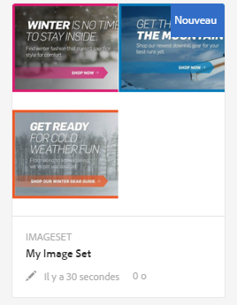
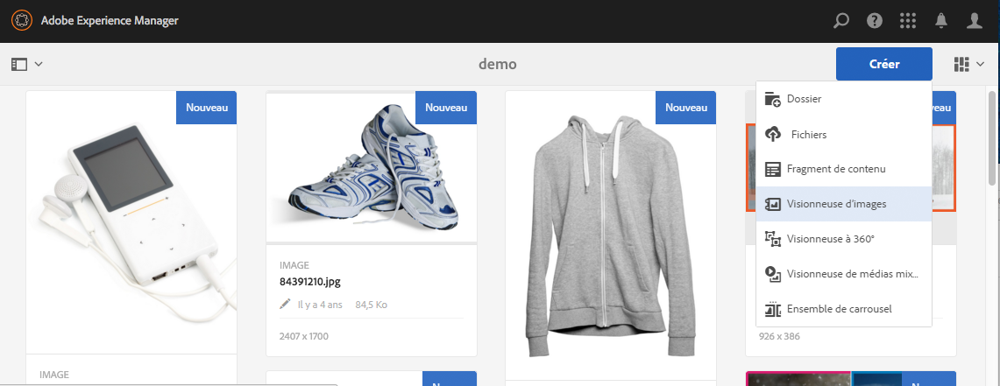
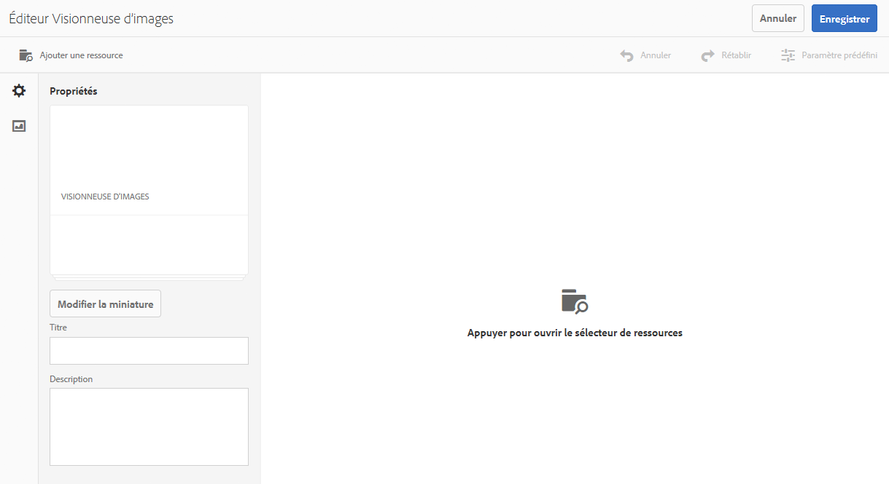
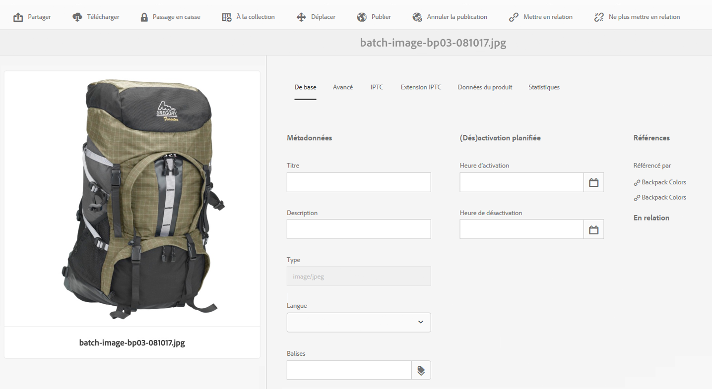

# Visionneuses d’images {#image-sets}

Les visionneuses d’images offrent aux utilisateurs une expérience de visionnage intégrée en leur permettant d’afficher différentes vues d’un élément en cliquant sur une miniature. Les visionneuses d’images permettent de présenter différentes vues d’un élément. Elles offrent des outils de zoom afin d’examiner les images de plus près.

Les visionneuses d’images sont désignées par une bannière comportant le mot **[!UICONTROL VISIONNEUSE D’IMAGES]**. En outre, si la visionneuse d’images est publiée, la date de publication, indiquée par l’icône représentant la **[!UICONTROL Terre]**, figure sur la bannière avec la date de dernière modification, indiquée par l’icône représentant un **[!UICONTROL crayon]**.

Dans une visionneuse d’images, vous pouvez également créer des échantillons en créant une visionneuse d’images et en ajoutant des miniatures.

Cette application est particulièrement utile lorsque vous souhaitez afficher un élément avec une couleur, un modèle ou une finition différente. Pour créer une visionneuse d’images avec des échantillons de couleur, vous avez besoin d’une image pour chaque couleur, modèle ou finition que vous souhaitez présenter aux utilisateurs. Vous avez également besoin d’un échantillon de couleurs, de modèle ou de finition pour chaque couleur, modèle ou finition.

Par exemple, supposons que vous souhaitez présenter les images d’une casquette avec différentes couleurs de visière : rouge, vert et bleu. Dans ce cas, vous avez besoin de trois prises de vue de la même casquette. Vous avez besoin d’une prise de vue avec une visière rouge, une avec une verte et une avec une bleue. Vous avez également besoin d’un échantillon de couleurs rouge, vert et bleu. Les échantillons de couleurs servent de miniatures sur lesquelles les utilisateurs cliquent dans la visionneuse des séries d’échantillons pour voir les visières rouge, verte ou bleue.

>[!NOTE]
>
>Pour plus d’informations sur l’interface utilisateur d’Assets, voir [Gestion des ressources avec l’interface utilisateur tactile](managing-assets-touch-ui.md).

## Démarrage rapide : Visionneuses d’images   {#quick-start-image-sets}

Pour démarrer rapidement :

1. [Téléchargez vos Principales images pour plusieurs vues.](#uploading-assets-in-image-sets)

   Commencez par télécharger les images pour les visionneuses d’images. Comme les utilisateurs peuvent zoomer sur les images dans la visionneuse d’images, tenez compte du zoom lorsque vous sélectionnez des images. Assurez-vous que les images font au moins 2 000 pixels dans leur dimension la plus grande pour obtenir un détail de zoom optimal. Dynamic Media peut générer des images faisant jusqu’à 25 mégapixels chacune. Par exemple, vous pouvez utiliser une image de 5 000 x 5 000 mégapixels ou toute autre combinaison de taille pouvant atteindre 25 mégapixels.

   AEM Assets prend en charge de nombreux formats de fichier image, mais les formats sans perte TIFF, PNG et EPS sont recommandés.

1. [Créez une visionneuse d’images.](#creating-image-sets)

   Dans les visionneuses d’images, les utilisateurs cliquent sur les images miniatures dans la visionneuse d’images.

   Pour créer une visionneuse d’images dans Assets, appuyez sur **[!UICONTROL Créer > Visionneuses d’images]**. Ensuite, ajoutez des images et appuyez sur **[!UICONTROL Enregistrer]**.

   Vous pouvez également créer des visionneuses d’images automatiquement par l’intermédiaire des [paramètres prédéfinis d’ensemble par lot](/help/assets/config-dms7.md#creating-batch-set-presets-to-auto-generate-image-sets-and-spin-sets).

   **Important**  : les jeux de lots sont créés par le système IPS (Image Production System) dans le cadre de l’assimilation des ressources et ne sont disponibles qu’en mode Dynamic Media - Scene7.

   Voir [Préparation du chargement de ressources de visionneuse d’images et Chargement des fichiers](#uploading-assets-in-image-sets).

   Voir [Utilisation de sélecteurs](working-with-selectors.md).

1. Ajoutez des [paramètres prédéfinis de visionneuse d’images](managing-viewer-presets.md), selon les besoins.

   Les administrateurs peuvent créer ou modifier l’image **[!UICONTROL Définir les paramètres prédéfinis de la visionneuse]**. Pour afficher vos images avec un paramètre prédéfini de visionneuse, sélectionnez la visionneuse d’images, puis dans le menu déroulant du rail gauche, sélectionnez **[!UICONTROL Visionneuses]**.

   Accédez à **[!UICONTROL Outils > Ressources > Paramètres visionneuse]** pour créer ou modifier les paramètres prédéfinis de la visionneuse.

1. (Facultatif) [Affichage des visionneuses d’images](image-sets.md#viewing-image-sets) créées à l’aide de paramètres prédéfinis d’ensemble par lot.
1. [Prévisualisez une visionneuse d’images.](previewing-assets.md)

   Sélectionnez la visionneuse d’images pour pouvoir la prévisualiser. Appuyez sur les icônes de miniature pour examiner votre visionneuse d’images dans la visionneuse sélectionnée. Vous pouvez choisir différentes visionneuses dans le menu **[!UICONTROL Visionneuses]** disponible dans le menu déroulant du rail gauche.

1. [Publiez une visionneuse d’images.](publishing-dynamicmedia-assets.md)

   La publication d’une visionneuse d’images active la chaîne URL et d’incorporation. En outre, vous devez [publier tous les paramètres prédéfinis de visionneuse personnalisés](managing-viewer-presets.md) que vous avez créés. Les paramètres prédéfinis de visionneuse prêts à l’emploi sont déjà publiés.

1. [Liez des URL à l’application web](linking-urls-to-yourwebapplication.md) ou [incorporez la vidéo ou la visionneuse d’images](embed-code.md).

   AEM Assets crée des appels URL pour les visionneuses d’images et les active une fois que vous avez publié la visionneuse d’images. Vous pouvez copier ces URL lorsque vous prévisualisez les ressources. Vous pouvez également les incorporer à votre site web.

   Sélectionnez la visionneuse d’images, puis, dans le menu déroulant du rail de gauche, sélectionnez **[!UICONTROL Visionneuses]**.

   Voir [Liaison d’une visionneuse d’images à une page web](linking-urls-to-yourwebapplication.md) et [Incorporation de la vidéo ou de la visionneuse d’images](embed-code.md).

Pour modifier des visionneuses d’images, voir [Modification de visionneuses d’images.](#editing-image-sets) Vous pouvez en outre afficher et modifier les [propriétés de la visionneuse d’images](managing-assets-touch-ui.md#editing-properties).

Si vous rencontrez des problèmes lors de la création des visionneuses, reportez-vous à Images et visionneuses dans la section [Dépannage de Dynamic Media – mode Scene7](troubleshoot-dms7.md#images-and-sets).

## Téléchargement de fichiers dans les visionneuses d’images {#uploading-assets-in-image-sets}

Commencez par télécharger les images pour les visionneuses d’images. Comme les utilisateurs peuvent zoomer sur les images dans la visionneuse d’images, tenez compte du zoom lorsque vous sélectionnez des images. Assurez-vous que les images font au moins 2 000 pixels dans leur dimension la plus grande. Les visionneuses d’images prennent en charge de nombreux formats de fichier image, mais les formats sans perte TIFF, PNG et EPS sont recommandés.

Vous pouvez charger des images pour les visionneuses d’images comme vous le feriez pour [charger une autre ressource dans AEM Assets](managing-assets-touch-ui.md#uploading-assets).

### Préparation du chargement de ressources de visionneuse d’images {#preparing-image-set-assets-for-upload}

Avant de créer une visionneuse d’images, assurez-vous que la taille et le format des images sont corrects.

Pour créer une visionneuse d’images à plusieurs vues, vous avez besoin d’images qui montrent un élément depuis différents points de vue ainsi que différents aspects du même élément. L’objectif est de mettre en avant les fonctionnalités importantes d’un élément afin que les utilisateurs aient un tableau complet de son apparence et son fonctionnement.

Comme les utilisateurs peuvent zoomer sur les images dans les visionneuses d’images, assurez-vous que la dimension la plus grande des images comporte au moins 2000 pixels. Assets prend en charge de nombreux formats de fichier image, mais les formats sans perte TIFF, PNG et EPS sont recommandés.

>[!NOTE]
>
>En outre, si vous utilisez des miniatures pour indiquer des échantillons de produit, vous devez effectuer les opérations suivantes :
>
>Vous avez besoin de vignettes ou de prises de vue différentes de la même image la présentant avec différentes couleurs, modèles et finitions. Vous avez également besoin de fichiers de miniatures qui correspondent aux différentes couleurs, modèles et finitions. Par exemple, pour présenter des miniatures avec une visionneuse d’images de la même veste en noir, marron et vert, vous avez besoin :
>
>* D’une prise de vue en noir, en marron et en vert de la même veste.
>* Une miniature de couleur noire, marron et verte.

>

## Création d’une visionneuse d’images   {#creating-image-sets}

Vous pouvez créer des visionneuses d’images par le biais de l’interface utilisateur ou de l’API. Cette section décrit comment créer des visionneuses d’images dans l’interface utilisateur.

>[!NOTE]
>
>Vous pouvez également créer des visionneuses d’images automatiquement par l’intermédiaire des [paramètres prédéfinis d’ensemble par lot](/help/assets/config-dms7.md#creating-batch-set-presets-to-auto-generate-image-sets-and-spin-sets).

**Important :** Les ensembles par lot sont créés par le système IPS (Image Production System) dans le cadre de l’ingestion des ressources et sont disponibles uniquement dans le mode Scene7 de Dynamic Media.

Lorsque vous ajoutez des ressources à votre visionneuse, elles sont automatiquement ajoutées dans l’ordre alphanumérique. Vous pouvez réorganiser ou trier manuellement les ressources après les avoir ajoutées.

>[!NOTE]
>
>Les visionneuses d’images ne sont pas prises en charge pour les fichiers dont le nom de fichier contient `,` (virgule).

**Pour créer une visionneuse d’images**:

1. Dans **Ressources**, accédez à l’emplacement où vous souhaitez créer une visionneuse d’images, appuyez sur **[!UICONTROL Créer]**, puis sélectionnez **[!UICONTROL Visionneuse d’images]**. Vous pouvez également la créer depuis un dossier qui contient les ressources.

   

1. Sur la page Editeur de visionneuse d’images, dans le champ **[!UICONTROL Titre]**, saisissez le nom de la visionneuse d’images. Le nom apparaît dans la bannière située sur la visionneuse d’images. Vous pouvez aussi saisir une description.

   

   >[!NOTE]
   >
   >Lors de la création de la visionneuse d’images, vous pouvez modifier la miniature de la visionneuse d’images ou autoriser AEM à la sélectionner automatiquement en fonction des fichiers de la visionneuse d’images. Pour sélectionner une miniature, appuyez sur **[!UICONTROL Modifier la miniature]** et sélectionnez n’importe quelle image (vous pouvez également accéder à d’autres dossiers pour rechercher des images). Si vous avez sélectionné une miniature, puis souhaitez qu’AEM en génère une depuis la visionneuse d’images, sélectionnez **[!UICONTROL Basculer vers les miniatures automatiques]**.

1. Effectuez l’une des opérations suivantes :

   * Près du coin supérieur gauche de la page **[!UICONTROL Éditeur de visionneuse d’images]**, appuyez sur **[!UICONTROL Ajouter l’actif]**.
   * Près du milieu de la page **[!UICONTROL Éditeur de visionneuse d’images]**, appuyez sur **[!UICONTROL Appuyez pour ouvrir le sélecteur de ressources]**.

   Appuyez sur pour sélectionner les fichiers à inclure dans votre visionneuse d’images. Les ressources sélectionnées sont cochées. Lorsque vous avez terminé, en haut à droite de la page, appuyez sur **[!UICONTROL Sélectionner]**.

   Le sélecteur de ressources vous permet de rechercher des ressources en saisissant un mot-clé, puis en appuyant sur **[!UICONTROL Retour]**. Vous pouvez également appliquer des filtres pour affiner vos résultats de recherche. Vous pouvez filtrer par chemin, collection, type de fichier et balise. Sélectionnez le filtre, puis appuyez sur l’icône **[!UICONTROL Filtre]** de la barre d’outils. Modifiez la vue en appuyant sur l&#39;icône **[!UICONTROL Vue]** et en sélectionnant **[!UICONTROL Vue de colonne]**, **[!UICONTROL Vue de carte]** ou **[!UICONTROL Vue de Liste]**.

   Voir [Utilisation de sélecteurs](working-with-selectors.md).

   

1. Lorsque vous ajoutez des ressources à votre visionneuse, elles sont automatiquement ajoutées dans l’ordre alphanumérique. Vous pouvez réorganiser ou trier manuellement les ressources une fois qu’elles ont été ajoutées.

   Si nécessaire, faites glisser l’icône **[!UICONTROL Réorganiser]** d’un fichier vers la droite du nom de fichier du fichier pour réorganiser les images vers le haut ou vers le bas de la liste définie.

   

   Si vous souhaitez modifier une miniature ou une nuance, appuyez sur l’icône **[!UICONTROL Miniature]** située en regard de l’image et accédez à la miniature ou à l’échantillon de votre choix. Lorsque vous avez terminé, sélectionnez toutes les images, appuyez sur **[!UICONTROL Enregistrer]**.

1. (En option) Effectuez l’une des actions suivantes :

   * Pour supprimer une image, sélectionnez-la, puis appuyez sur **[!UICONTROL Supprimer le fichier]**.
   * Pour appliquer un paramètre prédéfini, en haut à droite de la page, appuyez sur **[!UICONTROL Paramètre prédéfini]**, puis sélectionnez un paramètre prédéfini à appliquer en une seule fois à toutes les ressources.

1. Appuyez sur **[!UICONTROL Enregistrer]**. La nouvelle visionneuse d’images apparaît dans le dossier dans lequel vous l’avez créée.

## Affichage de visionneuses d’images   {#viewing-image-sets}

Vous pouvez créer des visionneuses d’images dans l’interface utilisateur ou automatiquement à l’aide des [paramètres prédéfinis d’ensemble par lot](/help/assets/config-dms7.md#creating-batch-set-presets-to-auto-generate-image-sets-and-spin-sets).

**Important**  : les jeux de lots sont créés par le système IPS  [Image Production ] System dans le cadre de l&#39;assimilation des ressources et ne sont disponibles que dans le mode Dynamic Media - Scene7.)

Notez toutefois que les visionneuses créées à l’aide de paramètres prédéfinis d’ensemble par lot *ne s’affichent pas* dans l’interface utilisateur. Vous pouvez afficher ces visionneuses de trois manières différentes. (Ces méthodes sont disponibles même si vous avez créé les visionneuses d’images dans l’interface utilisateur.)

* Lors de l’ouverture des propriétés d’une ressource individuelle. Les propriétés indiquent les jeux dont la ressource sélectionnée fait partie (sous **[!UICONTROL Membre des visionneuses]**). Appuyez sur le nom de la visionneuse pour afficher la totalité de la visionneuse.

   

* À partir de l’image membre d’une visionneuse, sélectionnez le menu **[!UICONTROL Visionneuses]** pour afficher les visionneuses dont la ressource fait partie.

   

* Dans la recherche, vous pouvez sélectionner **[!UICONTROL Filtres]**, développer **[!UICONTROL Dynamic Media]** et sélectionner **[!UICONTROL Jeux]**.

   La recherche renvoie les visionneuses correspondantes qui ont soit été créées manuellement dans l’interface utilisateur, soit automatiquement au moyen de paramètres prédéfinis d’ensemble par lot. Dans le cas des visionneuses automatisées, la requête de recherche est effectuée à l’aide du critère « Commence par », à la différence de la recherche AEM qui repose sur l’utilisation du critère « Contient ». La définition du filtre sur **[!UICONTROL Visionneuses]** constitue la seule méthode de recherche dans des visionneuses automatisées.

   

>[!NOTE]
>
>Vous pouvez afficher les visionneuses par le biais de l’interface utilisateur, comme indiqué dans la section [Modification d’une visionneuse d’images](#editing-image-sets).

## Modification d’une visionneuse d’images   {#editing-image-sets}

Vous pouvez effectuer diverses tâches de modification sur les visionneuses d’images, comme suit :

* Ajouter des images à la visionneuse d’images.
* Réorganiser des images dans la visionneuse d’images.
* Supprimer des ressources de la visionneuse d’images.
* Appliquer des paramètres prédéfinis de visionneuse.
* Supprimer la visionneuse d’images.

**Pour modifier les visionneuses d’images**:

1. Effectuez l’une des opérations suivantes :

   * Pointez sur une ressource d’image, puis appuyez sur **[!UICONTROL Modifier]** (icône de crayon).
   * Pointez sur une ressource de visionneuse d’images, appuyez sur **[!UICONTROL Sélectionner]** (icône de coche), puis sur **[!UICONTROL Modifier]** sur la barre d’outils.
   * Appuyez sur une ressource de visionneuse d’images, puis sur **[!UICONTROL Modifier]** (icône de crayon) sur la barre d’outils.

1. Pour modifier les images d’une visionneuse d’images, procédez comme suit :

   * Pour réorganiser les ressources, faites glisser une image vers un nouvel emplacement (sélectionnez l’icône de réorganisation pour déplacer des éléments).
   * Pour trier les éléments par ordre croissant ou décroissant, appuyez sur l’en-tête de colonne.
   * Pour ajouter une ressource ou mettre à jour une ressource existante, appuyez sur **[!UICONTROL Ajouter la ressource]**. Accédez à une ressource, sélectionnez-la, puis appuyez sur **[!UICONTROL Sélectionner]** en haut à droite de la page.

   >[!NOTE]
   >Si vous supprimez l’image qu’AEM utilise pour la miniature en la remplaçant par une autre image, la ressource d’origine s’affiche toujours.

   * Pour supprimer un fichier, sélectionnez-le, puis appuyez sur **[!UICONTROL Supprimer le fichier]**.
   * Pour appliquer un paramètre prédéfini, en haut à droite de la page, appuyez sur **[!UICONTROL Paramètre prédéfini]**, puis sélectionnez un paramètre prédéfini de visionneuse.
   * Pour ajouter ou changer une miniature, sélectionnez l’icône de miniature située à droite de la ressource. Naviguez jusqu’à la nouvelle miniature ou ressource d’échantillon, sélectionnez-la, puis appuyez sur **[!UICONTROL Sélectionner]**.
   * Pour supprimer intégralement une visionneuse d’images, accédez à cette visionneuse, sélectionnez-la, puis sélectionnez **[!UICONTROL Supprimer]**.

   >[!NOTE]
   >
   >Vous pouvez modifier les images d’une visionneuse d’images en accédant à la visionneuse, en cliquant sur **[!UICONTROL Définir les membres]** dans le rail gauche, puis en cliquant ou en appuyant sur l’icône Crayon d’une ressource pour afficher la fenêtre d’édition.****

1. Appuyez sur **[!UICONTROL Enregistrer]** lorsque vous avez terminé la modification.

## Aperçu d’une visionneuse d’images   {#previewing-image-sets}

Voir aussi [Aperçu des ressources](previewing-assets.md).

## Publication de visionneuses d’images   {#publishing-image-sets}

Voir [Publication de ressources](publishing-dynamicmedia-assets.md).
