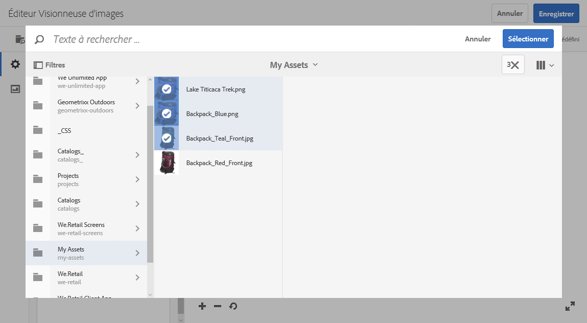

# Visionneuses d’images {#image-sets}

Les visionneuses d’images offrent aux utilisateurs une expérience de visionnage intégrée en leur permettant d’afficher différentes vues d’un élément en cliquant sur une miniature. Les visionneuses d’images permettent de présenter différentes vues d’un élément. Elles offrent des outils de zoom afin d’examiner les images de plus près.

Les visionneuses d’images sont désignées par une bannière comportant le mot **[!UICONTROL VISIONNEUSE D’IMAGES]**. En outre, si la visionneuse d’images est publiée, la date de publication, indiquée par l’icône représentant la **[!UICONTROL Terre]** figure sur la bannière avec la date de dernière modification, indiquée par l’icône en forme de **[!UICONTROL crayon]**.

Dans la visionneuse d’images, vous pouvez également créer des échantillons en créant une visionneuse d’images et en ajoutant des miniatures.

Cette application est particulièrement utile lorsque vous souhaitez afficher un élément avec une couleur, un modèle ou une finition différente. Pour créer une visionneuse d’images avec des échantillons de couleur, vous avez besoin d’une image pour chaque couleur, modèle ou finition que vous souhaitez présenter aux utilisateurs. Vous avez également besoin d’un échantillon de couleurs, de modèle ou de finition pour chaque couleur, modèle ou finition.

Par exemple, supposons que vous souhaitez présenter les images d’une casquette avec différentes couleurs de visière : rouge, vert et bleu. Dans ce cas, vous avez besoin de trois prises de vue de la même casquette. Vous avez besoin d’une prise de vue avec une visière rouge, une avec une verte et une avec une bleue. Vous avez également besoin d’un échantillon de couleurs rouge, vert et bleu. Les échantillons de couleurs servent de miniatures sur lesquelles les utilisateurs cliquent dans la visionneuse des séries d’échantillon pour voir les visières rouge, verte ou bleue.

>[!NOTE]
>
>Pour plus d’informations sur l’interface utilisateur des ressources, voir [Gestion des ressources avec l’interface utilisateur tactile](managing-assets-touch-ui.md).

## Démarrage rapide : Visionneuses d&#39;images {#quick-start-image-sets}

Pour démarrer rapidement :

1. [Téléchargez les images maître pour plusieurs vues.](#uploading-assets-in-image-sets)

   Commencez par télécharger les images pour les visionneuses d’images. Comme les utilisateurs peuvent zoomer sur les images dans la visionneuse d’images, tenez compte du zoom lorsque vous sélectionnez des images. Assurez-vous que les images ont une dimension de 2 000 pixels minimum pour un zoom optimal. Contenu multimédia dynamique peut générer des images jusqu’à 25 mégapixels chacune. Par exemple, vous pouvez utiliser une image de 5 000 x 5 000 mégapixels ou toute autre combinaison de taille pouvant atteindre 25 mégapixels.

   AEM Assets prend en charge de nombreux formats de fichier image mais les formats sans perte TIFF, PNG et EPS sont recommandés.

1. [Créez une visionneuse d’images.](#creating-image-sets)

   Dans les visionneuses d’images, les utilisateurs cliquent sur les images miniatures dans la visionneuse d’images.

   To create an Image Set in Assets, tap **[!UICONTROL Create > Image Sets]**. Then, add images and tap **[!UICONTROL Save]**.

   Vous pouvez également créer des visionneuses d’images automatiquement par l’intermédiaire des [paramètres prédéfinis d’ensemble par lot](/help/assets/config-dms7.md#creating-batch-set-presets-to-auto-generate-image-sets-and-spin-sets).

   **Important** — Les visionneuses par lots sont créées par IPS (Image Production System) dans le cadre de l’assimilation des fichiers et ne sont disponibles qu’en mode Contenu multimédia dynamique - Scene7.

   See [Preparing Image Set assets for upload and Uploading your files](#uploading-assets-in-image-sets).

   Voir [Utilisation de sélecteurs](working-with-selectors.md).

1. Add [Image Set Viewer presets](managing-viewer-presets.md), as needed.

   Administrators can create or modify Image **[!UICONTROL Set Viewer Presets]**. To see your image set with a viewer preset, select the image set, and in the left-rail drop-down menu, select **[!UICONTROL Viewers]**.

   See **[!UICONTROL Tools > Assets > Viewer Presets]** to create or edit viewer presets.

1. (Optional) [Viewing Image Sets](image-sets.md#viewing-image-sets) that were created using batch set presets.
1. [Prévisualisez une visionneuse d’images.](previewing-assets.md)

   Sélectionnez la visionneuse d’images pour pouvoir la prévisualiser. Appuyez sur les icônes de miniature pour examiner votre visionneuse d’images dans la visionneuse sélectionnée. You can choose different viewers from the **[!UICONTROL Viewers]** menu, available from the left rail drop-down menu.

1. [Publiez une visionneuse d’images.](publishing-dynamicmedia-assets.md)

   La publication d’une visionneuse d’images active la chaîne URL et d’incorporation. In addition, you must [publish any custom viewer preset](managing-viewer-presets.md) that you have created. Les paramètres prédéfinis de visionneuse prêts à l’emploi sont déjà publiés.

1. [Liez des URL à l’application Web](linking-urls-to-yourwebapplication.md) ou [incorporez la vidéo ou la visionneuse d’images](embed-code.md).

   AEM Assets crée des appels URL pour les visionneuses d’images et les active une fois que vous avez publié la visionneuse d’images. Vous pouvez copier ces URL lorsque vous prévisualisez les ressources. Vous pouvez également les incorporer à votre site web.

   Sélectionnez la visionneuse d’images, puis, dans le menu déroulant du rail de gauche, sélectionnez **[!UICONTROL Visionneuses]**.

   Voir [Liaison d’une visionneuse d’images à une page web](linking-urls-to-yourwebapplication.md) et [Intégration de la vidéo ou de la visionneuse d’images](embed-code.md).

To edit Image Sets, see [editing Image Sets.](#editing-image-sets) En outre, vous pouvez  et modifier les propriétés [de la visionneuse d’](managing-assets-touch-ui.md#editing-properties)images.

Si vous rencontrez des problèmes lors de la création des visionneuses, reportez-vous à Images et visionneuses dans la section [Dépannage de Dynamic Media – mode Scene7](troubleshoot-dms7.md#images-and-sets).

## Uploading assets in Image Sets {#uploading-assets-in-image-sets}

Commencez par télécharger les images pour les visionneuses d’images. Comme les utilisateurs peuvent zoomer sur les images dans la visionneuse d’images, tenez compte du zoom lorsque vous sélectionnez des images. Assurez-vous que les images font au moins 2000 pixels dans leur dimension la plus grande. Les visionneuses d’images prennent en charge de nombreux formats de fichier image mais les formats sans perte TIFF, PNG et EPS sont recommandés.

Vous pouvez télécharger des images pour les visionneuses d’images comme vous le feriez pour [charger une autre ressource dans les ressources AEM](managing-assets-touch-ui.md#uploading-assets).

### Préparation du téléchargement de ressources de visionneuse d’images {#preparing-image-set-assets-for-upload}

Avant de créer une visionneuse d’images, assurez-vous que la taille et le format des images sont corrects.

Pour créer une visionneuse d’images à plusieurs vues, vous avez besoin d’images qui montrent un élément depuis différents points de vue ainsi que différents aspects du même élément. L’objectif est de mettre en avant les fonctionnalités importantes d’un élément afin que les utilisateurs aient un tableau complet de son apparence et son fonctionnement.

Comme les utilisateurs peuvent zoomer sur les images dans les visionneuses d’images, assurez-vous que la dimension la plus grande des images comporte au moins 2000 pixels. Les ressources prennent en charge de nombreux formats de fichier image mais les formats sans perte TIFF, PNG et EPS sont recommandés.

>[!NOTE]
>
>En outre, si vous utilisez des miniatures pour indiquer des échantillons de produit, vous devez effectuer les opérations suivantes :
>
>Vous avez besoin de vignettes ou de prises de vue différentes de la même image la présentant avec différentes couleurs, modèles et finitions. Vous avez également besoin de fichiers de miniatures qui correspondent aux différentes couleurs, modèles et finitions. Par exemple, pour présenter des miniatures avec une visionneuse d’images de la même veste en noir, marron et vert, vous avez besoin :
>
>* D’une prise de vue en noir, en marron et en vert de la même veste.
>* Une miniature de couleur noire, marron et verte.
>

## Création d’une visionneuse d’images {#creating-image-sets}

Vous pouvez créer des visionneuses d’images à partir de l’interface utilisateur ou de l’API. Cette section explique comment créer des visionneuses d’images dans l’interface utilisateur.

>[!NOTE]
>
>Vous pouvez également créer des visionneuses d’images automatiquement par l’intermédiaire des [paramètres prédéfinis d’ensemble par lot](/help/assets/config-dms7.md#creating-batch-set-presets-to-auto-generate-image-sets-and-spin-sets).

**Important :** Les ensembles par lot sont créés par le système IPS (Image Production System) dans le cadre de l’ingestion des ressources et sont disponibles uniquement dans le mode Scene7 de Dynamic Media.

Lorsque vous ajoutez des ressources à votre visionneuse, elles sont automatiquement ajoutées dans l’ordre alphanumérique. Vous pouvez réorganiser ou trier manuellement les ressources après les avoir ajoutées.

>[!NOTE]
>
>Image sets are not supported for assets with `,` (comma) in the file name.

**Pour créer une visionneuse** d’images :

1. In **Assets**, navigate to where you want to create an image set, tap **[!UICONTROL Create]**, and select **[!UICONTROL Image Set]**. Vous pouvez également créer la visionneuse à partir d’un dossier contenant vos fichiers.

   

1. On the Image Set Editor page, in the **[!UICONTROL Title]** field, enter a name for the Image Set. Le nom apparaît dans la bannière située sur la visionneuse d’images. Vous pouvez aussi saisir une description.

   

   >[!NOTE]
   >
   >Lors de la création de la visionneuse d’images, vous pouvez modifier la miniature de la visionneuse d’images ou autoriser AEM à la sélectionner automatiquement en fonction des fichiers de la visionneuse d’images. To select a thumbnail, tap **[!UICONTROL Change thumbnail]** and select any image (you can navigate to other folders to find images as well). Si vous avez sélectionné une miniature, puis décidé qu’AEM en génère une à partir de la visionneuse d’images, sélectionnez **[!UICONTROL Basculer vers la miniature automatique]**.

1. Effectuez l’une des opérations suivantes :

   * Near the upper-left corner of the **[!UICONTROL Image Set Editor]** page, tap **[!UICONTROL Add Asset]**.
   * Near the middle of the **[!UICONTROL Image Set Editor]** page, tap **[!UICONTROL Tap to open Asset Selector]**.
   Appuyez sur pour sélectionner les fichiers à inclure dans votre visionneuse d’images. Les fichiers sélectionnés sont dotés d’une coche. Lorsque vous avez terminé, en haut à droite de la page, appuyez sur **[!UICONTROL Sélectionner]**.

   Le sélecteur de ressources vous permet de rechercher des ressources en saisissant un mot-clé et en appuyant sur **[!UICONTROL Retour]**. Vous pouvez également appliquer des filtres pour affiner vos résultats de recherche. Vous pouvez filtrer par chemin, collection, type de fichier et balise. Sélectionnez le filtre, puis appuyez sur l’icône **[!UICONTROL Filtre]** dans la barre d’outils. Change the view by tapping the **[!UICONTROL View]** icon and selecting **[!UICONTROL Column View]**, **[!UICONTROL Card View]**, or **[!UICONTROL List View]**.

   Voir [Utilisation de sélecteurs](working-with-selectors.md).

   

1. Lorsque vous ajoutez des ressources à votre visionneuse, elles sont automatiquement ajoutées dans l’ordre alphanumérique. Vous pouvez réorganiser ou trier manuellement les ressources après les avoir ajoutées.

   If necessary, drag an asset&#39;s **[!UICONTROL Reorder]** icon to the right of the asset&#39;s file name to re-order images up or down the set list.

   

   If you want to change a thumbnail or swatch, tap the **[!UICONTROL Thumbnail]** icon next to the image and navigate to the thumbnail or swatch you want. When done selecting all the images tap **[!UICONTROL Save]**.

1. (En option) Effectuez l’une des actions suivantes :

   * To delete an image, select the image, then tap **[!UICONTROL Delete Asset]**.
   * Pour appliquer un paramètre prédéfini, en haut à droite de la page, appuyez sur **[!UICONTROL Paramètre prédéfini]**, puis sélectionnez un paramètre prédéfini à appliquer en une seule fois à toutes les ressources.

1. Appuyez sur **[!UICONTROL Enregistrer]**. La visionneuse d’images nouvellement créée apparaît dans le dossier dans laquelle vous l’avez créée.

## Affichage de visionneuses d’images {#viewing-image-sets}

Vous pouvez créer des visionneuses d’images dans l’interface utilisateur ou automatiquement à l’aide des [paramètres prédéfinis d’ensemble par lot](/help/assets/config-dms7.md#creating-batch-set-presets-to-auto-generate-image-sets-and-spin-sets).

**Important** — Les visionneuses de lots sont créées par le système [de production d’] images IPS dans le cadre de l’assimilation de fichiers. Elles sont disponibles uniquement en mode Contenu multimédia dynamique - Scene7.)

However, sets created using batch set presets, do *not* appear in the user interface. Vous pouvez  ces ensembles de trois manières différentes. (Ces méthodes sont disponibles même si vous avez créé les visionneuses d’images dans l’interface utilisateur.)

* Lors de l’ouverture des propriétés d’une ressource individuelle. Les propriétés indiquent les jeux dont la ressource sélectionnée fait partie (sous **[!UICONTROL Membre des visionneuses]**). Appuyez sur le nom de la visionneuse pour afficher la totalité de la visionneuse.

   

* Image d’un membre d’une visionneuse. sélectionnez le menu **[!UICONTROL Visionneuses]** pour afficher les visionneuses dont la ressource fait partie.

   

* From search, you can select **[!UICONTROL Filters]**, then expand **[!UICONTROL Dynamic Media]** and select **[!UICONTROL Sets]**.

   La recherche renvoie les visionneuses correspondantes qui ont soit été créées manuellement dans l’interface utilisateur, soit automatiquement au moyen de paramètres prédéfinis d’ensemble par lot. Dans le cas des visionneuses automatisées, la requête de recherche est effectuée à l’aide du critère « Commence par », à la différence de la recherche AEM qui repose sur l’utilisation du critère « Contient ». Setting the filter to **[!UICONTROL Sets]** is the only way to search automated sets.

   

>[!NOTE]
>
>Vous pouvez afficher les visionneuses par le biais de l’interface utilisateur, comme indiqué dans la section [Modification d’une visionneuse d’images](#editing-image-sets).

## Modification d’une visionneuse d’images {#editing-image-sets}

Vous pouvez effectuer diverses tâches de modification sur les visionneuses d’images, comme suit :

* Ajouter des images à la visionneuse d’images.
* Réorganiser des images dans la visionneuse d’images.
* Supprimer des ressources de la visionneuse d’images.
* Appliquer des paramètres prédéfinis de visionneuse.
* Supprimer la visionneuse d’images.

**Pour modifier des visionneuses** d’images :

1. Effectuez l’une des opérations suivantes :

   * Pointez sur une ressource d’image, puis appuyez sur **[!UICONTROL Modifier]** (icône de crayon).
   * Pointez sur une ressource de visionneuse d’images, appuyez sur **[!UICONTROL Sélectionner]** (icône de coche), puis sur **[!UICONTROL Modifier]** sur la barre d’outils.
   * Appuyez sur une ressource de visionneuse d’images, puis sur **[!UICONTROL Modifier]** (icône de crayon) sur la barre d’outils.

1. Pour modifier les images d’une visionneuse d’images, procédez comme suit :

   * Pour réorganiser les ressources, faites glisser une image vers un nouvel emplacement (sélectionnez l’icône de réorganisation pour déplacer des éléments).
   * Pour trier les éléments par ordre croissant ou décroissant, appuyez sur l’en-tête de colonne.
   * To add an asset or update an existing asset, tap the **[!UICONTROL Add Asset]**. Accédez à une ressource, sélectionnez-la, puis appuyez sur **[!UICONTROL Sélectionner]** en haut à droite de la page.
   >[!NOTE]
   >si vous supprimez l’image qu’AEM utilise pour la miniature en la remplaçant par une autre image, la ressource originale s’affiche toujours.

   * To delete an asset, select it, then tap **[!UICONTROL Delete Asset]**.
   * Pour appliquer un paramètre prédéfini, en haut à droite de la page, appuyez sur **[!UICONTROL Paramètre prédéfini]**, puis sélectionnez un paramètre prédéfini de visionneuse.
   * Pour ajouter ou changer une miniature, sélectionnez l’icône de miniature située à droite de la ressource. Naviguez jusqu’à la nouvelle miniature ou ressource d’échantillon, sélectionnez-la, puis appuyez sur **[!UICONTROL Sélectionner]**.
   * Pour supprimer intégralement une visionneuse d’images, accédez à cette visionneuse, sélectionnez-la, puis sélectionnez **[!UICONTROL Supprimer]**.
   >[!NOTE]
   >
   >Vous pouvez modifier les images d’une visionneuse d’images en accédant à la visionneuse, en appuyant sur **[!UICONTROL Membres de la visionneuse]** dans la barre de navigation de gauche, puis en appuyant sur l’icône représentant un crayon pour ouvrir la fenêtre de modification.****

1. Appuyez sur **[!UICONTROL Enregistrer]** lorsque vous avez terminé.

## Aperçu d’une visionneuse d’images {#previewing-image-sets}

Voir [Aperçu des ressources](previewing-assets.md).

## Publication de visionneuses d’images {#publishing-image-sets}

Voir [Publication de ressources](publishing-dynamicmedia-assets.md).
