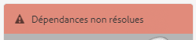
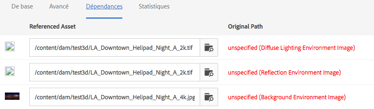
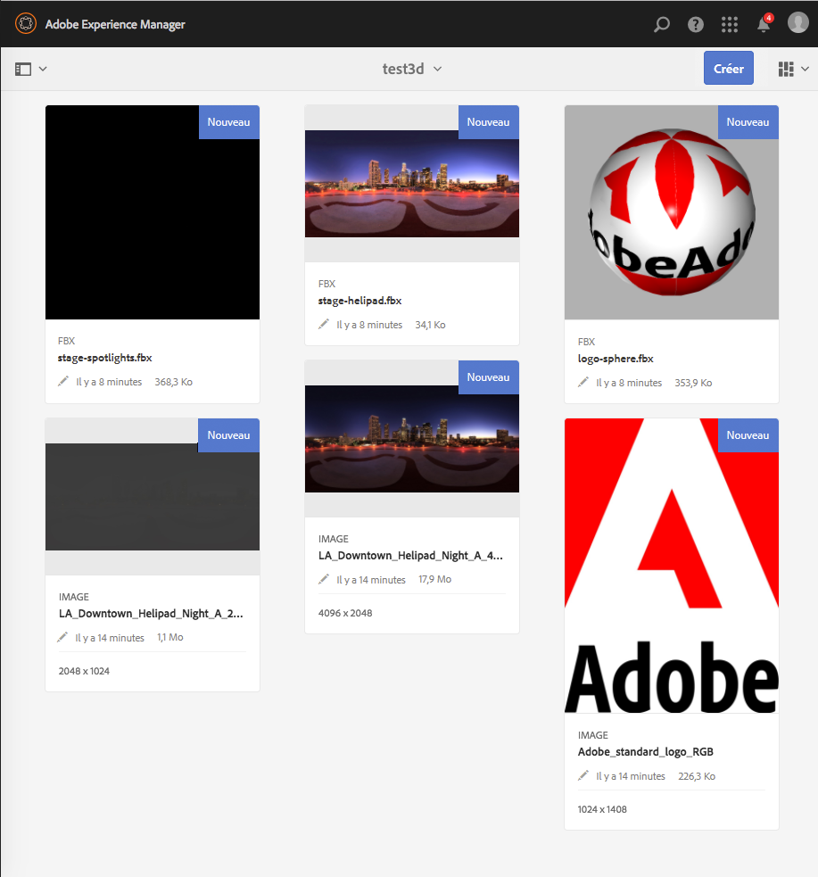
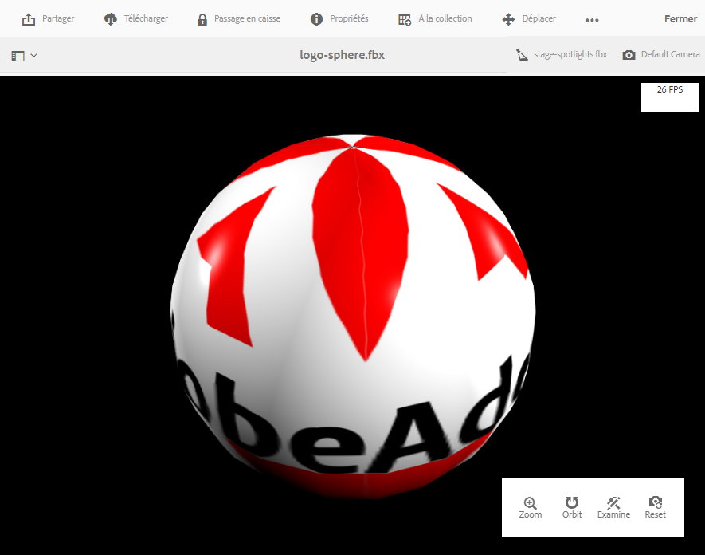
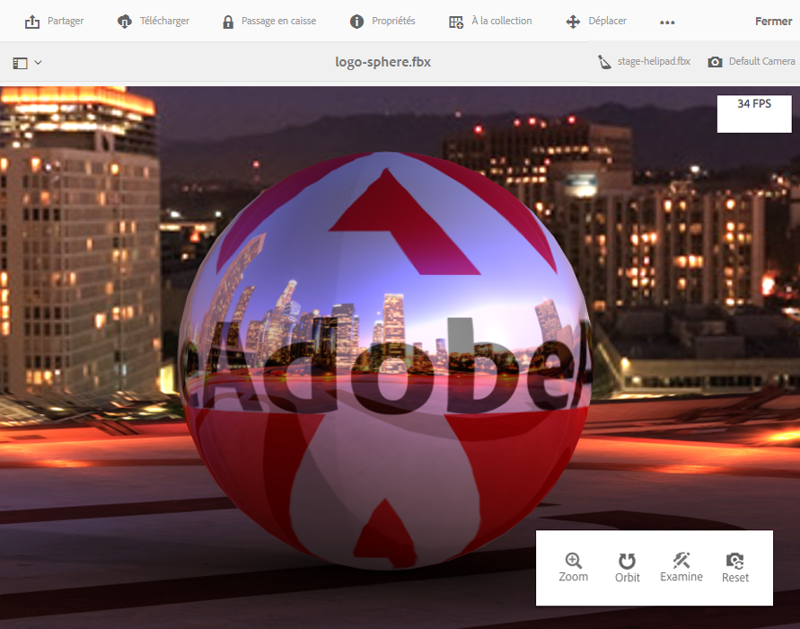

# Installation et configuration d’AEM 3D {#installing-and-configuring-aem-d}

>[!IMPORTANT]
>
>aem 3D dans AEM 6.4 n’est plus pris en charge. L&#39;Adobe vous recommande d&#39;utiliser la fonction de ressources 3D dans [AEM en tant que Cloud Service](https://docs.adobe.com/content/help/en/experience-manager-cloud-service/assets/dynamicmedia/assets-3d.html) ou [AEM 6.5.3 ou version ultérieure.](https://docs.adobe.com/content/help/en/experience-manager-65/assets/dynamic/assets-3d.html)

L&#39;installation et la configuration de AEM 3D (version 3.0) impliquent les opérations suivantes :

1. Installation de la bibliothèque Autodesk® FBX® SDK.
1. Téléchargement et installation du module de code 3D natif.
1. Configuration du processus d’assimilation des ressources 3D et redémarrage d’AEM.
1. Validation de la configuration d’AEM 3D.

Voir aussi [Utilisation des ressources 3D](assets-3d.md).

Voir aussi [Notes de version d’AEM 3D Assets](/help/release-notes/aem3d-release-notes.md) pour connaître les conditions préalables, les navigateurs pris en charge et d’autres informations importantes sur la version.

Voir aussi [Utilisation du composant 3D Sites](using-the-3d-sites-component.md).

>[!NOTE]
>
>Avant de télécharger et d&#39;installer le package 3D, assurez-vous d&#39;avoir installé tous les packages AEM prérequis avec succès. Voir les [Notes de mise à jour d’AEM 3D.](install-config-3d.md)

## Installation de la bibliothèque SDK Autodesk FBX {#installing-the-autodesk-fbx-sdk-library}

Le code AEM 3D natif nécessite la bibliothèque Autodesk FBX pour prendre en charge le format de fichier FBX. (Adobe n’est pas en mesure de redistribuer cette bibliothèque actuellement.)

Voir également [Paramètres de configuration avancés](advanced-config-3d.md).

1. Connectez-vous à l’hôte sur lequel AEM est installé.

   * Dans le cas d’un déploiement Windows Server, connectez-vous au serveur en tant qu’administrateur.
   * Dans le cas d’un ordinateur de bureau Mac ou Windows, assurez-vous de disposer des privilèges d’administrateur.

1. Utilisez le lien correspondant à votre système d’exploitation pour télécharger la **version du SDK FBX 2016.1.2** :

   * **Windows**

      [https://download.autodesk.com/us/fbx_release_older/2016.1.2/fbx20161_2_fbxsdk_vs2010_win.exe](https://download.autodesk.com/us/fbx_release_older/2016.1.2/fbx20161_2_fbxsdk_vs2010_win.exe)

   * **OS X**

      [https://download.autodesk.com/us/fbx_release_older/2016.1.2/fbx20161_2_fbxsdk_clang_mac.pkg.tgz](https://download.autodesk.com/us/fbx_release_older/2016.1.2/fbx20161_2_fbxsdk_clang_mac.pkg.tgz)

   * **Linux**

      [https://download.autodesk.com/us/fbx_release_older/2016.1.2/fbx20161_2_fbxsdk_linux.tar.gz](https://download.autodesk.com/us/fbx_release_older/2016.1.2/fbx20161_2_fbxsdk_linux.tar.gz)

1. Installez le SDK FBX :

   * Windows. Installez sur le même lecteur où se trouve AEM.
   * Mac. Installez-le sur la partition où se trouve AEM.
   * Linux. Extrayez le package téléchargé et suivez les instructions de `<yourFBXSDKpath>/Install_FbxFileSdk.txt`. Installez le SDK sur `/usr`.

## Téléchargement et installation du module de code 3D natif {#downloading-and-installing-the-native-d-code-package}

>[!NOTE]
>
>Avant de procéder à l’installation et à la configuration d’AEM 3D, Adobe vous recommande de déployer tous les Service Packs possibles et les autres Feature Packs associés. Voir [Notes de mise à jour d’AEM 3D](/help/release-notes/aem3d-release-notes.md).

Voir également [Paramètres de configuration avancés](advanced-config-3d.md).

**Pour installer le module de code 3D natif**:

1. Utilisez l’une des méthodes suivantes :

   * Dans le cas d’un déploiement Windows Server, connectez-vous au serveur en tant qu’administrateur.
   * S’il s’agit d’un ordinateur de bureau Mac ou Windows, assurez-vous que vous disposez des droits d’administrateur.

1. Vérifiez que vous disposez d’un navigateur pris en charge pour accéder à AEM.

   Voir [Configuration requise](/help/release-notes/aem3d-release-notes.md#system-requirements).

1. Accédez au [portail de distribution de logiciels](https://experience.adobe.com/#/downloads/content/software-distribution/en/aem.html). Localisez la version 3.0.1 de `AEM-6.4-DynamicMedia-3D` Feature Pack et téléchargez-la.

1. Dans AEM, cliquez sur **[!UICONTROL Outils > Administration > Déploiement > Gestionnaire de modules]**.

1. Téléchargez le Feature Pack téléchargé vers AEM. Recherchez-le et cliquez sur **[!UICONTROL Installer]**.

1. Dans la boîte de dialogue **[!UICONTROL Installer le package]**, développez **Paramètres avancés**, puis définissez **[!UICONTROL Gestion du Contrôle d&#39;accès]** sur **Fusionner**.
1. Cliquez sur **[!UICONTROL Installer]** pour lancer l’installation du module.

   Le fichier `sample-3D-content.zip` est placé dans le dossier racine **[!UICONTROL Assets]**. Pour plus d’informations, voir [Validation de la configuration d’AEM 3D](#validating-the-setup-of-aem-d).

## Configuration du processus d’assimilation des ressources 3D et redémarrage d’AEM  {#configuring-the-d-asset-ingestion-workflow-and-restarting-aem}

**Pour configurer le processus** d&#39;assimilation des ressources 3D :

1. Dans AEM, cliquez sur le logo AEM pour accéder à la console de navigation globale, puis cliquez sur l&#39;icône **[!UICONTROL Outils]** et accédez à **[!UICONTROL Processus > Modèles]**.
1. Sur la page **[!UICONTROL Modèles de flux de travail]**, passez la souris sur le flux de travaux **[!UICONTROL DAM Update Asset]** et, lorsque la coche apparaît, sélectionnez-la.

1. Cliquez sur **[!UICONTROL Modifier]** dans la barre d’outils.
1. Dans l’écran **[!UICONTROL DAM Update Asset]**, dans le panneau flottant de l’AEM, cliquez sur l’icône **[!UICONTROL Plus]** située à droite de Workflow pour développer la liste. Sélectionnez **[!UICONTROL Étape du processus]** dans la liste.
1. Faites glisser **[!UICONTROL Étape du processus]** et déposez-la dans le processus juste avant le composant **[!UICONTROL Processus de mise à jour de la gestion des actifs terminé]** situé à la fin du processus.

   

1. Double-cliquez sur l’étape de processus que vous venez d’ajouter.
1. Dans la boîte de dialogue **[!UICONTROL Propriétés de l&#39;étape]**, sous l&#39;onglet **[!UICONTROL Common]**, dans le champ **[!UICONTROL Titre]**, entrez une description appropriée pour le processus tel que `Process 3D content`.
1. Cliquez sur l’onglet **[!UICONTROL Processus]**.

1. Dans le menu déroulant **[!UICONTROL Processus]**, sélectionnez **[!UICONTROL Service d&#39;objet 3D géométrique]**, puis cochez la case **[!UICONTROL Avance du gestionnaire]**.

   

1. Près du coin supérieur droit de la boîte de dialogue, cliquez sur l’icône en forme de coche pour revenir à la page Fichiers de mise à jour DAM.
1. Près du coin supérieur droit de la page **[!UICONTROL Fichier de mise à jour DAM]**, cliquez sur **[!UICONTROL Synchroniser]** pour enregistrer le modèle de processus modifié.
1. Redémarrez AEM.

   Après le redémarrage, vous êtes prêt à télécharger du contenu 3D et à AEM le traiter.

   Procédez ensuite à la [validation de la configuration d’AEM 3D](#validating-the-setup-of-aem-d).

## Validation de la configuration d’AEM 3D  {#validating-the-setup-of-aem-d}

1. Dans AEM, cliquez sur **[!UICONTROL Outils > Ressources]**, puis téléchargez `sample-3D-content.zip` et développez le fichier téléchargé. (Vous pouvez désormais supprimer `sample-3D-content.zip` dans AEM.)

   Vérifiez que le **[!UICONTROL Mode Carte]** est actif pour afficher les commentaires de transfert et de traitement dans les étapes suivantes.

1. Créez un dossier nommé `test3d` pour recevoir le contenu du test.
1. Téléchargez tous les fichiers de `sample-3D-content/images` vers le dossier `test3d`.
1. Attendez que le transfert et le traitement soient terminés. Il se peut que vous deviez actualiser votre navigateur.

   Téléchargez les trois fichiers `.fbx` de `sample-3D-content/` vers le dossier `test3d`.

   Ne transférez pas encore les fichiers de modèle .ma.

1. Dans le mode Carte, observez les bannières de messages affichées sur les cartes de ressources 3D.

   Chaque ressource passe par plusieurs étapes de traitement. Lorsque la **[!UICONTROL création de Prévisualisation...L’étape de traitement de]** se termine, la carte est mise à jour avec une image miniature. Une fois le traitement final terminé, la bannière est remplacée par l’indicateur **[!UICONTROL NOUVEAU]**.

   >[!NOTE]
   >
   >Le traitement 3D est une opération extrêmement gourmande en ressources du processeur. Cette opération peut prendre beaucoup de temps en fonction de la capacité disponible du processeur.

   

1. Vous allez maintenant apprendre à résoudre les dépendances de fichiers.

   Sur la bannière **[!UICONTROL Dépendances non résolues]** de la carte `stage-helipad.fbx`, cliquez sur l&#39;icône **[!UICONTROL Point d&#39;exclamation]** pour accéder aux propriétés de la ressource et ouvrez l&#39;onglet **Dépendances**.

   

1. Cliquez sur l&#39;icône **[!UICONTROL Dossier/Loupe]** à droite du nom de fichier pour ouvrir l&#39;explorateur de ressources et résoudre les dépendances comme suit :

   

1. Cliquez sur **[!UICONTROL Enregistrer]** et **[!UICONTROL Fermer]** pour terminer le traitement de la ressource et revenir à la **[!UICONTROL Vue de carte]**, respectivement.
1. Une fois le traitement terminé, vous voyez ce qui suit dans **[!UICONTROL Vue de carte]** :

   

1. Sur la page test3d, cliquez sur la carte `logo-sphere.fbx` pour ouvrir le modèle dans **[!UICONTROL Vue de détails]**.

   Dans le coin supérieur droit de la page logo-sphere.fbx, cliquez sur l’icône représentant un projecteur pour ouvrir le menu déroulant, puis sélectionnez `stage-spotlights.fbx`.

   

1. Dans la liste déroulante **[!UICONTROL Points phares]**, sélectionnez `stage-helipad.fbx`.

   Utilisez le bouton gauche de la souris pour ajuster la vue. L’éclairage de l’arrière-plan et du modèle change pour tenir compte de la nouvelle sélection de scène.

   

## Configuration de la prise en charge des ressources Adobe Dimension {#configuring-support-for-adobe-dimension-assets}

>[!NOTE]
>
>Cette tâche de configuration est facultative.

Vous pouvez éventuellement configurer la prise en charge dans AEM 3D pour les ressources Adobe Dimension.

Vous devez configurer un service de conversion externe pour autoriser l’assimilation, la prévisualisation et la publication de ressources Adobe Dimension 3D dans AEM. Le service convertit du format Adobe Dimension propriétaire (`.dn`) en une variante de glTF (formatée sous la forme d&#39;un fichier `.glb`) qui est enregistrée avec la ressource Dn en tant que rendu. Le rendu `.glb` est utilisé pour l’affichage en ligne de la ressource 3D dans AEM Assets, Sites et écrans et peut également être téléchargé pour une utilisation avec des applications tierces.

>[!NOTE]
>
>Le service de conversion est hébergé par Adobe dans Amazon AWS. Après avoir configuré correctement le service, les fichiers `.dn` téléchargés vers AEM sont ensuite copiés en toute sécurité vers le service de conversion par enregistrement temporaire dans Amazon S3. Le résultat de la conversion est renvoyé à AEM par enregistrement S3 temporaire. Tous les transferts et enregistrements sont sécurisés. En outre, le contenu persiste dans S3 et le service de conversion ne dure que brièvement (généralement pas plus de quelques minutes).

**Pour configurer la prise en charge des ressources** Adobe Dimension :

1. Contactez votre gestionnaire de compte AEM d&#39;Adobe, votre expert en attribution de privilèges d&#39;accès ou votre représentant de l&#39;assistance pour demander des informations d&#39;identification pour **AEM3D Services**.

   >[!NOTE]
   >
   >Un seul jeu d’informations d’identification est requis pour chaque organisation, quel que soit le nombre d’instances AEM sur lesquelles les informations d’identification sont installées.

1. Vérifiez que vous avez reçu les informations suivantes :

   * accountId
   * customerId
   * password
   * identityPoolId
   * userPoolId
   * clientId

1. En tant qu’administrateur, connectez-vous à l’instance d’auteur AEM où vous souhaitez installer les informations d’identification, puis ouvrez **[!UICONTROL CRXDE Lite]**.
1. Configurez les nouvelles informations d’identification en procédant comme suit dans le CRXDE Lite :

   1. Accédez à `/libs/settings/dam/v3D/services/dncr` et définissez la propriété `clientId` sur la nouvelle valeur.
   1. Accédez à `/libs/settings/dam/v3D/services/aws` et définissez les propriétés `accountId`, `customerId`, `identityPoolId` et `userPoolId` sur les nouvelles valeurs.
   1. Chargez la nouvelle valeur de mot de passe dans la propriété `encryptedPassword`. Cette valeur est automatiquement chiffrée lorsque vous appuyez sur **[!UICONTROL Enregistrer tout]**.
   1. Appuyez sur **[!UICONTROL Enregistrer tout]**, rechargez la page, puis vérifiez que la propriété `encryptedPassword` affiche une autre chaîne entourée d&#39;accolades. Cette apparence indique que le mot de passe est correctement chiffré et sécurisé.

1. Spécifiez le format du rendu de conversion `.glb` en procédant comme suit dans **[!UICONTROL CRXDE Lite]** :

   1. Accédez à `/libs/settings/dam/v3D/services/dncr` dans **[!UICONTROL CRXDE Lite]**.
   1. Définissez la propriété `outputFormat` sur `Dn` ou `generic`.

      Lorsqu’elle est définie sur `Dn`, la conversion `.glb` inclut des extensions spécifiques à l’Adobe, telles que l’éclairage IBL, pour une qualité optimale lors de l’affichage des ressources Dn dans AEM. Cependant, le rendu .glb converti peut ne pas s’afficher correctement dans les applications tierces.

      Lorsqu&#39;il est défini sur `generic`, le rendu `.glb` est générique sans extensions spécifiques à un Adobe. Ce paramètre permet de l’utiliser dans des applications tierces, tandis que l’affichage avec la visionneuse 3D AEM est visuellement sous-optimal.

1. Activez le format de fichier Dn en procédant comme suit dans **[!UICONTROL CRXDE Lite]** :

   1. Accéder à `/libs/settings/dam/v3D/assetTypes/Dn`.
   1. Définissez la propriété `Enabled` sur true.

1. Validez la configuration en procédant comme suit :

   1. Ouvrez AEM Assets.
   1. Téléchargez `logo_sphere.dn` dans le dossier `test3d`. Le fichier se trouve dans `sample-3D-content/models`.

      Veuillez noter que `sample-3D-content.zip` a été téléchargé au préalable pour valider la fonctionnalité 3D de base.
   1. Revenez à la **[!UICONTROL Vue de carte]** et observez la bannière de message affichée sur la ressource téléchargée. Le **[!UICONTROL format de conversion...La bannière]** s’affiche pendant que le processus de conversion est en cours.
   1. Une fois le traitement terminé, ouvrez le fichier dans **[!UICONTROL Vue de détails]** pour vérifier que le fichier converti s’affiche correctement et que les commandes de navigation du lecteur sont utilisables.

   

   Si une erreur de traitement s’affiche sur l’actif Dn dans la **[!UICONTROL Vue de carte]** après 10 à 15 minutes, la conversion a échoué.

   Dans ce cas, vous pouvez résoudre les problèmes de conversion en procédant comme suit :

   * Supprimez le fichier, puis téléchargez-le à nouveau.
   * Vérifiez que vous avez correctement défini tous les paramètres de configuration dans **[!UICONTROL CRXDE Lite]**.
   * Vérifiez qu’aucun pare-feu ne bloque l’accès au service de conversion et aux points de terminaison AWS.
