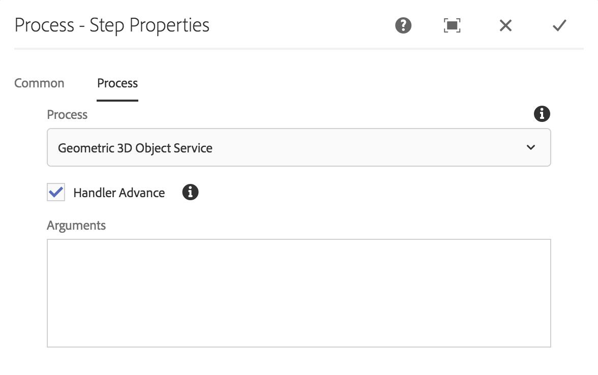

# Installation et configuration d’AEM 3D {#installing-and-configuring-aem-d}

>[!IMPORTANT]
>
>aem 3D dans AEM 6.4 n’est plus pris en charge. adobe vous recommande d’utiliser la fonction de ressources 3D dans [AEM en tant que Cloud Service](https://docs.adobe.com/content/help/en/experience-manager-cloud-service/assets/dynamicmedia/assets-3d.html) ou [AEM 6.5.3 ou version ultérieure.](https://docs.adobe.com/content/help/en/experience-manager-65/assets/dynamic/assets-3d.html)

L&#39;installation et la configuration de AEM 3D (version 3.0) impliquent les opérations suivantes :

1. Installation de la bibliothèque Autodesk® FBX® SDK.
1. Téléchargement et installation du module de code 3D natif.
1. Configuration du processus d’assimilation des ressources 3D et redémarrage d’AEM.
1. Validation de la configuration d’AEM 3D.

Voir aussi [Utilisation des ressources 3D](assets-3d.md).

Voir aussi [Notes de version d’AEM 3D Assets](/help/release-notes/aem3d-release-notes.md) pour connaître les conditions préalables, les navigateurs pris en charge et d’autres informations importantes sur la version.

Voir aussi [Utilisation du composant 3D Sites](using-the-3d-sites-component.md).

>[!NOTE]
>
>Avant de télécharger et d&#39;installer le package 3D, assurez-vous d&#39;avoir installé tous les packages AEM prérequis avec succès. Voir les [Notes de mise à jour d’AEM 3D.](install-config-3d.md)

## Installation de la bibliothèque SDK Autodesk FBX {#installing-the-autodesk-fbx-sdk-library}

Le code AEM 3D natif nécessite la bibliothèque Autodesk FBX pour prendre en charge le format de fichier FBX. (Adobe n’est pas en mesure de redistribuer cette bibliothèque actuellement.)

Voir également [Paramètres de configuration avancés](advanced-config-3d.md).

1. Connectez-vous à l’hôte sur lequel AEM est installé.

   * Dans le cas d’un déploiement Windows Server, connectez-vous au serveur en tant qu’administrateur.
   * Dans le cas d’un ordinateur de bureau Mac ou Windows, assurez-vous de disposer des privilèges d’administrateur.

1. Utilisez le lien correspondant à votre système d’exploitation pour télécharger la **version du SDK FBX 2016.1.2** :

   * **Windows**

      [https://download.autodesk.com/us/fbx_release_older/2016.1.2/fbx20161_2_fbxsdk_vs2010_win.exe](https://download.autodesk.com/us/fbx_release_older/2016.1.2/fbx20161_2_fbxsdk_vs2010_win.exe)

   * **OS X**

      [https://download.autodesk.com/us/fbx_release_older/2016.1.2/fbx20161_2_fbxsdk_clang_mac.pkg.tgz](https://download.autodesk.com/us/fbx_release_older/2016.1.2/fbx20161_2_fbxsdk_clang_mac.pkg.tgz)

   * **Linux**

      [https://download.autodesk.com/us/fbx_release_older/2016.1.2/fbx20161_2_fbxsdk_linux.tar.gz](https://download.autodesk.com/us/fbx_release_older/2016.1.2/fbx20161_2_fbxsdk_linux.tar.gz)

1. Installez le SDK FBX :

   * Windows. Installez sur le même lecteur où se trouve AEM.
   * Mac. Installez-le sur la partition où se trouve AEM.
   * Linux. Extract the downloaded package and follow the instructions in `<yourFBXSDKpath>/Install_FbxFileSdk.txt`. Install the SDK to `/usr`.

## Téléchargement et installation du module de code 3D natif {#downloading-and-installing-the-native-d-code-package}

>[!NOTE]
>
>Avant de procéder à l’installation et à la configuration d’AEM 3D, Adobe vous recommande de déployer tous les Service Packs possibles et les autres Feature Packs associés. Voir [Notes de mise à jour d’AEM 3D](/help/release-notes/aem3d-release-notes.md).

Voir également [Paramètres de configuration avancés](advanced-config-3d.md).

**Pour installer le module de code 3D natif**:

1. Utilisez l’une des méthodes suivantes :

   * Dans le cas d’un déploiement Windows Server, connectez-vous au serveur en tant qu’administrateur.
   * S’il s’agit d’un ordinateur de bureau Mac ou Windows, assurez-vous que vous disposez des droits d’administrateur.

1. Vérifiez que vous disposez d’un navigateur pris en charge pour accéder à AEM.

   Voir [Configuration requise](/help/release-notes/aem3d-release-notes.md#system-requirements).

1. Accédez au portail de distribution de logiciels. Localisez la version 3.0.1 de `AEM-6.4-DynamicMedia-3D` Feature Pack et téléchargez-la.

1. Dans AEM, cliquez sur **[!UICONTROL Outils > Administration > Déploiement > Gestionnaire de modules]**.

1. Téléchargez le Feature Pack téléchargé vers AEM. Recherchez-le et cliquez sur **[!UICONTROL Installer]**.

1. In the **[!UICONTROL Install Package]** dialog box, expand **Advanced Settings**, then set **[!UICONTROL Access Control Handling]** to **Merge**.
1. Cliquez sur **[!UICONTROL Installer]** pour lancer l’installation du module.

   The file `sample-3D-content.zip` is placed in the **[!UICONTROL Assets]** root folder. Pour plus d’informations, voir [Validation de la configuration d’AEM 3D](#validating-the-setup-of-aem-d).

## Configuration du processus d’assimilation des ressources 3D et redémarrage d’AEM {#configuring-the-d-asset-ingestion-workflow-and-restarting-aem}

**Pour configurer le processus** d&#39;assimilation des ressources 3D :

1. In AEM, click the AEM logo to access the global navigation console, then click the **[!UICONTROL Tools]** icon and navigate to **[!UICONTROL Workflow > Models]**.
1. On the **[!UICONTROL Workflow Models]** page, hover over the **[!UICONTROL DAM Update Asset]** workflow, and when the check mark appears, select it.

1. Cliquez sur **[!UICONTROL Modifier]** dans la barre d’outils.
1. On the **[!UICONTROL DAM Update Asset]** screen, in the AEM floating panel, click the **[!UICONTROL Plus]** icon to the right of Workflow to expand the list. Sélectionnez **[!UICONTROL Étape du processus]** dans la liste.
1. Faites glisser l’étape **** de processus et déposez-la dans le processus juste avant le composant Processus de mise à jour des ressources **[!UICONTROL DAM terminé]** situé à la fin du processus.

   

1. Double-cliquez sur l’étape de processus que vous venez d’ajouter.
1. In the **[!UICONTROL Step Properties]** dialog box, under the **[!UICONTROL Common]** tab, in the **[!UICONTROL Title]** field, enter a suitable description for the process such as `Process 3D content`.
1. Cliquez sur l’onglet **[!UICONTROL Processus]**.

1. From the **[!UICONTROL Process]** drop-down menu, select **[!UICONTROL Geometric 3D Object Service]**, then select the **[!UICONTROL Handler Advance]** check box.

   

1. Près du coin supérieur droit de la boîte de dialogue, cliquez sur l’icône en forme de coche pour revenir à la page Fichiers de mise à jour DAM.
1. Près du coin supérieur droit de la page Fichier **[!UICONTROL de mise à jour]** DAM, cliquez sur **[!UICONTROL Synchroniser]** pour enregistrer le modèle de flux de travaux modifié.
1. Redémarrez AEM.

   Après le redémarrage, vous êtes prêt à télécharger du contenu 3D et à AEM le traiter.

   Procédez ensuite à la [validation de la configuration d’AEM 3D](#validating-the-setup-of-aem-d).

## Validation de la configuration d’AEM 3D {#validating-the-setup-of-aem-d}

1. Dans AEM, cliquez sur **[!UICONTROL Outils > Ressources]**, puis téléchargez `sample-3D-content.zip` et développez le fichier téléchargé. (Vous pouvez désormais supprimer `sample-3D-content.zip` dans AEM.)

   Vérifiez que le **[!UICONTROL Mode Carte]** est actif pour afficher les commentaires de transfert et de traitement dans les étapes suivantes.

1. Create a folder named `test3d` to receive test content.
1. Upload all files from `sample-3D-content/images` to the `test3d` folder.
1. Attendez que le transfert et le traitement soient terminés. Il se peut que vous deviez actualiser votre navigateur.

   Upload the three `.fbx` files from `sample-3D-content/` to the `test3d` folder.

   Ne transférez pas encore les fichiers de modèle .ma.

1. Dans le mode Carte, observez les bannières de messages affichées sur les cartes de ressources 3D.

   Chaque ressource passe par plusieurs étapes de traitement. When the **[!UICONTROL Creating Preview...]** processing step completes, the card is updated with a thumbnail image. Une fois le traitement final terminé, la bannière est remplacée par l’indicateur **[!UICONTROL NOUVEAU]**.

   >[!NOTE]
   >
   >Le traitement 3D est une opération extrêmement gourmande en ressources du processeur. Cette opération peut prendre beaucoup de temps en fonction de la capacité disponible du processeur.

   

1. Vous allez maintenant apprendre à résoudre les dépendances de fichiers.

   On the **[!UICONTROL Unresolved Dependencies]** banner for the `stage-helipad.fbx` card, click the **[!UICONTROL Exclamation Point]** icon to navigate to the asset&#39;s properties and open the **Dependencies** tab.

   

1. Click the **[!UICONTROL Folder/Magnifying Glass]** icon to the right of the file name to open the asset browser and resolve the dependencies as follows:

   

1. Click **[!UICONTROL Save]** and **[!UICONTROL Close]** to finish processing the asset and return to the **[!UICONTROL Card View]**, respectively.
1. When processing is complete, you see the following in **[!UICONTROL Card View]**:

   

1. On the test3d page, click the `logo-sphere.fbx` card to open the model in **[!UICONTROL Detail View]**.

   Dans le coin supérieur droit de la page logo-sphere.fbx, cliquez sur l’icône représentant un projecteur pour ouvrir le menu déroulant, puis sélectionnez `stage-spotlights.fbx`.

   

1. From the **[!UICONTROL Stage Spotlight]** drop-down list, select `stage-helipad.fbx`.

   Utilisez le bouton gauche de la souris pour ajuster la vue. L’éclairage de l’arrière-plan et du modèle change pour tenir compte de la nouvelle sélection de scène.

   

## Configuration de la prise en charge des ressources Adobe Dimension {#configuring-support-for-adobe-dimension-assets}

>[!NOTE]
>
>Cette tâche de configuration est facultative.

Vous pouvez éventuellement configurer la prise en charge dans AEM 3D pour les ressources Adobe Dimension.

Vous devez configurer un service de conversion externe pour autoriser l’assimilation, la prévisualisation et la publication de ressources Adobe Dimension 3D dans AEM. Le service convertit du format Adobe Dimension (`.dn`) propriétaire en une variante de glTF (formatée en `.glb` fichier) qui est enregistrée avec la ressource Dn en tant que rendu. Le `.glb` rendu est utilisé pour l’affichage en ligne du fichier 3D dans AEM Assets, Sites et écrans et peut également être téléchargé pour une utilisation avec des applications tierces.

>[!NOTE]
>
>Le service de conversion est hébergé par Adobe dans Amazon AWS. Après avoir configuré correctement le service, `.dn` les fichiers téléchargés vers AEM sont ensuite copiés en toute sécurité vers le service de conversion par enregistrement temporaire dans Amazon S3. Le résultat de la conversion est renvoyé à AEM par enregistrement S3 temporaire. Tous les transferts et enregistrements sont sécurisés. En outre, le contenu persiste dans S3 et le service de conversion ne dure que brièvement (généralement pas plus de quelques minutes).

**Pour configurer la prise en charge des ressources** Adobe Dimension :

1. Contactez votre gestionnaire de compte d&#39;Adobe AEM, votre expert en attribution de privilèges d&#39;accès ou votre représentant de l&#39;assistance pour demander des informations d&#39;identification pour les services **** AEM3D.

   >[!NOTE]
   >
   >Un seul jeu d’informations d’identification est requis pour chaque organisation, quel que soit le nombre d’instances AEM sur lesquelles les informations d’identification sont installées.

1. Vérifiez que vous avez reçu les informations suivantes :

   * accountId
   * customerId
   * password
   * identityPoolId
   * userPoolId
   * clientId

1. En tant qu’administrateur, connectez-vous à votre instance d’auteur AEM où vous souhaitez que les informations d’identification soient installées, puis ouvrez **[!UICONTROL CRXDE Lite]**.
1. Configurez les nouvelles informations d’identification en procédant comme suit dans le CRXDE Lite :

   1. Accédez à `/libs/settings/dam/v3D/services/dncr` la propriété et définissez-la `clientId` sur la nouvelle valeur.
   1. Accédez aux `/libs/settings/dam/v3D/services/aws` nouvelles valeurs et définissez les `accountId`, `customerId`, `identityPoolId`et `userPoolId` les propriétés sur celles-ci.
   1. Chargez la nouvelle valeur de mot de passe dans la `encryptedPassword` propriété. Cette valeur est automatiquement chiffrée lorsque vous appuyez sur **[!UICONTROL Enregistrer tout]**.
   1. Appuyez sur **[!UICONTROL Enregistrer tout]**, rechargez la page, puis vérifiez que la `encryptedPassword` propriété affiche une autre chaîne entourée d’accolades. Cette apparence indique que le mot de passe est correctement chiffré et sécurisé.

1. Spécifiez le format du rendu de `.glb` conversion en procédant comme suit en **[!UICONTROL CRXDE Lite]**:

   1. Accédez à `/libs/settings/dam/v3D/services/dncr` dans le **[!UICONTROL CRXDE Lite]**.
   1. Définissez la `outputFormat` propriété sur `Dn` ou `generic`.

      Lorsqu’elle est définie sur `Dn`, la `.glb` conversion inclut des extensions spécifiques à l’Adobe, telles que l’éclairage IBL, pour une qualité optimale lors de l’affichage des fichiers Dn dans AEM. Cependant, le rendu .glb converti peut ne pas s’afficher correctement dans les applications tierces.

      Lorsqu’il est défini sur `generic`, le `.glb` rendu est générique sans extensions spécifiques à l’Adobe. Ce paramètre permet de l’utiliser dans des applications tierces, tandis que l’affichage avec la visionneuse 3D AEM est visuellement sous-optimal.

1. Activez le format de fichier Dn en procédant comme suit en **[!UICONTROL CRXDE Lite]**:

   1. Accéder à `/libs/settings/dam/v3D/assetTypes/Dn`.
   1. Set the `Enabled` property to true.

1. Validez la configuration en procédant comme suit :

   1. Ouvrez AEM Assets.
   1. Téléchargez `logo_sphere.dn` vers le `test3d` dossier. Le fichier se trouve dans `sample-3D-content/models`.

      Veuillez noter que `sample-3D-content.zip` a été téléchargé au préalable pour valider la fonctionnalité 3D de base.
   1. Return to the **[!UICONTROL Card View]** and observe the message banner shown on the uploaded asset. La bannière **[!UICONTROL Format de conversion...]** s’affiche pendant que le processus de conversion est en cours.
   1. Une fois le traitement terminé, ouvrez le fichier dans la Vue **[!UICONTROL de]** détails afin de vérifier que le fichier converti s’affiche correctement et que les commandes de navigation du lecteur sont utilisables.

   

   Si une &quot;erreur de traitement&quot; s’affiche sur l’actif Dn dans la Vue **[!UICONTROL de]** carte après 10 à 15 minutes, la conversion a échoué.

   Dans ce cas, vous pouvez résoudre les problèmes de conversion en procédant comme suit :

   * Supprimez le fichier, puis téléchargez-le à nouveau.
   * Vérifiez que vous avez correctement défini tous les paramètres de configuration dans le **[!UICONTROL CRXDE Lite]**.
   * Vérifiez qu’aucun pare-feu ne bloque l’accès au service de conversion et aux points de terminaison AWS.
