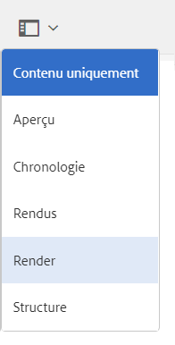

# Intégration de l&#39;AEM 3D avec Autodesk Maya {#integrating-aem-d-with-autodesk-maya}

>[!NOTE]
>
>Cette tâche est facultative et concerne Windows uniquement.

You can optionally integrate AEM 3D with Autodesk® Maya® software to enable support for native Maya files (`.MA` and `.MB`) and to let you render 3D assets in AEM with any available Maya renderer.

*Cette intégration est réservée à Windows uniquement*.

Lorsque vous intégrez Autodesk Maya, vous devez l’installer et le configurer, puis ajouter le chemin du dossier exécutable Maya, activer Maya pour l’assimilation et le rendu, et tester l’intégration.

See [Advanced configuration settings](advanced-config-3d.md).

Voir aussi [Intégration de AEM 3D avec AutoDesk 3ds Max](integrating-aem-3d-with-autodesk-3ds-max.md).

**Pour intégrer AEM 3D avec Autodesk Maya**:

1. Installez le logiciel Autodesk Maya 2016 sur les mêmes serveurs où AEM est hébergé.

   Une fois l’installation terminée, vérifiez que vous pouvez ouvrir et utiliser Maya et qu’il n’y a aucun problème d’autorisation.

   >[!NOTE]
   >
   >AEM utilise uniquement le moteur de rendu de ligne de commande Maya (`render.exe`). Une licence réseau Maya unique permet d’utiliser simultanément jusqu’à cinq serveurs pour le traitement ou la génération de rendu de contenu Maya.

1. Dans Maya, activez le module externe Autodesk FBX®.
1. Installez le module de rendu MentalRay ou un autre module de rendu de votre choix.

   Une fois l’installation terminée, vérifiez que MentalRay est disponible dans Maya.

1. Ajoutez le chemin d’accès au fichier exécutable Maya à la variable d’environnement PATH de Windows.

   For example, on Windows Server 2012, tap **[!UICONTROL Start]>[!UICONTROL Control Panel]>[!UICONTROL System and Security]>[!UICONTROL System]>[!UICONTROL Advanced System Settings]>[!UICONTROL Environment Variables]**. Append the full path to the `Maya2016\bin` folder to the `Path`system variable.

   

1. Pour activer Maya pour l’assimilation et le rendu, ouvrez **[!UICONTROL CRXDE Lite]** , accédez à `/libs/settings/dam/v3D/assetTypes/maya` et définissez la propriété **[!UICONTROL Enabled]** sur `true`.

   

1. To enable the JT (Siemens PLM Open CAD) file format, navigate to `/libs/settings/dam/v3D/assetTypes/jt` and set the **[!UICONTROL Enabled]** property to `true`.
1. Dans AEM, activez Maya comme moteur de rendu. Commencez en accédant à **[!UICONTROL Outils > Général > CRXDE Lite]**.
1. From the **[!UICONTROL CRXDE Lite]** page, in the left panel, navigate to the following:

   `/libs/settings/dam/v3D/renderers/maya`

   

1. Définissez la propriété **[!UICONTROL Enabled]** (Activé) sur `true`.

1. Near the upper-left corner of the **[!UICONTROL CRXDE Lite]** page, tap **[!UICONTROL Save All]**.

   Maya est désormais activé comme moteur de rendu.

## Test de l’intégration de AEM 3D avec Autodesk Maya {#testing-the-integration-of-aem-d-with-autodesk-maya}

1. Open AEM Assets, then upload the `.MA` files located in `sample-3D-content/models` to the `test3d` folder.

   Veuillez noter que `sample-3D-content.zip` a été téléchargé au préalable pour valider la fonctionnalité 3D de base.

1. Return to the **[!UICONTROL Card]** view and observe the message banners shown on the uploaded assets.

   The Converting Format banner is displayed while Maya is converting the native `.MA` format to `.FBX`.

1. After all processing is finished, open the `logo-sphere.ma` asset and select the `stage-helipad.ma` stage.

   L’expérience de Prévisualisation est la même que pour `logo_sphere.fbx` et `stage-helipad.fbx`.

1. Near the upper-left corner of the page, tap or click the drop-down list and then select **[!UICONTROL CRender]**.

   

1. In the **[!UICONTROL Renderer]** drop-down list, select **[!UICONTROL Autodesk Maya]**, then tap **[!UICONTROL Start Render]**.
1. Near the upper-right corner of the page, tap or click **[!UICONTROL Close]** to return to the **[!UICONTROL Card]** view.

   Observez la bannière de message sur le fichier d’image en cours de rendu (`logo-sphere`, sauf si un autre nom d’image a été spécifié). Une barre de progression sur la bannière indique la progression du rendu.

   >[!NOTE]
   >
   >Le rendu sollicite énormément le processeur et peut prendre plusieurs minutes.

1. Une fois le rendu terminé, ouvrez la resource image dont le rendu a été généré.

   Check that the rendered image reasonably matches the image that you were viewing at the time you clicked **[!UICONTROL Render Now]**.

## Enabling Additional Formats Supported By Maya {#enabling-additional-formats-supported-by-maya}

(Facultatif) Maya prend en charge un certain nombre de formats d’entrée 3D, dont tous peuvent être activés afin que AEM reconnaisse le type de fichier. Une fois activé, AEM envoie le fichier à Maya pour le convertir en format intermédiaire qui peut être directement assimilé par AEM.

Selon le format, la prise en charge des fonctions peut être limitée (par exemple, les matériaux ne peuvent pas être transmis) et la qualité/fidélité peut être limitée (par exemple, les faces inversées). Adobe prend uniquement en charge le mécanisme général, et non les conversions de formats spécifiques.

See [Supported Data Import Formats | Maya](https://knowledge.autodesk.com/support/maya/learn-explore/caas/CloudHelp/cloudhelp/2016/ENU/Maya/files/GUID-69BC066D-D4D8-4B12-900C-CF42E798A5D6-htm.html) for information about the formats supported by Maya.

**Pour activer des formats supplémentaires pris en charge par AEM**:

1. À l’aide de **[!UICONTROL CRXDE Lite]**, accédez à `/libs/settings/dam/v3D/assetTypes`.
1. Make a copy of the **[!UICONTROL jt]** node. Right-click on the **[!UICONTROL jt]** node and select **[!UICONTROL Copy]**, then right-click the **[!UICONTROL assetTypes]** folder and select **[!UICONTROL Paste]**. Ceci doit produire un nouveau noeud `/apps/cq-scene7-v3D/config/assetTypes/Copy of jt`.
1. Renommez le nouveau nœud pour lui donner un nom unique qui représente le type de fichier à ajouter. Le suffixe de fichier ou tout autre identifiant unique peut être utilisé.

1. Set the **[!UICONTROL Enabled]** property of the new node to `true`.

1. Set the **[!UICONTROL Extension]** property of the new note to the file suffix/extension of the format being added.
1. Set the **[!UICONTROL MimeType]** property to an appropriate value. `application/x-` suivi de la valeur de la propriété **[!UICONTROL Extension]** doit fonctionner pour la plupart des types de fichiers.
1. Make certain that the **[!UICONTROL Conversion]** property is set to `fbx` and **[!UICONTROL IngestRegime]** to `Maya`.
1. Click **[!UICONTROL Save All]** near the top left of the page.

La capture d&#39;écran suivante illustre un format de fichier ajouté, à l&#39;aide de COLLADA DAE comme exemple :

