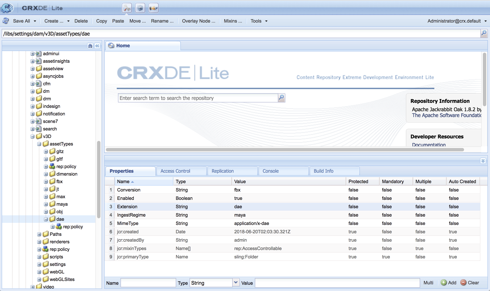

# Intégration de l&#39;AEM 3D avec Autodesk Maya {#integrating-aem-d-with-autodesk-maya}

>[!NOTE]
>
>Cette tâche est facultative et concerne Windows uniquement.

Vous pouvez éventuellement intégrer AEM 3D au logiciel Autodesk® Maya® pour activer la prise en charge des fichiers Maya natifs (`.MA` et `.MB`) et pour vous permettre de générer des ressources 3D en AEM avec tout rendu Maya disponible.

*Cette intégration est réservée à Windows uniquement*.

Lorsque vous intégrez Autodesk Maya, vous devez l’installer et le configurer, puis ajouter le chemin du dossier exécutable Maya, activer Maya pour l’assimilation et le rendu, et tester l’intégration.

Voir [Paramètres de configuration avancés](advanced-config-3d.md).

Voir aussi [Intégration de AEM 3D avec AutoDesk 3ds Max](integrating-aem-3d-with-autodesk-3ds-max.md).

**Pour intégrer AEM 3D avec Autodesk Maya**:

1. Installez le logiciel Autodesk Maya 2016 sur les mêmes serveurs où AEM est hébergé.

   Une fois l’installation terminée, vérifiez que vous pouvez ouvrir et utiliser Maya et qu’il n’y a aucun problème d’autorisation.

   >[!NOTE]
   >
   >AEM utilise uniquement le moteur de rendu de ligne de commande Maya (`render.exe`). Une licence réseau Maya unique permet d’utiliser simultanément jusqu’à cinq serveurs pour le traitement ou la génération de rendu de contenu Maya.

1. Dans Maya, activez le module externe Autodesk FBX®.
1. Installez le module de rendu MentalRay ou un autre module de rendu de votre choix.

   Une fois l’installation terminée, vérifiez que MentalRay est disponible dans Maya.

1. Ajoutez le chemin d’accès au fichier exécutable Maya à la variable d’environnement PATH de Windows.

   Par exemple, sous Windows Server 2012, appuyez sur **[!UICONTROL Début] > [!UICONTROL Panneau de Contrôle] > [!UICONTROL Système et sécurité] > [!UICONTROL Système] > [!UICONTROL Paramètres système avancés] > [!UICONTROL Variables Environnements]**. Ajoutez le chemin d’accès complet au dossier `Maya2016\bin` à la variable système `Path`.

   

1. Pour activer Maya pour l&#39;assimilation et le rendu, ouvrez **[!UICONTROL CRXDE Lite]** et accédez à `/libs/settings/dam/v3D/assetTypes/maya` et définissez la propriété **[!UICONTROL Enabled]** sur `true`.

   

1. Pour activer le format de fichier JT (Siemens PLM Open CAD), accédez à `/libs/settings/dam/v3D/assetTypes/jt` et définissez la propriété **[!UICONTROL Enabled]** sur `true`.
1. Dans AEM, activez Maya comme moteur de rendu. Commencez en accédant à **[!UICONTROL Outils > Général > CRXDE Lite]**.
1. Dans la page **[!UICONTROL CRXDE Lite]** du panneau de gauche, accédez à ce qui suit :

   `/libs/settings/dam/v3D/renderers/maya`

   

1. Définissez la propriété **[!UICONTROL Enabled]** (Activé) sur `true`.

1. Près du coin supérieur gauche de la page **[!UICONTROL CRXDE Lite]**, appuyez sur **[!UICONTROL Enregistrer tout]**.

   Maya est désormais activé comme moteur de rendu.

## Test de l’intégration de AEM 3D avec Autodesk Maya  {#testing-the-integration-of-aem-d-with-autodesk-maya}

1. Ouvrez AEM Assets, puis téléchargez les fichiers `.MA` situés dans `sample-3D-content/models` vers le dossier `test3d`.

   Veuillez noter que `sample-3D-content.zip` a été téléchargé au préalable pour valider la fonctionnalité 3D de base.

1. Revenez à la vue **[!UICONTROL Carte]** et observez les bannières de message affichées sur les ressources téléchargées.

   La bannière Format de conversion s’affiche pendant que Maya convertit le format natif `.MA` en `.FBX`.

1. Une fois le traitement terminé, ouvrez le fichier `logo-sphere.ma` et sélectionnez l’étape `stage-helipad.ma`.

   L’expérience de Prévisualisation est la même que pour `logo_sphere.fbx` et `stage-helipad.fbx`.

1. Près du coin supérieur gauche de la page, appuyez ou cliquez sur la liste déroulante, puis sélectionnez **[!UICONTROL CRender]**.

   

1. Dans la liste déroulante **[!UICONTROL Rendu]**, sélectionnez **[!UICONTROL Autodesk Maya]**, puis appuyez sur **[!UICONTROL Rendu du Début]**.
1. Près du coin supérieur droit de la page, appuyez ou cliquez sur **[!UICONTROL Fermer]** pour revenir à la vue **[!UICONTROL Carte]**.

   Observez la bannière de message sur le fichier d’image en cours de rendu (`logo-sphere`, sauf si un autre nom d’image a été spécifié). Une barre de progression sur la bannière indique la progression du rendu.

   >[!NOTE]
   >
   >Le rendu sollicite énormément le processeur et peut prendre plusieurs minutes.

1. Une fois le rendu terminé, ouvrez la resource image dont le rendu a été généré.

   Vérifiez que l’image rendue correspond raisonnablement à l’image que vous visualisiez au moment où vous cliquiez sur **[!UICONTROL Rendu maintenant]**.

## Activation De Formats Supplémentaires Pris En Charge Par Maya {#enabling-additional-formats-supported-by-maya}

(Facultatif) Maya prend en charge un certain nombre de formats d’entrée 3D, dont tous peuvent être activés afin que AEM reconnaisse le type de fichier. Une fois activé, AEM envoie le fichier à Maya pour le convertir en format intermédiaire qui peut être directement assimilé par AEM.

Selon le format, la prise en charge des fonctions peut être limitée (par exemple, les matériaux ne peuvent pas être transmis) et la qualité/fidélité peut être limitée (par exemple, les faces inversées). Adobe prend uniquement en charge le mécanisme général, et non les conversions de formats spécifiques.

Voir [Formats d’importation de données pris en charge | Maya](https://knowledge.autodesk.com/support/maya/learn-explore/caas/CloudHelp/cloudhelp/2016/ENU/Maya/files/GUID-69BC066D-D4D8-4B12-900C-CF42E798A5D6-htm.html) pour plus d&#39;informations sur les formats pris en charge par Maya.

**Pour activer des formats supplémentaires pris en charge par AEM** :

1. À l&#39;aide de **[!UICONTROL CRXDE Lite]**, accédez à `/libs/settings/dam/v3D/assetTypes`.
1. Effectuez une copie du noeud **[!UICONTROL jt]**. Cliquez avec le bouton droit sur le noeud **[!UICONTROL jt]** et sélectionnez **[!UICONTROL Copier]**, puis cliquez avec le bouton droit sur le dossier **[!UICONTROL assetTypes]** et sélectionnez **[!UICONTROL Coller]**. Ceci doit produire un nouveau noeud `/apps/cq-scene7-v3D/config/assetTypes/Copy of jt`.
1. Renommez le nouveau nœud pour lui donner un nom unique qui représente le type de fichier à ajouter. Le suffixe de fichier ou tout autre identifiant unique peut être utilisé.

1. Définissez la propriété **[!UICONTROL Enabled]** du nouveau noeud sur `true`.

1. Définissez la propriété **[!UICONTROL Extension]** de la nouvelle note sur le suffixe de fichier/extension du format ajouté.
1. Définissez la propriété **[!UICONTROL MimeType]** sur une valeur appropriée. `application/x-` suivi de la valeur de la propriété  **** Extensionproperty doit fonctionner pour la plupart des types de fichiers.
1. Assurez-vous que la propriété **[!UICONTROL Conversion]** est définie sur `fbx` et **[!UICONTROL Régime d&#39;assimilation]** sur `Maya`.
1. Cliquez sur **[!UICONTROL Enregistrer tout]** en haut à gauche de la page.

La capture d&#39;écran suivante illustre un format de fichier ajouté, à l&#39;aide de COLLADA DAE comme exemple :

