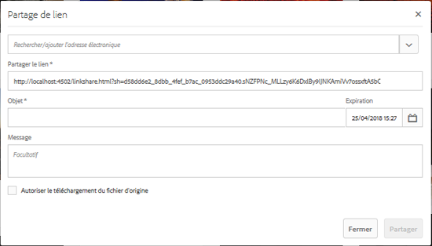
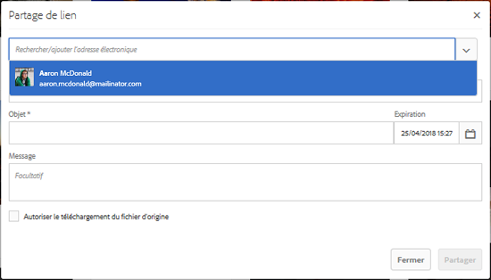
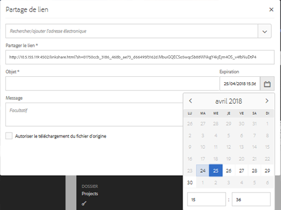
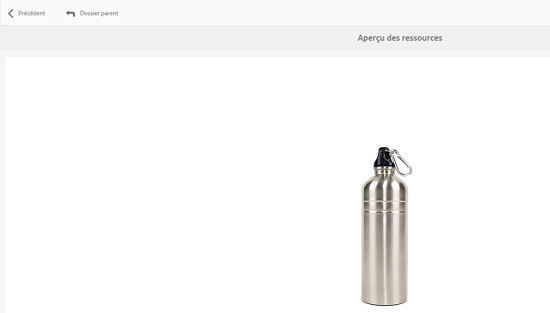
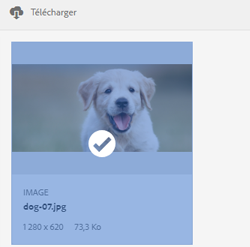

# Partage des liens des ressources {#asset-link-sharing}

Adobe Experience Manager (AEM) Assets vous permet de partager des ressources, des dossiers et des collections sous forme d’URL avec des collaborateurs dans l’entreprise et des tiers, notamment des partenaires et des fournisseurs. Le partage de ressources au moyen d’un lien est très pratique dans la mesure où il permet à des tiers d’y accéder sans avoir besoin de se connecter au préalable à AEM Assets.

>[!NOTE]
>
>Vous devez disposer de l’autorisation Modifier l’ACL sur les dossiers et les fichiers que vous souhaitez partager en tant que lien.

## Partage de ressources {#share-assets}

Pour générer une URL pour les ressources que vous souhaitez partager avec des utilisateurs, utilisez la boîte de dialogue Partage de lien. Les utilisateurs disposant de privilèges d’administrateur ou avec des autorisations de lecture à l’emplacement `/var/dam/share` peuvent afficher les liens partagés avec eux.

>[!NOTE]
>
>Before you share a link with users, ensure that [!UICONTROL Day CQ Mail Service] is configured. Une erreur se produira si vous tentez de partager un lien sans d’abord [configurer le service de messagerie DAY CQ](link-sharing.md#configure-day-cq-mail-service).

1. Dans l’interface utilisateur Assets, sélectionnez la ressource à partager sous forme de lien.
1. From the toolbar, click/tap the **[!UICONTROL Share Link]** .

   Le lien de la ressource est créé automatiquement dans le champ **[!UICONTROL Partager le lien]**. Copiez ce lien et partagez-le avec les utilisateurs. Le délai d’expiration par défaut du lien est de 1 jour.

   

   Vous pouvez également effectuer les étapes 3 à 7 de cette procédure pour ajouter des destinataires de courrier électronique, configurer le délai d’expiration du lien et l’envoyer à partir de la boîte de dialogue.

   >[!NOTE]
   >
   >Pour partager des liens de votre auteur AEM vers des entités externes, n’exposez que les URL suivantes utilisées pour le partage de liens, pour les demandes de GET. Bloquez d’autres URL pour vous assurer que votre déploiement AEM est sécurisé.
   >
   >* &lt;AEM Server>/linkshare.html
   * &lt;AEM Server>/linksharepreview.html
   * &lt;AEM Server>/linkexpired.html

   >[!NOTE]
   Si une ressource partagée est déplacée vers un autre emplacement, son lien cesse de fonctionner. Recréez ce lien et partagez-le de nouveau avec les utilisateurs.

1. Dans la console web, ouvrez la configuration de **[!UICONTROL l’externaliseur de liens Day CQ]** et modifiez les propriétés suivantes dans le champ **[!UICONTROL Domaines]** avec les valeurs correspondantes pour :

   * local
   * Auteur 
   * publish

   For the `local` and `author` properties, provide the URL for the local and author instance respectively. Both `local` and `author` properties have the same value if you run a single AEM author instance. For `publish`, provide the URL for the publish instance.

1. Dans la zone Adresse électronique de la boîte de dialogue **[!UICONTROL Partage de liens]**, saisissez l’ID de courrier électronique de l’utilisateur avec lequel vous souhaitez partager le lien. Vous pouvez également partager le lien avec plusieurs utilisateurs.

   Si l’utilisateur fait partie de votre entreprise, sélectionnez son ID de message électronique dans la liste des ID de message électronique suggérés, affichée sous la zone de saisie. Dans le cas d’un utilisateur externe, saisissez l’ID de message électronique complet puis sélectionnez-le dans la liste.

   Pour que les courriers électroniques soient envoyés aux utilisateurs, configurez les détails de serveur SMTP dans le [service de messagerie Day CQ](link-sharing.md#configure-day-cq-mail-service).

   

   Partage de liens vers des ressources directement depuis la boîte de dialogue Partage de lien

   >[!NOTE]
   Si vous saisissez l’ID de message électronique d’un utilisateur qui ne fait pas partie de votre entreprise, les mots « Utilisateur externe » sont ajoutés à son ID de message électronique.

1. Dans le champ **[!UICONTROL Objet]**, indiquez l’objet de la ressource que vous souhaitez partager.
1. Dans le champ **[!UICONTROL Message]**, vous pouvez saisir un message si vous le souhaitez.
1. Dans le champ **[!UICONTROL Expiration]**, spécifiez la date et l’heure d’expiration du lien à l’aide du sélecteur de date. Par défaut, la date d’expiration est définie sur une semaine à compter de la date à laquelle vous partagez le lien.

   

1. Pour autoriser les utilisateurs à télécharger l’image originale avec les rendus, sélectionnez **[!UICONTROL Autoriser le téléchargement du fichier d’origine]**.

   >[!NOTE]
   Par défaut, les utilisateurs peuvent uniquement télécharger les rendus de la ressource que vous partagez sous forme de lien.

1. Click **[!UICONTROL Share]**. A message confirms that the link is shared with the user(s) through an email.
1. Pour afficher la ressource partagée, cliquez/appuyez sur le lien dans le courrier électronique envoyé à l’utilisateur. La ressource partagée s’affiche sur la page [!UICONTROL Adobe Marketing Cloud].

   

   Pour basculer vers le mode d’affichage Liste, cliquez/appuyez sur l’icône de mise en page dans la barre d’outils.

1. Pour générer un aperçu de la ressource, cliquez/appuyez sur la ressource partagée. Click/tap **[!UICONTROL Back]** on the toolbar to close the preview and return to the [!UICONTROL Marketing Cloud] page. Si vous avez partagé un dossier, cliquez/appuyez sur **[!UICONTROL Dossier parent]** pour revenir au dossier parent.

   

   >[!NOTE]
   AEM prend en charge la génération de l’aperçu des ressources des types MIME suivants : JPG, PNG, GIF, BMP, INDD, PDF et PPT. Vous pouvez uniquement télécharger les ressources des autres types MIME.

1. To download the shared asset, click/tap the **[!UICONTROL Select]** icon from the toolbar, click/tap the asset, and then click/tap **[!UICONTROL Download]** from the toolbar.

   

1. Pour afficher les ressources que vous avez partagées en tant que liens, accédez à l’interface utilisateur Assets, puis cliquez/appuyez sur l’icône de **[!UICONTROL navigation globale]**. Sélectionnez **[!UICONTROL Navigation]** dans la liste pour afficher le panneau Navigation.
1. Dans le panneau Navigation, sélectionnez **[!UICONTROL Liens partagés]** pour afficher la liste des ressources partagées.
1. To unshare an asset, select it and tap/click **[!UICONTROL Unshare]** from the toolbar. Un message confirmera l’annulation du partage de la ressource. En outre, l’entrée correspondante sera supprimée de la liste.

## Configuration du service de messagerie Day CQ {#configure-day-cq-mail-service}

1. Cliquez ou appuyez sur le logo AEM, puis accédez à **[!UICONTROL Outils > Opérations > Console web]**.
1. Dans la liste des services, recherchez le **[!UICONTROL service de messagerie Day CQ]**.
1. Cliquez sur l’icône **[!UICONTROL Modifier]** en regard du service et configurez les paramètres suivants pour le **[!UICONTROL service de messagerie Day CQ]** avec les détails mentionnés en regard de leurs noms :

   * Nom d’hôte du serveur SMTP : nom d’hôte du serveur de messagerie
   * Port du serveur SMTP : port du serveur de messagerie
   * Utilisateur SMTP : nom d’utilisateur du serveur de messagerie
   * Mot de passe SMTP : mot de passe du serveur de messagerie

   

1. Cliquez/appuyez sur **[!UICONTROL Enregistrer]**.

## Configuration de la taille maximale des données   {#configure-maximum-data-size}

Lorsque vous téléchargez des ressources via le lien partagé avec la fonction de partage de lien, AEM compresse l’intégralité de la hiérarchie de cette ressource depuis le référentiel et renvoie la ressource sous forme de fichier ZIP. Toutefois, en l’absence de limite à la quantité de données pouvant être compressées dans un fichier ZIP, il est possible que des volumes de données considérables à compresser entraînent des erreurs d’insuffisance de mémoire dans JVM. Afin de protéger le système contre une potentielle attaque par déni de service (DoS) résultant de cette situation, configurez la taille maximale à l’aide du paramètre **[!UICONTROL Taille max. de contenu (sans compression)]** pour le servlet proxy du partage de ressource adhoc de la gestion des ressources numériques Day CQ dans le gestionnaire de configuration. **** Si la taille non compressée de la ressource dépasse la valeur configurée, les demandes de téléchargement sont rejetées. La valeur par défaut est de 100 Mo.

1. Cliquez ou appuyez sur le logo AEM puis accédez à **[!UICONTROL Outils > Opérations > Console web]**.
1. Dans la console web, recherchez la configuration **[!UICONTROL Day CQ DAM Adhoc Asset Share Proxy Servlet]**.
1. Ouvrez la configuration **[!UICONTROL Day CQ DAM Adhoc Asset Share Proxy Servlet]** en mode d’édition, puis modifiez la valeur du paramètre **[!UICONTROL Taille max. de contenu (sans compression)]**.

   

1. Enregistrez les modifications.

## Bonnes pratiques et résolution des problèmes {#best-practices-and-troubleshooting}

* Les collections ou les dossiers de ressources dont le nom contient un espace blanc risquent de ne pas être partagés.
* Si les utilisateurs ne peuvent pas télécharger les ressources partagées, contactez votre administrateur AEM pour connaître les [limites de téléchargement](#configure-maximum-data-size).
* Si vous ne pouvez pas envoyer de courrier électronique avec des liens vers des ressources partagées ou si les autres utilisateurs ne peuvent pas recevoir votre courrier électronique, contactez votre administrateur AEM pour savoir si le [service de messagerie](#configure-day-cq-mail-service) est configuré ou non.
* Si vous ne pouvez pas partager des fichiers à l’aide de la fonctionnalité de partage de liens, assurez-vous que vous disposez des autorisations appropriées. Voir [Partager des fichiers](#share-assets).
