# Gérer vos ressources numériques {#managing-assets-with-the-touch-optimized-ui}

Découvrez les différentes tâches de gestion et de modification des ressources que vous pouvez effectuer à l’aide de l’interface utilisateur optimisée pour les écrans tactiles de [!DNL Experience Manager] Ressources.

Cet article décrit comment gérer et modifier des ressources à l’aide de l’interface utilisateur optimisée pour les écrans tactiles d’Adobe Experience Manager Assets. Pour une connaissance élémentaire de l’interface utilisateur, voir [Gestion de base de l’interface utilisateur tactile](/help/sites-authoring/basic-handling.md). Pour gérer les fragments de contenu, voir [Gestion des fragments de contenu](content-fragments-managing.md) ressources.

## Création de dossiers  {#create-folders}

Lorsque vous organisez une collection de ressources, comme toutes les images `Nature`, vous pouvez créer des dossiers pour les conserver ensemble. Vous pouvez utiliser des dossiers pour classer et organiser vos ressources. [!DNL Experience Manager] Assets ne nécessite pas de classer les ressources dans des dossiers pour mieux fonctionner.

>[!NOTE]
>
>* Partage d’un dossier de ressources de type `sling:OrderedFolder` n’est pas prise en charge lors du partage vers Marketing Cloud. Si vous souhaitez partager un dossier, ne sélectionnez pas Ordonné lors de la création du dossier.
>* Experience Manager n’autorise pas l’utilisation du mot `subassets` comme nom de dossier. Il s’agit d’un mot-clé réservé au nœud qui contient des sous-ressources pour les ressources composites. 

1. Dans le dossier Ressources numériques, accédez à l’emplacement où vous souhaitez créer un dossier.
1. Dans le menu, cliquez sur **[!UICONTROL Créer]**. Sélectionnez **[!UICONTROL Nouveau dossier]**.
1. Dans le champ **[!UICONTROL Titre]**, indiquez le nom du dossier. Par défaut, DAM utilise le titre que vous avez fourni comme nom du dossier. Une fois le dossier créé, vous pouvez remplacer le nom par défaut et entrer un autre nom de dossier.
1. Cliquez sur **[!UICONTROL Créer]**. Le dossier apparaît dans le dossier Ressources numériques.

Les caractères suivants ne sont pas pris en charge (ils sont répertoriés ici et séparés par des espaces) :

* Le nom du fichier de ressource ne doit pas contenir  `* / : [ \ \ ] | # % { } ? &`
* Le nom du dossier de ressources ne doit pas contenir  `* / : [ \ \ ] | # % { } ? \" . ^ ; + & \t`

## Chargement de ressources {#uploading-assets}

Vous pouvez charger différents types de ressources (y compris des images, des fichiers de PDF, des fichiers RAW, etc.) à partir de votre dossier local ou d’un lecteur réseau vers [!DNL Experience Manager] Ressources.

>[!NOTE]
>
>Dans le mode Scene 7 de Dynamic Media, vous pouvez télécharger uniquement des ressources dont la taille de fichier est de 2 Go ou inférieure.

Vous pouvez choisir de transférer des ressources vers des dossiers avec ou sans un profil de traitement attribué.

Pour les dossiers auxquels un profil de traitement est affecté, le nom du profil s’affiche sur la vignette en mode Carte. En mode Liste, le nom du profil s’affiche dans la colonne **[!UICONTROL Profil de traitement]**. Reportez-vous à la section [Profils de traitement](processing-profiles.md).

Avant de charger une ressource, assurez-vous qu’elle se trouve dans une [format pris en charge](assets-formats.md).

**Pour charger des ressources**:

1. Dans l’interface web d’Assets, accédez à l’emplacement où vous souhaitez ajouter des ressources numériques.
1. Pour charger les ressources, effectuez l’une des opérations suivantes :

   * Appuyez sur l’icône **[!UICONTROL Créer]** de la barre d’outils. Ensuite, dans le menu, appuyez sur **[!UICONTROL Fichiers]**. Au besoin, vous pouvez renommer le fichier dans la boîte de dialogue affichée.
   * Dans un navigateur prenant en charge HTML5, faites glisser les ressources directement sur l’interface. La boîte de dialogue permettant de renommer les fichiers n’est pas affichée.

   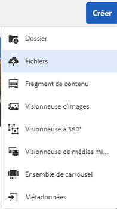

   Pour sélectionner plusieurs fichiers, appuyez sur la touche Ctrl/Commande et sélectionnez les ressources dans la boîte de dialogue de sélecteur de fichiers. Dans iPad, vous ne pouvez sélectionner qu’un seul fichier à la fois.

   Vous pouvez suspendre le chargement des ressources volumineuses (dont la taille est supérieure à 500 Mo) et reprendre ultérieurement à partir de la même page. Appuyez sur l’icône **[!UICONTROL Pause]** à côté de la barre de progression qui s’affiche au début du téléchargement.

   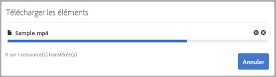

   Vous pouvez configurer la taille au-dessus de laquelle une ressource est considérée comme volumineuse. Par exemple, vous pouvez configurer le système de sorte qu’il considère les ressources dont la taille est supérieure à 1 000 Mo (au lieu de 500 Mo) comme des ressources volumineuses. Dans ce cas, le bouton **[!UICONTROL Pause]** figurant dans la barre de progression s’affiche lors du transfert de fichiers d’une taille supérieure à 1 000 Mo.

   Le **[!UICONTROL Pause]** n’indique pas si un fichier de plus de 1 000 Mo est chargé avec un fichier de moins de 1 000 Mo. Toutefois, si vous annulez le téléchargement de fichier inférieur à 1 000 Mo, le bouton **[!UICONTROL Pause]** apparaît.

   Pour modifier la limite de taille, configurez la propriété `chunkUploadMinFileSize` du nœud `fileupload` dans le référentiel CRX.

   Lorsque vous cliquez sur l’icône **[!UICONTROL Pause]**, elle devient une icône **[!UICONTROL Lire]**. Pour reprendre le transfert, cliquez sur l’icône **[!UICONTROL Lire.]**

   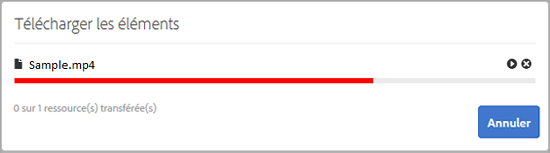

   Pour annuler un chargement en cours, cliquez sur le bouton `X` en regard de la barre de progression. Lorsque vous annulez l’opération de transfert, [!DNL Experience Manager] Les ressources suppriment la partie partiellement chargée de la ressource.

   La possibilité de reprendre le téléchargement s’avère particulièrement utile dans les scénarios dans lesquels la bande passante est faible et le réseau dysfonctionne, car le téléchargement d’une ressource volumineuse prend un long moment. Vous pouvez suspendre l’opération de transfert et la reprendre ultérieurement lorsque la situation s’améliore. Lorsque vous reprenez le transfert, il commence au niveau où vous l’avez suspendu.

   Pendant l’opération de chargement, [!DNL Experience Manager] enregistre les parties de la ressource en cours de chargement sous forme de blocs de données dans le référentiel CRX. Une fois le chargement terminé, [!DNL Experience Manager] regroupe ces blocs en un seul bloc de données dans le référentiel.

   Pour configurer la tâche de nettoyage pour les tâches de chargement de blocs non terminées, reportez-vous à `https://[aem_server]:[port]/system/console/configMgr/org.apache.sling.servlets.post.impl.helper.ChunkCleanUpTask`.

   Si vous transférez une ressource portant le même nom qu’une ressource déjà disponible à l’emplacement où vous transférez la ressource, un message d’avertissement s’affiche.

   Vous pouvez choisir de remplacer une ressource existante, de créer une autre version ou de garder les deux en renommant la nouvelle ressource téléchargée. Si vous remplacez une ressource existante, les métadonnées de la ressource ainsi que toute modification et historique antérieure (annotations, recadrages, etc.) sont supprimées. Si vous choisissez de conserver les deux ressources, la nouvelle ressource est renommée.

   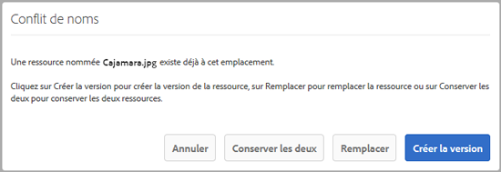

   >[!NOTE]
   >
   >Lorsque vous sélectionnez **[!UICONTROL Remplacer]** dans le **[!UICONTROL Conflit de noms]** , l’ID de la ressource est régénéré pour la nouvelle ressource. Cet ID est différent de celui de la ressource précédente.
   >
   >If **[!UICONTROL Informations sur les ressources]** est activé pour effectuer le suivi des impressions/clics avec Adobe Analytics, cet ID de ressource régénéré invalide les données capturées pour la ressource sur Adobe Analytics.

   Si la ressource que vous chargez existe dans [!DNL Experience Manager] Ressources, **[!UICONTROL Doublons détectés]** la boîte de dialogue vous avertit que vous tentez de charger une ressource en double. La boîte de dialogue s’affiche uniquement si la valeur de somme de contrôle SHA 1 du fichier binaire des ressources existantes correspond à celle de la ressource que vous téléchargez. Dans ce cas, le nom des ressources est immatériel. En d’autres termes, la boîte de dialogue peut même s’afficher pour des ressources dont le nom diffère si la valeur SHA 1 de leur fichier binaire est identique.

   >[!NOTE]
   >
   >Le **[!UICONTROL Doublons détectés]** s’affiche uniquement lorsque la fonction **[!UICONTROL Détection des doublons]** est activée. Pour activer la variable **[!UICONTROL Détection des doublons]** fonctionnalité, voir [Activation de la détection de doublons](duplicate-detection.md).

   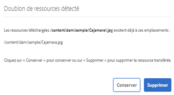

   Appuyer **[!UICONTROL Conserver]** pour conserver la ressource en double dans [!DNL Experience Manager] Ressources. Appuyer  **[!UICONTROL Supprimer]** pour supprimer la ressource en double que vous avez chargée.

   [!DNL Experience Manager] Assets vous empêche de transférer des ressources dont le nom de fichier contient des caractères interdits. Si vous essayez de charger une ressource qui comprend les caractères interdits, [!DNL Experience Manager] Assets affiche un message d’avertissement concernant la présence de caractères interdits dans le nom de fichier et interrompt le chargement jusqu’à ce que vous supprimiez ces caractères ou utilisiez un nom autorisé.

   Pour respecter des conventions d’appellation de fichiers spécifiques à votre entreprise, la variable **[!UICONTROL Chargement de ressources]** vous permet de spécifier des noms longs pour les fichiers que vous chargez.

   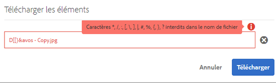

   Toutefois, la liste de caractères suivante, séparée par des espaces, n’est pas prise en charge :
   * Le nom du fichier de ressource ne doit pas contenir  `* / : [ \ \ ] | # % { } ? &`
   * Le nom du dossier de ressources ne doit pas contenir  `* / : [ \ \ ] | # % { } ? \" . ^ ; + & \t`

   En outre, l’interface Assets affiche la ressource la plus récente que vous avez chargée ou le dossier que vous avez créé en premier dans toutes les vues (**[!UICONTROL Mode Carte]**, **[!UICONTROL Mode Liste]**, et **[!UICONTROL Mode Colonnes]**).

   Souvent, lors du chargement simultané de ressources volumineuses ou de plusieurs ressources, des indicateurs visuels vous permettent d’évaluer la progression. Le **[!UICONTROL Progression du téléchargement]** de la boîte de dialogue affiche le nombre de fichiers transférés avec succès et ceux qui n’ont pas pu être transférés.

   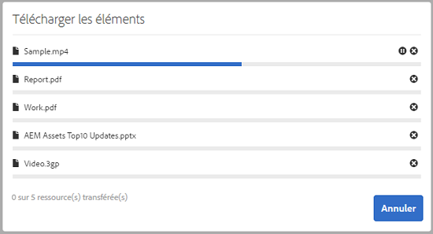

   Si vous annulez l’opération de chargement avant le chargement des fichiers, [!DNL Experience Manager] Les ressources arrêtent le chargement du fichier actif et actualisent le contenu. Toutefois, les fichiers déjà chargés ne sont pas supprimés.

### Chargements en série {#serial-uploads}

Le chargement en masse de nombreuses ressources consomme d’importantes ressources système, ce qui peut avoir un impact négatif sur les performances de votre [!DNL Experience Manager] déploiement. Les goulets d’étranglement potentiels peuvent être votre connexion Internet, les opérations de lecture-écriture sur le disque, les limitations du navigateur web quant au nombre de demandes du POST lors du chargement simultané de ressources. L’opération de chargement en masse peut échouer ou se terminer prématurément. En d&#39;autres termes, [!DNL Experience Manager] certains fichiers peuvent manquer aux ressources lors de l’ingestion d’un ensemble de fichiers ou ne parviennent pas à ingérer un fichier.

Pour surmonter cette situation, [!DNL Experience Manager] Les ressources ingèrent une ressource à la fois (chargement en série) au cours d’une opération de chargement en masse, au lieu de l’ingestion simultanée de toutes les ressources.

Le chargement en série de ressources est activé par défaut. Pour désactiver la fonction et permettre le chargement simultané, recouvrez la variable `fileupload` dans CRXDe et définissez la valeur de la variable `parallelUploads` de `true`.

### Chargement de ressources par FTP {#uploading-assets-using-ftp}

Dynamic Media active le chargement par lots des ressources par le biais du serveur FTP. Si vous avez l’intention de charger des ressources de très grande taille (> 1 Go) ou des dossiers ou des sous-dossiers entiers, utilisez la méthode FTP. Vous pouvez même configurer le chargement FTP pour qu’il s’effectue de manière récurrente.

>[!NOTE]
>
>Dans le mode Scene 7 de Dynamic Media, vous pouvez télécharger uniquement des ressources dont la taille de fichier est de 2 Go ou inférieure.

>[!NOTE]
>
>Pour charger des ressources par FTP dans Dynamic Media - mode Scene7, installez le Feature Pack (FP) 18912 sur [!DNL Experience Manager] auteur. Contactez l’assistance clientèle Adobe pour obtenir l’accès au pack de fonctionnalités 18912 et terminer la configuration de votre compte FTP. Voir la section [Installation du pack de fonctionnalités 18912 pour la migration des ressources en bloc](/help/assets/bulk-ingest-migrate.md).
>
>Si vous utilisez le protocole FTP pour charger des ressources, les paramètres de chargement spécifiés dans [!DNL Experience Manager] sont ignorés. Des règles de traitement de fichiers telles que définies dans Dynamic Media Classic sont utilisées à la place. 

**Pour télécharger des ressources via FTP, procédez comme suit :**

1. Sélectionnez le client FTP de votre choix, puis connectez-vous à l’aide du nom d’utilisateur et du mot de passe FTP qui vous ont été envoyés par courrier électronique. Dans le client FTP, téléchargez les fichiers et/ou dossiers vers le serveur FTP.
1. Ouvrez le [application de bureau Dynamic Media Classic](https://experienceleague.adobe.com/docs/dynamic-media-classic/using/getting-started/signing-out.html?lang=fr#getting-started), puis connectez-vous à votre compte à l’aide des informations d’identification reçues de l’e-mail de mise en service.
1. Appuyez ou cliquez sur **[!UICONTROL Télécharger]** dans la barre de navigation globale.
1. Sur le **[!UICONTROL Télécharger]** , près du coin supérieur gauche, appuyez sur **[!UICONTROL Via FTP]** .
1. Sélectionnez le dossier FTP source à utiliser pour le transfert des fichiers dans la partie gauche de la page et le dossier de destination dans la partie droite.
1. Dans le coin inférieur droit de la page, appuyez sur **[!UICONTROL Options de tâche]** puis définissez les options de votre choix en fonction des ressources du dossier que vous avez sélectionné.

   Voir [Options de la tâche de transfert](#upload-job-options).

   >[!NOTE]
   >
   >Lorsque vous transférez des ressources par FTP, les options de tâche de transfert que vous définissez dans Dynamic Media Classic sont prioritaires sur les paramètres de traitement des ressources définis dans AEM.

1. Dans le coin inférieur droit du **[!UICONTROL Télécharger les options de la tâche]** boîte de dialogue, appuyez sur **[!UICONTROL Enregistrer]**.
1. Dans le coin inférieur droit du **[!UICONTROL Télécharger]** page, appuyez sur **[!UICONTROL Envoyer le téléchargement]**.

   Pour afficher la progression du téléchargement, appuyez sur **[!UICONTROL Tâches]** dans la barre de navigation globale. Le **[!UICONTROL Tâches]** affiche la progression du chargement. Vous pouvez continuer à travailler dans [!DNL Experience Manager] et revenir à tout moment à la page Tâches dans Dynamic Media Classic afin de consulter une tâche en cours.

   Pour annuler une tâche de téléchargement en cours, appuyez ou cliquez sur **[!UICONTROL Annuler]****[!UICONTROL à côté de la durée.]**

#### Options de la tâche de chargement {#upload-job-options}

| Option de chargement | Sous-option | Description |
|---|---|---|
| Nom de la tâche |  | Le nom par défaut qui est prérempli dans le champ de texte comprend la portion du nom saisie par l’utilisateur, ainsi que l’horodatage. Vous pouvez utiliser le nom par défaut ou indiquer un nom personnalisé pour cette tâche de chargement.  Cette tâche, ainsi que les autres tâches de chargement et de publication, sont enregistrées sur la page Tâches, où vous pouvez vérifier leur statut. |
| Publier après le chargement |  | Publie automatiquement les ressources que vous téléchargez. |
| Remplacer dans un dossier, même nom de ressource de base, quelle que soit l’extension |  | Sélectionnez cette option si vous voulez que les fichiers que vous téléchargez remplacent les fichiers existants portant le même nom. Le nom de cette option peut varier en fonction des paramètres définis sous **[!UICONTROL Configuration de l’application]** > **[!UICONTROL Paramètres généraux]** > **[!UICONTROL Télécharger dans l’application]** > **[!UICONTROL Écraser les images]**. |
| Décompresser des fichiers ZIP ou TAR au chargement |  |  |
| Options de tâche |  | Appuyez/cliquez sur **[!UICONTROL Options de tâche]** pour ouvrir le [!UICONTROL Télécharger les options de la tâche] et choisissez des options qui affectent l’ensemble de la tâche de téléchargement. Ces options sont identiques pour tous les types de fichiers. Vous pouvez choisir les options par défaut pour charger les fichiers en commençant sur la page Paramètres généraux de l’application. Pour ouvrir cette page, sélectionnez **[!UICONTROL Configuration]** > **[!UICONTROL Configuration de l’application.]**. Appuyez sur le bouton **[!UICONTROL Options de téléchargement par défaut]** pour ouvrir le [!UICONTROL Télécharger les options de la tâche] de la boîte de dialogue |
|  | Quand | Sélectionnez Unique ou Périodique. Pour définir une tâche périodique, sélectionnez une option de répétition (Quotidien, Hebdomadaire, Mensuel ou Personnalisé) afin d’indiquer la fréquence souhaitée pour la tâche de transfert FTP. Indiquez ensuite les options de planification suivant vos besoins. |
|  | Inclure les sous-dossiers | Téléchargez tous les sous-dossiers du dossier que vous avez l’intention de télécharger. Les noms du dossier et de ses sous-dossiers que vous chargez sont automatiquement renseignés dans [!DNL Experience Manager] Ressources. |
|  | Options de recadrage | Pour recadrer manuellement une image par ses côtés, sélectionnez le menu Recadrer, puis choisissez Manuel. Indiquez ensuite le nombre de pixels à recadrer d’un seul côté ou de chaque côté de l’image. La proportion de l’image qui est rognée dépend du paramètre ppp (pixels par pouce) défini dans le fichier d’image. Par exemple, si l’image affiche 150 ppp et que vous saisissez 75 dans les zones de texte Haut, Droite, Bas et Gauche, un demi-pouce est rogné de chaque côté.  Pour supprimer automatiquement d’une image les pixels représentant des espaces blancs, sélectionnez le menu Recadrer, cliquez sur Manuel, puis saisissez les mesures en pixels dans les champs Haut, Droite, Bas et Gauche pour recadrer au niveau des bords. Vous pouvez également sélectionner Rognage dans le menu Recadrer et choisir les options suivantes :  **Rogner en fonction de** <ul><li>**Couleur** : sélectionnez l’option Couleur. Sélectionnez ensuite le menu Coin, puis choisissez l’angle de l’image présentant la couleur qui correspond le mieux à l’espace blanc à rogner.</li><li>**Transparence** : sélectionnez l’option Transparence.  **Tolérance** : faites glisser le curseur pour définir une tolérance de 0 à 1. Pour un rognage en fonction de la couleur, spécifiez 0 pour rogner les pixels uniquement s’ils correspondent exactement à la couleur sélectionnée dans le coin de l’image. Les valeurs qui se rapprochent de 1 autorisent une plus grande différence de couleurs. Pour l’option de rognage en fonction de la transparence, indiquez 0 pour rogner les pixels seulement s’ils sont transparents. Les valeurs plus proches de 1 permettent une plus grande transparence.</li></ul> Notez que ces options de recadrage sont non destructives. |
|  | Options de profils de couleurs | Sélectionnez une conversion de couleurs lorsque vous créez des fichiers optimisés utilisés pour la livraison :<ul><li>Conservation des couleurs par défaut : conserve les couleurs des images sources lorsque les images comportent des informations d’espace colorimétrique ; il n’y a aucune conversion des couleurs. Actuellement, le profil colorimétrique approprié est déjà intégré dans pratiquement toutes les images. Cependant, si une image source CMJN ne contient pas de profil colorimétrique intégré, les couleurs sont converties dans l’espace colorimétrique sRVB (Rouge Vert Bleu standard). sRVB est l’espace colorimétrique recommandé pour l’affichage d’images sur des pages web.</li><li>Conserver l’espace colorimétrique original : conserve les couleurs d’origine sans conversion des couleurs au niveau du point. Pour les images sans profil colorimétrique incorporé, toute conversion des couleurs s’effectue à l’aide des profils colorimétriques par défaut configurés dans les Paramètres de publication. Les profils de couleurs peuvent ne pas correspondre aux couleurs des fichiers créés avec cette option. Par conséquent, vous êtes invité à utiliser l’option de conservation des couleurs par défaut.</li><li>Personnaliser de > en  Permet d’accéder aux menus pour sélectionner un espace colorimétrique source (Convertir de) et un espace colorimétrique cible (Convertir en). Cette option avancée remplace toutes les informations de couleur incorporées dans le fichier source. Sélectionnez cette option uniquement lorsque toutes les images que vous envoyez contiennent des données de profil de couleurs incorrectes ou manquantes.</li></ul> |
|  | Options d’édition d’images | Vous pouvez conserver les masques d’écrêtage dans les images et choisir un profil de couleurs.  Voir [Définition des options d’édition d’image lors du téléchargement](#setting-image-editing-options-at-upload). |
|  | Options Postscript | Vous pouvez pixelliser les fichiers PostScript®, recadrer les fichiers, conserver les arrière-plans transparents et choisir une résolution ainsi qu’un espace colorimétrique.  Consultez la section [Définition des options de chargement PostScript et Illustrator](#setting-postscript-and-illustrator-upload-options). |
|  | Options Photoshop | Vous pouvez créer des modèles à partir de fichiers Adobe® Photoshop®, conserver les calques, définir la méthode d’attribution des noms de calque, extraire du texte et indiquer le mode d’ancrage des images dans les modèles.  Notez que les modèles ne sont pas pris en charge dans AEM.  Consultez la section [Définition des options de chargement Photoshop](#setting-photoshop-upload-options). |
|  | Options PDF | Vous pouvez pixelliser les fichiers, extraire des mots de recherche et des liens, générer automatiquement un catalogue électronique, définir la résolution et choisir un espace de couleurs.  Notez que les catalogues électroniques ne sont pas pris en charge dans AEM.   Voir [Définition des options de transfert de PDF ](#setting-pdf-upload-options) **Remarque**: Le nombre maximal de pages qu’un PDF peut envisager pour extraction est de 5 000 pour les nouveaux chargements. Le 31 décembre 2022, cette limite passera à 100 pages (pour tous les PDF). Voir aussi [Limites de Dynamic Media](/help/assets/limitations.md). |
|  | Options Illustrator | Vous pouvez pixelliser les fichiers Adobe Illustrator®, conserver l’arrière-plan transparent, choisir une résolution et sélectionner un espace colorimétrique.  Consultez la section [Définition des options de chargement PostScript et Illustrator](#setting-postscript-and-illustrator-upload-options). |
|  | Options eVideo | Vous pouvez transcoder un fichier vidéo en sélectionnant un paramètre vidéo prédéfini.  Consultez la section [Définition des options de chargement eVideo](#setting-evideo-upload-options). |
|  | Paramètres prédéfinis de lot | Pour créer automatiquement une visionneuse d’images ou une visionneuse à 360° à partir de fichiers téléchargés, cliquez sur la colonne Actif correspondant au paramètre prédéfini à utiliser. Vous pouvez sélectionner plusieurs paramètres prédéfinis. Les paramètres prédéfinis sont créés sur la page Configuration de l’application/Paramètres prédéfinis d’ensemble par lot de Dynamic Media Classic. Pour en savoir plus sur la création de paramètres prédéfinis d’ensemble par lot, consultez la section [Configuration de paramètres prédéfinis d’ensemble par lot pour générer automatiquement des visionneuses d’images et des visionneuses à 360°](config-dms7.md#creating-batch-set-presets-to-auto-generate-image-sets-and-spin-sets).  Consultez la section [Définition de paramètres prédéfinis de lot lors du chargement](#setting-batch-set-presets-at-upload). |

#### Définition des options d’édition d’images lors du téléchargement {#setting-image-editing-options-at-upload}

Lors du chargement de fichiers d’image, y compris de fichiers AI, EPS et PSD, vous pouvez effectuer les opérations d’édition suivantes à partir de la boîte de dialogue **[!UICONTROL Charger les options de la tâche]** :

* Recadrer manuellement des images par leurs côtés (voir la description dans le tableau ci-dessus).
* Recadrer manuellement des images par leurs côtés (voir la description dans le tableau ci-dessus).
* Choisir un profil colorimétrique (voir la description de l’option dans le tableau ci-dessus).
* Créer un masque à partir d’un chemin de tracé.
* Accentuer les images grâce aux options de masquage flou.
* Masquer l’arrière-plan.

| Option | Sous-option | Description |
|---|---|---|
| Créer un masque à partir du chemin de tracé |  | Créez un masque pour l’image d’après les informations de son chemin de tracé. Cette option s’applique aux images créées à l’aide d’applications de retouche d’images dans lesquelles un chemin de tracé a été créé. |
| Masquage flou |  | Permet d’affiner l’effet du filtre d’accentuation sur l’image sous-échantillonnée finale, en contrôlant l’intensité et le rayon de l’effet (mesuré en pixels), et un seuil de contraste qui est ignoré.  Cet effet utilise les mêmes options que le filtre de masquage flou de Photoshop. Contrairement à ce que suggère son nom, l’accentuation est un filtre d’accentuation. Sous Masquage flou, définissez les options de votre choix. Les options de paramètre sont décrites dans ce qui suit : |
|  | Quantité | Contrôle l’intensité du contraste appliqué aux pixels de contour.  Considérez cela comme l’intensité de l’effet. La principale différence entre les valeurs de quantité de l’accentuation dans  Dynamic Media et les valeurs de quantité dans Adobe Photoshop est que Photoshop a une plage de valeurs comprise entre 1 % et 500 %. En revanche, dans Dynamic Media, la plage de valeurs est comprise entre 0,0 et 5,0. Une valeur de 5,0 équivaut environ à 500 % dans Photoshop ; une valeur de 0,9 équivaut à 90 %, etc. |
|  | Rayon | Contrôle le rayon de l’effet. La plage de valeurs est comprise entre 0 et 250.  L’effet est exécuté sur tous les pixels d’une image et s’étend depuis tous les pixels dans toutes les directions. Le rayon est mesuré en pixels. Par exemple, pour obtenir un effet d’accentuation comparable dans des images de 2 000 x 2 000 pixels et de 500 x 500 pixels, définissez une valeur de rayon de deux pixels pour l’image de 2 000 x 2 000 pixels et d’un pixel pour l’image de 500 x 500 pixels. Utilisez une valeur plus élevée pour une image avec plus de pixels. |
|  | Seuil | Le seuil est une plage de contraste qui est ignorée lorsque le filtre d’accentuation est appliqué. Cela est important, de sorte qu’aucun « bruit » ne soit introduit dans une image lorsque ce filtre est utilisé. La plage de valeurs est comprise entre 0 et 255, ce qui correspond au nombre de degrés de luminosité dans une image en niveaux de gris. 0 = noir, 128 = 50 % gris et 255 = blanc.  Par exemple, une valeur de seuil de 12 ignore les légères variations de luminosité de la peau pour éviter d’ajouter du bruit, tout en ajoutant un contraste sur les bords dans les zones contrastées, comme l’endroit où les cils rencontrent la peau.  Si, par exemple, vous disposez d’une photo du visage d’une personne, le masquage flou affecte les parties contrastées de l’image, comme l’endroit où les cils se rencontrent pour créer une zone de contraste évidente et la peau lisse elle-même. Même la peau la plus lisse affiche des variations subtiles de ses valeurs de luminosité. Si vous n’utilisez aucune valeur de seuil, le filtre accentue ces changements subtils dans les pixels de la peau. Un effet de bruit indésirable est alors créé lorsque le contraste sur les cils est augmenté, ce qui améliore la netteté.  Pour éviter ce problème, utilisez une valeur de seuil qui indique au filtre d’ignorer les pixels qui ne modifient pas considérablement le contraste, comme la peau lisse.  Dans l’image de fermeture éclair présentée plus haut, remarquez la texture en regard des fermetures. Le bruit d’une image est exposé, car les valeurs de seuil étaient trop faibles pour supprimer le bruit. |
|  | Monochrome | Sélectionnez cette option pour appliquer l’accentuation sur la luminosité de l’image (intensité).  Désélectionnez-la pour appliquer l’accentuation sur chaque composante de couleur séparément. |
| Masquer l’arrière-plan. |  | Supprime automatiquement l’arrière-plan d’une image lorsque vous la téléchargez. Cette technique est utile pour attirer l’attention sur un objet précis et pour le faire ressortir dans un arrière-plan chargé. Sélectionnez cette option pour activer la fonction Masquage de l’arrière-plan et les sous-options suivantes : |
|  | Coin | Requis.  Coin de l’image servant à définir la couleur d’arrière-plan à masquer.  Vous pouvez choisir parmi **Supérieur gauche**, **Bas et gauche**, **Supérieur droit** ou **Bas et droite**. |
|  | Méthode de remplissage | Requis.  Contrôle la transparence des pixels à partir du coin que vous avez défini. Vous pouvez choisir parmi les méthodes de remplissage suivantes : <ul><li>**Remplissage par diffusion** : rend transparents tous les pixels qui correspondent au coin que vous avez spécifié et qui y sont rattachés.</li><li>**Correspondance des pixels** : rend transparents tous les pixels correspondants, quel que soit leur emplacement dans l’image.</li></ul> |
|  | Tolérance | Facultative.  Contrôle le degré de variation autorisé dans la couleur des pixels correspondante d’après l’emplacement du coin que vous avez défini.  Utilisez une valeur de 0,0 pour établir une correspondance exacte avec les couleurs des pixels ou une valeur de 1,0 pour permettre une plus grande variation. |

#### Définition des options de chargement PostScript et Illustrator {#setting-postscript-and-illustrator-upload-options}

Lorsque vous transférez des fichiers d’image PostScript (EPS) ou Illustrator (AI), vous pouvez les formater de différentes manières. Vous pouvez pixelliser les fichiers, conserver l’arrière-plan transparent, choisir une résolution et sélectionner un espace colorimétrique. Les options de formatage des fichiers PostScript et Illustrator sont disponibles dans les sections Options PostScript et Options Illustrator de la boîte de dialogue Charger les options de la tâche.

| Option | Sous-option | Description |
|---|---|---|
| Traitement |  | Sélectionnez **[!UICONTROL Pixelliser]** pour convertir les graphiques vectoriels du fichier au format bitmap. |
| Conserver la transparence en arrière-plan dans l’image rendue |  | Conserve la transparence en arrière-plan du fichier. |
| Résolution |  | Détermine le paramètre de résolution. Ce paramètre détermine le nombre de pixels affichés par pouce dans le fichier. |
| Espace colorimétrique |  | Dans le menu Espace colorimétrique, sélectionnez l’une des options d’espace colorimétrique suivantes : |
|  | Détecter automatiquement | Conserve l’espace colorimétrique du fichier. |
|  | Forcer en RVB | Applique l’espace colorimétrique RVB. |
|  | Forcer en CMJN | Applique l’espace colorimétrique CMJN. |
|  | Forcer en Niveaux de gris | Applique l’espace colorimétrique Niveaux de gris. |

#### Définition des options de chargement Photoshop {#setting-photoshop-upload-options}

Les fichiers PSD (Photoshop Document) sont généralement utilisés pour créer des modèles d’image. Lorsque vous transférez un fichier PSD, vous pouvez créer automatiquement un modèle d’image à partir de celui-ci (sélectionnez l’option Créer un modèle sur l’écran Charger).

Dynamic Media crée plusieurs images à partir d’un fichier PSD avec des calques si vous utilisez ce fichier pour créer un modèle ; il crée une image par calque.

Utilisez les **[!UICONTROL options de recadrage]** et de **[!UICONTROL profil de couleurs]**, décrites ci-dessus, avec les options de chargement de Photoshop.

>[!NOTE]
>
>Les modèles ne sont pas pris en charge dans AEM.

| Option | Sous-option | Description |
|---|---|---|
| Conserver les calques |  | Pixellise les calques du fichier PSD, le cas échéant, dans des fichiers individuels. Les calques de ces fichiers restent associés au fichier PSD. Pour les afficher, ouvrez le fichier PSD dans le mode d’affichage Détail et sélectionnez le panneau Calque. |
| Créer un modèle |  | Crée un modèle à partir des calques du fichier PSD. |
| Extraire du texte |  | Extrait le texte pour permettre aux utilisateurs de rechercher une chaîne de caractères dans une visionneuse. |
| Étendre les calques à la taille de l’arrière-plan |  | Étend la taille des calques d’image pixellisés à celle du calque en arrière-plan. |
| Affectation de nom de calque |  | Les calques du fichier PSD sont téléchargés comme des images distinctes. |
|  | Nom de couche | Les images adoptent le nom de leur calque dans le fichier PSD. Par exemple, un calque nommé Étiquette de prix dans le fichier PSD d’origine devient une image nommée Étiquette de prix. Cependant, si les calques du fichier PSD portent les noms de calques Photoshop par défaut (Arrière-plan, Calque 1, Calque 2, etc.), les images sont nommées d’après leur numéro de calque dans le fichier PSD, et non d’après leur nom de calque par défaut. |
|  | Photoshop et numéro de couche | Nomme les images d’après leur numéro de calque dans le fichier PSD, leur nom de calque d’origine étant ignoré. Le nom des images est composé du nom de fichier Photoshop et d’un numéro de calque annexé. Par exemple, le deuxième calque d’un fichier appelé Pub printemps.psd est nommé Pub printemps_2, même s’il portait un nom personnalisé dans Photoshop. |
|  | Photoshop et nom de couche | Nomme les images en reprenant le nom du fichier PSD suivi du nom ou du numéro de calque. Le numéro de calque est utilisé si le nom du calque dans le fichier PSD est un nom de calque Photoshop par défaut. Par exemple, un calque nommé Étiquette de prix dans un fichier PSD appelé Pub Printemps est nommé Pub Printemps_Étiquette de prix. Un calque portant le nom par défaut Calque 2 est nommé Pub Printemps_2. |
| Ancrer |  | Indiquez le mode d’ancrage des images dans les modèles qui sont générés à partir de la composition superposée produite à partir du fichier PSD. Par défaut, l’ancrage est au centre. Un ancrage au centre permet aux images de remplacement de remplir de manière optimale le même espace, quelles que soient les proportions de l’image de remplacement. Les images qui remplacent cette image et qui présentent un aspect différent occupent le même espace lorsque le modèle est référencé et le paramètre de substitution utilisé. Changez de paramètre si votre application exige que les images de remplacement occupent l’espace alloué dans le modèle. |

#### Définition des options de chargement de PDF {#setting-pdf-upload-options}

Lorsque vous transférez un fichier PDF, vous pouvez le formater de différentes manières. Vous pouvez recadrer les pages, extraire des mots de recherche, spécifier une résolution en pixels par pouce et choisir un espace colorimétrique. Les fichiers PDF contiennent souvent une marge de rognage, des traits de coupe, des repères de montage et d’autres repères d’impression. Vous pouvez éliminer ces marques sur les côtés des pages lorsque vous transférez un fichier PDF.

Le nombre maximal de pages de PDF acceptable pour une extraction est de 5 000 pour les nouveaux chargements. Le 31 décembre 2022, cette limite passera à 100 pages (pour tous les PDF). Voir aussi [Limites de Dynamic Media](/help/assets/limitations.md).

>[!NOTE]
>
>Les catalogues électroniques ne sont pas pris en charge dans AEM.

Faites votre choix parmi les options suivantes :

| Option | Sous-option | Description |
|---|---|---|
| Traitement | Pixelliser | (Par défaut) Pixellise les pages du fichier PDF et convertit les graphiques vectoriels en images bitmap. Sélectionnez cette option pour créer un catalogue électronique. |
| Extraire | Termes de recherche | Extrait les termes du fichier PDF afin qu’ils puissent être recherchés par mot-clé dans une visionneuse de catalogue électronique. |
|  | Liens | Extrait les liens des fichiers PDF et les convertit en zones cliquables utilisées dans une visionneuse de catalogue électronique. |
| Générer automatiquement un catalogue électronique à partir d’un PDF de plusieurs pages |  | Crée automatiquement un catalogue électronique à partir du fichier PDF. Le catalogue électronique reprend le nom du fichier PDF que vous avez transféré (cette option n’est disponible que si vous pixellisez le fichier PDF au moment du transfert). |
| Résolution |  | Détermine le paramètre de résolution. Ce paramètre définit le nombre de pixels affichés par pouce dans le fichier PDF. La valeur par défaut est de 150. |
| Espace colorimétrique |  | Dans le menu Espace colorimétrique, sélectionnez un espace colorimétrique pour le fichier PDF. La plupart des fichiers PDF contiennent des images en couleurs RVB et CMJN. L’espace colorimétrique RVB est préférable pour un affichage à l’écran. |
|  | Détecter automatiquement | Conserve l’espace colorimétrique du fichier PDF. |
|  | Forcer comme RVB | Applique l’espace colorimétrique RVB. |
|  | Forcer comme CMJN | Applique l’espace colorimétrique CMJN. |
|  | Forcer comme Niveaux de gris | Applique l’espace colorimétrique Niveaux de gris. |

#### Définition des options de chargement eVideo {#setting-evideo-upload-options}

Vous pouvez transcoder un fichier vidéo en sélectionnant une option parmi divers paramètres vidéo prédéfinis.

| Option | Sous-option | Description |
|---|---|---|
| Vidéo adaptative |  | Paramètre prédéfini de codage unique qui fonctionne avec n’importe quelles proportions pour créer des vidéos à diffuser sur mobile, tablette et ordinateur de bureau. Les vidéos source transférées qui sont codées à l’aide de ce paramètre prédéfini sont définies avec une hauteur fixe. Toutefois, la largeur est automatiquement mise à l’échelle pour conserver les proportions de la vidéo.  Il est recommandé d’utiliser le codage de vidéo adaptative. |
| Paramètres prédéfinis de codage unique | Tri des paramètres prédéfinis de codage | Sélectionnez Nom ou Taille pour trier les paramètres prédéfinis de codage répertoriés sous Ordinateur de bureau, Mobile et Tablette par nom ou par taille de résolution. |
|  | Poste de travail | Créez un fichier MP4 pour diffuser une expérience vidéo progressive ou en flux continu sur les ordinateurs de bureau. Sélectionnez un ou plusieurs formats avec la taille de résolution et le débit de données cible de votre choix. |
|  | Mobile | Créez un fichier MP4 à diffuser sur les appareils mobiles iPhone ou Android. Sélectionnez un ou plusieurs formats avec la taille de résolution et le débit de données cible de votre choix. |
|  | Tablette | Créez un fichier MP4 à diffuser sur les tablettes iPad ou Android. Sélectionnez un ou plusieurs formats avec la taille de résolution et le débit de données cible de votre choix. |

#### Définition de paramètres prédéfinis d’ensemble par lot lors du chargement {#setting-batch-set-presets-at-upload}

Si vous souhaitez créer automatiquement une visionneuse d’images ou une visionneuse à 360° à partir d’images téléchargées, cliquez sur le bouton **[!UICONTROL Principal]** pour le paramètre prédéfini que vous souhaitez utiliser. Vous pouvez sélectionner plusieurs paramètres prédéfinis. 

Pour en savoir plus sur la création de paramètres prédéfinis d’ensemble par lot, consultez la section [Configuration de paramètres prédéfinis d’ensemble par lot pour générer automatiquement des visionneuses d’images et des visionneuses à 360°](config-dms7.md#creating-batch-set-presets-to-auto-generate-image-sets-and-spin-sets).

### Chargements en continu {#streamed-uploads}

Si vous chargez de nombreuses ressources, des appels d’E/S vers la variable [!DNL Experience Manager] augmente considérablement le serveur, ce qui réduit l’efficacité du chargement et peut même entraîner son expiration. [!DNL Experience Manager] Assets prend en charge le chargement de ressources en continu. Le transfert en continu réduit les E/S de disque lors de l’opération de transfert en évitant de stocker les ressources dans un dossier temporaire sur le serveur avant de les copier dans le référentiel. Au lieu de cela, les données sont transférées directement vers le référentiel. Cela permet à la fois d’accélérer le transfert de ressources volumineuses et de réduire les risques d’expiration. Le chargement en continu est activé par défaut dans [!DNL Experience Manager] Ressources.

Le transfert en continu est désactivé pour [!DNL Experience Manager] s’exécutant sur le serveur JEE avec une version de servlet-api inférieure à 3.1.

### Extraction d’une archive ZIP contenant des ressources {#extract-zip-archive-containing-assets}

Vous pouvez télécharger des archives ZIP comme toute autre ressource prise en charge. Les mêmes règles de nom de fichier s’appliquent aux fichiers ZIP. [!DNL Experience Manager] vous permet d’extraire une archive ZIP vers un emplacement de gestion des ressources numériques.

Sélectionnez une archive ZIP à la fois, cliquez sur **[!UICONTROL Extraire l’archive]**, puis sélectionnez un dossier de destination. Sélectionnez une option pour gérer les conflits, le cas échéant. Si les ressources du fichier ZIP existent déjà dans le dossier de destination, vous pouvez sélectionner l’une des options suivantes : ignorer l’extraction, remplacer les fichiers existants, conserver les deux fichiers en attribuant un nouveau nom ou créer une nouvelle version.

Une fois l’extraction terminée, [!DNL Experience Manager] vous avertit dans la zone de notification. Lorsqu’[!DNL Experience Manager] extrait le fichier ZIP, vous pouvez reprendre votre travail sans interrompre l’extraction.

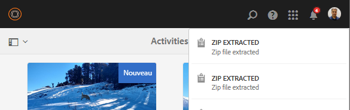

La fonctionnalité présente certaines limites :

* Si un dossier portant le même nom existe au niveau de la destination, les ressources du fichier ZIP sont extraites dans le dossier existant.

* Si vous annulez l’extraction, les ressources déjà extraites ne sont pas supprimées.

* Vous ne pouvez pas sélectionner deux fichiers ZIP simultanément et les extraire. Vous pouvez seulement extraire une archive ZIP à la fois.

## Prévisualiser des ressources {#previewing-assets}

**Prévisualisation d’une ressource**:

1. Dans l’interface utilisateur d’Assets, accédez à l’emplacement de la ressource à prévisualiser.
1. Appuyez sur la ressource concernée pour l’ouvrir.

1. En mode Aperçu, les options de zoom sont disponibles pour les [types d’images pris en charge](assets-formats.md#supported-raster-image-formats) (avec modification interactive).

   Pour effectuer un zoom avant sur une ressource, appuyez sur **[!UICONTROL +]** (ou appuyez sur la loupe de la ressource). Pour effectuer un zoom arrière, appuyez sur **[!UICONTROL -]**. Lorsque vous effectuez un zoom avant, vous pouvez observer en détail une zone de l’image en réalisant un panoramique. La flèche **[!UICONTROL Réinitialiser le zoom]** rétablit la vue initiale.

   

   Appuyez sur le bouton **[!UICONTROL Réinitialiser]** pour réinitialiser la vue à sa taille d’origine.

   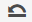

>[!MORELIKETHIS]
>
>* [Aperçu de ressources Dynamic Media](/help/assets/previewing-assets.md).
>* [Affichage des sous-ressources](managing-linked-subassets.md#viewing-subassets).

## Modification des propriétés {#editing-properties}

1. Accédez à l’emplacement de la ressource dont vous souhaitez modifier les métadonnées.

1. Sélectionnez la ressource, puis appuyez sur **[!UICONTROL Propriétés]** dans la barre d’outils pour afficher les propriétés de la ressource. Vous pouvez également sélectionner l’action rapide **[!UICONTROL Propriétés]** sur la carte de la ressource.

   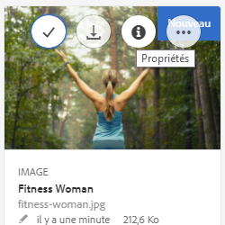

1. Sur la page **[!UICONTROL Propriétés]**, modifiez les propriétés de métadonnées sous différents onglets. Par exemple, sous l’onglet **[!UICONTROL De base]**, modifiez le titre, la description et ainsi de suite.

   La disposition de la page **[!UICONTROL Propriétés]** et les propriétés des métadonnées disponibles dépendent du schéma de métadonnées sous-jacent. Pour savoir comment modifier la disposition de la page **[!UICONTROL Propriétés]**, voir [Schémas des métadonnées](metadata-schemas.md).

1. Pour planifier une date/heure spécifique pour l’activation de la ressource, utilisez le sélecteur de date situé en regard du champ **[!UICONTROL Heure d’activation]**.

   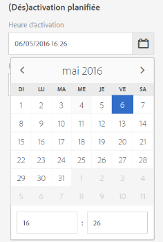

1. Pour désactiver la ressource après une durée spécifique, choisissez la date et l’heure de désactivation du sélecteur de date situé en regard de la variable **[!UICONTROL Heure de désactivation]** champ .

   La date de désactivation doit être postérieure à la date d’activation de la ressource. Après l’[!UICONTROL heure de désactivation], une ressource et ses rendus ne sont plus disponibles via l’interface web Assets ou via l’API HTTP.

   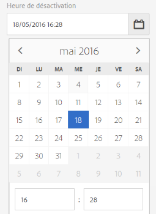

1. Sélectionnez une ou plusieurs balises dans le champ **[!UICONTROL Balises]**. Pour ajouter une balise personnalisée, saisissez son nom dans la zone et appuyez sur **[!UICONTROL Entrée]**. La nouvelle balise est enregistrée dans AEM.

   YouTube requiert des balises pour la publication et un lien vers YouTube (si un lien approprié est trouvé).
Pour créer des balises, vous devez disposer d’une autorisation d’écriture pour `/content/cq:tags/default` dans le référentiel CRX.

1. Pour attribuer une évaluation à la ressource, appuyez sur la **[!UICONTROL Avancé]** puis appuyez sur l’étoile à l’emplacement approprié pour attribuer l’évaluation souhaitée.

   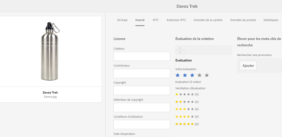

   Le score d’évaluation que vous affectez à la ressource s’affiche sous **[!UICONTROL Vos évaluations]**. Le score d’évaluation moyen que la ressource a reçu des utilisateurs qui ont évalué la ressource s’affiche sous **[!UICONTROL Évaluation]**. De plus, la répartition des scores d’évaluation contribuant au score d’évaluation moyen s’affiche sous **[!UICONTROL Ventilation d’évaluation]**. Vous pouvez rechercher des ressources en fonction de leur score d’évaluation moyen.

1. Pour afficher les statistiques d’utilisation de la ressource, appuyez sur la **[!UICONTROL Insights]** .

   Les statistiques d’utilisation comprennent les suivantes :

   * Le nombre de fois que la ressource a été visualisée ou téléchargée. 
   * Les canaux/périphériques via lesquels la ressource a été utilisée.
   * Des solutions de création où la ressource a été récemment utilisée.

   Pour plus d’informations, reportez-vous à la section [Informations sur les ressources](touch-ui-asset-insights.md).

1. Appuyez sur **[!UICONTROL Enregistrer et fermer]**.
1. Accédez à l’IU Assets. Les propriétés de métadonnées modifiées, notamment le titre, la description, les évaluations, etc., sont affichées sur la carte de la ressource en mode Carte et sous les colonnes pertinentes en mode Liste.

## Copie de ressources {#copying-assets}

Lorsque vous copiez une ressource ou un dossier, l’intégralité de la ressource ou le dossier sont copiés, avec la structure du contenu. Une ressource copiée ou un dossier sont dupliqués à l’emplacement cible. La ressource stockée à l’emplacement source n’est pas modifiée.

Quelques attributs uniques à une copie spécifique d’une ressource ne sont pas reportés. Voici quelques exemples :

* ID de la ressource, date et heure de création, versions et historique des versions. Certaines de ces propriétés sont indiquées par les propriétés `jcr:uuid`, `jcr:created` et `cq:name`.

* L’heure de création et les chemins référencés sont uniques pour chaque ressource et chaque rendu.

Les autres propriétés et informations de métadonnées sont conservées. Une copie partielle n’est pas créée lors de la copie d’une ressource.

1. Dans l’interface utilisateur d’Assets, sélectionnez une ou plusieurs ressources, puis appuyez sur **[!UICONTROL Copier]** dans la barre d’outils. Vous pouvez également sélectionner la variable **[!UICONTROL Copier]** action rapide à partir de la carte de ressource.

   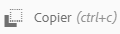

   >[!NOTE]
   >
   >Si vous utilisez l’action rapide **[!UICONTROL Copier]**, vous ne pouvez copier qu’une ressource à la fois.

1. Accédez à l’emplacement où vous souhaitez copier les ressources.

   >[!NOTE]
   >
   >Si vous copiez une ressource au même endroit, [!DNL Experience Manager] génère automatiquement une variante du nom. Par exemple, si vous copiez une ressource intitulée Carré, [!DNL Experience Manager] génère automatiquement le titre de sa copie en tant que Carré1.

1. Appuyez sur le bouton **[!UICONTROL Coller]** icône de ressource dans la barre d’outils :

   

   Les ressources sont copiées à cet emplacement.

   >[!NOTE]
   >
   >L’icône **[!UICONTROL Coller]** est disponible dans la barre d’outils tant que l’opération de collage n’est pas terminée.

## Déplacement ou changement du nom des ressources {#moving-or-renaming-assets}

Lorsque vous déplacez des ressources (ou des dossiers) vers un autre emplacement, les ressources (ou dossiers) ne sont pas dupliquées, contrairement à lors de la copie de la ressource. Les ressources (ou les dossiers) sont placés à l’emplacement cible et sont supprimés de l’emplacement source. Vous pouvez également renommer la ressource lorsque vous la déplacez vers le nouvel emplacement. Si vous déplacez une ressource publiée vers un autre emplacement, vous avez la possibilité de la republier. Par défaut, l’opération de déplacement sur une ressource publiée annule automatiquement sa publication. La ressource déplacée est republiée si l’auteur sélectionne la variable [!UICONTROL Republier] lors du déplacement de la ressource.

Pour déplacer des ressources ou des dossiers :

1. Accédez à l’emplacement de la ressource à déplacer.

Pour déplacer des ressources ou des dossiers :

1. Accédez à l’emplacement de la ressource à déplacer.

1. Sélectionnez la ressource et cliquez sur l’option **[!UICONTROL Déplacer]** dans la barre d’outils.
   

1. Dans l’assistant de [!UICONTROL déplacement des ressources], procédez comme suit :

   * Spécifiez le nom de la ressource après l’avoir déplacée. Ensuite, cliquez sur **[!UICONTROL Suivant]** pour continuer.

   * Cliquez sur **[!UICONTROL Annuler]** pour arrêter le processus.
   >[!NOTE]
   >
   >* Vous pouvez attribuer le même nom à la ressource si aucune autre ressource portant ce nom n’existe dans le nouvel emplacement. Cependant, vous devez utiliser un nouveau nom si vous déplacez la ressource vers un emplacement dans lequel une ressource portant le même nom existe. Si vous utilisez le même nom, le système génère automatiquement une variante du nom. Par exemple, si votre ressource porte le nom Carré, le système génère le nom Carré1 pour sa copie.
   >* Lors de l’attribution d’un nouveau nom à un fichier, aucun espace n’est autorisé dans le nom.

1. Dans la boîte de dialogue **[!UICONTROL Sélectionner la destination]**, procédez comme suit :

   * Accédez au nouvel emplacement des ressources, puis cliquez sur **[!UICONTROL Suivant]** pour continuer.

   * Cliquez sur **[!UICONTROL Précédent]** pour revenir à l’écran **[!UICONTROL Renommer]**.

1. Si les ressources déplacées sont référencées par des pages, des ressources ou des collections, l’onglet **[!UICONTROL Adapter les références]** s’affiche à côté de l’onglet **[!UICONTROL Sélectionner la destination]**.

   Dans l’écran **[!UICONTROL Adapter les références]**, effectuez l’une des actions suivantes :

   * Spécifiez les références à ajuster en fonction des nouveaux détails, puis cliquez sur **[!UICONTROL Déplacer]** pour continuer.

   * Dans la colonne **[!UICONTROL Ajuster]**, sélectionnez ou annulez la sélection des références aux ressources.
   * Cliquez sur **[!UICONTROL Précédent]** pour revenir à l’écran **[!UICONTROL Sélectionner la destination]**.

   * Cliquez sur **[!UICONTROL Annuler]** pour abandonner l’opération de déplacement.

   Si vous ne mettez pas à jour les références, elles continuent à pointer vers le chemin précédent de la ressource. Si vous adaptez les références, elles sont mises à jour avec le nouveau chemin de la ressource.

### Déplacement de ressources à l’aide de l’opération Glisser {#move-using-drag}

Vous pouvez déplacer des ressources (ou des dossiers) vers un dossier frère en les faisant glisser vers l’emplacement cible, au lieu d’utiliser l’option [!UICONTROL Déplacer] dans l’interface utilisateur. Toutefois, cette opération n’est possible que dans le mode Liste.

Le déplacement de ressources par glisser-déposer n’ouvre pas l’assistant [!UICONTROL Déplacer une ressource], vous n’avez par conséquent pas la possibilité de renommer les ressources lors du déplacement. En outre, les ressources déjà publiées sont republiées lors de leur déplacement par glisser-déposer, sans approbation préalable de la republication.

## Gestion des rendus {#managing-renditions}

1. Vous pouvez ajouter ou supprimer des rendus correspondant à une ressource, à l’exception de celle d’origine. Accédez à l’emplacement de la ressource pour laquelle vous souhaitez ajouter ou supprimer des rendus.

1. Appuyez sur la ressource pour ouvrir sa page de ressource.

   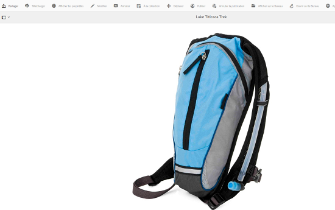

1. Appuyez sur le bouton **[!UICONTROL Navigation globale]** et sélectionnez **[!UICONTROL Rendus]** dans la liste.

   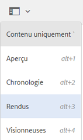

1. Dans le panneau **[!UICONTROL Rendus]**, consultez la liste des rendus générés pour la ressource.

   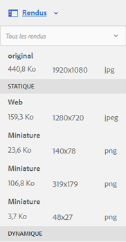

   >[!NOTE]
   >
   >Par défaut, [!DNL Experience Manager] Les ressources n’affichent pas le rendu d’origine de la ressource en mode d’aperçu. Si vous êtes administrateur, vous pouvez utiliser des superpositions pour configurer des [!DNL Experience Manager] Ressources pour afficher les rendus originaux en mode aperçu.

1. Sélectionnez un rendu afin de l’afficher ou de le supprimer.

   **Suppression d’un rendu**

   Sélectionnez un rendu dans la **[!UICONTROL Rendus]** , puis appuyez sur le bouton **[!UICONTROL Supprimer le rendu]** à partir de l’icône [barre d’outils](/help/sites-authoring/basic-handling.md). Une fois le traitement des ressources terminé, il est impossible de supprimer les rendus en masse. Pour les ressources individuelles, vous pouvez supprimer manuellement les rendus à l’aide de l’interface utilisateur. Pour plusieurs ressources, vous pouvez personnaliser Experience Manager pour supprimer des rendus spécifiques ou supprimer les ressources et charger à nouveau les ressources supprimées.

   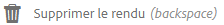

   **Chargement d’un nouveau rendu**

   Accédez à la page des détails de la ressource, puis appuyez sur la **[!UICONTROL Ajouter un rendu]** dans la barre d’outils pour charger un nouveau rendu pour la ressource.

   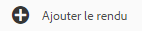

   >[!NOTE]
   >
   >Si vous sélectionnez un rendu dans le panneau **[!UICONTROL Rendus]**, la barre d’outils change de contexte et affiche uniquement les actions pertinentes par rapport au rendu. Les options, telles que **[!UICONTROL Télécharger le rendu]** ne s’affiche pas. Pour afficher ces options dans la barre d’outils, accédez à la page des détails de la ressource.

   Vous pouvez configurer les dimensions du rendu à afficher dans la page de détails d’une ressource image ou vidéo. Selon les dimensions que vous spécifiez, [!DNL Experience Manager] Assets affiche le rendu avec les dimensions exactes ou les plus proches.

   Pour configurer les dimensions de rendu d’une image au niveau des détails de la ressource, recouvrez la propriété **[!UICONTROL renditionpicker]** node `libs/dam/gui/content/assets/assetpage/jcr:content/body/content/content/items/assetdetail/items/col1/items/assetview/renditionpicker` et configurez la valeur de la propriété width . Configurez la propriété **[!UICONTROL size (Long) in KB]** (taille (Longueur) en Ko) à la place de la largeur pour personnaliser le rendu dans la page des détails de la ressource selon la taille de l’image. Pour une personnalisation dépendant de la taille, la propriété **[!UICONTROL preferOriginal]** affecte les préférences à l’image initiale si la taille du rendu correspondant est supérieure à celle de l’image initiale.

   De même, vous pouvez personnaliser la variable **[!UICONTROL Annotation]** image de page en superposant `libs/dam/gui/content/assets/annotate/jcr:content/body/content/content/items/content/renditionpicker`.

   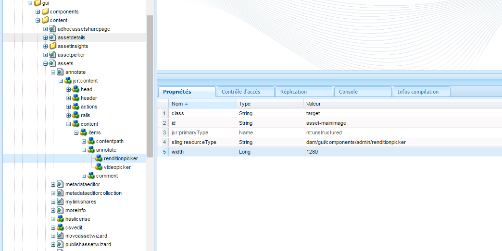

   Pour configurer les dimensions du rendu d’une ressource vidéo, accédez au **[!UICONTROL videopicker]** noeud dans le référentiel CRX à l’emplacement `/libs/dam/gui/content/assets/assetpage/jcr:content/body/content/content/items/assetdetail/items/col1/items/assetview/videopicker`, recouvrez le noeud, puis modifiez la propriété appropriée.

   >[!NOTE]
   >
   >Les annotations vidéo ne sont prises en charge que sur les navigateurs qui acceptent les formats vidéo compatibles avec HTML5. Selon le navigateur, différents formats vidéo sont en outre pris en charge.

Pour plus d’informations sur les sous-ressources, voir [gestion des sous-ressources](managing-linked-subassets.md).

## Suppression des ressources {#deleting-assets}

Pour résoudre ou supprimer les références entrantes provenant d’autres pages, mettez à jour les références appropriées avant de supprimer une ressource.

De plus, désactivez le bouton Forcer la suppression à l’aide d’un recouvrement afin d’empêcher les utilisateurs de supprimer des ressources référencées et de conserver des liens rompus.

Pour pouvoir supprimer une ressource, vous devez disposer des autorisations appropriées dans la gestion des actifs numériques/ressource. Si vous disposez uniquement d’autorisations de modification, vous pourrez seulement modifier les métadonnées de la ressource et ajouter des annotations à cette dernière. Toute suppression s’avérera impossible.

**Pour supprimer des ressources**:

1. Accédez à l’emplacement des ressources à supprimer.

1. Sélectionnez la ressource, puis appuyez sur la **[!UICONTROL Supprimer]** dans la barre d’outils.

   

1. Dans la boîte de dialogue de confirmation, appuyez sur :

   * **[!UICONTROL Annuler]** pour arrêter l’action
   * **[!UICONTROL Supprimer]** pour confirmer l’action en fonction des éléments suivants :

      * Si la ressource ne comporte aucune référence, elle est supprimée.
      * Si la ressource comporte des références, un message d’erreur vous informe qu’**[!UICONTROL une ou plusieurs ressources sont référencées.]** Vous pouvez sélectionner **[!UICONTROL Forcer la suppression]** ou **[!UICONTROL Annuler]**.

   >[!NOTE]
   >
   >Pour résoudre ou supprimer les références entrantes provenant d’autres pages, mettez à jour les références appropriées avant de supprimer une ressource.
   >
   >Désactivez également la variable **[!UICONTROL Forcer la suppression]** à l’aide d’une superposition, pour empêcher les utilisateurs de supprimer des ressources référencées et de conserver des liens rompus.

## Téléchargement de ressources {#downloading-assets}

Voir [Téléchargement de ressources à partir d’AEM](download-assets-from-aem.md)

## Publication et annulation de la publication de ressources {#publish-assets}

Après avoir chargé, traité ou modifié vos ressources sur l’auteur [!DNL Experience Manager], vous publiez la ressource sur le serveur de publication. La publication rend la ressource disponible publiquement. L’action d’annulation de publication a supprimé la ressource du serveur de publication, mais pas du serveur auteur.

Pour plus d’informations spécifiques à [!DNL Dynamic Media], consultez la section [Publication de ressources  [!DNL Dynamic Media] ](publishing-dynamicmedia-assets.md).

1. Accédez à l’emplacement de la ressource ou du dossier de ressources que vous souhaitez publier ou que vous souhaitez supprimer dans l’environnement de publication (annuler la publication).

1. Sélectionnez la ressource ou le dossier dont vous souhaitez annuler la publication, puis cliquez sur **[!UICONTROL Gérer la publication]**  dans la barre d’outils. Pour publier rapidement, vous pouvez également sélectionner l’option **[!UICONTROL Publication rapide]** dans la barre d’outils. Si le dossier que vous souhaitez publier comprend un sous-dossier vide, ce dernier n’est pas publié.

1. Sélectionnez l’option **[!UICONTROL Modifier]** ou **[!UICONTROL Annuler la publication]** selon vos besoins.

   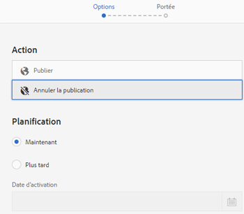
   *Figure : options Publier et Annuler la publication et option de planification.*

1. Sélectionnez **[!UICONTROL Maintenant]** pour agir immédiatement sur la ressource ou sélectionnez **[!UICONTROL Plus tard]** pour planifier l’action. Sélectionnez une date et une heure si vous choisissez l’option **[!UICONTROL Plus tard]**. Cliquez sur **[!UICONTROL Suivant]**.

1. Lors d’une publication, si la ressource fait référence à d’autres ressources, ses références sont répertoriées dans l’Assistant. Seules les références qui ne sont pas publiées ou modifiées depuis la dernière publication s’affichent. Choisissez les références que vous souhaitez publier.

1. Lors de l’annulation de la publication, si une ressource fait référence à d’autres ressources, sélectionnez les références dont vous souhaitez annuler la publication. Cliquez sur **[!UICONTROL Annuler la publication]**. Dans la boîte de dialogue de confirmation, cliquez sur **[!UICONTROL Annuler]** pour arrêter l’action ou sur **[!UICONTROL Annuler la publication]** pour confirmer que les ressources doivent être dépubliées à la date spécifiée.

Gardez à l’esprit les limites et conseils suivants liés à la publication ou à l’annulation de la publication de ressources ou de dossiers :

* L’option [!UICONTROL Gérer la publication] n’est disponible que pour les comptes d’utilisateurs disposant d’autorisations de réplication.
* Lors de l’annulation de la publication d’une ressource complexe, annulez uniquement la publication de la ressource. Évitez d’annuler la publication des références car elles peuvent être référencées par d’autres ressources publiées.
* Les dossiers vides ne sont pas publiés.
* Si vous publiez une ressource qui est en cours de traitement, seul le contenu original est publié. Les rendus sont absents. Vous pouvez attendre la fin du traitement avant de publier ou republier la ressource une fois le traitement terminé.

## Création d’un groupe d’utilisateurs fermé {#closed-user-group}

Un groupe d’utilisateurs fermé (CUG) est utilisé pour limiter l’accès à des dossiers de ressources spécifiques publiés à partir d’AEM. Si vous créez un groupe d’utilisateurs fermé pour un fichier, l’accès au dossier (y compris aux ressources du dossier et à ses sous-dossiers) est limité aux membres ou aux groupes attribués. Pour accéder au dossier, ils doivent se connecter à l’aide de leurs informations d’identification de sécurité.

Les groupes d’utilisateurs fermés sont un moyen supplémentaire de restreindre l’accès à vos ressources. Vous pouvez également configurer une page de connexion pour le dossier.

**Pour créer un groupe d’utilisateurs fermé**:

1. Sélectionnez un dossier dans l’interface utilisateur d’Assets, puis appuyez sur la touche **[!UICONTROL Propriétés]** dans la barre d’outils pour afficher la page des propriétés.
1. Sous l’onglet **[!UICONTROL Autorisations]**, ajoutez les membres ou les groupes sous **[!UICONTROL Groupe d’utilisateurs fermé]**.

   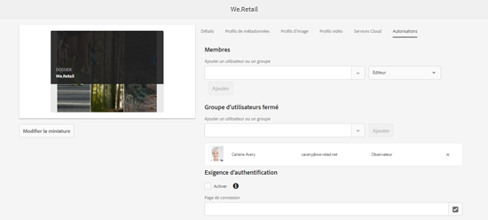

1. Pour afficher un écran de connexion lorsque les utilisateurs accèdent au dossier, sélectionnez l’option **[!UICONTROL Activer]**. Ensuite, sélectionnez le chemin de la page de connexion dans AEM et enregistrez les modifications.

   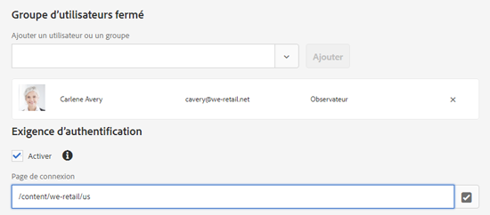

   Si vous ne spécifiez pas le chemin d’une page de connexion, [!DNL Experience Manager] affiche la page de connexion par défaut dans l’instance de publication.

1. Publiez le dossier, puis tentez d’y accéder à partir de l’instance de publication. Un écran de connexion s’affiche.
1. Si vous êtes membre d’un groupe d’utilisateurs fermé, saisissez vos informations d’identification de sécurité. Le dossier s’affiche après qu’[!DNL Experience Manager] vous a authentifié.

## Recherche de ressources {#searching-assets}

Les recherches de base sont décrites dans la section [Rechercher et filtrer. ](/help/sites-authoring/search.md#search-and-filter) Utilisez la variable **[!UICONTROL Rechercher]** pour rechercher des ressources, des balises et des métadonnées. Vous pouvez rechercher des parties d’une chaîne en utilisant le caractère générique astérisque. En outre, vous pouvez personnaliser la variable **[!UICONTROL Rechercher]** panneau à l’aide de [Facettes de recherche](search-facets.md).

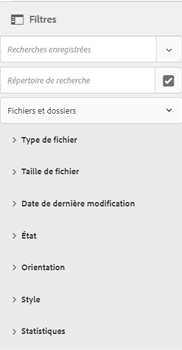

Pour les ressources récemment chargées, leurs métadonnées (notamment les titres, les balises, etc.) ne sont pas immédiatement disponibles dans la liste des suggestions qui s’affiche lorsque vous entrez des données dans la zone Omni-recherche.

Ceci est dû au fait que [!DNL Experience Manager] Assets attend jusqu’à l’expiration d’un délai d’expiration (1 heure par défaut) avant d’exécuter une tâche en arrière-plan afin d’indexer les métadonnées pour toutes les ressources récemment chargées/mises à jour et de les ajouter à la liste de suggestions.

## Utilisation des actions rapides {#quick-actions}

Les icônes d’action rapide sont disponibles pour une ressource à la fois. Selon l’appareil, effectuez les actions suivantes pour afficher les icônes d’action rapide :

* Appareils tactiles : appuyez longuement. Par exemple, sur un iPad, vous pouvez appuyer longuement sur une ressource pour afficher les actions rapides.
* Appareils non tactiles : survolez avec le pointeur. Par exemple, sur un poste de travail, la barre d’actions rapides s’affiche si vous survolez la miniature de la ressource avec le pointeur de la souris.

### Accès aux ressources et sélection de ces ressources {#navigating-and-selecting-assets}

Vous pouvez afficher, parcourir et sélectionner les ressources avec l’un des modes disponibles (carte, colonne, liste) à l’aide de la variable **[!UICONTROL Sélectionner]** icône . **[!UICONTROL Sélectionner]** s’affiche sous la forme d’une action rapide en mode Carte.

En mode Liste, **[!UICONTROL Sélectionner]** s’affiche lorsque vous placez le pointeur de la souris sur la miniature avant les noms des ressources/dossiers dans la liste.

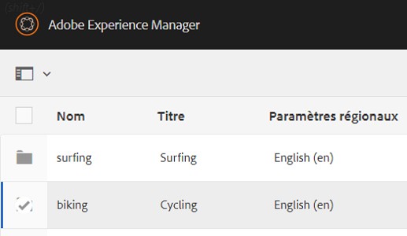

Similaire au mode Liste, **[!UICONTROL Sélectionner]** s’affiche lorsque vous placez le pointeur de la souris sur la miniature avant les noms des ressources ou du dossier en mode Colonne.

Pour plus d’informations, voir [Affichage et sélection des ressources](/help/sites-authoring/basic-handling.md#viewing-and-selecting-resources).

## Modifier les images {#editing-images}

Les outils de modification dans la [!DNL Experience Manager] L’interface Assets vous permet d’effectuer de petites tâches de modification sur les ressources d’image. Vous pouvez recadrer les images, les faire pivoter, les retourner et effectuer d’autres tâches de modification. Vous pouvez également ajouter des zones cliquables aux ressources.

La modification d’images est prise en charge pour les fichiers aux formats suivants :

* BMP
* GIF
* PNG
* JPEG

Pour certains composants, **[!UICONTROL Plein écran]** Le mode comporte d’autres options disponibles.

Pour modifier un fichier TXT, définissez **[!UICONTROL Externalisateur de lien Day CQ]** dans Configuration Manager.

Vous pouvez également ajouter des zones cliquables à l’aide de l’éditeur d’image. Pour plus d’informations, voir [Ajout de zones cliquables](image-maps.md).

**Pour modifier des images**:

1. Pour ouvrir une ressource en mode d’édition, effectuez l’une des opérations suivantes :

   * Sélectionnez la ressource, puis cliquez sur le bouton **[!UICONTROL Modifier]** dans la barre d’outils.
   * Appuyer **[!UICONTROL Modifier]** qui s’affiche sur une ressource en mode Carte.
   * Dans la page Ressource, appuyez sur la **[!UICONTROL Modifier]** dans la barre d’outils.

   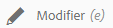

1. Pour recadrer l’image, appuyez sur **[!UICONTROL Recadrer]**.

   

1. Sélectionnez une option dans la liste. La zone de recadrage s’affiche sur l’image en fonction de l’option choisie. L’option **[!UICONTROL Main libre]** vous permet de recadrer l’image sans restriction de format.

   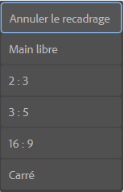

1. Sélectionnez la zone à recadrer, puis redimensionnez ou repositionnez-la sur l’image.
1. Utilisez la variable **[!UICONTROL Terminer]** dans le coin supérieur droit pour recadrer l’image. Appuyer **[!UICONTROL Terminer]** déclenche également la régénération des rendus.

   

1. Utilisez la variable **[!UICONTROL Annuler]** et **[!UICONTROL Rétablir]** en haut à droite pour revenir à l’image non recadrée ou conserver l’image recadrée, respectivement.

   

1. Appuyez sur le **[!UICONTROL Rotation]** pour faire pivoter l’image dans le sens des aiguilles d’une montre ou dans le sens inverse des aiguilles d’une montre.

   

1. Appuyez sur le **[!UICONTROL Retourner]** pour retourner l’image horizontalement ou verticalement.

   

1. Appuyez sur le bouton **[!UICONTROL Terminer]** pour enregistrer les modifications.

   

## Utilisation de la chronologie {#timeline}

Le **[!UICONTROL Chronologie]** vous permet d’afficher divers événements pour un élément sélectionné, tels que des workflows principaux pour une ressource, des commentaires, des annotations, des journaux d’activité et des versions.

Dans la [console Collections](managing-collections-touch-ui.md#navigating-the-collections-console), la liste **[!UICONTROL Tout afficher]** contient des options permettant de n’afficher que les commentaires et les workflows. De plus, la chronologie ne s’affiche que pour les collections de niveau supérieur répertoriées dans la console. Elle ne s’affiche pas si vous accédez à l’intérieur des collections.

**[!UICONTROL Chronologie]** contient plusieurs [options spécifiques aux fragments de contenu](content-fragments-managing.md#timeline-for-content-fragments); cette fonctionnalité requiert [[!DNL Experience Manager] 6.4 Service Pack 2 (6.4.2.0)](/help/release-notes/sp-release-notes.md) ou plus tard.

**Pour utiliser la chronologie**:

1. Ouvrez la page Ressource de la ressource ou sélectionnez cette dernière dans l’IU Assets.
1. Appuyez sur le bouton **[!UICONTROL Navigation globale]** et choisissez **[Chronologie]** dans la liste.

   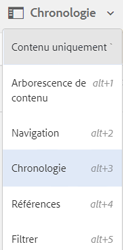

1. Dans la liste qui s’affiche, utilisez l’option **[!UICONTROL Tout afficher]** pour filtrer les résultats selon les commentaires, les versions, les workflows et les activités.

   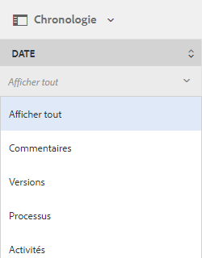

## Ajouter des annotations {#annotating}

Les annotations sont des commentaires ou des notes d’explication ajoutées aux images ou vidéos. Les annotations offrent aux spécialistes marketing la possibilité de collaborer et de laisser des commentaires sur des ressources.

Les annotations vidéo ne sont prises en charge que sur les navigateurs qui acceptent les formats vidéo compatibles avec HTML5. Formats vidéo qui [!DNL Experience Manager] La prise en charge des ressources dépend du navigateur.

Pour les fragments de contenu, [les annotations sont créées dans l’éditeur.](content-fragments-variations.md#annotating-a-content-fragment); cette fonctionnalité requiert [[!DNL Experience Manager] 6.4 Service Pack 2 (6.4.2.0)](/help/release-notes/sp-release-notes.md) ou plus tard.

Vous pouvez ajouter plusieurs annotations avant de les enregistrer.

Vous pouvez ajouter des annotations aux ressources vidéo. Lorsque vous annotez des vidéos, le lecteur se met en pause pour vous permettre d’ajouter une annotation sur une image. Pour plus d’informations, voir [Gestion de ressources vidéo](managing-video-assets.md).

Vous pouvez également ajouter des annotations à une collection. Toutefois, si une collection contient des collections enfants, vous pouvez ajouter des annotations ou des commentaires uniquement à la collection parent. Le **[!UICONTROL Annoter]** n’est pas disponible pour les collections enfants.

**Pour ajouter des annotations**:

1. Accédez à l’emplacement de la ressource à laquelle vous souhaitez ajouter des annotations.
1. Appuyez sur le bouton **[!UICONTROL Annoter]** de l’une des options suivantes :

   * [Actions rapides](managing-assets-touch-ui.md#quick-actions)
   * Dans la barre d’outils, après avoir sélectionné la ressource    ou avoir accédé à la page de la ressource

   

1. Ajoutez un commentaire dans la zone **[!UICONTROL Commentaire]** en bas de la chronologie. Vous pouvez également marquer une zone de l’image et ajouter une annotation dans la variable **[!UICONTROL Ajouter une annotation]** de la boîte de dialogue

   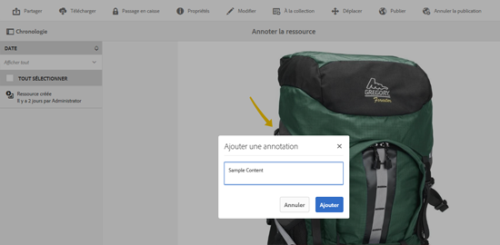

1. Pour signaler une annotation à un utilisateur, indiquez l’adresse électronique de l’utilisateur et ajoutez le commentaire. Par exemple, pour informer Aaron McDonald d’une annotation, saisissez @aa. Des conseils à l’usage des utilisateurs correspondant s’affichent dans une liste. Sélectionnez l’adresse électronique d’Aaron dans la liste pour le marquer avec le commentaire. De même, vous pouvez taguer d’autres personnes à n’importe quel emplacement de l’annotation, avant ou après celle-ci.

   >[!NOTE]
   >
   >Si l’utilisateur ne dispose pas des droits d’administration, les suggestions s’affichent uniquement s’il dispose de droits de lecture sur `/home` dans CRXDE.

   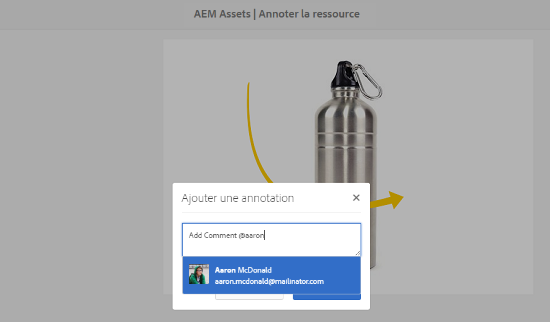

1. Après avoir ajouté l’annotation, appuyez sur **[!UICONTROL Ajouter]** pour l’enregistrer. Une notification relative à l’annotation est envoyée à Aaron.

   

1. Appuyer **[!UICONTROL Fermer]** pour quitter **[!UICONTROL Annotation]** mode .
1. Pour afficher la notification, connectez-vous à [!DNL Experience Manager] Ressources avec les informations d’identification d’Aaron MacDonald et appuyez sur la **[!UICONTROL Notifications]** pour afficher la notification.

1. Pour choisir une autre couleur afin de différencier les utilisateurs, appuyez sur la **[!UICONTROL Profil]** icône et appuyez sur **[!UICONTROL Mes préférences]**.

   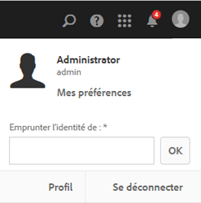

1. Indiquez la couleur de votre choix dans la variable **[!UICONTROL Couleur de l’annotation]** , puis appuyez sur **[!UICONTROL Accepter]**.

   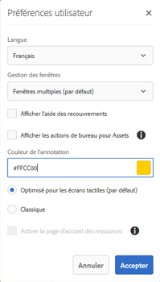

### Affichage des annotations enregistrées {#viewing-saved-annotations}

Vous ne pouvez afficher qu’une annotation à la fois.

>[!NOTE]
>
>Si vous sélectionnez plusieurs annotations, la dernière en date est visible dans l’interface utilisateur.
>
>La sélection multiple est prise en charge uniquement pour l’impression de la ressource annotée au format PDF.

1. Pour afficher les annotations enregistrées pour une ressource, accédez à l’emplacement de la ressource et ouvrez la page de la ressource.

1. Appuyez sur le bouton **[!UICONTROL Navigation globale]** et appuyez sur **[!UICONTROL Chronologie]** dans la liste.

   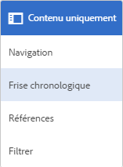

1. Dans la liste **[!UICONTROL Tout afficher]** de la chronologie, sélectionnez **[!UICONTROL Commentaires]** pour filtrer les résultats selon les annotations.

   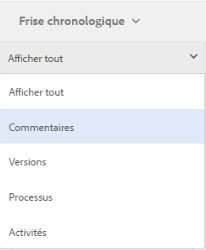

1. Appuyez sur un commentaire dans le **[!UICONTROL Chronologie]** pour afficher l’annotation correspondante sur l’image.

   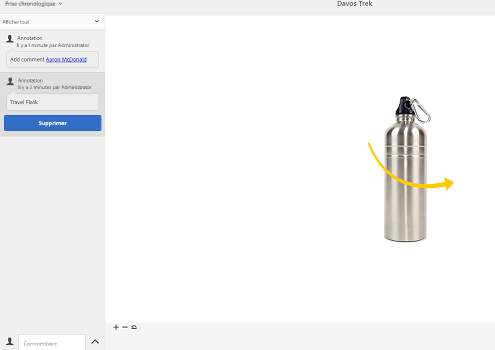

1. Appuyer **[!UICONTROL Supprimer]** pour supprimer un commentaire particulier.

### Impression des annotations {#printing-annotations}

Si une ressource comporte des annotations ou si elle a fait l’objet d’un workflow de révision, vous pouvez l’imprimer avec les annotations et le statut de révision sous la forme d’un fichier PDF en vue d’effectuer une révision hors ligne.

Vous pouvez également choisir de n’imprimer que les annotations ou le statut de révision.

>[!NOTE]
>
>Vous pouvez sélectionner plusieurs annotations lors de l’impression de la ressource annotée au format PDF.

Il se peut que les annotations trop longues ne s’affichent pas correctement dans le fichier PDF. Pour un rendu optimal, Adobe recommande de limiter la taille des annotations à 50 mots.

Pour imprimer les annotations et l’état de révision, appuyez sur le bouton **[!UICONTROL Imprimer]** et suivez les instructions de l’assistant. L’icône **[!UICONTROL Imprimer]** ne s’affiche dans la barre d’outils que lorsque la ressource est associée à au moins une annotation ou un statut de révision.

1. Ouvrez la page d’aperçu d’une ressource à partir de l’interface utilisateur d’Assets.
1. Utilisez l’une des méthodes suivantes :

   * Pour imprimer toutes les annotations et l’état de révision, passez à l’étape 4.
   * Pour imprimer des annotations et un état de révision spécifiques, ouvrez le [Chronologie](managing-assets-touch-ui.md#timeline) puis passez à l’étape 3.

1. Pour imprimer des annotations spécifiques, sélectionnez-les dans le **[!UICONTROL Chronologie]**.

   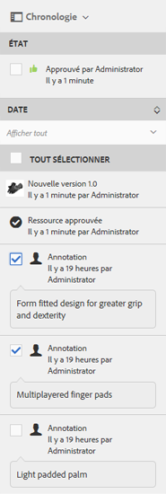

   Pour imprimer uniquement l’état de révision, sélectionnez-le dans la **[!UICONTROL Chronologie]**.

   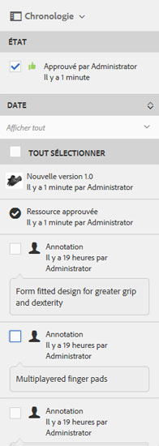

1. Dans la barre d’outils, appuyez sur la **[!UICONTROL Imprimer]** icône .

   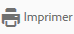

1. Dans la **[!UICONTROL Imprimer]** , choisissez la position à laquelle vous souhaitez afficher les annotations ou l’état de révision dans le PDF. Par exemple, si vous souhaitez que les annotations ou l’état s’impriment dans le coin supérieur droit de la page qui contient l’image imprimée, utilisez la méthode **[!UICONTROL En haut à gauche]** (par défaut) .

   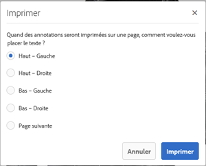

   Vous pouvez choisir d’autres paramètres en fonction de l’emplacement où vous souhaitez que les annotations ou l’état s’affichent dans le PDF imprimé. Si vous souhaitez que les annotations ou l’état s’affichent sur une page distincte de la ressource imprimée, choisissez **[!UICONTROL Page suivante]**.

1. Appuyer **[!UICONTROL Imprimer]**. Selon l’option choisie à l’étape 2, le PDF généré affiche les annotations ou l’état à l’emplacement spécifié. Par exemple, si vous choisissez d’imprimer à la fois les annotations et le statut de révision à l’aide du paramètre **[!UICONTROL Haut et gauche]**, vous obtiendrez un fichier PDF comparable à l’illustration ci-dessous.

   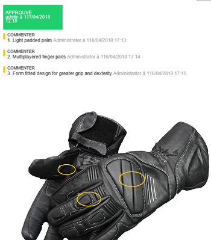

1. Téléchargez ou imprimez le fichier PDF à l’aide des options situées dans le coin supérieur droit.

   

   >[!NOTE]
   >
   >Si la ressource contient des sous-ressources, vous pouvez les imprimer avec leurs annotations spécifiques.

   Pour modifier l’aspect du fichier de PDF rendu, par exemple la couleur, la taille et le style de la police, la couleur d’arrière-plan des commentaires et des états, ouvrez le **[!UICONTROL Configuration du PDF d’annotation]** de **[!UICONTROL Configuration Manager]** et modifiez les options de votre choix. Par exemple, pour modifier la couleur d’affichage du statut approuvé, modifiez le code couleur dans le champ correspondant. Pour plus d’informations sur la modification de la couleur de police des annotations, voir [Annotations](managing-assets-touch-ui.md#annotating).

   

   Revenez au fichier PDF généré et actualisez-le. Le fichier PDF actualisé affiche désormais les modifications que vous avez effectuées.

**Pour imprimer des annotations dans des langues étrangères**: Si une ressource contient des annotations dans des langues étrangères (en particulier dans des langues non latines), vous devez d’abord configurer le service Font Manager CQ-DAM-Handler-Gibson sur la page [!DNL Experience Manager] pour pouvoir imprimer ces annotations. Lorsque vous configurez ce service, indiquez le chemin d’accès aux polices à utiliser pour ces langues.

1. Ouvrez le **[!UICONTROL Service Font Manager CQ-DAM-Handler-Gibson]** page de configuration de l’URL [https://&lt;server>:&lt;port>/system/console/configMgr/com.day.cq.dam.handler.gibson.fontmanager.impl.FontManagerServiceImpl](http://localhost:4502/system/console/configMgr/com.day.cq.dam.handler.gibson.fontmanager.impl.FontManagerServiceImpl).
1. Pour configurer **[!UICONTROL Service Font Manager CQ-DAM-Handler-Gibson]**, effectuez l’une des opérations suivantes :

   * Dans le **[!UICONTROL Polices système]** , indiquez le chemin d’accès complet au répertoire des polices sur votre système. Par exemple, si vous êtes un utilisateur Mac, vous pouvez spécifier le chemin comme `/Library/Fonts` dans le **[!UICONTROL Polices système]** l’option du répertoire . [!DNL Experience Manager] récupère les polices dans ce répertoire.
   * Créez un répertoire nommé **fonts** dans le dossier **[!UICONTROL crx-quickstart]**. **** Le service Font Manager CQ-DAM-Handler-Gibson récupère automatiquement les polices à l’emplacement `crx-quickstart/fonts`. Vous pouvez remplacer ce chemin par défaut depuis l’élément **[!UICONTROL Adobe Server Fonts]** l’option du répertoire .
   * Créez un dossier pour les polices sur votre système et stockez-y les polices de votre choix. Ensuite, spécifiez le chemin d’accès complet à ce dossier dans le **[!UICONTROL Polices client]** l’option du répertoire .

1. Accédez au **[!UICONTROL PDF d’annotation]** configuration à partir de l’URL [https://&lt;server>:&lt;port>/system/console/configMgr/com.day.cq.dam.core.impl.annotation.pdf.AnnotationPdfConfig](http://localhost:4502/system/console/configMgr/com.day.cq.dam.core.impl.annotation.pdf.AnnotationPdfConfig).
1. Configurez la variable **[!UICONTROL PDF d’annotation]** avec le jeu correct font-family comme suit :

   * Incluez la chaîne `<font_family_name_of_custom_font, sans-serif>` dans l’option font-family. Par exemple, si vous souhaitez imprimer des annotations en chinois, en japonais et en coréen (CJC), insérez la chaîne `Arial Unicode MS, Noto Sans, Noto Sans CJK JP, sans-serif` dans l’option font-family. Si vous souhaitez imprimer des annotations en hindi, téléchargez la police appropriée et configurez la famille de polices comme suit : Arial Unicode MS, Noto Sans, Noto Sans CJK JP, Noto Sans Devanagari, sans-serif.

1. Redémarrez l’instance [!DNL Experience Manager].

Voici un exemple de configuration : [!DNL Experience Manager] pour imprimer des annotations en chinois, en japonais et en coréen (CJC) :

1. Téléchargez les polices Google Noto CJK à partir des liens ci-dessous et enregistrez-les dans le répertoire des polices configuré dans le service Font Manager.

   * Police tout-en-un Super CJK : [https://www.google.com/get/noto/help/cjk/](https://www.google.com/get/noto/help/cjk/)
   * Noto Sans (pour les langues européennes) : [https://www.google.com/get/noto/](https://www.google.com/get/noto/)
   * Polices Noto pour une langue de votre choix : [https://www.google.com/get/noto/](https://www.google.com/get/noto/)

1. Configurez le fichier PDF d’annotation en définissant le paramètre font-family sur `Arial Unicode MS, Noto Sans, Noto Sans CJK JP, sans-serif`. Cette configuration est disponible par défaut et fonctionne pour l’ensemble des langues européennes, ainsi que pour le chinois, le japonais et le coréen (CJC).
1. Si la langue de votre choix est différente de celles mentionnées à l’étape 2, ajoutez une entrée appropriée (séparée par des virgules) à la famille de polices font-family par défaut.

## Création de versions de ressources {#asset-versioning}

Le contrôle de version permet de créer un instantané des ressources numériques à un moment donné. De plus, il aide à restaurer ultérieurement des ressources dans leur état précédent. Par exemple, si vous souhaitez annuler une modification apportée à une ressource, restaurez la version non modifiée de la ressource.

Voici quelques scénarios de création de versions :

* Vous modifiez une image dans une autre application et la téléchargez vers [!DNL Experience Manager] Ressources. Une version de l’image est créée afin que votre image d’origine ne soit pas remplacée.
* Vous modifiez les métadonnées d’une ressource.
* Vous utilisez l’application de bureau [!DNL Experience Manager] pour extraire une ressource existante et enregistrer vos changements. Une nouvelle version est créée chaque fois que la ressource est enregistrée.

Vous pouvez également activer le contrôle de version automatique à l’aide d’un workflow. Lorsque vous créez une version d’une ressource, les métadonnées et les rendus sont enregistrés avec la version. Les rendus sont d’autres affichages d’une même image (un rendu PNG d’un fichier JPEG téléchargé, par exemple).

La création de versions permet d’effectuer les opérations suivantes :

* créer une version d’une ressource ;
* afficher la révision actuelle d’une ressource ;
* restaurer une version précédente de la ressource.

**Pour créer un contrôle de version des ressources**:

1. Accédez à l’emplacement de la ressource pour laquelle vous souhaitez créer une version, puis cliquez dessus pour ouvrir la page Ressource correspondante.

1. Cliquez sur le bouton **[!UICONTROL Navigation globale]** et choisissez **[!UICONTROL Chronologie]** dans le menu.

   

1. Cliquez sur **[!UICONTROL Actions]** dans la partie inférieure pour afficher les actions disponibles que vous pouvez effectuer sur la ressource.

1. Cliquez sur **[!UICONTROL Enregistrer comme version]** pour créer une version de la ressource.

   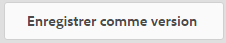

1. Ajoutez un libellé et un commentaire, puis cliquez sur **[!UICONTROL Créer]** pour créer une version. Sinon, appuyez sur **[!UICONTROL Annuler]** pour quitter l’opération.

   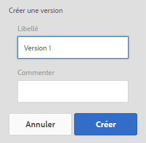

1. Pour afficher la nouvelle version, ouvrez le **[!UICONTROL Tout afficher]** dans la chronologie à partir de la page des détails de la ressource ou de la [!DNL Assets] et choisissez **[!UICONTROL Versions]**.

   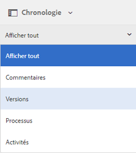

1. Sélectionnez une version spécifique de la ressource pour la prévisualiser ou lui permettre de s’afficher dans l’interface utilisateur d’Assets.

   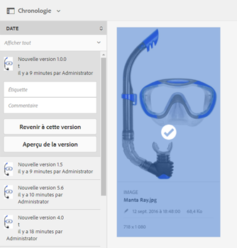

   >[!NOTE]
   >
   >Vous pouvez également sélectionner la ressource à partir de la [Mode Liste](/help/sites-authoring/basic-handling.md#viewing-and-selecting-resources) ou le [Mode Colonnes](/help/sites-authoring/basic-handling.md#viewing-and-selecting-resources).

1. Ajoutez un libellé et un commentaire pour la version afin de rétablir la version spécifique dans l’interface utilisateur d’Assets.

   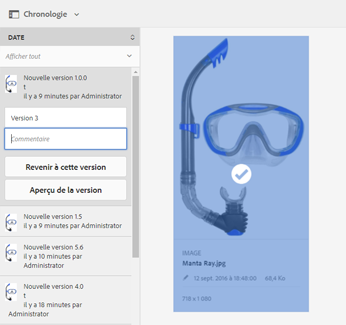

1. Pour générer un aperçu de la version, cliquez sur **[!UICONTROL Aperçu de la version]**.
1. Pour afficher cette version dans l’interface utilisateur d’Assets, sélectionnez **[!UICONTROL Revenir à cette version]**.
1. Pour comparer deux versions, accédez à la page Ressource de la ressource et cliquez sur la version à comparer à la version actuelle.

   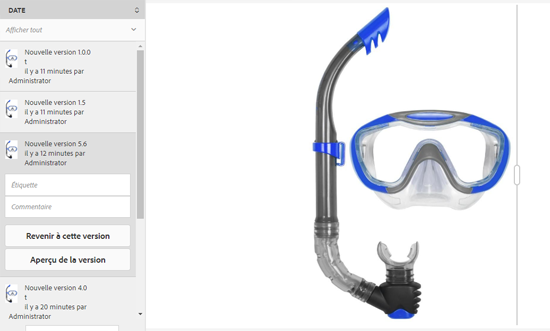

1. Dans la chronologie, sélectionnez la version à comparer, puis faites glisser le curseur vers la gauche pour superposer cette version sur la version actuelle à comparer.

   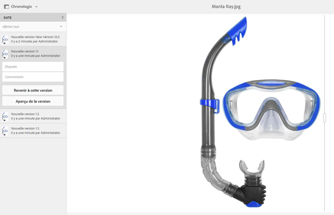

### Démarrage d’un workflow sur une ressource {#starting-a-workflow-on-an-asset}

Voir [appliquer un workflow à une [!DNL Experience Manager] ressource](/help/assets/assets-workflow.md#apply-a-workflow-to-an-aem-asset).

## À propos des collections {#collections}

Une collection est un ensemble de ressources classées. Vous pouvez utiliser des collections pour partager des ressources entre utilisateurs.

* Une collection peut comporter des ressources provenant de différents emplacements, car elle ne contient que les références à ces ressources. Chaque collection préserve l’intégrité du référentiel des ressources.
* Vous pouvez partager des ressources avec plusieurs utilisateurs dont les niveaux de privilèges sont différents (modification, affichage, etc.).

Un utilisateur peut avoir accès à plusieurs collections. Selon la façon dont elles rassemblent les ressources, les collections sont des types suivants :

* Une collection avec une **liste de référence statique** de ressources, de dossiers et d’autres collections.

* Collection qui utilise une **critères de recherche** et renseigne dynamiquement les ressources en fonction des critères. Cela s’appelle une **Collecte dynamique**.

Voir [Gestion des collections](managing-collections-touch-ui.md) pour plus d’informations sur la gestion des collections.

>[!NOTE]
>
>Pour créer ou modifier des ressources, vous devez disposer des droits d’accès appropriés pour votre compte.
