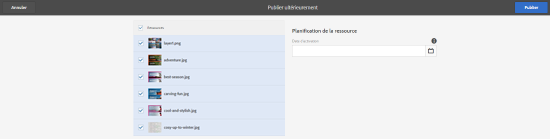

# Gestion des ressources numériques {#managing-assets-with-the-touch-optimized-ui}

Découvrez les différentes tâches de gestion et de modification des ressources que vous pouvez réaliser à l’aide de l’interface utilisateur optimisée pour les écrans tactiles d’AEM Assets.

Cet article explique comment gérer et modifier des ressources à l’aide de l’interface utilisateur optimisée pour les ressources d’Adobe Experience Manager (AEM). For an elementary knowledge about the user interface, see [Basic handling of Touch UI](/help/sites-authoring/basic-handling.md). Pour gérer les fragments de contenu, voir [Gestion des ressources de fragments](content-fragments-managing.md) de contenu.

## Création de dossiers {#create-folders}

Lorsque vous organisez une collection de ressources, comme toutes les images `Nature`, vous pouvez créer des dossiers pour les conserver ensemble. Vous pouvez utiliser des dossiers pour classer et organiser vos ressources. AEM Assets ne nécessite pas de classer les ressources dans des dossiers pour mieux fonctionner.

>[!NOTE]
>
>* Sharing an Assets folder of the type `sling:OrderedFolder` is not supported when sharing to Marketing Cloud. Si vous souhaitez partager un dossier, ne sélectionnez pas Ordonné lors de la création d’un dossier.
>* Experience Manager n’autorise pas l’utilisation de `subassets` mot comme nom de dossier. Il s’agit d’un mot-clé réservé au noeud qui contient des sous-ressources pour les ressources composées.

1. Dans le dossier Ressources numériques, accédez à l’emplacement où vous souhaitez créer un dossier.
1. Dans le menu, cliquez sur **[!UICONTROL Créer]**. Select **[!UICONTROL New Folder]**.
1. In the **[!UICONTROL Title]** field, provide a folder name. Par défaut, DAM utilise le titre que vous avez fourni comme nom du dossier. Une fois le dossier créé, vous pouvez remplacer le nom par défaut et entrer un autre nom de dossier.
1. Cliquez sur **[!UICONTROL Créer]**. Le dossier apparaît dans le dossier Ressources numériques.

Les caractères suivants (liste de ceux-ci séparés par des espaces) ne sont pas pris en charge :

* asset file name must not contain  `* / : [ \ \ ] | # % { } ? &`
* asset folder name must not contain  `* / : [ \ \ ] | # % { } ? \" . ^ ; + & \t`

## Upload assets {#uploading-assets}

Vous pouvez transférer différents types de ressource (dont des images, des fichiers PDF, des fichiers RAW, etc.) de votre dossier local ou d’un lecteur réseau vers AEM Assets.

>[!NOTE]
>
>Dans le mode Scene 7 de Dynamic Media, vous pouvez télécharger uniquement des ressources dont la taille de fichier est de 2 Go ou inférieure.

Vous pouvez choisir de transférer des ressources vers des dossiers avec ou sans un profil de traitement attribué.

Pour les dossiers auxquels un profil de traitement est affecté, le nom du profil s’affiche sur la vignette en mode Carte. En mode Liste, le nom du profil s’affiche dans la colonne **[!UICONTROL Profil de traitement]**. Reportez-vous à la section [Profils de traitement](processing-profiles.md).

Avant de télécharger un fichier, assurez-vous qu’il est dans un format pris en charge.

**Pour télécharger des fichiers**:

1. Dans l’interface Web Ressources, accédez à l’emplacement où vous souhaitez ajouter des ressources numériques.
1. Pour transférer les ressources, effectuez l’une des opérations suivantes :

   * On the toolbar, tap the **[!UICONTROL Create]** icon. Ensuite, dans le menu, appuyez sur **[!UICONTROL Fichiers]**. Au besoin, vous pouvez renommer le fichier dans la boîte de dialogue affichée.
   * Dans un navigateur prenant en charge HTML5, faites glisser les ressources directement sur l’interface. La boîte de dialogue permettant de renommer les fichiers n’est pas affichée.
   

   Pour sélectionner plusieurs fichiers, appuyez sur la touche Ctrl/Commande et sélectionnez les ressources dans la boîte de dialogue de sélecteur de fichiers. Sur un iPad, vous ne pouvez sélectionner qu’un seul fichier à la fois.

   Vous pouvez suspendre le transfert des ressources volumineuses (dont la taille est supérieure à 500 Mo) et reprendre ultérieurement à partir de la même page. Appuyez sur l’icône **[!UICONTROL Pause]** à côté de la barre de progression qui s’affiche au début du téléchargement.

   

   Vous pouvez configurer la taille au-dessus de laquelle une ressource est considérée comme volumineuse. Par exemple, vous pouvez configurer le système de sorte qu’il considère les ressources dont la taille est supérieure à 1 000 Mo (au lieu de 500 Mo) comme des ressources volumineuses. Dans ce cas, le bouton **[!UICONTROL Pause]** figurant dans la barre de progression s’affiche lors du transfert de fichiers d’une taille supérieure à 1 000 Mo.

   The **[!UICONTROL Pause]]**button does not show if a file greater than 1000 MB is uploaded with a file less than 1000 MB. Toutefois, si vous annulez le téléchargement de fichier inférieur à 1 000 Mo, le bouton**[!UICONTROL Pause ]**apparaît.

   To modify the size limit, configure the `chunkUploadMinFileSize` property of the `fileupload`node in the CRX repository.

   Lorsque vous cliquez sur l’icône **[!UICONTROL Pause]**, elle devient une icône **[!UICONTROL Lire]**. Pour reprendre le transfert, cliquez sur l’icône **[!UICONTROL Lire.]**

   

   To cancel an ongoing upload, click the `X` button beside the progress bar. Lorsque vous annulez le transfert, AEM Assets supprime la partie partiellement transférée de la ressource.

   La possibilité de reprendre le téléchargement s’avère particulièrement utile dans les scénarios dans lesquels la bande passante est faible et le réseau dysfonctionne, car le téléchargement d’une ressource volumineuse prend un long moment. Vous pouvez suspendre l’opération de transfert et la reprendre ultérieurement lorsque la situation s’améliore. Lorsque vous reprenez le transfert, il commence au niveau où vous l’avez suspendu.

   Pendant l’opération de transfert, AEM enregistre les parties de la ressource en cours de transfert sous forme de blocs de données dans le référentiel CRX. Une fois le transfert terminé, AEM regroupe ces blocs en un seul bloc de données dans le référentiel.

   To configure the cleanup task for the unfinished chunk upload jobs, go to `https://[aem_server]:[port]/system/console/configMgr/org.apache.sling.servlets.post.impl.helper.ChunkCleanUpTask`.

   Si vous transférez une ressource portant le même nom qu’une ressource déjà disponible à l’emplacement où vous transférez la ressource, un message d’avertissement s’affiche.

   Vous pouvez choisir de remplacer une ressource existante, de créer une autre version ou de garder les deux en renommant la nouvelle ressource téléchargée. Si vous remplacez une ressource existante, les métadonnées de la ressource, ainsi que les modifications et l’historique antérieurs (annotations, recadrages, etc.) sont supprimées. Si vous choisissez de conserver les deux fichiers, le nouveau fichier est renommé.

   

   >[!NOTE]
   >
   >When you select **[!UICONTROL Replace]** in the **[!UICONTROL Name Conflict]** dialog box, the asset ID is regenerated for the new asset. Cet ID est différent de l’ID de la ressource précédente.
   >
   >If **[!UICONTROL Asset Insights]** is enabled to track impressions/clicks with Adobe Analytics, this regenerated asset ID invalidates the data-captured for the asset on Adobe Analytics.

   If the asset you upload exists in AEM Assets, the **[!UICONTROL Duplicates Detected]** dialog box warns that you are attempting to upload a duplicate asset. La boîte de dialogue s’affiche uniquement si la valeur de somme de contrôle SHA 1 du fichier binaire des ressources existantes correspond à celle de la ressource que vous téléchargez. Dans ce cas, le nom des ressources est immatériel. En d’autres termes, la boîte de dialogue peut même s’afficher pour des ressources dont le nom diffère si la valeur SHA 1 de leur fichier binaire est identique.

   >[!NOTE]
   >
   >The **[!UICONTROL Duplicates Detected]** dialog appears only when the **[!UICONTROL Duplicate Detection]** feature is enabled. To enable the **[!UICONTROL Duplicate Detection]** feature, see [Enabling Duplicate Detection](duplicate-detection.md).

   

   Tap **[!UICONTROL Keep]** to retain the duplicate asset in AEM Assets. Tap  **[!UICONTROL Delete]** to delete the duplicate asset you uploaded.

   AEM Assets vous empêche de transférer des ressources dont le nom de fichier contient des caractères interdits. Si vous tentez de télécharger un fichier qui comprend des caractères interdits, AEM Assets affiche un message d’avertissement concernant la présence de caractères interdits dans le nom de fichier et interrompt le téléchargement jusqu’à ce que vous supprimiez ces caractères ou téléchargiez avec un nom autorisé.

   To suit specific file naming conventions for your organization, the **[!UICONTROL Upload Assets]** dialog box lets you specify long names for the files that you upload.

   

   Toutefois, la liste de caractères suivante, séparée par des espaces, n’est pas prise en charge :
   * asset file name must not contain  `* / : [ \ \ ] | # % { } ? &`
   * asset folder name must not contain  `* / : [ \ \ ] | # % { } ? \" . ^ ; + & \t`
   In addition, the Assets interface displays the most recent asset that you upload or the folder you create first in all the views (**[!UICONTROL Card view]**, **[!UICONTROL List view]**, and **[!UICONTROL Column view]**).

   Souvent, lors du chargement simultané de fichiers volumineux ou de plusieurs fichiers, les indicateurs visuels vous permettent d’évaluer la progression. The **[!UICONTROL Upload Progress]** dialog box displays the count of successfully uploaded files and the files that failed to upload.

   

   Si vous annulez le transfert avant la fin de l’opération, AEM Assets arrête le transfert du fichier en cours et actualise le contenu. Toutefois, les fichiers déjà téléchargés ne sont pas supprimés.

### Transferts en série {#serial-uploads}

Le téléchargement en masse de nombreux actifs consomme des ressources système importantes, ce qui peut avoir un impact négatif sur les performances de votre déploiement AEM. Les goulets d’étranglement potentiels peuvent être votre connexion Internet, les opérations de lecture-écriture sur le disque, les limitations du navigateur Web quant au nombre de requêtes POST lors du transfert simultané de ressources. L’opération de transfert en masse peut échouer ou se terminer prématurément. Autrement dit, AEM Assets peut ignorer certains fichiers lors de l’assimilation, voire n’assimiler aucun fichier.

Pour remédier à cette situation, AEM Assets assimile une ressource à la fois (chargement en série) au cours d’une opération de chargement en masse, plutôt que d’assimiler toutes les ressources simultanément.

Le chargement en série de ressources est activé par défaut. To disable the feature and allow concurrent uploading, overlay the `fileupload` node in CRXDe and set the value of the `parallelUploads` property to `true`.

### Upload assets using FTP {#uploading-assets-using-ftp}

Contenu multimédia dynamique permet le transfert par lots de fichiers par le biais du serveur FTP. Si vous avez l’intention de télécharger des ressources de très grande taille (> 1 Go), ou des dossiers ou des sous-dossiers entiers, utilisez la méthode FTP. Vous pouvez même configurer le transfert FTP pour qu’il s’effectue de manière récurrente.

>[!NOTE]
>
>Dans le mode Scene 7 de Dynamic Media, vous pouvez télécharger uniquement des ressources dont la taille de fichier est de 2 Go ou inférieure.

>[!NOTE]
>
>Pour télécharger des fichiers par FTP dans Contenu multimédia dynamique - Mode Scene7 - Installez Feature Pack (FP) 18912 sur l’auteur d’AEM. Contactez l’assistance technique Adobe pour obtenir l’accès à FP-18912 et terminer la configuration de votre compte FTP. Voir la section [Installation du pack de fonctionnalités 18912 pour la migration des ressources en bloc](/help/assets/bulk-ingest-migrate.md).
Si vous utilisez le protocole FTP pour télécharger des ressources, les paramètres de téléchargement spécifiés dans AEM sont ignorés. Des règles de traitement de fichiers, telles qu’elles sont définies dans Dynamic Media Classic, sont utilisées à la place.  

**Pour télécharger des ressources via FTP, procédez comme suit :**

1. Sélectionnez le client FTP de votre choix, puis connectez-vous à l’aide du nom d’utilisateur et du mot de passe FTP qui vous ont été envoyés par courrier électronique. Dans le client FTP, téléchargez les fichiers et/ou dossiers vers le serveur FTP.
1. [Connectez-vous à Dynamic Media Classic](https://www.adobe.com/marketing-cloud/experience-manager/scene7-login.html) à l’aide des informations de connexion qui vous ont été envoyées par e-mail. Appuyez ou cliquez sur **[!UICONTROL Télécharger]** dans la barre de navigation globale.

1. On the **[!UICONTROL Upload]** page, near the upper-left corner, tap the **[!UICONTROL Via FTP]** tab.
1. Sélectionnez le dossier FTP source à utiliser pour le transfert des fichiers dans la partie gauche de la page et le dossier de destination dans la partie droite.
1. Near the lower-right corner of the page, tap **[!UICONTROL Job Options]** and then set the options you want based on the assets in the folder you selected.

   Voir [Options de la tâche de transfert](#upload-job-options).

   >[!NOTE]
   >
   >Lorsque vous téléchargez des fichiers par FTP, les options de tâche de téléchargement que vous définissez dans Dynamic Media Classic (Scene7) prennent le pas sur les paramètres de traitement des fichiers définis dans AEM.

1. In the lower-right corner of the **[!UICONTROL Upload Job Options]** dialog box, tap **[!UICONTROL Save]**.
1. In the lower-right corner of the **[!UICONTROL Upload]** page, tap **[!UICONTROL Submit Upload]**.

   Pour afficher la progression du téléchargement, appuyez sur **[!UICONTROL Tâches]** dans la barre de navigation globale. The **[!UICONTROL Jobs]** page displays the progress of the upload. Vous pouvez continuer à travailler dans AEM et revenir, à tout moment, à la page Tâches dans Dynamic Media Classic afin de consulter une tâche en cours.

   Pour annuler une tâche de téléchargement en cours, appuyez ou cliquez sur **[!UICONTROL Annuler]****[!UICONTROL à côté de la durée.]**

#### Options de la tâche de transfert {#upload-job-options}

| Option de téléchargement | Sous-option | Description |
|---|---|---|
| Nom de la tâche |  | Le nom par défaut qui est prérempli dans le champ de texte comprend la portion du nom saisie par l’utilisateur, ainsi que l’horodatage. Vous pouvez utiliser le nom par défaut ou indiquer un nom personnalisé pour cette tâche de transfert.  Cette tâche, ainsi que les autres tâches de transfert et de publication, sont enregistrées sur la page Tâches, où vous pouvez vérifier leur état. |
| Publier après le téléchargement |  | Publie automatiquement les ressources que vous téléchargez. |
| Écraser dans n’importe quel dossier, même nom de ressource de base, quelle que soit l’extension |  | Sélectionnez cette option si vous voulez que les fichiers que vous téléchargez remplacent les fichiers existants portant le même nom. Le nom de cette option peut varier en fonction des paramètres définis sous **[!UICONTROL Configuration de l’application]** > **[!UICONTROL Paramètres généraux]** > **[!UICONTROL Télécharger dans l’application]** > **[!UICONTROL Écraser les images]**. |
| Décompresser les fichiers ZIP ou TAR au moment du téléchargement |  |  |
| Options de tâche |  | Tap/ click **[!UICONTROL Job Options]** to open the [!UICONTROL Upload Job Options] dialog box and choose options that affect the entire upload job. Ces options sont identiques pour tous les types de fichiers. Vous pouvez choisir les options par défaut pour télécharger les fichiers en commençant sur la page Paramètres généraux de l’application. Pour ouvrir cette page, sélectionnez **[!UICONTROL Configuration]** > **[!UICONTROL Configuration de l’application.]**. Tap the **[!UICONTROL Default Upload Options]** button to open the [!UICONTROL Upload Job Options] dialog box. |
|  | Quand | Sélectionnez Unique ou Périodique. Pour définir une tâche périodique, sélectionnez une option de répétition (Quotidien, Hebdomadaire, Mensuel ou Personnalisé) afin d’indiquer la fréquence souhaitée pour la tâche de transfert FTP. Indiquez ensuite les options de planification suivant vos besoins. |
|  | Inclure les sous-dossiers | Téléchargez tous les sous-dossiers du dossier que vous avez l’intention de télécharger. Les noms du dossier et des sous-dossiers transférés sont saisis automatiquement dans AEM Assets. |
|  | Options de recadrage | Pour recadrer manuellement une image par ses côtés, sélectionnez le menu Recadrer, puis choisissez Manuel. Indiquez ensuite le nombre de pixels à recadrer d’un seul côté ou de chaque côté de l’image. La proportion de l’image qui est rognée dépend du paramètre ppp (pixels par pouce) défini dans le fichier d’image. Par exemple, si l’image affiche 150 ppp et que vous saisissez 75 dans les zones de texte Haut, Droite, Bas et Gauche, un demi-pouce est rogné de chaque côté.  Pour supprimer automatiquement d’une image les pixels représentant des espaces blancs, sélectionnez le menu Recadrer, cliquez sur Manuel, puis saisissez les mesures en pixels dans les champs Haut, Droite, Bas et Gauche pour recadrer au niveau des bords. Vous pouvez également sélectionner Rognage dans le menu Recadrer et choisir les options suivantes :  **Rogner en fonction de** <ul><li>**Couleur** - Choisissez l&#39;option Couleur. Sélectionnez ensuite le menu Coin, puis choisissez l’angle de l’image présentant la couleur qui correspond le mieux à l’espace blanc à rogner.</li><li>**** Transparence : sélectionnez l’option Transparence.  **Tolérance** - Faites glisser le curseur pour définir une tolérance de 0 à 1.Pour le rognage en fonction de la couleur, indiquez 0 pour rogner les pixels uniquement s’ils correspondent exactement à la couleur sélectionnée dans l’angle de l’image. Les valeurs qui se rapprochent de 1 autorisent une plus grande différence de couleurs. Pour l’option de rognage en fonction de la transparence, indiquez 0 pour rogner les pixels seulement s’ils sont transparents. Les valeurs plus proches de 1 permettent une plus grande transparence.</li></ul> Notez que ces options de recadrage sont non destructives. |
|  | Options de profils de couleurs | Sélectionnez une conversion de couleurs lorsque vous créez des fichiers optimisés utilisés pour la livraison :<ul><li>Conservation des couleurs par défaut : conserve les couleurs des images sources lorsque les images comportent des informations d’espace colorimétrique ; il n’y a aucune conversion des couleurs. Actuellement, le profil colorimétrique approprié est déjà intégré dans pratiquement toutes les images. Cependant, si une image source CMJN ne contient pas de profil colorimétrique intégré, les couleurs sont converties dans l’espace colorimétrique sRVB (Rouge Vert Bleu standard). sRVB est l’espace colorimétrique recommandé pour l’affichage d’images sur des pages web.</li><li>Conserver l’espace colorimétrique original : conserve les couleurs d’origine sans conversion des couleurs au niveau du point. Pour les images sans profil colorimétrique incorporé, toute conversion des couleurs s’effectue à l’aide des profils colorimétriques par défaut configurés dans les Paramètres de publication. Les profils de couleurs peuvent ne pas correspondre aux couleurs des fichiers créés avec cette option. Par conséquent, vous êtes invité à utiliser l’option de conservation des couleurs par défaut.</li><li>Personnaliser de > en  Permet d’accéder aux menus pour sélectionner un espace colorimétrique source (Convertir de) et un espace colorimétrique cible (Convertir en). Cette option avancée remplace toutes les informations de couleur incorporées dans le fichier source. Sélectionnez cette option uniquement lorsque toutes les images que vous envoyez contiennent des données de profil de couleurs incorrectes ou manquantes.</li></ul> |
|  | Options d’édition d’images | Vous pouvez conserver les masques d’écrêtage dans les images et choisir un profil de couleurs.  Voir [Définition des options d’édition d’image lors du téléchargement](#setting-image-editing-options-at-upload). |
|  | Options Postscript | Vous pouvez pixelliser les fichiers PostScript®, recadrer les fichiers, conserver les arrière-plans transparents et choisir une résolution ainsi qu’un espace colorimétrique.  Voir [Définition des options de téléchargement PostScript et Illustrator](#setting-postscript-and-illustrator-upload-options). |
|  | Options Photoshop | Vous pouvez créer des modèles à partir de fichiers Adobe® Photoshop®, conserver les calques, définir la méthode d’attribution des noms de calque, extraire du texte et indiquer le mode d’ancrage des images dans les modèles.  Notez que les modèles ne sont pas pris en charge dans AEM.  Voir [Définition des options de téléchargement Photoshop](#setting-photoshop-upload-options). |
|  | Options PDF | Vous pouvez pixelliser les fichiers, extraire des mots de recherche et des liens, générer automatiquement un catalogue électronique, définir la résolution et choisir un espace de couleurs.  Notez que les catalogues électroniques ne sont pas pris en charge dans AEM.   Voir [Définition des options de téléchargement PDF](#setting-pdf-upload-options). |
|  | Options Illustrator | Vous pouvez pixelliser les fichiers Adobe Illustrator®, conserver l’arrière-plan transparent, choisir une résolution et sélectionner un espace de couleurs.  Voir [Définition des options de téléchargement PostScript et Illustrator](#setting-postscript-and-illustrator-upload-options). |
|  | Options eVideo | Vous pouvez transcoder un fichier vidéo en sélectionnant un paramètre vidéo prédéfini.  Voir [Définition des options de téléchargement eVideo](#setting-evideo-upload-options). |
|  | Paramètres prédéfinis d’ensemble par lot | Pour créer automatiquement une visionneuse d’images ou une visionneuse à 360° à partir de fichiers téléchargés, cliquez sur la colonne Actif correspondant au paramètre prédéfini à utiliser. Vous pouvez sélectionner plusieurs paramètres prédéfinis. Les paramètres prédéfinis sont créés sur la page Configuration de l’application/Paramètres prédéfinis d’ensemble par lot de Dynamic Media Classic. Pour en savoir plus sur la création de paramètres prédéfinis d’ensemble par lot, voir [Configuration de paramètres prédéfinis d’ensemble par lot pour générer automatiquement des visionneuses d’images et des visionneuses à 360°](config-dms7.md#creating-batch-set-presets-to-auto-generate-image-sets-and-spin-sets).  Voir [Définition de paramètres prédéfinis d’ensemble par lot lors du téléchargement](#setting-batch-set-presets-at-upload). |

#### Set image editing options at upload {#setting-image-editing-options-at-upload}

When uploading image files, including AI, EPS, and PSD files, you can take the following editing actions in the **[!UICONTROL Upload Job Options]** dialog box:

* Rogner l’espace blanc du contour des images (voir la description dans le tableau ci-dessus).
* Recadrer manuellement des images par leurs côtés (voir la description dans le tableau ci-dessus).
* Choisir un profil colorimétrique (voir la description de l’option dans le tableau ci-dessus).
* Créer un masque à partir d’un chemin de tracé.
* Accentuer les images grâce aux options de masquage flou.
* Masquer l’arrière-plan.

| Option | Sous-option | Description |
|---|---|---|
| Créer un masque à partir du chemin de tracé |  | Créez un masque pour l’image d’après les informations de son chemin de tracé. Cette option s’applique aux images créées à l’aide d’applications de retouche d’images dans lesquelles un chemin de tracé a été créé. |
| Masquage flou |  | Permet d’affiner l’effet du filtre d’accentuation sur l’image sous-échantillonnée finale, en contrôlant l’intensité et le rayon de l’effet (mesuré en pixels), et un seuil de contraste qui est ignoré.  Cet effet utilise les mêmes options que le filtre de masquage flou de Photoshop. Contrairement à ce que suggère le nom, le masquage flou est un filtre d’accentuation. Sous Masquage flou, définissez les options de votre choix. Les options de paramètre sont décrites dans ce qui suit : |
|  | Quantité | Contrôle le degré de contraste appliqué aux pixels de contour.  Considérez cela comme l’intensité de l’effet. La principale différence entre les valeurs de quantité du masquage flou dans Dynamic Media et les valeurs de quantité dans Adobe Photoshop réside dans le fait que la plage de quantité dans Photoshop est comprise entre 1 % et 500 %. En revanche, dans Dynamic Media, la plage de valeurs est comprise entre 0,0 et 5,0. Une valeur de 5,0 équivaut environ à 500 % dans Photoshop ; une valeur de 0,9 équivaut à 90 %, etc. |
|  | Rayon | Contrôle le rayon de l’effet. La plage de valeurs est comprise entre 0 et 250.  L’effet est exécuté sur tous les pixels d’une image et s’étend depuis tous les pixels dans toutes les directions. Le rayon est mesuré en pixels. Par exemple, pour obtenir un effet d’accentuation comparable dans des images de 2 000 x 2 000 pixels et de 500 x 500 pixels, définissez une valeur de rayon de deux pixels pour l’image de 2 000 x 2 000 pixels et d’un pixel pour l’image de 500 x 500 pixels. Utilisez une valeur plus élevée pour une image avec plus de pixels. |
|  | Seuil | Le seuil est une plage de contraste qui est ignorée lorsque le filtre de masquage flou est appliqué. Cela est important, de sorte qu’aucun « bruit » ne soit introduit dans une image lorsque ce filtre est utilisé. La plage de valeurs est comprise entre 0 et 255, ce qui correspond au nombre de degrés de luminosité dans une image en niveaux de gris. 0 = noir, 128 = 50 % gris et 255 = blanc.  Par exemple, une valeur de seuil de 12 ignore les légères variations de la luminosité de la peau pour éviter d’ajouter du bruit, mais ajoute tout de même un contraste de bord aux zones contrastées, comme celles où les cils rencontrent la peau.  Par exemple, si vous avez une photo du visage d’une personne, le masquage flou affecte les parties contrastées de l’image, comme l’endroit où se rencontrent les cils et la peau pour créer une zone de contraste évidente et la peau lisse elle-même. Même la peau la plus lisse affiche des variations subtiles de ses valeurs de luminosité. Si vous n’utilisez aucune valeur de seuil, le filtre accentue ces changements subtils dans les pixels de la peau. Un effet de bruit indésirable est alors créé lorsque le contraste sur les cils est augmenté, ce qui améliore la netteté.  Pour éviter ce problème, utilisez une valeur de seuil qui indique au filtre d’ignorer les pixels qui ne modifient pas considérablement le contraste, comme la peau lisse.  Dans l’image de fermeture éclair présentée plus haut, remarquez la texture en regard des fermetures. Le bruit d’une image est exposé, car les valeurs de seuil étaient trop faibles pour supprimer le bruit. |
|  | Monochrome | Sélectionnez cette option pour appliquer le masquage flou sur la luminosité de l’image (intensité).  Désélectionnez-la pour appliquer le masquage flou séparément sur chaque composante de couleur. |
| Masquer l’arrière-plan. |  | Supprime automatiquement l’arrière-plan d’une image lorsque vous la téléchargez. Cette technique est utile pour attirer l’attention sur un objet précis et pour le faire ressortir dans un arrière-plan chargé. Sélectionnez cette option pour activer la fonction Masquage de l’arrière-plan et les sous-options suivantes : |
|  | Coin | Requis.  Coin de l’image servant à définir la couleur d’arrière-plan à masquer.  Vous pouvez choisir parmi **Supérieur gauche**, **Bas et gauche**, **Supérieur droit** ou **Bas et droite**. |
|  | Méthode de remplissage | Requis.  Contrôle la transparence des pixels à partir du coin que vous avez défini. Vous pouvez choisir parmi les méthodes de remplissage suivantes : <ul><li>**Remplissage par diffusion** : rend transparents tous les pixels qui correspondent au coin que vous avez spécifié et qui y sont rattachés.</li><li>**Correspondance des pixels** : rend transparents tous les pixels correspondants, quel que soit leur emplacement dans l’image.</li></ul> |
|  | Tolérance | Facultatif.  Contrôle le degré de variation autorisé dans la couleur des pixels correspondante d’après l’emplacement du coin que vous avez défini.  Utilisez une valeur de 0,0 pour établir une correspondance exacte avec les couleurs des pixels ou une valeur de 1,0 pour permettre une plus grande variation. |

#### Set PostScript and Illustrator upload options {#setting-postscript-and-illustrator-upload-options}

Lorsque vous transférez des fichiers d’image PostScript (EPS) ou Illustrator (AI), vous pouvez les formater de différentes manières. Vous pouvez pixelliser les fichiers, conserver l’arrière-plan transparent, choisir une résolution et sélectionner un espace colorimétrique. Les options de formatage des fichiers PostScript et Illustrator sont disponibles dans les sections Options PostScript et Options Illustrator de la boîte de dialogue Télécharger les options de la tâche.

| Option | Sous-option | Description |
|---|---|---|
| Traitement en cours |  | Sélectionnez **[!UICONTROL Pixelliser]** pour convertir les graphiques vectoriels du fichier au format bitmap. |
| Conserver la transparence en arrière-plan dans l’image rendue |  | Conserve la transparence en arrière-plan du fichier. |
| Résolution |  | Détermine le paramètre de résolution. Ce paramètre détermine le nombre de pixels affichés par pouce dans le fichier. |
| Espace colorimétrique |  | Dans le menu Espace colorimétrique, sélectionnez l’une des options d’espace colorimétrique suivantes : |
|  | Détecter automatiquement | Conserve l’espace colorimétrique du fichier. |
|  | Forcer comme RVB | Applique l’espace colorimétrique RVB. |
|  | Forcer comme CMJN | Applique l’espace colorimétrique CMJN. |
|  | Forcer comme Niveaux de gris | Applique l’espace colorimétrique Niveaux de gris. |

#### Définition des options de téléchargement Photoshop {#setting-photoshop-upload-options}

Les fichiers PSD (Photoshop Document) sont généralement utilisés pour créer des modèles d’image. Lorsque vous transférez un fichier PSD, vous pouvez créer automatiquement un modèle d’image à partir de celui-ci (sélectionnez l’option Créer un modèle sur l’écran Télécharger).

Dynamic Media crée plusieurs images à partir d’un fichier PSD avec des calques si vous utilisez ce fichier pour créer un modèle ; il crée une image par calque.

Use the **[!UICONTROL Crop Options]** and **[!UICONTROL Color Profile Options]**, described above, with Photoshop upload options.

>[!NOTE]
>
>Les modèles ne sont pas pris en charge dans AEM.

| Option | Sous-option | Description |
|---|---|---|
| Conserver les calques |  | Pixellise les calques du fichier PSD, le cas échéant, dans des fichiers individuels. Les calques de ces fichiers restent associés au fichier PSD. Pour les afficher, ouvrez le fichier PSD dans le mode d’affichage Détail et sélectionnez le panneau Calque. |
| Créer un modèle |  | Crée un modèle à partir des calques du fichier PSD. |
| Extraire du texte |  | Extrait le texte pour permettre aux utilisateurs de rechercher une chaîne de caractères dans une visionneuse. |
| Étendre les calques à la taille du fond |  | Étend la taille des calques d’image pixellisés à celle du calque en arrière-plan. |
| Affectation de nom de calque |  | Les calques du fichier PSD sont téléchargés comme des images distinctes. |
|  | Nom de couche | Les images adoptent le nom de leur calque dans le fichier PSD. Par exemple, un calque nommé Étiquette de prix dans le fichier PSD d’origine devient une image nommée Étiquette de prix. Cependant, si les calques du fichier PSD portent les noms de calques Photoshop par défaut (Arrière-plan, Calque 1, Calque 2, etc.), les images sont nommées d’après leur numéro de calque dans le fichier PSD, et non d’après leur nom de calque par défaut. |
|  | Photoshop et numéro de couche | Nomme les images d’après leur numéro de calque dans le fichier PSD, leur nom de calque d’origine étant ignoré. Le nom des images est composé du nom de fichier Photoshop et d’un numéro de calque. Par exemple, le deuxième calque d’un fichier appelé Pub printemps.psd est nommé Pub printemps_2, même s’il portait un nom personnalisé dans Photoshop. |
|  | Photoshop et nom de couche | Nomme les images en reprenant le nom du fichier PSD suivi du nom ou du numéro de calque. Le numéro de calque est utilisé si le nom du calque dans le fichier PSD est un nom de calque Photoshop par défaut. Par exemple, un calque nommé Étiquette de prix dans un fichier PSD appelé Pub Printemps est nommé Pub Printemps_Étiquette de prix. Un calque portant le nom par défaut Calque 2 est nommé Pub Printemps_2. |
| Ancre |  | Indiquez le mode d’ancrage des images dans les modèles qui sont générés à partir de la composition superposée produite à partir du fichier PSD. Par défaut, l’ancrage est au centre. Un ancrage au centre permet aux images de remplacement de remplir de manière optimale le même espace, quelles que soient les proportions de l’image de remplacement. Les images qui remplacent cette image et qui présentent un aspect différent occupent le même espace lorsque le modèle est référencé et le paramètre de substitution utilisé. Changez de paramètre si votre application exige que les images de remplacement occupent l’espace alloué dans le modèle. |

#### Définition des options de téléchargement de PDF {#setting-pdf-upload-options}

Lorsque vous transférez un fichier PDF, vous pouvez le formater de différentes manières. Vous pouvez recadrer les pages, extraire des mots de recherche, spécifier une résolution en pixels par pouce et choisir un espace colorimétrique. Les fichiers PDF contiennent souvent une marge de rognage, des traits de coupe, des repères de montage et d’autres repères d’impression. Vous pouvez éliminer ces marques sur les côtés des pages lorsque vous transférez un fichier PDF.

>[!NOTE]
>
>Les catalogues électroniques ne sont pas pris en charge dans AEM.

Faites votre choix parmi les options suivantes :

| Option | Sous-option | Description |
|---|---|---|
| Traitement en cours | Pixelliser | (Par défaut) Pixellise les pages du fichier PDF et convertit les graphiques vectoriels en images bitmap. Sélectionnez cette option pour créer un catalogue électronique. |
| Extraire | Termes de recherche | Extrait les termes du fichier PDF afin qu’ils puissent être recherchés par mot-clé dans une visionneuse de catalogue électronique. |
|  | Liens | Extrait les liens des fichiers PDF et les convertit en zones cliquables utilisées dans une visionneuse de catalogue électronique. |
| Générer automatiquement un catalogue électronique à partir d’un PDF de plusieurs pages |  | Crée automatiquement un catalogue électronique à partir du fichier PDF. Le catalogue électronique reprend le nom du fichier PDF que vous avez transféré (cette option n’est disponible que si vous pixellisez le fichier PDF au moment du transfert). |
| Résolution |  | Détermine le paramètre de résolution. Ce paramètre définit le nombre de pixels affichés par pouce dans le fichier PDF. La valeur par défaut est 150. |
| Espace colorimétrique |  | Dans le menu Espace colorimétrique, sélectionnez un espace colorimétrique pour le fichier PDF. La plupart des fichiers PDF contiennent des images en couleurs RVB et CMJN. L’espace colorimétrique RVB est préférable pour un affichage à l’écran. |
|  | Détecter automatiquement | Conserve l’espace colorimétrique du fichier PDF. |
|  | Forcer comme RVB | Applique l’espace colorimétrique RVB. |
|  | Forcer comme CMJN | Applique l’espace colorimétrique CMJN. |
|  | Forcer comme Niveaux de gris | Applique l’espace colorimétrique Niveaux de gris. |

#### Définition des options de téléchargement eVideo {#setting-evideo-upload-options}

Vous pouvez transcoder un fichier vidéo en sélectionnant une option parmi divers paramètres vidéo prédéfinis.

| Option | Sous-option | Description |
|---|---|---|
| Vidéo adaptative |  | Un paramètre prédéfini de codage unique qui fonctionne avec n’importe quel format pour créer des vidéos à diffuser sur des périphériques mobiles, des tablettes et des ordinateurs de bureau. Les vidéos source transférées qui sont codées à l’aide de ce paramètre prédéfini sont définies avec une hauteur fixe. Toutefois, la largeur est automatiquement mise à l’échelle pour conserver les proportions de la vidéo.  Il est recommandé d’utiliser le codage de vidéo adaptative. |
| Paramètres prédéfinis de codage uniques | Trier les paramètres prédéfinis de codage | Sélectionnez Nom ou Taille pour trier les paramètres prédéfinis de codage répertoriés sous Bureau, Mobile et Tablette par nom ou par taille de résolution. |
|  | Poste de travail | Créez un fichier MP4 pour diffuser une expérience vidéo progressive ou en flux continu sur les ordinateurs de bureau.Sélectionnez un ou plusieurs formats avec la taille de résolution et le débit de données cible de votre choix. |
|  | Mobile | Créez un fichier MP4 pour une diffusion sur des périphériques mobiles iPhone ou Android.Sélectionnez un ou plusieurs formats avec la taille de résolution et le débit de données cible de votre choix. |
|  | Tablette | Créez un fichier MP4 pour une diffusion sur des tablettes iPad ou Android.Sélectionnez un ou plusieurs formats avec la taille de résolution et le débit de données cible de votre choix. |

#### Set Batch Set Presets at upload {#setting-batch-set-presets-at-upload}

If you want to automatically create an Image Set or Spin Set from uploaded images, click the **[!UICONTROL Active** column for the preset you want to use. Vous pouvez sélectionner plusieurs paramètres prédéfinis. 

Pour en savoir plus sur la création de paramètres prédéfinis d’ensemble par lot, voir [Configuration de paramètres prédéfinis d’ensemble par lot pour générer automatiquement des visionneuses d’images et des visionneuses à 360°](config-dms7.md#creating-batch-set-presets-to-auto-generate-image-sets-and-spin-sets).

### Transferts en continu {#streamed-uploads}

Si vous transférez de nombreuses ressources, les appels d’E/S adressés au serveur AEM augmentent considérablement, ce qui réduit l’efficacité du transfert et peut même entraîner son expiration. AEM Assets prend en charge le transfert en continu de ressources. Le transfert en continu réduit les E/S de disque lors de l’opération de transfert en évitant de stocker les ressources dans un dossier temporaire sur le serveur avant de les copier dans le référentiel. Au lieu de cela, les données sont transférées directement vers le référentiel. Cela permet à la fois d’accélérer le transfert de ressources volumineuses et de réduire les risques d’expiration. Le transfert en continu est activé par défaut dans AEM Assets.

Le transfert en continu est désactivé lorsqu’AEM s’exécute sur un serveur JEE équipé d’une version de servelt-api antérieure à 3.1.

### Extraction d’une archive ZIP contenant des ressources {#extract-zip-archive-containing-assets}

Vous pouvez télécharger des archives ZIP comme tout autre ressource prise en charge. Les mêmes règles de nom de fichier s’appliquent aux fichiers ZIP. AEM vous permet d’extraire une archive ZIP vers un emplacement DAM.

Sélectionnez une archive ZIP à la fois, cliquez sur **[!UICONTROL Extraire l’archive]**, puis sélectionnez un dossier de destination. Sélectionnez une option pour gérer les conflits, le cas échéant. Si les ressources du fichier ZIP existent déjà dans le dossier de destination, vous pouvez sélectionner l’une des options suivantes : ignorer l’extraction, remplacer les fichiers existants, conserver les deux fichiers en attribuant un nouveau nom ou créer une nouvelle version.

Une fois l’extraction terminée, AEM vous avertit dans la zone de notification. Lorsqu’AEM extrait le fichier ZIP, vous pouvez reprendre votre travail sans interrompre l’extraction.

La fonctionnalité présente certaines limites :

* Si un dossier portant le même nom existe à la destination, les ressources du fichier ZIP sont extraites dans le dossier existant.

* Si vous annulez l’extraction, les ressources déjà extraites ne sont pas supprimées.

* Vous ne pouvez pas sélectionner deux fichiers ZIP simultanément et les extraire. Vous pouvez seulement extraire une archive ZIP à la fois.

## Aperçu des fichiers {#previewing-assets}

Voir aussi [Aperçu des ressources de média dynamique.](previewing-assets.md)

**Pour prévisualiser des fichiers**:

1. Dans l’interface utilisateur Ressources, accédez à l’emplacement du fichier à prévisualiser.
1. Appuyez sur la ressource concernée pour l’ouvrir.

1. En mode Aperçu, les options de zoom sont disponibles pour les [types d’images pris en charge](assets-formats.md#supported-raster-image-formats) (avec modification interactive).

   To zoom into an asset, tap **[!UICONTROL +]** (or tap the magnifying glass on the asset). To zoom out, tap **[!UICONTROL -]**. Lorsque vous effectuez un zoom avant, vous pouvez observer en détail une zone de l’image en réalisant un panoramique. La flèche **[!UICONTROL Réinitialiser le zoom]** rétablit la vue initiale.

   

   Appuyez sur le bouton **[!UICONTROL Réinitialiser]** pour réinitialiser la vue à sa taille d’origine.

   

## Modifier les propriétés {#editing-properties}

1. Accédez à l’emplacement de la ressource dont vous souhaitez modifier les métadonnées.

1. Select the asset, and tap **[!UICONTROL Properties]** from the toolbar to view asset properties. Vous pouvez également sélectionner l’action rapide **[!UICONTROL Propriétés]** sur la carte de la ressource.

   

1. In the **[!UICONTROL Properties]** page, edit the metadata properties under various tabs. Par exemple, sous l’onglet **[!UICONTROL De base]**, modifiez le titre, la description et ainsi de suite.

   The layout of the **[!UICONTROL Properties]** page and the metadata properties available depend on the underlying metadata schema. To learn how to modify the layout of the **[!UICONTROL Properties]** page, see [Metadata Schemas](metadata-schemas.md).

1. Pour programmer une date/heure spécifique pour l’activation de la ressource, utilisez le sélecteur de date en regard du champ **[!UICONTROL Heure]**.

   

1. To deactivate the asset after a particular duration, choose the deactivation date and time from the date picker beside the **[!UICONTROL Off Time]** field.

   La date de désactivation doit être postérieure à la date d’activation de la ressource. Après l’heure [!UICONTROL de]désactivation, une ressource et ses rendus ne sont pas disponibles via l’interface Web Ressources ou via l’API HTTP.

   

1. Sélectionnez une ou plusieurs balises dans le champ **[!UICONTROL Balises]**. To add a custom tag, type the name of the tag in the box and press **[!UICONTROL Enter]**. La nouvelle balise est enregistrée dans AEM.

   YouTube exige que les balises soient publiées et qu’un lien vers YouTube soit créé (si un lien approprié est trouvé).
To create tags, you require write permission for `/content/cq:tags/default` in the CRX repository.

1. To provide a rating to the asset, tap the **[!UICONTROL Advanced]** tab and then tap the star at the appropriate position to assign the desired rating.

   

   Le score d’évaluation que vous affectez à la ressource s’affiche sous **[!UICONTROL Vos évaluations]**. Le score d’évaluation moyen que la ressource a reçu des utilisateurs qui ont évalué la ressource s’affiche sous **[!UICONTROL Évaluation]**. De plus, la répartition des scores d’évaluation contribuant au score d’évaluation moyen s’affiche sous **[!UICONTROL Ventilation d’évaluation]**. Vous pouvez rechercher des ressources en fonction de leur score d’évaluation moyen.

1. To view usage usage statistics for the asset, tap the **[!UICONTROL Insights]** tab.

   Les statistiques d’utilisation comprennent les suivantes :

   * Le nombre de fois que la ressource a été visualisée ou téléchargée..
   * Les canaux/périphériques via lesquels la ressource a été utilisée.
   * Des solutions de création où la ressource a été récemment utilisée.
   Pour plus d’informations, reportez-vous à la section [Informations sur les ressources](touch-ui-asset-insights.md).

1. Tap **[!UICONTROL Save &amp; Close]**.
1. Accédez à l’IU Assets. Les propriétés de métadonnées modifiées, notamment le titre, la description, les évaluations, etc., sont affichées sur la carte de ressources en mode Carte et sous les colonnes appropriées dans la vue Liste.

## Copie de fichiers {#copying-assets}

Lorsque vous copiez une ressource ou un dossier, l’intégralité de la ressource ou le dossier sont copiés, avec la structure du contenu. Une ressource copiée ou un dossier sont dupliqués à l’emplacement cible. La ressource stockée à l’emplacement source n’est pas modifiée.

Quelques attributs uniques à une copie spécifique d’une ressource ne sont pas reportés. Voici quelques exemples :

* ID du fichier, date et heure de création, versions et historique des versions. Some of these properties are indicated by the properties `jcr:uuid`, `jcr:created`, and `cq:name`.

* L’heure de création et les chemins référencés sont uniques pour chaque ressource et chaque rendu.

Les autres propriétés et informations de métadonnées sont conservées. Une copie partielle n’est pas créée lors de la copie d’une ressource.

1. From the Assets UI, select one or more assets, and then tap the **[!UICONTROL Copy]** icon from the toolbar. Alternatively, choose the **[!UICONTROL Copy]** quick action from the asset card.

   

   >[!NOTE]
   >
   >If you use the **[!UICONTROL Copy]** quick action, you can only copy one asset at a time.

1. Accédez à l’emplacement où vous souhaitez copier les ressources.

   >[!NOTE]
   >
   >Si vous copiez une ressource au même endroit, AEM génère automatiquement une variante du nom. Par exemple, si vous copiez une ressource intitulée Carré, AEM nomme automatiquement le titre de sa copie Carré1.

1. Tap the **[!UICONTROL Paste]** asset icon from the toolbar:

   

   Les ressources sont copiées à cet emplacement.

   >[!NOTE]
   >
   >The **[!UICONTROL Paste]** icon is available in the toolbar until the paste operation is completed.

### Déplacer ou renommer des fichiers {#moving-or-renaming-assets}

1. Accédez à l’emplacement de la ressource à déplacer.

1. Select the asset, and tap the **[!UICONTROL Move]** icon from the toolbar.

   

1. In the **[!UICONTROL Move Assets]** wizard, do one of the following:

   * Spécifiez le nom de la ressource après l’avoir déplacée. Then tap **[!UICONTROL Next]** to proceed.
   * Tap **[!UICONTROL Cancel]** to stop the process.
   >[!NOTE]
   >
   >Vous pouvez attribuer le même nom à la ressource si aucune autre ressource portant ce nom n’existe dans le nouvel emplacement. Cependant, vous devez utiliser un nouveau nom si vous déplacez la ressource vers un emplacement dans lequel une ressource portant le même nom existe. Si vous utilisez le même nom, le système génère automatiquement une variante du nom. Par exemple, si votre ressource porte le nom Carré, le système génère le nom Carré1 pour sa copie.

   >[!NOTE]
   >
   >Les caractères suivants (liste de ceux-ci séparés par des espaces) ne sont pas pris en charge :
   >* asset file name must not contain  `* / : [ \ \ ] | # % { } ? &`
   >* asset folder name must not contain  `* / : [ \ \ ] | # % { } ? \" . ^ ; + & \t`

1. On the **[!UICONTROL Select Destination]** page, do one of the following:

   * Navigate to the new location for the assets, and then tap **[!UICONTROL Next]** to proceed.
   * Tap **[!UICONTROL Back]** to return to the **[!UICONTROL Rename]** page.

1. If the assets being moved have any referencing pages, assets, or collections, the **[!UICONTROL Adjust References]** tab appears beside the **[!UICONTROL Select Destination]** tab.

   Do one of the following on the **[!UICONTROL Adjust References]** page:

   * Specify the references to be adjusted based on the new details, and then tap **[!UICONTROL Move]** to proceed.
   * From the **[!UICONTROL Adjust]** column, select or deselect references to the assets.
   * Tap **[!UICONTROL Back]** to return to the **[!UICONTROL Select Destination]** page.
   * Tap **[!UICONTROL Cancel]** to stop the move operation.
   Si vous ne mettez pas à jour les références, elles continuent à pointer vers le chemin précédent de la ressource. Si vous adaptez les références, elles sont mises à jour avec le nouveau chemin de la ressource.

## Gestion des rendus {#managing-renditions}

1. Vous pouvez ajouter ou supprimer des rendus correspondant à une ressource, à l’exception de celle d’origine. Accédez à l’emplacement de la ressource pour laquelle vous souhaitez ajouter ou supprimer des rendus.

1. Appuyez sur le fichier pour ouvrir sa page de ressources.

   

1. Appuyez sur l’icône Navigation **** globale et sélectionnez **[!UICONTROL Rendus]** dans la liste.

   

1. Dans le panneau **[!UICONTROL Rendus]**, consultez la liste des rendus générés pour la ressource.

   

   >[!NOTE]
   >
   >Par défaut, AEM Assets n’affiche pas le rendu d’origine de la ressource en mode Aperçu. Si vous êtes administrateur, vous pouvez utiliser des incrustations pour configurer AEM Assets de manière à afficher les rendus d’origine dans ce mode.

1. Sélectionnez un rendu afin de l’afficher ou de le supprimer.

   **Suppression d’un rendu**

   Select a rendition from the **[!UICONTROL Renditions]** panel, and then tap the **[!UICONTROL Delete Rendition]** icon from the [toolbar](/help/sites-authoring/basic-handling.md).

   

   **Téléchargement d’un nouveau rendu**

   Navigate to the asset details page for the asset, and tap the **[!UICONTROL Add Rendition]** icon in the toolbar to upload a new rendition for the asset.

   

   >[!NOTE]
   >
   >Si vous sélectionnez un rendu dans le panneau **[!UICONTROL Rendus]**, la barre d’outils change de contexte et affiche uniquement les actions pertinentes pour le rendu. Options, such as the **[!UICONTROL Upload Rendition]** icon is not displayed. Pour afficher ces options dans la barre d’outils, accédez à la page des détails de la ressource.

   Vous pouvez configurer les dimensions du rendu à afficher dans la page de détails d’une ressource image ou vidéo. AEM Assets affiche le rendu selon les dimensions exactes ou les plus proches de celles spécifiées.

   To configure rendition dimensions of an image at the asset detail level, overlay the **[!UICONTROL renditionpicker]** node `libs/dam/gui/content/assets/assetpage/jcr:content/body/content/content/items/assetdetail/items/col1/items/assetview/renditionpicker` and configure the value of the width property. Configurez la **[!UICONTROL taille de la propriété (Long) en Ko]** au lieu de la largeur pour personnaliser le rendu sur la page des détails de la ressource en fonction de la taille de l’image. Pour une personnalisation dépendant de la taille, la propriété **[!UICONTROL preferOriginal]** affecte les préférences à l’image initiale si la taille du rendu correspondant est supérieure à celle de l’image initiale.

   De même, vous pouvez personnaliser l’image de la page d’ **[!UICONTROL annotation]** en superposant `libs/dam/gui/content/assets/annotate/jcr:content/body/content/content/items/content/renditionpicker`.

   

   To configure rendition dimensions for a video asset, navigate to the **[!UICONTROL videopicker]** node in the CRX repository at the location `/libs/dam/gui/content/assets/assetpage/jcr:content/body/content/content/items/assetdetail/items/col1/items/assetview/videopicker`, overlay the node, and then edit the appropriate property.

   >[!NOTE]
   >
   >Les annotations vidéo ne sont prises en charge que sur les navigateurs qui acceptent les formats vidéo compatibles avec HTML5. Selon le navigateur, différents formats vidéo sont en outre pris en charge.

Pour plus d’informations sur les sous-ressources, voir [Gestion des sous-ressources](managing-linked-subassets.md).

## Supprimer des ressources {#deleting-assets}

Pour résoudre ou supprimer les références entrantes provenant d’autres pages, mettez à jour les références appropriées avant de supprimer une ressource.

De plus, désactivez le bouton Forcer la suppression à l’aide d’un recouvrement afin d’empêcher les utilisateurs de supprimer des ressources référencées et de conserver des liens rompus.

Vous avez besoin des autorisations de suppression sur le barrage/la ressource pour pouvoir supprimer une ressource. Si vous disposez uniquement d’autorisations de modification, vous pourrez seulement modifier les métadonnées de la ressource et ajouter des annotations à cette dernière. Toute suppression s’avérera impossible.

**Pour supprimer des fichiers**:

1. Accédez à l’emplacement des fichiers à supprimer.

1. Select the asset, and tap the **[!UICONTROL Delete]** icon from the toolbar.

   

1. Dans la boîte de dialogue de confirmation, appuyez sur :

   * **[!UICONTROL Annuler]** pour arrêter l’action
   * **[!UICONTROL Supprimez]** pour confirmer l’action en fonction des éléments suivants :

      * Si la ressource ne comporte aucune référence, elle est supprimée.
      * If the asset has references, an error-message informs you that **[!UICONTROL One or more assets are referenced]**. You can select **[!UICONTROL Force Delete]** or **[!UICONTROL Cancel]**.
   >[!NOTE]
   >
   >Pour résoudre ou supprimer les références entrantes provenant d’autres pages, mettez à jour les références appropriées avant de supprimer une ressource.
   >
   >Also, disable the **[!UICONTROL Force Delete]** button using an overlay, to disallow users from deleting referenced assets and leaving broken links.

## Téléchargement de ressources {#downloading-assets}

Voir [Téléchargement de ressources à partir d’AEM](download-assets-from-aem.md)

## Publish assets {#publishing-assets}

Si vous publiez une ressource qui est en cours de traitement, seul le contenu original est publié. Les rendus sont absents. Attendez que le traitement soit terminé, puis publiez ou republiez le fichier une fois le traitement terminé.

Si le dossier que vous souhaitez publier comprend un sous-dossier vide, ce dernier n’est pas publié.

Pour obtenir des informations spécifiques à Dynamic Media, voir [Publication de ressources Dynamic Media](publishing-dynamicmedia-assets.md).

**Pour publier des fichiers**:

1. Accédez à l’emplacement des fichiers/dossiers à publier.

1. Either select the **[!UICONTROL Publish]** quick action from the asset card, or select the asset and tap the **[!UICONTROL Quick Publish]** icon from the toolbar.
1. Si la ressource fait référence à d’autres ressources, ses références sont répertoriées dans l’Assistant. Seules les références qui sont soit non publiées, soit modifiées depuis leur dernière publication, s’affichent. Choisissez les références que vous souhaitez publier.

   

1. Tap **[!UICONTROL Publish]** to confirm the activation for the assets.

## Annulation de la publication de fichiers {#unpublishing-assets}

Lors de l’annulation de la publication d’une ressource complexe, annulez uniquement la publication de la ressource. Évitez d’annuler la publication des références car elles peuvent être référencées par d’autres ressources publiées.

**Pour annuler la publication de fichiers**:

1. Accédez à l’emplacement du fichier ou du dossier de fichiers à supprimer de l’environnement de publication (annulez la publication).

1. Select the asset or folder to unpublish, and tap the **[!UICONTROL Manage Publication]** icon from the toolbar.

   

1. Select the **[!UICONTROL Unpublish]** action from the list.

   

1. Pour annuler la publication de la ressource à une date ultérieure, sélectionnez **[!UICONTROL Annuler la publication ultérieurement]**, puis choisissez une date d’annulation de la publication de la ressource.
1. Planifiez une date à laquelle la ressource devient indisponible dans l’environnement de publication.
1. Si la ressource fait référence à d’autres ressources, sélectionnez les références dont vous souhaitez annuler la publication. Tap **[!UICONTROL Unpublish]**.
1. Dans la boîte de dialogue de confirmation, effectuez l’une des opérations suivantes :

   * Tap **[!UICONTROL Cancel]** to stop the action
   * Tap **[!UICONTROL Unpublish]** to confirm that the assets are unpublished (no longer available on the publish environment) at the specified date.

## Create a Closed User Group {#closed-user-group}

Un CUG (Groupe d’utilisateurs fermé) est utilisé pour limiter l’accès à des dossiers de ressources spécifiques publiés à partir d’AEM. Si vous créez un groupe d’utilisateurs fermé pour un fichier, l’accès au dossier (y compris aux ressources du dossier et à ses sous-dossiers) est limité aux membres ou aux groupes attribués. Pour accéder au dossier, ils doivent se connecter à l’aide de leurs informations d’identification de sécurité.

Le format CUG est un moyen supplémentaire de restreindre l’accès à vos ressources. Vous pouvez également configurer une page de connexion pour le dossier.

**Pour créer un groupe** d’utilisateurs fermé :

1. Select a folder from the Assets UI, and tap the **[!UICONTROL Properties]** icon from the toolbar to display the properties page.
1. Sous l’onglet **[!UICONTROL Autorisations]**, ajoutez les membres ou les groupes sous **[!UICONTROL Groupe d’utilisateurs fermé]**.

   

1. Pour afficher un écran de connexion lorsque les utilisateurs accèdent au dossier, sélectionnez l’option **[!UICONTROL Activer]**. Ensuite, sélectionnez le chemin de la page de connexion dans AEM et enregistrez les modifications.

   

   Si vous ne spécifiez pas le chemin d’une page de connexion, AEM affiche la page de connexion par défaut dans l’instance de publication.

1. Publiez le dossier, puis tentez d’y accéder à partir de l’instance de publication. Un écran de connexion s’affiche.
1. Si vous êtes membre d’un groupe d’utilisateurs fermé, saisissez vos informations d’identification de sécurité. Le dossier s’affiche après qu’AEM vous a authentifié.

## Recherche de ressources {#searching-assets}

Les recherches de base sont décrites dans la section [Rechercher et filtrer. ](/help/sites-authoring/search.md#search-and-filter) Use the **[!UICONTROL Search]** panel to search for assets, tags, and metadata. Vous pouvez rechercher des parties d’une chaîne en utilisant le caractère générique astérisque. In addition, you can customize the **[!UICONTROL Search]** panel using [Search facets](search-facets.md).

Pour les fichiers récemment téléchargés, leurs métadonnées (y compris les titres, balises, etc.) ne sont pas immédiatement disponibles dans la liste des suggestions qui s’affichent lorsque vous saisissez du texte dans la zone Omnisearch.

C’est parce qu’AEM Assets attend jusqu’à l’expiration d’un délai d’attente (par défaut, 1 heure) avant d’effectuer une tâche en arrière-plan afin d’indexer les métadonnées pour toutes les ressources transférées/mises à jour dernièrement et de les ajouter à la liste de suggestions.

## Utilisation des actions rapides {#quick-actions}

Les icônes d’action rapide sont disponibles pour une ressource à la fois. Selon le périphérique, effectuez les actions suivantes pour afficher les icônes d’action rapide :

* Appareils tactiles : appuyez longuement. Par exemple, sur un iPad, vous pouvez appuyer sur un fichier et le maintenir en mémoire afin que les actions rapides s’affichent.
* Appareils non tactiles : survolez avec le pointeur de la souris. Sur un périphérique de bureau, par exemple, la barre d’action rapide s’affiche si vous passez le pointeur sur la miniature du fichier.

### Accès et sélection de fichiers {#navigating-and-selecting-assets}

You can view, navigate through, and select assets with any of the available views (card, column, list) using the **[!UICONTROL Select]** icon. **[!UICONTROL Sélectionnez]** apparaît comme une action rapide dans la vue Carte.

In list view, **[!UICONTROL Select]** appears when you hover the mouse icon over the thumbnail before the names of the assets/folder in the list.

Similar to list view, **[!UICONTROL Select]** appears when you hover the mouse icon over the thumbnail before the names of the assets or folder in column view.

For more information, see [Viewing and Selecting your Resources](/help/sites-authoring/basic-handling.md#viewing-and-selecting-resources).

## Modification des images {#editing-images}

Les outils de modification de l’interface d’AEM Assets permettent d’effectuer de petites tâches de modification sur les ressources d’image. Vous pouvez recadrer les images, les faire pivoter, les retourner et effectuer d’autres tâches de modification. Vous pouvez également ajouter des zones cliquables aux ressources.

La modification d’images est prise en charge pour les fichiers aux formats suivants :

* BMP
* GIF
* PNG
* JPEG

For some components, **[!UICONTROL Full Screen]** mode has additional options available.

To edit a TXT file, set **[!UICONTROL Day CQ Link Externalizer]** from within Configuration Manager.

Vous pouvez également ajouter des zones cliquables à l’aide de l’éditeur d’image. Pour plus d’informations, voir [Ajout de zones cliquables](image-maps.md).

**Pour modifier des images**:

1. Pour ouvrir une ressource en mode Modification, effectuez l’une des opérations suivantes :

   * Select the asset and then click the **[!UICONTROL Edit]** icon in the toolbar.
   * Appuyez sur **[!UICONTROL Modifier]** pour afficher un fichier dans la vue Carte.
   * In the asset page, tap the **[!UICONTROL Edit]** icon in the toolbar.
   

1. Pour recadrer l’image, appuyez sur **[!UICONTROL Recadrer]**.

   

1. Sélectionnez une option dans la liste. La zone de recadrage s’affiche sur l’image en fonction de l’option choisie. L’option **[!UICONTROL Main libre]** vous permet de recadrer l’image sans restriction de format.

   

1. Sélectionnez la zone à recadrer, puis redimensionnez ou repositionnez-la sur l’image.
1. Utilisez l’option **[!UICONTROL Terminer]** dans le coin supérieur droit pour recadrer l’image. Appuyez sur **[!UICONTROL Terminer]** pour déclencher la régénération des rendus.

   

1. Use the **[!UICONTROL Undo]** and **[!UICONTROL Redo]** icons on the top right to revert to the un-cropped image or retain the cropped image, respectively.

   

1. Tap the appropriate **[!UICONTROL Rotate]** icon to rotate the image clockwise or anti-clockwise.

   

1. Tap the appropriate **[!UICONTROL Flip]** icon to flip the image horizontally or vertically.

   

1. Tap the **[!UICONTROL Finish]** icon to save the changes.

   

## Utiliser la chronologie {#timeline}

The **[!UICONTROL Timeline]** lets you view various events for a selected item, such as active workflows for an asset, comments, annotations, activity logs, and versions.

Dans la [console Collections](managing-collections-touch-ui.md#navigating-the-collections-console), la liste **[!UICONTROL Tout afficher]** contient des options permettant de n’afficher que les commentaires et les workflows. De plus, la frise chronologique ne s’affiche que pour les collections de niveau supérieur répertoriées dans la console. Elle ne s’affiche pas si vous accédez à l’intérieur des collections.

**[!UICONTROL La chronologie]** contient plusieurs [options spécifiques aux fragments](content-fragments-managing.md#timeline-for-content-fragments)de contenu ; cette fonctionnalité nécessite [AEM 6.4 Service Pack 2 (6.4.2.0)](/help/release-notes/sp-release-notes.md) ou version ultérieure.

**Pour utiliser la chronologie**:

1. Ouvrez la page Ressource de la ressource ou sélectionnez cette dernière dans l’IU Assets.
1. Appuyez sur l’icône Navigation **** globale, puis sélectionnez **Chronologie]** dans la liste.

   

1. Dans la liste qui s’affiche, utilisez l’option **[!UICONTROL Tout afficher]** pour filtrer les résultats selon les commentaires, les versions, les workflows et les activités.

   

## Ajouter des annotations {#annotating}

Les annotations sont des commentaires ou des notes d’explication ajoutées aux images ou vidéos. Les annotations offrent aux marketeurs la possibilité de collaborer et de laisser des commentaires sur des ressources.

Les annotations vidéo ne sont prises en charge que sur les navigateurs qui acceptent les formats vidéo compatibles avec HTML5. Les formats vidéo pris en charge par AEM Assets dépendent du navigateur.

For Content Fragments, [annotations are created in the editor](content-fragments-variations.md#annotating-a-content-fragment); this functionality requires [AEM 6.4 Service Pack 2 (6.4.2.0)](/help/release-notes/sp-release-notes.md) or later.

Vous pouvez ajouter plusieurs annotations avant de les enregistrer.

Vous pouvez ajouter des annotations aux fichiers vidéo. Lorsque vous annotez des vidéos, le lecteur se met en pause pour vous permettre d’ajouter une annotation sur une image. For details, see [managing video assets](managing-video-assets.md).

Vous pouvez également ajouter des annotations à une collection. Toutefois, si une collection contient des collections enfants, vous pouvez ajouter des annotations ou des commentaires à la collection parent uniquement. The **[!UICONTROL Annotate]** option is not available for child collections.

**Pour ajouter des annotations**:

1. Accédez à l’emplacement de la ressource à laquelle vous souhaitez ajouter des annotations.
1. Tap the **[!UICONTROL Annotate]** icon from one of the following:

   * [Actions rapides](managing-assets-touch-ui.md#quick-actions)
   * Dans la barre d’outils, après avoir sélectionné la ressource   ou avoir accédé à la page de la ressource
   

1. Ajoutez un commentaire dans la zone **[!UICONTROL Commentaire]** au bas du journal. Alternatively, mark up an area on the image and add an annotation in the **[!UICONTROL Add Annotation]** dialog box.

   

1. Pour signaler une annotation à un utilisateur, indiquez l’adresse électronique de l’utilisateur et ajoutez le commentaire. Par exemple, pour avertir Aaron McDonald d’une annotation, saisissez @aa. Des conseils à l’usage des utilisateurs correspondant s’affichent dans une liste. Sélectionnez l&#39;adresse électronique d&#39;Aaron dans la liste pour l&#39;étiqueter avec le commentaire. De même, vous pouvez marquer d’autres utilisateurs à n’importe quel emplacement de l’annotation, avant ou après celle-ci.

   >[!NOTE]
   >
   >For a non-administrator user, suggestions appear only if the user has Read permissions at `/home` in CRXDE.

   

1. After adding the annotation, tap **[!UICONTROL Add]** to save it. Une notification relative à l’annotation est envoyée à Aaron.

   

1. Appuyez sur **[!UICONTROL Fermer]** pour quitter le mode **[!UICONTROL Annotation]** .
1. To view the notification, log in to AEM Assets with Aaron MacDonald&#39;s credentials and tap the **[!UICONTROL Notifications]** icon to view the notification.

1. To choose a different color so you can differentiate between users, tap the **[!UICONTROL Profile]** icon and tap **[!UICONTROL My Preferences]**.

   

1. Specify the desired color in the **[!UICONTROL Annotation Color]** box, then tap **[!UICONTROL Accept]**.

   

### Afficher les annotations enregistrées {#viewing-saved-annotations}

1. Pour afficher les annotations enregistrées pour une ressource, accédez à l’emplacement de la ressource et ouvrez la page Ressource de la ressource.

1. Appuyez sur l’icône Navigation **** globale et appuyez sur **[!UICONTROL Chronologie]** dans la liste.

   

1. Dans la liste **[!UICONTROL Tout afficher]** du journal, sélectionnez **[!UICONTROL Commentaires]** pour filtrer les résultats en fonction des annotations.

   

1. Tap a comment in the **[!UICONTROL Timeline]** panel to view the corresponding annotation on the image.

   

1. Tap **[!UICONTROL Delete]** to remove a particular comment.

### Imprimer les annotations {#printing-annotations}

Si un fichier comporte des annotations ou a été soumis à un processus de révision, vous pouvez l’imprimer avec des annotations et l’état de révision en tant que fichier PDF pour révision hors ligne.

Vous pouvez également choisir de n’imprimer que les annotations ou l’état de révision.

Il se peut que les annotations trop longues ne s’affichent pas correctement dans le fichier PDF. Pour un rendu optimal, Adobe recommande de limiter la taille des annotations à 50 mots.

To print the annotations and review status, tap the **[!UICONTROL Print]** icon and follow the instructions in the wizard. The **[!UICONTROL Print]** icon appears in the toolbar only when the asset has at least one annotation or review status assigned to it.

1. Ouvrez la page d’aperçu d’une ressource à partir de l’interface utilisateur d’Assets.
1. Utilisez l’une des méthodes suivantes :

   * Pour imprimer toutes les annotations et l’état de révision, passez à l’étape 4.
   * To print specific annotations and review status, open the [Timeline](managing-assets-touch-ui.md#timeline) and then proceed to step 3.

1. To print specific annotations, select the annotations from the **[!UICONTROL Timeline]**.

   

   To print the review status only, select it from the **[!UICONTROL Timeline]**.

   

1. On the toolbar, tap the **[!UICONTROL Print]** icon.

   

1. From the **[!UICONTROL Print]** dialog box, choose the position you want the annotations or review status to display on the PDF. For example, if you want the annotations or status to print at the top-right of the page that contains the printed image, use the **[!UICONTROL Top-Left]** (default) setting.

   

   Vous pouvez choisir d’autres paramètres en fonction de l’emplacement où vous souhaitez que les annotations ou l’état apparaissent dans le PDF imprimé. If you want the annotations or status to appear in a page that is separate from the printed asset, choose **[!UICONTROL Next Page]**.

1. Appuyez sur **[!UICONTROL Imprimer]**. Selon l’option choisie à l’étape 2, le fichier PDF généré affiche les annotations ou l’état à l’emplacement spécifié. Par exemple, si vous choisissez d’imprimer les annotations et l’état de révision à l’aide du paramètre **[!UICONTROL En haut à gauche]**, la sortie générée ressemble au fichier PDF illustré ici.

   

1. Téléchargez ou imprimez le fichier PDF à l’aide des options situées dans le coin supérieur droit.

   

   >[!NOTE]
   >
   >Si la ressource contient des sous-ressources, vous pouvez imprimer ces dernières avec leurs annotations spécifiques.

   To modify the appearance of the rendered PDF file, for example the font color, size, and style, background color of the comments and statuses, open the **[!UICONTROL Annotation PDF configuration]** from **[!UICONTROL Configuration Manager]**, and modify the desired options. Par exemple, pour modifier la couleur d’affichage de l’état approuvé, modifiez le code couleur dans le champ correspondant. Pour plus d’informations sur la modification de la couleur de police des annotations, voir [Annotations](managing-assets-touch-ui.md#annotating).

   

   Revenez au fichier PDF généré et actualisez-le. Le fichier PDF actualisé affiche désormais les modifications que vous avez effectuées.

**Pour imprimer des annotations dans des langues**étrangères :
Si un fichier comprend des annotations en langues étrangères (en particulier en langues non latines), vous devez d’abord configurer le service CQ-DAM-Handler-Gibson Font Manager sur le serveur AEM pour pouvoir imprimer ces annotations. Lorsque vous configurez ce service, indiquez le chemin d’accès aux polices à utiliser pour ces langues.

1. Open the **[!UICONTROL CQ-DAM-Handler-Gibson Font Manager Service]** configuration page from the URL [https://&lt;server>:&lt;port>/system/console/configMgr/com.day.cq.dam.handler.gibson.fontmanager.impl.FontManagerServiceImpl](http://localhost:4502/system/console/configMgr/com.day.cq.dam.handler.gibson.fontmanager.impl.FontManagerServiceImpl).
1. To configure **[!UICONTROL CQ-DAM-Handler-Gibson Font Manager Service]**, do one of the following:

   * In the **[!UICONTROL System Fonts]** directory option, specify the complete path to the fonts directory on your system. For example, if you&#39;re a Mac user, you can specify the path as `/Library/Fonts` in the **[!UICONTROL System Fonts]** directory option. AEM récupère les polices dans ce répertoire.
   * Créez un répertoire nommé **fonts** dans le dossier **[!UICONTROL crx-quickstart]**. **[!UICONTROL Le service]** CQ-DAM-Handler-Gibson Font Manager récupère automatiquement les polices à l’emplacement `crx-quickstart/fonts`. You can override this default path from within the **[!UICONTROL Adobe Server Fonts]** directory option.
   * Créez un dossier pour les polices sur votre système et stockez-y les polices de votre choix. Then, specify the complete path to that folder in the **[!UICONTROL Customer Fonts]** directory option.

1. Access the **[!UICONTROL Annotation PDF]** configuration from the URL [https://&lt;server>:&lt;port>/system/console/configMgr/com.day.cq.dam.core.impl.annotation.pdf.AnnotationPdfConfig](http://localhost:4502/system/console/configMgr/com.day.cq.dam.core.impl.annotation.pdf.AnnotationPdfConfig).
1. Configure the **[!UICONTROL Annotation PDF]** with the correct set of font-family as follows:

   * Incluez la chaîne `<font_family_name_of_custom_font, sans-serif>` dans l’option font-family. For example, if you want to print annotations in CJK (Chinese, Japanese and Korean), include the string `Arial Unicode MS, Noto Sans, Noto Sans CJK JP, sans-serif` in the font-family option. Si vous souhaitez imprimer des annotations en hindi, téléchargez la police appropriée et configurez la famille de polices comme Arial Unicode MS, Noto Sans, Noto Sans CJK JP, Noto Sans Devanagari, sans-serif.

1. Redémarrez l’instance AEM.

Voici un exemple de configuration d’AEM pour imprimer des annotations en CJK (chinois, japonais et coréen) :

1. Téléchargez les polices Google Noto CJK à partir des liens ci-dessous et enregistrez-les dans le répertoire des polices configuré dans le service Font Manager.

   * All In One Super CJK font: [https://www.google.com/get/noto/help/cjk/](https://www.google.com/get/noto/help/cjk/)
   * Noto Sans (for European languages): [https://www.google.com/get/noto/](https://www.google.com/get/noto/)
   * Noto fonts for a language of your choice: [https://www.google.com/get/noto/](https://www.google.com/get/noto/)

1. Configure the annotation PDF file by setting the font-family parameter to `Arial Unicode MS, Noto Sans, Noto Sans CJK JP, sans-serif`. Cette configuration est disponible par défaut et fonctionne pour l’ensemble des langues européennes, ainsi que pour le chinois, le japonais et le coréen (CJC).
1. Si la langue de votre choix est différente de celles mentionnées à l’étape 2, ajoutez une entrée appropriée (séparée par des virgules) à la famille de polices par défaut.

## Création d’une version de fichier {#asset-versioning}

La gestion de versions permet de créer un instantané de ressources numériques à un moment donné. De plus, elle aide à restaurer ultérieurement des ressources dans leur état précédent. Par exemple, si vous souhaitez annuler une modification apportée à une ressource, restaurez la version non modifiée de la ressource.

Voici quelques scénarios de création de versions :

* Vous modifiez une image dans une autre application et la téléchargez vers AEM Assets. Une version de l’image est créée afin que votre image d’origine ne soit pas remplacée.
* Vous modifiez les métadonnées d’une ressource.
* Utilisez l’application de bureau AEM pour extraire un fichier existant et enregistrer vos modifications. Une nouvelle version est créée chaque fois que le fichier est enregistré.

Vous pouvez également activer la création de versions automatique à l’aide d’un workflow. Lorsque vous créez une version pour un fichier, les métadonnées et les rendus sont enregistrés avec la version. Les rendus sont d’autres affichages d’une même image (un rendu PNG d’un fichier JPEG téléchargé, par exemple).

La création de versions permet d’effectuer les opérations suivantes :

* créer une version d’une ressource ;
* afficher la révision actuelle d’une ressource ;
* restaurer une version précédente de la ressource.

**Pour créer une version** des fichiers :

1. Accédez à l’emplacement de la ressource pour laquelle vous souhaitez créer une version, puis appuyez dessus pour ouvrir sa page de ressources.

1. Tap the **[!UICONTROL Global Navigation]** icon, and the choose **[!UICONTROL Timeline]** from the menu.

   

1. Tap the **[!UICONTROL Actions]** (arrow) icon at the bottom to view the available actions you can perform on the asset.

   

1. Tap **[!UICONTROL Save as Version]** to create a version for the asset.

   

1. Add a label and comment, and then tap **[!UICONTROL Create]** to create a version. Alternatively, tap **[!UICONTROL Cancel]** to exit the operation.

   

1. Pour afficher la nouvelle version, ouvrez la liste **[!UICONTROL Tout afficher]** dans le journal de la page des détails de la ressource ou de l’interface utilisateur d’Assets, puis choisissez **[!UICONTROL Versions]**.

   

1. Sélectionnez une version spécifique de la ressource pour la prévisualiser ou lui permettre de s’afficher dans l’IU Assets.

   

   >[!NOTE]
   >
   >You can also select the asset from the [List view](/help/sites-authoring/basic-handling.md#viewing-and-selecting-resources) or the [Column view](/help/sites-authoring/basic-handling.md#viewing-and-selecting-resources).

1. Ajoutez un libellé et un commentaire pour la version afin de rétablir la version spécifique dans l’IU Assets.

   

1. To generate a preview for the version, tap **[!UICONTROL Preview Version]**.
1. To display this version in the Assets UI, select **[!UICONTROL Revert to this Version]**.
1. Pour comparer entre deux versions, accédez à la page des ressources du fichier et appuyez sur la version à comparer à la version actuelle.

   

1. Dans la frise chronologique, sélectionnez la version à comparer, puis faites glisser le curseur vers la gauche pour superposer cette version sur la version actuelle à comparer.

   

### Start a workflow on an asset {#starting-a-workflow-on-an-asset}

1. Accédez à l’emplacement de la ressource pour laquelle vous souhaitez démarrer un processus, puis appuyez sur la ressource pour ouvrir la page de la ressource.
1. Tap the **[!UICONTROL Global Navigation]** icon, and the choose **[!UICONTROL Timeline]** from the menu to display the timeline.

   

1. Tap the **[!UICONTROL Actions]** (arrow) icon at the bottom to open the list of actions available for the asset.

   

1. Tap **[!UICONTROL Start Workflow]** from the list.

   

1. In the **[!UICONTROL Start Workflow]** dialog box, select a workflow model from the list.

   

1. (Facultatif) Spécifiez le titre du workflow, qui peut permettre de référencer l’instance du workflow.

   

1. Appuyez sur **[!UICONTROL Démarrer]**, puis sur **[!UICONTROL Continuer]** dans la boîte de dialogue pour confirmer. Chaque étape du processus est affichée dans la journal sous la forme d’un événement.

   

## A propos des collections {#collections}

Une collection est un ensemble de ressources classées. Vous pouvez utiliser des collections pour partager des ressources entre utilisateurs.

* Une collection peut comporter des ressources provenant de différents emplacements, car elle ne contient que les références à ces ressources. Chaque collection préserve l’intégrité du référentiel des ressources.
* Vous pouvez partager des ressources avec plusieurs utilisateurs dont les niveaux de privilèges sont différents (modification, affichage, etc.).

Un utilisateur peut avoir accès à plusieurs collections. Selon la façon dont elles rassemblent les ressources, les collections sont des types suivants :

* A collection with a **static reference list** of assets, folders, and other collections.

* A collection that uses a **search criteria** and dynamically populates assets based on the criteria. This is called a **Smart Collection**.

See [Manage Collections](managing-collections-touch-ui.md) for details on collection management.

>[!NOTE]
>
>Pour créer ou modifier des ressources, vous devez disposer des droits d’accès appropriés pour votre compte.
