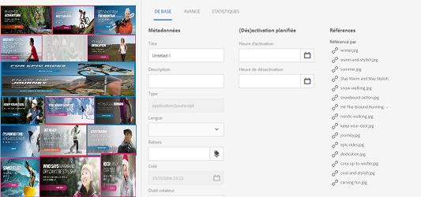
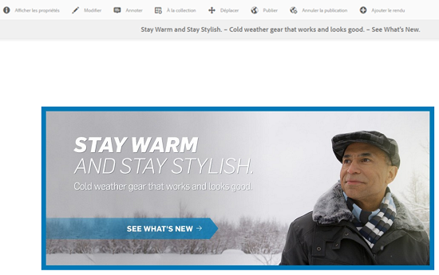
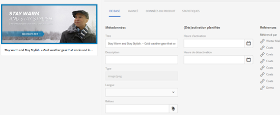
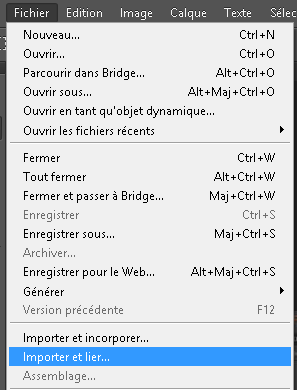

# Gestion des ressources composées avec des sous-ressources {#managing-compound-assets}

Le composant Adobe Experience Manager (AEM) Assets peut déterminer si un fichier chargé contient des références à des ressources existant déjà dans le référentiel. Cette fonctionnalité est disponible uniquement pour les types de formats pris en charge. Si le fichier chargé contient des références à des actifs AEM, un lien bidirectionnel est créé entre les ressources chargées et celles référencées.

En plus de supprimer toute redondance, le référencement des ressources AEM dans les applications Adobe Creative Cloud améliore la collaboration et accroît l’efficacité et la productivité des utilisateurs.

AEM Assets prend en charge le **référencement bidirectionnel**. Vous trouverez des ressources référencées dans la page des détails de la ressource du fichier chargé. Vous pouvez, en outre, afficher les fichiers de référencement des ressources AEM dans la page des détails de la ressource référencée.

Les références sont résolues sur la base du chemin d’accès, du document et de l’ID d’instance des ressources référencées.

## Ajout de ressources AEM Assets en tant que références dans Adobe Illustrator   {#refai}

Vous pouvez référencer des ressources AEM existantes dans un fichier Adobe Illustrator.

1. Utilisez l’[application de bureau AEM](https://helpx.adobe.com/fr/experience-manager/desktop-app/aem-desktop-app.html) pour monter le référentiel AEM Assets en tant que lecteur sur votre ordinateur local. Dans le lecteur monté, accédez à l’emplacement de la ressource à référencer.
1. Faites glisser la ressource du volume monté jusqu’au fichier Illustrator.
1. Enregistrez le fichier Illustrator sur le lecteur monté ou [chargez-le](managing-assets-touch-ui.md#uploading-assets) dans le référentiel AEM.
1. Une fois le processus terminé, accédez à la page des détails de la ressource. Les références à des ressources AEM existantes sont répertoriées sous **[!UICONTROL Dépendances]** dans la colonne **[!UICONTROL Références]**.

   

1. Les ressources référencées qui apparaissent sous **[!UICONTROL Dépendances]** peuvent également être référencées par des fichiers autres que celui qui est actif. Pour afficher une liste des fichiers de référencement d’une ressource, cliquez sur son nom sous **[!UICONTROL Dépendances]**.

   

1. Dans la barre d’outils, cliquez sur l’icône **[!UICONTROL Afficher les propriétés]**. Dans la page des propriétés, la liste des fichiers qui référencent la ressource en cours est visible sous la colonne **[!UICONTROL Références]** dans l’onglet **[!UICONTROL De base]**.

   

## Ajout de ressources AEM Assets en tant que références dans Adobe InDesign {#add-aem-assets-as-references-in-adobe-indesign}

Pour référencer des ressources AEM dans un fichier InDesign, faites-les glisser jusqu’au fichier ou exportez le fichier InDesign en tant que fichier ZIP.

Les ressources référencées existent déjà dans AEM Assets. You can extract subassets by [configure InDesign server](indesign.md). Les ressources intégrées à un fichier InDesign sont extraites sous la forme de sous-ressources.

>[!NOTE]
>
>Si le serveur InDesign est soumis à un proxy, l’aperçu des fichiers InDesign est intégré à leurs métadonnées XMP. Dans ce cas, l’extraction de miniature n’est pas explicitement requise. Toutefois, si le serveur InDesign n’est pas soumis à un proxy, les miniatures doivent être explicitement extraites pour les fichiers InDesign.

### Création de références en faisant glisser des ressources AEM   {#create-references-by-dragging-aem-assets}

Cette procédure est similaire à l’[ajout de ressources AEM en tant que références dans Adobe Illustrator](#refai).

### Création de références aux ressources AEM en exportant un fichier ZIP {#create-references-to-aem-assets-by-exporting-a-zip-file}

1. Perform the steps in [Creating Workflow Models](/help/sites-developing/workflows-models.md) to create a new workflow.
1. Utilisez l’option Assemblage d’Adobe InDesign pour exporter le document.
Adobe InDesign peut exporter un document et les ressources liées sous la forme d’un assemblage. Dans ce cas, le dossier exporté contient un dossier Links contenant des sous-ressources dans le fichier InDesign.
1. Créez un fichier ZIP et transférez-le dans le référentiel AEM.
1. Commencez le workflow de désarchivage.
1. Une fois le workflow terminé, les références contenues dans le dossier Liens sont automatiquement référencées en tant que sous-ressources. Pour afficher la liste des ressources référencées, accédez à la page des détails de la ressource InDesign et fermez le [rail](/help/sites-authoring/basic-handling.md#rail-selector).

## Ajout de ressources AEM Assets en tant que références dans Adobe Photoshop {#refps}

1. À l’aide d’un client WebDAV, montez AEM Assets comme lecteur.
1. Pour créer des références à des ressources AEM dans un fichier Photoshop, accédez aux ressources correspondantes sur le volume monté à l’aide de l’option Importer et lier dans Photoshop.

   

1. Enregistrez le fichier Photoshop sur le lecteur monté ou [chargez-le](managing-assets-touch-ui.md#uploading-assets) dans le référentiel AEM.
1. Une fois le workflow terminé, les références aux ressources AEM existantes sont répertoriées dans la page des détails de la ressource.

   Pour afficher les ressources référencées, fermez le [rail](/help/sites-authoring/basic-handling.md#rail-selector) dans la page des détails de la ressource.

1. The referenced assets also contain the list of assets they are referenced from. To view a list of referenced assets, navigate to the asset details page and close the [rail](/help/sites-authoring/basic-handling.md#rail-selector).

>[!NOTE]
>
>Les ressources contenues dans des ressources composites peuvent également être référencées par ID de document et ID d’instance. Cette fonctionnalité est disponible avec les versions d’Adobe Illustrator et d’Adobe Photoshop uniquement. Pour les autres, le référencement s’effectue sur la base du chemin d’accès relatif des ressources liées dans la ressource composite principale, comme dans les versions précédentes d’AEM.

## Création de sous-ressources {#generate-subassets}

Pour les ressources prises en charge avec des formats de plusieurs pages (fichiers PDF, fichiers AI, fichiers Microsoft PowerPoint et Apple Keynote et fichiers Adobe InDesign), AEM peut générer des sous-ressources qui correspondent à chaque page individuelle de la ressource d’origine. Ces sous-ressources sont liées à l’actif *parent* et facilitent la vue de plusieurs pages. Pour tous les autres usages, les sous-ressources sont traitées comme des actifs normaux en AEM.

La génération de sous-ressources est désactivée par défaut. Pour activer la génération de sous-ressources, procédez comme suit :

1. Connectez-vous au Experience Manager en tant qu’administrateur. Access **[!UICONTROL Tools > Workflow > Models]**.
1. Sélectionnez **[!UICONTROL DAM Update Asset]** Workflow et cliquez sur **[!UICONTROL Modifier]**.
1. Cliquez sur **[!UICONTROL Activer/désactiver le panneau]** latéral et recherchez l’étape **[!UICONTROL Créer un sous-actif]** . Ajoutez l’étape au processus. Cliquez sur **[!UICONTROL Synchroniser]**.

Pour générer les sous-ressources, effectuez l’une des opérations suivantes :

* Nouveaux actifs : Le processus de mise à jour des actifs  DAM s’exécute sur toute nouvelle ressource téléchargée sur AEM. Les sous-ressources sont générées automatiquement pour les nouvelles ressources de plusieurs pages.
* Ressources multi-page existantes : Exécutez manuellement le processus de mise à jour des ressources  DAM en procédant comme suit :

   * Sélectionnez une ressource et cliquez sur [!UICONTROL Chronologie] pour ouvrir le panneau de gauche. Alternately, use the keyboard shortcut `alt + 3`. Cliquez sur Processus [!UICONTROL de]Début, sélectionnez [!UICONTROL DAM Update Asset], cliquez sur [!UICONTROL Début], puis sur [!UICONTROL Continuer.]
   * Sélectionnez un élément et cliquez sur [!UICONTROL Créer > Processus] dans la barre d’outils. Dans la boîte de dialogue contextuelle, sélectionnez [!UICONTROL DAM Update Asset] workflow, cliquez sur [!UICONTROL Début], puis sur [!UICONTROL Continuer].

Plus précisément pour les documents Microsoft Word, exécutez le processus des Documents **[!UICONTROL DAM Parse]** Word. Il génère un `cq:Page` composant à partir du contenu du document Microsoft Word. Les images extraites du document sont référencées à partir du composant `cq:Page`. Elles sont extraites même si la génération des sous-ressources est désactivée.

## Affichage des sous-ressources {#viewing-subassets}

Les sous-ressources s’affichent uniquement si elles sont générées et disponibles pour la ressource multi-page sélectionnée. Pour vue des sous-ressources générées, ouvrez la ressource de plusieurs pages. Dans la partie supérieure gauche de la page, cliquez sur l’icône  gauche et cliquez sur **[!UICONTROL Sous-ensembles]** dans la liste. Lorsque vous sélectionnez **[!UICONTROL Sous-ensembles]** dans la liste. Alternately, use the keyboard shortcut `alt + 5`.

## Affichage des pages d’un fichier multipage   {#view-pages-of-a-multi-page-file}

Vous pouvez vue un fichier de plusieurs pages, tel que PDF, INDD, PPT, PPTX et AI, à l’aide de la fonction Page Viewer d’AEM Assets. Ouvrez un fichier de plusieurs pages et cliquez sur Pages **[!UICONTROL de]** Vue dans le coin supérieur gauche de la page. La visionneuse de pages qui s’ouvre affiche les pages du fichier et les commandes permettant de parcourir et de zoomer chaque page.

S’agissant d’InDesign, vous pouvez extraire des pages à l’aide du serveur InDesign. Si les aperçus des pages sont enregistrés lors de la création du fichier InDesign, le serveur InDesign n’est pas nécessaire pour l’extraction des pages.

Les options suivantes sont disponibles dans la barre d’outils, dans le rail de gauche et dans les commandes de la visionneuse de pages :

* **[!UICONTROL Actions]** de bureau pour ouvrir ou afficher une sous-ressource spécifique à l’aide d’AEM application de bureau. Découvrez comment [configurer les actions](https://experienceleague.adobe.com/docs/experience-manager-desktop-app/using/using.html?lang=en#desktopactions-v2) pour ordinateur si vous utilisez AEM application de bureau.

* **[!UICONTROL L’option Propriétés]** ouvre la page [!UICONTROL Propriétés] de la sous-ressource spécifique.

* **[!UICONTROL L’option Annoter]** vous permet d’annoter la sous-ressource spécifique. Les annotations que vous utilisez sur des sous-ressources distinctes sont collectées et affichées ensemble lorsque le fichier parent est ouvert pour affichage.

* **[!UICONTROL L’option Aperçu]** de la page affiche tous les sous-ressources simultanément.

* **[!UICONTROL L’option Chronologie]** du rail de gauche après avoir cliqué sur l’icône  gauche affiche le flux d’activité du fichier.

## Best practices and limitation {#best-practice-limitation-tips}

* La génération de sous-ressources peut être très gourmande en ressources pour tout déploiement Experience Manager. Si vous générez des sous-ressources lorsque des ressources complexes sont téléchargées, ajoutez l’étape suivante dans le processus de mise à jour des ressources de gestion des actifs numériques. Si vous générez des sous-ressources à la demande, créez un processus distinct pour générer des sous-ressources. Un processus dédié vous permet d’ignorer les autres étapes du processus de mise à jour des actifs de gestion des actifs numériques et d’enregistrer des ressources de calcul.

>[!MORELIKETHIS]
>
>* [Utilisation de l’appli de bureau Adobe Experience Manager](https://experienceleague.adobe.com/docs/experience-manager-desktop-app/using/using.html)

