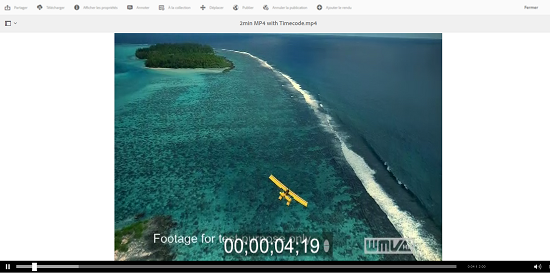
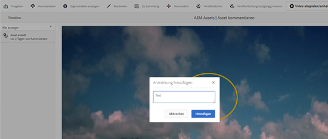
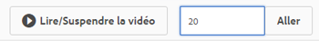

# Gestion des ressources vidéo   {#managing-video-assets}

Découvrez comment gérer et modifier les ressources vidéo dans Adobe Experience Manager (AEM) Assets. De plus, si vous possédez une licence d’utilisation Dynamic Media, reportez-vous à la [documentation vidéo sur Dynamic Media](video.md).

## Chargement et prévisualisation des ressources vidéo {#uploading-and-previewing-video-assets}

AEM Assets génère des prévisualisations pour les fichiers vidéo avec l’extension MP4. Si le format de la ressource n’est pas MP4, installez le pack FFmpeg pour générer une prévisualisation. FFmpeg crée des rendus vidéo de type OGG et MP4. Vous pouvez prévisualiser ces rendus dans l’interface utilisateur d’AEM Assets.

1. Dans le dossier ou les sous-dossiers Ressources numériques, accédez à l’emplacement où vous souhaitez ajouter des ressources numériques.
1. Pour télécharger le contenu, cliquez ou appuyez sur **[!UICONTROL Créer]** dans la barre d’outils, puis sélectionnez **[!UICONTROL Fichiers]**. Vous pouvez également le faire glisser directement jusqu’à la zone des ressources. Pour plus d’informations sur l’opération de téléchargement, voir [Téléchargement des ressources](managing-assets-touch-ui.md#uploading-assets).
1. Pour prévisualiser une vidéo en mode Carte, appuyez sur le bouton **[!UICONTROL Lire]** du contenu vidéo.

   

   Vous pouvez suspendre ou lire la vidéo dans la vue **[!UICONTROL Carte]** uniquement. Le bouton Lecture/Pause n’est pas disponible dans la vue **[!UICONTROL Liste]**.

1. Appuyez sur l&#39;icône **[!UICONTROL Modifier]** sur la carte pour prévisualisation de la vidéo dans la vue **[!UICONTROL Détails]**.

   La vidéo se joue dans le lecteur vidéo natif du navigateur. Vous pouvez lire, suspendre, afficher la vidéo en plein écran et en contrôler le volume.

   

## Configuration pour télécharger des ressources d’une taille supérieure à 2 Go {#configuration-to-upload-video-assets-that-are-larger-than-gb}

Par défaut, l’AEM Assets ne vous permet pas de télécharger des fichiers de plus de 2 Go en raison d’une taille de fichier limitée. Néanmoins, vous pouvez contourner cette limite en accédant à CRXDE Lite et en créant un nœud dans le répertoire `/apps`. Le nœud doit comporter le même nom, la même structure de répertoire et des propriétés comparables.

Outre la configuration AEM Assets, modifiez les configurations suivantes pour télécharger des fichiers volumineux :

* Augmentez le délai d’expiration du jeton. Voir [!UICONTROL Adobe Granite CSRF Servlet] dans Web Console à `https://[aem_server]:[port]/system/console/configMgr`. Pour plus d’informations, voir [Protection CSRF](/help/sites-developing/csrf-protection.md).
* Augmentez la configuration `receiveTimeout` du répartiteur. Pour plus d’informations, voir [Configuration du répartiteur Experience Manager](https://docs.adobe.com/content/help/en/experience-manager-dispatcher/using/configuring/dispatcher-configuration.html#renders-options).

>[!NOTE]
>
>L’interface utilisateur d’AEM Classic ne dispose pas d’une limite de taille de fichier de deux gigaoctets. Par ailleurs, le processus de bout en bout pour des vidéos volumineuses n’est pas entièrement pris en charge.

Pour configurer une limite de taille de fichier supérieure, procédez comme suit dans le répertoire `/apps`.

1. Dans AEM, appuyez sur **[!UICONTROL Outils > Général > CRXDE Lite]**.
1. Dans la page **[!UICONTROL CRXDE Lite]**, dans la fenêtre de répertoire de gauche, accédez à `/libs/dam/gui/content/assets/jcr:content/actions/secondary/create/items/fileupload`. Pour afficher la fenêtre d&#39;annuaire, appuyez sur l&#39;icône `>>`.
1. Dans la barre d’outils, appuyez sur **[!UICONTROL Noeud d’incrustation]**. Vous pouvez également sélectionner **[!UICONTROL Nœud de recouvrement]** dans le menu contextuel.
1. Dans la boîte de dialogue **[!UICONTROL Nœud de recouvrement]**, appuyez sur **[!UICONTROL OK]**.

   

1. Actualisez le navigateur. Le nœud de recouvrement `/apps/dam/gui/content/assets/jcr:content/actions/secondary/create/items/fileupload` est sélectionné.
1. Dans l’onglet **[!UICONTROL Propriétés]**, saisissez la valeur appropriée en octets pour définir la taille maximale souhaitée. Par exemple, saisissez la valeur `32212254720` pour augmenter la taille limite à 30 Go.

1. Dans la barre d’outils, appuyez sur **[!UICONTROL Enregistrer tout]**.
1. Dans AEM, appuyez sur **[!UICONTROL Outils > Opérations > Console web]**.
1. Sur la page **[!UICONTROL Bundles de la console Web Adobe Experience Manager]**, sous la colonne **[!UICONTROL Nom]** du tableau, recherchez et appuyez sur **[!UICONTROL Adobe Granite Workflow External Process Handler]**.
1. Dans la page **[!UICONTROL Adobe Granite Workflow External Process Handler]**, définissez les secondes pour les champs **[!UICONTROL Default Timeout]** et **[!UICONTROL Max Timeout]** sur `18000` (cinq heures).
1. Appuyez sur **[!UICONTROL Save]** (Enregistrer).
1. Dans AEM, appuyez sur **[!UICONTROL Outils > Processus > Modèles]**.
1. Sur la page **[!UICONTROL Modèles de processus]**, sélectionnez **[!UICONTROL Dynamic Media Encode Video]**, puis appuyez sur **[!UICONTROL Modifier]**.
1. Sur la page **[!UICONTROL Workflow]**, appuyez sur le composant **[!UICONTROL Processus du service vidéo Dynamic Media]** en appuyant sur le doublon.
1. Dans la boîte de dialogue **[!UICONTROL Propriétés des étapes]**, sous l’onglet **[!UICONTROL Commun]**, développez **[!UICONTROL Paramètres avancés]**.
1. Dans le champ **[!UICONTROL Délai dépassé]**, spécifiez une valeur de `18000`, puis appuyez sur **[!UICONTROL OK]** pour revenir à la page de workflow **[!UICONTROL Vidéo de codage de média dynamique]**.
1. Près du haut de la page, sous le titre de la page **[!UICONTROL Vidéo d’encodage Dynamic Media]**, appuyez sur **[!UICONTROL Enregistrer]**.

## Publication de ressources vidéo {#publishing-video-assets}

Une fois vos ressources vidéo publiées, vous pouvez les inclure dans une page web au moyen d’une URL ou d’une incorporation. Voir [Publier les ressources](publishing-dynamicmedia-assets.md).

## Annotation de ressources vidéo {#annotating-video-assets}

1. Dans la console Ressources, appuyez sur l’icône **[!UICONTROL Modifier]** de la carte de ressources pour afficher la page des détails de la ressource.
1. Appuyez sur l’icône **[!UICONTROL Prévisualisation]** pour lire la vidéo.
1. Pour annoter la vidéo, appuyez sur le bouton **[!UICONTROL Annoter]**. Une annotation est ajoutée à un moment spécifique de la vidéo.

   Lorsque vous annotez, vous pouvez dessiner sur le canevas et inclure un commentaire avec le dessin. Les commentaires sont automatiquement enregistrés dans les ressources AEM.

   

   Pour quitter l&#39;assistant d&#39;annotation, appuyez sur **[!UICONTROL Fermer]**.

1. Pour atteindre un point spécifique de la vidéo, spécifiez la durée en secondes dans le champ de texte, puis cliquez sur **[!UICONTROL Sauter]**. Par exemple, pour sauter les  premières secondes de la vidéo, saisissez `20`20 dans le champ texte.

   

1. Cliquez sur une annotation pour la vue dans la chronologie. Appuyez sur **[!UICONTROL Supprimer]** pour supprimer l&#39;annotation du plan de montage chronologique.

   
