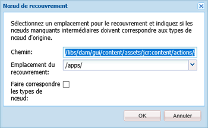
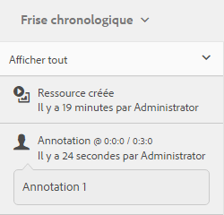

# Gestion des ressources vidéo  {#managing-video-assets}

Découvrez comment gérer et modifier les ressources vidéo dans Adobe Experience Manager (AEM) Assets. De plus, si vous possédez une licence d’utilisation Dynamic Media, reportez-vous à la [documentation vidéo sur Dynamic Media](video.md).

## Chargement et prévisualisation des ressources vidéo {#uploading-and-previewing-video-assets}

aem assets génère des prévisualisations pour les fichiers vidéo avec l’extension MP4. Si le format de la ressource n’est pas MP4, installez le pack FFmpeg pour générer une prévisualisation. FFmpeg crée des rendus vidéo de type OGG et MP4. Vous pouvez prévisualiser ces rendus dans l’interface utilisateur d’AEM Assets.

1. Dans le dossier ou les sous-dossiers Ressources numériques, accédez à l’emplacement où vous souhaitez ajouter des ressources numériques.
1. Pour télécharger le contenu, cliquez ou appuyez sur **[!UICONTROL Créer]** dans la barre d’outils, puis sélectionnez **[!UICONTROL Fichiers]**. Vous pouvez également le faire glisser directement jusqu’à la zone des ressources. Pour plus d’informations sur l’opération de téléchargement, voir [Téléchargement des ressources](managing-assets-touch-ui.md#uploading-assets).
1. Pour prévisualiser une vidéo en mode Carte, appuyez sur le bouton **[!UICONTROL Lire]** du contenu vidéo.

   

   You can pause or play video in the **[!UICONTROL Card]** view only. The Play/Pause button is not available in the **[!UICONTROL List]** view.

1. Tap the **[!UICONTROL Edit]** icon on the card to preview the video in the **[!UICONTROL Details]** view.

   La vidéo se joue dans le lecteur vidéo natif du navigateur. Vous pouvez lire, suspendre, afficher la vidéo en plein écran et en contrôler le volume.

   

## Configuration pour télécharger des ressources d’une taille supérieure à 2 Go {#configuration-to-upload-video-assets-that-are-larger-than-gb}

Par défaut, l’AEM Assets ne vous permet pas de télécharger des fichiers de plus de 2 Go en raison d’une taille de fichier limitée. Néanmoins, vous pouvez contourner cette limite en accédant à CRXDE Lite et en créant un nœud dans le répertoire `/apps`. Le nœud doit comporter le même nom, la même structure de répertoire et des propriétés comparables.

Outre la configuration AEM Assets, modifiez les configurations suivantes pour télécharger des fichiers volumineux :

* Augmentez le délai d’expiration du jeton. Voir Servlet [!UICONTROL CSRF] Granite Adobe dans la console Web à l’adresse `https://[aem_server]:[port]/system/console/configMgr`. Pour plus d’informations, voir Protection CSRF.
* Augmentez la configuration `receiveTimeout` du répartiteur. Pour plus d’informations, voir [Configuration du répartiteur Experience Manager](https://docs.adobe.com/content/help/en/experience-manager-dispatcher/using/configuring/dispatcher-configuration.html#renders-options).

>[!NOTE]
>
>L’interface utilisateur d’AEM Classic ne dispose pas d’une limite de taille de fichier de deux gigaoctets. Par ailleurs, le processus de bout en bout pour des vidéos volumineuses n’est pas entièrement pris en charge.

Pour configurer une limite de taille de fichier supérieure, procédez comme suit dans le répertoire `/apps`.

1. Dans AEM, appuyez sur **[!UICONTROL Outils > Général > CRXDE Lite]**.
1. In the **[!UICONTROL CRXDE Lite]** page, in the directory window on the left, navigate to `/libs/dam/gui/content/assets/jcr:content/actions/secondary/create/items/fileupload`. To see the directory window, touch `>>` icon.
1. From the toolbar, tap **[!UICONTROL Overlay Node]**. Vous pouvez également sélectionner **[!UICONTROL Nœud de recouvrement]** dans le menu contextuel.
1. Dans la boîte de dialogue **[!UICONTROL Nœud de recouvrement]**, appuyez sur **[!UICONTROL OK]**.

   

1. Actualisez le navigateur. Le nœud de recouvrement `/apps/dam/gui/content/assets/jcr:content/actions/secondary/create/items/fileupload` est sélectionné.
1. Dans l’onglet **[!UICONTROL Propriétés]**, saisissez la valeur appropriée en octets pour définir la taille maximale souhaitée. For example, enter `32212254720` value to increase the size limit to 30 GB.

1. From the toolbar, tap **[!UICONTROL Save All]**.
1. Dans AEM, appuyez sur **[!UICONTROL Outils > Opérations > Console web]**.
1. On the **[!UICONTROL Adobe Experience Manager Web Console Bundles]** page, under the **[!UICONTROL Name]** column of the table, locate and tap **[!UICONTROL Adobe Granite Workflow External Process Job Handler]**.
1. In the **[!UICONTROL Adobe Granite Workflow External Process Job Handler]** page, set the seconds for both **[!UICONTROL Default Timeout]** and **[!UICONTROL Max Timeout]** fields to `18000` (five hours).
1. Appuyez sur **[!UICONTROL Save]** (Enregistrer).
1. Dans AEM, appuyez sur **[!UICONTROL Outils > Processus > Modèles]**.
1. On the **[!UICONTROL Workflow Models]** page, select **[!UICONTROL Dynamic Media Encode Video]**, then tap **[!UICONTROL Edit]**.
1. On the **[!UICONTROL Workflow]** page, double-tap the **[!UICONTROL Dynamic Media Video Service Process]** component.
1. Dans la boîte de dialogue **[!UICONTROL Propriétés des étapes]**, sous l’onglet **[!UICONTROL Commun]**, développez **[!UICONTROL Paramètres avancés]**.
1. Dans le champ **[!UICONTROL Délai dépassé]**, spécifiez une valeur de `18000`, puis appuyez sur **[!UICONTROL OK]** pour revenir à la page de workflow **[!UICONTROL Vidéo de codage de média dynamique]**.
1. Near the top of the page, below the **[!UICONTROL Dynamic Media Encode Video]** page title, tap **[!UICONTROL Save]**.

## Publication de ressources vidéo {#publishing-video-assets}

Une fois vos ressources vidéo publiées, vous pouvez les inclure dans une page web au moyen d’une URL ou d’une incorporation. Voir [Publication de fichiers](publishing-dynamicmedia-assets.md).

## Annotation de ressources vidéo {#annotating-video-assets}

1. From the Assets console, tap the **[!UICONTROL Edit]** icon on the asset card to display the asset details page.
1. Tap the **[!UICONTROL Preview]** icon to play the video.
1. To annotate the video, tap the **[!UICONTROL Annotate]** button. Une annotation est ajoutée à un moment spécifique de la vidéo.

   Lorsque vous annotez, vous pouvez dessiner sur le canevas et inclure un commentaire avec le dessin. Les commentaires sont automatiquement enregistrés dans les ressources AEM.

   

   To exit the annotation wizard, tap **[!UICONTROL Close]**.

1. To jump to a specific point in the video, specify the time in seconds in the text field and click **[!UICONTROL Jump]**. Par exemple, pour sauter les  premières secondes de la vidéo, saisissez `20`20 dans le champ texte.

   

1. Cliquez sur une annotation pour la vue dans la chronologie. Tap **[!UICONTROL Delete]** to remove the annotation from the timeline.

   
