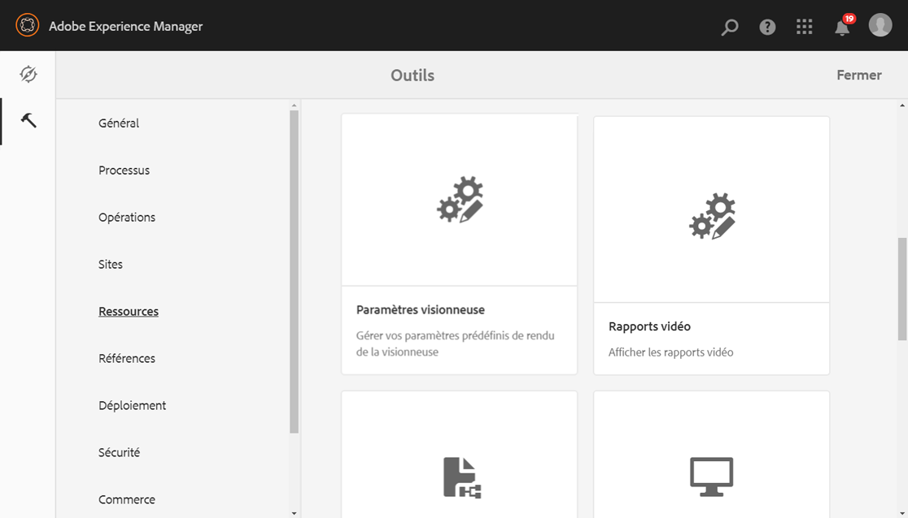
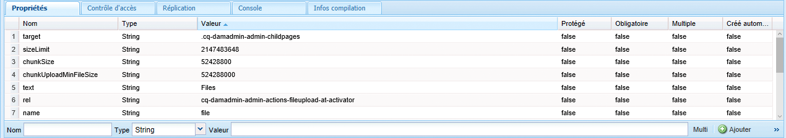
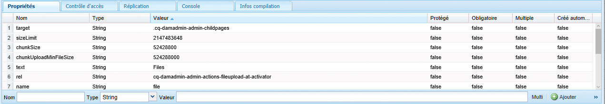
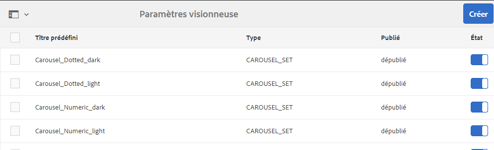

# Gestion des paramètres prédéfinis de la visionneuse Dynamic Media {#managing-viewer-presets}

Un paramètre prédéfini de visionneuse Dynamic Media est un ensemble de paramètres qui déterminent comment les utilisateurs vue des fichiers de média enrichi sur leur écran d’ordinateur et leurs périphériques mobiles. Si vous êtes administrateur, vous pouvez créer des paramètres prédéfinis de visionneuse. Les paramètres sont disponibles pour un ensemble d’options de configuration de la visionneuse. Par exemple, vous pouvez modifier la taille d’affichage ou le comportement de zoom de la visionneuse.

Pour obtenir des instructions sur la création et la personnalisation de vos propres paramètres prédéfinis de visionneuse HTML5, voir le *kit de développement de visionneuse HTML5 Adobe Scene7*. Le kit SDK est disponible sur le serveur de publication IS intégré au kit SDK lui-même. Chaque version de la bibliothèque possède sa propre documentation SDK incluse.

Chemin: `<scene7_domain>/s7sdk/<library_version>/docs/jsdocs/index.html`.\
Par exemple, SDK 3.5 : [https://s7d1.scene7.com/s7sdk/3.5/docs/jsdoc/index.html](https://s7d1.scene7.com/s7sdk/3.5/docs/jsdoc/index.html)

Voir aussi le [Guide de référence des visionneuses Adobe](https://docs.adobe.com/content/help/fr-FR/dynamic-media-developer-resources/library/home.html).

Cette section décrit comment créer, modifier et gérer les paramètres prédéfinis de visionneuse. Vous pouvez appliquer des paramètres prédéfinis de visionneuse à une image lorsque vous la prévisualisez. Reportez-vous à la section [Application de paramètres de visionneuse prédéfinis](viewer-presets.md).

>[!NOTE]
>
>Notez que la modification des *paramètres prédéfinis de visionneuse prêts à l’emploi* n’est pas un scénario pris en charge. Si vous tentez de modifier un paramètre de visionneuse prédéfini de base, vous serez invité à enregistrer ce paramètre de visionneuse prédéfini en utilisant un nouveau nom.

## Accessibilité clavier pour les visionneuses   {#keyboard-accessibility-for-viewers}

Toutes les visionneuses prêtes à l’emploi prennent en charge l’accessibilité clavier.

Voir aussi [Accessibilité clavier et navigation](https://docs.adobe.com/content/help/fr-FR/dynamic-media-developer-resources/library/c-keyboard-accessibility.html).

## Gestion des paramètres prédéfinis de la visionneuse Dynamic Media {#managing-presets}

Vous pouvez ajouter, modifier, supprimer, publier, annuler la publication et les paramètres prédéfinis de la visionneuse de prévisualisations dans AEM en appuyant sur **[!UICONTROL Outils > Ressources > Paramètres prédéfinis de la visionneuse]**.

>[!NOTE]
>
>Par défaut, le système affiche 15 paramètres de visionneuse prédéfinis lorsque vous sélectionnez Visionneuses dans l’affichage des détails d’une ressource. Vous pouvez augmenter cette limite. Voir [Augmentation du nombre de paramètres de visionneuse prédéfinis qui s’affichent](#increasing-the-number-of-viewer-presets-that-display).

## Prise en charge de la visionneuse pour les pages web en responsive design   {#viewer-support-for-responsive-designed-web-pages}

Chaque page web a des besoins différents. Vous aurez parfois besoin d’une page web proposant un lien qui ouvre la visionneuse HTML5 dans une fenêtre de navigateur distincte. Dans d’autres cas, vous aurez peut-être besoin d’intégrer directement la visionneuse HTML5 sur la page d’hébergement. Si c’est le cas, la page web aura peut-être une mise en page statique. Ou, il peut être *réactif* et s’afficher différemment sur différents périphériques ou pour différentes tailles de fenêtre de navigateur. Pour répondre à ces besoins, toutes les visionneuses prédéfinies HTML5 fournies avec Dynamic Media sont compatibles à la fois avec les pages web statiques et les pages web réactives.

Voir [Bibliothèque d’images réactives](https://docs.adobe.com/content/help/fr-FR/dynamic-media-developer-resources/image-serving-api/image-serving-api/responsive-static-image-library/c-about-responsive-static-image-library.html) dans l’*aide de l’API de diffusion d’image* afin d’en savoir plus sur l’intégration des visionneuses réactives sur vos pages web.

>[!NOTE]
>
>Notez que vous devez publier toutes les visionneuses prêtes à l’emploi avant de les utiliser pour la première fois.\
>Voir [Publication de paramètres de visionneuse prédéfinis](#publishing-viewer-presets).

## Compatibilité du système de visionneuse prédéfinie {#viewer-preset-system-compatibility}

Tous les paramètres de visionneuse prédéfinis fournis avec Dynamic Media sont entièrement compatibles avec les systèmes suivants :

* Ordinateurs de bureau
* iPhone Apple
* iPad Apple
* Smartphone Android
* Tablette Android
* Pour la vidéo, une prise en charge supplémentaire de la lecture MP4 est fournie pour [Blackberry](https://developer.blackberry.com/devzone/develop/supported_media/bb_media_support_at_a_glance.html#kba1328730952678) et [Windows Phone 8](https://msdn.microsoft.com/library/windows/apps/ff462087%28v=vs.105%29.aspx).

### Types de médias enrichis pour les paramètres prédéfinis de visionneuse {#rich-media-types-for-viewer-presets}

Les administrateurs peuvent ajouter et personnaliser les types de médias riches suivants lors de la création de paramètres prédéfinis de visionneuse :

| Types de supports enrichis | Description |
|:---|:---|
| **Ensemble de carrousel** | Les zones sensibles ou cliquables, ou les deux, sont ajoutées à une série de deux images ou plus. Le client peut faire défiler les images vers la gauche ou la droite, puis cliquer sur une zone réactive ou sur une image pour obtenir des informations supplémentaires ou réaliser un achat directement depuis une page de catégorie, d’accueil ou d’entrée d’un site web. |
| **Zoom sur la fenêtre déroulante** | Affiche une seconde image de la zone agrandie en regard de l’image d’origine. Aucune commande n’est disponible. Il suffit de déplacer la sélection sur la zone à visualiser. |
|  | Pour déterminer la quantité totale de bande passante allouée à la visionneuse, n’oubliez pas que l’image principale et celle de la fenêtre déroulante sont toutes deux diffusées par la visionneuse. La taille de l’image principale (largeur et hauteur d’affichage) et le facteur de zoom déterminent la taille de la fenêtre déroulante. Pour que la fenêtre déroulante ne devienne pas trop volumineuse, équilibrez ces deux valeurs : si la taille de l’image principale est importante, réduisez la valeur du facteur de zoom. (La largeur et la hauteur de la fenêtre déroulante déterminent la taille de cette dernière, mais pas celle de l’image diffusée par la visionneuse). |
|  | Par exemple, si la taille de l’image principale est de 350 x 350 pixels et que le facteur de zoom est de 3, la taille d’image de la fenêtre déroulante sera de 1 050 x 1 050 pixels. Si la taille de l’image principale est de 300 x 300 pixels et que le facteur de zoom est de 4, la taille d’image de la fenêtre déroulante sera de 1 200 x 1 200 pixels. Selon la valeur de qualité JPEG sélectionnée (une valeur comprise entre 80 et 90 est recommandée), il est possible de réduire sensiblement la taille du fichier. Selon la taille de l’image principale, un facteur de zoom de 2,5 à 4 est recommandé. |
| **Zoom intégré** | Affiche une image de la zone agrandie dans la visionneuse d’origine. Il n’y a aucune commande à utiliser. Les utilisateurs déplacent simplement la sélection sur la zone à afficher. |
| **Visionneuse d’images** | Dans la visionneuse d’images, les utilisateurs peuvent voir différentes vues ou variantes de couleur d’un élément en cliquant sur une image miniature. Cette visionneuse propose également des outils de zoom pour examiner les images de plus près. |
| **Image interactive** | Des zones réactives sont ajoutées aux parties d’une image. Le client peut alors cliquer dessus pour obtenir des détails supplémentaires ou pour réaliser directement un achat sur les pages de destination, d’accueil ou de catégorie d’un site web. |
| **Vidéo interactive** | Des miniatures sont ajoutées aux segments de montage d’une vidéo. Le client peut alors cliquer dessus pour obtenir des détails supplémentaires ou pour réaliser directement un achat sur les pages de destination, d’accueil ou de catégorie d’un site web. |
| **Supports variés** | Affiche différents types de médias dans une seule visionneuse. Vous pouvez inclure des visionneuses à 360°, des visionneuses d’images, des images et des vidéos. |
| **Image panoramique** | Les visionneuses Image panoramique et PanoramicVR effectuent le rendu d’images panoramiques sphériques pour plonger les utilisateurs dans une expérience de visionnage à 360° d’une pièce, d’une propriété, d’un lieu ou d’un paysage. |
|  | Pour qu’une image téléchargée soit un panorama sphérique, elle doit posséder l’une ou l’autre des propriétés suivantes, ou les deux : <ul><li>Un rapport d’aspect de 2:1.</li><li>Balisée avec les mots-clés équirectangulaire ou sphérique et panorama, ou sphérique et panoramique. Voir [Utilisation des balises](../sites-authoring/tags.md).</li></ul> |
|  | Les critères de rapport d’aspect et de mots-clés s’appliquent tous deux aux ressources panoramiques pour la page des détails des ressources et le composant WCM « médias panoramiques ». |
|  | Important : Cette visionneuse est uniquement disponible dans le mode Scene7 de Dynamic Media. |
| **Visionneuse à 360°** | Propose plusieurs vues d’une image afin que les utilisateurs puissent faire pivoter l’objet pour l’examiner sous différents angles. |
| **Vidéo** | Lit la vidéo à l’aide de la diffusion en continu à débit progressif ou adaptatif. La diffusion en continu à débit adaptatif détecte automatiquement l’appareil et la bande passante pour diffuser la vidéo au bon format et dans la qualité correcte. |
| **Zoom vertical** | La visionneuse Zoom vertical permet d’optimiser l’expérience de visionnage d’une imagerie de produit afin d’offrir aux utilisateurs la meilleure représentation d’un produit. L’emplacement vertical des échantillons présente les avantages suivants : <ul><li>Veille à ce que les nuances soient au-dessus du pli. Avec des nuances horizontales, en fonction de la taille de l’écran de bureau de l’utilisateur ’, les nuances n’étaient pas visibles tant que l’utilisateur n’avait pas fait défiler la page. Placés verticalement dans la visionneuse, les échantillons sont visibles quelle que soit la taille de l’écran de l’utilisateur.</li><li>Il optimise la taille de l’image principale. Avec les échantillons horizontaux, il est nécessaire de réserver de la place sur la page afin de vous assurer qu’ils sont visibles. Ce positionnement a réduit la taille de l’image principale. Toutefois, avec une disposition verticale des échantillons, vous n’avez pas besoin d’allouer cet espace. Ainsi, vous pouvez agrandir la taille de l’image principale.</li></ul> |
| **Zoom** | Permet aux utilisateurs d’effectuer un zoom sur la zone en cliquant dessus. Ils peuvent cliquer sur les commandes pour effectuer un zoom avant ou arrière et rétablir la taille par défaut de l’image. |

## Liste des paramètres prédéfinis prêts à l’emploi de la visionneuse {#list-of-out-of-the-box-viewer-presets}

Le tableau suivant identifie tous les paramètres prédéfinis prêts à l’emploi prédéfinis de visionneuse fournis avec Dynamic Media.

Voir aussi [Live Demos](https://landing.adobe.com/en/na/dynamic-media/ctir-2755/live-demos.html).

Pour en savoir plus sur les versions de navigateur web et de système d’exploitation compatibles avec les visionneuses, consultez les notes de mise à jour des visionneuses.

Voir *Notes de mise à jour des visionneuses* dans la table des matières du [Guide de référence des visionneuses](https://docs.adobe.com/content/help/en/dynamic-media-developer-resources/library/home.html).

>[!NOTE]
>
>Tous les paramètres prédéfinis de visionneuse prêts à l’emploi de Dynamic Media sont déjà activés, mais vous devez les publier.\
>Voir [Publication de paramètres de visionneuse prédéfinis](#publishing-viewer-presets).
>
>Les nouveaux paramètres prédéfinis de visionneuse que vous créez et ajoutez doivent être activés *et* publiés.\
>Voir [Activation ou désactivation des paramètres prédéfinis de visionneuse](#activating-or-deactivating-viewer-presets) et [Publication de paramètres prédéfinis de visionneuse](#publishing-viewer-presets).

| Titre du paramètre prédéfini de la visionneuse | Type | Nom de fichier CSS |
|:---|:---|:---|
| Carousel_Dotted_dark | Ensemble_carrousel | html5_carouselviewer_dotted_dark.css |
| Carousel_Dotted_light | Ensemble_carrousel | html5_carouselviewer_dotted_light.css |
| Carousel_Numeric_dark | Ensemble_carrousel | html5_carouselviewer_numeric_dark.css |
| Carousel_Numeric_light | Ensemble_carrousel | html5_carouselviewer_numeric_light.css |
| Flyout | Zoom_fenêtre déroulante | html5_flyoutviewer.css |
| ImageSet_dark | Visionneuse d’images | html5_zoomviewer_dark.css |
| ImageSet_light | Visionneuse d’images | html5_zoomviewer_light.css |
| InlineMixedMedia_dark | Supports_variés | html5_inlinemixedmediaviewer_dark.css |
| InlineMixedMedia_light | Supports_variés | html5_inlinemixedmediaviewer_light.css |
| InlineZoom | Zoom_fenêtre déroulante | html5_inlinezoomviewer.css |
| MixedMedia_dark | Supports_variés | html5_mixedmediaviewer_dark.css |
| MixedMedia_light | Supports_variés | html5_mixedmediaviewer_light.css |
| PanoramicImage | Image_panoramique | html5_panoramicimage.css |
| PanoramicImageVR | Image_panoramique | html5_panoramicimage.css |
| Shoppable_Banner | Image_interactive | html5_interactiveimage.css |
| Shoppable_Video_dark | Vidéo_interactive | html5_interactivevideoviewer_dark.css |
| Shoppable_Video_light | Vidéo_interactive | html5_interactivevideovewer_light.css  |
| SpinSet_dark | Visionneuse_à_360° | html5_spinviewer_dark.css |
| SpinSet_light | Visionneuse_à_360° | html5_spinviewer_light.css |
| Vidéo (inclut la prise en charge du sous-titrage) | Vidéo | html5_videoviewer.css |
| Video_social (inclut la prise en charge du sous-titrage et des médias sociaux) | Vidéo | html5_videoviewersocial.css |
| Zoom_dark | Zoom | html5_basiczoomviewer_dark.css |
| Zoom_light | Zoom | html5_basiczoomviewer_light.css |
| ZoomVertical_dark | Zoom_vertical | html5_zoomverticalviewer_dark.css |
| ZoomVertical_light | Zoom_vertical | html5_zoomverticalviewer_light.css |

### Tableau des gestes pris en charge par les visionneuses mobiles {#supported-mobile-viewers-gestures-matrix}

Le tableau suivant répertorie les gestes pris en charge dans les visionneuses mobiles sur les appareils iOS, Android 2.x et Android 3.x.

| Gestes | Zoom sur la fenêtre déroulante | Zoom | Rotation |
|---|---|---|---|
| **Glissement de doigt** | Panoramique | Panoramique | Panoramique |
| **Pression** | Affiche la fenêtre déroulante | Affiche ou masque l’interface utilisateur | Affiche ou masque l’interface utilisateur |
| **Double appui** | Ne s’applique pas | Zoom avant ou réinitialisation | Zoom avant ou réinitialisation |
| **Écartement des doigts** | Ne s’applique pas | Zoom avant (iOS et Android 3x uniquement) | Zoom avant (iOS et Android 3x uniquement) |
| **Pincement des doigts** | Ne s’applique pas | Zoom arrière (iOS et Android 3x uniquement) | Zoom arrière (iOS et Android 3x uniquement) |
| **Balayage** | Fait défiler la barre d’échantillons | Fait défiler les images | Rotation |
| **Glissement rapide** | Fait défiler la barre d’échantillons | Fait défiler les images | Rotation |

## Augmentation du nombre de paramètres prédéfinis de la visionneuse Dynamic Media qui affichent {#increasing-the-number-of-viewer-presets-that-display}

AEM affiche une grande variété de paramètres prédéfinis de visionneuse lors de l’affichage de ressources à partir de **[!UICONTROL Affichage des détails > Visionneuses]**. Vous pouvez augmenter ou diminuer le nombre de visionneuses qui s’affichent.

**Pour augmenter le nombre de paramètres prédéfinis de la visionneuse Dynamic Media qui s’affichent** :

1. Accédez à **[!UICONTROL CRXDE Lite]** ([http://localhost:4502/crx/de](http://localhost:4502/crx/de)).
1. Accédez au nœud de liste des paramètres prédéfinis de visionneuse à l’adresse `/libs/dam/gui/coral/content/commons/sidepanels/viewerpresets/viewerpresetslist`

   

1. Dans la propriété **[!UICONTROL limit]**, définissez la valeur de votre choix dans la colonne **[!UICONTROL Valeur]** ; par défaut, elle est définie sur 15.
1. Accédez à la source de données de paramètres prédéfinis de visionneuse à l’adresse `/libs/dam/gui/coral/content/commons/sidepanels/viewerpresets/viewerpresetslist/datasource`

   

1. Dans la propriété **[!UICONTROL limit]**, remplacez le nombre par le nombre souhaité, par exemple `{empty requestPathInfo.selectors[1] ? "20" : requestPathInfo.selectors[1]}`.
1. Appuyez sur **[!UICONTROL Enregistrer tout]**.

## Création d’un paramètre prédéfini de visionneuse Dynamic Media {#creating-a-new-viewer-preset}

La création de paramètres prédéfinis de visionneuse vous permet d’appliquer divers paramètres afin d’afficher et d’interagir avec les ressources. Toutefois, vous n’avez pas besoin de créer de nouveaux paramètres prédéfinis de visionneuse. Si vous préférez, vous pouvez utiliser les paramètres prédéfinis de visionneuse par défaut fournis avec AEM Assets.

Si vous choisissez de créer un paramètre prédéfini de visionneuse, après l’avoir enregistré, l’état de la visionneuse est automatiquement activé (défini sur **Activé**) dans la page Paramètres prédéfinis de la visionneuse. **** Cet état signifie qu’il est visible dans le composant **[!UICONTROL Dynamic Media]** et le composant **[!UICONTROL Interactive Media]** et chaque fois que vous prévisualisation une image ou une vidéo.

Certains paramètres prédéfinis de visionneuse bénéficient de paramètres exclusifs qui peuvent affecter l’utilisation et le comportement global de la visionneuse. Selon le paramètre prédéfini de visionneuse que vous créez, il est souhaitable d’être au fait de ces remarques spéciales.

Voir [Remarques spéciales sur la création d’un paramètre de visionneuse interactive prédéfini](#special-considerations-for-creating-an-interactive-viewer-preset).

Voir [Remarques spéciales sur la création d’un paramètre prédéfini de visionneuse pour une bannière de carrousel](#special-considerations-for-creating-a-carousel-banner-viewer-preset).

**Pour créer un paramètre prédéfini** de visionneuse Dynamic Media :

1. Dans le coin supérieur gauche de l’AEM, appuyez sur le logo AEM, puis, dans le rail de gauche, appuyez sur **[!UICONTROL Outils > Ressources > Paramètres prédéfinis de la visionneuse]**.

   

1. Sur la page **[!UICONTROL Paramètres prédéfinis de la visionneuse]**, sur la barre d’outils, appuyez sur **[!UICONTROL Créer]**.
1. Dans la boîte de dialogue **[!UICONTROL Nouveau paramètre prédéfini de la visionneuse]**, saisissez le nom du nouveau paramètre prédéfini dans le champ **[!UICONTROL Nom du paramètre prédéfini]**. Choisissez le nom avec soin ; il ne peut plus être modifié une fois que vous avez appuyé sur **[!UICONTROL Créer]**.

   Lorsque vous enregistrez le paramètre prédéfini plus loin dans ces étapes, le nom s’affiche sur la page Paramètres prédéfinis de la visionneuse sous l’en-tête de colonne **[!UICONTROL Titre du paramètre prédéfini]**.

1. Dans le menu déroulant **[!UICONTROL Type de média enrichi]**, sélectionnez le type de paramètre prédéfini de visionneuse à créer, puis, dans le coin supérieur droit de la page, appuyez sur **[!UICONTROL Créer]**.

   Voir [Types de médias riches pour les paramètres prédéfinis de visionneuse](#rich-media-types-for-viewer-presets).

1. Sur la page **Modifier le paramètre prédéfini de visionneuse**, appuyez sur l’onglet **[!UICONTROL Apparence]**.
1. Utilisez l’une des méthodes suivantes :

   * Dans le menu déroulant **[!UICONTROL Type sélectionné]**, sélectionnez un composant dont vous souhaitez personnaliser la conception visuelle. Vous pouvez également appuyer sur n’importe quel élément visuel de la visionneuse pour le sélectionner en vue de sa configuration.

      L’éditeur visuel vous permet de voir l’effet d’une propriété spécifique sur un style. Il vous suffit de définir ou de modifier une propriété pour immédiatement en visualiser l’effet sur la visionneuse en utilisant l’échantillon à la gauche de l’éditeur.

      Les propriétés de style CSS pour chaque type de paramètre prédéfini de visionneuse sont décrites dans la rubrique d’aide Personnalisation de *&lt;nom_visionneuse>* du [Guide de référence des visionneuses](https://docs.adobe.com/content/help/en/dynamic-media-developer-resources/library/home.html).

      Par exemple, si vous créez un paramètre prédéfini de visionneuse de type `Mixed_Media`, consultez [Personnalisation des visionneuses de supports variés](https://docs.adobe.com/content/help/fr-FR/dynamic-media-developer-resources/library/viewers-aem-assets-dmc/mixed-media/customing-mixed-media/c-html5-mixedmedia-viewer-customizingviewer.html) pour une liste et une description de chaque propriété.

   * Si vous avez défini des paramètres de style dans un fichier CSS distinct, vous pouvez charger le fichier CSS dans AEM Assets. Appuyez sur **[!UICONTROL Importer CSS]** en dessous du menu déroulant **[!UICONTROL Type sélectionné]** (vous devrez peut-être faire défiler la page vers le haut pour le voir) afin de trouver le fichier CSS chargé et de l’associer aux paramètres prédéfinis de visionneuse.

       Lorsque vous importez un fichier CSS, l’éditeur visuel vérifie que le CSS utilise des marqueurs de visionneuse adaptés. Si vous créez par exemple une visionneuse de zoom, toutes les règles CSS que vous importez doivent être définies à l’aide de son nom de classe de visionneuse `.s7mixedmediaviewer` défini sur un élément de visionneuse parent.

      Vous pouvez importer des CSS arbitraires créés manuellement, à condition qu’ils définissent correctement les marqueurs CSS d’une visionneuse donnée. (Les marqueurs CSS sont décrits dans la rubrique d’aide Personnalisation de la visionneuse *&lt;nom de visionneuse>* du [Guide de référence des visionneuses](https://docs.adobe.com/content/help/en/dynamic-media-developer-resources/library/home.html). Par exemple, pour en savoir plus sur les marqueurs CSS de la visionneuse de zoom, reportez-vous à [Personnalisation de la visionneuse de zoom](https://docs.adobe.com/content/help/fr-FR/dynamic-media-developer-resources/library/viewers-aem-assets-dmc/zoom/customizing-zoom/c-html5-20-zoom-viewer-customizingviewer.html).) Il se peut toutefois que l’éditeur visuel ne comprenne pas certaines valeurs CSS. Dans de tels cas, l’éditeur visuel tente d’ignorer les erreurs de sorte que le code CSS reste fonctionnel.
   >[!NOTE]
   >
   >Si vous préférez modifier le CSS directement dans sa forme brute, appuyez sur **[!UICONTROL Afficher/Masquer CSS]** sous le menu déroulant Type sélectionné (vous devrez peut-être faire défiler l’éditeur visuel pour le voir).****
   >
   >Comme pour l’éditeur visuel, lorsque vous modifiez une propriété directement dans le CSS, vous pouvez voir immédiatement l’effet du changement sur l’échantillon de visionneuse. En outre, cette même propriété est automatiquement et simultanément mise à jour dans l’éditeur visuel. Ainsi, vous pouvez utiliser l’éditeur CSS brut, l’éditeur visuel, ou les deux, de façon interchangeable.

   >[!NOTE]
   >
   >Pour une illustration de bouton, sélectionnez l’image x2 puis téléchargez l’illustration haute résolution. Lorsque vous travaillez avec des images interactives et des bannières favorisant les achats, vous pouvez également choisir parmi divers boutons de zone réactive prêts à l’emploi.

1. (Facultatif) Près du haut de la page **[!UICONTROL Modifier le paramètre prédéfini de visionneuse]**, appuyez sur **[!UICONTROL Bureau]**, **[!UICONTROL Tablette]** ou **[!UICONTROL Téléphone]** pour définir de manière unique les styles visuels pour les différents types d’écran et de périphériques.
1. Sur la page **[!UICONTROL Modifier le paramètre prédéfini de visionneuse]**, appuyez sur l’onglet **Comportement**. Vous pouvez également appuyer ou cliquer sur n’importe quel élément visuel de la visionneuse afin de le sélectionner pour le configurer.
1. Dans le menu déroulant **[!UICONTROL Type sélectionné]**, sélectionnez un composant dont vous souhaitez modifier le comportement.

   De nombreux composants de l’éditeur visuel présentent une description détaillée. Ces descriptions apparaissent dans des boîtes de dialogue bleues lorsque vous développez un composant pour en afficher les paramètres associés.

   Certains types de visionneuses comportent des composants qui vous permettent de spécifier des commandes de diffusion d’images dans un champ de texte **Commande IS**. Pour obtenir la liste des commandes que vous pouvez utiliser, voir le [Guide de référence de l’API IS](https://docs.adobe.com/content/help/fr-FR/dynamic-media-developer-resources/image-serving-api/image-serving-api/c-is-home.html).

   >[!NOTE]
   >
   >**Si vous utilisez un périphérique tactile, tel qu’un téléphone ou une tablette…** 
   >
   >Après avoir saisi une valeur dans le champ de texte, appuyez n’importe où dans l’interface utilisateur pour soumettre la modification et fermer le clavier virtuel. Si vous appuyez sur **[!UICONTROL Entrée]**, aucune action n’a lieu.

1. Dans le coin supérieur droit de la page, appuyez sur **[!UICONTROL Enregistrer]**.
1. Publiez votre nouveau paramètre de visionneuse prédéfini. Vous devez publier le paramètre prédéfini avant de pouvoir l’utiliser sur votre site web.

   Voir [Publication de paramètres de visionneuse prédéfinis](#publishing-viewer-presets).

## Remarques spéciales sur la création d’un paramètre de visionneuse interactive prédéfini   {#special-considerations-for-creating-an-interactive-viewer-preset}

**À propos des modes d’affichage des miniatures dans le panneau**

Lorsque vous créez ou modifiez un paramètre prédéfini de visionneuse de vidéos interactives, vous avez le choix entre le paramètre **[!UICONTROL Mode d’affichage]** à utiliser lorsque vous sélectionnez `InteractiveSwatches` dans le menu déroulant **[!UICONTROL Composant sélectionné]** sous l’onglet **[!UICONTROL Comportement]**. Le mode d’affichage que vous choisissez affecte la façon dont les miniatures s’affichent pendant la lecture de la vidéo. Vous pouvez choisir un mode d&#39;affichage `segment`(par défaut) ou un mode d&#39;affichage `continuous`.

| Mode d’affichage | Description |
|---|---|
| [!UICONTROL Segment] |  Segmente est le mode d’affichage par défaut pour les paramètres prédéfinis de visionneuse de vidéos interactives prêtes à l’emploi Shoppable_Video_light et Shoppable_Video_dark, ainsi que les paramètres prédéfinis de visionneuse de vidéos interactives que vous créez vous-même. |
|  | Dans ce mode, lorsqu’il y a moins de miniatures affectées à un segment de vidéo que le nombre d’emplacements dans le panneau d’affichage, les miniatures des sous-segments suivants ou précédents ne sont pas utilisées pour remplir les espaces vides dans le panneau. En d’autres termes, cela préserve l’affichage des échantillons affectés à ce segment vidéo spécifique. |
| [!UICONTROL Continu] | En [!UICONTROL mode d’affichage continu], si le nombre de miniatures d’un segment est inférieur au nombre visible dans le panneau, le lecteur inclut automatiquement l’affichage des miniatures du segment suivant, ou du segment précédent, dans les cas où la dernière miniature est affichée. |

**À propos du comportement de défilement automatique dans la visionneuse de vidéo interactive**

Le comportement du défilement automatique des miniatures dans la visionneuse de vidéo interactive est indépendant du mode d’affichage que vous avez sélectionné.

Lorsque vous créez ou modifiez un paramètre prédéfini de visionneuse de vidéos interactive, vous accédez à **[!UICONTROL Défilement automatique]** à partir de l’onglet **[!UICONTROL Comportement]**. Dans l’onglet Comportement, dans le menu déroulant **[!UICONTROL Composants sélectionnés]**, appuyez sur **[!UICONTROL Nuances interactives]**. La case à cocher **[!UICONTROL Défilement automatique]** est répertoriée sous le champ de texte Commande IS.

Si vous désactivez **[!UICONTROL Défilement automatique]** (en désélectionnant la case) dans le paramètre prédéfini de visionneuse, le panneau n’affiche que la première miniature lorsque l’utilisateur regarde la vidéo, et ce pour toute sa durée. Toutefois, l’utilisateur peut faire défiler manuellement les miniatures à l’aide des flèches haut et bas, le cas échéant.

Lorsque vous activez (sélectionnez) **[!UICONTROL Défilement automatique]** dans le paramètre prédéfini de visionneuse, les miniatures affectées à un segment vidéo défilent au début du segment. Il existe toutefois des cas où certaines miniatures d’un segment s’affichent deux fois plus longtemps que d’autres avant ou après. Ce comportement se produit car le nombre de miniatures dans un segment est supérieur au nombre visible dans le panneau et ne sont pas divisibles uniformément.

Prenons l’exemple d’un segment vidéo de 30 secondes. Supposons qu’il existe un total de neuf miniatures à afficher pendant ces 30 secondes. Votre navigateur est dimensionné de sorte qu’il existe quatre emplacements visibles pour les miniatures dans le panneau d’affichage. Le segment vidéo de 30 secondes est divisé en trois sous-segments. Le tableau ci-dessous affiche la répartition des miniatures affichées pour un sous-segment de durée :

| **Sous-segment de vidéo** | **Temps du sous-segment en secondes** | **Miniatures visibles dans le panneau** |
|---|---|---|
| 1 | 0 à 10 | 1, 2, 3, 4 |
| 2 | 10 à 20 | 4, 5, 6, 7 |
| 3 | 20 à 30 | 6, 7, 8, 9 |

Le sous-segment vidéo 3 ne s’étend pas au-delà des miniatures qui lui sont affectées. Notez également que les miniatures 4, 6 et 7 sont visibles dans le panneau deux fois plus longtemps que les autres miniatures.

La logique utilisée par la visionneuse pour gérer le nombre de miniatures qui s’affichent dans le panneau en fonction du nombre de positions disponibles est la suivante :

* Nombre de sous-segments = arrondi au sous-segment supérieur (nombre de miniatures/nombre d’emplacements visibles dans le panneau des miniatures, en fonction de la taille de la fenêtre du navigateur).

   En reprenant l’exemple du tableau ci-dessus, 9 miniatures/4 emplacements = 2,25 ; la logique de la visionneuse arrondit donc à 3 sous-segments.

* Nombre de miniatures = arrondi à la miniature supérieure (nombre de miniatures/nombre de sous-segments vidéo).

   En reprenant l’exemple du tableau ci-dessus, 9 miniatures/3 sous-segments vidéo = 3 miniatures.

* Durée de sous-segment = durée totale de la vidéo/nombre total de sous-segments vidéo.

   En reprenant l’exemple du tableau ci-dessus, 30 secondes/3 sous-segments vidéo = 10 secondes d’affichage pour chaque sous-segment vidéo.

### Remarques spécifiques à la création d’un paramètre prédéfini de visionneuse de bannière de carrousel {#special-considerations-for-creating-a-carousel-banner-viewer-preset}

Lors de la création de paramètres prédéfinis de visionneuse de bannière de carrousel, le style des zones réactives est modifiable comme suit :

|  | **Description** | **Actions** |
|---|---|---|
| **Icône Zone réactive** | Modification de l’icône utilisée pour la zone réactive | Pour modifier l’image de l’icône de zone réactive, dans l’onglet **[!UICONTROL Aspect]**, dans **[!UICONTROL Composant sélectionné]**, appuyez sur **[!UICONTROL ImageMapEffect]**. Sous **[!UICONTROL Icône]**, sélectionnez **[!UICONTROL Arrière-plan]** et naviguez dans le champ **[!UICONTROL Image]** jusqu’à trouver l’image souhaitée. |

## Activation ou désactivation des paramètres prédéfinis de la visionneuse Dynamic Media {#activating-or-deactivating-viewer-presets}

Les paramètres de visionneuse prédéfinis qui sont disponibles dans l’interface utilisateur dépendent des paramètres activés dans le mode création. Par défaut, un paramètre prédéfini de visionneuse est *Activé* après sa création. Si vous désactivez le paramètre prédéfini, vous ne pourrez pas le voir en mode création. Si le paramètre prédéfini est publié, il sera toujours publié, qu’il soit activé ou désactivé. Vous pouvez désactiver les paramètres prédéfinis de la visionneuse si la liste devient trop compliquée ou si vous ne souhaitez pas qu’un paramètre prédéfini de visionneuse soit mis à votre disposition.

**Pour activer ou désactiver les paramètres prédéfinis** de la visionneuse Dynamic Media :

1. Dans le coin supérieur gauche de l’AEM, appuyez sur le logo AEM, puis, dans le rail de gauche, appuyez sur **[!UICONTROL Outils > Ressources > Paramètres prédéfinis de la visionneuse]**.
1. Sur la page **[!UICONTROL Paramètres prédéfinis de la visionneuse]**, sous l’en-tête de colonne **[!UICONTROL Etat]**, appuyez sur la bascule pour activer ou désactiver un paramètre prédéfini de visionneuse.

   Le curseur des paramètres de visionneuse prédéfinis activés se situe à droite, dans une boîte bleue ; le curseur des paramètres de visionneuse prédéfinis désactivés se situe à gauche, dans une boîte gris clair.

## Paramètres prédéfinis de la visionneuse Dynamic Media de publication {#publishing-viewer-presets}

L’activation (ou l’activation de *On*) de l’état d’un paramètre prédéfini de visionneuse signifie qu’il est visible dans le composant Dynamic Media, le composant Interactive Media et chaque fois que vous vue une ressource.

Toutefois, pour diffuser un fichier avec un paramètre prédéfini de visionneuse, le paramètre prédéfini de visionneuse doit également être publié. Tous les paramètres prédéfinis de la visionneuse doivent être activés *et* publiés pour obtenir l’URL ou le code incorporé d’un fichier. Vous devez activer et publier tous les paramètres prédéfinis de visionneuse prêts à l’emploi fournis avec Dynamic Media. Les paramètres prédéfinis personnalisés de la visionneuse que vous créez et ajoutez sont activés automatiquement, mais ils doivent également être publiés.

Voir [Activation ou désactivation des paramètres de visionneuse prédéfinis](#activating-or-deactivating-viewer-presets).

Voir aussi [Prévisualisation de ressources](previewing-assets.md).

**Pour publier les paramètres prédéfinis** de la visionneuse Dynamic Media :

1. Dans le coin supérieur gauche de l’AEM, appuyez sur le logo AEM, puis, dans le rail de gauche, appuyez sur **[!UICONTROL Outils > Ressources > Paramètres prédéfinis de la visionneuse]**.
1. Sélectionnez un ou plusieurs paramètres de visionneuse prédéfinis que vous souhaitez publier.
1. Appuyez sur l’icône **[!UICONTROL Publier]** de la barre d’outils.

## Tri des paramètres prédéfinis de la visionneuse Dynamic Media {#sorting-viewer-presets}

**Pour trier les paramètres prédéfinis** de la visionneuse Dynamic Media :

1. Dans le coin supérieur gauche d’AEM, appuyez sur le logo AEM, puis, dans le rail de gauche, appuyez sur **Outils** (icône Marteau) > **[!UICONTROL Ressources > Paramètres prédéfinis de la visionneuse]**.
1. Cliquez sur **[!UICONTROL Titre prédéfini]**, **[!UICONTROL Type]**, **[!UICONTROL Publié]** ou **[!UICONTROL État]** afin de trier en fonction de cette colonne. Cliquez par exemple sur **[!UICONTROL Type]** pour trier les types de paramètres prédéfinis de visionneuse dans l’ordre alphabétique standard ou inversé.

## Modification des paramètres prédéfinis de la visionneuse Dynamic Media {#editing-viewer-presets}

Notez que la modification des *paramètres prédéfinis de visionneuse prêts à l’emploi* n’est pas un scénario pris en charge. Si vous modifiez un paramètre de visionneuse prédéfini prêt à l’emploi, vous serez invité à l’enregistrer en utilisant un nouveau nom.

**Pour modifier les paramètres prédéfinis** de la visionneuse Dynamic Media :

1. Dans le coin supérieur gauche de l’AEM, appuyez sur le logo AEM, puis, dans le rail de gauche, appuyez sur **[!UICONTROL Outils > Ressources > Paramètres prédéfinis de la visionneuse]**.
1. Sélectionnez un paramètre prédéfini en cochant la case à gauche du titre du paramètre prédéfini de la visionneuse.
1. Dans la barre d’outils, appuyez sur **[!UICONTROL Modifier]**.
1. Sur la page **[!UICONTROL Modifier le paramètre de visionneuse prédéfini]**, modifiez le paramètre prédéfini suivant vos besoins.
1. Utilisez l’une des méthodes suivantes :

   * Appuyez sur **[!UICONTROL Enregistrer]** pour enregistrer vos modifications et revenir à la page du paramètre prédéfini de visionneuse.****
   * Appuyez sur **[!UICONTROL Annuler]** pour annuler les modifications effectuées et revenir à la page du paramètre prédéfini de visionneuse.****

## Suppression des paramètres prédéfinis de la visionneuse Dynamic Media personnalisée {#deleting-custom-viewer-presets}

Vous pouvez supprimer les paramètres prédéfinis de visionneuse que vous avez créés et ajoutés dans Dynamic Media.

**Pour supprimer des paramètres prédéfinis** de visionneuse Dynamic Media personnalisés :

1. Dans le coin supérieur gauche de l’AEM, appuyez sur le logo AEM, puis, dans le rail de gauche, appuyez sur **[!UICONTROL Outils > Ressources > Paramètres prédéfinis de la visionneuse]**.
1. Sur la page **[!UICONTROL Paramètres prédéfinis de la visionneuse]**, cochez **[!UICONTROL Titre du paramètre prédéfini]**, puis appuyez sur l’icône **[!UICONTROL Corbeille]**.
1. Appuyez sur **[!UICONTROL Supprimer]**.

## Application d’un paramètre prédéfini de visionneuse Dynamic Media à une ressource {#applying-a-viewer-preset-to-an-asset}

Si vous avez déjà publié la ressource et la visionneuse sélectionnée, l’**[!UICONTROL URL]** et les boutons d’**[!UICONTROL intégration]** s’affichent une fois que vous avez sélectionné un paramètre prédéfini de visionneuse.

**Pour appliquer un paramètre prédéfini de visionneuse Dynamic Media à un fichier** :

1. Ouvrez la ressource, puis, dans le coin supérieur gauche de la page, appuyez sur le menu déroulant et sélectionnez **[!UICONTROL Visionneuses]**.

   >[!NOTE]
   >
   >Si vous avez déjà publié la ressource et la visionneuse sélectionnée, l’**[!UICONTROL URL]** et les boutons d’**[!UICONTROL intégration]** s’affichent une fois que vous avez sélectionné un paramètre prédéfini de visionneuse.

1. Sélectionnez un paramètre prédéfini de visionneuse dans le volet de gauche pour l’appliquer à la ressource.

   Vous pouvez [copier l’URL à partager](linking-urls-to-yourwebapplication.md) avec d’autres utilisateurs.

## Délivrance de fichiers avec des paramètres prédéfinis de la visionneuse Dynamic Media {#delivering-assets-with-viewer-presets}

Pour obtenir l’URL d’un paramètre prédéfini de visionneuse, voir [Liaison d’URL à une application web](linking-urls-to-yourwebapplication.md). Voir aussi [Incorporation de la visionneuse de vidéos dans une page web](embed-code.md).

Si vous utilisez AEM pour la gestion de contenu web, vous pouvez ajouter des ressources en utilisant des paramètres de visionneuse prédéfinis directement sur la page. Reportez-vous à la section [Ajout de ressources Dynamic Media aux pages](adding-dynamic-media-assets-to-pages.md).
