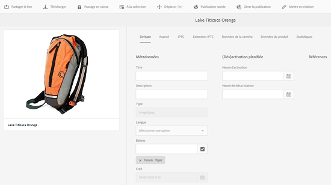

# Modification ou ajout de métadonnées {#how-to-edit-or-add-metadata}

Les métadonnées sont des informations supplémentaires sur la ressource qui peuvent faire l’objet d’une recherche. Elles sont automatiquement extraites lorsque vous chargez une image. Vous pouvez modifier les métadonnées existantes ou ajouter de nouvelles propriétés de métadonnées à des champs existants (par exemple lorsqu’un champ de métadonnées est vide).

Étant donné que les entreprises ont besoin de vocabulaires de métadonnées contrôlés et fiables, AEM Assets ne permet pas l’ajout ad hoc de nouvelles propriétés de métadonnées. Bien que les auteurs ne puissent pas ajouter de nouveaux champs de métadonnées aux ressources, les développeurs le peuvent. Voir [Création d’une propriété de métadonnées pour les ressources](meta-edit.md#editing-metadata-schema).

## Modification des métadonnées d’une ressource    {#editing-metadata-for-an-asset}

Pour modifier des métadonnées, procédez comme suit :

1. Utilisez l’une des méthodes suivantes :

   * Dans l’interface utilisateur d’Assets, sélectionnez la ressource et cliquez/appuyez sur l’icône **[!UICONTROL Afficher les propriétés]** dans la barre d’outils.
   * À partir de la miniature de la ressource, sélectionnez l’action rapide **[!UICONTROL Afficher les propriétés]**.
   * Dans la page de ressources, cliquez/appuyez sur l&#39;icône **[!UICONTROL Propriétés de la Vue]**  de la barre d&#39;outils.

   La page de la ressource affiche toutes les métadonnées de celle-ci. Ces métadonnées sont automatiquement extraites lorsqu’elles sont chargées (assimilées) dans AEM Assets.

   

1. Apportez des modifications aux métadonnées dans les différents onglets, le cas échéant. Une fois que vous avez terminé, cliquez/appuyez sur **[!UICONTROL Enregistrer]** dans la barre d’outils pour enregistrer vos modifications. Cliquez/appuyez sur **[!UICONTROL Fermer]** pour revenir à l’interface web d’Assets.

   >[!NOTE]
   >
   >Si un champ de texte est vide, cela signifie qu’aucune métadonnée n’a été définie. Vous pouvez saisir une valeur dans le champ et l’enregistrer pour ajouter cette propriété de métadonnées.

Toute modification apportée aux métadonnées d’une ressource est écrite dans les données XMP du binaire d’origine. par le biais du processus d’écriture différée des métadonnées d’AEM. Les modifications apportées aux propriétés existantes (telles que `dc:title`) sont écrasées et les propriétés qui viennent d’être créées (notamment les propriétés personnalisées telles que `cq:tags`) sont ajoutées en même temps que le schéma.

L’écriture différée XMP est prise en charge et activée pour les plates-formes et formats de fichiers répertoriés dans la section [Exigences techniques.](/help/sites-deploying/technical-requirements.md)

## Modification d’un schéma de métadonnées {#editing-metadata-schema}

Pour en savoir plus sur la modification d’un schéma de métadonnées, consultez la section [Modification de formulaires de schéma de métadonnées](metadata-schemas.md#editing-metadata-schema-forms).

## Enregistrement d’un espace de noms personnalisé dans AEM {#registering-a-custom-namespace-within-aem}

Vous pouvez ajouter vos propres espaces de noms à AEM. Tout comme il existe des espaces de noms prédéfinis tels que cq, jcr et sling, vous pouvez disposer d’un espace de noms pour le traitement des données XML et des métadonnées de votre référentiel.

1. Accédez à la page d’administration du type de noeud `https://[AEM_server]:[port]/crx/explorer/nodetypes/index.jsp`.
1. Cliquez ou appuyez sur **[!UICONTROL Espaces de noms]** en haut de la page. La page d’administration des espaces de noms s’affiche dans une fenêtre.

1. Pour ajouter un espace de noms, cliquez ou appuyez sur **[!UICONTROL Nouveau]** en bas de la page.
1. Spécifiez un espace de noms personnalisé dans la convention des espaces de noms XML (spécifiez l’identifiant sous la forme d’un URI et d’un préfixe), puis cliquez ou appuyez sur **[!UICONTROL Enregistrer]**.

## Conseils et restrictions {#best-practices-limitations}

* Les métadonnées sont mises à jour via Touch-UI pour modifier les propriétés de métadonnées dans l’espace de nommage `dc`. Toute mise à jour effectuée via l’API HTTP modifie les propriétés de métadonnées dans l’espace de nommage `jcr`. Voir [comment mettre à jour les métadonnées à l’aide de l’API HTTP](/help/assets/mac-api-assets.md#update-asset-metadata).

>[!MORELIKETHIS]
>
>* [À propos des métadonnées et de leurs besoins dans les ressources](metadata.md)