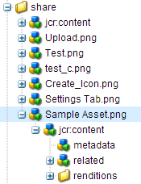

# Profils de métadonnées {#metadata-profiles}

Un profil de métadonnées vous permet d’appliquer des métadonnées par défaut aux fichiers d’un dossier. Créez un Profil de métadonnées et appliquez-le à un dossier. Tout fichier que vous téléchargez ensuite vers le dossier hérite des métadonnées par défaut que vous avez configurées dans le Profil de métadonnées.

## Ajout d’un profil de métadonnées {#adding-a-metadata-profile}

1. Tap or click the AEM logo and navigate to **[!UICONTROL Tools > Assets > Metadata Profiles]**, and then tap **[!UICONTROL Create]**.
1. Saisissez un titre pour le profil de métadonnées, par exemple, Exemple de métadonnées, puis cliquez sur **[!UICONTROL Envoyer]**. The **[!UICONTROL Edit Form]** for the Metadata Profile is displayed.

   

1. Cliquez sur un composant, puis configurez ses propriétés dans l’onglet **[!UICONTROL Paramètres]**. Cliquez par exemple sur le composant **[!UICONTROL Description]** et modifiez ses propriétés.

   

   Modifiez les propriétés suivantes pour le composant **[!UICONTROL Description]** :

   * **[!UICONTROL Libellé]** du champ : Nom d’affichage de la propriété de métadonnées. Il est uniquement disponible à titre de référence.
   * **[!UICONTROL Associer à la propriété]**: La valeur de cette propriété fournit le chemin/nom relatif au noeud de ressources où elle est enregistrée dans le référentiel. La valeur doit toujours être début avec `./` car elle indique que le chemin d’accès se trouve sous le noeud de la ressource.

   

   La valeur que vous indiquez pour **[!UICONTROL Associer à la propriété]** est stockée en tant que propriété sous le nœud de métadonnées de la ressource. Par exemple, si vous spécifiez . `/jcr:content/metadata/dc:desc` comme nom pour **[!UICONTROL Associer à la propriété]**, AEM Assets stocke la valeur `dc:desc` comme nœud de métadonnées de la ressource.

   * **[!UICONTROL Valeur par défaut]** : utilisez cette propriété pour ajouter une valeur par défaut pour le composant des métadonnées. Par exemple, si vous indiquez « Ma description », cette valeur est affectée à la propriété `dc:desc` au niveau du nœud de métadonnées de la ressource.

   

   >[!NOTE]
   >
   >Ajouter une valeur par défaut à une nouvelle propriété de métadonnées (qui n’existe pas déjà dans la . `/jcr:content/metadata` ) n’affiche pas par défaut la propriété et sa valeur sur la page **[!UICONTROL Propriétés]** de la ressource. To view the new property on the [!UICONTROL Properties] page of the asset, modify the corresponding schema form.

1. (Optional) Add more components to the **[!UICONTROL Edit Form]** from the **[!UICONTROL Build Form]** tab, and configure their properties in the **[!UICONTROL Settings]** tab. The following properties are available from the **[!UICONTROL Build Form]** tab:

| Composant | Propriétés |
|---|---|
| [!UICONTROL En-tête de section] | Field Label,   Description |
| [!UICONTROL Une seule ligne de texte] | Field Label,   Map to property,   Default Value |
| [!UICONTROL Texte à plusieurs valeurs] | Field Label,   Map to property,   Default Value |
| [!UICONTROL Nombre] | Field Label,   Map to property,   Default Value |
| [!UICONTROL Date] | Field Label,   Map to property,   Default Value |
| [!UICONTROL Balises standard] | Field Label,   Map to property,   Default Value,   Description |

1. Click **[!UICONTROL Done]**. The metadata profile is added to the list of profiles in the **[!UICONTROL Metadata Profiles]** page.

   

## Copie d’un profil de métadonnées {#copying-a-metadata-profile}

1. From the **[!UICONTROL Metadata Profiles]** page, select a profile to make a copy of it.

   

1. Click **[!UICONTROL Copy]** from the toolbar.
1. In the **[!UICONTROL Copy Metadata Profile]** dialog, enter a title for the new copy of the profile.
1. Cliquez sur **[!UICONTROL Copier]**. A copy of the profile appears in the list of profiles in the **[!UICONTROL Metadata Profiles]** page.

   

## Suppression d’un profil de métadonnées {#deleting-a-metadata-profile}

1. Dans la page **[!UICONTROL Profils de métadonnées]**, sélectionnez un profil à supprimer.

   

1. Click **[!UICONTROL Delete Metadata Profiles]** in the toolbar.
1. In the dialog box, click **[!UICONTROL Delete]** to confirm the delete operation. Le profil de métadonnées est supprimé de la liste.

## Application d’un profil de métadonnées à des dossiers {#applying-a-metadata-profile-to-folders}

Lorsque vous affectez un profil de métadonnées à un dossier, tout sous-dossier hérite automatiquement du profil de son dossier parent. Cela signifie que vous ne pouvez affecter qu’un seul profil de métadonnées à un dossier. Nous vous conseillons donc de choisir avec la plus grande attention la structure du dossier dans lequel vous transférez, stockez, utilisez et archivez des ressources.

Si vous avez affecté un profil de métadonnées différent à un dossier, le nouveau profil remplace le précédent. Les ressources du dossier précédent restent inchangées. Le nouveau profil est appliqué aux ressources ajoutées ultérieurement au dossier.

Les dossiers auxquels un profil est affecté sont indiqués dans l’interface utilisateur par le nom du profil apparaissant dans le nom de la carte.

Vous pouvez appliquer des profils de métadonnées à des dossiers spécifiques ou à l’ensemble des ressources.

### Application de profils de métadonnées à des dossiers spécifiques {#applying-metadata-profiles-to-specific-folders}

Vous pouvez appliquer un profil de métadonnées à un dossier à partir du menu **[!UICONTROL Outils]** ou, si vous êtes dans le dossier, à partir de **[!UICONTROL Propriétés]**. Cette section décrit comment appliquer des profils de métadonnées aux dossiers des deux manières.

Dans le cas des dossiers auxquels un profil est déjà affecté, le nom du profil est affiché directement sous celui du dossier.

#### Application de profils de métadonnées à des dossiers à partir de l’interface utilisateur des profils {#applying-metadata-profiles-to-folders-from-profiles-user-interface}

1. Appuyez sur le logo AEM et accédez à **[!UICONTROL Outils > Ressources > Profils de métadonnées]**.
1. Sélectionnez le profil de métadonnées à appliquer à un ou à plusieurs dossiers.

   

1. Appuyez sur **[!UICONTROL Appliquer le profil de métadonnées au ou aux dossiers]** et sélectionnez ensuite le(s) dossier(s) que vous souhaitez utiliser pour recevoir les ressources récemment chargées. Ensuite, appuyez sur **[!UICONTROL Terminé]**. Dans le cas des dossiers auxquels un profil est déjà affecté, le nom du profil est affiché directement sous celui du dossier.

#### Application de profils de métadonnées aux dossiers à partir des propriétés {#applying-metadata-profiles-to-folders-from-properties}

1. Dans le rail de gauche, appuyez sur **[!UICONTROL Ressources]**, puis accédez au dossier auquel vous souhaitez appliquer un profil de métadonnées.
1. Dans le dossier, appuyez sur la coche pour le sélectionner, puis sur **[!UICONTROL Propriétés]**.

1. Sélectionnez l’onglet **[!UICONTROL Profils de métadonnées]**, sélectionnez le profil dans le menu déroulant, puis cliquez sur **[!UICONTROL Enregistrer]**.

   

   Dans le cas des dossiers auxquels un profil est déjà affecté, le nom du profil est affiché directement sous celui du dossier.

### Application d’un profil de métadonnées à l’ensemble des ressources {#applying-a-metadata-profile-globally}

En plus d’appliquer un profil à un dossier, vous pouvez en appliquer un de façon globale, de sorte que tout contenu chargé dans AEM Assets soit traité par ce profil, indifféremment du dossier. Pour appliquer un profil de métadonnées globalement, procédez comme suit :

1. Utilisez l’une des méthodes suivantes :

   * Navigate to `https://[aem_server]:[port]/mnt/overlay/dam/gui/content/assets/foldersharewizard.html/content/dam` and apply the appropriate profile and tap or click **[!UICONTROL Save]**.

      

   * Accédez au nœud suivant de CRXDE Lite : `/content/dam/jcr:content`. Ajoutez la propriété `metadataProfile:/etc/dam/metadata/dynamicmedia/<name_of_metadata_profile>` et appuyez sur **[!UICONTROL Tout enregistrer]**.

      

## Remove a metadata profile from folders {#removing-a-metadata-profile-from-folders}

Lorsque vous supprimez un profil de métadonnées d’un dossier, tout sous-dossier hérite automatiquement de la suppression du profil de son dossier parent. Cependant, le traitement des fichiers qui s’est produit dans les dossiers reste intact.

Vous pouvez supprimer un profil de métadonnées d’un dossier à partir du menu **[!UICONTROL Outils]** ou, si vous êtes dans le dossier, à partir de **[!UICONTROL Propriétés]**. Cette section décrit comment supprimer des profils de métadonnées des dossiers des deux manières.

### Remove metadata profiles from folders via Profiles user interface {#removing-metadata-profiles-from-folders-via-profiles-user-interface}

Pour supprimer un profil de métadonnées des dossiers via l’interface utilisateur des Profils, procédez comme suit :

1. Appuyez sur le logo AEM et accédez à **[!UICONTROL Outils > Ressources > Profils de métadonnées]**.
1. Sélectionnez le profil de métadonnées à supprimer d’un ou de plusieurs dossiers.
1. Tap **[!UICONTROL Remove Metadata Profile from Folder(s)]** and select the folder or multiple folders you want use to remove a profile from, then tap **[!UICONTROL Done]**.

   Le fait que le nom du profil n’apparaît plus sous celui du dossier indique que le profil de métadonnées n’est plus appliqué à un dossier.

### Remove metadata profiles from folders by way of Properties {#removing-metadata-profiles-from-folders-via-properties}

1. Appuyez sur le logo AEM, puis accédez à **[!UICONTROL Ressources]** et au dossier duquel vous souhaitez supprimer un profil de métadonnées.
1. Dans le dossier, appuyez sur la coche pour le sélectionner, puis sur **[!UICONTROL Propriétés]**.
1. Sélectionnez l’onglet Profils **[!UICONTROL de]** métadonnées, puis **[!UICONTROL Aucun]** dans le menu déroulant. Appuyez sur **[!UICONTROL Save]** (Enregistrer).

Dans le cas des dossiers auxquels un profil est déjà affecté, le nom du profil est affiché directement sous celui du dossier.
